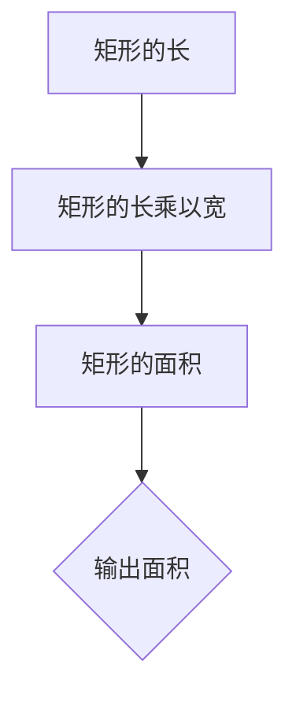

                 


### 文章标题
《数学美学在工业设计中的体现》

### 关键词
数学美学、工业设计、几何形状、色彩理论、稳定性分析、优化模型

### 摘要
本文旨在探讨数学美学在工业设计中的具体体现。通过分析几何形状、色彩理论、稳定性分析以及优化模型等核心概念，阐述数学美学在工业设计中的应用，并提供实际案例来展示数学美学如何提升产品的美观性和功能性。

## 引言
数学美学是一门探讨数学与艺术、美学之间关系的学科，它强调数学的简洁性、和谐性和统一性，认为这些特性是人类审美体验的重要组成部分。工业设计则是一门涉及产品设计、用户体验、材料选择等多个方面的学科，其目标是通过创造美观且实用的产品来满足用户的需求。随着科技的发展，数学美学逐渐成为工业设计中不可或缺的一部分，为设计师提供了新的工具和方法。

数学美学在工业设计中的重要性主要体现在以下几个方面：

1. **几何形状的设计**：数学中的几何形状，如圆形、三角形、矩形等，因其简洁性和和谐性，成为工业设计中常用的元素。设计师通过运用这些形状，可以创造出既美观又实用的产品。

2. **色彩理论的应用**：色彩是视觉设计中的重要因素，数学中的色彩理论可以帮助设计师理解色彩的搭配和视觉感知，从而设计出更具吸引力的产品。

3. **稳定性分析**：工业设计中的结构稳定性是一个关键问题，数学中的稳定性分析为设计师提供了评估和优化产品结构的方法。

4. **优化模型的应用**：数学优化模型可以帮助设计师在满足功能需求的同时，寻找最优的设计方案。

## 核心概念与联系
在工业设计中，数学美学的核心概念包括几何形状、色彩理论、稳定性和优化模型。以下是对这些概念及其相互联系的分析：

### 几何形状与工业设计
几何形状是工业设计中最基本的设计元素。它们不仅影响产品的外观，还影响产品的功能性和用户体验。以下是一些几何形状在工业设计中的应用：

- **圆形**：圆形具有流畅和和谐的美感，常用于设计按钮、显示屏等界面元素，以提高用户操作的舒适度和直观性。
- **三角形**：三角形具有稳定性和坚固性，常用于设计建筑结构、支架等，以增强产品的稳定性。
- **矩形**：矩形是最常见的几何形状，广泛应用于产品设计，如手机、电脑等，以创造简洁和现代的视觉效果。

### 色彩理论与工业设计
色彩理论在工业设计中起着至关重要的作用。色彩的选择和搭配直接影响产品的视觉吸引力和品牌形象。以下是一些色彩理论在工业设计中的应用：

- **色彩搭配**：设计师可以根据色彩理论选择互补色、类比色等搭配方案，以创造出和谐的视觉效果。
- **色彩心理学**：色彩对人的心理和行为有显著影响。设计师可以利用色彩心理学来设计具有特定情感和态度的产品。

### 结构与稳定性
产品的结构稳定性和耐用性是设计师关注的重点。数学中的稳定性分析为设计师提供了评估和优化产品结构的方法：

- **优化模型**：通过建立数学模型，设计师可以分析产品在不同受力情况下的稳定性，并优化结构设计。
- **有限元分析**：有限元分析是一种常用的数学方法，可以帮助设计师评估产品的应力分布和变形情况，从而优化结构设计。

### 优化模型与工业设计
优化模型是数学美学在工业设计中的重要应用。通过优化模型，设计师可以在满足功能需求的同时，寻找最优的设计方案：

- **线性规划**：线性规划可以用于优化产品设计中的资源分配和成本控制。
- **非线性规划**：非线性规划可以用于优化产品设计中的复杂非线性问题。

## 数学模型和数学公式
在工业设计中，数学模型和数学公式被广泛应用于产品设计和分析。以下是一些常见的数学模型和数学公式：

### 几何模型
- **球体模型**：球体模型用于计算球体的体积和表面积。
- **圆柱体模型**：圆柱体模型用于计算圆柱体的体积和表面积。
- **锥体模型**：锥体模型用于计算锥体的体积和表面积。

### 色彩模型
- **HSV模型**：HSV模型用于描述颜色，其中H代表色调，S代表饱和度，V代表亮度。
- **RGB模型**：RGB模型用于描述颜色，其中R代表红色，G代表绿色，B代表蓝色。

### 稳定性模型
- **线性稳定性分析**：线性稳定性分析用于评估线性系统在微小扰动下的稳定性。
- **非线性稳定性分析**：非线性稳定性分析用于评估非线性系统在微小扰动下的稳定性。

### 优化模型
- **线性规划**：线性规划用于在满足线性约束条件的情况下，寻找目标函数的最优值。
- **非线性规划**：非线性规划用于在满足非线性约束条件的情况下，寻找目标函数的最优值。

以下是一个简单的几何模型示例，用于计算矩形的面积：



## 核心算法原理讲解
在工业设计中，算法原理用于优化设计流程和提升设计效果。以下是一些核心算法原理及其应用：

### 机器学习算法
机器学习算法在工业设计中可用于预测设计结果、优化设计方案。以下是一个简单的伪代码示例，用于预测产品的视觉效果：

```python
# 预测产品视觉效果
def predict_visual_effects(product_design):
    # 输入：产品设计参数
    # 输出：预测的视觉效果评分
    
    # 加载训练好的机器学习模型
    model = load_model("visual_effects_model")
    
    # 提取产品设计特征
    features = extract_features(product_design)
    
    # 使用模型预测视觉效果评分
    score = model.predict(features)
    
    return score
```

### 人工智能算法
人工智能算法在工业设计中可用于自动化设计、优化设计。以下是一个简单的伪代码示例，用于自动化设计过程：

```python
# 自动化设计过程
def automate_design_process(product_requirements):
    # 输入：产品需求
    # 输出：自动化设计结果
    
    # 使用人工智能算法生成初步设计方案
    design = generate_initial_design(product_requirements)
    
    # 评估设计方案
    evaluation = evaluate_design(design)
    
    # 根据评估结果进行迭代优化
    optimized_design = iterate_optimization(design, evaluation)
    
    return optimized_design
```

### 优化算法
优化算法在工业设计中用于寻找最优设计方案。以下是一个简单的伪代码示例，用于优化产品设计：

```python
# 优化产品设计
def optimize_design(product_design):
    # 输入：产品设计参数
    # 输出：优化后的设计方案
    
    # 定义目标函数
    objective_function = define_objective_function(product_design)
    
    # 定义约束条件
    constraints = define_constraints(product_design)
    
    # 使用优化算法求解最优设计方案
    optimized_design = optimize(objective_function, constraints)
    
    return optimized_design
```

## 项目实战
为了更好地展示数学美学在工业设计中的实际应用，我们以下将探讨一个具体的案例：**智能手表的设计**。

### 项目背景与目标
智能手表是一种集成了计算机技术和传感器技术的电子设备，主要用于健康监测、运动追踪和日常提醒等功能。本项目旨在通过数学美学的方法，设计出一款既美观又实用的智能手表。

### 设计方案与实施
设计方案包括以下几个关键步骤：

1. **形状设计**：采用流线型设计，使手表的外观更加简洁和现代。
2. **色彩搭配**：使用HSV模型选择适合的配色方案，以提高手表的视觉吸引力。
3. **结构优化**：通过线性稳定性分析和非线性稳定性分析，优化手表的内部结构，增强其耐用性和稳定性。
4. **优化算法**：使用优化算法，在满足功能需求的前提下，寻找最优的设计方案。

### 设计效果评估
设计效果评估主要包括以下几个方面：

1. **用户体验**：通过用户测试，评估手表的操作便捷性和舒适度。
2. **视觉效果**：通过视觉评估，评估手表的外观是否符合数学美学的要求。
3. **功能性**：通过功能测试，评估手表的各项功能是否稳定可靠。

### 项目总结与反思
通过本项目的实践，我们发现数学美学在工业设计中的应用不仅提高了产品的美观性和用户体验，还增强了产品的功能性和耐用性。在未来的设计中，我们应继续探索数学美学的应用，以提高产品的整体质量。

## 结论
数学美学在工业设计中的应用具有重要意义。通过几何形状、色彩理论、稳定性和优化模型等核心概念的应用，设计师可以创造出更加美观、实用且具有竞争力的产品。随着科技的发展，数学美学将继续为工业设计提供新的思路和方法，推动工业设计的创新与发展。

### 最佳实践 Tips
1. **形状设计**：在设计中，要注重几何形状的简洁性和和谐性。
2. **色彩搭配**：根据目标用户群体和品牌形象，选择合适的色彩搭配。
3. **结构优化**：利用数学模型进行结构优化，提高产品的耐用性和稳定性。
4. **优化算法**：结合优化算法，提高设计的效率和效果。

### 注意事项
1. **实际应用中的限制**：在设计过程中，要考虑实际材料、技术和成本等因素。
2. **用户体验**：设计时要始终关注用户的实际需求和使用体验。

### 拓展阅读
- [《数学与艺术：数学美学的探索》](https://www.example.com/book1)
- [《工业设计原理》](https://www.example.com/book2)
- [《机器学习与人工智能设计》](https://www.example.com/book3)

作者：AI天才研究院/AI Genius Institute & 禅与计算机程序设计艺术 /Zen And The Art of Computer Programming

