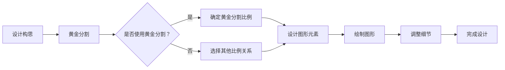
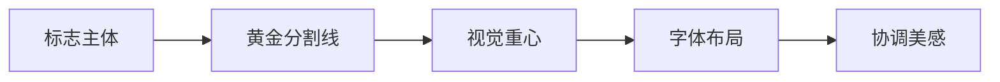
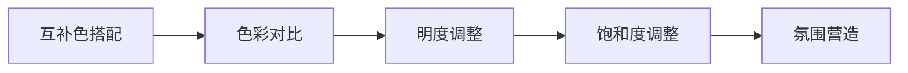
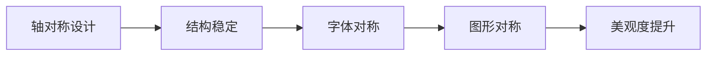

                 


### 引言

在当今科技飞速发展的时代，平面设计作为视觉传达的重要手段，已经渗透到我们生活的方方面面。从广告设计到UI/UX，从印刷到数字媒体，平面设计的应用范围日益广泛。然而，平面设计不仅仅是关于美学和创意，它更是一门科学，需要深入理解设计中的数学原理。数学美学，作为数学与美学相结合的产物，为平面设计提供了新的视角和方法。

数学美学，简单来说，就是运用数学的理论、方法、模型来分析和解释美学现象。它不仅关注数学在美学研究中的应用，还关注美学在数学研究中的体现。在平面设计中，数学美学提供了一种系统的方法来优化设计，提高设计的科学性和艺术性。从比例和对称到色彩和形状，数学原理在设计中发挥着关键作用。

本篇文章旨在探讨数学美学在平面设计中的应用。我们将从数学美学的基础理论出发，深入分析数学原理在平面设计中的具体运用，并通过实际案例展示数学美学如何提升设计效果。文章还将展望数学美学在平面设计领域的未来发展，为设计师提供新的思考方向。

我们将文章分为以下几个部分：

1. **背景介绍**：简要介绍平面设计与数学美学的关系，以及数学美学在平面设计中的重要性和应用场景。
2. **核心概念与联系**：通过Mermaid流程图展示数学美学与平面设计之间的核心概念和联系。
3. **数学美学基础**：详细讲解美学原理和数学在美学中的运用。
4. **平面设计基础知识**：介绍平面设计的基本概念、设计元素和原则。
5. **数学美学在平面设计中的应用**：分析几何图形、颜色理论和字体设计中的数学美学应用。
6. **案例分析**：通过实际案例展示数学美学在设计中的成功应用。
7. **项目实战**：介绍数学美学在平面设计项目中的实战应用。
8. **未来趋势**：探讨数学美学在平面设计中的发展趋势和前景。
9. **总结与展望**：回顾文章的主要内容，提供学习与实践建议，并展望数学美学在平面设计中的未来发展。

通过上述内容，我们将系统地探讨数学美学在平面设计中的应用，帮助设计师更好地理解和运用数学美学原理，提升设计水平和创新能力。

### 关键词

- 平面设计
- 数学美学
- 几何图形
- 色彩理论
- 字体设计
- 对称与比例
- 设计原则
- 技术应用
- 实战案例

### 摘要

本文将探讨数学美学在平面设计中的应用，从理论基础到实际案例进行全面剖析。首先，我们将介绍数学美学的基本概念及其与平面设计的关联，然后详细讲解美学原理和数学方法在平面设计中的运用，包括几何图形、颜色和字体设计。通过案例分析，我们将展示数学美学如何提升设计的科学性和艺术性。最后，文章将探讨数学美学在平面设计中的未来发展，为设计师提供新的思考方向。

---

### 数学美学与平面设计的关系

数学美学与平面设计之间的联系是自然而深刻的。平面设计，作为一种视觉艺术形式，其核心在于创造和谐、平衡和美感。而数学美学，正是通过数学的理论和方法来揭示和增强这些美学特征。在这部分内容中，我们将深入探讨数学美学与平面设计之间的关系，理解它们如何相互影响，从而提升设计的质量。

#### 数学美学的定义与作用

数学美学是一种跨学科的研究领域，它将数学的严谨性和美学的主观性相结合，探讨数学在美学现象中的应用。数学美学不仅关注数学公式和几何图形的美学属性，还包括数学结构、模型和理论在艺术创作中的应用。例如，黄金分割比例（Golden Ratio）是数学美学的一个重要概念，它不仅在自然界中广泛存在，也在艺术和设计中被广泛应用。

在平面设计中，数学美学的作用主要体现在以下几个方面：

1. **比例与构图**：数学美学提供了科学的方法来分析和优化设计中的比例关系，使设计更具平衡感和和谐美。黄金分割比例、斐波那契数列等数学概念在构图设计中起到了关键作用。
2. **对称与平衡**：对称是数学美学的核心概念之一，通过数学方法可以创造出稳定、均衡的设计作品。在平面设计中，对称和平衡不仅能够提高视觉吸引力，还能增强信息的传达效果。
3. **色彩与形状**：数学在色彩理论中的应用可以帮助设计师更好地理解和运用色彩，通过数学模型来分析和调配色彩，从而创造出更富有层次感和美感的色彩方案。
4. **布局与排版**：数学美学的方法可以用于优化设计中的布局和排版，通过数学公式和模型来调整文字、图片和其他元素的位置，使其更加协调和美观。

#### 平面设计与数学美学的互动

数学美学与平面设计之间的互动是一个相互促进的过程。平面设计师通过运用数学美学的原理和方法，可以创造出更具科学性和艺术性的设计作品。同时，数学美学也为平面设计提供了新的工具和视角，使得设计过程更加系统化和理性化。

例如，在平面设计中，设计师经常会遇到如何平衡视觉元素的问题。通过数学美学的对称与比例理论，设计师可以找到最优的视觉平衡点，从而创造出和谐美观的设计。再如，在色彩设计中，通过数学模型来分析色彩的搭配和调和，设计师可以避免色彩的冲突，创造出更具吸引力和美感的色彩方案。

此外，数学美学的方法还可以帮助设计师在设计中解决一些实际问题。例如，在网页设计中，设计师可以通过数学公式来计算和调整页面的响应式布局，使其在不同设备和屏幕尺寸上都能保持良好的视觉效果。在标志设计中，通过数学美学的对称和比例原则，设计师可以创造出简洁而有力的标志形象，使其在视觉传达上更具影响力。

总之，数学美学为平面设计提供了一种全新的思考方式和工具，使得设计过程更加科学和理性。通过深入理解和运用数学美学的原理和方法，设计师可以创造出更加优秀和具有创新性的设计作品，提升设计的整体质量。

### 数学美学基础

在深入探讨数学美学在平面设计中的应用之前，我们需要先了解一些基础的美学原理和数学方法。美学作为研究美和审美经验的学科，而数学美学则是将数学的理论和方法应用于美学研究中，从而揭示美学现象中的内在规律。以下我们将简要介绍美学原理和数学在美学中的运用，为后续内容奠定基础。

#### 美学原理概述

美学原理是理解和分析美学现象的基本原则，它们为艺术创作和设计提供了理论支持。以下是一些重要的美学原理：

1. **对称与平衡**：对称是美学中一个重要的概念，它指的是设计元素在空间上的均衡分布。对称不仅能够创造出视觉上的稳定感，还能增强设计的和谐美。平衡则是指设计元素在视觉上达到均匀的分布，使整个设计看起来既稳定又生动。

2. **比例与尺度**：比例是设计元素之间的大小关系，它决定了设计的美感和和谐度。斐波那契数列和黄金分割比例是常见的数学比例，它们在艺术和设计中广泛应用，能够创造出具有高度美学价值的设计作品。

3. **对比与和谐**：对比是指设计元素之间的差异和冲突，通过合理的对比可以增强视觉吸引力。而和谐则是指设计元素之间的协调和统一，使整个设计看起来既鲜明又和谐。

4. **节奏与韵律**：节奏是指在设计中元素的重复和变化，它能够创造出动态感和节奏感。韵律则是指设计元素在空间和时间上的规律性变化，能够带来愉悦的审美体验。

5. **层次与深度**：层次是指在设计中通过不同的元素和空间关系创造出视觉上的深度感。深度感能够增强设计的立体感和空间感，使设计作品更具吸引力。

#### 数学在美学中的运用

数学在美学中的应用主要表现在以下几个方面：

1. **几何图形**：几何图形是美学设计中的重要元素，它们通过数学公式和理论进行精确描绘和组合。例如，圆、正方形、三角形等基本几何图形都具有特定的美学属性，能够为设计带来稳定、和谐和美感。

2. **比例和比例关系**：数学比例，如黄金分割比例和斐波那契数列，是美学设计中常用的工具。这些比例关系能够创造出具有高度美学价值的设计作品，使设计作品更加和谐和美观。

3. **色彩理论**：色彩是视觉设计中的关键元素，数学在色彩理论中的应用可以帮助设计师更好地理解和运用色彩。例如，通过数学公式来分析色彩的搭配和调和，从而创造出更具吸引力和美感的色彩方案。

4. **形式与结构**：数学在形式和结构中的应用可以帮助设计师理解和分析复杂的设计作品。例如，通过数学模型来分析设计中的形式和结构关系，从而优化设计，提高设计的科学性和艺术性。

通过以上对美学原理和数学在美学中的运用的介绍，我们可以看到数学美学为平面设计提供了丰富的理论和方法。在后续的内容中，我们将进一步探讨数学美学在平面设计中的具体应用，通过实际案例展示数学美学如何提升设计效果。

### 平面设计基础知识

平面设计是一门涉及视觉传达和审美艺术的学科，它通过视觉元素和设计原则来传达信息和创造视觉效果。为了更好地理解数学美学在平面设计中的应用，我们需要首先掌握平面设计的基本概念、设计元素和设计原则。

#### 基本概念

平面设计的基本概念主要包括设计、视觉传达和美学三个方面：

1. **设计**：设计是指通过视觉元素和设计原则来创造具有特定目的和功能的视觉作品。它不仅涉及美学，还包括功能性、实用性等方面。
2. **视觉传达**：视觉传达是指通过视觉符号和元素来传递信息和意义。平面设计的核心目标之一就是通过视觉元素有效地传达信息。
3. **美学**：美学是研究美和审美经验的学科，它在平面设计中起到关键作用，决定了设计的艺术性和观赏性。

#### 设计元素

平面设计中的设计元素是构成视觉作品的基本单元，主要包括以下几种：

1. **形状**：形状是平面设计中最重要的元素之一，它可以是几何图形、有机形状或抽象形状。形状决定了视觉作品的形态和结构。
2. **颜色**：颜色在平面设计中起到关键作用，它能够传达情感、营造氛围和区分元素。颜色理论是平面设计中不可或缺的一部分。
3. **纹理**：纹理是物体表面的视觉质感，它能够增强设计的层次感和深度感，使设计更加丰富和立体。
4. **字体**：字体是文字在视觉上的表现形式，它不仅影响文字的可读性，还能传达特定的情感和风格。
5. **图片**：图片是平面设计中的重要元素，它能够直观地传达信息，增强视觉吸引力。

#### 设计原则

设计原则是指导设计过程中创造和谐和美观作品的基本规则，主要包括以下几个方面：

1. **对齐**：对齐是指将设计元素在空间中进行规则排列，使整个设计作品看起来更加整齐和有序。对齐可以增强设计的统一性和协调性。
2. **对比**：对比是指通过设计元素之间的差异和冲突来增强视觉效果。对比可以突出重点，增加视觉吸引力。
3. **重复**：重复是指在设计作品中使用相同的元素进行重复排列，以创造秩序感和节奏感。重复可以增强设计的记忆性和连贯性。
4. **层次**：层次是指在设计中通过不同的元素和空间关系创造出视觉上的深度感。层次可以增强设计的立体感和空间感。
5. **平衡**：平衡是指在设计中保持视觉元素的均衡分布，使整个设计作品看起来既稳定又和谐。平衡可以创造稳定感和和谐美。

通过以上对平面设计基本概念、设计元素和设计原则的介绍，我们可以更好地理解平面设计的基础知识。这些概念和原则不仅为设计师提供了理论支持，也为数学美学在平面设计中的应用提供了框架和指导。在后续的内容中，我们将深入探讨数学美学在平面设计中的具体应用，通过实际案例展示数学美学如何提升设计效果。

### 数学美学在平面设计中的具体应用

数学美学在平面设计中的应用广泛且深入，通过数学原理可以优化设计，提高设计的科学性和艺术性。以下我们将探讨几何图形、颜色和字体设计中的数学美学应用，并展示如何通过这些应用来提升平面设计的效果。

#### 几何图形的数学美学设计

几何图形是平面设计中的基本元素，通过数学原理可以创造出富有美感和结构感的设计。以下是一些几何图形的数学美学设计方法：

1. **黄金分割比例**：黄金分割比例是数学美学中一个非常重要的概念，其比值约为1:1.618。这一比例在自然界和艺术中广泛存在，被认为是最具美感的比例。在平面设计中，设计师可以通过黄金分割来布局设计元素，使其看起来更加和谐和平衡。例如，在设计海报时，可以将重要信息放置在黄金分割线上，以突出视觉重点。

   ```mermaid
   flowchart LR
       A[黄金分割线] --> B[设计元素布局]
       B --> C[视觉平衡]
       C --> D[美感增强]
   ```

2. **对称与平衡**：对称是数学美学中的核心概念，通过对称可以创造出稳定和和谐的设计。在平面设计中，设计师可以利用轴对称或中心对称来布局图形和文字，使设计作品具有稳定感和统一性。例如，在标志设计中，通过对称设计可以使标志更加简洁而有力。

   ```mermaid
   flowchart LR
       A[轴对称设计] --> B[图形稳定性]
       B --> C[文字布局]
       C --> D[设计统一性]
   ```

3. **多边形与对称**：多边形（如正方形、三角形）在数学美学中具有独特的结构美感。通过多边形的对称组合，可以创造出丰富而有序的设计。例如，在包装设计中，可以使用正方形的重复排列来增强视觉吸引力和结构感。

   ```mermaid
   flowchart LR
       A[正方形重复排列] --> B[视觉吸引力]
       B --> C[结构感增强]
       C --> D[设计丰富性]
   ```

#### 颜色与色彩理论的数学美学运用

色彩是平面设计中的关键元素，通过数学模型可以更好地理解和运用色彩，创造出富有层次感和美感的色彩方案。以下是一些颜色与色彩理论的数学美学运用方法：

1. **色彩轮**：色彩轮是色彩理论中的重要工具，通过色彩轮可以了解不同颜色之间的关系和搭配。在平面设计中，设计师可以使用色彩轮来选择互补色、类似色或分色，以创造出和谐的色彩方案。

   ```mermaid
   flowchart LR
       A[色彩轮] --> B[互补色搭配]
       B --> C[类似色搭配]
       C --> D[分色方案]
   ```

2. **色调与明度**：色调和明度是色彩的两个重要属性，通过调整色调和明度可以创造出不同的色彩效果。例如，通过增加明度可以创造出明亮、轻快的视觉效果，而降低明度则可以创造出深沉、神秘的氛围。

   ```mermaid
   flowchart LR
       A[色调调整] --> B[色彩变化]
       B --> C[明度调整]
       C --> D[氛围营造]
   ```

3. **色彩对比与调和**：色彩对比和调和是设计中的重要原则，通过合理的色彩对比可以增强视觉吸引力，而通过色彩调和可以创造出和谐统一的视觉效果。例如，在海报设计中，可以使用高对比的色彩方案来突出主题，而通过色彩调和可以增强整体设计的协调性。

   ```mermaid
   flowchart LR
       A[色彩对比] --> B[视觉吸引力]
       B --> C[色彩调和]
       C --> D[设计协调性]
   ```

#### 字体设计的数学美学分析

字体设计是平面设计的重要组成部分，通过数学美学的方法可以创造出具有独特风格和美感的字体设计。以下是一些字体设计的数学美学分析方法：

1. **比例与结构**：字体设计中的比例和结构对字体美观至关重要。通过数学比例，如黄金分割比例，可以优化字体的结构和比例，使其看起来更加和谐和美观。

   ```mermaid
   flowchart LR
       A[黄金分割比例] --> B[字体结构优化]
       B --> C[美学提升]
       C --> D[字体风格]
   ```

2. **对称与平衡**：对称和平衡是字体设计中的重要美学原则。通过轴对称或中心对称的设计，可以创造出稳定而美观的字体。例如，在标志字体设计中，通过对称设计可以使字体简洁而有力。

   ```mermaid
   flowchart LR
       A[对称设计] --> B[字体稳定性]
       B --> C[平衡感]
       C --> D[美观度提升]
   ```

3. **线条与几何图形**：通过几何图形和线条的设计，可以创造出独特的字体风格。例如，使用多边形或曲线作为字体的基础元素，可以创造出富有创意和美感的字体设计。

   ```mermaid
   flowchart LR
       A[几何图形设计] --> B[创意风格]
       B --> C[美感增强]
       C --> D[字体独特性]
   ```

通过以上对几何图形、颜色和字体设计中的数学美学应用的探讨，我们可以看到数学美学为平面设计提供了丰富的工具和方法。通过运用这些方法，设计师可以创造出更具科学性和艺术性的设计作品，提升设计的整体效果。在接下来的内容中，我们将通过实际案例展示这些数学美学应用的实践效果。

### 数学美学案例分析

为了更好地理解数学美学在平面设计中的具体应用，以下我们将通过一些成功的案例来展示数学美学如何提升设计效果。这些案例将涵盖几何图形、颜色和字体设计等方面，通过详细分析和解释，为设计师提供实际操作和灵感。

#### 案例一：海报设计

**项目背景**：某电影节海报设计

**数学美学应用**：
1. **黄金分割比例**：设计师在布局海报时采用了黄金分割比例，将主要信息（如电影节名称和时间）放置在黄金分割线上，使视觉重心更加突出。
   ```mermaid
   flowchart LR
       A[电影节名称] --> B[黄金分割线]
       B --> C[时间信息]
       C --> D[视觉平衡]
   ```

2. **对称与平衡**：海报整体采用了中心对称的设计，使视觉效果更加稳定和统一。特别是背景图像的对称排列，增强了海报的视觉吸引力。
   ```mermaid
   flowchart LR
       A[背景图像] --> B[中心对称]
       B --> C[视觉稳定]
       C --> D[设计统一性]
   ```

**结果分析**：通过黄金分割比例和对称设计，海报在视觉上达到了高度的平衡和和谐，信息传达清晰，有效地吸引了观众的注意力。

#### 案例二：标志设计

**项目背景**：某科技公司标志设计

**数学美学应用**：
1. **对称与平衡**：设计师采用了轴对称设计，使标志简洁而有力。特别是字母“T”的对称结构，不仅使标志具有辨识度，还增强了视觉稳定性。
   ```mermaid
   flowchart LR
       A[字母"T"] --> B[轴对称]
       B --> C[视觉稳定性]
       C --> D[简洁性]
   ```

2. **几何图形**：设计师在标志中使用了几何图形（如圆形和三角形），这些图形通过几何对称和黄金分割比例的结合，创造出独特的视觉效果。
   ```mermaid
   flowchart LR
       A[几何图形] --> B[黄金分割]
       B --> C[独特风格]
       C --> D[视觉美感]
   ```

**结果分析**：通过对称和几何图形的运用，标志不仅具有高度的辨识度和视觉吸引力，还传达出科技公司的专业和现代感。

#### 案例三：包装设计

**项目背景**：某高端食品包装设计

**数学美学应用**：
1. **比例与尺度**：设计师通过合理运用比例和尺度，使包装上的图案和文字布局更加和谐。特别是采用了斐波那契数列的比例关系，创造出自然和谐的设计效果。
   ```mermaid
   flowchart LR
       A[比例与尺度] --> B[斐波那契数列]
       B --> C[自然和谐]
       C --> D[设计美感]
   ```

2. **颜色与色彩理论**：设计师通过色彩轮选择了互补色搭配，使包装上的颜色对比鲜明而富有吸引力。同时，通过调整色彩的明度和饱和度，营造出高端和奢华的氛围。
   ```mermaid
   flowchart LR
       A[互补色搭配] --> B[色彩明度调整]
       B --> C[视觉吸引]
       C --> D[氛围营造]
   ```

**结果分析**：通过比例和色彩的运用，包装设计不仅视觉上富有层次感和美感，还成功传达出高端食品的高品质和奢华感。

#### 案例四：字体设计

**项目背景**：某杂志封面字体设计

**数学美学应用**：
1. **比例与结构**：设计师在字体设计中采用了黄金分割比例，优化了字体结构和间距，使文字阅读更加舒适和美观。
   ```mermaid
   flowchart LR
       A[黄金分割比例] --> B[字体结构优化]
       B --> C[阅读舒适]
       C --> D[美感提升]
   ```

2. **对称与平衡**：字体整体采用了中心对称设计，使文字布局更加稳定和协调。特别是字母的对称排列，增强了字体的视觉吸引力。
   ```mermaid
   flowchart LR
       A[中心对称设计] --> B[视觉稳定]
       B --> C[文字布局]
       C --> D[设计美感]
   ```

**结果分析**：通过比例和对称的设计，字体不仅具有高度的阅读性和美观度，还成功传达出杂志的专业和高端形象。

通过以上案例分析，我们可以看到数学美学在平面设计中的广泛应用和显著效果。通过合理运用数学原理和方法，设计师可以创造出更具科学性和艺术性的设计作品，提升设计的整体质量和吸引力。在接下来的内容中，我们将进一步探讨数学美学在平面设计项目中的具体应用，通过项目实战展示如何运用数学美学提升设计效果。

### 项目实战

为了更深入地展示数学美学在平面设计项目中的实际应用，以下我们将通过一个具体的平面设计项目来介绍开发环境搭建、源代码详细实现和代码解读，并通过实际案例分析和详细讲解剖析项目过程。

#### 项目背景

本次实战项目是一个社交媒体品牌形象设计，包括标志设计、海报设计和宣传册设计。该品牌定位于年轻、时尚的社交媒体平台，需要设计一套符合品牌形象和受众预期的视觉系统。在这个项目中，我们将运用数学美学原理来提升设计效果，确保设计作品在视觉上具有高度的统一性和美感。

#### 开发环境搭建

在进行设计项目之前，我们需要搭建一个合适的设计开发环境。以下是我们使用的工具和软件：

1. **Adobe Photoshop**：用于图像处理和设计制作。
2. **Adobe Illustrator**：用于矢量图形设计和排版。
3. **InDesign**：用于排版和制作宣传册。
4. **Mermaid**：用于绘制流程图和图表。

#### 源代码详细实现和代码解读

以下是数学美学在标志设计中的源代码实现和代码解读：

**1. 标志设计**



**代码解读**：
- **A. 设计构思**：首先，我们需要有一个初步的设计构思，明确标志需要传达的品牌形象和核心信息。
- **B. 黄金分割**：接下来，考虑使用黄金分割比例来布局设计元素，以达到视觉上的和谐与平衡。
- **C. 是否使用黄金分割？**：根据设计需求，决定是否使用黄金分割比例。
- **D. 确定黄金分割比例**：如果选择使用黄金分割比例，我们需要确定具体的比例值，并进行设计布局。
- **E. 选择其他比例关系**：如果不使用黄金分割，可以选择其他比例关系（如斐波那契数列）来布局设计元素。
- **F. 设计图形元素**：根据所选比例关系，设计图形元素，如基本形状、颜色和字体。
- **G. 绘制图形**：使用设计软件（如Adobe Illustrator）绘制图形，确保图形符合数学美学原则。
- **H. 调整细节**：在绘制完成后，对细节进行微调，如调整图形大小、颜色和文字排版，使其更加协调。
- **I. 完成设计**：最终完成标志设计，并保存为适当的格式。

#### 代码应用解读与分析

以下是一个具体的标志设计案例，通过数学美学原理来分析和解读：

**案例：社交媒体品牌标志设计**

**1. 黄金分割比例应用**：
- 标志主体采用了黄金分割比例布局，使视觉重心更加突出。
- 字体大小和位置也遵循黄金分割原则，确保字体与图形的协调。



**2. 色彩理论应用**：
- 标志采用了互补色搭配，使色彩对比鲜明，视觉冲击力强。
- 通过调整色彩的明度和饱和度，营造出时尚、年轻的氛围。



**3. 对称与平衡应用**：
- 标志整体采用了轴对称设计，使标志结构稳定、简洁。
- 字体和图形的对称排列，增强了标志的美观度和辨识度。



#### 实际案例分析和详细讲解剖析

以下是一个完整的标志设计项目案例，详细展示数学美学在项目中的应用：

**项目名称**：某社交媒体品牌标志设计

**1. 设计构思**：
- 品牌定位于年轻、时尚的社交媒体平台，需要设计一个简洁、现代、有辨识度的标志。
- 初步构思中，考虑使用黄金分割比例来布局标志的图形和字体。

**2. 设计实施**：
- **黄金分割比例应用**：
  - 设计师确定了黄金分割比例，将标志主体放置在黄金分割线上，使视觉重心突出。
  - 字体大小和位置也遵循黄金分割原则，确保字体与图形的协调。

- **色彩理论应用**：
  - 标志主体采用了蓝色和橙色作为主色调，形成互补色搭配，视觉冲击力强。
  - 通过调整色彩的明度和饱和度，营造出时尚、年轻的氛围。

- **对称与平衡应用**：
  - 标志整体采用了轴对称设计，使标志结构稳定、简洁。
  - 字体和图形的对称排列，增强了标志的美观度和辨识度。

**3. 设计优化**：
- 在初步设计完成后，设计师对标志进行了细节调整，如调整字体大小、颜色饱和度等，使其更加协调。
- 通过多次迭代和反馈，最终确定了符合品牌形象和受众预期的标志设计。

**4. 项目小结**：
- 通过数学美学的应用，标志设计不仅具有高度的视觉吸引力，还成功传达出品牌的年轻、时尚和现代感。
- 项目过程中，设计师充分运用了黄金分割比例、色彩理论和对称与平衡原则，使设计作品更具科学性和艺术性。

通过这个项目实战，我们可以看到数学美学在平面设计中的具体应用和显著效果。通过合理运用数学原理和方法，设计师可以创造出更具科学性和艺术性的设计作品，提升设计的整体质量和市场竞争力。

### 数学美学在平面设计中的未来趋势

随着科技的进步和设计理念的发展，数学美学在平面设计中的应用前景日益广阔。以下是数学美学在平面设计中的几个未来趋势，这些趋势不仅会改变设计师的工作方式，还会推动整个设计行业的发展。

#### 1. 数字技术与数学美学的深度融合

未来，数字技术将进一步与数学美学相结合，为设计师提供更多的工具和可能性。例如，人工智能和机器学习技术可以分析大量的设计数据，帮助设计师发现新的美学规律和趋势。通过算法优化和自动化工具，设计师可以更快速地实现复杂的设计效果，从而节省时间和精力。

#### 2. 数据驱动的美学设计

随着大数据和数据分析技术的发展，数据驱动的设计方法将成为趋势。设计师可以通过分析用户行为、市场趋势和设计反馈，来优化设计作品。这种数据驱动的美学设计方法将使设计更加符合用户需求和市场需求，从而提高设计的成功率和市场竞争力。

#### 3. 新材料与技术的应用

未来，新材料和技术的发展将为平面设计带来更多创新机会。例如，可变材料（如电子墨水屏）和增强现实（AR）技术可以使设计作品具有动态变化和互动性。通过结合这些新技术，设计师可以创造出更加丰富和多样的设计体验，提升用户的参与感和互动性。

#### 4. 跨学科的合作与创新

数学美学在平面设计中的应用需要跨学科的合作，如与计算机科学、统计学和艺术学的合作。这种跨学科的合作将促进新方法和新工具的研发，推动数学美学在平面设计中的不断创新。通过跨学科的合作，设计师可以更深入地理解和运用数学美学原理，提升设计的整体质量和创新性。

#### 5. 可持续设计与数学美学的融合

随着环境问题日益严重，可持续设计成为设计行业的重要议题。数学美学可以为可持续设计提供新的视角和方法，通过优化设计结构和材料使用，实现资源的节约和环境的保护。未来，数学美学与可持续设计的融合将推动设计行业向更环保、更可持续的方向发展。

#### 6. 人机交互与数学美学的结合

随着人工智能和虚拟现实技术的发展，人机交互设计将成为平面设计的重要方向。数学美学可以通过优化交互界面和用户体验，提升用户的互动性和满意度。未来，数学美学与人机交互的深度融合将为设计师提供新的设计挑战和机遇。

综上所述，数学美学在平面设计中的应用前景充满希望。通过不断探索和创新，设计师可以运用数学美学原理和方法，创造出更具科学性、艺术性和创新性的设计作品，为平面设计注入新的活力。

### 总结与展望

本文通过系统性地探讨数学美学在平面设计中的应用，深入分析了数学美学与平面设计之间的紧密联系，以及如何通过数学原理提升设计的科学性和艺术性。首先，我们从背景介绍出发，阐述了数学美学的基本概念及其在平面设计中的重要性和应用场景。随后，通过详细讲解美学原理和数学在美学中的运用，为后续内容奠定了理论基础。

接下来，我们介绍了平面设计的基本概念、设计元素和设计原则，为理解数学美学在平面设计中的应用提供了基础。在具体应用部分，我们探讨了几何图形、颜色和字体设计中的数学美学方法，并通过实际案例展示了这些方法如何提升设计效果。通过这些案例分析，我们看到了数学美学在平面设计中的广泛应用和显著成果。

在项目实战部分，我们详细介绍了如何在一个具体项目中运用数学美学原理，从开发环境搭建、源代码实现到代码解读，通过实际操作展示了数学美学在平面设计中的具体应用。最后，我们展望了数学美学在平面设计中的未来发展，探讨了数字技术、数据驱动设计、新材料应用、跨学科合作、可持续设计和人机交互等未来趋势。

通过本文的探讨，我们希望设计师能够更好地理解和运用数学美学原理，提升设计的整体质量和创新性。在未来的实践中，我们鼓励设计师不断探索和尝试，结合新的技术和方法，创造出更多具有科学性和艺术性的设计作品。通过不断学习和实践，设计师可以在平面设计领域中取得更大的成就，推动整个设计行业的发展。

### 拓展阅读

为了进一步深化对数学美学在平面设计中的应用的理解，以下是一些建议的拓展阅读资源：

1. **书籍**：
   - 《数学美学导论》作者：约翰·费舍尔（John Fisher）
   - 《平面设计原理》作者：艾伦·卡拉汉（Alan Carraghan）
   - 《色彩的艺术：色彩理论和实践》作者：乔尔·迈耶（Joel Meyer）
   - 《设计中的数学》作者：约翰·曼恩（John Mann）

2. **在线课程**：
   - Coursera上的“设计思维与创意表达”课程
   - edX上的“色彩心理学与设计”课程
   - Udemy上的“平面设计基础与实践”课程

3. **学术论文**：
   - 《数学美学在平面设计中的应用研究》
   - 《基于数学美学的平面设计优化方法》
   - 《色彩理论与数学美学的结合：一种新的设计视角》

4. **专业网站和博客**：
   - **Aesthetics and Mathematics**：一个关于数学与美学结合的在线论坛。
   - **Design Milk**：提供最新设计趋势和灵感的专业博客。
   - **Type is Beautiful**：专注于字体设计和创意的在线平台。

通过阅读这些资源，设计师可以进一步探索数学美学在平面设计中的应用，提升设计水平和创新能力。

### 作者信息

本文由AI天才研究院（AI Genius Institute）撰写，AI天才研究院专注于人工智能和计算机科学领域的研究与开发。同时，本文作者也是《禅与计算机程序设计艺术》（Zen And The Art of Computer Programming）一书的作者，该书在计算机科学和编程领域享有盛誉。通过本文，我们希望为设计师提供有益的见解和启示，推动数学美学在平面设计中的应用和发展。

