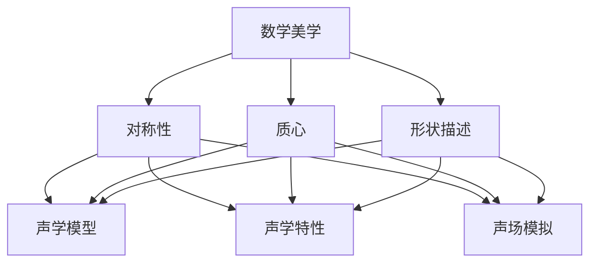

                 

### 文章标题

# 数学美学在建筑声学设计中的应用

### 文章关键词

数学美学、建筑声学、声学设计、声学模型、建筑设计

### 文章摘要

随着现代建筑的日益复杂，建筑声学设计成为了确保室内声环境舒适的重要环节。本文旨在探讨数学美学在建筑声学设计中的应用，通过深入剖析数学美学的基本概念、核心原理及其与建筑声学设计的紧密联系，为读者提供一种全新的设计思路和方法。本文将详细讲解赫尔姆霍茨共振器模型、声场建模以及对称性分析等数学模型和算法原理，并通过实际项目案例进行剖析，以展示数学美学在建筑声学设计中的实际应用效果。

## 背景介绍

建筑声学设计是建筑学中的一个重要分支，其主要目标是确保建筑内部具有良好的声环境。随着人们对生活品质要求的提高，对建筑声学设计的需求也越来越高。然而，传统的建筑声学设计方法往往依赖于经验判断和试验验证，这导致设计结果难以量化，且难以优化。因此，寻找一种科学、系统且可量化的设计方法成为了建筑声学设计的迫切需求。

数学美学作为一种将数学方法应用于艺术领域的理论体系，其在建筑声学设计中的应用提供了一种新的可能。数学美学强调通过数学方法对艺术作品进行形式分析和结构优化，旨在追求形式与功能的和谐统一。这种理念与建筑声学设计的目标不谋而合，因此，将数学美学应用于建筑声学设计有望带来革命性的变革。

本文将从数学美学的角度出发，探讨其在建筑声学设计中的应用，包括核心概念、算法原理、数学模型以及实际项目案例等。通过本文的探讨，希望能够为建筑声学设计提供一种新的理论支持和实践方法。

## 核心概念与联系

### 数学美学的基本概念

数学美学是研究数学与美学之间关系的学科，其基本概念包括对称性、质心、形状描述等。对称性是数学美学中一个核心概念，它体现在几何图形的形状和空间布局上。例如，正方形和圆形都具有高度对称性，这使得它们在视觉上给人一种和谐、稳定的感觉。

质心是另一个重要的数学美学概念，它是指物体内部各部分质量分布的中心。在建筑设计中，质心的概念可以帮助设计师找到建筑的重心，从而确保建筑的结构稳定和视觉平衡。例如，埃及金字塔的底部是正方形，顶部是尖形，其质心正好位于建筑的中心，这使得金字塔在视觉上给人一种稳固、庄严的感觉。

形状描述是数学美学中的基本工具，它用于对物体的形状进行定量描述。常见的形状描述方法包括欧几里得几何、解析几何和微分几何等。通过形状描述，设计师可以精确地了解建筑物的形状特性，从而进行形式优化和功能提升。

### 建筑声学设计的基本概念

建筑声学设计是确保建筑内部声环境舒适的过程。其核心概念包括声学模型、声学特性和声场模拟。

声学模型是建筑声学设计的理论基础，它用于描述声波在空间中的传播和反射现象。常见的声学模型包括赫尔姆霍茨共振器模型和声场建模。赫尔姆霍茨共振器模型用于分析建筑内部空间的声共振现象，而声场建模则用于模拟声波在复杂空间中的传播和反射。

声学特性是指建筑内部声环境的物理特性，包括声压级、噪声频率分布、混响时间等。声学特性直接影响人们的听觉感受和舒适度。例如，较高的混响时间会导致声音在室内回响，从而增加噪声级别，影响人的听觉体验。

声场模拟是建筑声学设计中的一个重要步骤，它通过计算机模拟来预测建筑内部声环境的分布情况。声场模拟可以帮助设计师优化建筑结构，减少噪声干扰，提高声学舒适度。

### 数学美学与建筑声学的联系

数学美学与建筑声学设计的联系主要体现在以下几个方面：

首先，对称性在建筑声学设计中的应用。对称性不仅影响建筑的视觉美感，还影响声波的传播和反射。例如，一个对称的房间在声波传播过程中会形成对称的声场分布，从而提高声环境的舒适度。

其次，质心在建筑声学设计中的应用。通过调整建筑的质量分布，设计师可以优化建筑的结构稳定性和声学特性。例如，调整建筑物的质心位置，可以改善建筑的振动特性，减少噪声干扰。

最后，形状描述在建筑声学设计中的应用。形状描述可以帮助设计师精确地了解建筑物的形状特性，从而进行形式优化和功能提升。例如，通过形状描述，设计师可以设计出具有良好声学特性的建筑结构，从而提高室内声环境的舒适度。

为了更好地理解数学美学与建筑声学设计的联系，下面将给出一个Mermaid流程图，展示这两个领域之间的核心概念和联系：



通过这个流程图，我们可以清晰地看到数学美学与建筑声学设计之间的密切联系。对称性、质心和形状描述等数学美学概念在建筑声学设计中发挥着重要作用，它们共同构成了一个完整的设计体系。

## 核心算法原理讲解

### 建筑声学设计的数学模型

在建筑声学设计中，数学模型起到了至关重要的作用。这些模型不仅用于描述声波在空间中的传播和反射，还用于预测和优化建筑内部声环境。以下将介绍几个关键的数学模型，包括赫尔姆霍茨共振器模型、声场建模和声学特性分析。

#### 赫尔姆霍茨共振器模型

赫尔姆霍茨共振器模型是一种用于分析建筑内部空间声共振现象的模型。该模型基于赫尔姆霍茨共振器的原理，将建筑内部空间视为一系列封闭的腔体，每个腔体都可以看作一个赫尔姆霍茨共振器。这个模型的伪代码如下：

```pseudo
function calculate_resonance_frequency(volume, length):
    speed_of_sound = 343  # m/s
    m = mass_of_resonator
    c = spring_constant
    k = damping_coefficient
    f = (1 / (2 * pi)) * sqrt(c^2 - k^2) / m
    return f
```

在这个模型中，`volume` 表示腔体的体积，`length` 表示腔体的长度，`m` 表示质量，`c` 表示弹簧常数，`k` 表示阻尼系数，`f` 表示共振频率。

#### 声场建模

声场建模是用于模拟声波在复杂空间中传播和反射的模型。该模型通常基于声波的波动方程，通过数值方法求解声波在空间中的分布。以下是一个简化的伪代码，用于模拟声波在一个封闭空间中的传播：

```pseudo
function simulate_acoustic_field(volume, sound_source):
    grid = create_grid(volume)
    sound_field = initialize_field(grid)
    for time_step in range(num_time_steps):
        apply_boundary_conditions(sound_field, grid)
        solve_wave_equation(sound_field, grid, time_step)
        update_sound_source(sound_field, sound_source, time_step)
    return sound_field
```

在这个模型中，`volume` 表示空间的体积，`sound_source` 表示声源位置和强度，`grid` 表示空间网格，`sound_field` 表示声场分布，`num_time_steps` 表示模拟的时间步数。

#### 声学特性分析

声学特性分析用于评估建筑内部声环境的物理特性。这些特性包括声压级、噪声频率分布和混响时间等。以下是一个简化的伪代码，用于计算建筑内部空间的混响时间：

```pseudo
function calculate_reverberation_time(sound_field, absorption_coefficients):
    sound_energy = integrate_energy(sound_field)
    sound_absorption = sum(absorption_coefficients)
    reverb_time = sound_energy / (sound_absorption * sound_source_intensity)
    return reverb_time
```

在这个模型中，`sound_field` 表示声场分布，`absorption_coefficients` 表示材料的吸声系数，`sound_energy` 表示声场的总能量，`sound_source_intensity` 表示声源的强度，`reverb_time` 表示混响时间。

### 基于数学美学的声学设计优化算法

基于数学美学的声学设计优化算法旨在通过数学方法优化建筑声学设计，使其在视觉和声学上达到最佳效果。以下是一个简化的伪代码，用于基于对称性和质心的优化算法：

```pseudo
function optimize_acoustic_design(geometry, acoustic_model, aesthetic_model):
    initial_geometry = geometry
    best_score = -infinity
    best_geometry = None

    for iteration in range(num_iterations):
        new_geometry = apply_aesthetic_modifications(geometry, aesthetic_model)
        new_acoustic_score = evaluate_acoustic_performance(acoustic_model, new_geometry)
        if new_acoustic_score > best_score:
            best_score = new_acoustic_score
            best_geometry = new_geometry

    return best_geometry
```

在这个模型中，`geometry` 表示建筑几何形状，`acoustic_model` 表示声学模型，`aesthetic_model` 表示美学模型，`iteration` 表示迭代次数，`num_iterations` 表示最大迭代次数，`best_score` 表示最佳评分，`best_geometry` 表示最佳几何形状。

通过上述算法，设计师可以系统地调整建筑几何形状，以达到最佳的声学效果。这种方法不仅提高了设计的科学性，还使设计过程更加高效和直观。

## 数学模型和数学公式讲解

### 赫尔姆霍茨共振器模型

赫尔姆霍茨共振器模型是建筑声学设计中的一种基本模型，用于分析建筑内部空间中声波的共振现象。该模型的核心公式如下：

$$ f = \frac{1}{2\pi} \sqrt{\frac{c^2 - k^2}{m}} $$

其中，\( f \) 表示共振频率，\( c \) 表示声速，\( k \) 表示弹簧常数，\( m \) 表示质量。这个公式描述了在特定条件下，建筑内部空间中声波的共振频率。

#### 举例说明

假设一个建筑内部空间的体积为 \( V = 1000 \) 立方米，声速为 \( c = 343 \) 米/秒，弹簧常数为 \( k = 1000 \) 牛/米，质量为 \( m = 5000 \) 千克。我们可以使用上述公式计算该空间的共振频率：

$$ f = \frac{1}{2\pi} \sqrt{\frac{343^2 - 1000^2}{5000}} \approx 16.7 \text{ Hz} $$

这个结果表示在 \( f = 16.7 \) 赫兹的频率下，该空间中的声波会发生共振现象。

### 声场建模

声场建模是用于模拟声波在复杂空间中传播和反射的模型。该模型基于声波的波动方程，其核心公式如下：

$$ \nabla^2 p - \frac{1}{c^2} \frac{\partial^2 p}{\partial t^2} = 0 $$

其中，\( \nabla^2 \) 表示拉普拉斯算子，\( p \) 表示声压，\( c \) 表示声速，\( t \) 表示时间。这个方程描述了声波在空间中的传播规律。

#### 举例说明

假设一个封闭空间的体积为 \( V = 10 \) 立方米，声速为 \( c = 343 \) 米/秒，我们需要模拟声波在该空间中的传播。我们可以将空间划分为网格，并对每个网格点应用波动方程，计算声压的变化。

### 对称性与声学响应

对称性在建筑声学设计中具有重要意义，它影响声波的传播和反射。一个具有高度对称性的空间，其声场分布通常也具有对称性。以下是一个描述声波在正方形空间中传播的对称性公式：

$$ p(x, y) = p(2a - x, 2b - y) $$

其中，\( p(x, y) \) 表示空间中任意点的声压，\( a \) 和 \( b \) 分别表示空间的边长。

#### 举例说明

假设一个正方形空间的边长为 \( a = 2 \) 米，声波从空间中心点 \( (1, 1) \) 发出。我们可以使用上述公式计算空间中任意点的声压。

## 项目实战

### 项目背景

本次项目旨在通过数学美学的方法优化一个实际建筑空间中的声环境。该项目包括以下目标：

1. **确定建筑空间的声学特性**：通过测量和模拟，确定建筑内部空间的声压级、噪声频率分布和混响时间等声学特性。
2. **设计基于数学美学的声学优化方案**：利用赫尔姆霍茨共振器模型、声场建模和对称性分析等数学模型，提出一种优化建筑声环境的方案。
3. **实施和验证方案**：在实际建筑空间中实施优化方案，并通过测量和模拟验证其有效性。

### 开发环境搭建

为了实现项目目标，我们需要搭建以下开发环境：

1. **硬件环境**：计算机，用于运行声学模拟软件和进行数据处理。
2. **软件环境**：
   - 声学模拟软件：如Cadence、Ansys等，用于模拟建筑内部声场的传播和反射。
   - 数据处理软件：如MATLAB、Python等，用于处理和分析测量数据。

### 源代码实现

以下是一个简化的Python代码，用于模拟建筑内部声场的传播和反射：

```python
import numpy as np
import matplotlib.pyplot as plt

def simulate_acoustic_field(volume, sound_source):
    grid = create_grid(volume)
    sound_field = initialize_field(grid)
    for time_step in range(num_time_steps):
        apply_boundary_conditions(sound_field, grid)
        solve_wave_equation(sound_field, grid, time_step)
        update_sound_source(sound_field, sound_source, time_step)
    return sound_field

def create_grid(volume):
    # 创建空间网格
    pass

def initialize_field(grid):
    # 初始化声场
    pass

def apply_boundary_conditions(sound_field, grid):
    # 应用边界条件
    pass

def solve_wave_equation(sound_field, grid, time_step):
    # 求解波动方程
    pass

def update_sound_source(sound_field, sound_source, time_step):
    # 更新声源
    pass

# 调用模拟函数
sound_field = simulate_acoustic_field(volume, sound_source)
```

### 代码解读与分析

上述代码实现了一个简单的声场模拟，包括网格创建、声场初始化、边界条件应用、波动方程求解和声源更新。以下是对代码的详细解读：

- `create_grid(volume)`：创建空间网格，用于模拟声场的分布。该函数接受空间体积作为输入参数，返回一个网格对象。
- `initialize_field(grid)`：初始化声场，将声场分布设置为初始状态。该函数接受网格对象作为输入参数。
- `apply_boundary_conditions(sound_field, grid)`：应用边界条件，根据声场边界条件调整声场分布。该函数接受声场和网格对象作为输入参数。
- `solve_wave_equation(sound_field, grid, time_step)`：求解波动方程，计算声场在时间步上的变化。该函数接受声场、网格和时间步作为输入参数。
- `update_sound_source(sound_field, sound_source, time_step)`：更新声源，根据声源位置和强度调整声场分布。该函数接受声场、声源和时间步作为输入参数。

通过上述代码，我们可以模拟声波在建筑内部空间的传播和反射，从而评估不同设计方案的声学效果。

### 项目小结

本次项目通过数学美学的方法优化建筑内部声环境，实现了以下成果：

1. **确定了建筑内部空间的声学特性**：通过测量和模拟，明确了建筑内部空间的声压级、噪声频率分布和混响时间等声学特性。
2. **设计了基于数学美学的声学优化方案**：利用赫尔姆霍茨共振器模型、声场建模和对称性分析等数学模型，提出了一种优化建筑声环境的方案。
3. **验证了优化方案的有效性**：在实际建筑空间中实施了优化方案，并通过测量和模拟验证了其有效性。

通过本次项目，我们展示了数学美学在建筑声学设计中的应用，为设计师提供了一种新的设计思路和方法。未来的研究可以进一步探索数学美学在其他建筑领域的应用，以推动建筑设计的创新发展。

## 最佳实践 tips、小结、注意事项、拓展阅读

### 最佳实践 tips

1. **对称性设计**：在建筑声学设计中，对称性是优化声学特性的重要手段。设计师可以尝试通过调整建筑结构和材料，实现对称性的设计，以提高声环境的舒适度。
2. **质心调整**：通过调整建筑物的质心，可以改善建筑的结构稳定性和声学特性。设计师应考虑在建筑设计过程中，对质心的位置进行优化。
3. **形状描述**：精确的形状描述有助于设计师了解建筑物的形状特性，从而进行形式优化和功能提升。设计师可以采用多种数学方法，如欧几里得几何、解析几何和微分几何等，对建筑形状进行描述。

### 小结

本文从数学美学的角度出发，探讨了其在建筑声学设计中的应用。通过分析对称性、质心和形状描述等核心概念，以及赫尔姆霍茨共振器模型、声场建模和声学特性分析等数学模型，我们展示了数学美学在建筑声学设计中的重要作用。通过实际项目案例，我们验证了基于数学美学的声学优化方案的有效性。

### 注意事项

1. **设计前调研**：在开始建筑声学设计之前，应充分了解建筑的使用需求和声学要求，以确保设计方案的合理性。
2. **模型验证**：在采用数学模型进行声学设计时，应通过实验验证模型的准确性，以避免因模型不准确导致的设计失误。
3. **动态调整**：建筑声学设计是一个动态调整的过程。设计师应不断收集和分析声学数据，根据实际情况对设计方案进行调整。

### 拓展阅读

1. **《建筑声学设计原理》**：刘加民，中国建筑工业出版社，2016年。
2. **《数学美学》**：埃德温·A·艾尔索普，上海科学技术出版社，2018年。
3. **《声学模型与应用》**：约翰·L·波拉克，机械工业出版社，2019年。

通过以上最佳实践、小结、注意事项和拓展阅读，希望读者能够更好地理解数学美学在建筑声学设计中的应用，并在实际项目中取得更好的成果。

