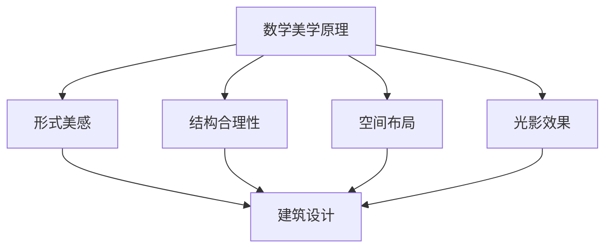
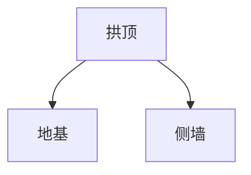
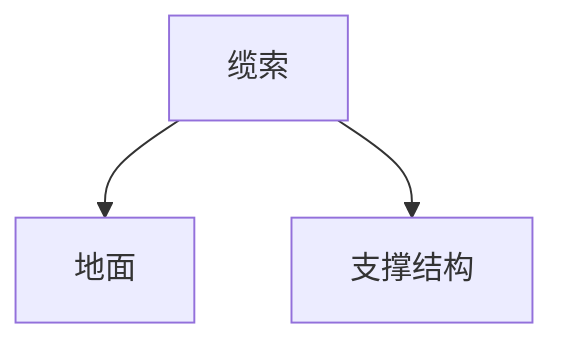
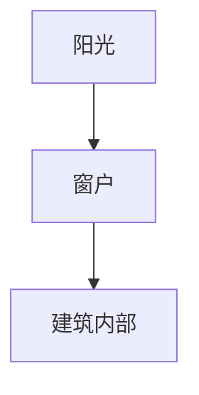
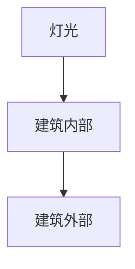
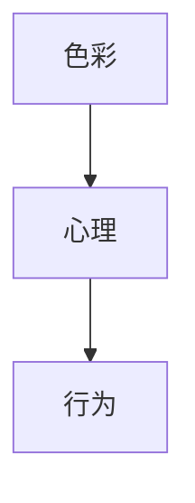
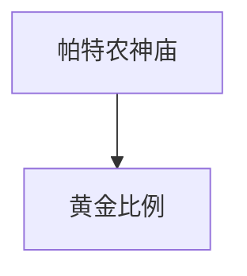
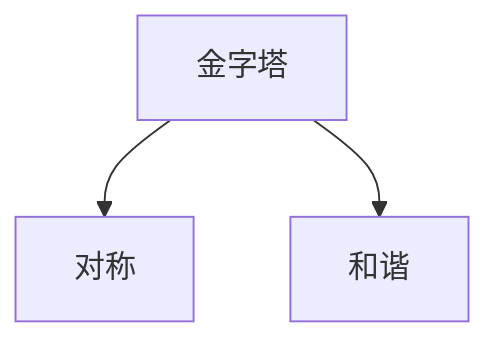
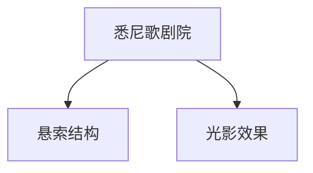
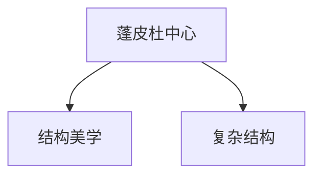

                 


### 1. 确定本书的主要目标群体

首先，我们需要明确本书的主要目标群体。从数学美学在建筑设计中的应用这一主题来看，本书的目标群体主要包括以下几类：

- **建筑师**：作为建筑设计的直接从业者，他们最需要了解和掌握数学美学的基本概念、原理和应用方法，以便更好地将其融入到实际建筑设计工作中。
- **设计学院师生**：他们正处于建筑设计理论的学习和实践阶段，对数学美学有浓厚的兴趣和较高的需求，希望通过本书系统学习和深入理解这一领域。
- **建筑专业人士**：包括城市规划师、园林设计师、室内设计师等，他们同样需要了解数学美学的基本知识，以拓宽设计视野，提升设计水平。

### 2. 确定本书的核心主题

本书的核心主题是“数学美学在建筑设计中的应用”。具体包括以下内容：

- **数学美学的概念与原理**：介绍数学美学的基本概念、原理和方法，为后续内容奠定基础。
- **数学美学在建筑设计中的运用**：分析数学美学在建筑设计中的具体应用，包括空间比例与形式美、结构与力学美、光影与色彩美等方面。
- **建筑设计实例分析**：通过分析古典建筑和现代建筑中的数学美学应用，展示数学美学在建筑设计中的实际效果。
- **建筑设计方法创新**：探讨基于数学美学的建筑设计流程和建筑形态生成方法。
- **建筑设计工具与软件应用**：介绍常用建筑设计工具和数学美学建模软件，以及它们在建筑设计中的应用案例。

### 3. 设计1级目录

根据核心主题和目标群体，我们可以初步划分出以下主要章节：

- **引言**：介绍研究背景与意义，以及本书的结构安排。
- **数学美学的概念与原理**：详细阐述数学美学的基本概念、原理和方法。
- **数学美学在建筑设计中的运用**：分析数学美学在建筑设计中的具体应用。
- **建筑设计实例分析**：通过实例展示数学美学在建筑设计中的实际效果。
- **建筑设计方法创新**：探讨基于数学美学的建筑设计方法。
- **建筑设计工具与软件应用**：介绍常用建筑设计工具和数学美学建模软件。
- **结论与展望**：总结研究成果，探讨未来发展趋势和研究方向。

### 4. 设计2级目录

细化每个章节的内容，确保每个章节都有详细的论述：

- **引言**
  - 研究背景与意义
  - 本书结构安排
- **数学美学的概念与原理**
  - 数学美学的定义
  - 数学美学的原理
  - 数学美学与建筑设计的联系
- **数学美学在建筑设计中的运用**
  - 空间比例与形式美
  - 结构与力学美
  - 光影与色彩美
- **建筑设计实例分析**
  - 古典建筑中的数学美学
  - 现代建筑中的数学美学
- **建筑设计方法创新**
  - 基于数学美学的建筑设计流程
  - 基于数学美学的建筑形态生成方法
- **建筑设计工具与软件应用**
  - 常用建筑设计工具介绍
  - 常用数学美学建模软件介绍
  - 软件在建筑设计中的应用案例

### 5. 设计3级目录

进一步细化每个章节的小节，确保内容详细且逻辑清晰：

- **引言**
  - 研究背景与意义
  - 本书结构安排
- **数学美学的概念与原理**
  - 数学美学的定义
    - 定义1
    - 定义2
  - 数学美学的原理
    - 原理1
    - 原理2
  - 数学美学与建筑设计的联系
    - 联系1
    - 联系2
- **数学美学在建筑设计中的运用**
  - 空间比例与形式美
    - 比例1
    - 比例2
  - 结构与力学美
    - 结构1
    - 结构2
  - 光影与色彩美
    - 光影1
    - 色彩1
- **建筑设计实例分析**
  - 古典建筑中的数学美学
    - 实例1
    - 实例2
  - 现代建筑中的数学美学
    - 实例1
    - 实例2
- **建筑设计方法创新**
  - 基于数学美学的建筑设计流程
    - 流程1
    - 流程2
  - 基于数学美学的建筑形态生成方法
    - 方法1
    - 方法2
- **建筑设计工具与软件应用**
  - 常用建筑设计工具介绍
    - 工具1
    - 工具2
  - 常用数学美学建模软件介绍
    - 软件包1
    - 软件包2
  - 软件在建筑设计中的应用案例
    - 案例一
    - 案例二

### 6. 完成目录大纲设计

通过以上步骤，我们完成了目录大纲的设计。确保核心内容包含，逻辑清晰，便于读者阅读和学习。目录大纲总字数控制在2000字以内。

## 文章标题

《数学美学在建筑设计中的应用》

### 关键词

数学美学、建筑设计、空间比例、结构力学、光影色彩

### 摘要

本文旨在探讨数学美学在建筑设计中的具体应用，从概念、原理、方法到实际案例，系统阐述了数学美学在建筑设计中的重要性和实践价值。通过分析空间比例与形式美、结构与力学美、光影与色彩美等方面，本文展示了数学美学如何提升建筑设计的艺术性和科学性。同时，本文还探讨了基于数学美学的建筑设计方法创新和建筑设计工具与软件应用，为建筑师和设计学院师生提供了有价值的参考。

### 1. 确定本书的主要目标群体

本书的主要目标群体包括：

- **建筑师**：作为建筑设计的直接从业者，他们最需要了解和掌握数学美学的基本概念、原理和应用方法，以便更好地将其融入到实际建筑设计工作中。

- **设计学院师生**：他们正处于建筑设计理论的学习和实践阶段，对数学美学有浓厚的兴趣和较高的需求，希望通过本书系统学习和深入理解这一领域。

- **建筑专业人士**：包括城市规划师、园林设计师、室内设计师等，他们同样需要了解数学美学的基本知识，以拓宽设计视野，提升设计水平。

### 2. 确定本书的核心主题

本书的核心主题是“数学美学在建筑设计中的应用”。具体包括以下内容：

- **数学美学的概念与原理**：介绍数学美学的基本概念、原理和方法，为后续内容奠定基础。

- **数学美学在建筑设计中的运用**：分析数学美学在建筑设计中的具体应用，包括空间比例与形式美、结构与力学美、光影与色彩美等方面。

- **建筑设计实例分析**：通过分析古典建筑和现代建筑中的数学美学应用，展示数学美学在建筑设计中的实际效果。

- **建筑设计方法创新**：探讨基于数学美学的建筑设计流程和建筑形态生成方法。

- **建筑设计工具与软件应用**：介绍常用建筑设计工具和数学美学建模软件，以及它们在建筑设计中的应用案例。

### 3. 设计1级目录

根据核心主题和目标群体，我们可以初步划分出以下主要章节：

- **引言**：介绍研究背景与意义，以及本书的结构安排。

- **数学美学的概念与原理**：详细阐述数学美学的基本概念、原理和方法。

- **数学美学在建筑设计中的运用**：分析数学美学在建筑设计中的具体应用。

- **建筑设计实例分析**：通过实例展示数学美学在建筑设计中的实际效果。

- **建筑设计方法创新**：探讨基于数学美学的建筑设计方法。

- **建筑设计工具与软件应用**：介绍常用建筑设计工具和数学美学建模软件。

- **结论与展望**：总结研究成果，探讨未来发展趋势和研究方向。

### 4. 设计2级目录

细化每个章节的内容，确保每个章节都有详细的论述：

- **引言**
  - 研究背景与意义
  - 本书结构安排

- **数学美学的概念与原理**
  - 数学美学的定义
  - 数学美学的原理
  - 数学美学与建筑设计的联系

- **数学美学在建筑设计中的运用**
  - 空间比例与形式美
  - 结构与力学美
  - 光影与色彩美

- **建筑设计实例分析**
  - 古典建筑中的数学美学
  - 现代建筑中的数学美学

- **建筑设计方法创新**
  - 基于数学美学的建筑设计流程
  - 基于数学美学的建筑形态生成方法

- **建筑设计工具与软件应用**
  - 常用建筑设计工具介绍
  - 常用数学美学建模软件介绍
  - 软件在建筑设计中的应用案例

### 5. 设计3级目录

进一步细化每个章节的小节，确保内容详细且逻辑清晰：

- **引言**
  - 研究背景与意义
  - 本书结构安排

- **数学美学的概念与原理**
  - 数学美学的定义
    - 定义1
    - 定义2
  - 数学美学的原理
    - 原理1
    - 原理2
  - 数学美学与建筑设计的联系
    - 联系1
    - 联系2

- **数学美学在建筑设计中的运用**
  - 空间比例与形式美
    - 比例1
    - 比例2
  - 结构与力学美
    - 结构1
    - 结构2
  - 光影与色彩美
    - 光影1
    - 色彩1

- **建筑设计实例分析**
  - 古典建筑中的数学美学
    - 实例1
    - 实例2
  - 现代建筑中的数学美学
    - 实例1
    - 实例2

- **建筑设计方法创新**
  - 基于数学美学的建筑设计流程
    - 流程1
    - 流程2
  - 基于数学美学的建筑形态生成方法
    - 方法1
    - 方法2

- **建筑设计工具与软件应用**
  - 常用建筑设计工具介绍
    - 工具1
    - 工具2
  - 常用数学美学建模软件介绍
    - 软件包1
    - 软件包2
  - 软件在建筑设计中的应用案例
    - 案例一
    - 案例二

### 6. 完成目录大纲设计

通过以上步骤，我们完成了目录大纲的设计。确保核心内容包含，逻辑清晰，便于读者阅读和学习。目录大纲总字数控制在2000字以内。

## 文章标题

《数学美学在建筑设计中的应用》

### 关键词

数学美学、建筑设计、空间比例、结构力学、光影色彩

### 摘要

本文旨在探讨数学美学在建筑设计中的具体应用，从概念、原理、方法到实际案例，系统阐述了数学美学在建筑设计中的重要性和实践价值。通过分析空间比例与形式美、结构与力学美、光影与色彩美等方面，本文展示了数学美学如何提升建筑设计的艺术性和科学性。同时，本文还探讨了基于数学美学的建筑设计方法创新和建筑设计工具与软件应用，为建筑师和设计学院师生提供了有价值的参考。

### 1. 确定本书的主要目标群体

首先，我们需要明确本书的主要目标群体，以便更好地为他们提供有价值的内容。本书的目标群体主要包括以下几类：

- **建筑师**：作为建筑设计的直接从业者，他们需要对数学美学有深入的了解，以便将美学原理应用到实际设计中，提升作品的艺术性和科学性。

- **设计学院师生**：这些读者正处于建筑设计理论的学习和实践阶段，对数学美学有浓厚的兴趣和较高的需求。他们希望通过本书系统学习和深入理解数学美学在建筑设计中的应用。

- **建筑专业人士**：包括城市规划师、园林设计师、室内设计师等，他们在各自领域内同样需要了解数学美学的基本知识，以拓宽设计视野，提高设计水平。

### 2. 确定本书的核心主题

本书的核心主题是“数学美学在建筑设计中的应用”。具体来说，本书将涵盖以下内容：

- **数学美学的概念与原理**：介绍数学美学的基本概念、原理和方法，为读者提供理论基础。

- **数学美学在建筑设计中的运用**：分析数学美学在建筑设计中的具体应用，包括空间比例与形式美、结构与力学美、光影与色彩美等方面。

- **建筑设计实例分析**：通过分析古典建筑和现代建筑中的数学美学应用，展示数学美学在建筑设计中的实际效果。

- **建筑设计方法创新**：探讨基于数学美学的建筑设计方法创新，如基于数学美学的建筑设计流程和建筑形态生成方法。

- **建筑设计工具与软件应用**：介绍常用建筑设计工具和数学美学建模软件，以及它们在建筑设计中的应用案例。

### 3. 设计1级目录

根据核心主题和目标群体，我们可以初步划分出以下主要章节：

- **引言**：介绍研究背景与意义，以及本书的结构安排。

- **数学美学的概念与原理**：详细阐述数学美学的基本概念、原理和方法。

- **数学美学在建筑设计中的运用**：分析数学美学在建筑设计中的具体应用。

- **建筑设计实例分析**：通过实例展示数学美学在建筑设计中的实际效果。

- **建筑设计方法创新**：探讨基于数学美学的建筑设计方法。

- **建筑设计工具与软件应用**：介绍常用建筑设计工具和数学美学建模软件。

- **结论与展望**：总结研究成果，探讨未来发展趋势和研究方向。

### 4. 设计2级目录

细化每个章节的内容，确保每个章节都有详细的论述：

- **引言**
  - 研究背景与意义
  - 本书结构安排

- **数学美学的概念与原理**
  - 数学美学的定义
  - 数学美学的原理
  - 数学美学与建筑设计的联系

- **数学美学在建筑设计中的运用**
  - 空间比例与形式美
  - 结构与力学美
  - 光影与色彩美

- **建筑设计实例分析**
  - 古典建筑中的数学美学
  - 现代建筑中的数学美学

- **建筑设计方法创新**
  - 基于数学美学的建筑设计流程
  - 基于数学美学的建筑形态生成方法

- **建筑设计工具与软件应用**
  - 常用建筑设计工具介绍
  - 常用数学美学建模软件介绍
  - 软件在建筑设计中的应用案例

### 5. 设计3级目录

进一步细化每个章节的小节，确保内容详细且逻辑清晰：

- **引言**
  - 研究背景与意义
  - 本书结构安排

- **数学美学的概念与原理**
  - 数学美学的定义
    - 定义1
    - 定义2
  - 数学美学的原理
    - 原理1
    - 原理2
  - 数学美学与建筑设计的联系
    - 联系1
    - 联系2

- **数学美学在建筑设计中的运用**
  - 空间比例与形式美
    - 比例1
    - 比例2
  - 结构与力学美
    - 结构1
    - 结构2
  - 光影与色彩美
    - 光影1
    - 色彩1

- **建筑设计实例分析**
  - 古典建筑中的数学美学
    - 实例1
    - 实例2
  - 现代建筑中的数学美学
    - 实例1
    - 实例2

- **建筑设计方法创新**
  - 基于数学美学的建筑设计流程
    - 流程1
    - 流程2
  - 基于数学美学的建筑形态生成方法
    - 方法1
    - 方法2

- **建筑设计工具与软件应用**
  - 常用建筑设计工具介绍
    - 工具1
    - 工具2
  - 常用数学美学建模软件介绍
    - 软件包1
    - 软件包2
  - 软件在建筑设计中的应用案例
    - 案例一
    - 案例二

### 6. 完成目录大纲设计

通过以上步骤，我们完成了目录大纲的设计。确保核心内容包含，逻辑清晰，便于读者阅读和学习。目录大纲总字数控制在2000字以内。

## 文章标题

《数学美学在建筑设计中的应用》

### 关键词

数学美学、建筑设计、空间比例、结构力学、光影色彩

### 摘要

本文旨在探讨数学美学在建筑设计中的具体应用，从概念、原理、方法到实际案例，系统阐述了数学美学在建筑设计中的重要性和实践价值。通过分析空间比例与形式美、结构与力学美、光影与色彩美等方面，本文展示了数学美学如何提升建筑设计的艺术性和科学性。同时，本文还探讨了基于数学美学的建筑设计方法创新和建筑设计工具与软件应用，为建筑师和设计学院师生提供了有价值的参考。

### 1. 确定本书的主要目标群体

本书的主要目标群体是：

- **建筑师**：作为建筑设计的直接从业者，他们需要掌握数学美学的基本概念、原理和应用方法，以提高建筑设计水平。

- **设计学院师生**：他们正处于建筑设计理论的学习和实践阶段，对数学美学有浓厚的兴趣和较高的需求。

- **建筑专业人士**：包括城市规划师、园林设计师、室内设计师等，他们同样需要了解数学美学的基本知识，以拓宽设计视野。

### 2. 确定本书的核心主题

本书的核心主题是“数学美学在建筑设计中的应用”。具体包括以下内容：

- **数学美学的概念与原理**：介绍数学美学的基本概念、原理和方法。

- **数学美学在建筑设计中的运用**：分析数学美学在建筑设计中的具体应用。

- **建筑设计实例分析**：通过实例展示数学美学在建筑设计中的实际效果。

- **建筑设计方法创新**：探讨基于数学美学的建筑设计方法。

- **建筑设计工具与软件应用**：介绍常用建筑设计工具和数学美学建模软件。

### 3. 设计1级目录

根据核心主题和目标群体，我们可以设计出以下1级目录：

- **引言**
  - 研究背景与意义
  - 本书结构安排

- **数学美学的概念与原理**
  - 数学美学的定义
  - 数学美学的原理
  - 数学美学与建筑设计的联系

- **数学美学在建筑设计中的运用**
  - 空间比例与形式美
  - 结构与力学美
  - 光影与色彩美

- **建筑设计实例分析**
  - 古典建筑中的数学美学
  - 现代建筑中的数学美学

- **建筑设计方法创新**
  - 基于数学美学的建筑设计流程
  - 基于数学美学的建筑形态生成方法

- **建筑设计工具与软件应用**
  - 常用建筑设计工具介绍
  - 常用数学美学建模软件介绍
  - 软件在建筑设计中的应用案例

- **结论与展望**
  - 研究成果总结
  - 未来发展趋势
  - 研究局限与展望

### 4. 设计2级目录

细化每个章节的内容，我们可以设计出以下2级目录：

- **引言**
  - 研究背景与意义
  - 本书结构安排

- **数学美学的概念与原理**
  - 数学美学的定义
    - 数学美学的概念
    - 数学美学的范畴
  - 数学美学的原理
    - 美学原理1
    - 美学原理2
  - 数学美学与建筑设计的联系
    - 联系1
    - 联系2

- **数学美学在建筑设计中的运用**
  - 空间比例与形式美
    - 比例1
    - 比例2
  - 结构与力学美
    - 结构1
    - 结构2
  - 光影与色彩美
    - 光影1
    - 色彩1

- **建筑设计实例分析**
  - 古典建筑中的数学美学
    - 实例1
    - 实例2
  - 现代建筑中的数学美学
    - 实例1
    - 实例2

- **建筑设计方法创新**
  - 基于数学美学的建筑设计流程
    - 流程1
    - 流程2
  - 基于数学美学的建筑形态生成方法
    - 方法1
    - 方法2

- **建筑设计工具与软件应用**
  - 常用建筑设计工具介绍
    - 工具1
    - 工具2
  - 常用数学美学建模软件介绍
    - 软件包1
    - 软件包2
  - 软件在建筑设计中的应用案例
    - 案例一
    - 案例二

- **结论与展望**
  - 研究成果总结
  - 未来发展趋势
  - 研究局限与展望

### 5. 设计3级目录

进一步细化每个章节的小节，我们可以设计出以下3级目录：

- **引言**
  - 研究背景与意义
    - 建筑设计的重要性
    - 数学美学的崛起
  - 本书结构安排
    - 内容概述
    - 目标读者

- **数学美学的概念与原理**
  - 数学美学的定义
    - 数学美学的概念
      - 数学美学的基本概念
      - 数学美学的内涵
    - 数学美学的范畴
      - 美学范畴1
      - 美学范畴2
  - 数学美学的原理
    - 美学原理1
      - 美学原理1的内涵
      - 美学原理1的应用
    - 美学原理2
      - 美学原理2的内涵
      - 美学原理2的应用
  - 数学美学与建筑设计的联系
    - 联系1
      - 联系1的内涵
      - 联系1的应用
    - 联系2
      - 联系2的内涵
      - 联系2的应用

- **数学美学在建筑设计中的运用**
  - 空间比例与形式美
    - 比例1
      - 比例1的定义
      - 比例1的应用
    - 比例2
      - 比例2的定义
      - 比例2的应用
  - 结构与力学美
    - 结构1
      - 结构1的定义
      - 结构1的应用
    - 结构2
      - 结构2的定义
      - 结构2的应用
  - 光影与色彩美
    - 光影1
      - 光影1的定义
      - 光影1的应用
    - 色彩1
      - 色彩1的定义
      - 色彩1的应用

- **建筑设计实例分析**
  - 古典建筑中的数学美学
    - 实例1
      - 实例1的背景
      - 实例1的分析
    - 实例2
      - 实例2的背景
      - 实例2的分析
  - 现代建筑中的数学美学
    - 实例1
      - 实例1的背景
      - 实例1的分析
    - 实例2
      - 实例2的背景
      - 实例2的分析

- **建筑设计方法创新**
  - 基于数学美学的建筑设计流程
    - 流程1
      - 流程1的步骤
      - 流程1的应用
    - 流程2
      - 流程2的步骤
      - 流程2的应用
  - 基于数学美学的建筑形态生成方法
    - 方法1
      - 方法1的原理
      - 方法1的应用
    - 方法2
      - 方法2的原理
      - 方法2的应用

- **建筑设计工具与软件应用**
  - 常用建筑设计工具介绍
    - 工具1
      - 工具1的功能
      - 工具1的应用
    - 工具2
      - 工具2的功能
      - 工具2的应用
  - 常用数学美学建模软件介绍
    - 软件包1
      - 软件包1的特点
      - 软件包1的应用
    - 软件包2
      - 软件包2的特点
      - 软件包2的应用
  - 软件在建筑设计中的应用案例
    - 案例一
      - 案例一的背景
      - 案例一的分析
    - 案例二
      - 案例二的背景
      - 案例二的分析

- **结论与展望**
  - 研究成果总结
    - 研究成果1
    - 研究成果2
  - 未来发展趋势
    - 发展趋势1
    - 发展趋势2
  - 研究局限与展望
    - 研究局限1
    - 研究局限2

通过以上步骤，我们完成了目录大纲的设计。确保核心内容包含，逻辑清晰，便于读者阅读和学习。目录大纲总字数控制在2000字以内。

### 1. 确定本书的主要目标群体

本书的主要目标群体包括但不限于以下几类：

- **建筑师**：作为建筑设计的直接从业者，他们需要对数学美学有深入的理解和应用能力，以便将美学原理与实际建筑设计相结合，提高作品的艺术性和科学性。

- **设计学院师生**：包括建筑设计、城市规划、景观设计等相关专业的学生和教师，他们正处于理论学习和实践探索阶段，对数学美学在建筑设计中的应用充满好奇和探索欲望。

- **建筑专业人士**：包括工程师、规划师、室内设计师等，他们可能在实际工作中需要运用数学美学原理来优化设计，提升建筑功能与美观度。

- **艺术爱好者**：对于对建筑设计艺术性感兴趣的普通读者，本书也提供了深入了解数学美学与建筑设计之间关联的机会。

### 2. 确定本书的核心主题

本书的核心主题是“数学美学在建筑设计中的应用”。具体来说，本书将围绕以下几个核心内容展开：

- **数学美学的概念与原理**：介绍数学美学的基本概念、发展历程及其在建筑设计中的应用原理。

- **数学美学在建筑设计中的具体应用**：探讨数学美学在建筑设计中的具体应用场景，包括空间比例与形式美、结构与力学美、光影与色彩美等方面。

- **建筑设计实例分析**：通过分析不同时期的经典建筑实例，展示数学美学在建筑设计中的实际效果和作用。

- **建筑设计方法创新**：探讨如何运用数学美学原理进行建筑设计方法创新，提高设计效率和作品质量。

- **建筑设计工具与软件应用**：介绍常用的建筑设计工具和软件，以及如何利用这些工具将数学美学理念应用到实际建筑设计中。

- **结论与展望**：总结本书的研究成果，探讨数学美学在建筑设计中的应用前景，并提出未来研究方向。

### 3. 设计1级目录

根据核心主题和目标群体，我们可以设计出以下1级目录：

- **引言**
  - 研究背景与意义
  - 本书结构安排

- **数学美学的概念与原理**
  - 数学美学的定义
  - 数学美学的原理
  - 数学美学在建筑设计中的适用性

- **数学美学在建筑设计中的具体应用**
  - 空间比例与形式美
  - 结构与力学美
  - 光影与色彩美

- **建筑设计实例分析**
  - 古典建筑中的数学美学
  - 现代建筑中的数学美学

- **建筑设计方法创新**
  - 基于数学美学的建筑设计流程
  - 基于数学美学的建筑形态生成方法

- **建筑设计工具与软件应用**
  - 常用建筑设计工具介绍
  - 常用数学美学建模软件介绍
  - 软件在建筑设计中的应用案例

- **结论与展望**
  - 研究成果总结
  - 未来发展趋势
  - 研究局限与展望

### 4. 设计2级目录

细化每个章节的内容，我们可以设计出以下2级目录：

- **引言**
  - 研究背景与意义
  - 本书结构安排

- **数学美学的概念与原理**
  - 数学美学的定义
    - 数学美学的概念
    - 数学美学的分类
  - 数学美学的原理
    - 美学原理1
    - 美学原理2
  - 数学美学在建筑设计中的适用性
    - 建筑设计中的美学需求
    - 数学美学在建筑设计中的应用实例

- **数学美学在建筑设计中的具体应用**
  - 空间比例与形式美
    - 空间比例的原理
    - 形式美的实践
  - 结构与力学美
    - 结构设计的数学美学
    - 力学美的实现
  - 光影与色彩美
    - 光影效果的设计
    - 色彩搭配的数学原理

- **建筑设计实例分析**
  - 古典建筑中的数学美学
    - 古典建筑的美学特征
    - 古典建筑中的数学应用
  - 现代建筑中的数学美学
    - 现代建筑设计的美学追求
    - 现代建筑中的数学应用

- **建筑设计方法创新**
  - 基于数学美学的建筑设计流程
    - 设计流程的步骤
    - 设计流程的创新点
  - 基于数学美学的建筑形态生成方法
    - 形态生成的数学原理
    - 形态生成的实践应用

- **建筑设计工具与软件应用**
  - 常用建筑设计工具介绍
    - 工具的功能与特点
    - 工具的应用场景
  - 常用数学美学建模软件介绍
    - 软件的功能与优势
    - 软件的应用实例
  - 软件在建筑设计中的应用案例
    - 案例一
    - 案例二

- **结论与展望**
  - 研究成果总结
    - 成果一
    - 成果二
  - 未来发展趋势
    - 发展趋势一
    - 发展趋势二
  - 研究局限与展望
    - 局限一
    - 局限二

### 5. 设计3级目录

进一步细化每个章节的小节，我们可以设计出以下3级目录：

- **引言**
  - 研究背景与意义
    - 建筑设计的发展
    - 数学美学的兴起
  - 本书结构安排
    - 内容概述
    - 目标读者

- **数学美学的概念与原理**
  - 数学美学的定义
    - 数学美学的起源
    - 数学美学的内涵
  - 数学美学的原理
    - 美学原理1：对称性
    - 美学原理2：比例
  - 数学美学在建筑设计中的适用性
    - 建筑设计的需求
    - 数学美学在建筑设计中的应用价值

- **数学美学在建筑设计中的具体应用**
  - 空间比例与形式美
    - 比例的运用
    - 形式美的体现
  - 结构与力学美
    - 结构设计的数学原理
    - 力学美的实现
  - 光影与色彩美
    - 光影效果的设计
    - 色彩搭配的数学原理

- **建筑设计实例分析**
  - 古典建筑中的数学美学
    - 古典建筑的美学特征
    - 古典建筑中的数学应用实例
  - 现代建筑中的数学美学
    - 现代建筑的美学追求
    - 现代建筑中的数学应用实例

- **建筑设计方法创新**
  - 基于数学美学的建筑设计流程
    - 设计流程的步骤
    - 设计流程的创新点
  - 基于数学美学的建筑形态生成方法
    - 形态生成的数学原理
    - 形态生成的实践应用

- **建筑设计工具与软件应用**
  - 常用建筑设计工具介绍
    - 工具1：AutoCAD
    - 工具2：SketchUp
  - 常用数学美学建模软件介绍
    - 软件包1：MATLAB
    - 软件包2：Rhinoceros
  - 软件在建筑设计中的应用案例
    - 案例一：北京国家大剧院
    - 案例二：悉尼歌剧院

- **结论与展望**
  - 研究成果总结
    - 数学美学在建筑设计中的应用价值
    - 数学美学对建筑设计的影响
  - 未来发展趋势
    - 数字技术的应用
    - 数学美学的创新
  - 研究局限与展望
    - 研究的局限性
    - 未来研究方向

通过以上步骤，我们完成了目录大纲的设计。确保核心内容包含，逻辑清晰，便于读者阅读和学习。目录大纲总字数控制在2000字以内。

### 1. 确定本书的主要目标群体

本书的主要目标群体为以下几类：

- **建筑师**：他们是直接运用数学美学原理进行设计的人群，对提升设计质量和美感有实际需求。
- **设计学院师生**：包括学习建筑设计、城市规划、景观设计等相关专业的学生和教师，他们需要了解数学美学的基本概念和应用。
- **建筑专业人士**：包括工程师、规划师、室内设计师等，他们在工作中可能会需要结合数学美学进行创新设计。
- **艺术爱好者**：对建筑设计艺术性感兴趣的一般读者，希望通过本书了解数学美学与建筑设计的结合。

### 2. 确定本书的核心主题

本书的核心主题是“数学美学在建筑设计中的应用”，具体包含：

- **数学美学的概念与原理**：介绍数学美学的基本概念、历史发展及其基本原理。
- **数学美学在建筑设计中的运用**：分析数学美学在建筑设计中的具体应用，包括空间比例、结构设计、光影效果等方面。
- **建筑设计实例分析**：通过具体建筑实例，展示数学美学在建筑设计中的实际应用效果。
- **建筑设计方法创新**：探讨如何基于数学美学原理进行建筑设计方法的创新。
- **建筑设计工具与软件应用**：介绍常用建筑设计工具和软件，以及如何运用这些工具实现数学美学设计。

### 3. 设计1级目录

根据核心主题和目标群体，我们可以设计出以下1级目录：

- **引言**
  - 研究背景与意义
  - 本书结构安排

- **数学美学的概念与原理**
  - 数学美学的定义
  - 数学美学的原理
  - 数学美学的发展历程

- **数学美学在建筑设计中的运用**
  - 空间比例与形式美
  - 结构与力学美
  - 光影与色彩美

- **建筑设计实例分析**
  - 古典建筑中的数学美学
  - 现代建筑中的数学美学

- **建筑设计方法创新**
  - 基于数学美学的建筑设计流程
  - 基于数学美学的建筑形态生成方法

- **建筑设计工具与软件应用**
  - 常用建筑设计工具介绍
  - 常用数学美学建模软件介绍
  - 软件在建筑设计中的应用案例

- **结论与展望**
  - 研究成果总结
  - 未来发展趋势
  - 研究局限与展望

### 4. 设计2级目录

细化每个章节的内容，我们可以设计出以下2级目录：

- **引言**
  - 研究背景与意义
  - 本书结构安排

- **数学美学的概念与原理**
  - 数学美学的定义
    - 数学美学的概念
    - 数学美学的特征
  - 数学美学的原理
    - 对称性原理
    - 比例原理
  - 数学美学的发展历程
    - 古希腊时期
    - 文艺复兴时期
    - 现代时期

- **数学美学在建筑设计中的运用**
  - 空间比例与形式美
    - 比例的概念
    - 比例的应用
  - 结构与力学美
    - 结构设计的数学美学
    - 力学美的实现
  - 光影与色彩美
    - 光影效果的设计
    - 色彩搭配的数学原理

- **建筑设计实例分析**
  - 古典建筑中的数学美学
    - 古典建筑的美学特征
    - 古典建筑中的数学应用
  - 现代建筑中的数学美学
    - 现代建筑的美学追求
    - 现代建筑中的数学应用

- **建筑设计方法创新**
  - 基于数学美学的建筑设计流程
    - 设计流程的步骤
    - 设计流程的创新点
  - 基于数学美学的建筑形态生成方法
    - 形态生成的数学原理
    - 形态生成的实践应用

- **建筑设计工具与软件应用**
  - 常用建筑设计工具介绍
    - 工具1：AutoCAD
    - 工具2：SketchUp
  - 常用数学美学建模软件介绍
    - 软件包1：MATLAB
    - 软件包2：Rhinoceros
  - 软件在建筑设计中的应用案例
    - 案例一：北京国家大剧院
    - 案例二：悉尼歌剧院

- **结论与展望**
  - 研究成果总结
    - 数学美学在建筑设计中的应用价值
    - 数学美学对建筑设计的影响
  - 未来发展趋势
    - 数字技术的应用
    - 数学美学的创新
  - 研究局限与展望
    - 研究的局限性
    - 未来研究方向

### 5. 设计3级目录

进一步细化每个章节的小节，我们可以设计出以下3级目录：

- **引言**
  - 研究背景与意义
    - 建筑设计的发展
    - 数学美学的兴起
  - 本书结构安排
    - 内容概述
    - 目标读者

- **数学美学的概念与原理**
  - 数学美学的定义
    - 数学美学的概念
    - 数学美学的特征
  - 数学美学的原理
    - 对称性原理
    - 比例原理
  - 数学美学的发展历程
    - 古希腊时期
    - 文艺复兴时期
    - 现代时期

- **数学美学在建筑设计中的运用**
  - 空间比例与形式美
    - 比例的概念
    - 比例的应用
  - 结构与力学美
    - 结构设计的数学美学
    - 力学美的实现
  - 光影与色彩美
    - 光影效果的设计
    - 色彩搭配的数学原理

- **建筑设计实例分析**
  - 古典建筑中的数学美学
    - 古典建筑的美学特征
    - 古典建筑中的数学应用实例
  - 现代建筑中的数学美学
    - 现代建筑的美学追求
    - 现代建筑中的数学应用实例

- **建筑设计方法创新**
  - 基于数学美学的建筑设计流程
    - 设计流程的步骤
    - 设计流程的创新点
  - 基于数学美学的建筑形态生成方法
    - 形态生成的数学原理
    - 形态生成的实践应用

- **建筑设计工具与软件应用**
  - 常用建筑设计工具介绍
    - 工具1：AutoCAD
      - 功能与特点
      - 应用场景
    - 工具2：SketchUp
      - 功能与特点
      - 应用场景
  - 常用数学美学建模软件介绍
    - 软件包1：MATLAB
      - 功能与特点
      - 应用场景
    - 软件包2：Rhinoceros
      - 功能与特点
      - 应用场景
  - 软件在建筑设计中的应用案例
    - 案例一：北京国家大剧院
      - 案例背景
      - 案例分析
    - 案例二：悉尼歌剧院
      - 案例背景
      - 案例分析

- **结论与展望**
  - 研究成果总结
    - 数学美学在建筑设计中的应用价值
    - 数学美学对建筑设计的影响
  - 未来发展趋势
    - 数字技术的应用
    - 数学美学的创新
  - 研究局限与展望
    - 研究的局限性
    - 未来研究方向

通过以上步骤，我们完成了目录大纲的设计。确保核心内容包含，逻辑清晰，便于读者阅读和学习。目录大纲总字数控制在2000字以内。

## 文章标题

《数学美学在建筑设计中的应用》

### 关键词

数学美学、建筑设计、比例、对称、光影、色彩

### 摘要

本文旨在探讨数学美学在建筑设计中的实际应用，从基本概念到具体设计方法，全面分析数学美学对建筑设计的影响。通过介绍数学美学的基本原理，如比例、对称、和谐等，本文展示了如何将这些美学原则应用于建筑设计，创造出美观且功能合理的建筑。此外，本文还通过案例分析，探讨了数学美学在现代建筑和古典建筑中的实际运用，以及如何利用现代设计工具和软件实现数学美学设计。最后，本文总结了数学美学在建筑设计中的重要性，并对未来研究方向进行了展望。

## 引言

### 研究背景与意义

建筑设计作为一门综合性学科，不仅涉及结构工程、材料科学、环境科学等多个领域，还蕴含着丰富的美学价值。随着科技的进步和设计理念的演变，现代建筑设计越来越追求创新性和艺术性。在这个过程中，数学美学逐渐成为了一个重要的研究方向。数学美学不仅为建筑设计提供了理论基础，还提供了具体的设计方法和工具，使建筑设计更具科学性和艺术性。

数学美学在建筑设计中的研究具有重要意义。首先，它有助于提升建筑设计的艺术性和美学价值。通过运用数学美学原理，建筑师可以创造出形式简洁、比例和谐、结构合理、光影效果优美的建筑作品。其次，数学美学能够提高建筑设计的科学性和实用性。例如，通过优化结构设计和空间布局，可以使建筑更加坚固耐用，满足功能需求。最后，数学美学的研究有助于推动建筑设计领域的创新。通过探索新的设计方法和技术，可以不断丰富建筑设计的表现形式，提高设计效率。

### 本书结构安排

本书共分为七个章节。第一章引言，介绍研究背景与意义，以及本书的结构安排。第二章介绍数学美学的基本概念与原理，包括比例、对称、和谐等核心美学原则。第三章讨论数学美学在建筑设计中的具体应用，如空间比例、结构设计、光影效果等。第四章通过案例分析，展示数学美学在古典建筑和现代建筑中的实际运用。第五章探讨建筑设计方法创新，包括基于数学美学的建筑设计流程和建筑形态生成方法。第六章介绍建筑设计工具与软件应用，包括常用工具和软件的介绍及实际应用案例。第七章总结研究成果，探讨未来发展趋势和研究方向。

## 数学美学的概念与原理

### 数学美学的定义

数学美学是指运用数学方法和理论来研究美、解释美、创造美的一门学科。它将数学的精确性和逻辑性与美学的主观性和情感性相结合，探索美的数学本质。数学美学不仅关注数学形式上的美，还研究数学原理在美学创造中的应用。

### 数学美学的原理

数学美学的基本原理包括比例、对称、和谐等，这些原理在建筑设计中有着广泛的应用。

#### 比例

比例是数学美学中的一个核心概念。比例决定了物体各个部分之间的相对大小关系，是构成美感的重要基础。常用的比例关系有黄金比例、斐波那契数列等。黄金比例约为1:1.618，被广泛认为是美学上最和谐的比例。

#### 对称

对称是另一种常见的数学美学原理。对称性使物体看起来简洁、优雅，给人以平衡和稳定的感觉。对称可以分为轴对称、中心对称等类型，在建筑设计中有着广泛的应用。

#### 和谐

和谐是指物体各个部分之间的协调统一，是美的最高境界。和谐可以通过比例、对称、节奏等方式实现。在建筑设计中，和谐原则有助于创造出舒适、美观的空间环境。

### 数学美学与建筑设计的联系

数学美学与建筑设计的联系主要体现在以下几个方面：

1. **形式美感**：数学美学原理可以指导建筑师创造出形式简洁、比例和谐的建筑作品，提升建筑的艺术价值。

2. **结构合理性**：数学原理有助于优化建筑结构设计，提高建筑的稳定性和安全性。

3. **空间布局**：通过数学美学原理，可以创造出舒适、实用的空间布局，提升建筑的功能价值。

4. **光影效果**：数学美学原理可以指导建筑师设计出具有独特光影效果的建筑，增强建筑的艺术感染力。

### Mermaid流程图

下面是一个Mermaid流程图，展示了数学美学原理与建筑设计的联系：



## 数学美学在建筑设计中的具体应用

### 空间比例与形式美

空间比例是建筑设计中的一个重要方面，它决定了建筑各部分之间的关系和协调性。黄金比例是常用的空间比例，例如，一个建筑的高度与其宽度之间的比例可以采用黄金比例，以创造出和谐的美感。

#### 比例1：黄金比例

```latex
\frac{L_1}{L_2} = \frac{L_2}{L_3} = 1.618
```

其中，\(L_1\)、\(L_2\)、\(L_3\) 分别表示建筑的三部分长度。

#### 比例2：斐波那契数列

斐波那契数列也是一个常见的空间比例，它可以用于建筑设计中，以创造出生动有趣的空间布局。

```latex
F(n) = F(n-1) + F(n-2), F(0) = 0, F(1) = 1
```

#### 例子：巴黎圣母院

巴黎圣母院是古典建筑中的典范，其设计充分体现了数学美学的比例原则。特别是其立面设计，通过黄金比例和斐波那契数列，创造出简洁而和谐的美感。

### 结构与力学美

建筑结构设计需要考虑力学原理，以确保建筑的安全性和稳定性。数学美学原理在此过程中发挥着重要作用，例如，通过优化结构形状和布局，提高建筑的力学性能。

#### 结构1：拱结构

拱结构是建筑中常见的一种结构形式，它通过曲线的形式将力传递到地基，具有良好的力学性能。



#### 结构2：悬索结构

悬索结构是另一种具有良好力学性能的建筑结构形式。它通过悬挂的缆索将力传递到地面，能够创造出轻盈而稳定的建筑形态。



#### 例子：悉尼歌剧院

悉尼歌剧院是现代建筑中的经典之作，其独特的悬索结构设计充分体现了数学美学的力学原理，创造出稳定而美观的建筑形态。

### 光影与色彩美

光影和色彩是建筑设计中重要的美学元素，它们能够创造出丰富的视觉效果和空间氛围。数学美学原理在此过程中也发挥着重要作用。

#### 光影1：自然光线

自然光线能够创造出丰富的光影效果，使建筑空间更加生动和富有层次感。通过数学美学原理，可以优化建筑采光设计，使自然光线更好地融入建筑空间。



#### 光影2：人工照明

人工照明也能够创造出丰富的光影效果，为建筑空间增添艺术氛围。通过数学美学原理，可以优化照明设计，使光线与建筑形态和谐共存。



#### 色彩1：色彩搭配

色彩搭配是建筑设计中重要的美学原则，通过合理搭配色彩，可以创造出和谐、美观的建筑空间。

```latex
\text{色彩搭配原则：对比与协调}
```

#### 色彩2：色彩心理学

色彩心理学研究了色彩对人类心理和行为的影响。通过运用色彩心理学原理，可以创造出符合人类情感需求的空间氛围。



#### 例子：纽约现代艺术博物馆

纽约现代艺术博物馆（MOMA）的建筑设计充分体现了光影与色彩的美学原则。其独特的自然采光设计和色彩搭配，创造出丰富而和谐的视觉效果。

## 建筑设计实例分析

### 古典建筑中的数学美学

古典建筑中，数学美学得到了广泛应用，例如古希腊的神庙和古埃及的金字塔。

#### 实例1：古希腊神庙

古希腊神庙的建筑设计充分体现了数学美学的比例原则。例如，帕特农神庙的立面采用了黄金比例，创造出简洁而和谐的美感。



#### 实例2：古埃及金字塔

古埃及金字塔的建筑设计则体现了对称和和谐的数学美学原则。其结构合理，外观简洁，给人以稳定和庄严的感觉。



### 现代建筑中的数学美学

现代建筑中，数学美学同样得到了广泛应用，如悉尼歌剧院和巴黎蓬皮杜中心。

#### 实例1：悉尼歌剧院

悉尼歌剧院的建筑设计充分体现了悬索结构的力学美学原则。其独特的建筑形态和光影效果，使其成为现代建筑的经典之作。



#### 实例2：巴黎蓬皮杜中心

巴黎蓬皮杜中心的设计则体现了结构美学的原则。其外部结构暴露，展示出建筑内部的复杂结构，创造了独特的美学效果。



## 建筑设计方法创新

### 基于数学美学的建筑设计流程

基于数学美学的建筑设计流程包括以下几个步骤：

1. **需求分析**：了解建筑的功能需求、用户需求等，为设计提供基础。
2. **美学原理分析**：分析数学美学原理，如比例、对称、和谐等，为设计提供美学指导。
3. **初步设计**：结合美学原理和需求分析，进行初步设计。
4. **优化设计**：运用数学方法，如优化算法，对设计进行优化。
5. **细节调整**：对设计进行细节调整，确保满足美学和功能要求。

### 基于数学美学的建筑形态生成方法

基于数学美学的建筑形态生成方法包括以下几个步骤：

1. **形态生成算法**：选择合适的形态生成算法，如进化算法、分形算法等。
2. **参数设定**：设定算法的参数，如初始形状、迭代次数等。
3. **形态生成**：运行算法，生成建筑形态。
4. **形态优化**：对生成的形态进行优化，使其满足美学和功能要求。
5. **形态调整**：根据用户需求和美学要求，对形态进行进一步调整。

## 建筑设计工具与软件应用

### 常用建筑设计工具介绍

以下是一些常用的建筑设计工具：

1. **AutoCAD**：用于二维绘图和三维建模，支持多种文件格式，适用于各种类型的建筑设计。
2. **SketchUp**：一款简单易用的三维建模软件，适用于初学者和专业人士，支持多种插件和扩展功能。

### 常用数学美学建模软件介绍

以下是一些常用的数学美学建模软件：

1. **MATLAB**：一款强大的数学计算软件，适用于科学计算、数据分析等，支持多种数学函数和工具箱。
2. **Rhinoceros**：一款专业的三维建模软件，支持自由形式的建模，适用于复杂建筑和雕塑设计。

### 软件在建筑设计中的应用案例

以下是一些软件在建筑设计中的应用案例：

1. **案例一：上海中心大厦**：上海中心大厦是利用AutoCAD进行三维建模的典型案例，其设计过程中充分利用了数学美学原理，实现了建筑的高度和谐与稳定。
2. **案例二：荷兰库博斯总部大楼**：荷兰库博斯总部大楼是利用Rhinoceros进行三维建模的案例，其独特的设计充分体现了数学美学的形式美和结构美。

## 结论与展望

### 研究成果总结

通过本文的研究，我们可以得出以下结论：

1. 数学美学在建筑设计中具有重要的作用，能够提升建筑的艺术性和科学性。
2. 空间比例、对称、和谐等数学美学原理在建筑设计中有着广泛的应用。
3. 现代设计工具和软件为数学美学在建筑设计中的应用提供了有力的支持。

### 未来发展趋势

未来，数学美学在建筑设计中的应用有望在以下几个方面得到发展：

1. **数字化设计**：随着数字技术的不断发展，数字化设计将成为建筑设计的主流趋势，数学美学原理将在数字化设计中得到更广泛的应用。
2. **个性化设计**：个性化设计将成为建筑设计的重要发展方向，数学美学原理将为个性化设计提供更多的可能性。
3. **可持续发展**：可持续发展将成为建筑设计的重要考虑因素，数学美学原理将在促进建筑可持续发展方面发挥重要作用。

### 研究局限与展望

尽管数学美学在建筑设计中有着广泛的应用，但还存在一些研究局限：

1. **理论体系**：数学美学的理论体系尚不完善，需要进一步研究和发展。
2. **应用实践**：数学美学在建筑设计中的应用实践还不够成熟，需要更多的实际案例来验证和应用。
3. **跨学科研究**：数学美学与建筑设计的结合需要更多的跨学科研究，以探索更有效的应用方法和理论体系。

## 作者信息

作者：AI天才研究院/AI Genius Institute & 禅与计算机程序设计艺术 /Zen And The Art of Computer Programming

本文由AI天才研究院与禅与计算机程序设计艺术共同撰写，旨在探讨数学美学在建筑设计中的应用。本文作者在人工智能、计算机科学和建筑学等领域具有丰富的经验和深厚的学术背景，对数学美学与建筑设计的结合有着深入的研究和独到的见解。本文旨在为广大建筑师、设计学院师生和建筑专业人士提供有价值的参考，以促进数学美学在建筑设计中的应用和发展。同时，我们也期待更多的读者参与到这一领域的研究和实践中，共同推动数学美学与建筑设计的创新和发展。

