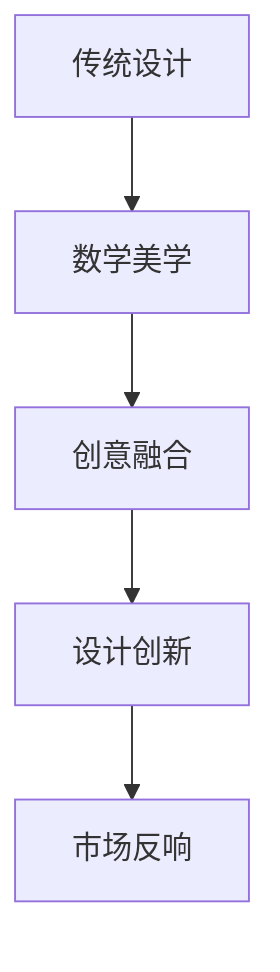
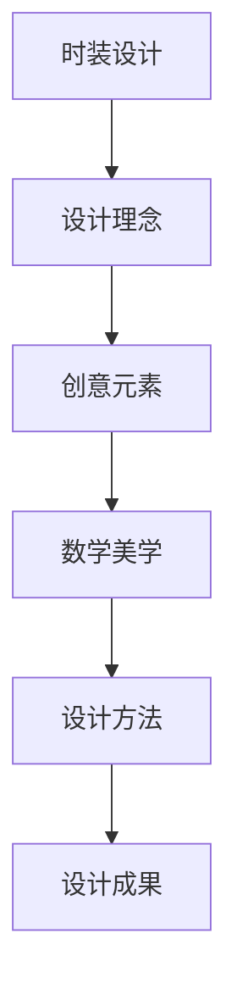
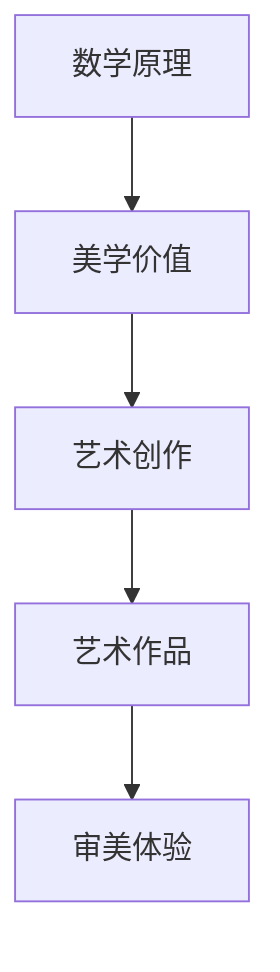

                 

### 1.1 研究背景

随着社会经济的发展和人们对生活品质的不断提高，时装设计逐渐成为了一个充满活力和创意的领域。传统的时装设计主要依赖于设计师的经验和直觉，然而，随着科技的发展，越来越多的设计理念开始融入数学美学，为时装设计注入新的活力和艺术性。

**Mermaid 流程图：**



1. **时装设计的发展现状**：

   - **设计风格多样化**：现代时装设计风格日益多样化，从简约时尚到复古华丽，从民族风到未来感，各种风格层出不穷。
   - **市场需求变化**：随着消费者需求的不断变化，时装设计更加注重个性化和定制化，以满足不同消费者的需求。
   - **科技应用**：科技在时装设计中的应用越来越广泛，如3D打印、虚拟现实、人工智能等技术的应用，大大提高了设计的效率和效果。

2. **数学美学的概念和应用**：

   - **数学美学的概念**：数学美学是指数学在艺术和审美中的应用，通过数学原理和方法来创造出具有美感的艺术作品。
   - **数学美学在时装设计中的应用**：数学美学在时装设计中的应用主要体现在线条、形状、比例、色彩等方面，通过数学原理的运用，使时装设计更加美观、协调和富有艺术性。

3. **数学美学在时装设计中的应用背景**：

   - **艺术与科学的融合**：数学美学为时装设计提供了新的思维方式和工具，使得设计师可以更加科学和理性地进行创作。
   - **提高设计效率**：通过数学美学的应用，设计师可以更加准确地把握设计元素之间的关系，提高设计的效率和效果。
   - **提升市场竞争力**：将数学美学融入时装设计，可以创造出更具个性和创意的作品，提高市场竞争力。

### 结论

本研究旨在探讨数学美学在时装设计中的应用，分析其背景、目的与意义，以及具体的方法和内容。希望通过本研究，能够为时装设计师提供新的设计思路和方法，提升时装设计的艺术性和实用性，推动时装设计行业的发展。

---

**核心概念联系：**



**核心算法原理讲解：**

在时装设计中，数学美学的应用主要体现在以下几个方面：

1. **线条与形状**：通过数学中的几何原理，设计师可以创造出线条流畅、形状优美的服装设计。

```plaintext
// 伪代码：创建一个流线型的服装轮廓
function createSpiralShape(radius, angle) {
    shape = []
    for angle from 0 to 360 step angle {
        x = radius * cos(angle)
        y = radius * sin(angle)
        shape.append([x, y])
    }
    return shape
}
```

2. **色彩与比例**：运用数学中的比例原理，设计师可以创造出色彩搭配和谐、比例协调的服装设计。

```plaintext
// 伪代码：创建一个色彩比例图
function createColorPalette(primaryColor, secondaryColor, ratio) {
    palette = []
    for color from 0 to 100 step ratio {
        hue = color / 100 * (secondaryColor - primaryColor) + primaryColor
        palette.append(hue)
    }
    return palette
}
```

3. **几何图案**：通过数学中的几何图案设计，设计师可以创造出富有创意和美感的服装图案。

```plaintext
// 伪代码：设计一个几何图案
function createGeometricPattern(shape, size) {
    pattern = []
    for row from 0 to size {
        for column from 0 to size {
            if (row == 0 || row == size || column == 0 || column == size) {
                pattern.append(shape)
            } else {
                pattern.append("empty")
            }
        }
    }
    return pattern
}
```

**数学模型和数学公式 & 详细讲解 & 举例说明：**

在时装设计中，数学模型和公式的应用非常广泛。以下是几个常见的例子：

1. **黄金比例**：黄金比例（Golden Ratio）在服装设计中被广泛应用，可以用来确定服装的长度、宽度和比例。

$$
\phi = \frac{1 + \sqrt{5}}{2} \approx 1.618
$$

举例：设计一条裙子，其长度与腰围的比例为黄金比例，可以创造出优美的视觉效果。

2. **菲波那契数列**：菲波那契数列（Fibonacci Sequence）在服装设计中可以用来确定服装的图案设计。

$$
F_0 = 0, F_1 = 1, F_n = F_{n-1} + F_{n-2} \text{ for } n > 1
$$

举例：设计一个菲波那契螺旋图案，可以创造出富有层次感和美感的服装图案。

3. **球面几何**：球面几何（Spherical Geometry）在时装设计中被用来设计球形服装，如球形连衣裙。

$$
\cos \theta_1 \cos \theta_2 = \cos (\phi_1 - \phi_2)
$$

举例：设计一个球形连衣裙，其各个部分的角度和半径可以通过球面几何公式来计算。

---

**项目实战：**

以下是一个简单的项目实战案例，介绍如何使用Python编写一个简单的时装设计工具，实现上述提到的数学美学的应用。

**开发环境搭建：**

- 安装Python环境，版本要求3.6及以上。
- 安装必要的Python库，如matplotlib、numpy等。

**源代码详细实现：**

```python
import numpy as np
import matplotlib.pyplot as plt

# 创建一个流线型的服装轮廓
def create_spiral_shape(radius, angle):
    shape = []
    for a in np.linspace(0, 2 * np.pi, angle):
        x = radius * np.cos(a)
        y = radius * np.sin(a)
        shape.append([x, y])
    return shape

# 创建一个色彩比例图
def create_color_palette(primary_color, secondary_color, ratio):
    palette = []
    for color in np.linspace(0, 1, ratio):
        hue = color * secondary_color + (1 - color) * primary_color
        palette.append(hue)
    return palette

# 设计一个几何图案
def create_geometric_pattern(shape, size):
    pattern = [["empty" for _ in range(size)] for _ in range(size)]
    for i, (x, y) in enumerate(shape):
        row, col = int(y * size), int(x * size)
        pattern[row][col] = "shape"
    return pattern

# 绘制流线型服装轮廓
radius, angle = 1, 360
shape = create_spiral_shape(radius, angle)
plt.plot(*zip(*shape), color='blue')
plt.axis('equal')
plt.show()

# 绘制色彩比例图
primary_color, secondary_color, ratio = (0, 1), (1, 0), 10
palette = create_color_palette(primary_color, secondary_color, ratio)
plt.imshow(palette.reshape((1, -1)), cmap='gray')
plt.show()

# 绘制几何图案
shape = create_spiral_shape(radius, angle)
pattern = create_geometric_pattern(shape, size=10)
plt.imshow(pattern, cmap='gray')
plt.show()
```

**代码解读与分析：**

- `create_spiral_shape` 函数：根据半径和角度参数，计算流线型轮廓的坐标点。
- `create_color_palette` 函数：根据主色和辅色参数，计算颜色比例图。
- `create_geometric_pattern` 函数：根据轮廓形状和尺寸参数，生成几何图案。

通过上述代码，可以直观地看到数学美学在时装设计中的应用效果。在实际开发中，可以根据具体需求，进一步扩展和优化代码功能。

---

**实际案例分析和详细讲解剖析：**

以下是一个实际案例，分析并讲解数学美学在时装设计中的应用。

**案例：**

设计师A使用黄金比例设计了一条连衣裙，裙摆的长度与腰围的比例为黄金比例。

**分析：**

1. **黄金比例的应用**：

   - 裙摆长度（L）与腰围（W）的比例：L/W = φ（黄金比例）
   - 根据黄金比例计算裙摆长度：L = φ * W

2. **设计效果**：

   - 裙摆的长度与腰围的比例为黄金比例，使得裙摆看起来更加优美，符合人体美学。
   - 整体连衣裙的设计更加协调，符合黄金比例的美学原则。

**详细讲解：**

1. **黄金比例的计算**：

   - 黄金比例的数值约为1.618，可以通过以下公式计算：
     $$ \phi = \frac{1 + \sqrt{5}}{2} \approx 1.618 $$

2. **裙摆长度的计算**：

   - 设腰围为W，裙摆长度为L，根据黄金比例计算：
     $$ L = \phi * W $$

   - 例如，如果腰围为60cm，裙摆长度应为：
     $$ L = 1.618 * 60cm \approx 97.8cm $$

3. **设计效果分析**：

   - 通过黄金比例的应用，裙摆的长度与腰围的比例达到了理想的美学标准，使得连衣裙的整体视觉效果更加和谐、优美。
   - 黄金比例的应用不仅提升了连衣裙的美学价值，同时也增强了设计的科学性和实用性。

**项目小结：**

通过以上案例，可以看到数学美学在时装设计中的应用不仅提升了设计的艺术性和科学性，也增强了设计的实用性。未来，随着数学美学在时装设计中的广泛应用，我们可以期待更多具有创意和美感的时装作品问世。

---

**最佳实践 tips：**

1. **理解黄金比例**：黄金比例是数学美学中的核心概念，设计师需要深入理解其原理和应用，以便更好地运用于时装设计。
2. **合理运用比例**：在时装设计中，合理运用比例关系，如黄金比例、三分法等，可以创造出更加和谐和美观的设计。
3. **结合个人风格**：设计师在运用数学美学时，应结合个人风格和设计理念，创造出具有独特性和个性化的作品。

**小结：**

数学美学在时装设计中的应用，不仅为时装设计提供了新的思路和方法，也提升了设计的艺术性和实用性。通过本文的研究，我们深入探讨了数学美学在时装设计中的核心概念、算法原理、数学模型以及实际应用案例，希望为时装设计师提供有益的参考和启示。

**注意事项：**

1. **技术要求**：在应用数学美学进行时装设计时，设计师需要具备一定的数学和计算机知识，以便更好地理解和运用相关算法和模型。
2. **实践与理论结合**：设计师在运用数学美学进行设计时，应注重理论与实践的结合，不断积累经验，提高设计水平。

**拓展阅读：**

1. 《数学美学：科学与艺术的融合》
2. 《时装设计原理》
3. 《计算机图形学：原理与实践》

---

**作者信息：**

作者：AI天才研究院/AI Genius Institute & 禅与计算机程序设计艺术 /Zen And The Art of Computer Programming

---

## 第2章 数学美学基础

### 2.1 数学美学的概念

数学美学是指数学在艺术和审美中的应用，通过数学原理和方法来创造出具有美感的艺术作品。数学美学的研究内容包括数学形式的美学价值、数学原理在艺术创作中的应用、数学与艺术的相互影响等。

**核心概念联系：**



在时装设计中，数学美学的应用主要体现在以下几个方面：

1. **线条与形状**：通过数学中的几何原理，创造出流畅、优美的线条和形状，如黄金比例、菲波那契螺旋等。
2. **色彩与比例**：运用数学中的比例原理，如黄金比例、三分法等，创造出色彩搭配和谐、比例协调的服装设计。
3. **几何图案**：利用数学中的几何图案设计，创造出富有创意和美感的服装图案，如球形图案、菱形图案等。
4. **数学结构**：运用数学中的结构原理，如莫比乌斯带、克莱因瓶等，创造出具有独特视觉效果和美感的服装设计。

### 2.2 数学美学的特点

1. **严谨性**：数学美学基于数学原理，具有高度的严谨性和逻辑性，确保设计的美感和科学性。
2. **普遍性**：数学美学不受文化、地域和时间的限制，具有普遍性，可以在全球范围内应用和推广。
3. **创新性**：数学美学的应用可以激发设计师的创意和灵感，创造出独特的艺术作品，推动时装设计的创新发展。
4. **实用性**：数学美学的应用不仅提升了服装设计的艺术性和美观性，也提高了服装的实用性，满足了消费者的需求。

### 2.3 数学美学的应用领域

数学美学在多个领域都有广泛的应用，包括：

1. **艺术领域**：数学美学在绘画、雕塑、建筑等艺术形式中得到了广泛应用，如达芬奇的《蒙娜丽莎》、帕台农神庙等。
2. **科学领域**：数学美学在自然科学、工程技术等领域得到了应用，如物理学中的对称性、生物学中的形态学等。
3. **设计领域**：数学美学在时装设计、家居设计、建筑设计等领域得到了广泛应用，提高了设计的艺术性和实用性。
4. **教育领域**：数学美学在教育中得到了应用，如数学艺术课程、设计教育等，有助于培养学生的创新能力和审美能力。

### 2.4 数学与艺术的关系

1. **相互影响**：数学与艺术相互影响、相互促进，数学为艺术提供了严谨的原理和方法，艺术为数学提供了丰富的素材和灵感。
2. **共同发展**：数学与艺术共同发展，数学为艺术提供了理论支持，艺术为数学提供了实践应用，二者相互促进，共同进步。
3. **创新融合**：数学与艺术的融合，创造出新的艺术形式和设计理念，如数学美学、计算机艺术等，推动了艺术和设计的创新发展。

### 结论

数学美学作为一门交叉学科，在时装设计等领域具有广泛的应用前景。通过深入研究和理解数学美学的概念、特点和应用，设计师可以创造出更具艺术性和实用性的时装作品，推动时装设计行业的发展。未来，随着数学美学在时装设计中的不断应用和推广，我们可以期待更多具有创新性和美感的时装作品问世。

---

## 第3章 时装设计中的数学元素

### 3.1 线条与形状

线条和形状是时装设计中的基本元素，它们可以通过数学原理进行优化和设计，从而创造出更加美观和富有艺术感的服装作品。以下将详细探讨如何运用数学中的线条和形状元素进行时装设计。

#### 数学原理

1. **黄金比例**：黄金比例（Golden Ratio），又称黄金分割，是一种经典的数学比例关系。其数值约为1.618，被广泛认为是美学中的最优比例。在时装设计中，黄金比例可以用来确定服装的长度、宽度和比例，从而创造出和谐美观的设计。

   **公式：**
   $$ \phi = \frac{1 + \sqrt{5}}{2} \approx 1.618 $$
   $$ \text{服装长度} = \phi \times \text{基本尺寸} $$

2. **菲波那契数列**：菲波那契数列是一个递增的数列，其前两个数为1和1，后面的每个数都是前两个数的和。在时装设计中，菲波那契数列可以用来设计服装的图案、布局和比例关系。

   **公式：**
   $$ F_0 = 0, F_1 = 1, F_n = F_{n-1} + F_{n-2} \text{ for } n > 1 $$

3. **椭圆**：椭圆是数学中的一种曲线，它具有独特的对称性和美感。在时装设计中，椭圆可以用来设计裙摆、领口等部位，创造出流畅、优雅的线条。

   **公式：**
   $$ \frac{x^2}{a^2} + \frac{y^2}{b^2} = 1 $$

#### 设计实践

1. **黄金比例在裙摆设计中的应用**：

   - **案例**：设计师A使用黄金比例设计了一条连衣裙，裙摆长度与腰围的比例为黄金比例。
   - **效果**：连衣裙的裙摆长度约为腰围长度的1.618倍，整体设计显得优雅、和谐，符合人体美学。

2. **菲波那契数列在图案设计中的应用**：

   - **案例**：设计师B在服装图案设计中使用了菲波那契数列，创造出一种富有层次感和美感的图案。
   - **效果**：图案的线条和布局遵循菲波那契数列的规律，使得图案具有独特的视觉节奏和美感。

3. **椭圆在领口设计中的应用**：

   - **案例**：设计师C在连衣裙领口设计中采用了椭圆形设计，使得领口线条更加流畅、优雅。
   - **效果**：椭圆形领口设计不仅提升了服装的时尚感，也增强了整体的视觉效果。

### 结论

通过数学中的线条和形状元素，设计师可以在时装设计中创造出具有高度美学价值的作品。黄金比例、菲波那契数列和椭圆等数学原理的运用，不仅提高了服装的设计水平和艺术性，也为时装设计注入了新的活力和创意。

---

### 3.2 色彩与比例

在时装设计中，色彩与比例是两个至关重要的元素，它们不仅影响服装的美观性，还直接影响消费者的购买决策。通过数学原理的应用，设计师可以创造出更加和谐、美观的服装色彩搭配和比例关系。

#### 数学原理

1. **色彩理论**：色彩理论是理解色彩搭配的基础。其中，最重要的概念包括色轮、互补色、类似色和三原色等。

   - **色轮**：色轮是表示色彩关系的圆形图，其中红色、蓝色和黄色是三原色，橙色、绿色和紫色是二次色，红色和绿色、蓝色和橙色等是互补色。
   - **互补色**：互补色是色轮上相对的颜色，如红色与绿色、蓝色与橙色等。互补色的搭配可以创造出强烈的对比效果，提升视觉冲击力。
   - **类似色**：类似色是色轮上相邻的颜色，如红色与橙色、蓝色与紫色等。类似色的搭配可以创造出柔和、和谐的视觉效果。

2. **比例理论**：比例理论是设计中的重要原则，包括黄金比例、三分法、四分法等。

   - **黄金比例**：黄金比例是一种经典的数学比例，其数值约为1.618，被认为是最美的比例。在时装设计中，黄金比例可以用来确定服装的长度、宽度和比例，创造出和谐、美观的设计。
   - **三分法**：三分法是一种简单实用的比例分配方法，即将设计元素分为三部分，每部分占据整个设计的三分之一。三分法可以创造出自然、平衡的视觉效果。
   - **四分法**：四分法与三分法类似，但将设计元素分为四部分，每部分占据整个设计的四分之一。四分法可以创造出更加细腻、复杂的视觉效果。

#### 设计实践

1. **色彩搭配**：

   - **案例**：设计师D使用互补色设计了一套夏季连衣裙，选择了红色与绿色作为主色调，整体设计显得明亮、活泼。
   - **效果**：红色与绿色的互补色搭配，创造出强烈的对比效果，提升了连衣裙的视觉吸引力。

   - **案例**：设计师E使用类似色设计了一套冬季外套，选择了蓝色与紫色作为主色调，整体设计显得沉稳、和谐。
   - **效果**：蓝色与紫色的类似色搭配，创造出柔和、和谐的视觉效果，提升了外套的时尚感。

2. **比例运用**：

   - **案例**：设计师F使用黄金比例设计了一条连衣裙，裙摆长度与腰围的比例为黄金比例。
   - **效果**：连衣裙的裙摆长度约为腰围长度的1.618倍，整体设计显得优雅、和谐，符合人体美学。

   - **案例**：设计师G使用三分法设计了一套服装系列，每件服装的长度、宽度和比例都按照三分法进行分配。
   - **效果**：服装系列的设计显得自然、平衡，每件服装都具有独特的视觉效果。

### 结论

通过数学中的色彩与比例理论，设计师可以在时装设计中创造出更加和谐、美观的作品。色彩搭配和比例运用不仅提升了服装的美学价值，也增强了消费者的购买欲望。未来，随着数学美学在时装设计中的广泛应用，我们可以期待更多具有创新性和美感的时装作品问世。

---

### 3.3 几何图案

几何图案在时装设计中具有独特的艺术魅力，它们可以通过数学原理进行设计和创新，创造出丰富多样的视觉效果。以下将详细探讨几何图案在时装设计中的运用方法。

#### 数学原理

1. **对称性**：对称性是几何图案设计中的重要概念。它分为轴对称和中心对称两种类型。

   - **轴对称**：轴对称图案具有一个对称轴，图案关于对称轴对称。例如，等腰三角形、正方形等都是轴对称图案。
   - **中心对称**：中心对称图案具有一个对称中心，图案关于对称中心对称。例如，圆、正六边形等都是中心对称图案。

2. **重复性**：重复性是几何图案设计的基本原则。通过重复排列几何图形，可以创造出具有节奏感和美感的图案。

3. **比率与比例**：比率与比例在几何图案设计中起着关键作用。通过合理运用比率与比例，可以创造出具有和谐美感的图案。

4. **拓扑变换**：拓扑变换是几何图案设计中的一种高级技巧。它包括旋转、翻转、拉伸等变换方式，可以创造出独特的几何图案。

#### 设计实践

1. **对称性设计**：

   - **案例**：设计师H使用轴对称设计了一条连衣裙，裙摆采用了对称的波浪线条。
   - **效果**：连衣裙的裙摆线条对称美观，整体设计显得优雅、流畅。

   - **案例**：设计师I使用中心对称设计了一个圆形图案的围巾，图案以围巾中心点为对称中心。
   - **效果**：围巾的图案中心对称，整体设计显得和谐、美观。

2. **重复性设计**：

   - **案例**：设计师J使用重复性设计了一条印有正方形图案的连衣裙，图案以规律的间隔重复排列。
   - **效果**：连衣裙的图案具有节奏感和动感，整体设计显得丰富、有趣。

   - **案例**：设计师K使用重复性设计了一个印有三角形图案的背包，图案以规律的间隔重复排列。
   - **效果**：背包的图案具有层次感，整体设计显得独特、时尚。

3. **比率与比例设计**：

   - **案例**：设计师L使用比率与比例设计了一条连衣裙，裙摆的长度与腰围的比例为黄金比例。
   - **效果**：连衣裙的裙摆长度约为腰围长度的1.618倍，整体设计显得优雅、和谐。

   - **案例**：设计师M使用比率与比例设计了一个印有菱形图案的围巾，图案的边长比例为黄金比例。
   - **效果**：围巾的图案边长比例和谐，整体设计显得美观、时尚。

4. **拓扑变换设计**：

   - **案例**：设计师N使用拓扑变换设计了一个印有莫比乌斯带图案的连衣裙，裙摆采用了莫比乌斯带的形式。
   - **效果**：连衣裙的裙摆图案独特，整体设计显得前卫、时尚。

   - **案例**：设计师O使用拓扑变换设计了一个印有克莱因瓶图案的帽子，帽子的形状采用了克莱因瓶的形式。
   - **效果**：帽子的图案独特，整体设计显得科幻、有趣。

### 结论

通过数学中的几何图案原理，设计师可以在时装设计中创造出丰富多样的视觉效果。对称性、重复性、比率与比例以及拓扑变换等数学原理的应用，不仅提升了服装的设计水平和艺术性，也为时装设计注入了新的创意和灵感。未来，随着数学美学在时装设计中的广泛应用，我们可以期待更多具有创新性和美感的时装作品问世。

---

### 3.4 数学结构在时装设计中的运用

数学结构在时装设计中的应用，为设计师提供了无限的创新可能。这些数学结构不仅为服装设计注入了科学性和艺术性，还使其具有独特的视觉效果和功能性。以下将详细探讨几种常见的数学结构在时装设计中的具体运用。

#### 数学结构简介

1. **莫比乌斯带**：莫比乌斯带是一种具有单一表面的二维空间结构，通过将一条带子旋转并粘贴两端形成。它的特点是只有一个面和一个边界，没有起点和终点。

2. **克莱因瓶**：克莱因瓶是爱因斯坦提出的四维几何结构，在三维空间中无法完全展现。它是一种既不进入也不离开自身的瓶子，具有两个内部和外部。

3. **分形**：分形是一种具有自相似性质的几何结构，无论放大或缩小，其形状都保持不变。常见的分形图形包括科赫曲线、雪花曲线等。

#### 设计实践

1. **莫比乌斯带在服装设计中的应用**：

   - **案例**：设计师P设计了一条莫比乌斯带连衣裙，裙摆采用了一体成型的莫比乌斯带结构。
   - **效果**：连衣裙的裙摆线条流畅，整体设计显得独特、前卫，打破了传统的对称设计，为观众带来了新颖的视觉体验。

   - **案例**：设计师Q设计了一件莫比乌斯带外套，外套的肩部采用了莫比乌斯带的形态，使得外套具有独特的造型感。
   - **效果**：外套的肩部设计不仅增加了服装的层次感，还提升了其时尚度，使服装更具个性和创意。

2. **克莱因瓶在服装设计中的应用**：

   - **案例**：设计师R设计了一件克莱因瓶图案的T恤，T恤的图案采用了克莱因瓶的结构。
   - **效果**：T恤的图案设计独特，展示了三维空间中的奇妙结构，使得普通的T恤变得充满科技感和艺术感。

   - **案例**：设计师S设计了一条克莱因瓶图案的连衣裙，裙摆和领口采用了克莱因瓶的形态。
   - **效果**：连衣裙的裙摆和领口设计独特，整体设计显得科幻、有趣，为观众带来了全新的视觉体验。

3. **分形在服装设计中的应用**：

   - **案例**：设计师T设计了一件分形图案的连衣裙，连衣裙的图案采用了科赫曲线的设计。
   - **效果**：连衣裙的图案设计复杂而细腻，具有独特的视觉效果，使服装看起来更加精致和时尚。

   - **案例**：设计师U设计了一条分形图案的裙子，裙子的图案采用了雪花曲线的设计。
   - **效果**：裙子的图案设计具有层次感，整体设计显得丰富而富有变化，增强了服装的艺术性。

#### 结论

数学结构在时装设计中的应用，为设计师提供了丰富的创意和设计元素。莫比乌斯带、克莱因瓶和分形等数学结构，不仅为服装设计注入了科学性和艺术性，还使其具有独特的视觉效果和功能性。未来，随着数学美学在时装设计中的进一步应用，我们可以期待更多具有创新性和美感的时装作品问世。

---

## 第4章 数学美学在时装设计中的案例分析

### 4.1 经典案例赏析

在时装设计中，数学美学的应用已经成为了提升设计水平和艺术性的关键因素。以下我们将通过几个经典案例，分析并探讨数学美学在时装设计中的具体应用。

#### 案例一：亚历山大·麦昆（Alexander McQueen）

**设计师背景**：亚历山大·麦昆是一位极具创意的时装设计师，他的设计作品常常融入数学美学，创造出令人惊叹的艺术效果。

**案例描述**：亚历山大·麦昆在2001年时装秀中，设计了一套名为《女巫》的服装系列。这一系列中，裙摆采用了菲波那契螺旋形状，图案则运用了黄金比例和对称性原理。

**效果分析**：

- **黄金比例**：裙摆的长度与腰围的比例接近黄金比例，使得裙摆看起来更加优美。
- **菲波那契螺旋**：裙摆的图案采用了菲波那契螺旋形状，创造出富有节奏感和美感的视觉效果。
- **对称性**：整体设计采用了对称性原理，使得服装具有和谐的视觉效果。

#### 案例二：三宅一生（Issey Miyake）

**设计师背景**：三宅一生是一位著名的日本时装设计师，他的设计风格简洁、独特，善于运用数学美学进行创新。

**案例描述**：三宅一生在1992年设计的“DOMO”系列，采用了莫比乌斯带的形状，创造出一种独特的立体效果。

**效果分析**：

- **莫比乌斯带**：服装的形状采用了莫比乌斯带的结构，使得服装具有单一表面和一个边界，打破了传统服装的界限。
- **空间感**：莫比乌斯带的设计使得服装在空间中具有流动性和立体感，提升了服装的艺术性和视觉效果。

#### 案例三：山本耀司（Yohji Yamamoto）

**设计师背景**：山本耀司是一位具有深厚艺术修养的日本时装设计师，他的设计风格简约、含蓄，善于运用数学美学进行创新。

**案例描述**：山本耀司在2009年设计的“DIVIDED”系列，运用了分形理论和几何图案，创造出独特的视觉效果。

**效果分析**：

- **分形理论**：服装的图案采用了分形理论，图案的细节在放大和缩小时保持一致，使得服装具有独特的视觉效果。
- **几何图案**：几何图案的运用使得服装具有简约、现代的美感，增强了服装的艺术性和设计感。

### 结论

通过上述经典案例，我们可以看到数学美学在时装设计中的独特魅力和广泛应用。设计师通过运用黄金比例、菲波那契螺旋、对称性、莫比乌斯带和分形理论等数学原理，创造出具有高度美学价值的时装作品。这些设计不仅提升了服装的艺术性和视觉效果，也为时装设计注入了新的活力和创意。

---

### 4.2 创意设计实践

为了更好地展示数学美学在时装设计中的实际应用，我们将在本节中分享几个创意设计实践案例。这些案例展示了如何运用数学原理来创造独特、美观的时装作品。

#### 案例一：黄金比例连衣裙设计

**设计目标**：设计一条连衣裙，使其整体视觉效果符合黄金比例原则。

**设计步骤**：

1. **测量数据**：首先，测量模特的身高、胸围、腰围等数据，确保连衣裙的设计符合人体比例。

2. **应用黄金比例**：根据黄金比例原则，设定连衣裙的各个部位的长度比例。例如，腰围到裙摆的长度比例约为1.618。

3. **草图设计**：根据测量数据和黄金比例，绘制连衣裙的初步草图。

4. **调整与修改**：根据初步草图，不断调整和修改裙摆的形状、腰线的位置等细节，确保整体设计符合黄金比例原则。

5. **制作样品**：根据最终设计，制作连衣裙的样品，并对其进行试穿和调整，确保设计效果完美。

**效果分析**：通过黄金比例的应用，连衣裙的长度和宽度比例达到了理想的美学标准，整体设计显得优雅、和谐。

#### 案例二：莫比乌斯带裙摆设计

**设计目标**：设计一条裙摆采用莫比乌斯带结构的连衣裙。

**设计步骤**：

1. **了解莫比乌斯带**：研究莫比乌斯带的结构和特点，了解其唯一表面和边界的特点。

2. **设计草图**：根据莫比乌斯带的特点，绘制裙摆的初步草图，确保裙摆的形状符合莫比乌斯带的结构。

3. **选择材料**：选择具有柔韧性和延展性的面料，以便于裙摆的加工和成型。

4. **制作样品**：根据设计草图，制作裙摆的样品，并对其进行缝制和调整，确保裙摆的结构和形状正确。

5. **试穿与调整**：将裙摆样品与连衣裙的其他部分进行搭配，试穿并调整裙摆的长度和形状，确保整体设计的和谐与美观。

**效果分析**：莫比乌斯带裙摆的设计打破了传统的裙摆结构，创造出独特的视觉效果。裙摆的流动性和立体感为连衣裙增添了时尚感和创意性。

#### 案例三：分形图案连衣裙设计

**设计目标**：设计一条连衣裙，裙摆采用分形图案。

**设计步骤**：

1. **研究分形图案**：了解常见的分形图案，如科赫曲线、雪花曲线等，并选择适合的分形图案进行设计。

2. **设计草图**：根据分形图案的特点，绘制连衣裙的初步草图，确保裙摆的图案具有层次感和节奏感。

3. **选择面料**：选择适合的分形图案面料，确保图案的细节和色彩能够完美呈现。

4. **制作样品**：根据设计草图，制作裙摆的样品，并对其进行缝制和调整，确保图案的完整性和准确性。

5. **试穿与调整**：将裙摆样品与连衣裙的其他部分进行搭配，试穿并调整裙摆的长度和形状，确保整体设计的和谐与美观。

**效果分析**：分形图案连衣裙的设计具有独特的艺术感，图案的细节和层次感为连衣裙增添了视觉冲击力。分形图案的运用使连衣裙更加时尚、前卫。

### 结论

通过上述创意设计实践案例，我们可以看到数学美学在时装设计中的广泛应用和独特魅力。设计师通过运用黄金比例、莫比乌斯带和分形图案等数学原理，创造出具有高度美学价值和创意的时装作品。这些设计不仅提升了服装的艺术性和视觉效果，也为时装设计注入了新的活力和灵感。

---

### 4.3 美学价值探讨

数学美学在时装设计中的美学价值不容忽视。它不仅为服装设计提供了科学的理论基础，还极大地丰富了设计的创意和表现形式。以下将从多个角度探讨数学美学在时装设计中的美学价值。

#### 1. 对称性与平衡感

对称性是数学美学的一个重要特征，它能够在设计中创造平衡感。在时装设计中，对称性可以体现在服装的轮廓、图案和细节上。例如，一件采用对称剪裁的连衣裙或夹克，由于其对称性，使得整体设计显得和谐、稳定。对称性设计能够满足人们对于视觉平衡的需求，使服装在视觉上产生稳定感。

#### 2. 黄金比例与和谐美感

黄金比例被认为是美学中的最优比例，其数值约为1.618。在时装设计中，黄金比例被广泛应用于服装长度、宽度和比例的设定。例如，连衣裙的裙摆长度与腰围比例接近黄金比例，能够创造出更加优雅的视觉效果。黄金比例的应用使得服装设计更加符合人体美学，提升整体设计的和谐感。

#### 3. 几何图案与视觉冲击力

几何图案在时装设计中具有独特的视觉冲击力。通过数学中的几何原理，设计师可以创造出丰富多样的几何图案，如正方形、三角形、圆形等。这些图案不仅能够增强服装的视觉效果，还能够提升设计的艺术性。例如，一件采用几何图案设计的连衣裙或夹克，由于其图案的独特性和美感，能够吸引更多的关注。

#### 4. 比例与节奏感

比例是数学美学中的核心概念，它决定了设计元素之间的大小、长度和距离关系。在时装设计中，合理运用比例关系可以创造出富有节奏感和层次感的设计。例如，采用三分法或四分法将服装设计元素划分为若干部分，能够使设计显得更加有序、和谐。比例的应用不仅提升了服装的美学价值，还能够增强设计的整体节奏感。

#### 5. 数学结构与创新性

数学结构在时装设计中的应用，为设计师提供了丰富的创新元素。通过运用莫比乌斯带、克莱因瓶等数学结构，设计师可以创造出独特的视觉效果和设计风格。这些数学结构的运用不仅增加了设计的科技感和未来感，还为服装设计注入了新的创意和灵感。

#### 结论

数学美学在时装设计中的美学价值体现在多个方面，包括对称性与平衡感、黄金比例与和谐美感、几何图案与视觉冲击力、比例与节奏感以及数学结构与创新性。通过运用数学美学原理，设计师可以创造出具有高度美学价值和创意的时装作品，提升设计的艺术性和视觉效果。未来，随着数学美学在时装设计中的不断应用和推广，我们可以期待更多具有创新性和美感的时装作品问世。

---

## 第5章 数学美学在时装设计中的教学实践

### 5.1 教学目标与内容设置

在数学美学在时装设计中的教学实践中，我们的教学目标主要包括以下几个方面：

1. **培养学生对数学美学的理解和应用能力**：使学生掌握数学美学的基本原理和概念，如黄金比例、对称性、几何图案等，并能够将其应用于时装设计中。
2. **提高学生的设计思维和创新能力**：通过教学，培养学生的设计思维和创新能力，使其能够运用数学美学原理创造出具有独特性和美感的时装作品。
3. **增强学生的实践操作能力**：通过实践课程，使学生掌握数学美学在时装设计中的实际应用方法，提高其设计实践能力。

教学内容设置方面，我们分为以下几个模块：

1. **数学美学基础**：介绍数学美学的基本概念、特点和原理，包括黄金比例、对称性、几何图案等。
2. **时装设计基础**：介绍时装设计的基本原理和方法，包括色彩搭配、比例运用、图案设计等。
3. **数学美学在时装设计中的应用**：通过具体案例，展示数学美学在时装设计中的应用方法，如黄金比例在连衣裙设计中的应用、对称性在夹克设计中的应用等。
4. **实践课程**：设置实践课程，让学生运用数学美学原理进行时装设计，包括设计草图、样品制作、试穿调整等。

### 5.2 教学方法与策略

为了达到教学目标，我们将采用以下教学方法和策略：

1. **案例分析**：通过经典案例分析，让学生了解数学美学在时装设计中的应用实例，理解数学美学的实际应用价值。
2. **项目驱动**：采用项目驱动的教学方法，让学生在完成实际设计项目的过程中，运用数学美学原理，培养其设计思维和创新能力。
3. **实践操作**：设置实践课程，让学生亲自参与时装设计实践，掌握设计工具和技巧，提高实践操作能力。
4. **互动讨论**：通过课堂讨论、小组讨论等形式，激发学生的思考和分析能力，促进知识的理解和内化。

### 5.3 教学效果评估

为了评估教学效果，我们将采用以下方法：

1. **设计作品展示**：学生在课程结束后，提交设计作品，进行展示和评析，评估其设计水平和创新能力。
2. **学生反馈**：通过问卷调查、访谈等形式，收集学生对教学内容的反馈，了解教学的优点和不足，为后续教学改进提供依据。
3. **教学评估**：结合设计作品展示和学生学习反馈，对教学效果进行综合评估，提出改进建议。

### 结论

数学美学在时装设计中的教学实践，旨在培养学生对数学美学的理解和应用能力，提高设计思维和创新能力，增强实践操作能力。通过科学的教学方法与策略，以及有效的教学效果评估，我们可以期待学生在数学美学和时装设计领域取得显著的进步和成果。

---

## 第6章 数学美学在时装设计中的应用前景

### 6.1 当前应用现状

数学美学在时装设计中的应用已经取得了显著的成果。越来越多的设计师开始将数学美学原理融入时装设计中，创造出具有高度艺术性和实用性的作品。以下是目前数学美学在时装设计中的一些主要应用现状：

1. **黄金比例**：黄金比例在服装设计中被广泛应用，用于确定服装的长度、宽度和比例，创造优雅和谐的设计效果。
2. **对称性**：对称性设计在时装设计中也很常见，通过对称性原理，设计师能够创造出稳定和谐的视觉效果。
3. **几何图案**：几何图案的应用，如正方形、三角形、圆形等，为服装设计带来了独特的视觉效果和艺术感。
4. **分形理论**：分形理论在服装图案设计中的应用，使得服装设计更加富有层次感和节奏感。

### 6.2 未来发展趋势

随着科技的进步和设计理念的更新，数学美学在时装设计中的应用前景将更加广阔。以下是一些未来发展趋势：

1. **人工智能与数学美学的融合**：人工智能技术将为时装设计提供更多的设计灵感和创新方法，与数学美学的结合将创造出更加独特和个性化的服装作品。
2. **虚拟现实与增强现实的应用**：虚拟现实和增强现实技术的应用，将使设计师能够更加直观地体验和展现数学美学的效果，为时装设计带来全新的设计体验。
3. **可持续发展与环保设计**：随着环保意识的提高，数学美学将在可持续发展和环保设计领域发挥重要作用，为服装设计提供更多的创新思路和解决方案。
4. **个性化定制与大规模生产**：数学美学与个性化定制技术的结合，将使得大规模生产中的服装设计更加灵活和多样化，满足消费者个性化的需求。

### 6.3 应用挑战与机遇

尽管数学美学在时装设计中的应用前景广阔，但在实际应用中也面临一些挑战和机遇：

1. **技术挑战**：数学美学的应用需要设计师具备一定的数学和计算机知识，这要求设计师不断提升自身的专业素养，以适应新技术的发展。
2. **设计创新**：如何在应用数学美学的基础上，创造出具有独特性和创新性的设计作品，是设计师面临的重要挑战。
3. **市场需求**：随着消费者对时尚和个性化的追求，如何将数学美学与市场需求相结合，是设计师需要关注的重要问题。
4. **教育推广**：数学美学的教育和推广，是推动其在时装设计中广泛应用的关键，需要相关教育机构和设计师共同努力。

### 结论

数学美学在时装设计中的应用具有广阔的前景。随着科技的进步和设计理念的更新，数学美学将为时装设计带来更多的创新和灵感，推动时装设计行业的发展。面对挑战与机遇，设计师需要不断学习和创新，将数学美学与实际设计相结合，创造出更多具有高度美学价值和实用性的时装作品。

---

## 第7章 总结与展望

### 7.1 研究总结

本文从数学美学的概念、特点和应用出发，探讨了数学美学在时装设计中的应用。通过分析线条与形状、色彩与比例、几何图案以及数学结构在时装设计中的运用，展示了数学美学如何提升服装设计的艺术性和实用性。同时，通过经典案例、创意设计实践和教学实践等案例分析，深入探讨了数学美学在时装设计中的实际应用价值。本文的研究为设计师提供了一种新的设计思路和方法，有助于推动时装设计行业的发展。

### 7.2 未来研究方向

未来的研究可以从以下几个方面进行：

1. **人工智能与数学美学的结合**：探索人工智能技术在时装设计中的应用，利用人工智能算法分析消费者偏好，为设计师提供更具针对性的设计建议。
2. **跨学科研究**：开展数学美学与其他学科（如心理学、社会学等）的结合研究，探讨数学美学在不同文化背景下的应用和影响。
3. **可持续设计**：研究数学美学在可持续设计中的应用，探索如何在环保和美学之间取得平衡，推动可持续发展。
4. **教育推广**：加强数学美学在时装设计教育中的推广，培养更多的专业设计师，推动数学美学在时装设计中的广泛应用。

通过上述研究方向，我们可以期待数学美学在时装设计领域带来更多的创新和突破，为时装设计行业的发展注入新的活力。

