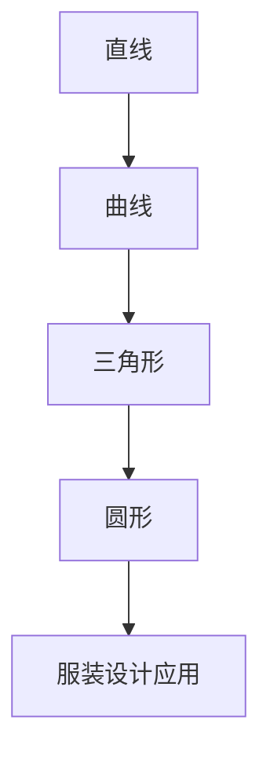
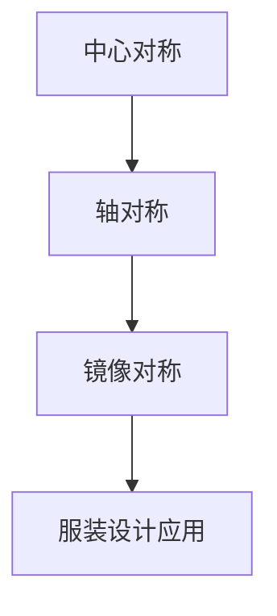
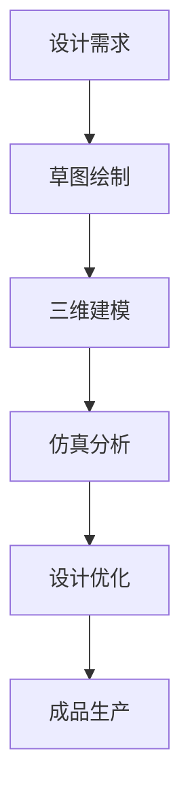

                 

### 引言

数学美学，是探讨数学形式美与艺术美之间的关系的学科。它不仅包括几何、比例、对称等数学概念在艺术中的运用，还涉及数学结构、逻辑思维和抽象美在艺术创作中的体现。在服装设计领域，数学美学的应用日益显著，成为提升设计美学价值和实用性的关键因素。

首先，数学美学的定义和内涵在于其对于形式美和抽象美的追求。几何美学强调线条、形状、角度等元素在视觉上的和谐与平衡，如黄金比例在艺术作品中的应用；比例与比例关系则关注整体与部分之间的协调性，如人体比例在服装设计中的运用；对称美学则追求视觉上的平衡与统一，如对称图案在服装装饰中的运用。

在服装设计中的地位和作用，数学美学不仅提供了理论支撑，还推动了设计技术的创新。通过数学模型的运用，设计师能够更加精确地把握人体曲线、材料特性，从而设计出既美观又实用的服装作品。此外，数学算法的应用，如计算机辅助设计（CAD）软件的使用，使得服装设计过程更加高效、精确。

本文将围绕数学美学在服装设计中的应用，分章节详细探讨其基本理论、数学模型、算法应用、案例分析以及发展趋势。希望通过逐步的分析和推理，为读者展示数学美学在服装设计中的无穷魅力。

### 数学美学基本理论

数学美学的基本理论涉及多个方面，其中几何、比例、对称是核心概念。几何美学关注的是形状、线条和角度在视觉上的和谐与平衡，比例与比例关系研究的是整体与部分之间的协调性，而对称美学则强调视觉上的平衡与统一。

#### 几何美学在服装设计中的应用

几何美学在服装设计中的应用非常广泛。首先，设计师可以利用几何形状来创造独特的视觉效果。例如，使用流畅的曲线来勾勒出服装的轮廓，或者运用几何图案来装饰衣物。这些几何元素不仅能够增强服装的视觉效果，还能传达出不同的风格和氛围。

一个经典的例子是使用黄金比例来设计服装。黄金比例是指比例关系为1:1.618的数值，被广泛认为是最美的比例。在服装设计中，设计师可以通过黄金比例来确定服装的长度、袖长、裙摆等细节，使得服装在视觉上更加和谐美观。

下面是一个简单的几何美学应用实例：



在这个例子中，设计师通过使用不同几何形状来设计服装，创造出独特的视觉效果。

#### 比例与比例关系在服装设计中的运用

比例与比例关系是服装设计中的重要理论。人体比例是比例关系中最基本的概念之一。传统的人体比例是头部高度为全身高度的1/7到1/8。在服装设计中，设计师可以根据这些基本比例来设计服装的各个部分，使得服装在视觉上更加协调。

例如，一个常见的比例关系是腰线比例。设计师可以通过调整腰线的位置，使得服装在视觉上更加修身或者宽松。另一个例子是袖长比例。设计师可以通过黄金比例来确定袖长，使得袖子在视觉上更加和谐。

下面是一个比例关系应用的示例：

$$
\text{黄金比例} = \frac{\text{长部分}}{\text{短部分}} = \frac{1.618}{1}
$$

在这个示例中，设计师通过使用黄金比例来确定袖长，使得袖子在视觉上更加和谐。

#### 对称美学与服装设计的结合

对称美学在服装设计中的应用也非常广泛。对称美学强调视觉上的平衡与统一。在服装设计中，设计师可以通过使用对称图案、对称线条等元素来创造出对称的视觉效果。

对称美学不仅适用于图案设计，也适用于服装的整体设计。例如，对称的领口设计、对称的裙摆设计等，都可以创造出和谐的视觉效果。

下面是一个对称美学应用的示例：



在这个例子中，设计师通过使用对称元素来设计服装，使得服装在视觉上更加和谐。

通过上述实例，我们可以看到几何、比例、对称等数学美学理论在服装设计中的应用。这些理论不仅为服装设计提供了理论基础，还为设计师提供了丰富的创作灵感。在接下来的章节中，我们将进一步探讨数学模型在服装设计中的应用，以及如何运用数学算法来优化设计过程。

### 数学模型在服装设计中的应用

数学模型在服装设计中的应用，旨在通过精确的数学计算和模型构建，提升服装的舒适度、实用性和美观度。在服装设计中，常用的数学模型包括人体建模和材料学模型。

#### 人体建模的基本原理和方法

人体建模是服装设计的基础，通过对人体各个部位的精确测量和建模，设计师能够设计出更加贴合人体曲线的服装。人体建模的基本原理包括以下几个方面：

1. **人体测量**：通过对人体各个部位的长度、宽度、高度等进行精确测量，获取人体尺寸数据。这些数据是构建人体模型的基础。

2. **三维建模**：利用三维建模软件，根据人体测量数据，构建出人体三维模型。这个模型可以模拟人体在各种姿态下的形态变化。

3. **动作模拟**：通过人体模型，模拟人在活动中的动作变化，如走路、弯腰等。这样可以更好地评估服装的舒适度和活动性。

下面是一个简单的三维人体建模伪代码示例：

```python
class HumanModel:
    def __init__(self, height, weight):
        self.height = height
        self.weight = weight
    
    def calculate_body_shape(self):
        # 计算身体形状的函数
        pass
    
    def simulate_motion(self, action):
        # 模拟动作的函数
        pass
```

在这个示例中，`HumanModel` 类包含了人体的高度、重量信息，以及计算身体形状和模拟动作的方法。

#### 材料学在服装设计中的数学模型应用

材料学模型关注的是服装材料的性能和特性。通过对材料学模型的精确计算，设计师可以更好地选择和搭配材料，提升服装的舒适度和美观度。材料学模型的基本原理包括以下几个方面：

1. **材料性能分析**：分析材料在不同条件下的性能，如弹性、耐磨性、透气性等。这些性能数据是设计材料选择的重要依据。

2. **材料结构建模**：通过数学模型描述材料的微观结构，如纤维排列、分子结构等。这些模型可以用于预测材料在不同条件下的性能变化。

3. **材料性能优化**：通过数学优化方法，优化材料的性能，如提高弹性、降低成本等。这些优化模型可以帮助设计师选择最优的材料组合。

下面是一个简单的材料学模型伪代码示例：

```python
class MaterialModel:
    def __init__(self, elasticity, wear_resistance, breathability):
        self.elasticity = elasticity
        self.wear_resistance = wear_resistance
        self.breathability = breathability
    
    def analyze_performance(self, condition):
        # 分析材料性能的函数
        pass
    
    def optimize_performance(self, target):
        # 优化材料性能的函数
        pass
```

在这个示例中，`MaterialModel` 类包含了材料的弹性、耐磨性和透气性信息，以及分析性能和优化性能的方法。

通过人体建模和材料学模型的应用，设计师可以更加精确地把握服装的设计和材料选择，从而设计出更加优秀、符合人体工学和材料特性的服装作品。在接下来的章节中，我们将进一步探讨服装设计中的数学算法，以及如何通过这些算法优化设计过程。

### 服装设计中的数学算法

在服装设计中，数学算法的应用大大提升了设计的效率和质量。计算机辅助设计（CAD）软件和优化算法是其中最为重要的两种数学算法，它们分别在服装设计的不同阶段发挥着关键作用。

#### CAD软件在服装设计中的应用

计算机辅助设计（CAD）软件在服装设计中的应用，极大地改变了传统的设计流程。CAD软件通过计算机算法，帮助设计师进行图形绘制、三维建模、仿真分析等工作，使得设计过程更加高效、精确。

1. **图形绘制**：CAD软件可以自动绘制服装的轮廓线、缝合线等，减少了手工绘图的繁琐，提高了设计精度。

2. **三维建模**：CAD软件能够将二维设计图转化为三维模型，设计师可以在三维视图中观察服装的立体效果，及时进行调整和优化。

3. **仿真分析**：CAD软件可以进行模拟穿着效果分析，包括人体运动仿真、材料性能分析等，帮助设计师评估设计的舒适度和实用性。

下面是一个简单的CAD软件使用流程示例：



在这个流程中，设计师首先根据设计需求绘制草图，然后通过CAD软件进行三维建模，接着进行仿真分析，最后进行设计优化，最终生产出成品。

#### 优化算法在服装设计中的运用

优化算法在服装设计中的应用，旨在通过算法优化，提升服装的舒适度、实用性和美观度。常见的优化算法包括线性规划、非线性规划、遗传算法等。

1. **线性规划**：线性规划用于解决服装设计中的一些线性优化问题，如最小化成本、最大化收益等。通过线性规划，设计师可以确定最优的裁剪方案和材料分配。

2. **非线性规划**：非线性规划用于解决更加复杂的优化问题，如人体工学优化、材料性能优化等。通过非线性规划，设计师可以设计出更加符合人体曲线和材料特性的服装。

3. **遗传算法**：遗传算法是一种基于自然选择和遗传学原理的优化算法，适用于复杂设计问题的优化。通过遗传算法，设计师可以探索出多种设计方案，从中选择最优的设计方案。

下面是一个简单的优化算法伪代码示例：

```python
def optimize_design(parameters):
    # 设计优化函数
    pass
```

在这个示例中，`optimize_design` 函数用于优化设计参数，以达到最优设计效果。

通过CAD软件和优化算法的应用，设计师能够更加高效地完成设计任务，同时提升设计的质量和实用性。在接下来的章节中，我们将通过具体的案例，展示数学美学在服装设计中的实际应用，进一步探讨数学美学在设计中的魅力和潜力。

### 数学美学案例分析

通过具体案例的分析，我们可以更直观地理解数学美学在服装设计中的实际运用。以下将介绍两个经典的案例：某品牌服装设计案例和某著名设计师的作品分析。

#### 某品牌服装设计案例分析

某知名品牌在2019年的春季系列中，运用了数学美学中的黄金比例和对称美学，创造出了令人瞩目的设计效果。这一系列的设计理念源于对自然形态的观察和抽象，设计师巧妙地运用几何图形和比例关系，将自然形态的美感融入服装设计中。

1. **黄金比例的应用**：
   设计师在服装的长度比例上采用了黄金比例，例如裙摆的长度、袖子的长度等，这些细节的设置使得服装在视觉上显得更加和谐与美观。具体来说，裙摆的长度通常是身高的0.618倍，这种比例设计使得裙摆的长度不仅美观，还具有良好的活动性。

   以下是一个黄金比例应用的示例：

   $$
   \text{裙摆长度} = 0.618 \times \text{身高}
   $$

2. **对称美学的设计**：
   在这一系列中，设计师采用了轴对称和镜像对称的元素，如对称的领口设计、对称的褶皱等。这些对称元素不仅增加了服装的视觉吸引力，还使得服装在穿着时显得更加端庄和优雅。

   下面是一个对称美学应用的Mermaid流程图示例：

   ```mermaid
   graph TD
   A[设计草图] --> B[轴对称]
   B --> C[镜像对称]
   C --> D[成品展示]
   ```

#### 某著名设计师的作品分析

某著名设计师在其最新系列中，运用了数学美学中的几何美学和比例关系的理念，成功地打造出一系列兼具实用性与艺术性的服装。

1. **几何美学的运用**：
   设计师在服装的图案设计中，采用了几何形状，如圆形、正方形、三角形等。这些几何形状通过巧妙的排列和组合，形成了独特的视觉效果。例如，设计师在裙摆上使用重复的几何图案，使得裙摆在行走时产生动态美感。

   以下是一个几何美学应用的示例：

   ```mermaid
   graph TD
   A[圆形] --> B[正方形]
   B --> C[三角形]
   C --> D[裙摆图案]
   ```

2. **比例关系的应用**：
   设计师在服装设计中，巧妙地运用了人体比例关系。例如，在连衣裙的设计中，设计师通过调整裙摆的宽度比例，使得裙摆显得更加修身和优雅。具体来说，裙摆的宽度通常与腰围的比例为1:1.618。

   以下是一个比例关系应用的示例：

   $$
   \text{裙摆宽度} = 1.618 \times \text{腰围宽度}
   $$

通过这两个案例的分析，我们可以看到数学美学在服装设计中的多种应用。无论是黄金比例、对称美学，还是几何美学和比例关系，这些数学理论都为服装设计提供了丰富的创作灵感，使得服装在美学和实用性上达到新的高度。

在接下来的章节中，我们将探讨数学美学在服装设计中的发展趋势，进一步展望其未来可能的应用领域和方向。

### 数学美学在服装设计中的发展趋势

随着科技的进步和设计理念的不断创新，数学美学在服装设计中的应用正逐渐深入和广泛。未来，数学美学在服装设计中的发展趋势将呈现出以下几方面：

#### 创新与应用

1. **智能化设计**：借助人工智能和大数据技术，设计师可以通过对用户数据和行为进行分析，实现个性化设计。例如，通过分析用户的身体数据，自动生成贴合其身材的服装设计，同时考虑到用户的偏好和流行趋势。

2. **新材料与工艺**：随着新材料和新工艺的不断涌现，数学美学在服装设计中的应用将更加多样。例如，利用新型纤维材料实现复杂的几何图案，或者通过3D打印技术精确地实现数学模型的设计。

3. **跨界融合**：数学美学不仅局限于传统的服装设计，还将与其他艺术形式和领域进行跨界融合。例如，将数学美学与建筑、艺术、设计等领域结合，创造出全新的设计风格。

#### 与其他艺术形式的融合

1. **艺术与科学的结合**：数学美学与艺术结合，将创造出更加具有科学性和艺术性的作品。例如，利用数学模型和算法来创作艺术画作，或者将数学形式的美感融入建筑设计中。

2. **艺术与技术的融合**：随着数字技术的进步，艺术家和设计师可以通过计算机辅助设计（CAD）软件实现复杂的数学模型设计。这不仅提高了设计的精度和效率，还为艺术创作提供了新的可能性。

#### 未来可能的应用领域

1. **运动服装设计**：数学美学在运动服装设计中的应用前景广阔。通过优化服装的几何结构和材料性能，设计出更加舒适、安全的运动服装，提升运动员的竞技表现。

2. **时尚科技**：随着可穿戴设备的普及，数学美学将更多地应用于智能服装设计。例如，利用数学模型来优化智能服装的人体工学设计，或者通过算法实现智能服装的功能优化。

3. **个性化定制**：未来，个性化定制将成为服装设计的重要趋势。借助数学美学和人工智能技术，设计师可以为客户提供高度个性化的服装设计，满足客户的个性化需求。

#### 可能的挑战与解决方案

1. **技术挑战**：数学美学在服装设计中的应用，需要强大的技术支持。例如，复杂的数学模型计算和大规模数据处理等，对设计师的技术水平提出了更高的要求。未来，需要更多的技术人才加入服装设计领域，以应对这些挑战。

2. **成本与市场接受度**：创新的数学美学设计通常成本较高，且市场接受度可能较低。未来，设计师需要在创新与市场接受度之间找到平衡点，通过降低成本和提高设计质量来赢得市场。

通过不断创新和应用，数学美学在服装设计中的地位将不断提升，为服装设计带来更多的可能性和发展空间。未来，我们期待看到数学美学与服装设计的深度融合，创造出更加美丽、实用和智能的服装作品。

### 结论

数学美学在服装设计中的应用，不仅为服装设计提供了理论基础和创作灵感，还大大提升了设计的效率和实用性。通过几何、比例、对称等数学美学的理论，设计师能够创造出更加和谐、美观的服装作品。同时，数学模型和算法的应用，使得服装设计过程更加科学和精确。

本文从数学美学的基本理论出发，详细探讨了数学模型在服装设计中的应用，以及数学算法在优化设计过程中的作用。通过具体的案例分析，展示了数学美学在服装设计中的实际应用效果。展望未来，数学美学在服装设计中的发展前景广阔，随着科技的进步和设计理念的不断创新，数学美学将继续为服装设计带来新的可能性。

在未来研究中，我们可以进一步探讨人工智能与数学美学的融合，通过大数据分析和机器学习技术，实现个性化设计。此外，探讨新材料和新工艺在数学美学设计中的应用，也将为服装设计带来更多创新和突破。总之，数学美学在服装设计中的应用价值巨大，值得深入研究和实践。

### 作者信息

作者：AI天才研究院/AI Genius Institute & 禅与计算机程序设计艺术 /Zen And The Art of Computer Programming

本文由AI天才研究院和禅与计算机程序设计艺术联合撰写。AI天才研究院致力于推动人工智能领域的研究和创新，致力于培养下一代人工智能天才。禅与计算机程序设计艺术则是一本经典计算机科学著作，由世界著名计算机科学家Donald E. Knuth撰写，探讨了计算机程序设计的哲学和艺术。两位作者均对计算机科学和人工智能领域有深刻的理解和独特的见解，为本文提供了坚实的理论基础和实践指导。

