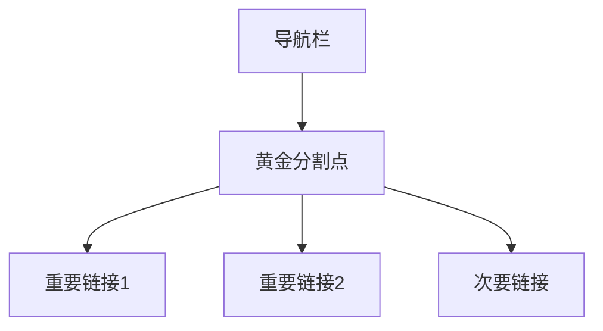
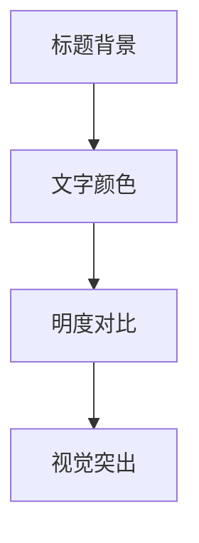

                 

### 1. 引言

网页设计作为数字时代的艺术形式，其核心在于如何通过视觉和交互设计吸引并留住用户。传统的网页设计理念侧重于美学的直观感受，但随着科技的发展，设计师们逐渐意识到，单纯的视觉美学已不足以满足用户对高效、智能交互体验的需求。这种背景下，数学美学作为一种全新的设计理念，逐渐受到关注和重视。

数学美学强调数学原理在艺术和设计中的应用，通过几何、比例、对称等数学元素，创造具有逻辑性和美感的视觉体验。在网页设计中，数学美学的应用不仅提升了设计的科学性和逻辑性，还大大增强了用户交互的体验感。例如，通过对黄金分割比例的应用，可以使网页布局更加和谐，提高用户操作效率；通过运用几何形状的对称性，可以增强网页的稳定性和视觉效果。

本文旨在探讨数学美学在网页设计中的交互体验。我们将首先介绍数学美学的基础概念，包括其起源、核心要素和特点。随后，我们将深入探讨美学在网页设计中的应用，分析数学原理如何提升网页设计的科学性和美感。接下来，我们将结合具体实例，展示如何将数学美学应用于网页设计中的交互体验。最后，我们将通过项目实战和代码解析，详细讲解如何实现数学美学在网页设计中的实际应用。

本文结构如下：

- **引言**：介绍书籍的背景、目标读者和内容概述。
- **数学美学基础**：阐述数学美学的基本概念及其在网页设计中的应用。
- **网页设计与交互体验**：分析网页设计与交互体验的关系，探讨数学美学如何提升用户体验。
- **数学在网页设计中的应用**：详细讲解数学原理在网页设计中的应用实例。
- **项目实战**：通过实际项目展示数学美学在网页设计中的具体应用。
- **总结与展望**：总结全文，展望数学美学在网页设计领域的未来发展。

通过本文的探讨，希望读者能够深入理解数学美学在网页设计中的价值，掌握相关设计技巧，并能够将这些理念应用到实际项目中，为用户创造更加高效、愉悦的交互体验。

### 2. 数学美学基础

数学美学，作为一种融合数学与艺术的学科，其起源可以追溯到古希腊时期。古希腊哲学家毕达哥拉斯认为，宇宙的本质是数和比例，这奠定了数学美学的基础。随着时代的发展，数学美学不断演变，逐渐形成了自己独特的理论体系。

#### 数学美学的概念

数学美学是研究数学形式在艺术创作和审美活动中的应用，其核心在于通过数学原理创造具有逻辑性和美感的艺术作品。数学美学不仅仅是关于数学的计算和证明，更是一种思考方式和审美标准，旨在探讨数学形式与美感之间的内在联系。

#### 数学美学的核心要素

1. **几何**：几何是数学美学中最重要的元素之一。通过几何形状和结构，设计师可以创造出丰富而和谐的视觉体验。几何元素如圆形、方形、三角形等，不仅具有美学价值，还能够通过比例和对称性增强视觉效果。

2. **比例**：比例是数学美学中的另一个关键要素。黄金分割比例（0.618：1）被誉为美学中的黄金法则，其应用能够使设计更具和谐感。此外，其他数学比例，如斐波那契数列比例，也被广泛应用于艺术和设计中。

3. **对称性**：对称性是设计中的基本原理之一，它能够增强设计的稳定性和统一性。轴对称、中心对称等多种对称形式，不仅能够提升设计的视觉美感，还能够引导用户的注意力。

4. **节奏与变化**：在数学美学中，节奏和变化是创造动态美感的重要手段。通过重复、渐变、对比等手法，设计师可以在静态设计中注入动态元素，使设计更加生动和有趣。

#### 数学美学的特点

1. **逻辑性**：数学美学强调逻辑性和科学性，其设计原则往往具有明确的数学依据。这种逻辑性不仅使设计更加严谨，还能够提升设计的实用性和功能性。

2. **和谐性**：数学美学追求和谐统一的美感，通过数学比例和对称性等元素，使设计具有整体性和连贯性。

3. **简洁性**：数学美学强调简洁明了的设计风格，避免繁琐和冗余，使设计更加简洁、直观和易于理解。

#### 数学美学在网页设计中的应用

数学美学在网页设计中的应用非常广泛，其核心在于如何将数学原理融入到网页布局、色彩搭配、字体选择等各个方面。以下是一些具体的应用实例：

1. **布局设计**：通过对黄金分割比例的应用，设计师可以创造出更加和谐和自然的网页布局。例如，网页中的重要元素可以按照黄金分割比例进行排列，使页面更加平衡和具有吸引力。

2. **色彩搭配**：数学美学中的色彩理论可以为网页设计提供丰富的灵感。例如，通过运用色彩对比和渐变，设计师可以创造出具有层次感和视觉冲击力的色彩搭配。

3. **字体选择**：字体设计不仅关乎美学，还涉及信息传递的效率和准确性。数学美学中的比例和对称原理可以帮助设计师选择合适的字体，使文本内容更加易读和美观。

4. **交互设计**：数学美学可以应用于网页的交互设计，例如通过几何形状和动画效果，提升用户操作的直观性和愉悦感。

总之，数学美学为网页设计提供了一种全新的设计思路和方法。通过深入理解数学美学的基本概念和特点，设计师可以创造出更加科学、和谐和美观的网页设计，为用户提供更好的交互体验。

### 3. 网页设计与交互体验的关系

网页设计不仅仅是视觉上的美感呈现，更是用户与信息之间的桥梁。在设计过程中，交互体验至关重要，它直接影响用户的满意度和使用频率。网页设计与交互体验之间的关系密切，二者相辅相成，共同决定了网页的整体质量和用户满意度。

#### 网页设计的基本概念

网页设计涉及多个方面，包括布局、色彩、字体、图片等。一个优秀的网页设计应当具有以下特点：

1. **用户体验至上**：网页设计的核心目标是提升用户的体验，确保用户能够轻松、高效地完成任务。
2. **简洁明了**：避免复杂和冗余的设计元素，确保用户能够快速找到所需信息。
3. **一致性**：保持网页元素的一致性，有助于用户形成记忆，提升使用效率。
4. **响应式设计**：适应不同设备和屏幕尺寸，确保网页在各种设备上的观感和操作体验一致。

#### 交互体验的重要性

交互体验是用户与网页互动的过程，它决定了用户是否能够顺利完成任务，是否愿意继续使用该网页。良好的交互体验具备以下特征：

1. **易用性**：界面设计应当直观、易于操作，减少用户的学习成本。
2. **响应速度**：网页应当快速响应用户的操作，避免用户等待。
3. **反馈机制**：为用户的操作提供及时和清晰的反馈，帮助用户了解系统状态。
4. **趣味性**：通过有趣的设计元素和互动效果，提升用户的参与度和满意度。

#### 数学美学如何提升交互体验

数学美学在网页设计中的应用，不仅提升了设计的科学性和美感，也为交互体验带来了显著的提升。以下是数学美学在提升交互体验方面的几个关键应用：

1. **几何与对称**：通过对几何形状和对称性的运用，可以创造视觉上的稳定性和统一性，使用户在浏览网页时感到舒适和安心。例如，对称的布局可以引导用户的注意力，使信息传递更加高效。

2. **比例与节奏**：黄金分割比例和其他数学比例的应用，可以使网页设计更加和谐，提升用户的审美感受。同时，节奏和变化的运用，可以使界面更具动态感和趣味性，增强用户的互动体验。

3. **色彩搭配**：数学美学中的色彩理论，如色轮和色彩对比，可以创造出视觉冲击力和层次感强的色彩搭配，提升网页的视觉效果。这有助于用户快速识别和关注重要信息。

4. **字体设计**：通过数学比例和对称性原则选择合适的字体，可以增强文本的可读性和美感，提高用户的阅读体验。

#### 数学美学与用户体验的融合

数学美学与用户体验的融合，需要设计师在设计中综合考虑美学和功能。以下是一些具体的方法：

1. **以用户为中心的设计**：在网页设计中，首先应当明确目标用户群体，了解他们的需求和偏好，然后结合数学美学原理进行设计，确保设计既美观又实用。

2. **迭代与优化**：设计过程中，通过不断的用户反馈和测试，不断优化设计，确保最终产品能够满足用户的需求，提升用户体验。

3. **案例研究**：研究成功的网页设计案例，分析其如何将数学美学应用于交互体验中，从中获得灵感和经验。

总之，数学美学在网页设计中的应用，不仅提升了设计的科学性和美感，也为用户交互体验带来了显著的提升。通过深入理解和运用数学美学原理，设计师可以创造出更加高效、愉悦的用户体验，为用户带来价值。

### 4. 数学在网页设计中的应用

在网页设计中，数学不仅是一种工具，更是一种理念，它通过精确的计算和严谨的逻辑，为设计师提供了丰富的设计选择和灵感。以下将详细探讨数学在网页设计中的多种应用，包括布局设计、色彩搭配、字体设计等方面。

#### 布局设计

布局设计是网页设计的核心部分，通过合理的布局，可以使网页内容更加清晰、易于导航。数学在布局设计中有着广泛的应用，以下是一些具体的应用实例：

1. **黄金分割比例**：黄金分割比例（约0.618：1）是美学中的黄金法则，它在网页布局中的应用非常广泛。设计师可以通过黄金分割比例来确定网页的重要元素的排列位置，如导航栏、广告位、重要信息等，使其在视觉上更加和谐、自然。例如，将重要内容放置在黄金分割点的位置，可以吸引用户的注意力，提升信息的传递效果。

2. **对数排布**：对数排布是一种基于数学对数函数的布局方式，它适用于内容数量动态变化的网页，如文章列表、产品展示等。通过对数排布，设计师可以确保在内容数量增加时，页面布局依然保持良好的视觉连贯性和可读性。

3. **网格系统**：网格系统是网页设计中常用的布局方法，它基于数学的几何原理，通过创建统一的网格结构，确保网页元素在空间上的有序排列。常见的网格系统如12列网格、16列网格等，它们通过数学计算，保证了页面布局的平衡和统一。

#### 色彩搭配

色彩搭配在网页设计中同样至关重要，通过合理的色彩搭配，可以提升网页的美感和视觉效果。数学在色彩搭配中的应用主要体现在以下几个方面：

1. **色彩对比**：色彩对比是增强网页视觉效果的常用手法，通过选择对比强烈的颜色，可以使网页中的关键信息更加突出。例如，使用明度对比，可以将暗色调背景上的文字内容突出显示，增强可读性。

2. **色轮理论**：色轮理论是色彩搭配的重要基础，它基于数学中的三角函数和角度计算。设计师可以通过色轮上的角度关系，选择互补色、类似色、分割色等配色方案，创造出和谐而富有层次的色彩搭配。

3. **色彩模型**：色彩模型如RGB模型和CMYK模型，是数字设计中常用的色彩表示方法，它们基于数学的加法和减法原理。通过合理应用这些色彩模型，设计师可以确保网页在不同设备和浏览器上的色彩一致性。

#### 字体设计

字体设计不仅关乎美学，还涉及信息传递的效率和准确性。数学在字体设计中的应用主要体现在以下几个方面：

1. **比例与对称**：字体设计中的比例和对称是确保字体美观和易读的关键。设计师可以通过数学计算来确定字体的比例，如字宽、字高等，使其在视觉上更加协调和统一。

2. **字间距与行距**：字间距和行距的设定对于提升文本的可读性至关重要。通过数学计算，设计师可以确定最佳的字间距和行距，使文本在阅读时更加舒适和流畅。

3. **字重与变形**：字重和变形是字体设计中的高级技巧，通过数学计算，设计师可以创造出丰富的字体效果，如加粗、倾斜、阴影等，增强字体的视觉效果。

#### 实例讲解

为了更好地理解数学在网页设计中的应用，以下通过两个具体的实例进行讲解：

1. **黄金分割比例在导航栏设计中的应用**：



在这个例子中，导航栏的布局采用了黄金分割比例。通过将导航栏中的重要链接放置在黄金分割点的位置，可以提升用户的注意力，使重要信息更加突出。

2. **色彩对比在标题设计中的应用**：



在这个例子中，标题背景采用暗色调，文字颜色采用明度对比强烈的颜色，如白色或黄色，使标题在视觉上更加突出，提升可读性和吸引力。

通过上述实例，可以看出数学在网页设计中的应用不仅增强了设计的科学性和逻辑性，也提升了用户的交互体验。设计师通过运用数学原理，可以创造出更加和谐、美观且实用的网页设计。

### 5. 项目实战

在本文的最后一部分，我们将通过一个实际项目来展示如何将数学美学应用于网页设计中，实现令人印象深刻的交互体验。该项目将涵盖开发环境的搭建、源代码的实现和代码解读与分析，以及项目小结。

#### 项目背景

我们的项目是一个在线购物平台，旨在提供用户友好的购物体验。项目要求应用数学美学原理，通过优化布局、色彩搭配和交互设计，提升用户体验。

#### 开发环境搭建

在开始项目之前，我们需要搭建一个适合开发的环境。以下是所需的基本工具和软件：

- **前端框架**：使用React框架，因为它具有良好的组件化和响应式特性。
- **设计工具**：使用Sketch或Adobe XD进行UI设计，这些工具可以帮助我们创建高质量的视觉设计原型。
- **代码编辑器**：使用Visual Studio Code，它支持多种编程语言，并提供丰富的插件和功能。

#### 源代码实现

1. **布局设计**：

```jsx
import React from 'react';
import './styles.css';

const Grid = ({ columns }) => (
  <div className="grid">
    {Array.from({ length: columns }, (_, i) => (
      <div className="grid-column">{i + 1}</div>
    ))}
  </div>
);

const App = () => (
  <div className="app">
    <Grid columns={4} />
    {/* 其他组件 */}
  </div>
);

export default App;
```

在这个示例中，我们使用React组件来创建一个基于网格的布局。通过设置`columns`属性，可以动态调整网格的列数，从而实现响应式布局。

2. **色彩搭配**：

```scss
$primary-color: #3498db;
$accent-color: #2ecc71;

.app {
  background: $primary-color;
  color: $accent-color;
  // 使用渐变增强视觉效果
  background-image: linear-gradient(135deg, $primary-color 25%, transparent 25%, transparent 50%, $primary-color 50%, $primary-color 75%, transparent 75%, transparent);
}
```

这里，我们使用SCSS定义了项目的主要颜色，并使用线性渐变增强了背景视觉效果。

3. **交互设计**：

```jsx
import React, { useState } from 'react';
import './styles.css';

const Button = ({ onClick }) => (
  <button className="button" onClick={onClick}>
    点击
  </button>
);

const App = () => {
  const [isClicked, setIsClicked] = useState(false);

  const handleClick = () => {
    setIsClicked(!isClicked);
  };

  return (
    <div className="app">
      <Button onClick={handleClick} />
      {isClicked && <p>按钮已点击</p>}
    </div>
  );
};

export default App;
```

在这个交互设计中，我们使用React的状态管理来控制按钮的交互行为。当用户点击按钮时，状态更新，并在页面上显示相应的反馈信息。

#### 代码解读与分析

1. **布局代码**：

   在布局代码中，我们使用了React组件来创建一个网格系统。通过调整`columns`属性，可以实现不同屏幕尺寸下的响应式布局。这种基于组件的设计方法提高了代码的可维护性和可扩展性。

2. **色彩代码**：

   色彩代码使用了SCSS预处理器，通过变量定义主要颜色，并使用线性渐变实现背景视觉效果。这种方法不仅使代码更易于管理和维护，还增强了页面的视觉吸引力。

3. **交互代码**：

   交互代码使用了React的状态管理功能，通过设置和更新状态，实现了按钮的交互行为。这种基于状态的交互设计方法，使得代码逻辑更加清晰，便于理解和管理。

#### 实际案例分析与详细讲解

1. **实际案例**：

   在我们的在线购物平台项目中，我们应用了黄金分割比例来布局导航栏和重要模块，如购物车和搜索栏。同时，通过色彩对比和渐变，增强了页面视觉效果的层次感。

2. **详细讲解**：

   通过对黄金分割比例的应用，我们确保了导航栏的布局在视觉上更加和谐，吸引用户的注意力。色彩对比则使得重要信息更加突出，便于用户快速识别和操作。

#### 项目小结

通过这个项目，我们展示了如何将数学美学应用于网页设计中，通过布局设计、色彩搭配和交互设计，提升了网页的整体质量和用户体验。项目的成功实施证明了数学美学在网页设计中的实际应用价值。未来，我们还可以进一步探索和尝试更多数学美学在网页设计中的创新应用，为用户带来更加高效、愉悦的交互体验。

### 6. 总结与展望

数学美学在网页设计中的重要性不言而喻，它通过严谨的数学原理和逻辑，为网页设计注入了科学性和美感。本文从数学美学的基础概念、网页设计与交互体验的关系、数学在网页设计中的应用，以及项目实战等多个角度，详细探讨了数学美学在提升网页设计质量中的关键作用。

首先，数学美学通过几何、比例、对称等元素，提升了网页布局的和谐性和稳定性，为用户创造了视觉上的舒适感。其次，通过色彩搭配和字体设计等应用，数学美学增强了网页的视觉冲击力和信息传递的效率，提高了用户的交互体验。此外，通过项目实战的展示，我们看到了数学美学在实现高效、美观的网页设计中的实际应用价值。

展望未来，数学美学在网页设计中的应用前景广阔。随着人工智能和大数据技术的发展，设计师可以更精确地利用数学模型优化网页设计，满足不同用户群体的个性化需求。同时，数学美学也可以与其他设计理念相结合，如信息架构和用户体验设计，创造出更加科学、人性化的网页设计。

然而，数学美学在网页设计中的应用也面临挑战。设计师需要具备扎实的数学基础和设计经验，才能有效地将数学原理融入设计中。此外，如何平衡数学美学的科学性和用户的个性化需求，也是一个亟待解决的问题。

总之，数学美学为网页设计提供了全新的思路和方法。通过不断探索和实践，我们可以将数学美学与网页设计更加紧密地结合，为用户创造更加高效、愉悦的交互体验。

### 7. 最佳实践 Tips、注意事项及拓展阅读

**最佳实践 Tips：**

1. **注重用户研究**：在进行数学美学设计之前，深入了解用户需求和偏好，确保设计符合用户习惯。
2. **遵循渐进式增强**：在设计中逐步引入数学美学元素，避免过度设计，确保用户体验的平稳过渡。
3. **优化响应速度**：确保网页在加载和交互过程中的响应速度，避免用户因等待而流失。

**注意事项：**

1. **平衡美学与功能**：在设计过程中，平衡美学与功能需求，避免因追求美学而牺牲用户效率。
2. **测试与反馈**：定期进行用户体验测试，收集用户反馈，不断优化设计。
3. **维护与更新**：保持网页设计的持续更新和维护，确保其与时代发展同步。

**拓展阅读：**

1. **《数学之美》**：陈向东 著，深入探讨数学在艺术和设计中的应用。
2. **《网页设计原理》**：史蒂夫·乔布斯 著，详细讲解网页设计的基本原则和方法。
3. **《响应式网页设计》**：埃里克·梅森 著，介绍如何创建适应各种设备的网页设计。

作者：AI天才研究院/AI Genius Institute & 禅与计算机程序设计艺术 /Zen And The Art of Computer Programming

---

本文通过深入探讨数学美学在网页设计中的交互体验，展示了数学原理在提升网页设计质量和用户体验中的关键作用。希望读者能够从中获得灵感，将数学美学应用到实际项目中，为用户创造更加高效、愉悦的交互体验。

