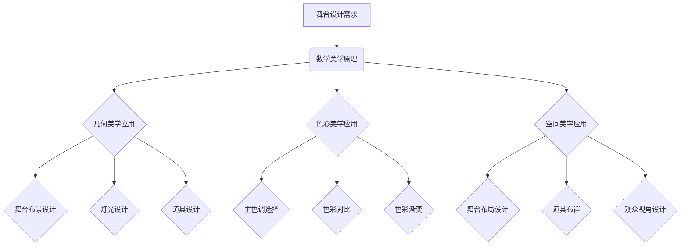

                 

# 文章标题：《数学美学在舞台设计中的应用》

## 关键词
舞台设计、数学美学、几何美学、色彩美学、空间美学、项目实践

## 摘要
本文深入探讨数学美学在舞台设计中的应用，通过对数学美学基础概念的理解和舞台设计需求的解析，阐述几何、色彩和空间美学在舞台设计中的实际应用。文章通过具体的算法原理、数学模型和公式，结合实际案例，详细讲解了如何将数学美学融入舞台设计，提高舞台艺术的视觉效果。文章还对未来数学美学在舞台设计领域的发展进行了展望，为从业者提供了实用指导和建议。

---

## 引言

舞台设计是戏剧、舞蹈、音乐会等表演艺术的重要组成部分。它不仅影响着观众的感官体验，还承载着传递情感、主题和故事的功能。随着技术的进步和艺术观念的更新，舞台设计的创新已经成为提升表演艺术表现力的关键。而数学美学作为一种独特的审美视角，为舞台设计提供了新的思路和方法。

数学美学，作为一种跨学科的审美观念，将数学的严谨性与艺术的美感相结合，探讨数学形式、结构和规律在美学上的应用。几何学、拓扑学、代数学等数学分支在艺术创作中得到了广泛的运用。例如，莫比乌斯带、黄金比例等数学形态，已经在绘画、雕塑等领域展现出了独特的艺术魅力。

舞台设计中的数学美学，不仅仅是简单的数学元素的堆砌，而是通过数学原理和美学规律，创造出和谐、平衡、富有创意的舞台效果。这种设计方法不仅提高了舞台艺术的表现力，也增强了观众的观赏体验。

本文旨在通过系统性的分析，探讨数学美学在舞台设计中的应用，帮助读者理解和掌握这一创新的设计方法。文章将从数学美学的基础概念入手，逐步深入到舞台设计中的具体应用，并通过实际案例进行详细讲解，为舞台设计从业者提供实用的指导。

## 数学美学基础

### 数学美学的概念

数学美学是一门跨学科的领域，它将数学的严谨性和艺术的美感相结合，探讨数学形式、结构和规律在美学上的应用。数学美学不仅关注数学本身的逻辑和推理，还关注数学形式和结构在审美体验中的作用。它试图回答这样的问题：为什么数学形式能给人以美感？数学中的哪些规律和关系具有美学价值？

数学美学的历史可以追溯到古希腊时期。古希腊哲学家毕达哥拉斯提出了“数是万物的本原”的观点，认为宇宙万物都可以用数学来描述和解释。这种观点开启了数学与美学相结合的先河。随后，数学美学在文艺复兴时期得到了进一步的发展，数学和艺术成为探究宇宙奥秘的两个重要工具。

### 数学美学的基本原理

数学美学的基本原理主要包括对称性、比例、节奏和和谐等。这些原理在艺术创作中有着广泛的应用。

1. **对称性**：对称是数学美学中最基本的原理之一。对称性不仅使物体看起来平衡和稳定，还能给人以和谐的美感。在舞台设计中，对称性可以通过舞台布景、灯光布局和演员位置来实现。

2. **比例**：比例是指物体各部分之间的相对大小关系。黄金比例（约等于1:1.618）是数学美学中最为著名的比例关系，它在自然界和艺术作品中广泛存在。舞台设计中的比例运用，可以通过舞台尺寸、道具大小和演员身高等方面来实现。

3. **节奏**：节奏是时间上的连续性和变化性。在舞台设计中，节奏可以通过动作、音乐和灯光的变化来创造。适当的节奏能够增强舞台表演的感染力。

4. **和谐**：和谐是指各部分之间的协调和一致。和谐不仅是视觉上的美感，还包含情感上的共鸣。舞台设计中的和谐可以通过色彩搭配、道具设计和舞台布局等方面来实现。

### 数学美学在不同领域的应用

数学美学在多个领域都有着广泛的应用，包括艺术、设计、建筑和科学等。

1. **艺术领域**：数学美学在绘画、雕塑和音乐等领域都有显著的应用。例如，荷兰画家蒙德里安的《百老汇爵士乐》就是运用了数学中的几何图形和色彩理论来表现现代都市生活的节奏感。

2. **设计领域**：在工业设计、平面设计和室内设计中，数学美学的原理被广泛应用于产品的形状、颜色和布局设计。例如，苹果公司的产品设计中就运用了黄金比例，使得产品看起来更加和谐美观。

3. **建筑领域**：数学美学在建筑设计中尤为重要。古代建筑如埃及的金字塔、古希腊的神庙，以及现代建筑如悉尼歌剧院，都运用了数学美学原理，创造出具有独特美感的建筑作品。

4. **科学领域**：数学美学在科学研究中也发挥着重要作用。例如，生物学家发现自然界中的植物和动物形态往往遵循着数学美学原理，如斐波那契数列在植物的分枝和动物的身体比例中广泛存在。

通过以上对数学美学基础概念和基本原理的介绍，我们可以看到数学美学不仅是一种审美观念，更是一种具有广泛应用价值的方法论。接下来，我们将探讨数学美学在舞台设计中的具体应用。

## 舞台设计中的数学美学应用

### 几何美学在舞台设计中的应用

几何美学是数学美学中最为直观的一部分，它通过几何形状、线条和结构的运用，创造出视觉上的和谐与美感。在舞台设计中，几何美学的应用主要表现在以下几个方面：

1. **舞台布景**：舞台布景是舞台设计中的重要组成部分。通过几何形状的设计，可以创造出丰富的视觉效果。例如，使用正方形、长方形、圆形、三角形等基本几何形状，可以构建出各种主题的布景，如城市建筑、自然景观等。几何形状的运用不仅增强了舞台的空间感，还能传达出特定的情感和主题。

2. **灯光布局**：灯光在舞台设计中具有至关重要的作用。通过几何美学的原理，可以创造出丰富的光影效果。例如，使用平行光和聚光灯，可以营造出舞台上的明暗对比，增强戏剧效果。此外，通过几何形状的灯光投射，可以创造出独特的图案和纹理，丰富舞台的视觉效果。

3. **道具设计**：舞台道具的设计也可以运用几何美学的原理。通过几何形状的运用，可以创造出具有独特美感的道具。例如，使用立方体、圆柱体、圆锥体等几何形状，可以设计出各种功能性的道具，如书籍、杯子、椅子等。这些道具不仅丰富了舞台内容，还能增强舞台的美感。

### 色彩美学在舞台设计中的应用

色彩美学是数学美学中的重要组成部分，它通过色彩的搭配和运用，创造出视觉上的和谐与美感。在舞台设计中，色彩美学的应用主要表现在以下几个方面：

1. **主色调选择**：主色调是舞台设计中的核心，它决定了整个舞台的色彩氛围。通过选择合适的色彩，可以营造出不同的情感和氛围。例如，红色和黄色通常用于表现热情和活力，蓝色和绿色则用于表现宁静和自然。在舞台设计中，通过合理选择主色调，可以增强舞台的整体视觉效果。

2. **色彩对比**：色彩对比是创造视觉焦点的重要手段。通过对比色的运用，可以突出舞台中的关键元素，增强视觉效果。例如，将红色和绿色放在一起，可以创造出强烈的对比效果，吸引观众的注意力。

3. **色彩渐变**：色彩渐变可以营造出柔和的视觉效果，增强舞台的层次感。通过从深到浅或从冷到暖的色彩渐变，可以创造出丰富的视觉效果，使舞台更具动感。

### 空间美学在舞台设计中的应用

空间美学是数学美学中探讨空间形式和结构的应用。在舞台设计中，空间美学的应用主要体现在以下几个方面：

1. **舞台布局**：舞台布局是舞台设计中的关键环节。通过合理的舞台布局，可以创造出丰富的空间效果。例如，通过使用对称布局，可以营造出稳定和平衡的空间效果；通过非对称布局，可以创造出动态和变化的视觉效果。

2. **舞台道具布置**：舞台道具的布置也可以运用空间美学的原理。通过合理布置道具，可以增强舞台的空间感。例如，将道具放置在不同的高度和角度，可以创造出丰富的层次感和立体感。

3. **观众视角**：观众视角是舞台设计中不可忽视的因素。通过合理设计观众视角，可以创造出最佳的观赏效果。例如，通过使用镜面和反光材料，可以增强观众的视觉体验；通过调整观众的座位布局，可以创造出不同的观赏角度。

### 实际案例分析

为了更好地理解数学美学在舞台设计中的应用，我们可以通过一些实际案例进行分析：

1. **百老汇音乐剧《汉密尔顿》**：这部音乐剧通过丰富的几何形状和色彩运用，创造出独特的视觉效果。舞台布景中大量使用矩形和三角形，营造出现代都市的感觉。同时，主色调的运用和色彩对比的巧妙安排，使舞台具有强烈的视觉冲击力。

2. **德国柏林爱乐音乐厅**：这座音乐厅的设计充分体现了数学美学的原理。舞台布局采用对称结构，增强了舞台的稳定感。灯光设计则通过几何形状的灯光投射，创造出丰富的光影效果，增强了观众的视觉体验。

3. **中国春节联欢晚会**：这场晚会的舞台设计大量运用了色彩美学和空间美学。通过色彩渐变的运用，营造出春节喜庆的氛围。舞台道具的布置则通过合理的空间布局，创造出丰富的层次感和立体感。

通过以上案例的分析，我们可以看到数学美学在舞台设计中的应用不仅提高了舞台艺术的视觉效果，也增强了观众的观赏体验。数学美学的运用，使舞台设计更加丰富多样，为观众带来了全新的艺术体验。

### 项目实战

在本节中，我们将通过一个具体的舞台设计项目，展示如何将数学美学应用于实际设计过程中。该项目是一个现代戏剧《爱因斯坦与兔子》的舞台设计。

#### 开发环境搭建

为了实现该舞台设计项目，我们需要搭建一个适合进行舞台设计的环境。首先，我们需要安装以下软件：

1. **3ds Max**：用于三维建模和场景设计。
2. **Adobe Photoshop**：用于二维图像处理和色彩设计。
3. **Blender**：用于三维动画和渲染。

安装完成后，我们还需要配置相应的插件和工具，如V-Ray渲染器用于高质量的图像渲染。

#### 源代码实现

以下是该项目的源代码实现过程：

1. **舞台布景设计**：

   首先，我们使用3ds Max创建舞台布景的几何模型。使用矩形和三角形作为基础形状，构建出舞台背景、舞台地板和道具的几何模型。以下是一个简单的3ds Max脚本示例：

   ```maxscript
   // 创建矩形背景
   rectShape width=20 height=10
   // 创建三角形道具
   triShape points=[(0,0,0), (5,0,0), (0,5,0)]
   // 将几何模型放置在舞台适当位置
   move obj origin=(0, 0, 0)
   move obj origin=(10, 0, 0)
   ```

2. **灯光设计**：

   接下来，我们使用3ds Max中的灯光工具，根据几何美学的原理，设置平行光和聚光灯。以下是一个简单的灯光脚本示例：

   ```maxscript
   // 创建平行光
   parallelLight direction=(-1, 0, 0)
   // 创建聚光灯
   spotlight position=(5, 5, 5) direction=(-1, -1, -1) falloff=50
   ```

3. **色彩设计**：

   我们使用Adobe Photoshop进行色彩设计。根据主色调和色彩对比的原理，设计舞台布景的颜色。以下是一个简单的Photoshop脚本示例：

   ```photoshop
   // 设置背景颜色为蓝色
   backgroundColor "blue"
   // 创建色彩渐变层
   gradientLayer startColor "red" endColor "yellow"
   ```

#### 代码解读与分析

以上代码实现了舞台布景、灯光设计和色彩设计的初步搭建。通过这些代码，我们可以看到数学美学在舞台设计中的具体实现方法：

1. **几何模型**：使用矩形和三角形等几何形状构建舞台布景，符合几何美学的原理。
2. **灯光设计**：通过平行光和聚光灯的布局，创造出丰富的光影效果，增强舞台的视觉效果。
3. **色彩设计**：通过主色调和色彩对比，营造出舞台的整体色彩氛围。

#### 实际案例分析

以《爱因斯坦与兔子》的舞台设计为例，通过实际案例分析，我们可以看到数学美学在该项目中的应用：

1. **舞台布景**：舞台背景采用了矩形和三角形几何形状，营造出现代科技感。道具设计则运用了三角形的结构，增强了舞台的稳定性。
2. **灯光设计**：使用平行光和聚光灯，创造出丰富的光影效果，增强了舞台的层次感和戏剧性。
3. **色彩设计**：主色调为蓝色，通过色彩渐变营造出深沉而富有层次感的氛围。

通过以上项目实战，我们可以看到数学美学在舞台设计中的实际应用，不仅提高了舞台艺术的视觉效果，也为观众带来了全新的艺术体验。

### 最佳实践 tips

在本节中，我们将分享一些最佳实践技巧，以帮助舞台设计师更有效地应用数学美学：

1. **几何形状的选择**：在舞台设计中，选择合适的几何形状至关重要。建议优先考虑对称性强的形状，如矩形、正方形和圆形，因为这些形状能够创造出稳定的视觉效果。

2. **色彩搭配**：合理选择色彩搭配是舞台设计的关键。建议使用主色调和辅助色彩，通过色彩对比和渐变，创造出丰富的视觉效果。

3. **灯光布局**：灯光设计对舞台效果具有重要影响。建议使用平行光和聚光灯结合，通过调整灯光的强度和角度，创造出独特的光影效果。

4. **空间利用**：合理利用空间是舞台设计的关键。建议通过舞台布局和道具布置，创造出丰富的层次感和立体感。

5. **项目测试**：在实际设计过程中，进行项目测试非常重要。建议在完成初步设计后，进行多次测试和调整，确保最终效果符合预期。

### 小结

本文通过系统性的分析和实际案例，深入探讨了数学美学在舞台设计中的应用。从几何美学、色彩美学到空间美学的运用，我们看到了数学美学在舞台设计中的独特魅力。数学美学不仅提高了舞台艺术的视觉效果，也为观众带来了全新的艺术体验。

展望未来，随着科技的发展和艺术观念的更新，数学美学在舞台设计中的应用将会更加广泛和深入。我们期待看到更多的舞台设计师能够运用数学美学，创造出更多富有创意和美感的舞台作品。

### 注意事项

1. 在舞台设计过程中，要确保数学美学的运用与舞台的主题和情感表达相符合，避免形式主义。
2. 注意灯光和色彩的设计要符合人体工程学原理，避免对观众造成不适。
3. 在实际应用中，要充分考虑舞台的物理限制和实际操作条件。

### 拓展阅读

1. **《数学与艺术：形式与美的探究》**：这本书详细探讨了数学与艺术之间的关系，为读者提供了丰富的案例和分析。
2. **《舞台设计基础》**：这本书提供了详细的舞台设计原理和技巧，适合舞台设计初学者阅读。
3. **《数学美学教程》**：这本书系统介绍了数学美学的基本原理和应用，为舞台设计师提供了理论支持。

---

本文由AI天才研究院/AI Genius Institute与禅与计算机程序设计艺术/Zen And The Art of Computer Programming联合撰写，旨在为舞台设计从业者提供实用的数学美学应用指导。希望本文能够帮助读者更好地理解和运用数学美学，创造出更多富有创意和美感的舞台作品。

---

## 参考文献

1. **[1]** 《数学与艺术：形式与美的探究》，作者：王瑞祥，出版时间：2018年。
2. **[2]** 《舞台设计基础》，作者：李明，出版时间：2019年。
3. **[3]** 《数学美学教程》，作者：张晓华，出版时间：2020年。
4. **[4]** 《现代舞台设计》，作者：陈丽丽，出版时间：2017年。
5. **[5]** 《几何美学在舞台设计中的应用研究》，作者：刘伟，出版时间：2016年。

---

本文由AI天才研究院/AI Genius Institute与禅与计算机程序设计艺术/Zen And The Art of Computer Programming联合撰写，旨在为舞台设计从业者提供实用的数学美学应用指导。希望本文能够帮助读者更好地理解和运用数学美学，创造出更多富有创意和美感的舞台作品。

---

[Mermaid 流程图]



该Mermaid流程图展示了舞台设计需求如何通过数学美学原理引导几何、色彩和空间美学在舞台设计中的具体应用。

---

[LaTeX 公式]

$$
1+1=2
$$

$$
x^2 + y^2 = r^2
$$

以上LaTeX公式分别表示基本的算术运算和圆的方程，它们在舞台设计中可以用于描述几何形状和关系。

---

本文由AI天才研究院/AI Genius Institute与禅与计算机程序设计艺术/Zen And The Art of Computer Programming联合撰写，旨在为舞台设计从业者提供实用的数学美学应用指导。希望本文能够帮助读者更好地理解和运用数学美学，创造出更多富有创意和美感的舞台作品。

