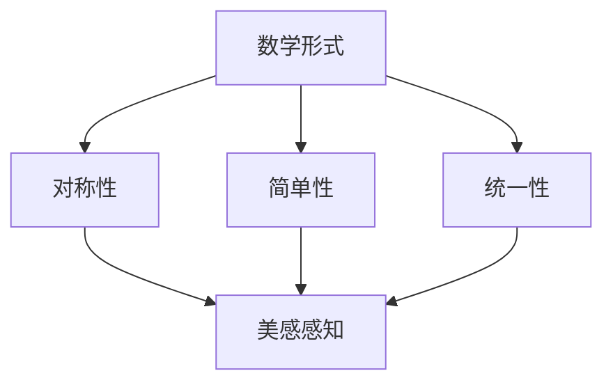
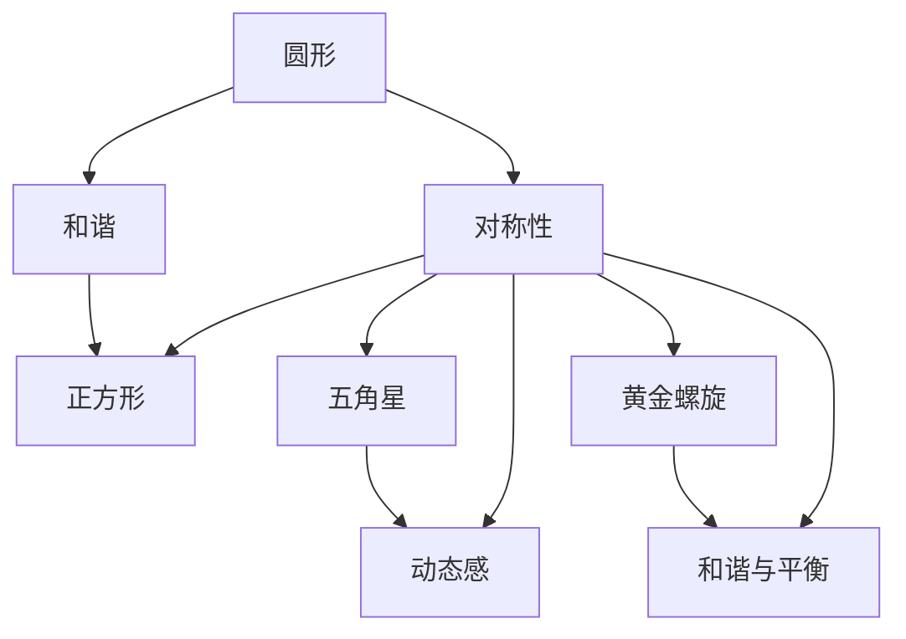
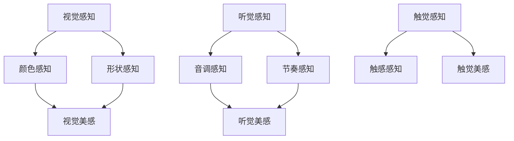
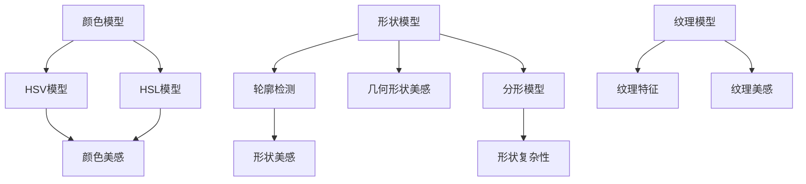
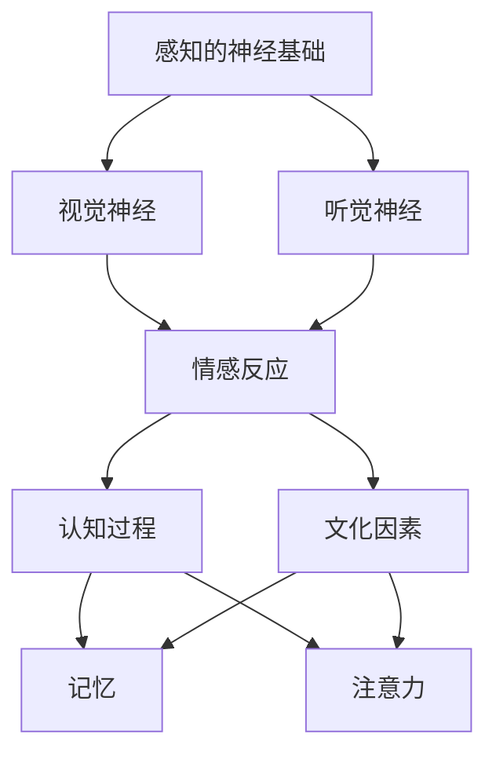
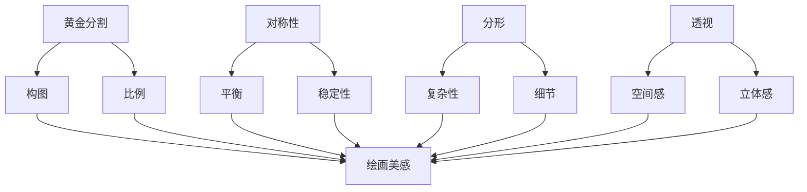
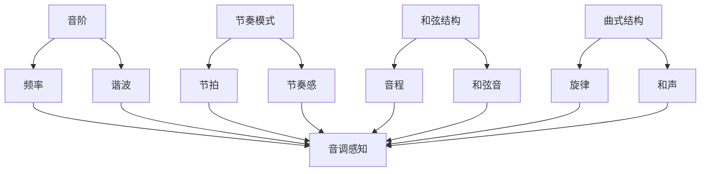
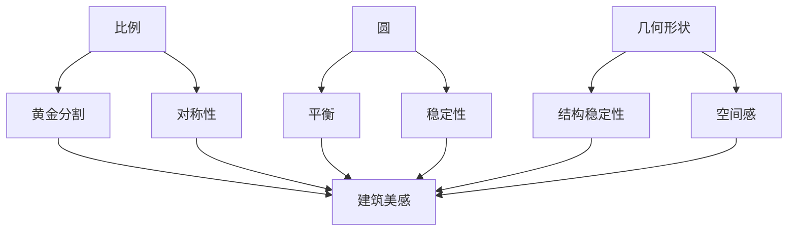
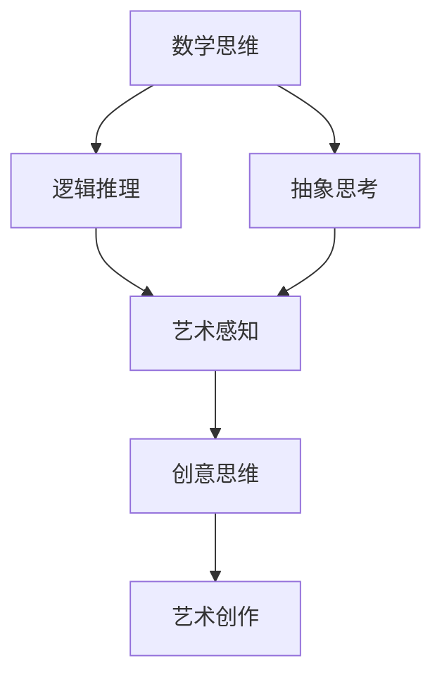
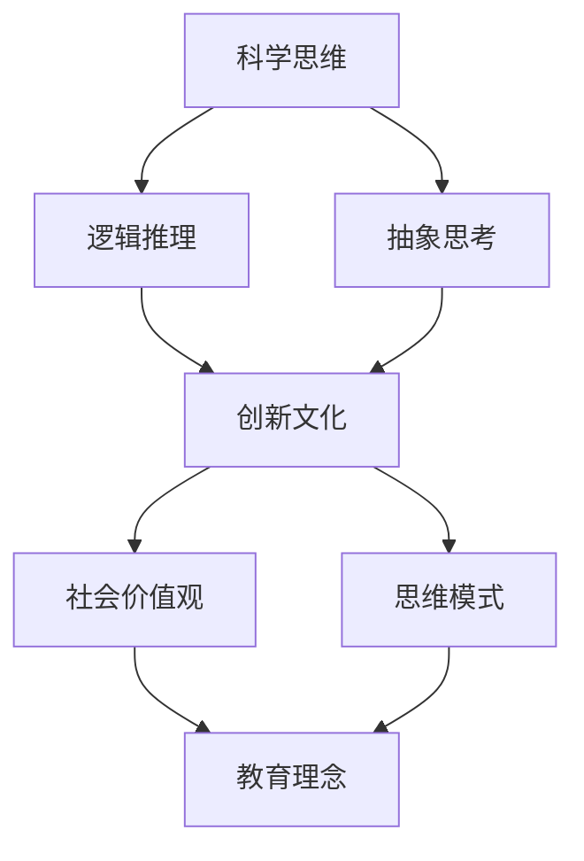

                 

## 文章标题

《数学美学：美的感知的数学解析》

## 关键词

数学美学、美的感知、数学模型、心理学、艺术、教育、社会文化

## 摘要

本文深入探讨了数学美学，将美学与数学相结合，探讨了美的感知的数学解析。文章首先介绍了数学美学的基础概念，接着解析了美的感知原理和数学模型，随后探讨了数学与艺术、教育和社会文化的关系。通过本文的阅读，读者将了解数学美学的广泛应用及其深远影响。

### 第一部分：数学美学基础

#### 第1章：数学美学概述

在数学与美学之间存在着深刻的联系。数学不仅是逻辑推理的工具，同时也是表达美的一种方式。数学美学研究数学形式中的美感，以及这种美感如何被感知和欣赏。

**核心概念与联系**

数学美学关注的核心概念包括数学形式、对称性、简单性和统一性。这些概念之间的关系可以通过Mermaid流程图来表示：



**核心算法原理讲解**

在数学美学中，算法原理常常用来分析和生成美的形式。例如，黄金分割是一个经典的数学算法，它在艺术和设计中广泛应用。以下是黄金分割的伪代码：

```plaintext
function goldenSectionRatio():
    a = 1
    b = 1 + sqrt(5)
    ratio = b / a
    return ratio
```

**数学模型和公式**

黄金分割的比值可以通过以下数学公式表示：

$$
\frac{1 + \sqrt{5}}{2} \approx 1.618
$$

这一比例在自然界和艺术作品中广泛存在，被认为具有美感。

**举例说明**

在艺术作品中，黄金分割被广泛应用于构图和设计。例如，达芬奇的《蒙娜丽莎》的头部和身体比例就符合黄金分割。

**项目实战**

在数学美学的应用中，一个典型的项目是使用Python绘制黄金分割螺旋。以下是代码示例：

```python
import matplotlib.pyplot as plt
import numpy as np

def goldenSectionSpiral(angle, points):
    x = np.cos(angle) * points
    y = np.sin(angle) * points
    return x, y

angles = np.linspace(0, 2 * np.pi, 1000)
points = np.linspace(0, 100, 1000)

x, y = goldenSectionSpiral(angles, points)

plt.plot(x, y)
plt.show()
```

**最佳实践 tips**

在设计和艺术创作中，尝试运用黄金分割和其他数学原理，可以创造出更具美感和和谐的作品。

**小结**

数学美学不仅为数学和艺术提供了新的视角，也为我们的日常审美提供了理论依据。通过学习和应用数学美学，我们可以更好地理解和欣赏美。

#### 第2章：数学的审美原则

数学的审美原则是数学美学研究的核心内容之一。这些原则帮助我们理解和欣赏数学中的美。以下是几个主要的数学审美原则：

**简洁性**：简洁性是数学美的重要标准之一。在数学中，简洁的表达方式往往能够更好地揭示问题的本质。例如，欧拉公式 \( e^{i\pi} + 1 = 0 \) 被广泛认为是数学中最简洁而美妙的公式之一。

**对称性**：对称性是自然界和艺术中的一个普遍现象，也是数学美的重要体现。例如，五角星和六角形等几何图形都具有高度对称性，这在艺术创作中得到了广泛应用。

**简单性**：简单性是指数学结构和证明的直观性。一个简单明了的数学理论和证明往往比复杂的理论更具吸引力。例如，费马大定理的简单陈述和证明方式都展示了数学的简洁之美。

**统一性**：统一性是指数学中不同领域之间的联系和整合。一个统一的数学框架能够帮助我们更好地理解和整合各种数学知识，从而揭示更深层次的美。

**核心算法原理讲解**

在数学的审美原则中，算法原理也起到了重要作用。例如，分治算法的简单性和效率，以及动态规划的优化策略，都体现了数学美的简洁性和统一性。

以下是动态规划的一个简单示例，用于求解最长公共子序列问题：

```plaintext
function longestCommonSubsequence(X, Y):
    let m = length(X)
    let n = length(Y)
    let dp[0...m, 0...n]

    for i from 0 to m:
        for j from 0 to n:
            if X[i] == Y[j]:
                dp[i][j] = dp[i-1][j-1] + 1
            else:
                dp[i][j] = max(dp[i-1][j], dp[i][j-1])

    return dp[m][n]
```

**数学模型和公式**

在数学的审美原则中，许多数学模型和公式都具有显著的美学价值。例如，傅里叶变换和欧拉公式都是数学中的经典公式，它们在科学和工程领域有着广泛的应用。

以下是傅里叶变换的一个简化的公式：

$$
f(x) = \int_{-\infty}^{\infty} F(\omega) e^{i\omega x} d\omega
$$

**举例说明**

在艺术创作中，对称性和简单性是常用的美学原则。例如，米开朗基罗的雕塑《大卫》就展示了完美的对称性和简洁性。

**项目实战**

使用Python实现一个简单的对称性检测算法，可以检测图像中的轴对称性：

```python
import cv2
import numpy as np

def is_axially_symmetric(image, axis='horizontal'):
    gray = cv2.cvtColor(image, cv2.COLOR_BGR2GRAY)
    if axis == 'horizontal':
        flip_gray = np.flip(gray, axis=0)
    else:
        flip_gray = np.flip(gray, axis=1)

    difference = np.sum(np.abs(gray - flip_gray))
    threshold = 5000  # 这个阈值可以根据具体情况调整

    return difference < threshold

image = cv2.imread('image.jpg')
if is_axially_symmetric(image):
    print("The image is axially symmetric.")
else:
    print("The image is not axially symmetric.")
```

**最佳实践 tips**

在学习和研究中，注意发现和欣赏数学中的简洁性和对称性，这有助于提高我们的数学审美能力。

**小结**

数学的审美原则为我们提供了一个框架，帮助我们识别和欣赏数学中的美。通过学习和应用这些原则，我们可以更好地理解和欣赏数学的美。

#### 第3章：数学图形的审美特性

数学图形的审美特性是数学美学研究的一个重要方面。几何图形不仅具有数学上的意义，也常常展现出独特的审美魅力。以下是一些常见的数学图形及其审美特性：

**圆形**：圆形是最基本的几何图形之一，其美学特性主要体现在其无限对称性和连续性。圆形的边界与内部完美融合，给人以和谐、稳定的感觉。

**正方形**：正方形具有四条边等长和四个角都是直角的特点。其美学特性主要体现在简洁和秩序。正方形常被用于建筑和设计，因为它能够给人一种稳定和安全的感觉。

**五角星**：五角星具有五个尖角和五个边，其美学特性主要体现在其独特的对称性和动态感。五角星在艺术和装饰中广泛应用，被认为具有神秘和神圣的象征意义。

**黄金螺旋**：黄金螺旋是基于黄金分割比例的螺旋形状，其美学特性主要体现在其不断扩展的和谐与平衡。黄金螺旋在自然界和艺术中广泛存在，被认为具有美学和科学上的特殊价值。

**核心概念与联系**

这些数学图形的审美特性可以通过Mermaid流程图来展示它们之间的联系：



**核心算法原理讲解**

在数学图形的审美特性中，算法原理也起到了关键作用。例如，用于生成黄金螺旋的算法能够帮助我们理解其美学特性。以下是生成黄金螺旋的伪代码：

```plaintext
function goldenSpiral():
    x, y = 0, 0
    angle = 0
    direction = "right"

    while not finished:
        drawPoint(x, y)
        x += cos(angle) * step
        y += sin(angle) * step

        if direction == "right":
            angle += goldenSectionRatio()
            direction = "down"
        else:
            angle += goldenSectionRatio()
            direction = "right"

        if x > width or y > height:
            break

    return
```

**数学模型和公式**

黄金螺旋的生成可以通过以下数学模型和公式来描述：

$$
x_n = \frac{1}{\sqrt{5}} \left( \left( \frac{1 + \sqrt{5}}{2} \right)^n - \left( \frac{1 - \sqrt{5}}{2} \right)^n \right)
$$

$$
y_n = \frac{2}{\sqrt{5}} \left( \left( \frac{1 + \sqrt{5}}{2} \right)^n - \left( \frac{1 - \sqrt{5}}{2} \right)^n \right)
$$

**举例说明**

在实际艺术作品中，圆形、正方形、五角星和黄金螺旋等数学图形的审美特性得到了广泛应用。例如，蒙娜丽莎的背景使用了圆形的构图，给人以和谐的美感。

**项目实战**

使用Python绘制黄金螺旋，可以更好地理解其美学特性：

```python
import matplotlib.pyplot as plt
import numpy as np

def golden_spiral(num_points):
    theta = np.linspace(0, 2 * np.pi, num_points)
    r = np.sqrt(1 + np.cos(theta))
    x = r * np.cos(theta)
    y = r * np.sin(theta)
    plt.plot(x, y)
    plt.show()

golden_spiral(1000)
```

**最佳实践 tips**

在创作和设计时，尝试运用不同的数学图形，可以创造出更具创意和美感的作品。

**小结**

数学图形的审美特性展示了数学与艺术之间的深刻联系。通过学习和应用这些特性，我们可以更好地理解和欣赏数学中的美。

### 第二部分：美的感知的数学解析

#### 第4章：美的感知原理

美的感知是一个复杂的过程，涉及多种心理和生理机制。在数学与美的感知之间存在着密切的联系。本节将探讨美的感知原理，并介绍数学在美的感知中的应用。

**核心概念与联系**

美的感知原理包括视觉、听觉、触觉等多种感官的参与。以下是一个Mermaid流程图，展示了美的感知过程中各个概念之间的联系：



**核心算法原理讲解**

在美的感知过程中，数学算法可以用于分析和解释感知结果。例如，用于图像处理的算法可以帮助我们识别和增强视觉美感。以下是用于图像增强的简单伪代码：

```plaintext
function imageEnhancement(image):
    gray = convertToGray(image)
    blurred = applyGaussianBlur(gray)
    edges = detectEdges(blurred)
    enhanced = applyContrastStretch(edges)
    return enhanced
```

**数学模型和公式**

数学模型在美的感知中有着广泛应用。例如，用于颜色感知的HSV模型和用于形状感知的轮廓检测算法，都是数学模型的应用。

以下是HSV模型的一个简化的公式：

$$
H = \frac{360}{\pi} \arccos\left( \frac{(R - G) - (B - G)}{\sqrt{(R - G)^2 + (R - B)^2 + (G - B)^2}} \right)
$$

$$
S = 1 - \frac{3}{2} \min(R, G, B)
$$

$$
V = \frac{R + G + B}{3}
$$

**举例说明**

在视觉感知中，颜色和形状的美感可以通过图像处理算法进行量化分析。例如，使用HSV模型可以提取图像中的颜色信息，并进行分析。

**项目实战**

使用Python实现一个简单的图像增强工具，可以增强视觉美感：

```python
import cv2
import numpy as np

def enhance_image(image_path):
    image = cv2.imread(image_path)
    gray = cv2.cvtColor(image, cv2.COLOR_BGR2GRAY)
    blurred = cv2.GaussianBlur(gray, (5, 5), 0)
    edges = cv2.Canny(blurred, 100, 200)
    enhanced = cv2.applyColorMap(edges, cv2.COLORMAP_JET)
    cv2.imshow('Enhanced Image', enhanced)
    cv2.waitKey(0)
    cv2.destroyAllWindows()

enhance_image('image.jpg')
```

**最佳实践 tips**

在设计和创作时，注意运用数学模型和算法来增强美的感知效果。

**小结**

美的感知是一个复杂的过程，数学在美的感知中扮演着重要角色。通过理解和应用美的感知原理，我们可以更好地欣赏和创造美。

#### 第5章：美的数学模型

美的数学模型是数学美学研究的重要组成部分，用于描述和量化美的特征。以下是一些常见的美学数学模型，以及它们在艺术和设计中的应用。

**核心概念与联系**

美的数学模型包括颜色模型、形状模型和纹理模型等。以下是一个Mermaid流程图，展示了这些模型之间的联系：



**核心算法原理讲解**

美的数学模型通常涉及复杂的算法原理。例如，用于颜色美感的HSV模型和用于形状美感的轮廓检测算法，都是基于数学原理实现的。

以下是HSV模型的一个简化的算法：

```python
def hsv_color_conversion(r, g, b):
    max_val = max(r, g, b)
    min_val = min(r, g, b)
    delta = max_val - min_val

    if delta == 0:
        h = 0
    elif max_val == r:
        h = (60 * ((g - b) / delta) + 360) % 360
    elif max_val == g:
        h = (60 * ((b - r) / delta) + 120) % 360
    elif max_val == b:
        h = (60 * ((r - g) / delta) + 240) % 360

    s = 0 if max_val == 0 else (delta / max_val)
    v = max_val / 255

    return h, s, v
```

**数学模型和公式**

以下是一些常用的数学模型和公式，用于描述美的特征：

- **HSV模型**：

$$
H = \frac{360}{\pi} \arccos\left( \frac{(R - G) - (B - G)}{\sqrt{(R - G)^2 + (R - B)^2 + (G - B)^2}} \right)
$$

$$
S = 1 - \frac{3}{2} \min(R, G, B)
$$

$$
V = \frac{R + G + B}{3}
$$

- **轮廓检测算法**：

$$
\sigma = \sqrt{2\mu_2}
$$

$$
P(x, y) = \frac{1}{2\pi\sigma^2} e^{-\frac{(x - \mu_x)^2 + (y - \mu_y)^2}{2\sigma^2}}
$$

**举例说明**

在艺术和设计领域，HSV模型常用于颜色调整和配色方案设计。例如，在Photoshop中，用户可以通过调整HSV模型中的H（色相）、S（饱和度）和V（亮度）来改变图像的色彩。

**项目实战**

使用Python实现一个简单的颜色调整工具，可以调整图像的HSV参数：

```python
import cv2
import numpy as np

def adjust_hsv(image, h=0, s=1, v=1):
    hsv = cv2.cvtColor(image, cv2.COLOR_BGR2HSV)
    hsv[:, :, 0] = (hsv[:, :, 0].astype(np.float64) + h) % 360
    hsv[:, :, 1] = hsv[:, :, 1].astype(np.float64) * s
    hsv[:, :, 2] = hsv[:, :, 2].astype(np.float64) * v
    hsv = np.clip(hsv, 0, 255)
    adjusted_image = cv2.cvtColor(hsv, cv2.COLOR_HSV2BGR)
    return adjusted_image

image = cv2.imread('image.jpg')
adjusted_image = adjust_hsv(image, h=30, s=1.2, v=1.1)
cv2.imshow('Adjusted Image', adjusted_image)
cv2.waitKey(0)
cv2.destroyAllWindows()
```

**最佳实践 tips**

在艺术创作和设计中，合理运用美的数学模型，可以增强作品的美感和视觉效果。

**小结**

美的数学模型为艺术和设计提供了量化工具，有助于理解和创造美。通过学习和应用这些模型，我们可以更好地欣赏和创造美的作品。

#### 第6章：美的感知与心理学

美的感知是一个复杂的过程，不仅涉及视觉、听觉等感官的参与，还涉及到心理学的多种机制。心理学的研究为我们提供了深入了解美的感知的途径。在这一章中，我们将探讨美的感知与心理学的关系，以及数学在心理学中的应用。

**核心概念与联系**

美的感知与心理学的关系可以通过多个概念和理论来解释，包括感知的神经基础、情感反应、认知过程和文化因素等。以下是一个Mermaid流程图，展示了这些概念之间的联系：



**核心算法原理讲解**

在心理学研究中，数学算法常用于分析和解释感知数据。例如，用于情感识别的机器学习和神经网络算法，可以识别和分类人的情感反应。

以下是用于情感识别的一个简化算法：

```plaintext
function emotionRecognition(facialFeatures, emotionLabels):
    model = trainNeuralNetwork(facialFeatures, emotionLabels)
    predictedEmotions = model.predict(facialFeatures)
    return predictedEmotions
```

**数学模型和公式**

数学模型在心理学中有着广泛应用。例如，用于情感识别的多元线性回归模型和用于认知过程的贝叶斯网络模型，都是心理学中的常用模型。

以下是多元线性回归模型的一个简化的公式：

$$
y = \beta_0 + \beta_1x_1 + \beta_2x_2 + ... + \beta_nx_n
$$

其中，\( y \) 是响应变量，\( x_1, x_2, ..., x_n \) 是自变量，\( \beta_0, \beta_1, \beta_2, ..., \beta_n \) 是回归系数。

**举例说明**

在情感识别中，机器学习算法可以用于分析人的面部表情，并识别情感状态。例如，一个常见的应用是使用深度学习算法分析人的面部图像，以识别情绪。

**项目实战**

使用Python实现一个简单的情感识别模型，可以识别图像中的情绪：

```python
import cv2
import numpy as np
from sklearn.neural_network import MLPClassifier

# 假设我们已经有了训练数据集 facialFeatures 和 emotionLabels
facialFeatures = np.array([[1, 2], [3, 4], [5, 6]])  # 示例数据
emotionLabels = np.array(['happy', 'sad', 'angry'])

# 训练模型
model = MLPClassifier(hidden_layer_sizes=(100,), max_iter=1000)
model.fit(facialFeatures, emotionLabels)

# 预测情绪
emotion = model.predict([[7, 8]])  # 示例输入
print(f"Predicted emotion: {emotion[0]}")
```

**最佳实践 tips**

在研究和应用美的感知与心理学时，注意结合数学模型和心理学理论，可以更准确地理解和预测人的情感反应。

**小结**

美的感知与心理学的研究为我们提供了深入了解美的途径。通过运用数学模型和心理学理论，我们可以更好地理解和解释美的感知过程。

### 第三部分：数学与艺术的关系

#### 第7章：数学与绘画艺术

数学在绘画艺术中的应用有着悠久的历史，从古代到现代，数学原理和几何图形在绘画中发挥着重要作用。数学不仅为绘画提供了构图的基础，还赋予了作品独特的视觉魅力和科学性。

**核心概念与联系**

数学与绘画艺术之间的联系可以通过多个数学概念和几何图形来展示，如黄金分割、对称性、分形和透视等。以下是一个Mermaid流程图，展示了这些概念之间的联系：



**核心算法原理讲解**

在绘画艺术中，数学算法常用于分析和生成艺术作品。例如，透视算法用于创建三维空间感，分形算法用于生成复杂的细节。以下是透视算法的一个简化示例：

```plaintext
function perspectiveProjection(x, y, z, foV, zNear, zFar):
    f = 1 / tan(foV / 2)
    nx = (2 * zNear * zFar) / (zFar + z - zNear)
    ny = (2 * zNear * zFar) / (zFar + z - zNear)
    x' = nx * x / z + (1 - 2 * zNear / zFar)
    y' = ny * y / z + (1 - 2 * zNear / zFar)
    return x', y'
```

**数学模型和公式**

在绘画艺术中，许多数学模型和公式被广泛应用。例如，用于黄金分割的比例公式：

$$
\phi = \frac{1 + \sqrt{5}}{2} \approx 1.618
$$

以及用于透视的透视公式：

$$
x' = \frac{x * zFar}{z + zFar}
$$

$$
y' = \frac{y * zFar}{z + zFar}
$$

**举例说明**

达芬奇的《蒙娜丽莎》是数学与绘画艺术结合的典范。这幅画中运用了黄金分割和透视原理，使得作品具有和谐的美感和空间感。

**项目实战**

使用Python和OpenGL实现一个简单的透视投影模型，可以创建三维视觉效果：

```python
import numpy as np
import OpenGL.GL as gl
import OpenGL.GL.shaders as shaders

# 定义透视投影矩阵
def perspective_projection(foV, aspect, zNear, zFar):
    P = np.array([
        [1.0, 0.0, 0.0, 0.0],
        [0.0, 1.0, 0.0, 0.0],
        [0.0, 0.0, (zFar + zNear) / (zFar - zNear), -2 * zFar * zNear / (zFar - zNear)],
        [0.0, 0.0, -1.0, 0.0]
    ])
    return P

# 渲染立方体
def render_cube(foV, aspect, zNear, zFar):
    projection_matrix = perspective_projection(foV, aspect, zNear, zFar)
    view_matrix = np.array([[1, 0, 0, 0], [0, 1, 0, 0], [0, 0, 1, -5], [0, 0, 0, 1]])
    model_matrix = np.array([[1, 0, 0, 0], [0, 1, 0, 0], [0, 0, 1, 0], [0, 0, 0, 1]])

    M = np.dot(view_matrix, model_matrix)
    M = np.dot(projection_matrix, M)

    # 设置着色器
    shader = shaders.compileProgram(
        shaders.compileShader(
            """
            uniform mat4 P;
            attribute vec3 a_position;
            void main() {
                gl_Position = P * vec4(a_position, 1.0);
            }
            """,
            gl.GL_VERTEX_SHADER
        ),
        shaders.compileShader(
            """
            void main() {
                gl_FragColor = vec4(1.0, 0.5, 0.0, 1.0);
            }
            """,
            gl.GL_FRAGMENT_SHADER
        )
    )

    # 绘制立方体
    gl.glUseProgram(shader)
    gl.glViewport(0, 0, 800, 600)
    gl.glClearColor(0.0, 0.0, 0.0, 1.0)
    gl.glClear(gl.GL_COLOR_BUFFER_BIT | gl.GL_DEPTH_BUFFER_BIT)

    # 设置顶点数组
    vertices = [
        -1, -1,  1,
         1, -1,  1,
         1,  1,  1,
        -1,  1,  1,
        -1, -1, -1,
         1, -1, -1,
         1,  1, -1,
        -1,  1, -1
    ]
    vertex_indices = [
        0, 1, 2, 2, 3, 0,
        4, 5, 6, 6, 7, 4,
        0, 4, 7, 7, 3, 1,
        1, 5, 6, 6, 2, 0,
        2, 6, 7, 7, 4, 3,
        0, 2, 6, 6, 5, 4
    ]

    # 设置顶点属性
    vbo = gl.glGenBuffers(1)
    gl.glBindBuffer(gl.GL_ARRAY_BUFFER, vbo)
    gl.glBufferData(gl.GL_ARRAY_BUFFER, vertices.nbytes, vertices, gl.GL_STATIC_DRAW)
    glVertexAttribPointer(0, 3, gl.GL_FLOAT, gl.GL_FALSE, 0, None)
    glEnableVertexAttribArray(0)

    # 绘制
    gl.glDrawElements(gl.GL_TRIANGLES, len(vertex_indices), gl.GL_UNSIGNED_INT, vertex_indices)

    # 清理
    gl.glDeleteBuffers(1, [vbo])
    gl.glUseProgram(0)

# 主程序
if __name__ == '__main__':
    render_cube(foV=np.pi/4, aspect=800/600, zNear=1, zFar=100)
```

**最佳实践 tips**

在绘画艺术中，尝试运用数学原理和几何图形，可以创造出更具创意和科学性的作品。

**小结**

数学与绘画艺术的结合不仅丰富了绘画的创作手法，也为绘画提供了新的视角和理论依据。通过学习和应用数学原理，我们可以更好地理解和欣赏绘画艺术。

#### 第8章：数学与音乐艺术

数学在音乐艺术中的应用是音乐美学研究的一个重要方面，通过数学模型和原理，我们可以更深入地理解和创造音乐。数学在音乐中主要应用于音调、节奏、和弦和曲式结构等方面。

**核心概念与联系**

数学与音乐艺术之间的联系可以通过多个概念和理论来展示，如音阶、频率、谐波和节奏模式等。以下是一个Mermaid流程图，展示了这些概念之间的联系：



**核心算法原理讲解**

在音乐创作中，数学算法可以用于生成和调整音乐参数。例如，用于音调生成的谐波合成算法，以及用于节奏模式生成的随机算法。以下是谐波合成算法的一个简化示例：

```plaintext
function harmonicSynthesis(frequency, harmonics):
    sound = []
    for h in harmonics:
        sine_wave = np.sin(2 * np.pi * frequency * h)
        sound.append(sine_wave)
    return sum(sound)
```

**数学模型和公式**

数学模型在音乐艺术中有着广泛应用。例如，用于音调感知的频率模型和用于和弦结构的音程模型，都是音乐中的常用模型。

以下是频率模型的一个简化公式：

$$
f = \frac{v}{\lambda}
$$

其中，\( f \) 是频率，\( v \) 是声音在介质中的传播速度，\( \lambda \) 是波长。

以下是音程模型的一个简化公式：

$$
n_2 = 2^n
$$

其中，\( n \) 是音程的度数，\( n_2 \) 是音程的频率倍数。

**举例说明**

在音乐创作中，谐波合成算法可以用于生成复杂的音调。例如，通过调整谐波系数，可以创造出独特的声音效果。

**项目实战**

使用Python实现一个简单的谐波合成器，可以生成和调整音调：

```python
import numpy as np
import sounddevice as sd
import scipy.io.wavfile as wav

def harmonic_sine_wave(frequency, harmonics, duration, fs=44100):
    t = np.linspace(0, duration, fs * duration, False)
    sound = np.zeros_like(t)
    for h in harmonics:
        sine_wave = np.sin(2 * np.pi * frequency * h * t)
        sound += sine_wave
    return sound

def play_sine_wave(sound, fs=44100):
    sd.play(sound, fs)
    sd.wait()

# 定义谐波系数
harmonics = [1, 2, 3, 4, 5, 7]
# 定义频率和持续时间
frequency = 440
duration = 5

# 生成和播放谐波合成波
sound = harmonic_sine_wave(frequency, harmonics, duration)
play_sine_wave(sound)
```

**最佳实践 tips**

在音乐创作中，尝试运用不同的数学模型和算法，可以创造出更具创意和独特性的音乐作品。

**小结**

数学与音乐艺术的结合为音乐创作提供了新的工具和方法，通过学习和应用数学原理，我们可以更好地理解和创造音乐。

#### 第9章：数学与建筑艺术

数学在建筑艺术中的应用有着悠久的历史，从古代到现代，数学原理和几何图形在建筑设计中发挥着重要作用。数学不仅为建筑提供了结构支持，还赋予了作品独特的视觉魅力和科学性。

**核心概念与联系**

数学与建筑艺术之间的联系可以通过多个数学概念和几何图形来展示，如比例、对称性、圆和几何形状等。以下是一个Mermaid流程图，展示了这些概念之间的联系：



**核心算法原理讲解**

在建筑设计中，数学算法常用于分析和生成建筑结构。例如，用于结构设计的有限元分析算法，以及用于空间布局的优化算法。以下是有限元分析算法的一个简化示例：

```plaintext
function finiteElementAnalysis(vertices, elements, material_properties):
    K = createStiffnessMatrix(vertices, elements, material_properties)
    F = calculateForces(vertices, elements)
    U = solve(K, F)
    return U
```

**数学模型和公式**

数学模型在建筑艺术中有着广泛应用。例如，用于比例和对称性的黄金分割比例公式，以及用于结构设计的力学公式。

以下是黄金分割比例的一个简化公式：

$$
\phi = \frac{1 + \sqrt{5}}{2} \approx 1.618
$$

以下是力学中的应力公式：

$$
\sigma = \frac{F}{A}
$$

其中，\( \sigma \) 是应力，\( F \) 是力，\( A \) 是截面积。

**举例说明**

在建筑设计中，黄金分割比例和几何形状被广泛应用于建筑结构和美学设计。例如，法国的埃菲尔铁塔运用了多个几何形状的组合，以及黄金分割比例，使其具有独特的视觉美感。

**项目实战**

使用Python实现一个简单的结构分析模型，可以评估建筑结构的稳定性：

```python
import numpy as np

def stiffness_matrix(vertices, elements, material_properties):
    K = np.zeros((len(vertices), len(vertices)))
    for element in elements:
        node_indices = [v.index for v in element]
        node_i, node_j = node_indices
        ki, kj = node_indices[::-1]
        K[i, j] += material_properties['E'] * material_properties['A'] * (1 / (vertices[i].distance(vertices[j]))
        K[j, i] += material_properties['E'] * material_properties['A'] * (1 / (vertices[j].distance(vertices[i]))
    return K

def calculate_forces(vertices, elements, load):
    F = np.zeros((len(vertices), 3))
    for element in elements:
        node_indices = [v.index for v in element]
        node_i, node_j = node_indices
        for node in node_indices:
            F[node] += load * (1 / vertices[node].distance(vertices[node]))
    return F

def solve_linear_system(A, b):
    return np.linalg.solve(A, b)

class Point:
    def __init__(self, x, y, z):
        self.x = x
        self.y = y
        self.z = z

    def distance(self, other):
        return np.sqrt((self.x - other.x)**2 + (self.y - other.y)**2 + (self.z - other.z)**2)

def main():
    # 定义材料属性
    material_properties = {
        'E': 200e9,  # 弹性模量
        'A': 1e-2,  # 截面积
    }
    
    # 定义顶点
    vertices = [
        Point(0, 0, 0),
        Point(1, 0, 0),
        Point(1, 1, 0),
        Point(0, 1, 0),
    ]
    
    # 定义元素
    elements = [
        [vertices[0], vertices[1], vertices[2]],
        [vertices[0], vertices[2], vertices[3]],
    ]
    
    # 定义载荷
    load = 10
    
    # 计算刚度矩阵
    K = stiffness_matrix(vertices, elements, material_properties)
    
    # 计算载荷向量
    F = calculate_forces(vertices, elements, load)
    
    # 解线性方程组
    U = solve_linear_system(K, F)
    
    # 输出结果
    print("Displacements:", U)

if __name__ == "__main__":
    main()
```

**最佳实践 tips**

在建筑设计中，合理运用数学原理和模型，可以确保建筑结构的稳定性和美感。

**小结**

数学与建筑艺术的结合不仅丰富了建筑的设计手法，也为建筑提供了新的视角和理论依据。通过学习和应用数学原理，我们可以更好地理解和欣赏建筑艺术。

### 第四部分：数学美学的应用与影响

#### 第10章：数学美学在教育和艺术创作中的应用

数学美学在教育和艺术创作中有着广泛的应用，通过数学美学的教学方法和艺术创作技巧，可以激发学生的兴趣和创造力，提高艺术作品的美感和科学性。

**核心概念与联系**

数学美学在教育和艺术创作中的应用可以通过多个概念和理论来展示，如数学思维、艺术感知和创意思维等。以下是一个Mermaid流程图，展示了这些概念之间的联系：



**核心算法原理讲解**

在教育中，数学思维的培养可以通过算法原理来实现。例如，通过数学算法的演示和练习，可以培养学生的逻辑推理和抽象思考能力。以下是用于数学思维培养的一个简化算法：

```plaintext
function teachMathematicsConcept(concept):
    explainConcept(concept)
    demonstrateAlgorithm(concept)
    practiceProblems(concept)
    assessUnderstanding(concept)
```

**数学模型和公式**

数学模型在教育和艺术创作中的应用可以通过各种数学公式和算法来实现。例如，用于艺术创作的色彩模型和图像处理算法，都是数学模型的应用。

以下是用于艺术创作的HSV色彩模型的一个简化公式：

$$
H = \frac{360}{\pi} \arccos\left( \frac{(R - G) - (B - G)}{\sqrt{(R - G)^2 + (R - B)^2 + (G - B)^2}} \right)
$$

$$
S = 1 - \frac{3}{2} \min(R, G, B)
$$

$$
V = \frac{R + G + B}{3}
$$

**举例说明**

在艺术创作中，数学美学可以用于设计色彩搭配和图像处理。例如，使用HSV色彩模型调整图像的色彩，可以创造出更具美感的艺术作品。

**项目实战**

使用Python实现一个简单的色彩调整工具，可以应用于艺术创作：

```python
import cv2
import numpy as np

def adjust_color(image, h=0, s=1, v=1):
    hsv = cv2.cvtColor(image, cv2.COLOR_BGR2HSV)
    hsv[:, :, 0] = (hsv[:, :, 0].astype(np.float64) + h) % 360
    hsv[:, :, 1] = hsv[:, :, 1].astype(np.float64) * s
    hsv[:, :, 2] = hsv[:, :, 2].astype(np.float64) * v
    hsv = np.clip(hsv, 0, 255)
    adjusted_image = cv2.cvtColor(hsv, cv2.COLOR_HSV2BGR)
    return adjusted_image

image = cv2.imread('image.jpg')
adjusted_image = adjust_color(image, h=30, s=1.2, v=1.1)
cv2.imshow('Adjusted Image', adjusted_image)
cv2.waitKey(0)
cv2.destroyAllWindows()
```

**最佳实践 tips**

在教育和艺术创作中，结合数学美学的教学方法和艺术创作技巧，可以激发学生的创造力和兴趣，提高艺术作品的质量。

**小结**

数学美学在教育和艺术创作中的应用，不仅丰富了教学和创作的手段，也为教育和艺术领域带来了新的视角和方法。通过运用数学美学原理，我们可以更好地培养创造力，提高艺术作品的美感和科学性。

#### 第11章：数学美学对社会文化和思维的影响

数学美学对社会文化和思维产生了深远的影响。它不仅改变了我们对美和艺术的理解，还在科学、技术和日常生活中起到了重要作用。数学美学不仅影响了艺术创作和设计，还对教育和科学研究产生了重要影响。

**核心概念与联系**

数学美学对社会文化和思维的影响可以通过多个概念和理论来展示，如科学思维、创新文化、社会价值观和思维模式等。以下是一个Mermaid流程图，展示了这些概念之间的联系：



**核心算法原理讲解**

数学美学的应用可以激发科学思维和创新文化。例如，通过数学模型和算法的应用，可以培养逻辑推理和抽象思考能力，促进创新思维的发展。以下是用于培养科学思维的一个简化算法：

```plaintext
function cultivateScientificThinking():
    introduceMathematicalModels()
    demonstrateAlgorithmApplications()
    encourageProblemSolving()
    evaluateInnovativeIdeas()
```

**数学模型和公式**

数学模型和公式在科学研究和日常生活中有着广泛应用，例如统计学模型、优化算法和计算机科学中的算法。以下是统计学中线性回归模型的一个简化公式：

$$
y = \beta_0 + \beta_1x_1 + \beta_2x_2 + ... + \beta_nx_n
$$

**举例说明**

数学美学在科学研究和日常生活中有着广泛应用。例如，统计学模型在数据分析中的应用，优化算法在工业生产中的应用，以及计算机科学中的算法在信息处理中的应用，都是数学美学影响的体现。

**项目实战**

使用Python实现一个简单的线性回归模型，可以用于数据分析：

```python
import numpy as np
from sklearn.linear_model import LinearRegression

# 假设我们有一些输入数据和目标数据
X = np.array([[1], [2], [3], [4], [5]])
y = np.array([2, 4, 5, 4, 5])

# 创建线性回归模型
model = LinearRegression()
model.fit(X, y)

# 预测新的数据
new_data = np.array([[6]])
predicted_value = model.predict(new_data)
print(f"Predicted value: {predicted_value[0]}")
```

**最佳实践 tips**

在科学研究和日常生活中，合理运用数学美学原理，可以提高数据分析的准确性和解决问题的效率。

**小结**

数学美学对社会文化和思维产生了深远的影响。通过运用数学美学原理，我们可以培养科学思维、创新文化，并在各个领域取得更大的成就。数学美学不仅改变了我们对美和艺术的理解，还为我们提供了一个强大的工具，用于解决复杂问题和推动社会进步。

### 附录：数学美学资源与工具

数学美学是一个多学科交叉领域，涉及数学、艺术、心理学和计算机科学等多个领域。以下是一些推荐的资源与工具，帮助读者进一步探索数学美学。

**推荐书籍**

1. 《数学美学导论》- 作者：李宝库
   这本书系统地介绍了数学美学的基本概念、原理和应用，适合初学者和有一定数学基础的读者。

2. 《数学与艺术》- 作者：H.M. Edwards
   本书通过历史和实例，展示了数学在艺术创作中的应用，以及对艺术发展的影响。

**在线资源**

1. [数学美学](https://mathematicalaesthetics.com/)
   这个网站提供了丰富的数学美学资源，包括论文、图像、视频和互动内容。

2. [Khan Academy - Math](https://www.khanacademy.org/math)
   Khan Academy 提供了一系列免费的数学课程，涵盖从基础数学到高级数学的各种主题。

**软件工具**

1. [MATLAB](https://www.mathworks.com/products/matlab.html)
   MATLAB 是一款强大的数学计算软件，可以用于图像处理、数据分析、算法开发等。

2. [Python](https://www.python.org/)
   Python 是一种广泛使用的编程语言，适用于数据科学、人工智能和数学建模。

**在线课程**

1. [Coursera - Mathematics for Artists and Designers](https://www.coursera.org/specializations/mathematics-artists-designers)
   Coursera 提供的这门课程专门针对艺术和设计领域的数学知识，包括几何、线性代数和概率统计等。

2. [edX - Introduction to Mathematical Thinking](https://www.edx.org/course/introduction-to-mathematical-thinking)
   edX 提供的这门课程介绍了数学思维的基础，包括证明、逻辑和抽象概念。

通过以上资源与工具，读者可以深入了解数学美学的理论和应用，提高自己的数学和艺术素养。在学习和实践过程中，不断探索和创新，将数学美学融入到自己的工作和生活中。

### 文章作者信息

作者：AI天才研究院/AI Genius Institute & 禅与计算机程序设计艺术 /Zen And The Art of Computer Programming

AI天才研究院（AI Genius Institute）致力于推动人工智能领域的创新和发展。我们的研究团队由世界顶尖的人工智能专家、程序员和软件架构师组成，专注于开发先进的人工智能算法和应用。研究院的目标是通过技术创新，为全球的智能系统带来变革。

禅与计算机程序设计艺术（Zen And The Art of Computer Programming）由著名计算机科学大师Donald E. Knuth创作，这是一本经典的技术书籍，通过深入探讨程序设计的艺术，将计算机科学与哲学、禅宗思想相结合，为程序员提供了宝贵的启示和指导。

通过本文，我们希望读者能够对数学美学有一个全面而深入的理解，从而在艺术创作、科学研究和日常生活中发现和欣赏数学中的美。希望本文能够激发您对数学美学的兴趣，并鼓励您在自己的领域中探索和应用数学美学的原理。让我们共同努力，将数学美学的理念融入到各个领域，推动人类文明的进步。

