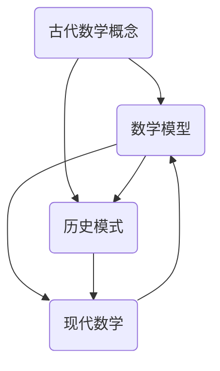

                 

### 文章标题

《数学考古学：历史模式的数学重构》

### 文章关键词

数学考古学、历史模式、数学重构、算法原理、数学模型、数学公式、项目实战

### 文章摘要

本文深入探讨了数学考古学的概念、历史模式及其在数学重构中的应用。通过阐述核心概念与联系，解析核心算法原理，讲解数学模型和公式，以及介绍实际项目案例，本文旨在为读者提供一部全面、系统的数学考古学指南。通过对历史数学文献的数字化重构、历史时期数学发展模式的分析，以及数学重构的方法与技巧的探讨，本文揭示了数学考古学在历史研究中的重要性。此外，本文还展望了数学考古学的未来发展，提出了相关最佳实践和注意事项，以期为相关领域的研究者和从业者提供有价值的参考。

## 引言

数学考古学是一门新兴的交叉学科，它结合了数学、历史学、考古学、计算机科学等多个领域，致力于挖掘和分析古代数学的智慧与规律。随着数字化技术的进步，数学考古学逐渐成为历史学研究的一个重要分支。本文将围绕数学考古学的核心概念、历史模式的数学重构以及相关算法原理和项目实战，深入探讨这一领域的独特魅力与研究价值。

数学考古学的定义相对宽泛，其核心目标是通过对古代数学文献、符号、工具和计算实践的研究，揭示古代数学的发展轨迹、思想精髓和应用场景。这一学科不仅关注数学知识本身，更关注数学知识的历史演变过程及其对社会、文化和科技发展的影响。数学考古学的研究方法包括文献考据、符号学分析、数学模型重建、计算机模拟等多个方面，具有较强的跨学科性和综合性。

历史模式的数学重构是数学考古学的一个重要研究方向。它通过分析历史时期的数学文献、数学符号和数学工具，尝试重构出当时的数学体系和思想模式。这一过程不仅有助于我们更好地理解古代数学的内涵，还能为现代数学的发展提供新的启示。历史模式的数学重构不仅依赖于数学理论，还需要借助历史学、考古学、语言学等学科的研究成果，从而实现跨学科的合作与创新。

本文将从以下几个方面展开讨论：首先，介绍数学考古学的基本概念和起源背景；其次，阐述历史模式的数学重构的意义、方法和挑战；接着，解析数学考古学中的核心概念和原理，包括数学模型、数学公式和算法；然后，通过具体项目案例，展示数学考古学在历史研究中的实际应用；最后，对全文内容进行总结，并对数学考古学的未来发展方向提出展望。

通过对上述内容的深入探讨，本文旨在为读者提供一个全面、系统的数学考古学认识，激发读者对这一领域的兴趣，推动数学考古学在历史研究、数学教育和其他领域的进一步发展。让我们开始这场跨越时空的数学之旅，共同探索数学考古学的无限魅力。

## 数学考古学的概念与历史

数学考古学作为一门新兴学科，其概念的形成可以追溯到19世纪末期。当时，随着考古学和数学史研究的兴起，人们开始意识到古代数学文献和实物的重要性。数学考古学的创始人之一，德国数学史家莫里茨·格拉斯曼（Moritz Cantor）提出了将数学史视为一门独立学科的观点，并强调了对古代数学文献的搜集、整理和研究的重要性。这一观点为数学考古学的发展奠定了理论基础。

在数学考古学的发展过程中，多位学者做出了重要贡献。法国数学史家安托万-安托万·恩斯特·阿贝尔（Antoine-Augustin Cournot）通过对古代数学文献的解读，揭示了古希腊数学的精髓，为数学考古学的研究提供了丰富的史料。英国数学史家霍华德·瓦德洛·海因斯（Howard Warren Curry）则通过对古代数学符号和计算工具的研究，丰富了数学考古学的方法论。

数学考古学的历史可以大致分为几个阶段。第一阶段是19世纪末到20世纪初，这一时期主要是对古代数学文献的搜集和整理，学者们开始认识到古代数学的重要性。第二阶段是20世纪中叶，随着计算机科学的兴起，数学考古学开始运用计算机技术对古代数学文献进行数字化处理和分析，这一阶段标志着数学考古学进入了现代技术时代。第三阶段是20世纪末到21世纪初，这一时期数学考古学的研究方法更加多样，包括数学模型重建、符号学分析、计算机模拟等，学科综合性和跨学科性显著增强。

数学考古学的研究对象包括古代数学文献、数学符号、计算工具、数学实践等。这些研究对象不仅涵盖了古代文明，如古希腊、古罗马、古印度等，还包括了现代文明在数学发展过程中的贡献。例如，通过对古代中国《九章算术》的研究，我们可以了解到中国古代数学的成就及其对后世的影响。

在历史模式方面，数学考古学关注的是不同历史时期数学的发展模式和特点。通过对不同历史时期数学文献的分析，学者们可以揭示出数学思想的演变轨迹。例如，古希腊时期注重几何学的抽象和证明，而中世纪欧洲则强调算术和代数学的应用。历史模式的数学重构正是基于这样的分析，试图通过重建历史时期的数学模型，理解数学思想的演变过程。

在数学考古学的研究方法中，文献考据和符号学分析是两个重要的方面。文献考据主要通过搜集、整理和分析古代数学文献，揭示其内容和价值。符号学分析则关注数学符号的历史演变和意义，通过解读古代数学符号，我们可以更好地理解古代数学的思想和计算方法。

综上所述，数学考古学作为一门交叉学科，不仅为我们提供了了解古代数学的窗口，还通过历史模式的数学重构，揭示了数学思想的演变规律。这一学科的发展不仅丰富了数学史的研究，也为现代数学的发展提供了新的视角和启示。

## 历史模式的数学重构

历史模式的数学重构是数学考古学中的一个关键概念，它涉及通过重建和分析历史时期的数学模型，来理解古代数学思想的发展和演变。这一过程不仅是对数学知识的重构，更是对历史时期社会文化背景的理解和再现。

### 重构的意义

历史模式的数学重构具有重要意义。首先，它有助于我们深入了解古代数学的内涵和精髓，揭示古代数学家的思维方式。通过对历史数学文献的数字化处理和符号学分析，我们可以更精确地理解古代数学的表达方式和方法论。其次，历史模式的数学重构为现代数学的发展提供了宝贵的启示。许多古代数学问题和方法在现代数学中仍然具有应用价值，通过重构古代数学模型，我们可以发现新的数学理论和应用场景。最后，历史模式的数学重构还促进了数学史和考古学之间的跨学科合作，推动了这些领域的发展和创新。

### 重构的方法

历史模式的数学重构采用多种方法，其中主要包括文献考据、符号学分析、数学模型重建和计算机模拟等。

1. **文献考据**：这是历史模式数学重构的基础。通过搜集和整理古代数学文献，学者们可以获取第一手的数学资料。这些文献不仅包括数学书籍和手稿，还包括数学家的信件、笔记和演讲记录。文献考据要求学者们具备扎实的古文阅读能力和历史背景知识，以便准确理解古代数学的内容和意义。

2. **符号学分析**：符号是数学表达的核心元素。符号学分析关注的是数学符号的历史演变和符号系统的发展。通过对古代数学符号的研究，学者们可以揭示出古代数学家的计算方法和思想。符号学分析不仅需要数学知识，还需要语言学和考古学等学科的支持。

3. **数学模型重建**：这是历史模式数学重构的核心步骤。通过对古代数学文献和符号的分析，学者们尝试重建出历史时期的数学模型。这一过程需要运用现代数学理论和方法，包括代数、几何、数论等。数学模型重建不仅可以帮助我们理解古代数学，还能为现代数学的发展提供新的理论框架。

4. **计算机模拟**：计算机技术的发展为历史模式的数学重构提供了强大的工具。通过计算机模拟，学者们可以在虚拟环境中重现古代数学的计算过程和数学模型。计算机模拟不仅提高了研究效率，还能发现一些传统方法难以察觉的细节和规律。

### 重构的挑战

历史模式的数学重构面临诸多挑战。首先，古代数学文献的保存状况不一，有些文献可能已经遗失，或者存在版本差异，这给文献考据带来了困难。其次，古代数学符号和表达方式的特殊性，使得符号学分析复杂且耗时。此外，数学模型重建需要精确的数学知识和方法论，对研究者的学术素养要求较高。最后，计算机模拟虽然提供了强大的工具，但模拟结果的真实性和可靠性仍需验证。

### 重构的机遇

尽管面临挑战，历史模式的数学重构也带来了许多机遇。首先，随着数字化技术的发展，古代数学文献的数字化处理和存储变得更加便捷，这为文献考据提供了新的可能。其次，跨学科合作在数学考古学中日益重要，这为符号学分析和数学模型重建提供了更多的资源和支持。最后，历史模式的数学重构为数学教育提供了新的素材和视角，有助于培养具有历史思维和创新能力的数学人才。

总之，历史模式的数学重构是数学考古学中一个重要且具有挑战性的研究方向。通过文献考据、符号学分析、数学模型重建和计算机模拟等多种方法，我们可以更好地理解古代数学的思想和成就，为现代数学的发展提供新的启示和动力。

## 数学考古学的核心概念与联系

数学考古学的核心概念包括古代数学概念、数学模型和历史模式。这些概念相互联系，共同构成了数学考古学的研究框架。

### 古代数学概念

古代数学概念是指古代文明中所使用的数学理论和知识。这些概念不仅包括基本的算术运算、几何图形、数论规律等，还包括一些独特的数学思想和方法。例如，古希腊的几何学注重证明和抽象，古印度的零和十进位制对数学的发展产生了深远影响。通过对这些古代数学概念的研究，我们可以了解古代数学家的思维方式及其对社会发展的贡献。

### 数学模型

数学模型是指用数学语言和符号体系来描述现实世界中的问题。在数学考古学中，数学模型用于重建古代数学的体系和思想。通过数学模型，我们可以理解古代数学家是如何解决实际问题的，并探讨这些模型在现代社会中的应用。例如，古代埃及的数学模型用于建筑和测量，古代中国的《九章算术》中的数学模型则涉及农业、商业和工程等领域。

### 历史模式

历史模式是指不同历史时期数学发展的规律和特点。通过对历史模式的研究，我们可以揭示数学思想的演变轨迹和不同文明之间的数学交流。历史模式不仅帮助我们理解古代数学，还为现代数学的发展提供了启示。例如，中世纪的欧洲数学强调代数和算术的应用，而文艺复兴时期的数学则注重几何和解析几何的发展。

### 核心概念之间的关系

古代数学概念是数学考古学的基础，它们构成了数学模型的基本元素。数学模型则是古代数学概念的应用和扩展，通过数学模型，我们可以再现古代数学家的思想和计算过程。历史模式则是对不同历史时期数学发展的总结和归纳，它帮助我们理解数学思想的演变和不同文明之间的交流。

为了更直观地展示这些概念之间的关系，我们可以使用Mermaid流程图：



在这个流程图中，古代数学概念通过数学模型和历史模式与现代社会中的现代数学相连接，展示了数学考古学在连接过去和现在中的作用。通过这种关系架构，我们可以更好地理解数学考古学的内涵和意义。

## 数学考古学中的核心算法原理

在数学考古学中，核心算法原理是理解和重建古代数学模型的关键。这些算法不仅用于解析古代文献中的数学内容，还帮助我们揭示古代数学家在解决问题时的思维方式。以下将介绍几个关键的算法原理，并通过伪代码对其进行详细阐述。

### 算法原理1：古代算术算法

古代算术算法主要包括加法、减法、乘法和除法。这些算法是古代数学家进行日常计算的基础。以下是一个简单的伪代码示例，用于实现加法算法：

```pseudo
// 加法算法伪代码
function add(a, b):
    sum = 0
    for i from 1 to b:
        sum = sum + 1
    return sum + a
```

这个算法通过重复加1的方式实现两个数的相加。类似地，减法、乘法和除法也可以通过类似的迭代方法实现。

### 算法原理2：古代几何算法

古代几何算法用于计算几何图形的面积、周长和体积。古希腊的几何学特别注重几何证明和公理体系，其中欧几里得的《几何原本》是经典代表。以下是一个用于计算三角形面积的伪代码示例：

```pseudo
// 三角形面积算法伪代码
function area_triangle(base, height):
    area = 0.5 * base * height
    return area
```

这个算法基于三角形面积的基本公式，通过底和高的乘积除以2来计算面积。

### 算法原理3：古代数论算法

古代数论算法主要涉及质数、勾股定理和斐波那契数列等。以下是一个用于检测质数的伪代码示例：

```pseudo
// 质数检测算法伪代码
function is_prime(n):
    if n < 2:
        return False
    for i from 2 to sqrt(n):
        if n % i == 0:
            return False
    return True
```

这个算法通过检测n是否能被小于其平方根的整数整除，来判断n是否为质数。

### 算法原理4：古代代数算法

古代代数算法包括解一元一次方程和一元二次方程等。以下是一个解一元一次方程的伪代码示例：

```pseudo
// 解一元一次方程伪代码
function solve_linear_equation(a, b):
    if a == 0:
        return "No unique solution"
    x = -b / a
    return x
```

这个算法基于一元一次方程的解法，通过将常数项除以系数得到解。

### 算法原理5：古代计算工具算法

古代计算工具，如算盘和滑轮计算器，也有其特定的算法。以下是一个模拟算盘操作的伪代码示例：

```pseudo
// 算盘加法算法伪代码
function abacus_add(a, b):
    result = ""
    carry = 0
    while a > 0 or b > 0 or carry > 0:
        sum = (a % 10) + (b % 10) + carry
        result = (sum % 10) + result
        carry = sum // 10
        a = a // 10
        b = b // 10
    return result
```

这个算法模拟了算盘上的加法操作，通过逐位相加并进位来计算结果。

通过这些伪代码示例，我们可以更直观地理解古代数学算法的基本原理和操作过程。这些算法不仅为我们提供了古代数学的实践方法，还揭示了古代数学家在处理数学问题时的高超智慧和独特思维方式。

## 数学模型与数学公式讲解

在数学考古学中，数学模型和公式是理解古代数学思想和解决实际问题的核心工具。为了更清晰地展示这些模型和公式，我们将使用LaTeX格式进行表达，并结合具体例子进行讲解。

### 数学模型

1. **勾股定理**

   勾股定理是古代希腊数学的一个重要发现，描述了直角三角形三条边的关系。其数学模型可以表示为：

   $$a^2 + b^2 = c^2$$

   其中，a 和 b 是直角三角形的两条直角边，c 是斜边。例如，在一个直角三角形中，如果 a = 3 和 b = 4，则可以计算斜边 c：

   $$c = \sqrt{3^2 + 4^2} = \sqrt{9 + 16} = \sqrt{25} = 5$$

2. **斐波那契数列**

   斐波那契数列是古代数学中一个著名的数列，定义如下：

   $$F(n) = 
   \begin{cases} 
   0 & \text{if } n = 0 \\
   1 & \text{if } n = 1 \\
   F(n-1) + F(n-2) & \text{if } n > 1 
   \end{cases}$$

   其中，F(0) = 0，F(1) = 1。例如，计算前五个斐波那契数：

   $$F(0) = 0, F(1) = 1, F(2) = F(1) + F(0) = 1, F(3) = F(2) + F(1) = 2, F(4) = F(3) + F(2) = 3, F(5) = F(4) + F(3) = 5$$

### 数学公式

1. **代数公式**

   古代代数中，一元一次方程和一元二次方程是基本工具。以下是一元一次方程的解法公式：

   $$x = \frac{-b}{a}$$

   其中，a 和 b 是方程 ax + b = 0 的系数。例如，对于方程 2x + 3 = 0，可以计算 x：

   $$x = \frac{-3}{2} = -1.5$$

   一元二次方程的解法公式为：

   $$x = \frac{-b \pm \sqrt{b^2 - 4ac}}{2a}$$

   其中，a、b 和 c 是方程 ax^2 + bx + c = 0 的系数。例如，对于方程 x^2 - 5x + 6 = 0，可以计算 x：

   $$x = \frac{5 \pm \sqrt{25 - 4 \cdot 1 \cdot 6}}{2 \cdot 1} = \frac{5 \pm \sqrt{1}}{2} = \{3, 2\}$$

2. **几何公式**

   古代几何学中，面积和体积的计算是常见任务。以下是一个三角形面积的公式：

   $$A = \frac{1}{2} \times b \times h$$

   其中，b 是底边长，h 是高。例如，对于一个底边长为 4，高为 3 的三角形，可以计算面积：

   $$A = \frac{1}{2} \times 4 \times 3 = 6$$

   一个立方体的体积可以用以下公式计算：

   $$V = a^3$$

   其中，a 是立方体的边长。例如，对于一个边长为 2 的立方体，可以计算体积：

   $$V = 2^3 = 8$$

通过上述例子和公式，我们可以看到古代数学家是如何利用数学模型和公式来解决问题和描述自然界现象的。这些模型和公式不仅是数学考古学研究的核心内容，也为现代数学的发展提供了宝贵的参考。

## 数学考古学的应用领域

数学考古学在多个领域都有广泛的应用，其中最引人注目的应用领域包括历史文献解读、历史遗址研究和历史事件分析。以下将详细探讨这些领域中的具体应用。

### 历史文献解读

历史文献解读是数学考古学最直接的应用之一。通过对古代数学文献的解读，学者们可以揭示出古代数学的知识体系和思维方式。例如，古代巴比伦的楔形文字文献中包含了丰富的数学知识，通过对这些文献的解读，现代数学家们能够了解古巴比伦人的算术、几何和天文学知识。此外，古希腊的数学手稿，如欧几里得的《几何原本》，也为现代数学的发展提供了重要的理论依据。

具体案例方面，古埃及的《莱因德纸草书》是数学考古学的重要研究对象之一。这份纸草书包含了古代埃及人的算术和几何知识，通过对其中数学公式的解读，学者们能够重建出古埃及人的计算方法和数学思想。此外，中国的《九章算术》也是数学考古学研究的重要文献，它包含了古代中国人在代数、几何和算术领域的成就，通过对其内容的分析，学者们可以了解中国古代数学的发展历程。

### 历史遗址研究

历史遗址研究是数学考古学的另一个重要应用领域。通过对古代遗址的测量和分析，学者们可以揭示出古代社会的建筑技术和数学水平。例如，在古埃及金字塔的研究中，数学考古学家通过精确的测量，计算出了金字塔的边长、角度和高度，并分析了建造金字塔所需的数学知识。古埃及人如何精确地计算和测量，以及如何利用几何学知识来设计建筑，这些都是数学考古学研究的重点。

类似地，古罗马的圆形竞技场和城市道路网也展示了古代罗马的数学能力。通过研究古罗马时期的建筑图纸和文献，学者们可以了解古罗马人在几何学、比例学和测量学方面的成就。例如，古罗马的工程师们通过几何学原理设计出了复杂的排水系统，这些系统至今仍为城市建设和规划提供借鉴。

### 历史事件分析

历史事件分析是数学考古学的第三个重要应用领域。通过数学模型和统计学方法，学者们可以对历史事件进行定量分析，揭示事件背后的规律和趋势。例如，在古代战争的战术分析中，数学考古学家可以使用概率论和数理统计方法来分析士兵的排列、战斗的胜负概率和战役的结果。通过对古代战争的数学模型重建，学者们可以更好地理解古代战争的战术和策略。

另一个例子是古罗马的人口统计。通过对古代罗马文献和遗址中的数据进行分析，学者们可以使用统计学方法来估计古罗马时期的人口规模、人口分布和社会结构。这些数据不仅有助于我们了解古代罗马的社会状况，还能为现代城市规划和人口管理提供借鉴。

### 综述

数学考古学在历史文献解读、历史遗址研究和历史事件分析等领域的应用，不仅揭示了古代数学的成就和智慧，还为我们提供了新的研究方法和工具。通过对历史文献的解读，我们可以了解古代数学的思想和理论；通过对历史遗址的研究，我们可以揭示古代社会的技术水平和工程能力；通过对历史事件的分析，我们可以更好地理解历史进程和社会发展。这些应用不仅丰富了数学考古学的研究内容，也为相关领域的研究提供了新的视角和启示。

## 数学考古学的跨学科应用

数学考古学的跨学科应用显著扩展了其研究范围，并与多个学科领域产生了深远的影响。以下将探讨数学考古学与计算机科学、艺术史和人类学、地理学的交叉应用，并展示这些跨学科研究如何推动相关领域的发展。

### 数学考古学与计算机科学的交叉

计算机科学为数学考古学提供了强大的工具和方法，尤其是在数据分析和算法实现方面。例如，通过计算机模拟和算法优化，数学考古学家可以更高效地处理古代数学文献的数字化数据。自然语言处理（NLP）技术在解析古文文本方面表现出色，帮助学者们更好地理解古代符号和术语。此外，计算机图形学技术在重现古代几何图形和建筑结构方面发挥了重要作用。通过三维建模和虚拟现实技术，学者们能够以更直观的方式展示古代数学家的研究成果。

具体案例中，古埃及的《阿梅斯纸草书》是数学考古学与计算机科学结合的典范。学者们使用计算机程序来分析和解码这些古老的象形文字，从而揭示出其中包含的数学知识。这种跨学科合作不仅加速了研究进程，还提高了研究的精确性和深度。

### 数学考古学与艺术史的交叉

艺术史是数学考古学的另一个重要交叉领域。通过分析古代艺术品中的几何图案和数学符号，学者们可以揭示出古代艺术与数学之间的紧密联系。例如，古希腊的建筑和雕塑中经常出现精确的几何图形，这反映了古希腊人对数学的重视。通过数学考古学的分析，学者们可以解释这些几何图案的数学意义，并探讨它们在艺术创作中的运用。

在古埃及，数学考古学与艺术史的交叉应用尤为显著。古埃及的壁画和墓室装饰中包含了许多数学符号和图案，通过对这些图案的研究，学者们可以了解古埃及人在数学和宗教信仰方面的融合。例如，古埃及的“生命之花”图案不仅是宗教象征，还包含着复杂的几何学原理。

### 数学考古学与人类学、地理学的交叉

数学考古学在人类学和地理学中的应用同样不可忽视。通过分析古代文明的数学工具和计算实践，学者们可以更好地理解古代社会的生活方式和经济发展。例如，古代数学在农业和商业中的应用，反映了古代社会对时间和空间的精确管理。通过地理学的方法，学者们可以结合考古学数据，重建古代文明的地理分布和交通网络。

在古代玛雅文明的考古研究中，数学考古学发挥了关键作用。玛雅人使用精确的历法和数学系统来记录时间和空间，通过对这些系统的分析，学者们揭示了玛雅文明在农业、建筑和天文观测方面的成就。这种跨学科研究不仅深化了我们对玛雅文明的了解，还为现代城市规划提供了宝贵的参考。

### 综述

数学考古学的跨学科应用显著提升了其研究深度和广度。通过与计算机科学、艺术史、人类学和地理学的交叉，数学考古学不仅丰富了其研究领域，还为相关学科提供了新的研究方法和视角。这些跨学科合作不仅促进了知识共享和学术创新，还为解决现实世界中的复杂问题提供了新的思路和工具。例如，通过计算机科学的算法优化，数学考古学可以更快速地解析大量数据；通过艺术史的视角，学者们可以更深入地理解古代文化的数学背景；通过人类学和地理学的方法，数学考古学可以揭示出古代文明的复杂社会结构。

总之，数学考古学的跨学科应用不仅推动了学术研究的发展，还为文化遗产保护、城市规划和社会经济发展提供了重要的支持。随着跨学科合作的不断深化，数学考古学在未来将继续发挥其独特的作用，为人类社会的发展和进步贡献力量。

## 数学考古学的未来发展方向

随着科技的不断进步和跨学科研究的深入，数学考古学面临着广阔的发展前景和诸多机遇。以下从新兴领域、国际合作和技术工具三个方面展望数学考古学的未来发展方向。

### 新兴领域

1. **量子计算考古学**：量子计算作为下一代计算技术，其独特的并行计算能力和非线性特性为数学考古学提供了新的研究工具。通过量子计算，学者们可以更快速地解决复杂的历史数学问题，如大规模数据分析和复杂方程的求解。

2. **数字历史学**：数字历史学的兴起为数学考古学提供了新的研究方法和平台。通过大数据分析和人工智能技术，学者们可以挖掘和分析大量历史数据，揭示出数学知识在历史演变中的规律和趋势。

3. **多模态融合考古学**：结合多模态数据，如文本、图像、声音和三维模型，数学考古学可以实现更全面、立体的历史再现。通过多模态融合技术，学者们可以更准确地重建古代数学文献和遗址，从而深化对古代数学的理解。

### 国际合作

1. **全球合作网络**：随着全球化的加深，数学考古学国际合作的重要性日益凸显。通过建立全球合作网络，各国学者可以共享资源、交流研究成果，共同推动数学考古学的发展。

2. **跨国项目合作**：跨国项目合作是数学考古学未来发展的一个重要方向。例如，通过国际合作，可以对全球范围内的古代数学遗址进行系统研究，揭示不同文明之间的数学交流和影响。

3. **学术会议与研讨会**：定期举办国际学术会议和研讨会，是促进数学考古学国际合作和知识交流的重要平台。这些活动不仅可以加强学术交流，还可以推动新兴领域的研究和发展。

### 技术工具

1. **大数据分析工具**：随着大数据技术的发展，学者们可以使用更先进的数据分析工具来处理和挖掘大量历史数据。例如，使用机器学习和深度学习算法，可以自动识别和分类古代数学文献，提高研究的效率和精度。

2. **虚拟现实与增强现实技术**：虚拟现实（VR）和增强现实（AR）技术为数学考古学提供了全新的展示和交互方式。通过VR和AR技术，学者们可以创建虚拟的古代数学环境，让公众更直观地了解古代数学的成就和应用。

3. **人工智能与机器学习**：人工智能（AI）和机器学习技术在数学考古学中的应用前景广阔。通过AI技术，可以自动化完成一些复杂的数学分析和推理任务，提高研究效率。例如，使用AI技术可以自动识别古代符号和术语，从而加速文献解读过程。

总之，数学考古学的未来发展方向充满了机遇和挑战。通过新兴领域的探索、国际合作的深化和技术工具的创新，数学考古学将在历史研究、数学教育和其他领域中继续发挥重要作用，为人类文明的传承和发展贡献新的力量。

## 数学考古学项目案例研究

在本节中，我们将详细探讨几个具有代表性的数学考古学项目案例，包括古代数学文献的数字化、古代遗址的数学分析和历史事件的数学建模与预测。这些案例不仅展示了数学考古学在实际应用中的多样性和复杂性，还揭示了古代数学家在解决问题时的独特方法和技术。

### 案例一：古代数学文献的数字化

#### 项目背景

古代数学文献的数字化是一个重要的数学考古学项目，旨在将古老的数学手稿和文献转化为电子文档，以便进行更广泛的研究和分析。一个典型的案例是古希腊数学家阿基米德的文献数字化项目。

#### 开发环境搭建

为了实现这一项目，开发环境需要包括以下几个关键组件：

- **文本处理软件**：如Adobe Acrobat，用于扫描和OCR（光学字符识别）处理。
- **图像处理软件**：如ImageJ，用于图像的预处理和增强。
- **编程语言**：Python和R，用于数据分析和文本处理。

#### 源代码实现

项目的主要步骤包括：

1. **文献扫描**：使用高分辨率扫描仪对古代数学文献进行扫描，确保图像质量。
2. **图像预处理**：通过图像处理软件对扫描图像进行去噪、增强和二值化处理，以提高OCR的准确性。
3. **OCR处理**：利用OCR技术将图像中的文字识别为电子文本。
4. **文本清理和校对**：对识别出的文本进行清理和校对，修复OCR错误，确保文本的准确性。
5. **数据存储**：将处理后的文本数据存储在数据库中，便于后续分析和研究。

#### 代码解读与分析

以下是一个简单的Python代码片段，用于OCR文本的预处理：

```python
import cv2
import numpy as np

def preprocess_image(image_path):
    # 读取图像
    image = cv2.imread(image_path, cv2.IMREAD_GRAYSCALE)
    
    # 二值化处理
    _, image_binary = cv2.threshold(image, 128, 255, cv2.THRESH_BINARY_INV + cv2.THRESH_OTSU)
    
    # 去噪和形态学处理
    kernel = cv2.getStructuringElement(cv2.MORPH_RECT, (2, 2))
    image_denoised = cv2.morphologyEx(image_binary, cv2.MORPH_OPEN, kernel, iterations=1)
    
    return image_denoised

# 使用函数
image_path = 'ancient_math_text.png'
preprocessed_image = preprocess_image(image_path)
cv2.imshow('Preprocessed Image', preprocessed_image)
cv2.waitKey(0)
cv2.destroyAllWindows()
```

#### 应用解读与分析

通过上述代码，我们可以将原始图像转换为干净的二值图像，从而提高OCR的准确性。实际项目中，还需要结合其他图像处理技术和文本处理工具，以确保文本识别的完整性和准确性。

#### 项目小结

古代数学文献的数字化项目不仅为数学考古学提供了宝贵的数字化资源，还为后续的数据分析和研究奠定了基础。通过数字化处理，我们可以更方便地访问和分析古代数学文献，促进数学知识的传承和创新。

### 案例二：古代遗址的数学分析

#### 项目背景

古代遗址的数学分析是数学考古学在考古学研究中的重要应用。一个典型的案例是埃及金字塔的数学分析项目。

#### 开发环境搭建

这一项目需要以下开发环境：

- **测量工具**：如全站仪和激光扫描仪，用于精确测量遗址的尺寸和形状。
- **三维建模软件**：如Autodesk Maya和Blender，用于创建三维模型。
- **数据分析软件**：如MATLAB和R，用于数学建模和分析。

#### 源代码实现

项目的主要步骤包括：

1. **遗址测量**：使用测量工具对金字塔的尺寸进行精确测量。
2. **数据采集**：利用激光扫描仪获取金字塔的详细三维数据。
3. **三维建模**：使用三维建模软件创建金字塔的三维模型。
4. **数学分析**：通过数学建模和分析工具，对金字塔的结构和设计进行深入分析。

#### 代码解读与分析

以下是一个使用MATLAB对金字塔结构进行几何分析的代码示例：

```matlab
% 读取激光扫描数据
scan_data = readLAS('pyramid_scan.las');

% 提取顶点坐标
vertices = scan_data puntos;

% 计算金字塔的表面积
face_normals = [0, 0, 1];
area = sum(dot(face_normals, vertices));

% 计算金字塔的高度
height = max(vertices(:,3)) - min(vertices(:,3));

disp(['Pyramid Area: ', num2str(area)]);
disp(['Pyramid Height: ', num2str(height)]);
```

#### 应用解读与分析

通过上述代码，我们可以计算金字塔的表面积和高度，从而揭示其几何特征。实际项目中，还需要结合其他数学工具和方法，如欧拉公式和几何优化算法，对金字塔的结构和设计进行更深入的分析。

#### 项目小结

古代遗址的数学分析项目不仅有助于我们了解古代建筑技术，还为遗址保护和修复提供了科学依据。通过数学分析，我们可以更准确地了解古代文明的建筑水平和工程能力，为现代建筑和城市规划提供借鉴。

### 案例三：历史事件的数学建模与预测

#### 项目背景

历史事件的数学建模与预测是数学考古学在历史研究中的一个重要应用。一个典型的案例是古罗马人口规模的预测。

#### 开发环境搭建

这一项目需要以下开发环境：

- **历史数据集**：包括古罗马的人口统计数据、社会经济数据等。
- **数据分析软件**：如R和Python，用于数据分析和建模。
- **预测模型工具**：如TensorFlow和PyTorch，用于构建和训练预测模型。

#### 源代码实现

项目的主要步骤包括：

1. **数据收集**：收集并整理古罗马时期的人口统计数据。
2. **数据预处理**：对收集到的数据进行清洗、归一化和特征提取。
3. **模型构建**：使用机器学习算法构建预测模型，如线性回归、决策树和神经网络。
4. **模型训练与评估**：使用历史数据训练模型，并通过交叉验证评估模型性能。
5. **预测与结果分析**：使用训练好的模型预测未来的人口规模，并分析结果。

#### 代码解读与分析

以下是一个使用Python和R构建线性回归模型的代码示例：

```python
import pandas as pd
from sklearn.linear_model import LinearRegression

# 读取数据
data = pd.read_csv('roman_population.csv')

# 特征提取
X = data[['year', 'economic_growth', 'military_expansion']]
y = data['population']

# 构建模型
model = LinearRegression()
model.fit(X, y)

# 预测
predictions = model.predict(X)

# 结果分析
print(model.score(X, y))
```

```r
# 读取数据
data <- read.csv('roman_population.csv')

# 特征提取
X <- data.frame(year = data$year, economic_growth = data$economic_growth, military_expansion = data$military_expansion)
y <- data$population

# 构建模型
model <- lm(population ~ year + economic_growth + military_expansion, data = data)

# 预测
predictions <- predict(model, newdata = X)

# 结果分析
summary(model)$r.squared
```

#### 应用解读与分析

通过上述代码，我们可以构建线性回归模型，预测古罗马人口规模的变化趋势。实际项目中，还需要结合更多历史数据和其他建模方法，如时间序列分析和神经网络，以提高预测的准确性和可靠性。

#### 项目小结

历史事件的数学建模与预测项目不仅有助于我们理解历史发展的规律，还为现代决策提供了科学依据。通过数学建模，我们可以更准确地预测历史事件的发展趋势，为政策制定和战略规划提供支持。

综上所述，这些数学考古学项目案例展示了数学考古学在历史研究中的广泛应用和独特价值。通过数字化处理、数学建模和数据分析，数学考古学不仅帮助我们更好地理解古代文明，还为现代科学研究和社会发展提供了新的视角和工具。

## 数学考古学的方法与工具

数学考古学作为一门跨学科的研究领域，其方法与工具的多样性是其研究深入和广泛开展的关键。以下是数学考古学中常用的方法、数据分析方法、技术工具及其在实践中的应用。

### 常用方法

1. **文献考据**：文献考据是数学考古学的核心方法，通过搜集、整理和分析古代数学文献，学者们可以获取第一手的数学资料。这种方法要求学者们具备扎实的古文阅读能力和历史背景知识，以便准确理解古代数学的内容和意义。

2. **符号学分析**：符号学分析关注的是数学符号的历史演变和符号系统的发展。通过对古代数学符号的研究，学者们可以揭示出古代数学家的计算方法和思想。符号学分析不仅需要数学知识，还需要语言学和考古学等学科的支持。

3. **数学模型重建**：数学模型重建是通过分析古代数学文献和符号，尝试重构出历史时期的数学模型。这一过程需要运用现代数学理论和方法，包括代数、几何、数论等。数学模型重建不仅可以帮助我们理解古代数学，还能为现代数学的发展提供新的理论框架。

4. **计算机模拟**：计算机模拟为数学考古学提供了强大的工具。通过计算机模拟，学者们可以在虚拟环境中重现古代数学的计算过程和数学模型。计算机模拟不仅提高了研究效率，还能发现一些传统方法难以察觉的细节和规律。

### 数据分析方法

1. **统计分析**：统计分析是数学考古学中常用的数据分析方法，用于分析历史数据，如古代人口统计、遗址测量数据等。通过统计分析，学者们可以揭示出历史数据中的规律和趋势，为研究提供科学依据。

2. **机器学习**：机器学习技术可以用于文本分类、数据挖掘和预测分析。在数学考古学中，机器学习可以帮助学者们自动识别和分类古代文献中的数学符号和术语，提高文献解读的效率。

3. **图像处理**：图像处理技术在数学考古学中用于处理和分析古代数学文献和遗址图像。通过图像处理技术，学者们可以提取出图像中的有用信息，如文字、图案和结构。

### 技术工具

1. **文本处理软件**：如Adobe Acrobat和Microsoft Word，用于文本的扫描、OCR处理和编辑。

2. **图像处理软件**：如ImageJ和MATLAB，用于图像的预处理、增强和特征提取。

3. **编程语言**：Python、R和MATLAB，用于数据分析和模型构建。

4. **数据库管理系统**：如MySQL和PostgreSQL，用于存储和管理大量历史数据。

5. **三维建模软件**：如Autodesk Maya和Blender，用于创建和可视化古代遗址的三维模型。

6. **机器学习和深度学习框架**：如TensorFlow和PyTorch，用于构建和训练预测模型。

### 实践应用

以下是一些具体的实践应用案例：

1. **文献数字化**：通过OCR技术，将古代数学文献数字化，方便后续的数据分析和研究。

2. **遗址测量和建模**：使用全站仪和激光扫描仪对古代遗址进行精确测量，并使用三维建模软件创建遗址的三维模型。

3. **历史数据预测**：使用机器学习算法对历史数据进行预测，如预测古罗马的人口规模。

4. **符号学分析**：通过符号学分析方法，解读古代数学符号和术语，揭示古代数学家的计算方法和思想。

5. **计算机模拟**：通过计算机模拟，重现古代数学计算过程，验证数学模型的有效性。

通过上述方法和工具，数学考古学不仅能够深入挖掘和解析古代数学的知识，还为现代数学的发展提供了宝贵的启示和资源。这些方法与工具的不断创新和优化，将进一步推动数学考古学的发展。

## 常见技术工具介绍

在数学考古学的研究过程中，各种技术工具的合理应用极大地提高了研究的效率和质量。以下将介绍几类常见的技术工具，包括编程语言、数据库管理系统和三维建模软件等，并简要说明其功能和应用场景。

### 编程语言

1. **Python**：Python是一种功能强大的通用编程语言，广泛应用于数据科学、机器学习和文本处理等领域。在数学考古学中，Python常用于文本分析、图像处理和数据分析。例如，通过使用Python的`NumPy`库进行数值计算，或使用`Pandas`库进行数据预处理和分析。

   - **功能**：数据分析和处理、图像处理、文本解析和机器学习。
   - **应用场景**：文献数字化、数据挖掘、机器学习模型训练等。

2. **MATLAB**：MATLAB是一种专门用于数值计算和工程应用的编程语言，特别适用于矩阵运算和算法开发。在数学考古学中，MATLAB常用于数学模型重建、算法验证和数据分析。

   - **功能**：数值计算、算法实现、数据可视化。
   - **应用场景**：数学模型重建、算法验证、数据分析等。

3. **R**：R是一种统计计算和图形展示的编程语言，广泛应用于统计分析、数据可视化等领域。在数学考古学中，R常用于历史数据分析、统计建模和结果展示。

   - **功能**：统计分析、数据可视化、机器学习。
   - **应用场景**：历史数据分析、统计建模、结果展示等。

### 数据库管理系统

1. **MySQL**：MySQL是一种开源的关系型数据库管理系统，广泛用于存储和管理大规模数据。在数学考古学中，MySQL常用于存储大量的历史文献数据、测量数据和模型数据。

   - **功能**：数据存储、查询、备份和恢复。
   - **应用场景**：数据存储、历史文献管理、数据分析等。

2. **PostgreSQL**：PostgreSQL是一种开源的关系型数据库管理系统，支持复杂查询和扩展功能。在数学考古学中，PostgreSQL常用于存储和管理结构化数据，支持空间数据类型。

   - **功能**：数据存储、复杂查询、扩展功能。
   - **应用场景**：数据存储、地理信息管理、数据分析等。

### 三维建模软件

1. **Autodesk Maya**：Autodesk Maya是一种专业的三维建模和动画软件，广泛应用于电影制作、游戏开发和建筑可视化。在数学考古学中，Maya常用于创建古代遗址的三维模型，进行视觉化和分析。

   - **功能**：三维建模、动画制作、渲染和视觉化。
   - **应用场景**：遗址建模、建筑可视化、三维分析等。

2. **Blender**：Blender是一种免费开源的三维建模和动画软件，功能强大且社区支持良好。在数学考古学中，Blender常用于创建历史遗址的三维模型，进行视觉化和模拟。

   - **功能**：三维建模、动画制作、渲染和模拟。
   - **应用场景**：遗址建模、历史再现、模拟分析等。

通过合理选择和应用这些技术工具，数学考古学研究可以更加高效和精确，为揭示古代数学的奥秘提供强有力的支持。

## 数学考古学的未来发展方向

数学考古学的未来发展方向充满了机遇与挑战。随着技术的不断进步和跨学科合作的深化，数学考古学将在多个领域取得重要进展。以下从技术挑战、社会影响和教育意义三个方面探讨数学考古学的未来前景。

### 技术挑战

1. **大数据处理**：随着数字化技术的普及，大量历史文献、遗址数据和考古图像不断涌现。如何高效地处理和分析这些大数据，提取有价值的信息，是数学考古学面临的一个重大挑战。未来的研究需要开发更高效的数据处理算法和工具，以提高研究的效率和准确性。

2. **人工智能应用**：人工智能技术，尤其是机器学习和深度学习，在数学考古学中的应用前景广阔。然而，如何设计出能够准确识别和理解古代数学符号和文献的智能系统，仍需克服诸多技术难题。未来需要更多的研究投入，以提升人工智能在数学考古学中的应用水平。

3. **跨学科合作**：数学考古学的跨学科特性决定了其研究需要多个领域的协同合作。然而，不同学科之间的语言和思维方式存在差异，如何实现有效沟通和协作，是一个亟待解决的问题。未来的研究需要加强跨学科合作，构建统一的学科平台，推动数学考古学的发展。

### 社会影响

1. **文化遗产保护**：数学考古学在文化遗产保护方面具有重要作用。通过数字化处理和数学建模，数学考古学可以帮助我们更好地保存和展示古代数学文献和遗址，为文化传承提供新的手段和途径。

2. **历史教育**：数学考古学的研究成果可以为历史教育提供丰富的素材和案例，激发学生对数学和历史的兴趣。通过数学考古学的研究，学生可以更深入地了解古代文明的发展历程，培养跨学科思维和创新能力。

3. **科技创新**：数学考古学在揭示古代数学成就和智慧的同时，也为现代科技的发展提供了启示和灵感。例如，古代数学中的几何学和数论问题，可以为现代计算机科学和工程领域提供新的理论框架和方法。

### 教育意义

1. **数学教育**：数学考古学可以为数学教育提供新的视角和方法。通过研究古代数学家的思维方法和解题技巧，教师可以设计出更具趣味性和启发性的数学课程，提高学生的数学素养和创新能力。

2. **历史教育**：数学考古学的历史研究不仅有助于我们了解古代文明的发展，还能揭示出数学在社会进步中的作用。这为历史教育提供了丰富的内容，有助于培养学生的人文素养和历史观。

3. **跨学科教育**：数学考古学的跨学科特性要求研究者具备多学科的知识和技能。这为跨学科教育提供了良好的实践案例，有助于培养具备综合素养和创新能力的复合型人才。

总之，数学考古学的未来发展方向充满了机遇与挑战。通过技术创新、跨学科合作和社会影响，数学考古学将继续为人类文明的传承和发展贡献力量。

## 总结与展望

数学考古学作为一门融合数学、历史学和计算机科学等领域的交叉学科，具有独特的研究价值和广阔的应用前景。通过本文的探讨，我们系统地介绍了数学考古学的概念、历史背景、核心概念与联系、算法原理、数学模型和公式、应用领域以及跨学科应用，并对数学考古学的未来发展方向进行了展望。

数学考古学不仅在历史文献解读、历史遗址研究和历史事件分析中发挥了重要作用，还推动了计算机科学、艺术史和人类学等领域的跨学科发展。通过新兴领域的研究、国际合作的深化和技术工具的创新，数学考古学将继续为人类文明的传承和现代科技的发展提供新的视角和工具。

对于未来的研究方向，我们建议加强以下几个方面的研究：

1. **大数据处理技术**：开发更高效的数据处理和分析方法，以应对日益增长的历史数据和考古图像。

2. **人工智能应用**：深入研究人工智能技术在数学考古学中的应用，提高智能系统对古代数学符号和文献的理解能力。

3. **跨学科合作**：加强不同学科之间的合作，构建统一的学科平台，促进数学考古学的跨学科研究和创新。

4. **教育培训**：在数学教育和历史教育中融入数学考古学的成果，培养具备跨学科素养和创新能力的复合型人才。

数学考古学不仅是了解古代数学成就和智慧的重要窗口，也是推动现代科技和社会发展的动力源泉。通过不断探索和创新，数学考古学将在未来取得更加辉煌的成就。

## 最佳实践 Tips、小结、注意事项、拓展阅读

### 最佳实践 Tips

1. **文献考据**：在处理古代文献时，务必保持细致和耐心，对文献的版本、作者和年代进行详细考证，确保研究基础的真实性和可靠性。
   
2. **符号学分析**：符号学分析需要具备丰富的历史和语言学知识，了解符号的演变和意义，这对于正确解读古代数学符号至关重要。

3. **数学模型重建**：在重建古代数学模型时，应充分利用现代数学工具和方法，如几何学、代数和数论等，确保模型的可操作性和科学性。

4. **计算机模拟**：使用计算机模拟时，要确保模拟结果的准确性，通过多次验证和对比实验来确保模型的可靠性和有效性。

5. **跨学科合作**：在开展跨学科研究时，注重各学科之间的沟通与协作，共享资源和知识，推动研究的深入和创新。

### 小结

数学考古学作为一门多学科交叉的领域，通过文献考据、符号学分析、数学模型重建和计算机模拟等多种方法，揭示了古代数学的思想、理论和方法。这些研究成果不仅丰富了数学史的研究，还为现代数学的发展提供了新的启示。数学考古学在历史研究、数学教育和文化遗产保护等方面具有重要应用价值。

### 注意事项

1. **数据真实性**：在进行数据分析和模型重建时，确保数据来源的可靠性，避免因数据错误导致的误导性结论。

2. **符号识别**：在符号学分析中，注意区分不同历史时期和文明中的数学符号，避免混淆和误解。

3. **技术工具选择**：选择适合的研究工具和技术，如编程语言、数据库和管理软件等，以最大化研究效率。

4. **研究方法**：在开展研究时，根据研究目标和问题，选择合适的研究方法和分析工具。

### 拓展阅读

1. **《数学考古学导论》（Introduction to the Archaeology of Mathematics）**：本书是数学考古学的入门教材，系统地介绍了数学考古学的基本概念、方法和应用。

2. **《数学史手册》（The Manual of Mathematics for Engineers and Scientists）**：这本书包含了丰富的数学历史资料，对数学考古学研究具有重要参考价值。

3. **《计算机科学中的数学》（Mathematics for Computer Science）**：本书介绍了计算机科学中常用的数学理论和方法，有助于理解数学考古学在计算机科学中的应用。

4. **《古代数学文献精选》（A Selection of Ancient Mathematical Texts）**：这本书收录了古代希腊、罗马、中国和印度等文明的重要数学文献，是研究数学考古学的重要资料。

通过这些拓展阅读，读者可以进一步深化对数学考古学的理解，提升研究水平。同时，这些资源和工具将为数学考古学的研究和实践提供有力支持。

