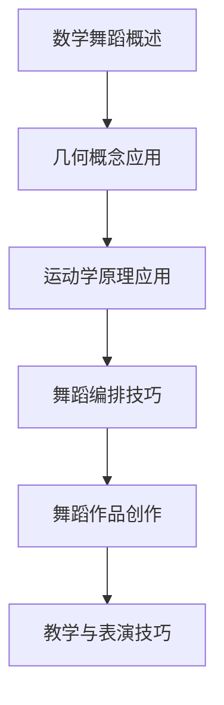

                 

### 文章标题

# 《数学舞蹈：身体运动的数学编排》

### 关键词

- 数学舞蹈
- 几何概念
- 运动学
- 舞蹈编排
- 数学模型

### 摘要

本文将深入探讨数学舞蹈这一独特的艺术形式，通过数学的视角来解读和编排身体运动。文章分为三个部分：基础篇、实践篇和展望篇。在基础篇中，我们将介绍数学舞蹈的概念、几何和运动学基础；在实践篇中，我们将讲解舞蹈编排的技巧和作品创作的方法；在展望篇中，我们将探讨数学舞蹈在教育中的应用和未来发展趋势。通过本文的阅读，读者不仅可以了解数学舞蹈的奥秘，还能掌握舞蹈编排的核心技巧。

## 第一部分：数学舞蹈基础

### 第1章：数学舞蹈概述

#### 1.1 数学舞蹈的概念

数学舞蹈是一种结合了数学与舞蹈艺术的独特艺术形式。它不仅仅是通过数学知识来编排舞蹈动作，更重要的是将数学中的几何、运动学等概念融入到舞蹈中，使得舞蹈动作呈现出独特的韵律和美感。

#### 1.2 数学舞蹈的起源与发展

数学舞蹈的起源可以追溯到古代，当时人们已经开始尝试将几何图形和运动学原理应用到舞蹈中。随着科学技术的进步，数学舞蹈逐渐发展成为一种独立的艺术形式，并在现代社会中得到了广泛的应用和推广。

#### 1.3 数学舞蹈的学科交叉性

数学舞蹈的学科交叉性体现在多个方面。首先，它是数学与舞蹈艺术的交叉，将数学的概念和原理应用于舞蹈中。其次，它是计算机科学与舞蹈艺术的交叉，利用计算机技术来模拟和优化舞蹈动作。最后，它也是教育领域的交叉，通过数学舞蹈来提高学生的数学素养和舞蹈技能。

### 第2章：数学舞蹈中的几何概念

#### 2.1 几何基础

几何是数学舞蹈的基础，它包括点、线、面等基本概念。在数学舞蹈中，这些基本概念被用来设计舞蹈动作的路径和形态。

#### 2.2 几何在舞蹈中的应用

几何在舞蹈中的应用非常广泛，例如，通过几何图形的变换来设计舞蹈动作的变化，通过几何图形的重复来构建舞蹈的节奏等。

#### 2.3 几何图形的变换与舞蹈动作设计

几何图形的变换包括平移、旋转、缩放等。在数学舞蹈中，这些变换被用来设计舞蹈动作的变化。例如，通过平移来设计舞蹈动作的移动路径，通过旋转来设计舞蹈动作的旋转动作，通过缩放来设计舞蹈动作的大小变化。

### 第3章：数学舞蹈中的运动学

#### 3.1 运动学基础

运动学是研究物体运动的科学，它包括速度、加速度、位移等概念。在数学舞蹈中，这些概念被用来描述舞蹈动作的运动状态。

#### 3.2 运动学在舞蹈中的运用

运动学在舞蹈中的运用非常广泛，例如，通过速度和加速度来设计舞蹈动作的力度和节奏，通过位移来设计舞蹈动作的空间变化等。

#### 3.3 运动学原理与舞蹈编排技巧

运动学原理在舞蹈编排中起着重要作用。例如，通过速度和加速度的变化来设计舞蹈动作的力度和节奏，通过位移的变化来设计舞蹈动作的空间变化。这些原理可以帮助舞蹈编导更好地编排舞蹈动作，使得舞蹈动作更加流畅和有层次感。

## 第二部分：数学舞蹈实践

### 第4章：数学舞蹈编排入门

#### 4.1 舞蹈编排的基本原则

舞蹈编排的基本原则包括统一性、变化性、连贯性和协调性。在数学舞蹈编排中，这些原则同样适用。统一性要求整个舞蹈的动作、音乐、服装等元素要统一和谐；变化性要求舞蹈动作要有层次感和节奏感；连贯性要求舞蹈动作要流畅自然；协调性要求舞蹈动作要与音乐、服装等元素协调一致。

#### 4.2 数学元素在舞蹈编排中的应用

数学元素在舞蹈编排中的应用非常广泛，例如，通过几何图形的变换来设计舞蹈动作的变化，通过运动学原理来设计舞蹈动作的力度和节奏等。

#### 4.3 创意舞蹈编排实践

创意舞蹈编排实践是数学舞蹈编排的重要环节。在这个环节中，编导需要充分发挥自己的创造力和想象力，将数学元素与舞蹈动作巧妙地融合在一起，创作出独特的舞蹈作品。

### 第5章：数学舞蹈作品创作

#### 5.1 舞蹈主题与数学元素的选择

舞蹈主题与数学元素的选择是数学舞蹈作品创作的重要环节。选择合适的舞蹈主题和数学元素可以帮助编导更好地表达舞蹈的内涵和情感。

#### 5.2 舞蹈剧本的创作技巧

舞蹈剧本的创作技巧包括故事情节的构思、人物形象的塑造、舞蹈动作的设计等。一个好的舞蹈剧本可以更好地传达舞蹈的主题和情感。

#### 5.3 舞蹈作品的数学编排实践

舞蹈作品的数学编排实践是将数学元素融入到舞蹈剧本中，通过数学原理来设计舞蹈动作的变化和节奏。这个环节需要编导有扎实的数学基础和丰富的舞蹈编排经验。

### 第6章：数学舞蹈教学与表演

#### 6.1 数学舞蹈教学策略

数学舞蹈教学策略包括教学内容的设计、教学方法的运用、教学评价的制定等。在教学过程中，教师需要注重培养学生的数学素养和舞蹈技能。

#### 6.2 数学舞蹈表演技巧

数学舞蹈表演技巧包括舞蹈动作的准确性、舞蹈姿态的美感、舞蹈表情的丰富性等。表演者需要通过不断的练习来提高自己的表演水平。

#### 6.3 数学舞蹈教学与表演案例分析

数学舞蹈教学与表演案例分析是通过具体的案例来分析数学舞蹈的教学和表演过程，总结经验教训，提高教学和表演质量。

## 第三部分：数学舞蹈未来展望

### 第7章：数学舞蹈在教育中的应用

#### 7.1 数学舞蹈在素质教育中的作用

数学舞蹈在素质教育中起着重要作用。它不仅可以帮助学生提高数学素养，还可以培养学生的创造力和团队合作能力。

#### 7.2 数学舞蹈在特殊教育中的应用

数学舞蹈在特殊教育中也有很大的应用价值。它可以帮助特殊学生提高自信心和社交能力，同时也能提高他们的数学素养。

#### 7.3 数学舞蹈在教育改革中的前景

随着教育改革的不断推进，数学舞蹈在未来的教育中将会发挥更大的作用。它将成为素质教育的重要手段，为学生提供更加全面的教育体验。

### 第8章：数学舞蹈的艺术价值与社会影响

#### 8.1 数学舞蹈的艺术特征

数学舞蹈的艺术特征包括独特的视觉美感、丰富的情感表达、独特的节奏感等。它不仅是一种艺术形式，更是一种文化现象。

#### 8.2 数学舞蹈对社会文化的影响

数学舞蹈对社会文化的影响深远。它不仅推动了舞蹈艺术的发展，还促进了数学与舞蹈艺术的融合，丰富了人们的精神文化生活。

#### 8.3 数学舞蹈的未来发展趋势

随着科技的发展和人们对艺术需求的不断变化，数学舞蹈的未来发展趋势将会更加多元化。它将继续推动数学与舞蹈艺术的融合，创造出更多具有创新性和艺术性的作品。

## 附录

### 附录1：数学舞蹈基础概念流程图

以下是一个用于展示数学舞蹈基础概念的Mermaid流程图：



### 附录2：数学舞蹈编排伪代码示例

以下是一个用于展示数学舞蹈编排的伪代码示例：

```python
# 定义舞蹈动作的几何路径
def geometry_path(action, shape, duration):
    # 根据动作、形状和持续时间计算路径
    # ...

# 定义舞蹈动作的运动学参数
def kinematics_parameter(action, speed, acceleration):
    # 根据动作、速度和加速度计算运动学参数
    # ...

# 编排舞蹈动作
def choreography(actions, duration):
    # 根据舞蹈动作列表和持续时间编排舞蹈
    for action in actions:
        geometry_path(action, shape, duration)
        kinematics_parameter(action, speed, acceleration)
    # ...
```

### 附录3：数学舞蹈作品创作示例

以下是一个用于展示数学舞蹈作品创作的示例：

```latex
% 定义舞蹈主题
\title{数学之美：探索几何与运动的舞蹈}

% 定义数学元素
\section{几何元素}
- 点：舞蹈者的起始位置
- 线：舞蹈动作的路径
- 面：舞蹈动作的空间范围

% 定义运动学参数
\section{运动学参数}
- 速度：舞蹈动作的速度
- 加速度：舞蹈动作的加速度
- 位移：舞蹈动作的空间变化

% 舞蹈剧本
\section{舞蹈剧本}
- 动作1：点跳跃
- 动作2：线滑动
- 动作3：面旋转
```

### 附录4：最佳实践与注意事项

- **最佳实践**：
  - 结合舞蹈主题和数学元素，设计具有创新性和艺术性的舞蹈动作。
  - 注重舞蹈动作的流畅性和节奏感，使舞蹈更加生动有趣。
  - 充分利用运动学原理，设计具有层次感和张力的舞蹈动作。

- **注意事项**：
  - 在编排数学舞蹈时，要充分考虑舞蹈者的体能和舞蹈技巧。
  - 要避免过于复杂的数学元素，以免影响舞蹈的表现效果。
  - 在教学和表演中，要注重舞蹈者的安全，避免发生意外伤害。

### 附录5：拓展阅读

- [1] 《数学舞蹈基础教程》
- [2] 《运动学与舞蹈编排》
- [3] 《几何图形在舞蹈中的应用》
- [4] 《数学舞蹈作品创作与实践》

## 作者信息

作者：AI天才研究院/AI Genius Institute & 禅与计算机程序设计艺术 /Zen And The Art of Computer Programming

本文由AI天才研究院/AI Genius Institute与禅与计算机程序设计艺术/Zen And The Art of Computer Programming联合撰写，旨在探讨数学舞蹈这一独特的艺术形式，为读者提供深入浅出的数学舞蹈知识，以及舞蹈编排和实践技巧。希望本文能对读者在数学舞蹈领域的学习和研究有所帮助。

