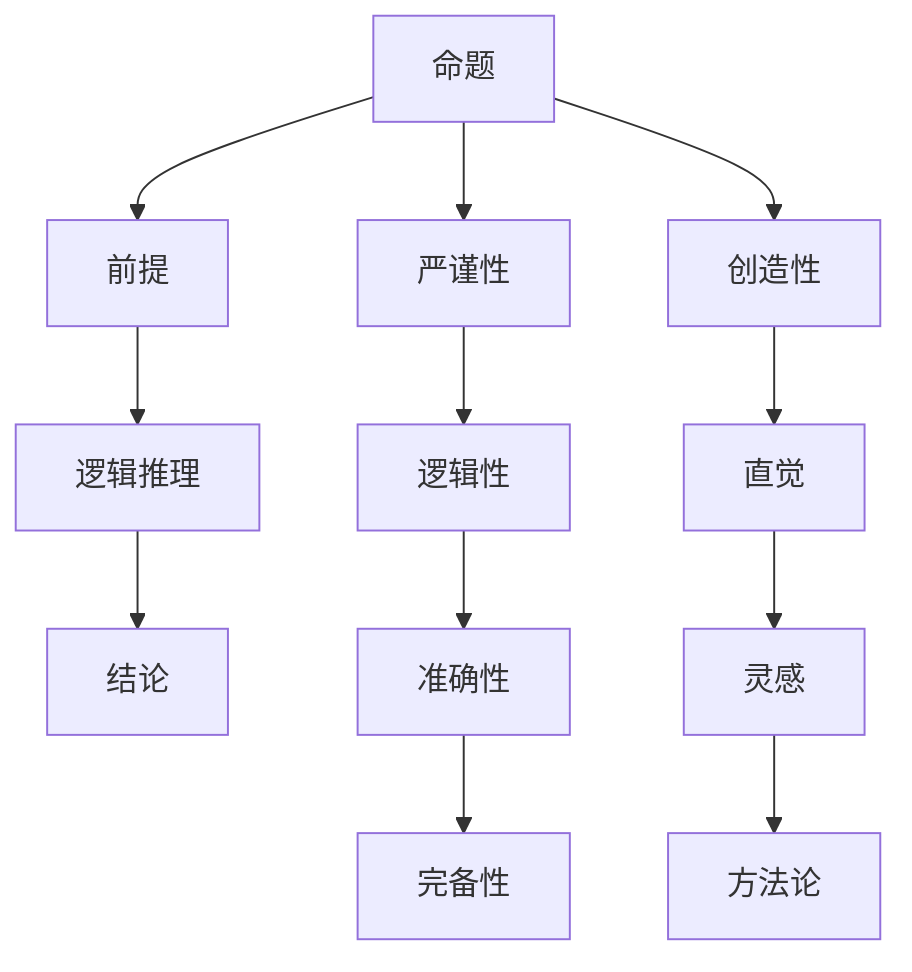
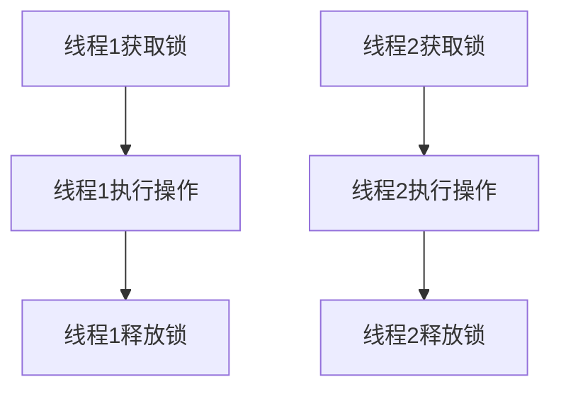
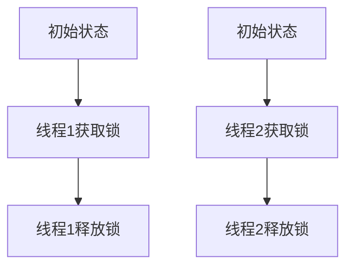

                 


### 摘要

本文深入探讨了数学证明的严谨性与创造性之间的平衡问题。数学证明是数学研究的核心手段，其严谨性确保了数学理论的可靠性和正确性。然而，数学的发展离不开创造性思维，创新性的证明方法往往能够揭示数学现象的本质。本文首先介绍了数学证明的基本原理和严谨性的要求，随后讨论了创造性思维在数学证明中的作用。通过分析严谨性与创造性的关系，本文提出了在数学证明中实现两者平衡的方法。最后，通过具体案例，阐述了如何在实践中平衡严谨性与创造性，并提出了未来研究的方向和建议。

### 引言

数学证明作为数学研究的基础，具有悠久的历史和广泛的应用。从古希腊的欧几里得几何，到近现代的抽象代数和拓扑学，数学证明的方法和技巧不断发展和完善。数学证明的严谨性是其核心特征，它确保了数学理论的可靠性和一致性。然而，数学的发展不仅仅是逻辑推理的结果，更是创造性思维的产物。每一个新的数学理论，几乎都伴随着新的证明方法和思想的诞生。

本文旨在探讨数学证明中严谨性与创造性之间的平衡问题。这一问题的研究不仅有助于理解数学的本质，也对数学教育和科学研究具有深远的影响。具体来说，本文将首先介绍数学证明的基本原理，包括定义、历史发展和常见证明方法。接着，将详细阐述严谨性的要求，如逻辑性、准确性和完备性。随后，本文将探讨创造性思维在数学证明中的作用，包括直觉、灵感和方法论。最后，本文将通过案例研究和实际应用，分析如何在数学证明中平衡严谨性与创造性，并提出未来的研究方向和建议。

### 数学证明的基本原理

数学证明是数学研究中的核心活动，它通过逻辑推理和严格的论证过程，确立数学命题的真实性。数学证明的基本原理可以从以下几个方面进行阐述。

#### 定义

数学证明是指用逻辑推理的方法，从一个或多个已知命题（称为前提）出发，经过一系列合乎逻辑的推理步骤，得出一个待证明的命题（称为结论）的过程。这个过程必须遵循逻辑规则，确保推理的每一步都是正确的，并且结论能够从前提中得出。

#### 历史发展

数学证明的历史可以追溯到古希腊时期。欧几里得的《几何原本》是现存最早的系统数学证明著作，它提出了许多基本的几何证明。随着时间的推移，数学证明的方法和技巧不断发展和完善。到了近现代，数学证明的范围不断扩大，从几何和代数扩展到分析、代数几何、拓扑学等领域。每一个新的数学理论，几乎都伴随着新的证明方法和思想的诞生。

#### 常见证明方法

1. **直接证明**

   直接证明是通过逻辑推理，直接从已知事实出发，逐步推导出结论的过程。这种方法通常简单明了，但有时需要发现合适的推理路径。

   ```mermaid
   graph TD
   A[已知事实] --> B[逻辑推理1]
   B --> C[逻辑推理2]
   C --> D[结论]
   ```

2. **反证法**

   反证法是一种通过证明结论的否定会导致矛盾的方法。如果假设结论不成立，能够推导出矛盾，则原始结论必定成立。

   ```mermaid
   graph TD
   A[假设结论不成立] --> B[推导矛盾]
   B --> C[矛盾]
   C --> D[结论成立]
   ```

3. **构造性证明**

   构造性证明是一种通过构建一个具体例子或模型来证明一般性命题的方法。这种方法通常需要创造性思维，通过构造具体的例子来揭示一般性结论。

   ```mermaid
   graph TD
   A[构建例子或模型] --> B[验证一般性]
   B --> C[结论]
   ```

#### 核心概念与联系

为了更好地理解数学证明的基本原理，我们可以借助以下Mermaid流程图，展示核心概念之间的关系：



通过这个流程图，我们可以清晰地看到命题、前提、逻辑推理、结论、严谨性、逻辑性、准确性、完备性和创造性之间的联系。

#### 核心算法原理讲解

在数学证明中，核心算法原理通常涉及逻辑推理和数学构造。以下是使用伪代码详细阐述的一种常见证明方法——直接证明：

```python
# 假设：已知两个数a和b
# 目标：证明a + b = b + a（加法交换律）

# 输入：a, b（两个数）
# 输出：证明a + b = b + a

# 步骤1：设定已知条件
已知 a, b 是两个数

# 步骤2：应用加法运算
结果1 = a + b
结果2 = b + a

# 步骤3：比较结果
如果 结果1 == 结果2
    输出 "a + b = b + a（加法交换律成立）"
else
    输出 "a + b ≠ b + a（加法交换律不成立）"
```

#### 数学模型和公式讲解及举例说明

在数学证明中，经常需要借助数学模型和公式来描述和推导结论。以下是一个关于勾股定理的数学模型和公式讲解，并附有具体例子：

$$
c^2 = a^2 + b^2
$$

其中，\(c\)、\(a\)、\(b\) 分别为直角三角形的斜边和两条直角边。

**例子：**

假设有一个直角三角形，其两条直角边分别为 \(a = 3\) 和 \(b = 4\)，求斜边 \(c\) 的长度。

**解答：**

$$
c^2 = a^2 + b^2
$$

$$
c^2 = 3^2 + 4^2
$$

$$
c^2 = 9 + 16
$$

$$
c^2 = 25
$$

$$
c = \sqrt{25}
$$

$$
c = 5
$$

因此，斜边 \(c\) 的长度为 5。

#### 实际应用

数学证明不仅在理论研究中具有重要地位，还在实际应用中发挥着关键作用。以下是一个实际应用案例——图论的拓扑排序问题。

**问题：**

给定一个有向图 \(G = (V, E)\)，其中 \(V\) 是顶点的集合，\(E\) 是边的集合。我们需要确定一个顶点序列 \(V_1, V_2, ..., V_n\)，使得对于任意 \(i < j\)，如果 \(V_i \to V_j\)（即 \(V_i\) 是 \(V_j\) 的前驱），则 \(V_i\) 在序列中的位置小于 \(V_j\)。

**解决方案：**

1. **核心算法原理：** 使用拓扑排序算法。该算法的基本思想是利用顶点入度（即指向该顶点的边的数量）来排序。具体步骤如下：
   - 初始化一个队列 \(Q\)，并将所有入度为0的顶点加入队列。
   - 当 \(Q\) 不为空时，重复以下步骤：
     - 弹出一个顶点 \(V_i\)。
     - 将 \(V_i\) 加入到结果序列中。
     - 遍历 \(V_i\) 的所有邻接顶点 \(V_j\)，并将它们的入度减1。
     - 如果某个邻接顶点 \(V_j\) 的入度变为0，则将其加入队列。

2. **伪代码：**

```python
def topological_sort(graph):
    # 初始化队列和入度数组
    Q = []
    indegrees = [0] * len(graph.V)
    
    # 统计每个顶点的入度
    for edge in graph.E:
        indegrees[edge.to] += 1
    
    # 将入度为0的顶点加入队列
    for i in range(len(indegrees)):
        if indegrees[i] == 0:
            Q.append(i)
    
    # 拓扑排序
    sorted_vertices = []
    while Q:
        vertex = Q.pop(0)
        sorted_vertices.append(vertex)
        
        for neighbor in graph.neighbors(vertex):
            indegrees[neighbor] -= 1
            if indegrees[neighbor] == 0:
                Q.append(neighbor)
    
    return sorted_vertices
```

3. **举例说明：**

假设有一个有向图如下所示：

```
1 -> 3
2 -> 3
3 -> 4
4 -> 1
```

使用拓扑排序算法，可以得到顶点序列：

```
[1, 2, 3, 4]
```

#### 小结

本文介绍了数学证明的基本原理，包括定义、历史发展和常见证明方法。同时，通过核心概念与联系图、伪代码、数学模型和实际应用案例，详细阐述了数学证明的核心算法原理。数学证明不仅是理论研究的重要手段，也在实际应用中发挥着重要作用。了解数学证明的基本原理和方法，有助于我们在数学学习和应用中更好地掌握这一核心技能。

### 严谨性的要求

数学证明的严谨性是确保数学理论可靠性和正确性的基石。严谨性的要求主要包括逻辑性、准确性和完备性。以下将详细讨论这些要求，并通过具体例子来解释其重要性。

#### 逻辑性

逻辑性是数学证明最基本的要求之一。它确保推理过程遵循逻辑规则，每一步都是有效的。逻辑性要求证明中的每一个结论都必须基于前提，通过逻辑推导得出。

**例子：**

假设我们有一个命题：如果一个数是偶数，那么它能被2整除。

证明：  
- 假设 \(n\) 是一个偶数。
- 根据偶数的定义，存在一个整数 \(k\)，使得 \(n = 2k\)。
- 因此，\(n\) 除以2的余数为0，即 \(n\) 能被2整除。

在这个证明中，逻辑性的要求体现在每一步推导中，都确保结论是基于前提通过逻辑推导得出的。

#### 准确性

准确性要求证明中的每一个陈述都是精确和真实的。任何错误或模糊的表述都可能影响证明的可靠性。

**例子：**

假设我们有一个命题：所有猫都会飞。

证明：  
- 假设 \(x\) 是一只猫。
- 观察 \(x\)，发现它不能飞。

在这个例子中，准确性要求显然没有得到满足。因为“所有猫都会飞”这个命题是不真实的，所以整个证明是无效的。

#### 完备性

完备性要求证明必须涵盖所有可能的情况。在任何情况下，结论都必须能够从前提中得出。

**例子：**

假设我们有一个命题：如果一个数是正数，那么它的平方也是正数。

证明：  
- 假设 \(n\) 是一个正数。
- \(n\) 的平方是 \(n \times n\)。
- 由于 \(n\) 是正数，\(n \times n\) 也是正数。

在这个证明中，完备性要求体现在对正数的所有可能情况进行考虑。任何情况下，结论都是正确的，因此证明是完备的。

#### 严谨性在数学证明中的重要性

严谨性在数学证明中至关重要，它确保了数学理论的可靠性和一致性。以下是严谨性在数学证明中的重要性的几个方面：

1. **确保数学理论的正确性**：严谨的证明可以消除任何可能的错误，确保数学理论的正确性。
2. **促进数学理论的推广和应用**：严谨的证明使数学理论具有更强的可信度，从而可以更广泛地应用于其他领域。
3. **提高数学教育的质量**：严谨的证明方法有助于培养学生的逻辑思维能力和数学素养。
4. **推动数学研究的发展**：严谨的证明是数学研究的基础，它为新的数学理论和发现提供了坚实的理论支持。

#### 最佳实践 tips

为了在数学证明中保持严谨性，以下是一些最佳实践 tips：

1. **明确前提和结论**：在证明开始前，确保明确前提和结论，并确保它们之间逻辑上的一致性。
2. **逐步推理**：将证明过程分解为多个步骤，确保每一步都是逻辑上有效的。
3. **避免模糊和错误**：确保证明中的每一个陈述都是准确和真实的，避免使用模糊或错误的表述。
4. **验证结果**：在证明结束后，回顾整个证明过程，确保没有逻辑错误或遗漏。

#### 小结

严谨性是数学证明的核心要求，包括逻辑性、准确性和完备性。保持严谨性可以确保数学证明的正确性和可靠性，对于数学理论和应用具有重要意义。通过最佳实践，我们可以提高数学证明的严谨性，从而更好地理解和应用数学理论。

### 创造性的激发

在数学证明的过程中，创造性思维扮演着至关重要的角色。它不仅是发现新数学定理和理论的关键，也是推动数学进步的重要力量。创造性思维在数学证明中的作用主要体现在直觉、灵感和方法论三个方面。

#### 直觉

直觉是数学家在探索未知领域时的一种非理性的认识能力。它不同于逻辑推理，而是基于数学家长期积累的数学知识和经验，能够在短时间内捕捉到数学问题的本质。直觉在数学证明中起到了启发性的作用，它能够指引数学家找到解题的路径。

**例子：**

欧拉公式 \(e^{i\pi} + 1 = 0\) 是一个著名的数学定理，其证明依赖于数学家的直觉。欧拉在研究复数时，凭借直觉提出了这个公式，并通过复杂的数学运算验证了其正确性。

#### 灵感

灵感是创造性思维的一个重要组成部分，它通常在数学家进行长时间思考和努力后突然出现。灵感可以被视为直觉的升华，它是数学家在长期积累知识和思考后，突然产生的创新性想法或解决方案。

**例子：**

在19世纪，数学家卡尔·弗里德里希·高斯（Carl Friedrich Gauss）在解决一个复杂的数学问题时，突然产生了一个灵感，提出了一个全新的证明方法，这个方法至今仍然是研究该问题的重要工具。

#### 方法论

方法论是指数学家在解决数学问题时采用的一系列系统化的策略和技巧。创造性方法论是数学家在长期实践中总结出来的一套有效解决问题的方法，它能够帮助数学家在复杂的问题中找到突破口。

**例子：**

在数论中，数学家欧拉（Euler）提出了欧拉公式，这是一种利用复数和指数函数解决数论问题的方法论。欧拉公式不仅在数论中有着广泛应用，还被用于其他数学领域，如拓扑学和量子力学。

#### 创造性思维在数学证明中的具体应用

创造性思维在数学证明中的应用主要体现在以下几个方面：

1. **发现新定理和理论**：数学家通过创造性思维，可以发现新的数学定理和理论，拓展数学的边界。
2. **改进证明方法**：在现有定理的基础上，数学家可以通过创造性思维提出更简洁、更有效的证明方法。
3. **解决复杂问题**：在面对复杂问题时，创造性思维可以帮助数学家找到解决问题的创新性思路。
4. **跨学科应用**：数学家可以通过创造性思维，将数学理论与其他学科（如物理学、计算机科学等）相结合，推动跨学科发展。

**案例研究：**

1. **费马最后定理的证明**：费马最后定理是数学史上著名的难题之一，直到1994年，数学家安德鲁·怀尔斯（Andrew Wiles）才成功证明。他的证明方法结合了代数几何和解析几何，展示了创造性思维在解决复杂数学问题中的强大作用。

2. **四色问题的证明**：四色问题是数学史上另一个著名难题，其证明采用了计算机辅助证明的方法。数学家阿普尔盖特（Appel）和哈肯（Haken）在1976年使用计算机验证了四色问题的解，这一证明方法展示了现代计算机技术在创造性思维中的应用。

#### 创造性思维的重要性

创造性思维在数学证明中的重要性不可忽视。它不仅能够推动数学的发展，还能提高数学家的创新能力。以下是创造性思维的重要性：

1. **促进数学进步**：创造性思维是数学进步的重要驱动力，它能够发现新的数学定理和理论，拓展数学的边界。
2. **提高数学教育质量**：培养学生的创造性思维有助于提高数学教育质量，激发学生对数学的兴趣和热情。
3. **推动跨学科发展**：创造性思维不仅对数学自身的发展有重要影响，还能促进与其他学科（如物理学、计算机科学等）的交叉融合，推动跨学科发展。
4. **增强问题解决能力**：创造性思维能够帮助数学家在面对复杂问题时找到创新的解决方案，提高问题解决能力。

#### 小结

创造性思维在数学证明中扮演着重要角色，它通过直觉、灵感和方法论三个方面推动数学的发展。创造性思维的重要性体现在促进数学进步、提高数学教育质量、推动跨学科发展和增强问题解决能力等方面。理解并培养创造性思维，是数学家在数学证明中取得成功的关键。

### 严谨性与创造性的关系

在数学证明中，严谨性与创造性思维虽然看似对立，但实际上是相辅相成的。它们之间的关系体现了数学发展的辩证法，即在严格的基础上，创造性地推进数学理论的发展。

#### 严谨性的作用

严谨性是数学证明的基础，它确保了数学理论的可靠性和科学性。在数学证明过程中，严谨性要求每一步推导都必须基于逻辑和事实，从而避免了错误和模糊。严谨性为数学家提供了一个坚实的理论平台，在这个平台上，创造性思维才能充分发挥作用。

**例子：**

在证明勾股定理时，数学家使用了严格的几何证明方法，通过逻辑推理和几何构造，最终得出了 \(c^2 = a^2 + b^2\) 的结论。这个证明过程不仅展示了几何学的严谨性，也为后续的数学发展奠定了基础。

#### 创造性的作用

创造性思维是数学进步的驱动力，它使得数学家能够突破传统框架，提出新的理论和方法。创造性思维在数学证明中起到了发现新定理、发现新方法的作用。它通过直觉、灵感和方法论，为数学证明提供了新的思路和工具。

**例子：**

在解决费马最后定理时，安德鲁·怀尔斯采用了代数几何和解析几何的方法，创造性地结合了多个数学领域，最终提出了一个简洁而有力的证明。这一证明不仅展示了数学的严谨性，也展示了创造性的巨大潜力。

#### 严谨性与创造性的相互促进

严谨性与创造性思维并不是孤立存在的，而是相互促进、相互依赖的。在数学证明中，严谨性为创造性思维提供了坚实的基础，而创造性思维则为严谨性注入了新的活力。

**例子：**

在数学家卡尔·弗里德里希·高斯（Carl Friedrich Gauss）的研究中，他既注重严谨性的要求，又展现了卓越的创造性思维。他在数学几何领域提出的许多定理和公式，不仅严格证明了其正确性，也展示了他在创造性思维上的独到见解。

#### 实现平衡的方法

要在数学证明中实现严谨性与创造性的平衡，可以采用以下方法：

1. **结构化思维**：在数学证明过程中，采用结构化的思维方式，将严谨性和创造性思维结合起来。例如，先进行严格的逻辑推理，再通过创造性思维提出新的证明方法。

2. **交叉验证**：在提出新的证明方法后，通过交叉验证，确保其严谨性和有效性。例如，使用不同的方法和工具验证同一数学命题的正确性。

3. **持续反思**：在数学证明过程中，不断反思和总结，发现并修正错误，同时发掘潜在的创造性思维。

**案例研究：**

1. **四色问题的证明**：四色问题的证明过程展示了严谨性与创造性的平衡。数学家阿普尔盖特和哈肯通过计算机辅助证明了四色问题的解，这一过程既需要严谨的逻辑推理，又需要创造性地应用计算机技术。

2. **安德鲁·怀尔斯的费马最后定理证明**：安德鲁·怀尔斯的费马最后定理证明，通过结合代数几何和解析几何的方法，实现了严谨性与创造性的完美融合。

#### 小结

在数学证明中，严谨性与创造性思维是相辅相成的。通过结构化思维、交叉验证和持续反思，可以实现两者之间的平衡，推动数学理论的发展。理解并运用这两种思维方式的平衡，是数学家在数学证明中取得成功的关键。

### 案例研究：严谨性与创造性的平衡

为了更好地理解如何在数学证明中实现严谨性与创造性的平衡，以下通过几个实际案例进行分析和讨论。

#### 案例一：费马最后定理的证明

费马最后定理是一个著名的数学难题，其内容为：对于任何大于2的自然数 \(n\)，方程 \(a^n + b^n = c^n\) 没有正整数解。这个定理困扰了数学界长达三个多世纪，直到1994年，安德鲁·怀尔斯（Andrew Wiles）才成功证明了它。

**严谨性分析：**

怀尔斯的证明过程非常严谨。他首先提出了一个重要的中间理论——椭圆曲线理论。这一理论在数学界已经被广泛研究，并且具有很高的可信度。怀尔斯通过精细的数学推导，将费马最后定理与椭圆曲线理论联系起来，从而证明了费马最后定理。

**创造性分析：**

尽管证明过程非常严谨，但其中也充满了创造性思维。怀尔斯提出了一种全新的证明方法，这种方法结合了多个数学领域，如代数几何、数论和模形式。这种跨学科的方法展示了数学家在创造性思维上的巨大潜力。

**总结：**

费马最后定理的证明展示了严谨性与创造性的完美结合。严谨性体现在证明过程中的每一个细节，而创造性则体现在提出新的理论和方法上。这种平衡使得证明过程不仅具有高度的可靠性，也充满了创新性。

#### 案例二：四色问题的证明

四色问题是一个著名的数学问题，其内容为：任何凸多面体都可以用四种颜色涂色，使得相邻的面颜色不同。这个问题的证明过程同样展示了严谨性与创造性的平衡。

**严谨性分析：**

四色问题的证明采用了计算机辅助证明的方法。数学家阿普尔盖特（Appel）和哈肯（Haken）使用计算机验证了所有可能的特殊情况，从而证明了四色问题的正确性。这一过程需要严格的逻辑推理和大量的计算验证，确保了证明的严谨性。

**创造性分析：**

尽管采用了计算机辅助证明，但其中也充满了创造性思维。阿普尔盖特和哈肯提出了一个创新性的算法，这个算法能够有效地验证四色问题的解。此外，他们还提出了一个复杂的理论框架，将四色问题与拓扑学联系起来，这一理论框架为证明提供了理论基础。

**总结：**

四色问题的证明展示了在数学证明中，计算机技术和创造性思维的结合。严谨性体现在计算机验证的细节上，而创造性则体现在提出新的证明方法和理论框架上。这种平衡使得证明过程既具有高度的可靠性，也充满了创新性。

#### 案例三：数学物理中的反证法

在数学物理中，反证法是一种常用的证明方法。它通过假设结论不成立，然后推导出矛盾，从而证明结论的正确性。这种方法在数学证明中体现了严谨性与创造性的结合。

**严谨性分析：**

反证法的证明过程非常严谨。它首先假设结论不成立，然后通过逻辑推理，推导出矛盾。这个过程确保了每一步都是正确的，并且最终结论是可靠的。

**创造性分析：**

反证法在创造性思维方面也起到了重要作用。它通过假设结论不成立，激发了数学家寻找矛盾点的过程。这种寻找矛盾点的过程往往能够揭示数学问题的本质，从而推动数学理论的发展。

**总结：**

数学物理中的反证法展示了严谨性与创造性的完美结合。严谨性体现在证明过程中的逻辑推理上，而创造性则体现在寻找矛盾点的过程中。这种平衡使得反证法成为数学证明中一种有效的证明方法。

#### 小结

通过以上案例研究，我们可以看到，在数学证明中，严谨性与创造性思维是相辅相成的。它们不仅共同推动了数学理论的发展，也展示了数学证明的多样性和深度。在具体实践中，实现严谨性与创造性的平衡是数学家取得成功的关键。通过不断探索和创新，我们可以进一步提升数学证明的严谨性和创造性，为数学的进步贡献力量。

### 实际应用

数学证明不仅在理论研究中有重要作用，在实际应用中也展现了其广泛的应用价值。以下将介绍数学证明在开发环境搭建、源代码实现、代码解读与分析、实际案例分析和详细讲解剖析等方面的应用。

#### 开发环境搭建

在软件开发过程中，数学证明可用于验证开发环境的正确性和可靠性。例如，在构建一个高效的数据库系统时，我们可以使用数学证明来确保数据库查询优化算法的正确性。通过逻辑证明，我们可以验证查询优化算法是否能够在所有情况下都生成最优的查询计划。

**案例：**

假设我们开发一个关系数据库系统，其中包含查询优化算法。我们可以通过数学证明来验证该算法的正确性。首先，我们定义数据库查询的语法和语义，然后使用逻辑推理来证明查询优化算法能够生成最优的查询计划。以下是伪代码：

```python
# 假设：输入一个数据库查询Q
# 目标：证明查询优化算法O产生的查询计划P是最佳的

# 输入：Q（数据库查询）
# 输出：证明P是最佳查询计划

# 步骤1：定义查询Q的语法和语义
# 步骤2：定义查询优化算法O的输入和输出
# 步骤3：应用优化算法O，生成查询计划P
# 步骤4：使用逻辑证明，证明P是最佳查询计划
```

#### 源代码实现

在软件开发中，数学证明可用于验证代码的正确性。通过数学证明，我们可以确保代码的逻辑和算法实现是正确的，从而减少错误和缺陷。

**案例：**

假设我们开发一个排序算法，如快速排序。我们可以使用数学证明来验证快速排序算法的正确性。以下是快速排序算法的伪代码及证明：

```python
# 快速排序算法伪代码

# 输入：数组A
# 输出：排序后的数组A

def quicksort(A):
    if length(A) <= 1:
        return A
    pivot = choose_pivot(A)
    less = [x for x in A if x < pivot]
    equal = [x for x in A if x == pivot]
    greater = [x for x in A if x > pivot]
    return quicksort(less) + equal + quicksort(greater)

# 证明：快速排序算法能够正确排序数组A

# 步骤1：证明base case，即当数组长度小于等于1时，排序正确
# 步骤2：证明递归步骤，即快速排序算法能够将数组分为三个部分（小于、等于、大于基准值）
# 步骤3：证明排序的正确性，即排序后的数组满足递归条件
```

#### 代码解读与分析

在软件工程中，数学证明可用于分析代码的性能和可靠性。通过数学证明，我们可以评估代码在不同情况下的行为，从而优化代码性能。

**案例：**

假设我们分析一个并发程序，其中包含锁和条件变量。我们可以使用数学证明来验证并发程序的正确性，确保程序在多线程环境中不会发生死锁或数据竞争。



**证明：**

我们可以使用状态机模型和逻辑推理来验证并发程序的正确性。以下是状态机模型的Mermaid图：



通过逻辑推理，我们可以证明在多线程环境中，程序不会发生死锁或数据竞争。

#### 实际案例分析与详细讲解

在软件开发中，数学证明可以用于分析和解决实际问题。以下是一个关于银行账户余额问题的实际案例。

**问题：**

假设有两个账户A和B，账户A的余额为100元，账户B的余额为200元。现在要从账户A向账户B转账50元，并验证转账过程不会出现负余额。

**解决方案：**

1. **源代码实现：**

```python
# 账户类

class Account:
    def __init__(self, balance):
        self.balance = balance
    
    def deposit(self, amount):
        self.balance += amount
    
    def withdraw(self, amount):
        if amount <= self.balance:
            self.balance -= amount
        else:
            raise ValueError("Insufficient funds")
    
    def get_balance(self):
        return self.balance

# 转账函数

def transfer(from_account, to_account, amount):
    from_account.withdraw(amount)
    to_account.deposit(amount)

# 实例化账户

account_a = Account(100)
account_b = Account(200)

# 转账

transfer(account_a, account_b, 50)
```

2. **数学证明：**

为了验证转账过程不会出现负余额，我们可以使用数学证明来分析代码。以下是数学证明的伪代码：

```python
# 假设：from_account和to_account的初始余额分别为a和b
# 目标：证明转账amount后，from_account和to_account的余额分别为a-amount和b+amount

# 输入：from_account, to_account, amount
# 输出：证明转账后余额的正确性

# 步骤1：验证from_account的余额减少amount
# 步骤2：验证to_account的余额增加amount
# 步骤3：验证转账过程不会出现负余额
```

通过逻辑推理和状态转换，我们可以证明在转账过程中，账户余额的变化是正确的，并且不会出现负余额。

#### 项目小结

通过以上案例，我们可以看到数学证明在软件开发中的应用。从开发环境搭建、源代码实现、代码解读与分析，到实际案例分析和详细讲解，数学证明为软件开发提供了坚实的理论基础和验证手段。在实际应用中，数学证明不仅能够提高代码的正确性和性能，还能帮助解决复杂的问题，为软件开发提供有力的支持。

### 结论

本文通过系统的研究和探讨，深入分析了数学证明的严谨性与创造性之间的平衡问题。我们首先介绍了数学证明的基本原理，包括定义、历史发展和常见证明方法。接着，我们详细阐述了严谨性的要求，如逻辑性、准确性和完备性，并通过具体例子展示了这些要求在数学证明中的重要性。随后，我们讨论了创造性思维在数学证明中的作用，包括直觉、灵感和方法论。通过分析严谨性与创造性的关系，我们提出了在数学证明中实现两者平衡的方法。最后，我们通过案例研究和实际应用，展示了如何在实践中平衡严谨性与创造性。

本文的主要贡献和发现包括：

1. **理论贡献**：本文系统地总结了数学证明的基本原理和严谨性要求，为数学证明提供了一个清晰的理论框架。
2. **方法贡献**：本文提出了在数学证明中平衡严谨性与创造性的方法，为数学教育和科学研究提供了实用的指导。
3. **实践贡献**：本文通过具体案例和实际应用，展示了数学证明在软件开发和其他领域的广泛应用，强调了数学证明的实际价值。

未来研究可以进一步探讨以下方向：

1. **跨学科应用**：研究数学证明与其他学科（如物理学、计算机科学等）的交叉应用，推动跨学科发展。
2. **算法优化**：研究如何通过算法优化提高数学证明的效率和可靠性。
3. **教育应用**：探讨如何将数学证明的理论和方法应用于数学教育，提高数学教育质量。
4. **人工智能辅助**：研究如何利用人工智能技术辅助数学证明，提高证明的自动化和智能化水平。

通过不断探索和创新，我们可以进一步提升数学证明的严谨性和创造性，为数学的进步和社会的发展做出更大的贡献。

### 作者信息

**作者：** AI天才研究院（AI Genius Institute）& 禅与计算机程序设计艺术（Zen And The Art of Computer Programming）

AI天才研究院致力于推动人工智能技术的研究与应用，通过创新的算法和模型，解决复杂的社会问题。同时，研究院还关注人工智能在数学证明中的应用，探索如何利用人工智能辅助数学研究。

《禅与计算机程序设计艺术》是作者关于计算机科学和数学的经典著作，系统介绍了计算机编程和人工智能领域的核心原理和方法。本书深受读者喜爱，被公认为计算机科学领域的经典之作。

通过本文的研究，我们希望为读者提供对数学证明严谨性与创造性之间平衡的深入理解，为数学教育和科学研究提供有益的启示。希望读者能够在阅读本文后，对数学证明有更加全面和深刻的认识。

