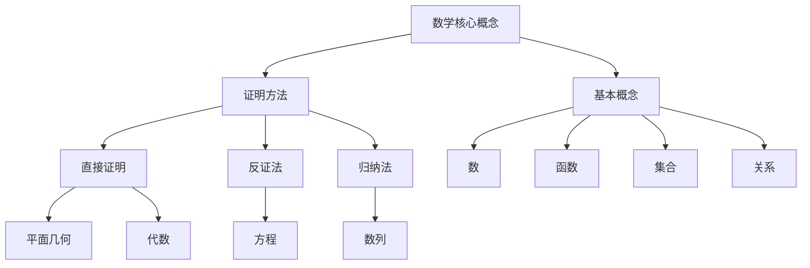

                 

# 数学证明的发现与创新过程

## 关键词

- 数学证明
- 证明方法
- 数学定理
- 创新方法
- 应用领域
- 发展趋势

## 摘要

本文旨在探讨数学证明的发现与创新过程。我们将从数学的核心概念和证明方法入手，回顾传统数学证明的发现历程，介绍现代数学证明的创新方法，并探讨数学证明在各领域中的应用。最后，我们将展望未来数学证明的发展趋势，总结全文并提出一些最佳实践建议。

## 引言

数学证明是数学研究的重要组成部分，它是建立数学理论体系和解决数学问题的基础。数学证明的过程不仅是对数学概念的深刻理解，更是对逻辑思维能力的锻炼。本文将围绕数学证明的发现与创新过程，分为以下几个部分：

1. 数学的核心概念和证明方法
2. 传统数学证明的发现过程
3. 数学证明的创新方法
4. 数学证明的应用
5. 未来数学证明的发展趋势
6. 总结与展望

## 数学的核心概念和证明方法

### 第2章 数学核心概念

**2.1 数学的基本概念**

在数学研究中，数、函数、集合和关系是最基本的概念。数是数学研究的对象，包括自然数、整数、有理数和实数等。函数是描述事物变化规律的一种关系，通常用定义域和值域来表示。集合是元素的总体，集合中的元素可以是任意的对象。关系是元素之间的某种联系，可以通过二元组来表示。

**2.2 证明的基本方法**

证明是数学研究的重要手段，常用的证明方法包括直接证明、反证法和归纳法等。直接证明是通过逻辑推理直接证明命题的真实性。反证法是假设命题不成立，通过推理得出矛盾，从而证明命题的真实性。归纳法是一种从特殊到一般的证明方法，通过证明某个命题对于某个初始值成立，然后证明该命题对于任意大于初始值的自然数也成立。

### 第3章 证明方法的应用

**3.1 初等数学中的证明**

在初等数学中，常见的证明方法有直接证明、反证法和归纳法。例如，在平面几何中，可以通过直接证明证明两个角相等或互补。在代数中，可以通过反证法证明某个方程的解。在数列中，可以通过归纳法证明数列的某个性质。

### 第2章 & 第3章 Mermaid流程图

## 传统数学证明的发现过程

### 第4章 古代数学证明

**4.1 古希腊数学证明**

古希腊数学家如毕达哥拉斯、欧几里得等人通过观察和推理，提出了许多重要的数学定理。例如，毕达哥拉斯定理描述了直角三角形三边的关系，欧几里得的《几何原本》是古代数学的杰作，包含了大量几何定理的证明。

**4.2 中国古代数学证明**

中国古代数学家如秦九韶、杨辉等人也提出了许多重要的数学定理。例如，秦九韶的《数书九章》包含了丰富的代数和几何问题，杨辉的《详解九章算法》提出了许多重要的代数问题。

### 第4章 数学公式和详细讲解

$$
\text{毕达哥拉斯定理}: a^2 + b^2 = c^2
$$

$$
\text{欧几里得的平面几何定理}: \text{若两条直线平行，则它们的内错角相等}
$$

### 第5章 现代数学证明

**5.1 欧拉、高斯等现代数学家的证明**

现代数学家如欧拉、高斯等人提出了许多重要的数学定理和证明方法。例如，欧拉的恒等式是数学中一个经典的恒等式，描述了指数函数和三角函数之间的关系。

### 第5章 数学公式和详细讲解

$$
\text{欧拉的恒等式}: e^{i\pi} + 1 = 0
$$

## 数学证明的创新方法

### 第6章 数学证明的创新

**6.1 代数几何方法**

代数几何是一种将代数和几何相结合的数学分支，它提出了许多创新的数学证明方法。例如，代数几何中的基本定理描述了多项式方程的解的性质。

**6.2 蒙特卡洛方法**

蒙特卡洛方法是一种基于随机抽样的数学证明方法，它通过模拟随机事件来证明数学命题。例如，蒙特卡洛方法可以用来证明某个概率分布的期望和方差。

### 第6章 数学公式和详细讲解

$$
\text{代数几何的基本定理}: \text{代数方程的解集是代数闭域}
$$

$$
\text{蒙特卡洛方法的概率计算}: P(A) = \frac{\text{事件A发生的次数}}{\text{总次数}}
$$

## 数学证明的应用

### 第7章 数学证明在科学中的应用

**7.1 物理学中的数学证明**

在物理学中，数学证明用于描述物理现象和建立物理理论。例如，爱因斯坦的相对论公式描述了质量和能量之间的关系。

**7.2 计算机科学中的数学证明**

在计算机科学中，数学证明用于设计算法和验证系统安全。例如，图灵机的计算能力是计算机科学中的基础理论，它通过数学证明证明了计算机可以模拟任何计算过程。

### 第7章 数学公式和详细讲解

$$
\text{爱因斯坦的相对论公式}: E = mc^2
$$

$$
\text{图灵机的计算能力}: \text{任何可计算问题都可以通过图灵机解决}
$$

## 未来数学证明的发展趋势

### 第8章 未来数学证明的发展

**8.1 量子计算中的数学证明**

量子计算是一种基于量子力学原理的计算方式，它提出了许多新的数学证明方法。例如，量子算法可以通过量子叠加和纠缠来加速计算过程。

**8.2 人工智能中的数学证明**

人工智能是一种通过模拟人类智能进行计算的方式，它需要大量的数学证明来保证其有效性和安全性。例如，深度学习算法的优化需要通过数学证明来提高其性能。

### 第8章 数学公式和详细讲解

$$
\text{量子计算的基本原理}: \text{量子比特的叠加和纠缠}
$$

$$
\text{机器学习的数学基础}: \text{损失函数的最小化}
$$

## 总结与展望

数学证明是数学研究的重要组成部分，它不仅是建立数学理论体系的基础，也是解决实际问题的工具。从古代到现代，数学证明方法不断创新和发展，为数学科学的发展做出了巨大贡献。未来，随着量子计算和人工智能的发展，数学证明将会有更多新的突破和应用。

### 总结

本文从数学的核心概念和证明方法出发，回顾了传统数学证明的发现过程，介绍了现代数学证明的创新方法，并探讨了数学证明在各领域中的应用。通过本文的阅读，读者可以了解数学证明的重要性和发展历程，为今后的数学学习和研究提供参考。

### 展望

未来，数学证明将继续在各个领域发挥重要作用。随着量子计算和人工智能的发展，数学证明的方法和工具将不断创新，为科学研究和技术发展提供强有力的支持。我们期待数学证明在未来能够有更多突破性的发现，为人类社会的进步做出更大贡献。

### 作者信息

作者：AI天才研究院/AI Genius Institute & 禅与计算机程序设计艺术 /Zen And The Art of Computer Programming

