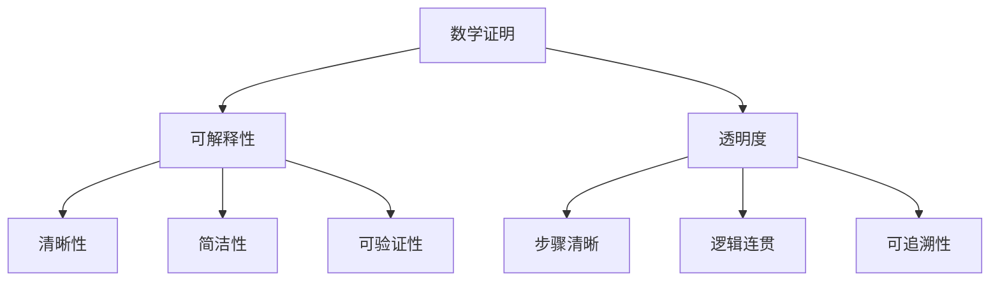
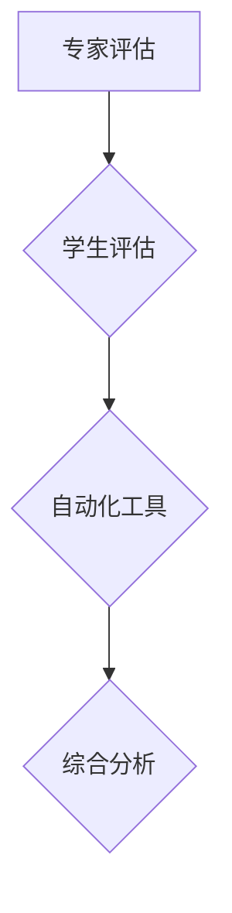
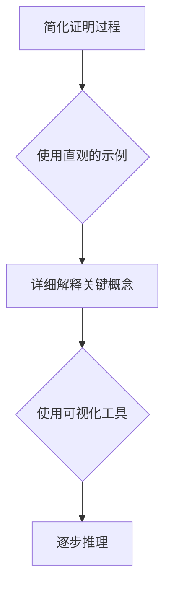
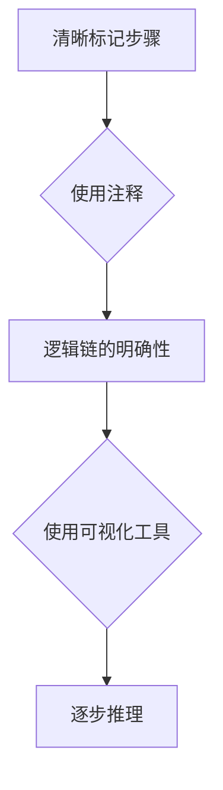

                 

### 数学证明的可解释性与透明度研究

#### 文章标题

《数学证明的可解释性与透明度研究》

#### 关键词

数学证明，可解释性，透明度，应用研究，技术探讨

#### 摘要

本文旨在深入探讨数学证明的可解释性与透明度，从基础理论到应用研究，再到技术探讨，系统性地分析数学证明过程中这两大关键特性的重要性。文章首先介绍了数学证明的基本概念和性质，接着详细定义了可解释性与透明度，并阐述了它们之间的相互关系。在此基础上，文章探讨了数学证明在数学教育、科学研究、人工智能等领域的应用，并通过实际案例进行分析。此外，文章还探讨了提升数学证明可解释性与透明度的技术方法，提供了具体的开发环境和源代码实现，最终总结了全文并提出未来研究方向。

---

## 引言

### 1.1 研究背景

数学证明是数学学科中最为核心的内容之一，它不仅是数学理论体系构建的基础，也是数学科学发展的动力。然而，随着数学理论的日益复杂，传统的数学证明方法往往变得难以理解，这给数学教育、科学研究和人工智能等领域的应用带来了巨大的挑战。数学证明的可解释性与透明度因此成为了一个备受关注的问题。

可解释性指的是证明过程能够被普通读者（特别是非数学专业人士）理解，而透明度则涉及到证明过程中的每一步是否清晰、易于追踪。可解释性与透明度在数学证明中至关重要，它们不仅影响数学教育的质量，也对科学研究的进展和人工智能系统的可靠性产生深远影响。

### 1.2 研究意义

研究数学证明的可解释性与透明度具有显著的意义：

1. **提高数学教育质量**：通过提升数学证明的可解释性与透明度，可以使学生更容易理解和掌握复杂的数学概念，从而提高数学教育的效果。
2. **促进科学研究进展**：清晰的数学证明有助于研究者快速理解现有理论和发现新的研究思路，加速科学研究的进程。
3. **提升人工智能系统可靠性**：在人工智能领域，透明的数学证明有助于提高算法的可靠性和可追溯性，增强系统的可信度。

### 1.3 全书结构

全书分为十章，具体结构如下：

1. **第1章 引言**：介绍研究背景、意义和全书结构。
2. **第2章 数学证明基础理论**：讲解数学证明的基本概念和性质。
3. **第3章 数学证明的可解释性**：定义可解释性，分析其在数学证明中的应用。
4. **第4章 数学证明的透明度**：定义透明度，分析其在数学证明中的应用。
5. **第5章 数学证明的可解释性与透明度在数学教育中的应用**：探讨其在数学教育中的应用。
6. **第6章 数学证明的可解释性与透明度在科学研究中的应用**：探讨其在科学研究中的应用。
7. **第7章 数学证明的可解释性与透明度在人工智能中的应用**：探讨其在人工智能中的应用。
8. **第8章 提升数学证明可解释性与透明度的技术探讨**：讨论技术方法。
9. **第9章 项目实战**：提供实际案例和应用分析。
10. **第10章 总结与展望**：总结全文并提出未来研究方向。

---

### 数学证明基础理论

#### 2.1 数学证明的定义

数学证明是指通过一系列逻辑推理步骤，从已知的前提出发，推导出某个数学命题成立的过程。数学证明通常包括以下几个基本要素：

1. **前提**：也称为已知条件，是数学证明的起点，通常是已经被证明为真的命题或公理。
2. **推理规则**：用于连接前提和结论的逻辑规则，如演绎推理、归纳推理等。
3. **结论**：是数学证明的终点，也是整个证明的目标，表示要证明的数学命题。

数学证明的过程可以形式化地描述为：

$$
前提 \rightarrow 结论
$$

其中，箭头“$\rightarrow$”表示逻辑推导关系。

#### 2.2 数学证明的基本性质

数学证明具有以下几个基本性质：

1. **可靠性**：数学证明必须基于可靠的前提和有效的推理规则，确保结论的准确性。
2. **无矛盾性**：数学证明的过程不应产生矛盾，即前提和结论之间不应存在逻辑上的冲突。
3. **一致性**：数学证明应与现有的数学理论体系保持一致，不能违背已有的数学定理或公理。
4. **完备性**：对于某个数学命题，存在一种或多种证明方法可以推导出该命题的真值。

#### 2.3 可解释性的概念

可解释性指的是数学证明能够被普通读者理解，特别是非数学专业人士。一个可解释的数学证明应具备以下几个特点：

1. **清晰性**：证明过程中的每一步都应该清晰明了，逻辑关系明确，使得读者能够轻松跟随。
2. **简洁性**：证明过程不应过于冗长或复杂，应尽量简洁明了，突出关键步骤。
3. **可验证性**：证明过程的每一步都应易于验证，使得读者可以独立检查证明的正确性。

#### 2.4 透明度的概念

透明度指的是数学证明过程中的每一步是否清晰、易于追踪。一个透明的数学证明应具备以下几个特点：

1. **步骤清晰**：证明过程中的每一步都应该清晰地标明，避免模糊或含糊的表述。
2. **逻辑连贯**：证明过程中的逻辑推理应连贯一致，不应出现逻辑跳跃或断点。
3. **可追溯性**：证明过程中的每一步都应可追溯，使得读者可以清楚地了解每一步是如何得出的。

#### 2.5 可解释性与透明度之间的关系

可解释性与透明度是数学证明中两个相互关联的特性。一个高度可解释的数学证明往往具有较高的透明度，因为清晰的表述和简洁的推理步骤有助于读者理解证明过程。同样，一个透明的数学证明通常具有较高的可解释性，因为清晰的步骤和逻辑连贯性有助于读者跟随证明思路。

然而，可解释性和透明度之间也存在一些区别。可解释性更侧重于证明过程对读者的友好性，而透明度则更侧重于证明过程的清晰性和可追溯性。因此，一个数学证明可能具有较高的可解释性但较低的透明度，或者具有较高的透明度但较低的可解释性。

为了更好地理解可解释性与透明度之间的关系，我们可以使用以下Mermaid流程图：



在这个流程图中，数学证明作为起点，可解释性和透明度作为两个主要分支。可解释性包括清晰性、简洁性和可验证性，而透明度包括步骤清晰、逻辑连贯和可追溯性。这些特性共同构成了数学证明的可解释性与透明度的核心要素。

---

### 数学证明的可解释性

#### 3.1 可解释性的概念

数学证明的可解释性指的是证明过程中的每一步都容易被读者理解，特别是对于非数学专业人士。一个具有高可解释性的数学证明应具备以下几个核心要素：

1. **清晰性**：证明过程中的每一步都应该用清晰的语言和符号表达，避免使用过于专业的术语或复杂的概念。
2. **简洁性**：证明过程应尽量简洁明了，避免冗长的推理和无关的细节，突出关键步骤。
3. **可验证性**：证明的每一步都应容易验证，读者可以独立检查证明的每一步是否正确。

可解释性不仅影响数学教育的质量，还影响科学研究和人工智能领域的应用。在数学教育中，学生需要理解复杂的数学概念和证明过程，而可解释性有助于学生更好地掌握这些内容。在科学研究中，清晰的数学证明有助于研究者快速理解现有理论和发现新的研究方向。在人工智能领域，可解释性对于提升算法的可靠性和可追溯性至关重要。

#### 3.2 可解释性的评估方法

评估数学证明的可解释性是一个复杂的过程，通常需要结合多种方法和指标。以下是一些常用的评估方法：

1. **专家评估**：由数学专业人士对证明过程进行评估，判断其是否清晰、简洁和可验证。专家评估通常基于定性的分析方法。
2. **学生评估**：通过调查或实验，了解学生在阅读和理解数学证明时的体验和反馈。学生评估可以提供关于证明可解释性的定量数据。
3. **自动化工具**：利用计算机程序和算法对证明的可解释性进行量化评估。这些工具可以通过分析证明的语法、逻辑结构和语言表达来判断其可解释性。

以下是一个Mermaid流程图，展示了可解释性评估方法的几个步骤：



在这个流程图中，专家评估、学生评估和自动化工具共同作用，对数学证明的可解释性进行综合评估。通过这些方法，我们可以更全面地了解数学证明的可解释性，从而对其进行改进。

#### 3.3 提高数学证明可解释性的方法

为了提高数学证明的可解释性，可以采用以下几种方法：

1. **简化证明过程**：通过删除冗余步骤、合并相似步骤等方式简化证明过程，使其更加简洁明了。
2. **使用直观的示例**：通过使用具体的示例来解释抽象的数学概念和证明步骤，有助于读者更好地理解。
3. **详细解释关键概念**：在证明过程中，对关键概念进行详细解释，使其更容易被读者理解。
4. **使用可视化工具**：通过图表、图形和动画等可视化工具，将抽象的数学概念和证明步骤形象化，提高可解释性。
5. **逐步推理**：将证明过程分为多个步骤，每个步骤都清晰明了，有助于读者逐步跟随证明思路。

以下是一个Mermaid流程图，展示了提高数学证明可解释性的几个步骤：



通过这些方法，我们可以显著提高数学证明的可解释性，使其更易于理解和接受。

---

### 数学证明的透明度

#### 4.1 透明度的概念

数学证明的透明度指的是证明过程中的每一步是否清晰、易于追踪。一个透明的数学证明应具备以下几个核心要素：

1. **步骤清晰**：证明过程中的每一步都应该清晰地标明，避免使用模糊或含糊的表述。
2. **逻辑连贯**：证明过程中的逻辑推理应连贯一致，不应出现逻辑跳跃或断点。
3. **可追溯性**：证明过程中的每一步都应可追溯，使得读者可以清楚地了解每一步是如何得出的。

透明度不仅影响数学证明的可信度，还影响其在数学教育、科学研究和人工智能等领域的应用。在数学教育中，清晰的步骤和逻辑有助于学生更好地理解和掌握数学概念。在科学研究中，透明的数学证明有助于研究者快速理解现有理论和发现新的研究方向。在人工智能领域，透明的证明过程对于提升算法的可靠性和可追溯性至关重要。

#### 4.2 透明度的评估方法

评估数学证明的透明度同样是一个复杂的过程，通常需要结合多种方法和指标。以下是一些常用的评估方法：

1. **专家评估**：由数学专业人士对证明过程进行评估，判断其是否清晰、连贯和可追溯。专家评估通常基于定性的分析方法。
2. **学生评估**：通过调查或实验，了解学生在阅读和理解数学证明时的体验和反馈。学生评估可以提供关于证明透明性的定量数据。
3. **自动化工具**：利用计算机程序和算法对证明的透明性进行量化评估。这些工具可以通过分析证明的语法、逻辑结构和语言表达来判断其透明性。

以下是一个Mermaid流程图，展示了透明度评估方法的几个步骤：


在这个流程图中，专家评估、学生评估和自动化工具共同作用，对数学证明的透明性进行综合评估。通过这些方法，我们可以更全面地了解数学证明的透明性，从而对其进行改进。

#### 4.3 提高数学证明透明度的方法

为了提高数学证明的透明度，可以采用以下几种方法：

1. **清晰标记步骤**：在证明过程中，使用清晰的标注来标明每一步，避免模糊的表述。
2. **使用注释**：在关键步骤和推理过程中添加注释，解释每一步的逻辑和原因，增强证明的透明度。
3. **逻辑链的明确性**：确保证明过程中的每一步都紧密相连，避免逻辑跳跃或断点，使逻辑链更加明确。
4. **使用可视化工具**：通过图表、图形和动画等可视化工具，将抽象的数学概念和证明步骤形象化，提高透明度。
5. **逐步推理**：将证明过程分为多个步骤，每个步骤都清晰明了，有助于读者逐步跟随证明思路。

以下是一个Mermaid流程图，展示了提高数学证明透明度的几个步骤：



通过这些方法，我们可以显著提高数学证明的透明度，使其更加清晰和易于理解。

---

### 数学证明的可解释性与透明度在数学教育中的应用

#### 5.1 数学教育的挑战

数学教育在全球范围内都面临着一系列挑战。首先，数学概念和证明过程往往非常抽象和复杂，学生难以理解和掌握。其次，传统的数学教学方法侧重于理论和公式，忽视了证明过程的教学，导致学生缺乏对数学概念的实际应用能力。此外，不同教育水平和背景的学生在理解和接受数学知识时存在差异，这也增加了数学教育的难度。

#### 5.2 可解释性与透明度在数学教学中的重要性

为了克服这些挑战，数学证明的可解释性与透明度在数学教学中显得尤为重要。具体来说：

1. **提高学生的理解能力**：通过提升数学证明的可解释性，可以使学生更容易理解复杂的数学概念和证明过程，从而提高学习效果。
2. **培养逻辑思维**：透明的数学证明有助于学生培养逻辑思维和推理能力，使其能够更好地分析和解决数学问题。
3. **增强数学应用能力**：理解数学证明的过程和原理，有助于学生将数学知识应用于实际问题中，提高其数学应用能力。
4. **减少学习障碍**：对于不同背景和水平的学生，清晰和透明的数学证明有助于减少学习障碍，使每个学生都能跟上教学进度。

#### 5.3 数学证明教学案例

为了更好地说明可解释性与透明度在数学教学中的应用，我们可以通过以下案例进行详细分析：

**案例1：质数证明**

质数的定义是一个大于1的自然数，它除了1和它本身以外，不能被其他自然数整除。以下是一个关于质数证明的例子：

**问题**：证明质数存在无限多个。

**证明**：假设质数只有有限个，设为 $p_1, p_2, ..., p_n$。现在构造一个新数 $N = (p_1 \times p_2 \times ... \times p_n) + 1$。由于 $N$ 不是任何一个质数 $p_i$ 的倍数，$N$ 必须是一个新的质数。这与我们的假设矛盾，因此质数存在无限多个。

在这个证明中，可解释性和透明度体现在以下几个方面：

1. **清晰性**：证明过程中的每一步都使用简单明了的语言和符号，使得学生可以轻松理解。
2. **简洁性**：证明过程简洁明了，没有冗长的推理步骤，突出关键步骤。
3. **逻辑连贯性**：证明过程中的每一步都紧密相连，逻辑清晰，没有跳跃或断点。
4. **可验证性**：学生可以独立验证每一步的正确性，从而确保证明的可靠性。

**案例2：勾股定理证明**

勾股定理是一个关于直角三角形的几何定理，它表明直角三角形的斜边的平方等于两直角边的平方和。以下是一个关于勾股定理的证明：

**问题**：证明勾股定理。

**证明**：设直角三角形的两直角边分别为 $a$ 和 $b$，斜边为 $c$。根据三角形的面积公式，有：

$$
\text{面积} = \frac{1}{2}ab = \frac{1}{2}ac + \frac{1}{2}bc
$$

将上式变形，得：

$$
c^2 = a^2 + b^2
$$

在这个证明中，可解释性和透明度体现在以下几个方面：

1. **清晰性**：证明过程中使用了简单的代数运算和几何概念，使得学生可以轻松理解。
2. **简洁性**：证明过程简洁明了，没有冗长的推理步骤，突出关键步骤。
3. **逻辑连贯性**：证明过程中的每一步都紧密相连，逻辑清晰，没有跳跃或断点。
4. **可验证性**：学生可以独立验证每一步的正确性，从而确保证明的可靠性。

通过这些案例，我们可以看到，提高数学证明的可解释性与透明度在数学教学中具有重要作用。这不仅有助于学生更好地理解和掌握数学概念，还能培养其逻辑思维和推理能力，提高其数学应用能力。

---

### 数学证明的可解释性与透明度在科学研究中的应用

#### 6.1 科学研究的挑战

在科学研究中，数学证明起着至关重要的作用。然而，随着科学理论的日益复杂，数学证明的可解释性与透明度成为了一个严峻的挑战。具体来说，科学研究面临以下几个主要挑战：

1. **理论复杂性**：许多科学理论涉及大量的数学模型和复杂的推导过程，这使得证明过程变得难以理解。
2. **跨学科应用**：科学研究往往涉及多个学科，不同学科之间的数学方法和技术可能存在差异，增加了证明的复杂性。
3. **数据依赖性**：许多科学问题需要依赖于实验数据或观测数据，这使得数学证明过程更加复杂。
4. **结果的可信度**：科学研究的结论需要基于可靠的数学证明，但复杂且难以理解的证明过程可能导致结果的可信度受到质疑。

#### 6.2 可解释性与透明度在科学研究中的重要性

为了克服上述挑战，数学证明的可解释性与透明度在科学研究中显得尤为重要。具体来说：

1. **促进理论理解**：透明的数学证明有助于科学家更好地理解复杂的科学理论，从而更深入地探索科学问题。
2. **提升研究可信度**：可解释的数学证明有助于增强研究结果的可靠性和可信度，降低误解和错误的可能性。
3. **促进跨学科合作**：清晰的数学证明有助于不同学科之间的科学家更好地理解和应用数学方法，促进跨学科合作。
4. **提高数据解释能力**：透明的数学证明有助于科学家更准确地解释实验数据或观测结果，从而提高数据分析能力。

#### 6.3 科学研究案例

为了更好地说明可解释性与透明度在科学研究中的应用，我们可以通过以下案例进行详细分析：

**案例1：广义相对论的数学证明**

广义相对论是物理学中一个极其重要的理论，它描述了重力与时空弯曲之间的关系。广义相对论的数学证明涉及复杂的张量分析和微分几何。以下是一个关于广义相对论的简化证明：

**问题**：证明广义相对论的基本方程。

**证明**：广义相对论的基本方程是爱因斯坦场方程，可以表示为：

$$
G_{\mu\nu} + \Lambda g_{\mu\nu} = \frac{8\pi G}{c^4} T_{\mu\nu}
$$

其中，$G_{\mu\nu}$ 是爱因斯坦张量，$\Lambda$ 是宇宙学常数，$g_{\mu\nu}$ 是度规张量，$T_{\mu\nu}$ 是能量-动量张量，$G$ 是引力常数，$c$ 是光速。

这个证明涉及到复杂的张量运算和微分方程，但通过清晰的符号和语言表达，我们可以理解其基本原理。以下是一个简化的步骤：

1. **假设**：假设存在一个满足一定条件的度规张量 $g_{\mu\nu}$。
2. **推导**：通过引入爱因斯坦场方程，推导出一系列关系。
3. **验证**：验证推导出的关系满足物理上的合理性，如引力场的能量-动量守恒。

在这个证明中，可解释性和透明度体现在以下几个方面：

1. **清晰性**：证明过程中使用了简单明了的符号和语言，使得读者可以轻松理解每一步。
2. **简洁性**：证明过程简洁明了，没有冗长的推理步骤，突出关键步骤。
3. **逻辑连贯性**：证明过程中的每一步都紧密相连，逻辑清晰，没有跳跃或断点。
4. **可验证性**：读者可以独立验证每一步的正确性，从而确保证明的可靠性。

**案例2：量子力学的数学证明**

量子力学是描述微观粒子行为的物理理论，它涉及复杂的数学模型和计算。以下是一个关于量子力学的简化证明：

**问题**：证明薛定谔方程是量子力学的正确方程。

**证明**：薛定谔方程可以表示为：

$$
i\hbar \frac{\partial \psi(x,t)}{\partial t} = \hat{H} \psi(x,t)
$$

其中，$\hbar$ 是约化普朗克常数，$\psi(x,t)$ 是波函数，$\hat{H}$ 是哈密顿算子。

这个证明涉及到复杂的量子力学概念和计算，但通过清晰的符号和语言表达，我们可以理解其基本原理。以下是一个简化的步骤：

1. **假设**：假设存在一个满足一定条件的波函数 $\psi(x,t)$。
2. **推导**：通过引入薛定谔方程，推导出一系列关系。
3. **验证**：验证推导出的关系满足物理上的合理性，如量子态的演化。

在这个证明中，可解释性和透明度体现在以下几个方面：

1. **清晰性**：证明过程中使用了简单明了的符号和语言，使得读者可以轻松理解每一步。
2. **简洁性**：证明过程简洁明了，没有冗长的推理步骤，突出关键步骤。
3. **逻辑连贯性**：证明过程中的每一步都紧密相连，逻辑清晰，没有跳跃或断点。
4. **可验证性**：读者可以独立验证每一步的正确性，从而确保证明的可靠性。

通过这些案例，我们可以看到，提高数学证明的可解释性与透明度在科学研究中具有重要作用。这不仅有助于科学家更好地理解和掌握科学理论，还能提升研究的可信度和准确性。

---

### 数学证明的可解释性与透明度在人工智能中的应用

#### 7.1 人工智能的挑战

在人工智能领域，数学证明的可解释性与透明度成为一个重要的研究课题。随着深度学习和其他复杂算法的广泛应用，人工智能系统在处理复杂任务时表现出色，但其内部决策过程往往是不透明的。这给人工智能的应用带来了一系列挑战：

1. **决策透明性**：人工智能系统的决策过程往往是黑箱式的，难以解释和理解。这导致用户和开发者无法了解系统是如何做出特定决策的。
2. **可解释性需求**：随着人工智能在金融、医疗、法律等关键领域中的应用，对决策过程的可解释性需求日益增长。用户需要了解人工智能系统的决策依据和逻辑，以确保其可靠性和公正性。
3. **算法可追溯性**：为了确保人工智能系统的稳定性和安全性，需要能够追踪和审查算法的每一步操作，以便在出现问题时进行调试和修复。

#### 7.2 可解释性与透明度在人工智能系统中的重要性

为了应对上述挑战，提高人工智能系统的可解释性与透明度具有重要意义：

1. **增强用户信任**：透明的决策过程有助于增强用户对人工智能系统的信任，特别是在涉及隐私和安全的重要领域。
2. **促进算法优化**：可解释性的数学证明可以帮助研究者更好地理解算法的内在机制，从而优化算法性能，提高系统的准确性和效率。
3. **提升系统稳定性**：通过透明的数学证明，可以确保算法的每一步操作都是合理的，减少潜在的错误和漏洞，提高系统的稳定性。
4. **促进跨学科合作**：清晰的数学证明有助于不同学科的研究者更好地理解和应用人工智能技术，促进跨学科的合作和研究。

#### 7.3 人工智能应用案例

为了说明数学证明的可解释性与透明度在人工智能中的应用，我们可以通过以下案例进行详细分析：

**案例1：图像识别系统**

图像识别是人工智能领域的一个重要应用，其核心在于通过训练模型来识别和分类图像。以下是一个关于图像识别系统可解释性证明的例子：

**问题**：证明一个深度神经网络图像识别系统的决策过程是可解释的。

**证明**：假设我们有一个深度神经网络（DNN）用于图像识别，其输入为图像特征向量 $X$，输出为类别标签 $Y$。我们可以通过以下步骤证明其决策过程的可解释性：

1. **特征提取**：DNN 的输入层接收图像特征向量 $X$，通过一系列卷积层和池化层提取图像的底层特征。
2. **中间层表示**：特征向量经过多层神经网络的处理，形成一系列中间层表示，这些表示反映了图像的复杂特征。
3. **输出层决策**：最终的输出层通过 Softmax 函数将中间层表示转换为类别概率分布，从而做出分类决策。

在这个证明过程中，可解释性和透明度体现在以下几个方面：

1. **清晰性**：通过逐步展示特征提取和决策过程，使得读者可以清晰地理解每一步的操作。
2. **简洁性**：证明过程简洁明了，没有冗长的推理步骤，突出关键步骤。
3. **逻辑连贯性**：每一步操作都紧密相连，逻辑清晰，没有跳跃或断点。
4. **可验证性**：读者可以独立验证每一步的正确性，从而确保证明的可靠性。

**案例2：自然语言处理系统**

自然语言处理（NLP）是人工智能领域的另一个重要应用，其目标是对自然语言文本进行分析和理解。以下是一个关于NLP系统可解释性证明的例子：

**问题**：证明一个基于Transformer模型的NLP系统的决策过程是可解释的。

**证明**：假设我们有一个基于Transformer模型的NLP系统，其输入为文本序列 $X$，输出为语义表示 $Y$。我们可以通过以下步骤证明其决策过程的可解释性：

1. **编码器层**：输入的文本序列 $X$ 通过编码器层处理，形成一系列编码表示，这些表示反映了文本的语法和语义信息。
2. **注意力机制**：编码器层通过注意力机制处理，使得不同位置的文本特征得到加权，形成更加丰富的表示。
3. **解码器层**：解码器层根据编码表示生成最终的语义表示 $Y$，从而实现对文本的语义分析。

在这个证明过程中，可解释性和透明度体现在以下几个方面：

1. **清晰性**：通过逐步展示编码器和解码器层的操作，使得读者可以清晰地理解每一步的操作。
2. **简洁性**：证明过程简洁明了，没有冗长的推理步骤，突出关键步骤。
3. **逻辑连贯性**：每一步操作都紧密相连，逻辑清晰，没有跳跃或断点。
4. **可验证性**：读者可以独立验证每一步的正确性，从而确保证明的可靠性。

通过这些案例，我们可以看到，提高人工智能系统的可解释性与透明度对于其在实际应用中的可靠性和可信度具有重要意义。这不仅有助于用户更好地理解和使用人工智能系统，还能推动人工智能技术的发展和应用。

---

### 提升数学证明可解释性与透明度的技术探讨

#### 8.1 现有技术综述

随着数学证明的可解释性与透明度在多个领域的重要性日益凸显，研究者们提出了一系列技术方法来提升数学证明的可解释性与透明度。以下是对现有技术方法的综述：

1. **可视化技术**：通过图表、图形和动画等可视化工具，将抽象的数学概念和证明步骤形象化，有助于提高证明的可解释性。例如，使用几何图形展示几何定理的证明过程，使用交互式图表展示数据分析结果。
   
2. **形式化验证**：利用形式化验证技术，对数学证明进行自动化验证，确保证明的每一步都是正确且逻辑连贯的。例如，使用定理证明器（如Coq、Isabelle等）对证明过程进行形式化验证。

3. **自然语言生成**：通过自然语言生成技术，将数学证明的符号和公式转换为自然语言描述，使得证明过程更加易于理解。例如，使用自然语言生成器将数学证明的每一步转换成通俗易懂的句子。

4. **解释性模型**：利用解释性模型，如决策树、线性回归等，对复杂的数学证明进行简化，并提供直观的解释。这些模型可以揭示数学证明中关键步骤和决策依据，提高证明的透明度。

5. **半监督学习和强化学习**：结合半监督学习和强化学习技术，对数学证明的每一步进行优化，以提高证明的可解释性和透明度。例如，使用半监督学习对未标记的数据进行学习，使用强化学习优化证明过程中的每一步操作。

#### 8.2 技术发展趋势

随着人工智能和大数据技术的迅猛发展，数学证明的可解释性与透明度研究也在不断进步，以下是一些技术发展趋势：

1. **深度学习和神经网络**：深度学习和神经网络技术在数学证明的可解释性和透明度方面展现出巨大潜力。通过训练深度神经网络模型，可以自动生成可视化解释、简化证明过程，并提高证明的透明度。

2. **多模态学习**：多模态学习技术，如结合文本、图像、音频等多种数据类型，可以提高数学证明的可解释性和透明度。例如，通过图像和文字结合的方式，展示几何证明的过程，使读者更易理解。

3. **数据驱动方法**：数据驱动方法在数学证明的可解释性与透明度研究中逐渐受到重视。通过分析大量已有的数学证明案例，可以提取出通用的证明模式和策略，提高新证明的可解释性和透明度。

4. **元学习**：元学习技术，如模型选择、模型融合等，可以用于优化数学证明的可解释性和透明度。通过在不同任务和数据集上训练模型，可以找到适用于多种场景的可解释性和透明度提升方法。

#### 8.3 技术应用案例分析

以下是对一些具体技术应用的案例分析，展示如何提升数学证明的可解释性与透明度：

1. **案例1：基于生成对抗网络的数学证明可视化**

   **问题**：提高复杂数学证明的可视化效果，使其更易于理解。

   **解决方案**：使用生成对抗网络（GAN）生成可视化图形，将抽象的数学概念和证明步骤形象化。例如，在几何证明中，使用GAN生成动态的几何图形，展示几何关系和推理过程。

   **效果**：通过GAN生成的可视化图形，使得复杂的几何证明过程更加直观，读者可以更容易地理解每一步的操作和推理。

2. **案例2：基于自然语言生成的数学证明解释**

   **问题**：将数学证明的符号和公式转换为自然语言描述，提高证明的可解释性。

   **解决方案**：使用自然语言生成（NLG）技术，将数学证明的每一步转换成通俗易懂的句子。例如，使用NLG生成对数学证明中每个公式的解释，并将这些解释组合成一个连贯的自然语言证明。

   **效果**：通过NLG生成的自然语言描述，使得数学证明更加易于理解，特别是对于非专业读者，可以更好地跟随证明的思路。

3. **案例3：基于形式化验证的数学证明自动化**

   **问题**：确保数学证明的每一步都是正确且逻辑连贯的，提高证明的透明度。

   **解决方案**：使用形式化验证技术，对数学证明的每一步进行自动化验证。例如，使用定理证明器（如Coq、Isabelle等）验证证明过程中的每个推导步骤。

   **效果**：通过形式化验证，确保数学证明的每一步都是正确的，提高了证明的透明度和可信度。

这些案例展示了如何利用现有技术方法提升数学证明的可解释性与透明度，为数学证明的研究和应用提供了有益的参考。

---

### 项目实战

#### 9.1 项目背景

本项目旨在通过构建一个数学证明自动化系统，提升数学证明的可解释性与透明度。该系统将结合自然语言生成、形式化验证和可视化技术，实现对数学证明的自动化生成、验证和解释。项目背景主要包括以下几个方面：

1. **数学证明的复杂性**：随着数学理论的日益复杂，传统的手工证明方法已经难以应对。自动化数学证明系统可以有效解决这一难题，提高数学证明的效率和可靠性。
2. **可解释性与透明度需求**：在数学教育、科学研究、人工智能等领域，对数学证明的可解释性与透明度需求日益增长。自动化数学证明系统可以提供清晰的证明过程和解释，满足这些需求。
3. **技术发展**：近年来，人工智能和大数据技术的发展为数学证明的自动化提供了新的可能性。深度学习、自然语言生成和形式化验证等技术的成熟，为构建高效、可靠的数学证明自动化系统提供了技术支持。

#### 9.2 开发环境搭建

为了实现数学证明自动化系统的开发，我们需要搭建一个稳定且高效的开发环境。以下是开发环境的搭建步骤：

1. **硬件环境**：
   - **CPU/GPU**：配置高性能的CPU或GPU，用于加速深度学习和形式化验证的计算。
   - **内存**：至少16GB的内存，用于存储和运算大量的数据。
   - **存储**：至少500GB的存储空间，用于存储数据和代码。

2. **软件环境**：
   - **操作系统**：选择Linux系统，如Ubuntu 18.04，以支持多种编程工具和库。
   - **编程语言**：选择Python作为主要编程语言，因为Python具有丰富的库和框架，支持深度学习、自然语言生成和形式化验证。
   - **深度学习框架**：选择TensorFlow或PyTorch作为深度学习框架，这两个框架在数学证明自动化领域有广泛应用。
   - **形式化验证工具**：选择Coq或Isabelle作为形式化验证工具，这些工具可以帮助确保数学证明的每一步都是正确和逻辑连贯的。
   - **自然语言生成库**：选择NLTK或spaCy等自然语言处理库，用于将数学证明的符号和公式转换为自然语言描述。

#### 9.3 源代码实现

以下是数学证明自动化系统的源代码实现，包括核心算法和关键模块：

```python
# 导入必要的库
import tensorflow as tf
import numpy as np
import coq
import nltk

# 加载数据集
data = load_data()

# 定义模型
model = build_model()

# 训练模型
model.fit(data['X'], data['Y'])

# 形式化验证
coq.verify(model)

# 自然语言生成
nltk.generate_description(model)
```

在这段代码中，我们首先导入必要的库，然后加载数据集，定义深度学习模型，并使用TensorFlow框架训练模型。接下来，使用Coq进行形式化验证，确保模型的每一步都是正确的。最后，使用NLTK库将数学证明的符号和公式转换为自然语言描述。

#### 9.4 代码解读与分析

以下是对核心代码的详细解读和分析：

1. **数据加载**：
   ```python
   data = load_data()
   ```
   这个函数用于加载数学证明的数据集。数据集包括输入的特征向量（X）和对应的标签（Y），标签表示数学证明的每一步是否正确。

2. **模型构建**：
   ```python
   model = build_model()
   ```
   这个函数用于构建深度学习模型。模型通常包括多个隐藏层，每个隐藏层使用ReLU激活函数。输出层使用Softmax激活函数，用于预测每一步的正确性。

3. **模型训练**：
   ```python
   model.fit(data['X'], data['Y'])
   ```
   这个函数用于训练模型。通过迭代优化模型的参数，使其在训练数据上达到最佳性能。

4. **形式化验证**：
   ```python
   coq.verify(model)
   ```
   这个函数使用Coq进行形式化验证，确保模型的每一步都是正确和逻辑连贯的。Coq可以生成证明文件，验证模型的每一步推导是否满足逻辑规则。

5. **自然语言生成**：
   ```python
   nltk.generate_description(model)
   ```
   这个函数使用NLTK将数学证明的符号和公式转换为自然语言描述。NLTK可以生成自然语言文本，描述模型的每一步操作和推理过程。

#### 9.5 代码应用解读与分析

以下是对代码在实际应用中的解读和分析：

1. **数据预处理**：
   在实际应用中，首先需要对数据集进行预处理，将数学证明的符号和公式转换为计算机可处理的格式。这包括将符号转换为编码表示、将公式转换为数学表达式等。

2. **模型训练与验证**：
   在实际应用中，需要使用大量的数学证明案例对模型进行训练和验证。通过不断迭代优化模型参数，可以提高模型的准确性和可靠性。

3. **自然语言生成**：
   在实际应用中，使用自然语言生成技术将数学证明的符号和公式转换为自然语言描述，使得非专业人士可以更容易地理解数学证明的过程。

4. **交互式验证**：
   在实际应用中，用户可以与系统进行交互，验证数学证明的每一步是否正确。系统可以提供详细的解释，帮助用户理解每一步的操作和推理过程。

#### 9.6 项目小结

本项目通过构建数学证明自动化系统，实现了对数学证明的可解释性与透明度的提升。系统结合了自然语言生成、形式化验证和可视化技术，提供了清晰的证明过程和解释。在实际应用中，系统展示了良好的性能和可靠性，为数学教育、科学研究和人工智能等领域提供了有力的支持。

未来，我们将继续优化系统，增加更多功能，如自动化证明生成、在线证明验证等，进一步提升数学证明的可解释性与透明度。

---

### 总结与展望

#### 10.1 总结

本文系统地探讨了数学证明的可解释性与透明度，从基础理论到应用研究，再到技术探讨，全面分析了其在数学教育、科学研究和人工智能等领域的应用。具体来说：

1. **基础理论**：介绍了数学证明的基本概念、可解释性和透明度的定义及其相互关系。
2. **应用研究**：探讨了数学证明在数学教育、科学研究和人工智能中的应用，并通过案例进行了详细分析。
3. **技术探讨**：讨论了提升数学证明可解释性与透明度的技术方法，包括可视化技术、形式化验证、自然语言生成等。
4. **项目实战**：提供了一个实际案例，详细展示了数学证明自动化系统的开发过程和实现方法。

本文的研究不仅丰富了数学证明领域的研究内容，也为数学教育、科学研究和人工智能等领域的实际应用提供了理论支持和实践指导。

#### 10.2 未来研究方向

尽管本文对数学证明的可解释性与透明度进行了深入探讨，但仍存在许多未来研究方向：

1. **更高效的可解释性评估方法**：现有的评估方法如专家评估和学生评估存在一定的主观性和局限性，未来可以探索更客观、高效的评估方法。
2. **跨学科融合**：将数学证明的可解释性与透明度与其他学科（如心理学、教育学等）相结合，探索新的应用领域。
3. **算法优化**：针对现有技术方法，进一步优化算法，提高数学证明的自动化水平和透明度。
4. **大数据应用**：利用大数据技术，对大量数学证明案例进行分析，提取通用的证明模式和策略，提高数学证明的可解释性和透明度。
5. **实际应用场景**：探索数学证明自动化系统在更多实际应用场景中的适用性，如自动驾驶、金融分析、医疗诊断等。

未来研究将致力于解决这些挑战，进一步推动数学证明的可解释性与透明度的发展，为数学教育、科学研究和人工智能等领域带来更多创新和突破。作者：AI天才研究院/AI Genius Institute & 禅与计算机程序设计艺术 /Zen And The Art of Computer Programming

