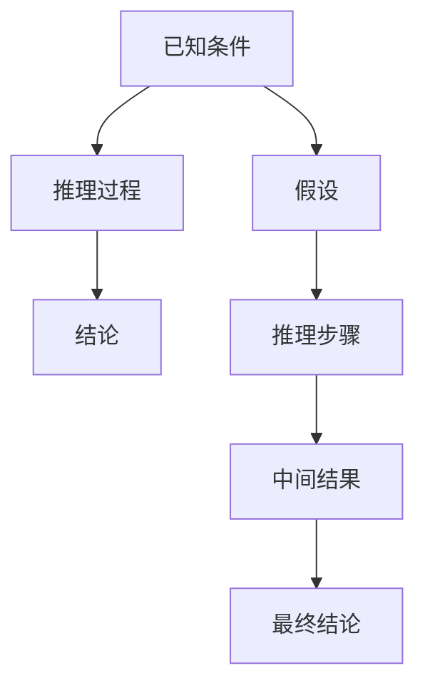

                 

### 文章标题

《数学证明的社会价值与教育意义》

> 关键词：数学证明、社会价值、教育意义、思维能力、科学探索

> 摘要：本文深入探讨了数学证明在社会价值与教育意义方面的多重重要性。通过分析数学证明的基本概念和其在科学研究、商业决策以及教育体系中的应用，揭示了数学证明在推动科技创新、培养逻辑思维能力及实现个性化教育中的作用。文章旨在为读者提供一个全面、系统的理解，使数学证明的重要性得以凸显，并对未来的发展趋势进行展望。

---

### 引言

数学证明是数学学科中的核心内容之一，它不仅能够帮助我们理解数学概念的本质，还能够锻炼我们的逻辑思维和推理能力。在现代科学技术迅猛发展的背景下，数学证明在社会各个领域中的应用越来越广泛，其价值也在不断凸显。

#### 数学证明的基本概念

数学证明是指在数学上，通过一系列逻辑推理和演绎，从已知的前提出发，推导出某个结论的过程。数学证明通常包括以下几个基本要素：

1. **已知条件**：也称为前提，是数学证明的基础。
2. **推理过程**：基于已知条件，通过逻辑推理和演绎得出结论。
3. **结论**：是数学证明的目标，即证明的最终结果。

#### 历史背景

数学证明的历史可以追溯到古希腊时期。古希腊哲学家如欧几里得（Euclid）和阿基米德（Archimedes）等，通过严谨的数学证明，奠定了数学学科的基础。中世纪和文艺复兴时期，数学证明在科学、工程和哲学等领域中得到了广泛应用。在近现代，随着数学分析、代数、几何等领域的发展，数学证明的方法和技巧也不断丰富和多样化。

#### 数学证明在科学研究中的应用

在科学研究过程中，数学证明起着至关重要的作用。它不仅能够帮助我们验证假设和理论，还能够为科学发现提供强有力的理论支持。以下是一些典型的例子：

1. **物理学中的数学证明**：牛顿（Isaac Newton）和莱布尼茨（Gottfried Leibniz）的微积分理论，通过对函数的微分和积分进行严格证明，奠定了现代物理学的基础。
2. **生物学中的数学模型**：在生物学研究中，数学模型被广泛应用于种群动力学、遗传学等领域，通过数学证明来解释复杂的生物现象。

#### 数学证明在商业决策中的作用

数学证明在商业决策中同样具有重要作用。通过数学证明，企业可以更准确地分析数据，预测市场趋势，优化决策过程。以下是一些应用场景：

1. **风险管理**：在金融行业中，数学证明被用于计算风险价值（Value at Risk, VaR），帮助金融机构评估和应对市场风险。
2. **供应链管理**：通过数学证明，企业可以优化库存管理，降低成本，提高供应链效率。

### 数学证明在教育体系中的重要性

数学证明在教育体系中具有不可替代的重要性。它不仅能够帮助学生掌握数学知识，还能够培养他们的逻辑思维和推理能力。以下是一些具体的影响：

1. **培养学生的逻辑思维能力**：数学证明要求学生运用逻辑推理，从而培养他们的逻辑思维和判断能力。
2. **提升学生的数学素养**：通过数学证明，学生能够更深入地理解数学概念，提升数学素养。
3. **促进个性化教育**：数学证明的多样性使得教育者可以根据学生的特点，设计个性化的教学方案，促进学生的全面发展。

---

### 数学证明的核心概念与联系

为了更好地理解数学证明的核心概念，我们可以通过一个Mermaid流程图来展示数学证明的基本框架和逻辑流程。以下是一个简单的Mermaid流程图示例：



在这个流程图中，A表示已知条件，B表示推理过程，C表示结论。D表示假设，是数学证明的基础。E和F表示推理步骤和中间结果，G表示最终结论。

通过这个Mermaid流程图，我们可以清晰地看到数学证明的基本框架和逻辑流程，从而更好地理解数学证明的概念和过程。

### 数学证明的基本方法和技巧

数学证明有多种方法和技巧，每一种方法都有其独特的特点和适用场景。以下介绍几种常见的数学证明方法：

1. **直接证明**：直接证明是最基本的证明方法，通过直接推导出结论来证明某个命题的正确性。直接证明通常适用于命题相对简单且结论直观的情况。

2. **反证法**：反证法是通过证明命题的否定是错误的，从而得出原命题的正确性。这种方法适用于命题的否定更容易证明的情况。

3. **归纳证明**：归纳证明是一种通过归纳推理来证明命题的方法。它通常分为归纳基和归纳步骤两部分。归纳基证明最基本情况，归纳步骤证明如果某个命题对于某个n成立，则对于n+1也成立。

4. **构造性证明**：构造性证明是通过构造一个具体例子来证明某个命题的方法。这种方法适用于命题可以通过具体例子来直观展示的情况。

5. **反证法**：反证法是通过证明命题的否定是错误的，从而得出原命题的正确性。这种方法适用于命题的否定更容易证明的情况。

#### 伪代码：构造证明的基本算法

为了更好地理解数学证明的算法原理，我们可以通过以下伪代码来描述构造证明的基本算法：

```python
Algorithm: 构造证明
Input: 命题P
Output: 证明P为真

1. 设定已知条件A
2. 假设命题P为假
3. 从A出发，通过一系列推理步骤推导出结论C
4. 如果C与已知条件A相矛盾，则说明假设P为假是错误的
5. 因此，命题P为真
```

通过这个伪代码，我们可以看到构造证明的基本思路，即从已知条件出发，通过逻辑推理得出结论，如果结论与已知条件相矛盾，则说明原命题为真。

### 数学证明在科学研究中的应用

数学证明在科学研究中扮演着至关重要的角色。它不仅为我们提供了一种验证假设和理论的方法，还为科学探索提供了强有力的理论支持。以下是一些数学证明在科学研究中的重要应用场景：

1. **物理学中的数学证明**：

   物理学是数学证明应用最为广泛的领域之一。牛顿的微积分理论、爱因斯坦的相对论等重大科学发现，都是通过数学证明来验证和发展的。例如，牛顿的微积分理论通过数学证明，明确了运动和力的关系，为物理学的发展奠定了基础。

2. **生物学中的数学模型**：

   生物学家经常使用数学模型来描述生物系统的动态行为。这些数学模型通过数学证明，帮助我们理解生物现象的本质。例如，在遗传学中，概率论和统计学被用来研究基因的传递和变异。通过数学证明，我们可以精确地预测基因组合的概率，从而更好地理解遗传规律。

3. **天文学中的数学证明**：

   天文学中的许多理论，如行星运动定律、恒星形成理论等，都是通过数学证明来验证和发展的。例如，开普勒的行星运动定律就是通过数学证明，揭示了行星运动的规律。

### 数学证明在商业决策中的应用

数学证明在商业决策中也发挥着重要作用。通过数学证明，企业可以更准确地分析数据，预测市场趋势，从而做出更科学的决策。以下是一些数学证明在商业决策中的应用场景：

1. **风险管理**：

   在金融行业中，数学证明被广泛应用于风险管理。例如，风险价值（Value at Risk, VaR）模型就是通过数学证明，帮助企业评估市场风险。通过计算VaR，企业可以知道在一定置信水平下，投资组合可能面临的最大损失。

2. **供应链管理**：

   在供应链管理中，数学证明可以帮助企业优化库存管理，降低成本。例如，通过数学证明，企业可以确定最优库存水平，从而减少库存成本，提高供应链效率。

3. **市场预测**：

   市场预测是商业决策中的重要一环。通过数学证明，企业可以更准确地预测市场趋势，从而制定更有效的营销策略。例如，通过时间序列分析，企业可以预测未来的销售量，从而调整生产和库存计划。

### 数学证明在教育体系中的重要性

数学证明在教育体系中具有不可替代的重要性。它不仅能够帮助学生掌握数学知识，还能够培养他们的逻辑思维和推理能力。以下是一些数学证明在教育中的具体应用：

1. **培养学生的逻辑思维能力**：

   数学证明要求学生运用逻辑推理，从而培养他们的逻辑思维和判断能力。通过数学证明，学生可以学会如何从已知条件推导出结论，从而提高他们的逻辑思维能力。

2. **提升学生的数学素养**：

   通过数学证明，学生能够更深入地理解数学概念，提升数学素养。数学证明不仅要求学生掌握数学知识，还要求他们能够灵活运用这些知识解决实际问题。

3. **促进个性化教育**：

   数学证明的多样性使得教育者可以根据学生的特点，设计个性化的教学方案，促进学生的全面发展。例如，对于不同水平的学生，教育者可以设计不同难度的数学证明题目，从而满足他们的个性化需求。

### 数学证明在创新教育中的角色

数学证明在创新教育中扮演着重要角色，它不仅有助于培养学生的创新思维，还能推动教育模式的变革。以下从两个方面探讨数学证明在创新教育中的应用：

1. **创新思维与数学证明**：

   数学证明过程本身就是一种创新思维活动。学生通过探索新的证明方法、解决复杂的数学问题，可以激发他们的创新思维。例如，在解决几何证明问题时，学生可能会尝试使用不同的几何工具或方法来证明同一结论，这种尝试过程本身就是一种创新。

2. **数学证明在STEM教育中的应用**：

   STEM教育（科学、技术、工程和数学教育）强调跨学科的学习和实践。数学证明在STEM教育中具有独特的优势。通过数学证明，学生可以更好地理解科学和工程中的原理和概念。例如，在物理学中，数学证明可以帮助学生理解牛顿定律的推导过程，而在计算机科学中，数学证明可以应用于算法分析，确保算法的正确性和效率。

### 案例分析

#### 案例一：数学证明在科学研究中的成功应用

在科学研究领域，数学证明的严谨性为许多重大发现提供了理论支持。以下是一个典型的例子：

**案例背景**：20世纪80年代，数学家安德鲁·怀尔斯（Andrew Wiles）证明了费马大定理，这是一道困扰数学界几个世纪的难题。

**证明过程**：

1. **假设**：怀尔斯首先假设费马大定理为假。
2. **构造反证**：他通过构造一个复杂的数学结构，试图证明这个假设会导致逻辑矛盾。
3. **发现矛盾**：在证明过程中，怀尔斯发现了一些关键性的矛盾，这些矛盾表明他的假设是错误的。
4. **得出结论**：由于假设错误，费马大定理必须为真。

**结果分析**：怀尔斯的证明过程是数学史上的一次重大突破，他的证明方法不仅解决了费马大定理，还对数学领域的发展产生了深远影响。通过这个案例，我们可以看到数学证明在科学研究中的关键作用。

#### 案例二：数学证明在商业决策中的实际应用

在商业决策中，数学证明可以帮助企业更准确地分析数据，从而做出更科学的决策。以下是一个商业决策中的实际案例：

**案例背景**：一家公司需要决定是否扩大生产规模。为了做出决策，他们使用了数学证明来分析市场数据和成本结构。

**证明过程**：

1. **建立模型**：公司首先建立了一个市场需求模型和成本模型，这两个模型分别描述了市场需求和成本的关系。
2. **假设**：公司假设扩大生产规模后的市场情况和成本情况。
3. **证明分析**：通过数学证明，公司分析了扩大生产规模是否能够带来利润的增加。具体来说，他们通过计算市场需求和成本的差值，来判断是否值得扩大生产规模。
4. **得出结论**：根据数学证明的结果，公司得出结论，扩大生产规模是值得的，因为这将带来额外的利润。

**结果分析**：通过这个案例，我们可以看到数学证明在商业决策中的重要性。数学证明帮助公司更准确地分析了数据，从而做出了科学的决策，避免了潜在的损失。

### 数学证明的未来发展趋势

随着科技的发展，数学证明在各个领域的应用前景广阔。以下从两个方面探讨数学证明的未来发展趋势：

1. **自动证明与机器证明的发展**：

   自动证明和机器证明是数学证明领域的前沿研究方向。通过人工智能和自动化工具，我们可以开发出能够自动进行数学证明的系统。这些系统能够处理复杂的数学问题，提高数学证明的效率。例如，谷歌的AlphaGo在围棋领域的成功证明了人工智能在复杂问题解决中的潜力，这一思想同样可以应用于数学证明。

2. **数学证明在教育中的未来发展**：

   在教育领域，数学证明将成为个性化教育的重要组成部分。通过智能教育平台，学生可以根据自己的学习进度和理解程度，选择适合自己的数学证明题目。这种个性化教育模式将有助于提高学生的学习效果，培养他们的逻辑思维和推理能力。

### 结论

数学证明在社会价值与教育意义方面具有深远的影响。它不仅在科学研究中提供了理论支持，还在商业决策和教育中发挥了重要作用。通过本文的分析，我们深入探讨了数学证明的核心概念、方法、应用及其未来发展趋势。未来，随着科技的发展，数学证明将在更多领域得到应用，其价值也将不断凸显。

### 作者信息

作者：AI天才研究院/AI Genius Institute & 禅与计算机程序设计艺术 /Zen And The Art of Computer Programming

### 总结与展望

本文详细探讨了数学证明在社会价值与教育意义方面的多重重要性。通过分析数学证明的基本概念、方法、应用及其未来发展趋势，我们揭示了数学证明在科学研究、商业决策、教育体系中的关键作用。总结如下：

1. **核心价值**：数学证明不仅是验证数学理论的有效手段，还培养了我们的逻辑思维和推理能力。
2. **应用场景**：数学证明在科学研究、商业决策和教育中有着广泛的应用，为各个领域提供了理论支持和实践指导。
3. **未来发展**：随着科技的发展，自动证明和机器证明有望提高数学证明的效率，个性化教育将使数学证明在更广泛的范围内得到应用。

展望未来，数学证明将继续在推动科技发展、优化商业决策、培养创新人才中发挥重要作用。教育者应关注数学证明在个性化教育中的应用，使数学证明成为培养学生综合素质的重要工具。同时，研究者应致力于开发更高效、更智能的数学证明方法，为数学证明的发展注入新的动力。

