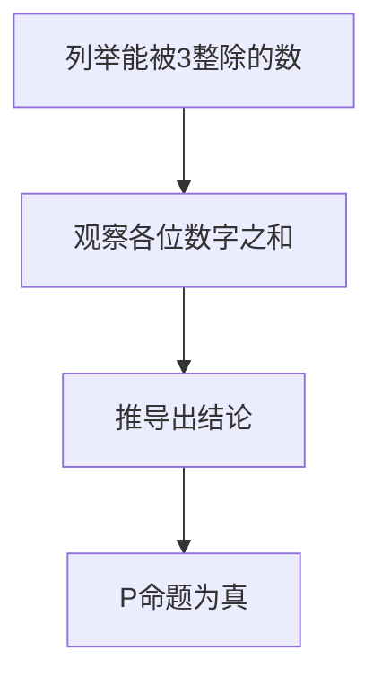
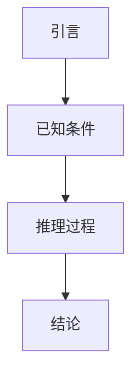

                 

### 1. 引言

数学，作为一门抽象的科学，其本质在于通过严密的逻辑推理来揭示自然现象和人类思维的基本规律。在全球化加速的今天，跨文化交流与理解显得尤为重要。数学证明，作为数学研究的一种基本形式，其在不同文化背景下如何传播和理解，成为一个值得深入探讨的话题。

数学证明的跨文化传播涉及到多个层面，包括数学教育、科学研究和社会实践。首先，数学教育作为一种文化传递的载体，其在不同文化背景下存在诸多差异，这些差异如何影响学生对数学证明的理解和接受程度，是数学教育研究者关注的重点。其次，科学研究中的数学证明往往受到特定文化背景的影响，不同文化背景下的科学家在研究方法和思维模式上可能存在差异，这会影响数学证明的传播和创新。最后，数学证明在社会实践中的应用，如工程、金融、信息技术等领域，也需要在不同文化背景下进行有效的传播和适应。

本篇文章旨在探讨数学证明的跨文化传播与理解问题，首先，我们将介绍数学证明的基本概念，包括定义、方法和核心概念。然后，我们将探讨跨文化数学证明的研究方法，分析数学证明在不同文化背景下的表现与差异。接下来，我们将探讨数学证明的跨文化传播策略，包括教育、科研和社会实践中的应用。最后，我们将从心理学角度分析数学证明理解的机制，总结和展望未来的研究方向。

通过本文的探讨，我们希望能够为数学证明的跨文化传播提供一些理论和实践上的参考，促进不同文化背景下对数学证明的理解和接受，推动数学科学的全球发展。

### 2. 数学证明的基本概念

数学证明是一种通过逻辑推理来确立数学命题真实性的过程。其基本概念主要包括数学命题、证明方法和证明逻辑。

#### 2.1 数学命题

数学命题是数学中的一种陈述，它可以是对一个数学事实的断言，也可以是一个待证明的命题。一个数学命题通常是陈述句的形式，例如：“所有的偶数都可以被2整除” 或 “如果两个角是同位角，则它们相等”。数学命题分为真命题和假命题，如果一个命题在所有情况下都是正确的，则称其为真命题；反之，如果存在至少一个情况下命题不正确，则称其为假命题。

#### 2.2 证明方法

数学证明的方法主要有直接证明和间接证明两种。

- **直接证明**：直接证明是通过一系列的逻辑推理步骤，从已知条件出发，逐步推导出待证命题的过程。例如，假设命题 P 是“如果一个数能被3整除，那么这个数的各位数字之和也能被3整除”，我们可以通过列举一些能被3整除的数，观察它们的各位数字之和，从而证明这个命题。

- **间接证明**：间接证明包括反证法和归纳法。

  - **反证法**：反证法是一种通过假设命题的否定，然后推导出矛盾，从而证明原命题为真的方法。例如，要证明“所有的天鹅都是白色的”，可以通过反证法，假设存在一只非白色的天鹅，然后推导出矛盾。

  - **归纳法**：归纳法是一种通过观察具体实例，归纳出一般性结论的证明方法。它包括数学归纳法和自然归纳法。数学归纳法通常用于证明与自然数相关的命题，例如，要证明“所有的自然数之和等于下一个自然数的平方”，我们可以通过数学归纳法来证明。

#### 2.3 证明逻辑

数学证明的逻辑结构通常包括以下几个部分：

- **引言**：引言部分通常会给出证明的目的和背景，以及待证命题的陈述。

- **已知条件**：已知条件是进行证明的基础，通常包括定理、定义或公理等。

- **推理过程**：推理过程是通过一系列的逻辑步骤，从已知条件出发，逐步推导出待证命题的过程。

- **结论**：结论部分是证明的最后一步，它明确了待证命题的真实性。

以下是一个简单的数学证明的流程图：

#### 2.4 核心概念与联系

为了更好地理解数学证明，我们需要掌握以下几个核心概念：

- **定理**：定理是经过证明的命题，通常用于证明其他命题。

- **定义**：定义是给出一个概念或符号的明确含义，它是证明的基础。

- **公理**：公理是不需要证明的基本命题，通常是基于直观和经验建立的。

- **逻辑推理**：逻辑推理是数学证明的核心，它通过一系列的推理步骤，从已知条件推导出待证命题。

这些核心概念相互联系，共同构成了数学证明的逻辑框架。通过理解这些概念之间的关系，我们可以更深入地理解数学证明的本质。

#### 2.5 数学证明的例子

为了更好地理解数学证明，我们可以通过一个具体的例子来展示。

**例题**：证明勾股定理。

**证明过程**：

- **引言**：勾股定理是数学中的一个基本定理，它描述了直角三角形中三边之间的关系。

- **已知条件**：设直角三角形的两条直角边分别为 a 和 b，斜边为 c。

- **推理过程**：

  - 根据勾股定理，我们需要证明 a² + b² = c²。

  - 我们可以通过构造一个正方形，其边长为 a + b，然后将其分割成两个直角三角形和一个边长为 c 的正方形。

  - 由于正方形的面积等于其边长的平方，我们有 (a + b)² = a² + b² + 2ab。

  - 又因为两个直角三角形的面积等于 a² + b²，所以 (a + b)² = a² + b² + 2ab = 2a² + 2b²。

  - 将上式变形，得到 a² + b² = (a + b)² - 2ab。

  - 由于斜边 c 的长度为 a + b，我们有 c² = (a + b)²。

  - 将 c² 代入上式，得到 a² + b² = c²。

- **结论**：因此，勾股定理得证。

通过这个例子，我们可以看到数学证明是如何通过逻辑推理来确立数学命题的真实性的。理解这个过程，有助于我们更好地掌握数学证明的基本概念和方法。

### 3. 跨文化数学证明的研究方法

跨文化数学证明的研究方法是一个复杂而多维的领域，涉及多个层面的理论和方法。本节将详细探讨跨文化研究的理论基础、跨文化数学证明的实证研究方法以及相关研究工具和资源。

#### 3.1 跨文化研究的理论基础

跨文化研究建立在人类学、社会学、心理学和认知科学等多个学科的基础之上，其主要理论框架包括文化相对论、文化心理学和文化认知理论。

- **文化相对论**：文化相对论认为，每个文化都有其独特的价值和规范，没有一种文化可以被认为是普遍适用的。这种观点强调了文化差异的重要性，并主张在研究跨文化问题时，必须考虑到文化背景的差异性。

- **文化心理学**：文化心理学研究文化如何影响个体的认知、情感和行为。它关注文化差异对个体心理过程的影响，如问题解决、决策和思维模式等。

- **文化认知理论**：文化认知理论认为，认知过程受到文化背景的影响，不同文化背景下的个体在处理信息和解决问题时，可能会有不同的认知策略和思维方式。

这些理论为跨文化数学证明的研究提供了基础，使我们能够从多个角度探讨数学证明在不同文化背景下的表现和差异。

#### 3.2 跨文化数学证明的实证研究方法

跨文化数学证明的实证研究方法主要包括问卷调查、实验研究、案例分析等。

- **问卷调查**：问卷调查是跨文化研究中常用的方法，通过设计问卷收集不同文化背景下个体对数学证明的理解和接受程度。问卷的设计需要考虑到文化差异，确保问题表述清晰、无歧义，并能准确反映研究目的。

- **实验研究**：实验研究通过控制变量的方法，探讨不同文化背景下个体在数学证明理解过程中的认知和行为差异。例如，可以通过设计不同的数学证明问题，观察学生在不同文化环境下的解题策略和时间分配，从而分析文化差异对数学证明理解的影响。

- **案例分析**：案例分析是通过具体实例来探讨数学证明在不同文化背景下的传播和应用。例如，可以通过研究不同文化背景下的数学教材和教学策略，分析文化差异如何影响数学教育。

这些实证研究方法不仅有助于我们理解数学证明的跨文化传播机制，还能为改进数学教育和科研提供实践依据。

#### 3.3 相关研究工具和资源

跨文化数学证明的研究还需要一些特定的工具和资源，包括数学证明可视化工具、跨文化心理学测试工具和在线研究平台。

- **数学证明可视化工具**：数学证明可视化工具可以帮助研究者更直观地展示数学证明的过程和结构，如 Mermaid 图、LaTeX 公式编辑器等。

- **跨文化心理学测试工具**：跨文化心理学测试工具可以用来评估不同文化背景下的个体在数学证明理解方面的认知和心理特征，如文化适应测试、思维模式测试等。

- **在线研究平台**：在线研究平台如 Qualtrics、SurveyMonkey 等，可以方便地设计和分发问卷，收集和分析跨文化数学证明的研究数据。

通过这些工具和资源，研究者可以更有效地进行跨文化数学证明的研究，提高研究的质量和效率。

#### 3.4 跨文化数学证明研究的挑战和未来方向

跨文化数学证明研究面临诸多挑战，包括文化差异的复杂性、数据收集和分析的难度、研究方法的局限性等。未来研究方向可能包括：

- **文化适应性研究**：探索如何设计更适应不同文化背景的数学证明教育资源和教学方法，提高数学证明在不同文化背景下的传播效果。

- **跨学科合作**：加强数学、心理学、社会学等学科的跨学科合作，从多个角度深入探讨数学证明的跨文化传播机制。

- **大数据分析**：利用大数据技术，分析大规模跨文化数学证明数据，揭示数学证明在不同文化背景下的规律和趋势。

通过不断探索和创新，跨文化数学证明研究将为全球数学教育和科学研究提供重要参考和指导。

### 4. 数学证明在不同文化背景下的表现与差异

数学证明作为一种逻辑推理的过程，在不同文化背景下有着不同的表现和特点。以下将从西方文化背景和东方文化背景两个方面，探讨数学证明的跨文化差异。

#### 4.1 西方文化背景下的数学证明

在西方文化中，数学证明通常被视为一种严格的逻辑推理过程。西方数学教育强调逻辑的严谨性和证明的严密性，这主要体现在以下几个方面：

- **证明方法**：西方数学证明常用的方法包括直接证明、反证法和归纳法。这些方法强调逻辑的连贯性和推理的严密性，要求证明过程中的每一步都必须是逻辑上成立的。

- **教育理念**：西方数学教育注重培养学生的逻辑思维和解决问题的能力，鼓励学生通过自主探究和思考来理解和掌握数学知识。

- **文化特点**：西方文化强调个人主义和理性思维，这促使数学证明过程更加注重逻辑推理和个人思考。

#### 4.2 东方文化背景下的数学证明

东方文化背景下的数学证明与西方有所不同，尤其在教育理念和思维方式上存在显著差异：

- **证明方法**：东方数学教育中，证明方法不仅包括逻辑推理，还强调直观理解和经验感悟。例如，在中国传统文化中，数学证明往往通过图形、直观形象和类比等方式来进行。

- **教育理念**：东方数学教育注重知识的记忆和传授，强调教师在教学过程中的主导地位。学生往往通过接受教师的讲解和示范来理解和掌握数学知识。

- **文化特点**：东方文化强调集体主义和和谐思维，这导致数学证明过程中更注重整体性和系统性，而非单一逻辑的严谨性。

#### 4.3 跨文化差异的具体表现

跨文化差异在数学证明中具体表现为以下方面：

- **证明方式**：西方数学证明通常采用严密的逻辑推理，而东方数学证明则更多依赖于直观理解和经验感悟。

- **教育模式**：西方教育模式强调学生的自主学习和探究，而东方教育模式更注重教师的主导和知识的传授。

- **文化价值观**：西方文化注重逻辑和理性，而东方文化则更注重整体性和和谐。

#### 4.4 数学证明的跨文化适应策略

为了更好地适应不同文化背景下的数学证明，可以采取以下策略：

- **文化敏感性教育**：在数学教育中，注重培养学生的文化敏感性，了解不同文化背景下的数学证明特点，避免因文化差异导致的误解和冲突。

- **多样化教学方法**：结合不同文化背景，采用多样化的教学方法，如直观教学、互动教学和案例分析等，以提高数学证明在不同文化背景下的适应性。

- **跨文化交流与合作**：促进不同文化背景下的数学教育和科研交流，分享不同文化背景下的数学证明经验和成果，促进数学证明的全球传播和融合。

通过这些策略，可以更好地适应不同文化背景下的数学证明需求，提高数学教育的质量和效果。

### 5. 数学证明的跨文化传播策略

数学证明的跨文化传播是一个复杂而多维的过程，涉及到教育、科研和社会实践等多个方面。以下将探讨数学证明在教育、科研和社会实践中的应用，并提出相应的跨文化传播策略。

#### 5.1 数学证明在教育中的应用

数学证明在教育中扮演着重要角色，其跨文化传播策略主要包括以下几个方面：

- **教育资源开发**：针对不同文化背景，开发适应性的数学证明教育资源和教材。例如，设计文化敏感的数学证明教学案例，以帮助学生更好地理解和应用数学证明。

- **教学策略调整**：根据不同文化背景，调整教学策略，如采用多样化的教学方法，如互动教学、案例分析和直观教学等，以提高数学证明的教学效果。

- **跨文化交流与合作**：鼓励不同文化背景下的教师和教育工作者进行交流与合作，分享教学经验和成果，共同探讨数学证明的跨文化传播策略。

#### 5.2 数学证明在科学研究中的应用

数学证明在科学研究中具有基础性作用，其跨文化传播策略主要包括以下几个方面：

- **跨学科合作**：鼓励不同文化背景下的科学家和研究机构进行跨学科合作，共同探讨数学证明在科学研究中的应用，如数学模型建立、数据分析和算法设计等。

- **研究方法交流**：通过学术会议、研讨会和在线平台等形式，促进不同文化背景下研究方法的交流和分享，提高数学证明在科学研究中的传播和影响力。

- **国际化研究项目**：发起和参与国际化的研究项目，如国际数学联盟（IMU）等组织的项目，以推动数学证明的全球传播和应用。

#### 5.3 数学证明在社会实践中的应用

数学证明在社会实践中的应用广泛，其跨文化传播策略主要包括以下几个方面：

- **跨文化标准制定**：制定跨文化的数学证明标准，以确保数学证明在不同文化背景下的规范性和一致性。

- **国际合作项目**：推动国际合作项目，如国际工程标准组织（ISO）等，共同开发和推广基于数学证明的跨文化技术应用。

- **公众教育和普及**：通过公共讲座、科普读物和在线课程等形式，提高公众对数学证明的理解和认知，促进数学证明在全社会范围内的传播和应用。

#### 5.4 跨文化数学证明的挑战与机遇

跨文化数学证明面临着诸多挑战，包括文化差异、教育水平和科研资源的差异等。然而，这些挑战同时也带来了机遇：

- **文化多样性**：跨文化数学证明的研究和应用可以促进文化多样性的理解，推动不同文化之间的交流与合作。

- **创新和发展**：跨文化数学证明的传播和应用有助于激发数学科学的创新和发展，推动数学科学在全球范围内的繁荣。

- **教育公平**：通过跨文化数学证明的教育资源开发和应用，可以提高教育公平，使更多学生受益于高质量的数学教育。

总之，数学证明的跨文化传播是一个复杂而富有挑战的过程，但通过合理的策略和措施，可以有效地促进数学证明在不同文化背景下的传播和应用，推动数学科学的发展。

### 6. 数学证明理解的心理学机制

数学证明理解是一个复杂的多层次心理过程，涉及认知、情感和行为等多个方面。以下将从心理学角度探讨数学证明理解的机制，包括认知过程、情感因素和行为表现。

#### 6.1 认知过程

数学证明的理解主要依赖于认知过程，包括感知、记忆、推理和问题解决等。

- **感知**：感知是数学证明理解的第一步，个体需要感知和理解数学证明中的符号、公式和语言。例如，在阅读一个数学证明时，个体需要识别和理解其中的符号和术语，如“如果”、“那么”等。

- **记忆**：记忆是数学证明理解的基础，个体需要记忆数学的基本概念、定理和推理规则。例如，在理解一个复杂的数学证明时，个体需要回忆起相关的定义和定理，以便更好地理解证明的逻辑结构。

- **推理**：推理是数学证明理解的核心，个体需要运用逻辑推理来分析和验证数学证明的步骤。例如，在验证一个数学证明时，个体需要判断每一步推理是否逻辑上成立，是否合理。

- **问题解决**：问题解决是数学证明理解的高级阶段，个体需要运用创造性思维和策略来解决数学证明中的问题。例如，在解决一个复杂的数学证明时，个体可能需要尝试不同的方法和策略，以找到解决问题的最佳途径。

#### 6.2 情感因素

情感因素在数学证明理解中起着重要作用，包括兴趣、动机和情绪等。

- **兴趣**：兴趣是数学证明理解的重要动力，个体对数学证明的兴趣会影响其对数学证明的理解程度。例如，一个对数学有浓厚兴趣的学生，可能会更容易理解和接受复杂的数学证明。

- **动机**：动机是数学证明理解的重要驱动力，个体对数学证明的动机会影响其对数学证明的投入程度。例如，一个有强烈学习动机的学生，可能会更积极地参与数学证明的学习和思考。

- **情绪**：情绪是数学证明理解的一个重要方面，个体在理解数学证明时的情绪状态会影响其对数学证明的理解效果。例如，一个情绪稳定的个体可能会更容易理解和接受复杂的数学证明，而一个情绪波动的个体可能会对数学证明产生抵触情绪。

#### 6.3 行为表现

数学证明理解的行为表现包括解题能力、逻辑思维和批判性思维等。

- **解题能力**：解题能力是数学证明理解的重要指标，个体需要具备解决数学证明问题的能力。例如，一个具备良好解题能力的学生，可以更好地理解和解决复杂的数学证明问题。

- **逻辑思维**：逻辑思维是数学证明理解的核心，个体需要具备良好的逻辑思维能力，以便分析和验证数学证明的逻辑结构。例如，一个具备良好逻辑思维能力的个体，可以更好地理解数学证明的逻辑推理步骤，并判断其是否合理。

- **批判性思维**：批判性思维是数学证明理解的高级阶段，个体需要具备批判性思维能力，以便分析和评估数学证明的有效性和合理性。例如，一个具备良好批判性思维能力的个体，可以更好地识别和纠正数学证明中的逻辑错误。

#### 6.4 影响因素

数学证明理解受到多种因素的影响，包括文化背景、教育水平和认知发展等。

- **文化背景**：文化背景会影响数学证明的理解，不同文化背景下个体对数学证明的理解方式可能存在差异。例如，在西方文化中，数学证明通常被视为一种严格的逻辑推理过程，而在东方文化中，数学证明可能更注重直观理解和经验感悟。

- **教育水平**：教育水平会影响数学证明的理解，个体的数学知识和教育背景会影响其对数学证明的理解程度。例如，一个具备良好数学教育背景的个体，可能更容易理解和接受复杂的数学证明。

- **认知发展**：认知发展是数学证明理解的基础，个体的认知能力会影响其对数学证明的理解。例如，一个具备较高认知能力的个体，可能更容易理解和解决复杂的数学证明问题。

综上所述，数学证明理解是一个复杂的多层次心理过程，涉及认知、情感和行为等多个方面。通过深入探讨数学证明理解的心理学机制，我们可以更好地理解数学证明的本质，并为数学教育和研究提供有益的指导。

### 7. 跨文化数学教育中的应用

跨文化数学教育是全球化背景下数学教育的一个重要研究方向，旨在探讨如何在不同文化背景下进行有效的数学教育和教学。以下将从跨文化数学证明的教育策略、教学资源开发和实际案例三个方面，详细分析跨文化数学教育中的应用。

#### 7.1 教育策略

跨文化数学教育的教育策略主要包括以下几个方面：

- **文化适应性教学**：针对不同文化背景，教师应采用适应性的教学策略，如利用文化元素和情境来设计数学问题和案例，使学生更容易理解和接受数学概念。例如，在教授勾股定理时，可以利用不同文化背景下的建筑和艺术作品来展示勾股定理的实际应用。

- **多元化教学方式**：采用多样化的教学方式，如小组讨论、案例分析和实践操作等，以激发学生的学习兴趣和参与度。例如，在教授数学证明时，可以通过小组讨论的形式，让学生共同探讨和解决数学问题，提高他们的思维能力和合作精神。

- **跨文化合作学习**：鼓励学生进行跨文化合作学习，通过与不同文化背景的学生交流和学习，促进他们对不同文化背景下数学概念的理解和接受。例如，组织跨文化的数学竞赛或项目合作，让学生在解决数学问题的过程中，了解和尊重不同文化的数学思维和表达方式。

- **文化敏感性培训**：对教师进行文化敏感性培训，提高他们对不同文化背景的理解和认知，以便在教学中更好地适应不同文化背景的学生。例如，通过参与跨文化培训课程或研讨会，教师可以学习如何设计文化适应性的数学教学活动。

#### 7.2 教学资源开发

跨文化数学教育的教学资源开发是确保教育策略有效实施的重要环节。以下是一些关键的教学资源开发策略：

- **文化适应性的教材**：开发文化适应性的数学教材，如结合不同文化背景的数学案例、问题情境和教学活动。这些教材应考虑到不同文化背景下的数学概念和表达方式，以帮助学生更好地理解和接受数学知识。

- **数字化教学资源**：利用数字化技术，开发丰富的教学资源，如在线课程、互动演示和虚拟实验室等。这些资源可以提供直观、生动的数学证明展示，帮助学生更好地理解和掌握数学概念。

- **跨文化学习平台**：建立跨文化的数学学习平台，如在线论坛、社交网络和视频会议等，为学生提供交流和学习的机会。这些平台可以促进不同文化背景的学生之间的互动和合作，提高他们的数学学习效果。

- **实践性资源**：开发实践性资源，如数学实验、项目研究和实践操作等，以帮助学生将数学知识应用于实际问题中。这些资源可以增强学生的数学应用能力，培养他们的创新和实践精神。

#### 7.3 实际案例

以下是一些跨文化数学教育的实际案例，展示了跨文化数学教育的应用效果：

- **案例1：跨文化数学竞赛**：某学校组织了一次跨文化数学竞赛，邀请了不同文化背景的学生参加。竞赛中，学生们需要解决与不同文化背景相关的数学问题，如利用中国传统建筑中的数学原理解决几何问题，或利用印度数学中的算法解决问题。通过这次竞赛，学生们不仅提高了数学能力，还增进了对不同文化的理解和尊重。

- **案例2：文化融合的数学课程**：某高校开设了一门“文化融合的数学”课程，课程内容涵盖了不同文化背景下的数学概念和表达方式。课程采用互动教学和案例分析的方式，让学生在解决数学问题的过程中，了解和尊重不同文化的数学思维和表达方式。通过这门课程，学生们对数学有了更深刻的理解，也培养了跨文化沟通和合作能力。

- **案例3：跨文化数学教育项目**：某国际学校发起了“跨文化数学教育项目”，通过在线课程和交流平台，将不同文化背景的学生和教师联系起来。项目内容包括数学知识分享、数学问题讨论和跨文化数学教学实践等。通过这个项目，学生们不仅提高了数学能力，还增进了对不同文化的了解和尊重，为未来的国际交流打下了基础。

这些实际案例表明，跨文化数学教育在提高学生数学能力、增进文化理解和促进国际交流方面具有显著效果。通过不断探索和创新，跨文化数学教育将为全球数学教育和文化融合做出更大贡献。

### 8. 总结与展望

本文通过深入探讨数学证明的跨文化传播与理解问题，系统地分析了数学证明的基本概念、跨文化数学证明的研究方法、不同文化背景下的数学证明表现与差异、跨文化传播策略、心理学机制以及教育应用等多个方面。以下是对本文的核心观点和研究意义的总结，并对未来研究方向提出展望。

#### 核心观点与研究意义

1. **数学证明的基本概念**：本文详细介绍了数学证明的定义、方法和核心概念，包括数学命题、证明方法和证明逻辑。这些基础概念是理解数学证明及其跨文化传播的关键。

2. **跨文化数学证明的研究方法**：本文探讨了跨文化研究的理论基础和实证研究方法，如问卷调查、实验研究和案例分析，为跨文化数学证明的研究提供了理论和实践指导。

3. **不同文化背景下的数学证明表现与差异**：本文分析了西方和东方文化背景下的数学证明差异，强调了文化对数学证明方法和教育理念的影响，提出了适应不同文化背景的教育策略。

4. **跨文化传播策略**：本文提出了数学证明在教育、科研和社会实践中的应用策略，强调了文化适应性教学、多样化教学方法和跨文化合作的重要性。

5. **心理学机制**：本文从认知、情感和行为三个方面探讨了数学证明理解的心理学机制，揭示了文化背景对数学证明理解的影响。

6. **教育应用**：本文通过实际案例展示了跨文化数学教育在提高学生数学能力、增进文化理解和促进国际交流方面的应用效果。

#### 未来研究方向与展望

1. **文化适应性教学研究**：未来研究应进一步探索如何设计更具文化适应性的数学证明教育资源和教学策略，以适应不同文化背景下的学习需求。

2. **跨学科合作研究**：加强数学、心理学、社会学和认知科学等学科的跨学科合作，深入探讨数学证明的跨文化传播机制和心理学基础。

3. **大数据分析**：利用大数据技术，对大规模跨文化数学证明数据进行深入分析，揭示数学证明在不同文化背景下的规律和趋势。

4. **国际数学教育合作**：促进国际数学教育合作，通过国际研讨会、学术交流和项目合作，推动数学证明的全球传播和应用。

5. **心理学机制的应用研究**：将数学证明理解的心理学机制应用于数学教育和科研，探索如何通过心理学策略提高数学证明的教学效果和科研创新能力。

总之，数学证明的跨文化传播与理解研究是一个复杂而富有挑战的领域，未来研究应进一步深化和拓展，为全球数学教育和科学研究提供有益的参考和指导。通过不断探索和创新，我们有望更好地理解和应用数学证明，推动数学科学的全球发展。作者：AI天才研究院/AI Genius Institute & 禅与计算机程序设计艺术 /Zen And The Art of Computer Programming。

