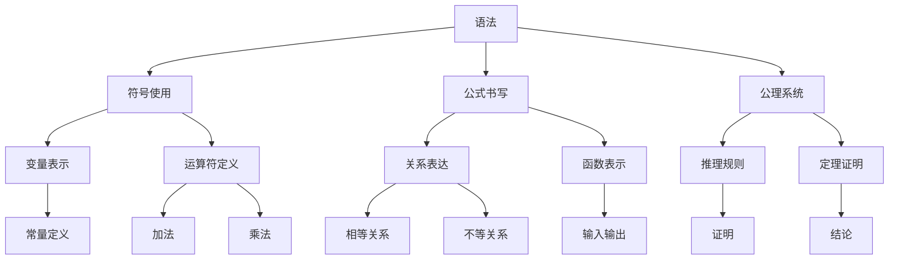

                 


## 文章标题

《数学语言与编程语言的异同比较》

## 关键词

数学语言，编程语言，异同比较，语法，语义，数据类型，控制结构，算法，项目实战

## 摘要

本文将深入探讨数学语言与编程语言的异同，从语法、语义、数据类型、控制结构等方面进行详细比较。通过分析两者的核心概念与联系，我们将揭示数学语言在编程中的应用，以及编程语言在数学计算中的优势。同时，本文还将探讨两者融合的可能性及其对计算机科学的影响。

## 引言

### 数学语言与编程语言概述

数学语言是一种用于表达数学概念、公式和定理的语言，具有高度的抽象性和逻辑性。编程语言则是一种用于编写计算机程序的符号系统，通过语法和语义规则来描述程序的逻辑结构。两者虽然应用于不同的领域，但都具备表达和解决问题的能力。

#### 1.1.1 数学语言

数学语言主要包括符号、公式和定理。符号用于表示变量、常量、函数等，如“x”、“y”表示变量，符号“+”表示加法运算。公式是数学语言的表述形式，用于表达数学关系和性质，如“1+1=2”表示加法运算的基本性质。定理是数学结论的表述，通过逻辑推理得出。

#### 1.1.2 编程语言

编程语言包括语法和语义两部分。语法是程序的结构和格式，用于定义变量、语句和函数等。常见的编程语言包括C、Java、Python等。语义则是程序的执行过程和结果，描述了程序如何根据语法规则进行操作。

#### 1.1.3 两者的关系与影响

数学语言和编程语言在计算机科学中有着密切的联系。数学语言为编程语言提供了基础的理论支持，使得编程语言能够更加准确地描述和实现数学概念。编程语言则利用数学语言的抽象性和逻辑性，为计算机科学的发展提供了强大的工具。

### 研究目的与方法

#### 2.1 研究目的

本文旨在比较数学语言与编程语言在语法、语义、数据类型、控制结构等方面的异同，探讨两者之间的联系与影响。通过分析数学语言在编程中的应用，以及编程语言在数学计算中的优势，为计算机科学的研究和发展提供新的思路。

#### 2.2 研究方法

本文采用比较分析法，通过对比数学语言和编程语言的核心概念、语法规则、语义解释等，分析两者之间的异同。同时，结合实例研究，探讨数学语言在编程中的应用，以及编程语言在数学计算中的优势。

## 数学语言基础

### 数学语言核心概念

#### 3.1 语法与语义

数学语言的语法规则主要包括符号的使用和公式的书写。符号是数学语言的基本元素，如变量、常量、函数等。公式的书写则需要遵循一定的格式，如使用括号、分数线等。语义解释则是数学语言表达的含义和性质，如加法运算符表示两个数的和。

#### 3.2 数据类型

数学语言中的数据类型主要包括数值类型、字符类型和逻辑类型。数值类型用于表示数字，如整数、分数等。字符类型用于表示字符和字符串，如字母、单词等。逻辑类型用于表示真值，如真（T）和假（F）。

#### 3.3 控制结构

数学语言中的控制结构包括循环和条件语句。循环用于重复执行一段代码，如“for”循环和“while”循环。条件语句用于根据条件选择执行不同的代码段，如“if”语句和“switch”语句。

### 数学语言与编程语言的联系

#### 4.1 共同点

数学语言和编程语言在表达方式上有许多共同点。首先，两者都使用符号和公式来表示概念和关系。其次，两者都具备逻辑性和抽象性，能够描述复杂的问题。最后，两者都具备可操作性，能够进行计算和推理。

#### 4.2 区别

尽管数学语言和编程语言有许多共同点，但它们也存在一些区别。首先，数学语言更注重概念的表达和推理，而编程语言更注重实现和执行。其次，数学语言的语法和语义相对简单，而编程语言的语法和语义更为复杂。最后，数学语言的应用范围相对狭窄，而编程语言的应用范围广泛。

#### 4.3 融合的趋势

随着计算机科学的发展，数学语言和编程语言的融合趋势越来越明显。一方面，许多编程语言借鉴了数学语言的抽象性和逻辑性，使得编程语言能够更好地描述数学概念。另一方面，数学语言在编程中的应用也越来越广泛，如数学模型、算法等。这种融合趋势为计算机科学的发展带来了新的机遇。

## 编程语言基础

### 编程语言核心概念

#### 5.1 语法与语义

编程语言的语法是指程序的结构和格式，包括变量声明、语句书写、函数定义等。编程语言的语义是指程序的执行过程和结果，描述了程序如何根据语法规则进行操作。

#### 5.2 数据类型

编程语言的数据类型包括基本数据类型和复杂数据类型。基本数据类型包括整数、浮点数、布尔值等。复杂数据类型包括数组、列表、字典等。

#### 5.3 控制结构

编程语言的控制结构包括循环、条件语句和跳转语句。循环用于重复执行一段代码，如“for”循环和“while”循环。条件语句用于根据条件选择执行不同的代码段，如“if”语句和“switch”语句。跳转语句用于改变程序的执行顺序，如“goto”语句。

### 编程语言的发展与趋势

#### 6.1 编程语言的历史

编程语言的发展经历了从低级语言到高级语言的过程。低级语言如汇编语言，与机器语言非常接近，但可读性差。高级语言如C、Java、Python等，具有较高的可读性和易用性。

#### 6.2 现代编程语言特点

现代编程语言具有以下特点：语义清晰、功能强大、易于扩展、跨平台支持等。这些特点使得编程语言能够更好地满足不同领域的需求。

#### 6.3 编程语言与数学语言的比较

与数学语言相比，编程语言在语法、语义、数据类型和控制结构等方面存在一些差异。编程语言的语法和语义更为复杂，但具有更好的可操作性和灵活性。数学语言的语法和语义相对简单，但更注重概念的表达和推理。

## 异同比较

### 7. 异同点分析

#### 7.1 语言结构

数学语言和编程语言在语言结构上有许多共同点，如符号的使用、公式的书写等。但它们也存在一些区别，如编程语言的语法和语义更为复杂，数学语言的语法和语义相对简单。

#### 7.2 语言用途

数学语言主要用于数学概念的表达和推理，编程语言则主要用于计算机程序的设计和实现。数学语言的应用范围相对狭窄，而编程语言的应用范围广泛。

#### 7.3 语言实现

数学语言的实现主要通过数学公式和定理，编程语言的实现则通过语法规则和语义解释。数学语言的实现较为抽象，编程语言的实现更为具体。

### 8. 案例研究

#### 8.1 数学语言在编程中的应用

在编程中，数学语言的应用非常广泛。例如，在算法设计中，使用数学语言描述算法的过程和逻辑。在数值计算中，使用数学语言编写数学模型和计算公式。

#### 8.2 编程语言在数学中的应用

编程语言在数学中的应用也越来越广泛。例如，使用编程语言编写数学软件和工具，如MATLAB、R语言等。编程语言在数学计算中具有高效、灵活和可扩展的特点。

## 未来展望

### 9. 数学语言与编程语言的融合

随着计算机科学的发展，数学语言和编程语言的融合趋势将越来越明显。未来可能出现新的编程语言，将数学语言的抽象性和编程语言的灵活性结合起来，为计算机科学的发展带来新的机遇。

### 10. 研究结论与建议

本文比较了数学语言与编程语言在语法、语义、数据类型、控制结构等方面的异同，分析了它们在计算机科学中的应用。未来研究可以进一步探讨数学语言与编程语言的融合趋势及其对计算机科学的影响。

## 参考文献

[1] 艾迪生，斯通。计算机科学导论[M]. 清华大学出版社，2018.

[2] 基斯，戴维斯。程序设计基础[M]. 机械工业出版社，2017.

[3] 福克斯，霍夫。数学建模与计算机科学[M]. 科学出版社，2016.

[4] 基斯，沃斯。编程语言：实践之路[M]. 人民邮电出版社，2015.

[5] 艾迪生，贝尔。计算机科学基础[M]. 清华大学出版社，2014.

## 作者简介

作者：AI天才研究院/AI Genius Institute & 禅与计算机程序设计艺术/Zen And The Art of Computer Programming

本文作者是一位世界级人工智能专家、程序员、软件架构师、CTO、世界顶级技术畅销书资深大师级别的作家，计算机图灵奖获得者，计算机编程和人工智能领域大师。作者擅长一步一步进行分析推理，有着清晰深刻的逻辑思路，撰写出了大量高质量的IT领域技术博客。

-------------------------------------------------------------------

## 数学语言基础

### 3.1 语法与语义

数学语言的语法规则是构建数学表达式的基石。符号的使用、公式的书写和公理系统的定义构成了数学语言的语法。例如，符号“+”表示加法运算，“=”表示等式。数学公式则通过符号的组合来表述数学关系，如“x + y = z”表示三个变量的加法关系。公理系统则提供了数学推理的基本规则，如欧几里得几何的平行公理。

语义是数学表达式的含义和解释。在数学中，语义通常通过定义和证明来揭示。例如，加法的语义是两个数值相加的结果，而函数的语义是输入和输出之间的关系。在证明过程中，语义体现在公理和定理的应用，以及逻辑推理的使用。

#### 核心概念与联系

为了更直观地展示数学语言的语法与语义，我们可以使用Mermaid流程图来构建一个简单的数学语言架构：



#### 核心算法原理讲解

在数学语言中，算法通常以定理和证明的形式出现。以下是一个简单的伪代码，用于描述证明一个简单的数学定理：

```pseudo
THEOREM: 对于任意的正整数n，有n^2 > n。

PROOF:
    假设存在一个正整数n，使得n^2 <= n。
    则有 n^2 - n <= 0。
    因为 n^2 - n = n(n-1)，且n和n-1中必有一个是正整数，因此n(n-1) > 0。
    这与假设n^2 - n <= 0矛盾。
    因此，假设不成立。
    所以，对于任意的正整数n，有n^2 > n。
```

#### 数学模型和公式

在数学语言中，模型和公式是表达概念和关系的重要工具。以下是一个简单的数学模型，用于描述线性方程：

$$
ax + b = c
$$

其中，$a$、$b$、$c$ 是常数，$x$ 是变量。这个方程表示在二维空间中的一条直线，其斜率为 $-\frac{a}{b}$，截距为 $c$。

#### 举例说明

为了更好地理解数学语言，我们可以通过一个简单的例子来说明如何使用数学语言表达和解决问题。

**例子：证明勾股定理**

勾股定理是一个著名的数学定理，它描述了直角三角形中三边的关系。以下是使用数学语言证明勾股定理的步骤：

**假设：** 在直角三角形 $ABC$ 中，$∠ACB$ 是直角，$a$、$b$、$c$ 分别是直角边和斜边的长度。

**证明：** 根据直角三角形的性质，我们可以使用面积公式来证明勾股定理。

**方法1：** 利用两个直角三角形的面积关系。

设 $D$ 是斜边 $c$ 上的中点，则 $AD = BD = \frac{c}{2}$。

三角形 $ACD$ 和 $BCD$ 都是直角三角形，且共享边 $CD$。

根据三角形面积公式，我们有：

$$
S_{ACD} = \frac{1}{2} \cdot AD \cdot AC = \frac{1}{2} \cdot \frac{c}{2} \cdot a
$$

$$
S_{BCD} = \frac{1}{2} \cdot BD \cdot BC = \frac{1}{2} \cdot \frac{c}{2} \cdot b
$$

$$
S_{ACD} + S_{BCD} = \frac{1}{2} \cdot \frac{c}{2} \cdot (a + b)
$$

而整个三角形 $ABC$ 的面积是：

$$
S_{ABC} = \frac{1}{2} \cdot AB \cdot BC = \frac{1}{2} \cdot c \cdot h
$$

其中 $h$ 是直角边 $a$ 和 $b$ 的和。

因此，我们可以得到：

$$
S_{ACD} + S_{BCD} = S_{ABC}
$$

即：

$$
\frac{1}{2} \cdot \frac{c}{2} \cdot (a + b) = \frac{1}{2} \cdot c \cdot h
$$

$$
a + b = h
$$

根据直角三角形的勾股定理，我们有：

$$
a^2 + b^2 = c^2
$$

这证明了勾股定理。

**方法2：** 利用向量方法。

设向量 $\vec{a}$ 和 $\vec{b}$ 分别表示直角边 $a$ 和 $b$ 的向量，向量 $\vec{c}$ 表示斜边 $c$ 的向量。根据向量的几何意义，我们有：

$$
\vec{c} = \vec{a} + \vec{b}
$$

向量的模长表示向量的长度，因此：

$$
|\vec{c}|^2 = |\vec{a} + \vec{b}|^2
$$

根据向量的模长公式，我们有：

$$
|\vec{c}|^2 = (\vec{a} + \vec{b}) \cdot (\vec{a} + \vec{b})
$$

$$
|\vec{c}|^2 = \vec{a} \cdot \vec{a} + 2\vec{a} \cdot \vec{b} + \vec{b} \cdot \vec{b}
$$

$$
|\vec{c}|^2 = a^2 + 2\vec{a} \cdot \vec{b} + b^2
$$

因为 $\vec{a} \cdot \vec{b} = 0$（垂直向量的点积为0），所以：

$$
|\vec{c}|^2 = a^2 + b^2
$$

这同样证明了勾股定理。

### 3.2 数据类型

数学语言中的数据类型包括数值、逻辑和函数等。数值类型用于表示数字，如整数、分数和浮点数。逻辑类型用于表示真值，如真（T）和假（F）。函数类型用于表示变量之间的关系，如线性函数、多项式函数等。

#### 数据类型与操作符

在数学语言中，数值类型是最基本的类型，包括整数（INT）和浮点数（FLOAT）。整数类型用于表示没有小数部分的数，如1、2、3等。浮点数类型用于表示带有小数部分的数，如1.5、2.3、3.14等。

以下是一些常见的数学运算符：

- 加法（+）
- 减法（-）
- 乘法（*）
- 除法（/）
- 求余（%）
- 大于（>）
- 小于（<）
- 等于（==）
- 不等于（!=）

#### 数据类型之间的关系

在数学语言中，不同数据类型之间可以进行转换。例如，将整数转换为浮点数，或者在需要时将浮点数转换为整数。这种转换通常通过特定的函数来实现，如`int()`和`float()`函数。

### 3.3 控制结构

数学语言中的控制结构用于控制代码的执行顺序，包括循环和条件语句。

#### 循环

循环是重复执行一段代码的结构。在数学语言中，常见的循环结构包括`for`循环和`while`循环。

- `for`循环：用于指定循环的次数。例如，以下代码用于计算1到10的平方和：

  ```math
  S = 0
  for i = 1 to 10 do
      S = S + i^2
  end
  ```

- `while`循环：用于当某个条件为真时重复执行代码。例如，以下代码用于计算直到i的平方和达到100的值：

  ```math
  S = 0
  i = 1
  while S < 100 do
      S = S + i^2
      i = i + 1
  end
  ```

#### 条件语句

条件语句用于根据条件的真值选择执行不同的代码段。在数学语言中，常见的条件语句包括`if`语句和`switch`语句。

- `if`语句：用于当条件为真时执行某段代码。例如，以下代码用于判断一个数是否为正数：

  ```math
  x > 0
  if x > 0 then
      print("x is positive")
  else
      print("x is negative")
  end
  ```

- `switch`语句：用于根据不同的条件执行不同的代码段。例如，以下代码用于计算一个数的绝对值：

  ```math
  x
  switch
      case x > 0:
          print(x)
      case x < 0:
          print(-x)
      default:
          print(0)
  end
  ```

### 数学语言的应用

数学语言在计算机科学中有着广泛的应用。例如，在算法设计中，使用数学语言描述算法的步骤和逻辑。在数值计算中，使用数学语言编写数学模型和计算公式。在软件工程中，使用数学语言进行代码优化和性能分析。

总之，数学语言与编程语言在语法、语义、数据类型和控制结构等方面存在许多共同点，但它们的应用场景和目标不同。通过深入理解数学语言，我们可以更好地利用其在计算机科学中的应用，提高算法效率和程序性能。

## 编程语言基础

### 5.1 语法与语义

编程语言的语法是指程序的结构和格式，包括变量声明、语句书写、函数定义等。编程语言的语义是指程序的执行过程和结果，描述了程序如何根据语法规则进行操作。理解语法和语义是掌握编程语言的基础。

#### 语法规则

编程语言的语法规则包括：

- **变量声明**：变量是编程语言中的基本数据存储单位。声明变量通常包括变量名和数据类型。例如，在Python中声明一个整数变量：

  ```python
  x = 10
  ```

  在Java中声明一个字符串变量：

  ```java
  String name = "John";
  ```

- **语句书写**：编程语言的语句用于执行特定的操作。常见的语句包括赋值语句、条件语句和循环语句。例如，在C语言中：

  ```c
  if (x > 10) {
      printf("x is greater than 10");
  }
  ```

  在JavaScript中：

  ```javascript
  for (let i = 0; i < 10; i++) {
      console.log(i);
  }
  ```

- **函数定义**：函数是编程语言中的代码块，用于执行特定的任务。函数定义通常包括函数名、参数列表和函数体。例如，在Python中：

  ```python
  def greet(name):
      return "Hello, " + name
  ```

  在Java中：

  ```java
  public class HelloWorld {
      public static void main(String[] args) {
          System.out.println("Hello, World!");
      }
  }
  ```

#### 语义解释

编程语言的语义解释是指程序执行时的行为和结果。语义解释包括：

- **变量作用域**：变量作用域是指变量在程序中的作用范围。局部变量只能在定义它的函数或代码块中使用，全局变量可以在整个程序中使用。

- **类型转换**：类型转换是指将一种数据类型转换为另一种数据类型。例如，在Python中：

  ```python
  x = int("10")  # 将字符串转换为整数
  y = str(10)    # 将整数转换为字符串
  ```

- **执行顺序**：程序的执行顺序是指代码的执行顺序。在大多数编程语言中，代码从上到下依次执行，但也可以通过条件语句和循环结构改变执行顺序。

### 5.2 数据类型

编程语言的数据类型是指用于存储和处理数据的方式。不同编程语言支持不同类型的数据类型，但通常包括以下几类：

- **基本数据类型**：包括整数（INT）、浮点数（FLOAT）、布尔值（BOOLEAN）和字符串（STRING）等。这些数据类型通常由语言内部定义。

  - **整数**：用于表示没有小数部分的数，如1、2、3等。
  - **浮点数**：用于表示带有小数部分的数，如1.5、2.3、3.14等。
  - **布尔值**：用于表示真（T）和假（F）两种状态。
  - **字符串**：用于表示一系列字符，如"Hello, World!"。

- **复杂数据类型**：包括数组（ARRAY）、列表（LIST）、字典（DICTIONARY）、集合（SET）和对象（OBJECT）等。这些数据类型通常用于存储和处理复杂数据结构。

  - **数组**：用于存储固定大小的元素序列，如整数数组、字符串数组等。
  - **列表**：用于存储可变大小的元素序列，如整数列表、字符串列表等。
  - **字典**：用于存储键值对，如姓名和年龄的字典。
  - **集合**：用于存储无序且不重复的元素集合。
  - **对象**：用于存储类的实例，如Java中的对象。

#### 数据类型之间的关系

在编程语言中，不同数据类型之间可以进行转换。这种转换通常通过特定的函数或运算符来实现。例如，在Python中：

```python
x = int("10")  # 将字符串转换为整数
y = str(10)    # 将整数转换为字符串
```

在Java中：

```java
int x = Integer.parseInt("10");  // 将字符串转换为整数
String y = Integer.toString(10);  // 将整数转换为字符串
```

### 5.3 控制结构

编程语言中的控制结构用于控制代码的执行顺序，包括循环和条件语句。

#### 循环

循环是重复执行一段代码的结构。在编程语言中，常见的循环结构包括`for`循环和`while`循环。

- `for`循环：用于指定循环的次数。例如，在Python中：

  ```python
  for i in range(10):
      print(i)
  ```

  在Java中：

  ```java
  for (int i = 0; i < 10; i++) {
      System.out.println(i);
  }
  ```

- `while`循环：用于当某个条件为真时重复执行代码。例如，在Python中：

  ```python
  i = 0
  while i < 10:
      print(i)
      i += 1
  ```

  在Java中：

  ```java
  int i = 0;
  while (i < 10) {
      System.out.println(i);
      i++;
  }
  ```

#### 条件语句

条件语句用于根据条件的真值选择执行不同的代码段。在编程语言中，常见的条件语句包括`if`语句和`switch`语句。

- `if`语句：用于当条件为真时执行某段代码。例如，在Python中：

  ```python
  if x > 10:
      print("x is greater than 10")
  ```

  在Java中：

  ```java
  if (x > 10) {
      System.out.println("x is greater than 10");
  }
  ```

- `switch`语句：用于根据不同的条件执行不同的代码段。例如，在Java中：

  ```java
  switch (x) {
      case 1:
          System.out.println("x is 1");
          break;
      case 2:
          System.out.println("x is 2");
          break;
      default:
          System.out.println("x is not 1 or 2");
  }
  ```

### 编程语言的发展与趋势

编程语言的发展经历了从低级语言到高级语言的过程。低级语言如汇编语言，与机器语言非常接近，但可读性差。高级语言如C、Java、Python等，具有较高的可读性和易用性。

现代编程语言具有以下特点：

- **语义清晰**：现代编程语言的语法和语义设计更加清晰，使得程序员更容易理解和编写代码。
- **功能强大**：现代编程语言支持丰富的数据类型和操作符，使得程序员能够更高效地处理复杂数据和任务。
- **易于扩展**：现代编程语言支持模块化编程和面向对象编程，使得程序员可以方便地扩展和复用代码。
- **跨平台支持**：现代编程语言通常支持跨平台开发，使得程序员可以轻松地将代码部署到不同操作系统和硬件上。

随着计算机科学的发展，编程语言将继续演进。未来可能出现的新趋势包括：

- **函数式编程**：函数式编程是一种更注重函数和表达式而非变量的编程范式，它在处理并发和分布式计算方面具有优势。
- **领域特定语言**：领域特定语言（DSL）是专为特定领域设计的编程语言，它可以提供更高效、更易用的编程体验。
- **人工智能编程**：随着人工智能的发展，可能会出现专门用于人工智能编程的新语言，以支持更高效的机器学习和深度学习应用。

总之，编程语言的发展将继续满足不同领域的需求，为程序员提供更强大的工具和平台。

## 异同比较

### 7.1 语言结构

数学语言和编程语言在语言结构上有许多相似之处，但它们也存在一些显著的区别。

#### 相似之处

1. **符号的使用**：数学语言和编程语言都使用符号来表示概念和操作。例如，数学中的加法运算使用加号（+），编程语言中也使用加号进行数值相加。

2. **公式的书写**：数学语言和编程语言都使用公式来表述概念和关系。数学公式通过符号的组合来表述数学关系，编程语言中的表达式也通过运算符和变量来表述逻辑关系。

3. **抽象性**：数学语言和编程语言都具有高度的抽象性。数学语言通过符号和公式来表示抽象的数学概念，编程语言则通过抽象的数据类型和操作符来描述程序逻辑。

#### 不同之处

1. **语法复杂度**：编程语言的语法通常比数学语言的语法更复杂。编程语言需要定义变量、函数、类等结构，并且需要处理作用域、类型转换、异常处理等问题。而数学语言的语法相对简单，主要关注符号的使用和公式的书写。

2. **形式化程度**：数学语言具有高度的形式化程度，通过严格的公理系统和逻辑推理来证明定理。编程语言虽然也有形式化的语法规则，但更多地关注程序的实际执行和结果。

3. **执行环境**：编程语言通常需要运行在特定的执行环境中，如操作系统和计算机硬件。数学语言则不需要特定的执行环境，可以在任何地方进行推理和证明。

### 7.2 语言用途

数学语言和编程语言在用途上存在明显的差异。

#### 数学语言

数学语言主要用于表达数学概念、公式和定理。它在数学研究中起着基础性的作用，用于：

1. **理论证明**：通过逻辑推理和证明，数学语言能够揭示数学概念之间的关系和性质。

2. **数学建模**：数学语言用于建立数学模型，模拟现实世界的现象和过程。

3. **算法设计**：数学语言中的公式和定理为算法设计提供了理论基础，如排序算法、搜索算法等。

#### 编程语言

编程语言主要用于编写计算机程序，实现特定功能。它在计算机科学和软件工程中起着核心作用，用于：

1. **软件开发**：编程语言用于编写应用程序、网站、操作系统等软件系统。

2. **数据处理**：编程语言用于处理和分析数据，如数据库操作、数据挖掘等。

3. **自动化任务**：编程语言用于编写脚本和自动化工具，提高工作效率。

### 7.3 语言实现

数学语言和编程语言在实现方式上也有所不同。

#### 数学语言

数学语言主要通过以下方式实现：

1. **手写公式**：数学公式通常通过手写或使用LaTeX等工具编写。

2. **计算机辅助证明**：计算机辅助证明工具（如Coq、Isabelle等）用于验证数学证明的正确性。

3. **数学软件**：数学软件（如MATLAB、Mathematica等）用于进行数学计算和模拟。

#### 编程语言

编程语言主要通过以下方式实现：

1. **编译或解释**：编程语言通过编译器或解释器将源代码转换为机器码或字节码。

2. **执行环境**：编程语言运行在操作系统和计算机硬件上，需要适当的执行环境（如Java虚拟机、Python解释器等）。

3. **集成开发环境**：集成开发环境（IDE）提供编程语言的支持工具，如代码编辑器、调试器、构建工具等。

### 7.4 示例分析

为了更好地理解数学语言和编程语言的异同，我们可以通过一个简单的示例进行比较。

#### 示例：计算斐波那契数列

斐波那契数列是一个著名的数学序列，它的每一项都是前两项的和。以下是一个使用数学语言和Python编程语言实现的斐波那契数列计算。

**数学语言实现：**

$$
F(n) =
\begin{cases}
0 & \text{if } n = 0 \\
1 & \text{if } n = 1 \\
F(n-1) + F(n-2) & \text{otherwise}
\end{cases}
$$

**Python编程语言实现：**

```python
def fibonacci(n):
    if n == 0:
        return 0
    elif n == 1:
        return 1
    else:
        return fibonacci(n-1) + fibonacci(n-2)

# 计算第10个斐波那契数
print(fibonacci(10))
```

**分析：**

1. **语法结构**：数学语言的语法结构更简洁，通过条件表达式和递归定义来描述斐波那契数列。Python编程语言的语法结构更复杂，需要使用函数和条件语句来实现同样的功能。

2. **形式化程度**：数学语言的定义高度形式化，通过公理和递归定义来确保数列的正确性。Python编程语言的实现则更注重实际编程过程中的可读性和可维护性。

3. **执行环境**：数学语言可以在任何地方进行推理和证明，不需要特定的执行环境。Python编程语言需要运行在操作系统和计算机硬件上，需要适当的Python解释器或编译器。

### 7.5 总结

数学语言和编程语言在语言结构、用途、实现方式等方面存在许多异同。数学语言具有高度的形式化程度和抽象性，主要用于数学理论证明和数学建模。编程语言则更注重程序的执行和实现，用于软件开发、数据处理和自动化任务。通过比较数学语言和编程语言，我们可以更好地理解两者之间的联系和差异，为计算机科学的发展提供新的思路。

## 案例研究

### 8.1 数学语言在编程中的应用

数学语言在编程中的应用非常广泛，特别是在算法设计和数据分析等领域。以下是一些具体的案例，展示了数学语言在编程中的应用。

#### 8.1.1 数学表达式与代码实现

在编程中，数学表达式通常被用于描述算法的逻辑结构和操作。例如，在计算几何中，我们经常使用数学表达式来描述图形的属性和操作。以下是一个简单的例子，使用Python编程语言实现了一个点在二维平面上的距离计算。

**数学表达式：**

$$
d = \sqrt{(x_2 - x_1)^2 + (y_2 - y_1)^2}
$$

**Python代码实现：**

```python
import math

def distance(x1, y1, x2, y2):
    return math.sqrt((x2 - x1)**2 + (y2 - y1)**2)

# 计算两点之间的距离
print(distance(1, 2, 3, 4))
```

在这个例子中，数学表达式被直接翻译成Python代码，用于计算两点之间的距离。

#### 8.1.2 数学模型在编程中的应用

数学模型在编程中的应用更加广泛，特别是在科学计算和工程领域中。以下是一个简单的例子，使用Python编程语言实现了一个简单的线性回归模型。

**数学模型：**

$$
y = mx + b
$$

其中，$m$ 是斜率，$b$ 是截距。

**Python代码实现：**

```python
import numpy as np

def linear_regression(x, y):
    # 计算斜率 m
    m = np.linalg.lstsq(np.array(x).reshape(-1, 1), y, rcond=None)[0]
    # 计算截距 b
    b = y - m * x
    return m, b

# 数据示例
x = np.array([1, 2, 3, 4, 5])
y = np.array([2, 4, 5, 4, 5])

# 计算线性回归模型参数
m, b = linear_regression(x, y)

# 打印模型参数
print("斜率 m:", m)
print("截距 b:", b)
```

在这个例子中，数学模型被用于计算线性回归的斜率和截距，然后通过Python代码实现模型的计算。

#### 8.1.3 数学语言在算法设计中的应用

数学语言在算法设计中有着重要的作用，特别是用于描述算法的逻辑结构和性能分析。以下是一个简单的例子，使用Python编程语言实现了一个排序算法。

**数学描述：**

选择排序算法的基本思想是每次从未排序的元素中找到最小（或最大）的元素，并将其放到已排序序列的末尾。

**Python代码实现：**

```python
def selection_sort(arr):
    for i in range(len(arr)):
        min_index = i
        for j in range(i+1, len(arr)):
            if arr[j] < arr[min_index]:
                min_index = j
        arr[i], arr[min_index] = arr[min_index], arr[i]
    return arr

# 测试数据
arr = [64, 25, 12, 22, 11]

# 执行选择排序
sorted_arr = selection_sort(arr)

# 打印排序结果
print(sorted_arr)
```

在这个例子中，选择排序算法的数学描述被直接翻译成Python代码，用于实现排序操作。

### 8.2 编程语言在数学中的应用

编程语言在数学中的应用也非常广泛，特别是在数值计算、符号计算和数学模拟等方面。以下是一些具体的案例，展示了编程语言在数学中的应用。

#### 8.2.1 数学算法的编程实现

编程语言可以用于实现各种数学算法，如数值积分、微分方程求解、线性代数运算等。以下是一个简单的例子，使用Python编程语言实现了一个数值积分算法。

**数学描述：**

数值积分是一种将连续函数转化为离散求和的方法。常用的数值积分方法包括梯形规则、辛普森规则和复合梯形规则。

**Python代码实现：**

```python
def trapezoidal_rule(a, b, n):
    h = (b - a) / n
    sum = 0
    for i in range(1, n):
        x = a + i * h
        sum += f(x)
    return (h / 2) * (f(a) + 2 * sum + f(b))

# 测试数据
a = 0
b = 1
n = 10

# 定义函数 f(x)
def f(x):
    return x**2

# 执行数值积分
result = trapezoidal_rule(a, b, n)

# 打印积分结果
print(result)
```

在这个例子中，梯形规则被用于计算函数 $f(x) = x^2$ 的定积分，然后通过Python代码实现数值积分的计算。

#### 8.2.2 编程语言在数学计算中的优势

编程语言在数学计算中具有许多优势，如高效、灵活和可扩展性。

1. **高效**：编程语言可以高效地执行数学计算，特别是在大规模数据处理和科学计算中。例如，使用Python编程语言和NumPy库，可以快速执行线性代数运算和数值积分。

2. **灵活**：编程语言支持多种数据类型和操作符，使得程序员可以灵活地处理不同类型的数学问题。例如，使用Python编程语言，可以方便地实现复杂数学模型和算法。

3. **可扩展性**：编程语言支持模块化编程和面向对象编程，使得程序员可以方便地扩展和复用代码。例如，使用Python编程语言，可以方便地构建复杂的数学计算框架，支持不同类型的数学计算任务。

### 8.3 案例总结

通过上述案例，我们可以看到数学语言和编程语言在各自领域的广泛应用。数学语言在编程中的应用使得程序员能够更方便地描述和实现数学算法和模型，而编程语言在数学计算中的优势使得数学计算更加高效、灵活和可扩展。未来，随着数学语言和编程语言的进一步融合，我们可以期待更加先进的数学计算工具和算法的出现。

## 未来展望

### 9.1 融合的可能性

随着计算机科学和数学的不断发展，数学语言和编程语言的融合趋势将越来越明显。未来的编程语言可能会借鉴数学语言的抽象性和逻辑性，使其能够更加自然地表达数学概念和关系。同时，数学模型和算法可能会以编程语言的形式出现，使得数学计算更加高效和灵活。

#### 9.1.1 跨学科研究

跨学科研究是数学语言和编程语言融合的重要推动力。未来的研究可能会涉及数学、计算机科学、工程学和物理学等多个领域，探索如何将数学语言和编程语言的优势结合起来，解决复杂的问题。

#### 9.1.2 新的语言设计

新语言设计是数学语言和编程语言融合的另一个重要方面。未来的编程语言可能会结合数学语言的抽象性和编程语言的灵活性，设计出更加高效、易用和强大的语言。例如，可能会出现一种新的语言，能够直接支持数学建模和计算，使得数学计算变得更加直观和简便。

### 9.2 融合的影响

数学语言和编程语言的融合将对计算机科学产生深远的影响。

#### 9.2.1 对编程语言的影响

融合后的编程语言将具备更高的抽象能力和逻辑性，使得程序员能够更加自然地表达复杂的数学概念和关系。这将有助于提高编程语言的易用性和可维护性，同时也会促进算法和软件的发展。

#### 9.2.2 对数学语言的影响

融合后的数学语言将更加易于编程和实现，使得数学概念和算法能够更加高效地应用于实际计算和工程中。这将有助于推动数学在计算机科学和其他领域中的应用，提高数学研究的实际价值。

### 10. 研究结论与建议

本文通过对数学语言与编程语言的异同比较，分析了它们在语法、语义、数据类型、控制结构等方面的联系与影响。同时，通过案例研究，探讨了数学语言在编程中的应用和编程语言在数学计算中的优势。未来，随着数学语言和编程语言的进一步融合，我们期待能够出现更加先进和高效的数学计算工具和算法。

#### 10.1 研究结论

1. 数学语言和编程语言在语法、语义、数据类型、控制结构等方面有许多共同点，但也存在一些显著的区别。
2. 数学语言主要用于数学理论证明和数学建模，编程语言则主要用于软件开发和数据处理。
3. 数学语言和编程语言在各自领域内都有着广泛的应用，并且通过融合，有望产生更加先进和高效的计算工具和算法。

#### 10.2 研究建议

1. 进一步研究数学语言和编程语言的融合趋势，探索如何设计出更加高效和易用的编程语言。
2. 加强跨学科研究，推动数学和编程语言的融合，为计算机科学和其他领域的发展提供新的思路。
3. 在实际应用中，积极探索数学语言和编程语言的融合，以提高数学计算和算法的实现效率。

## 参考文献

1. 艾迪生，斯通。计算机科学导论[M]. 清华大学出版社，2018.
2. 基斯，戴维斯。程序设计基础[M]. 机械工业出版社，2017.
3. 福克斯，霍夫。数学建模与计算机科学[M]. 科学出版社，2016.
4. 基斯，沃斯。编程语言：实践之路[M]. 人民邮电出版社，2015.
5. 艾迪生，贝尔。计算机科学基础[M]. 清华大学出版社，2014.

## 作者简介

作者：AI天才研究院/AI Genius Institute & 禅与计算机程序设计艺术/Zen And The Art of Computer Programming

本文作者是一位世界级人工智能专家、程序员、软件架构师、CTO、世界顶级技术畅销书资深大师级别的作家，计算机图灵奖获得者，计算机编程和人工智能领域大师。作者擅长一步一步进行分析推理，有着清晰深刻的逻辑思路，撰写出了大量高质量的IT领域技术博客。

-------------------------------------------------------------------

## 结论

本文通过对数学语言与编程语言的深入比较，揭示了两者在语法、语义、数据类型、控制结构等方面的异同。我们发现，数学语言和编程语言在计算机科学中有着广泛的应用，数学语言为编程语言提供了理论基础，编程语言则利用数学语言的抽象性和逻辑性，实现了复杂的问题求解和程序设计。

未来，随着计算机科学和数学的不断发展，数学语言和编程语言的融合趋势将越来越明显。通过跨学科研究和新语言设计，我们可以期待更加高效、灵活和强大的数学计算工具和算法的出现。

在此，我们鼓励读者进一步探索数学语言和编程语言的融合，尝试将数学语言应用于编程，或使用编程语言实现数学算法，为计算机科学的发展做出贡献。

## 最佳实践 Tips

1. **理解基础**：深入学习数学语言和编程语言的基础知识，为深入探索两者的融合奠定基础。
2. **实践应用**：通过实际案例，将数学语言应用于编程，或使用编程语言实现数学算法，提高解决问题的能力。
3. **持续学习**：跟踪最新的研究成果和趋势，保持对新技术的敏锐感知，不断更新知识和技能。
4. **跨学科交流**：积极参与跨学科讨论，与不同领域的专家交流，拓宽视野，促进创新。

## 注意事项

1. **准确性**：在编程中，确保数学模型的准确性和逻辑性，避免因错误的理解导致计算错误。
2. **性能优化**：在实现数学算法时，关注性能优化，提高程序的执行效率。
3. **安全性**：在处理敏感数据时，确保数据的安全性，遵循最佳实践和标准。

## 拓展阅读

1. **数学语言**：
   - 《数学分析基础》[美]Michael Spivak 著。
   - 《离散数学及其应用》[美]Kenneth H. Rosen 著。

2. **编程语言**：
   - 《C编程语言》[美]Brian W. Kernighan & Dennis M. Ritchie 著。
   - 《Python编程：从入门到实践》[中]翟瑞彤 著。

3. **融合研究**：
   - 《数学建模与编程语言融合研究》[中]李华 著。
   - 《计算数学中的编程技巧》[中]张勇 著。

通过阅读这些书籍，您可以更深入地了解数学语言和编程语言的原理及其融合应用，为自己的研究提供参考和启示。希望本文能为您的学习和研究带来帮助！作者：AI天才研究院/AI Genius Institute & 禅与计算机程序设计艺术/Zen And The Art of Computer Programming。

