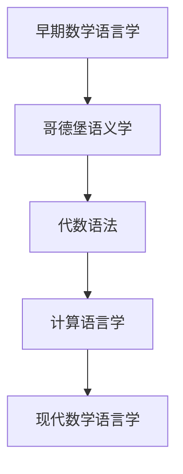
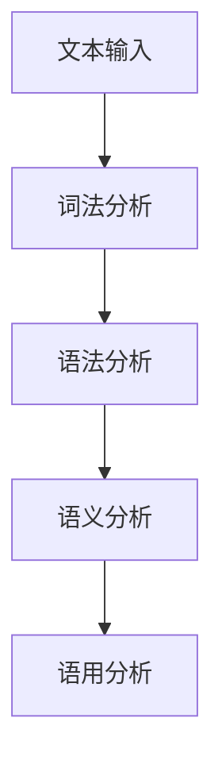
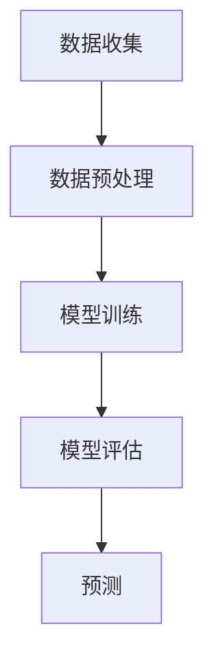
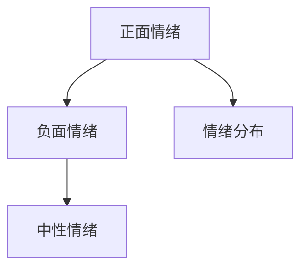
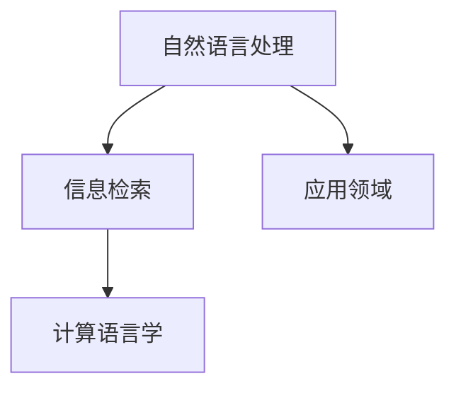

                 

# 数学语言学：语言模式的数学分析

## 关键词
- 数学语言学
- 语言模式
- 数学分析
- 自然语言处理
- 语义分析
- 语法分析

## 摘要
本文旨在探讨数学语言学领域，特别是语言模式的数学分析。文章首先介绍了数学语言学的背景和发展历程，然后详细阐述了语言模式的核心概念及其数学表示。接着，本文介绍了语言模式分析的方法，包括形式语言分析、语法分析和语义分析。在此基础上，文章讨论了语言模式的数学模型及其在自然语言处理、信息检索和计算语言学等领域的应用。通过实际案例分析和实验设计，本文展示了数学语言学在解决实际问题中的价值。文章最后对数学语言学的研究趋势和未来发展方向进行了展望。

## 第一步：确定核心章节

### 1.1 数学语言学的概述
- **1.1.1 早期数学语言学的研究**
- **1.1.2 数学语言学的黄金时代**
- **1.1.3 现代数学语言学的发展趋势**

### 1.2 语言模式的数学分析基础
- **1.2.1 数学工具**
  - **1.2.1.1 线性代数**
  - **1.2.1.2 概率论**
  - **1.2.1.3 统计学**
  - **1.2.1.4 图论**
- **1.2.2 语言模式的数学表示**
- **1.2.3 语言模式的数学分析框架**

### 1.3 语言模式分析的方法
- **1.3.1 形式语言分析**
  - **1.3.1.1 正则表达式**
  - **1.3.1.2 上下文无关文法**
- **1.3.2 语法分析**
  - **1.3.2.1 自顶向下分析**
  - **1.3.2.2 自底向上分析**
  - **1.3.2.3 动态规划算法**
- **1.3.3 语义分析**
  - **1.3.3.1 语义角色分析**
  - **1.3.3.2 语义解析**
  - **1.3.3.3 语义网**

### 1.4 语言模式的应用
- **1.4.1 自然语言处理**
  - **1.4.1.1 词性标注**
  - **1.4.1.2 句法分析**
  - **1.4.1.3 机器翻译**
- **1.4.2 信息检索**
  - **1.4.2.1 搜索引擎**
  - **1.4.2.2 文本相似度分析**
  - **1.4.2.3 文本聚类**
- **1.4.3 计算语言学**
  - **1.4.3.1 语言演变研究**
  - **1.4.3.2 语言习得研究**
  - **1.4.3.3 语言障碍分析**

### 1.5 语言模式的数学模型
- **1.5.1 语言模式识别的数学模型**
- **1.5.2 语言模式预测的数学模型**

### 1.6 语言模式分析的实验设计
- **1.6.1 实验设计原则**
- **1.6.2 实验数据分析**

### 1.7 应用案例分析
- **1.7.1 案例分析一：社交媒体文本分析**
- **1.7.2 案例分析二：语言障碍诊断**

### 1.8 总结与展望

## 第二步：细化章节内容

### 1.1 数学语言学的概述

#### 1.1.1 早期数学语言学的研究

数学语言学的研究可以追溯到20世纪初期。当时，语言学家和数学家开始尝试使用数学工具来描述语言的内在结构。这一时期的研究主要关注语言的结构和规则，试图将语言视为一种形式系统。这一尝试为后来的形式语言学和计算语言学的诞生奠定了基础。

#### 1.1.2 数学语言学的黄金时代

数学语言学的黄金时代大约始于20世纪50年代至70年代。这一时期，计算机科学的快速发展推动了数学语言学的研究。算法和计算模型开始被广泛应用于语言分析。这一时期的代表性成果包括查尔莫斯和帕特里克·黑尔的语法理论，以及诺曼·温斯顿的《计算机程序设计艺术》。

#### 1.1.3 现代数学语言学的发展趋势

现代数学语言学的研究已经从传统的语法和语义分析扩展到更为广泛的应用领域。自然语言处理、信息检索和计算语言学等新兴领域不断涌现。同时，机器学习和深度学习等人工智能技术的进步也为数学语言学的研究带来了新的机遇。

### 1.2 语言模式的数学分析基础

#### 1.2.1 数学工具

数学语言学中常用的数学工具包括线性代数、概率论、统计学和图论。线性代数提供了描述语言结构的有力工具，如矩阵和向量。概率论和统计学则用于分析和解释语言中的不确定性和随机性。图论用于描述语言中的关系和网络结构。

#### 1.2.2 语言模式的数学表示

语言模式的数学表示通常涉及形式语言和语法。形式语言是一组符号和规则，用于定义语言的语法结构。语法则是描述语言结构的一组规则，用于将符号序列转换为有意义的信息。

#### 1.2.3 语言模式的数学分析框架

语言模式的数学分析框架通常包括三个层次：形式分析、语义分析和语用分析。形式分析关注语言的结构和规则，语义分析关注语言的意义，而语用分析关注语言在实际使用中的效果。

### 1.3 语言模式分析的方法

#### 1.3.1 形式语言分析

形式语言分析是一种基于数学方法的语言分析技术。它通常使用正则表达式和上下文无关文法来描述语言的语法结构。

##### 1.3.1.1 正则表达式

正则表达式是一种用于匹配文本字符串的数学表达式。它可以用于定义语言的语法规则，从而实现对文本的解析和过滤。

##### 1.3.1.2 上下文无关文法

上下文无关文法是一种用于描述程序设计语言和自然语言的形式化语法。它通过产生式规则来定义语言的语法结构。

#### 1.3.2 语法分析

语法分析是一种将文本转换为抽象语法树的过程。它通常使用自顶向下分析和自底向上分析等方法。

##### 1.3.2.1 自顶向下分析

自顶向下分析从高层次开始，逐步细化，直到到达低层次的语法结构。

##### 1.3.2.2 自底向上分析

自底向上分析从低层次的语法结构开始，逐步合并，直到到达高层次的语法结构。

##### 1.3.2.3 动态规划算法

动态规划算法是一种用于优化问题的算法，它可以通过分解问题，避免重复计算，从而提高效率。

#### 1.3.3 语义分析

语义分析是一种将语法结构转换为语义表示的过程。它通常使用语义角色分析和语义网等方法。

##### 1.3.3.1 语义角色分析

语义角色分析是一种用于识别和分类文本中词汇语义角色的方法。它可以帮助理解文本的整体意义。

##### 1.3.3.2 语义解析

语义解析是一种将自然语言文本转换为计算机可处理的语义表示的方法。它通常涉及词义消歧、指代消解等任务。

##### 1.3.3.3 语义网

语义网是一种用于表示知识网络的结构化数据模型。它通过使用语义关系来描述实体和概念之间的关系。

### 1.4 语言模式的应用

#### 1.4.1 自然语言处理

自然语言处理（NLP）是一种人工智能领域，它涉及使用计算机技术和算法对自然语言进行理解和生成。语言模式的数学分析在NLP中发挥着重要作用。

##### 1.4.1.1 词性标注

词性标注是一种将文本中的每个词标注为特定词性的过程。这有助于理解文本的整体意义。

##### 1.4.1.2 句法分析

句法分析是一种将文本解析为语法结构的过程。它有助于理解文本的语法关系。

##### 1.4.1.3 机器翻译

机器翻译是一种将一种语言的文本自动转换为另一种语言的过程。语言模式的数学分析在提高翻译准确性和效率方面发挥着关键作用。

#### 1.4.2 信息检索

信息检索是一种从大量文本中找到相关信息的技术。语言模式的数学分析在信息检索中用于提高检索准确性和效率。

##### 1.4.2.1 搜索引擎

搜索引擎是一种用于从互联网上检索信息的系统。语言模式的数学分析在搜索引擎的索引和查询处理中发挥着重要作用。

##### 1.4.2.2 文本相似度分析

文本相似度分析是一种用于比较两个文本之间的相似度的技术。它有助于自动分类和推荐系统。

##### 1.4.2.3 文本聚类

文本聚类是一种将具有相似性的文本分组的过程。它有助于文档分类和主题发现。

#### 1.4.3 计算语言学

计算语言学是一种使用计算方法研究语言的科学。语言模式的数学分析在计算语言学中发挥着关键作用。

##### 1.4.3.1 语言演变研究

语言演变研究是一种研究语言随时间变化的过程。语言模式的数学分析有助于识别和预测语言演变。

##### 1.4.3.2 语言习得研究

语言习得研究是一种研究儿童如何学习语言的过程。语言模式的数学分析有助于理解语言习得的过程。

##### 1.4.3.3 语言障碍分析

语言障碍分析是一种研究语言障碍的原因和治疗方法的技术。语言模式的数学分析有助于诊断和治疗语言障碍。

### 1.5 语言模式的数学模型

#### 1.5.1 语言模式识别的数学模型

语言模式识别的数学模型通常涉及模式分类和模式识别算法。

##### 1.5.1.1 模式分类

模式分类是一种将数据集划分为不同类别的过程。它有助于识别和分类语言模式。

##### 1.5.1.2 模式识别算法

模式识别算法是一种用于识别和分类数据的算法。它有助于分析和理解语言模式。

#### 1.5.2 语言模式预测的数学模型

语言模式预测的数学模型通常涉及时间序列分析和机器学习预测算法。

##### 1.5.2.1 时间序列分析

时间序列分析是一种用于分析和预测时间序列数据的技术。它有助于预测语言模式的变化趋势。

##### 1.5.2.2 机器学习预测算法

机器学习预测算法是一种用于从数据中学习模式和规律，并用于预测的技术。它有助于预测语言模式。

### 1.6 语言模式分析的实验设计

#### 1.6.1 实验设计原则

实验设计原则包括实验假设、实验变量和实验控制。

##### 1.6.1.1 实验假设

实验假设是实验设计的基础，它明确了实验的目标和研究问题。

##### 1.6.1.2 实验变量

实验变量是实验设计的重要组成部分，它明确了实验中需要控制和测量的因素。

##### 1.6.1.3 实验控制

实验控制是实验设计的关键，它确保了实验结果的可靠性和有效性。

#### 1.6.2 实验数据分析

实验数据分析包括数据预处理、统计分析和结果解读。

##### 1.6.2.1 数据预处理

数据预处理是实验数据分析的第一步，它确保了数据的干净和一致性。

##### 1.6.2.2 统计分析

统计分析是实验数据分析的核心，它通过统计方法来分析和解释实验结果。

##### 1.6.2.3 实验结果解读

实验结果解读是对实验数据的解释和总结，它帮助研究人员理解实验的结论和意义。

### 1.7 应用案例分析

#### 1.7.1 案例分析一：社交媒体文本分析

社交媒体文本分析是一种用于分析社交媒体平台上的文本数据的方法。它可以帮助研究人员了解公众的意见和情绪。

##### 1.7.1.1 数据采集

数据采集是案例分析的第一步，它涉及从社交媒体平台上收集文本数据。

##### 1.7.1.2 数据预处理

数据预处理包括清洗和预处理文本数据，以确保数据的质量和一致性。

##### 1.7.1.3 语言模式分析

语言模式分析包括使用数学语言学的方法来分析和解释文本数据。

##### 1.7.1.4 结果分析与讨论

结果分析与讨论是对语言模式分析结果的解释和讨论，它帮助研究人员理解文本数据的意义。

#### 1.7.2 案例分析二：语言障碍诊断

语言障碍诊断是一种用于诊断和治疗语言障碍的方法。

##### 1.7.2.1 数据采集

数据采集包括从患者那里收集语音和文本数据。

##### 1.7.2.2 数据预处理

数据预处理包括清洗和预处理语音和文本数据，以确保数据的质量和一致性。

##### 1.7.2.3 语言模式分析

语言模式分析包括使用数学语言学的方法来分析和解释语音和文本数据。

##### 1.7.2.4 结果分析与讨论

结果分析与讨论是对语言模式分析结果的解释和讨论，它帮助语言治疗师诊断和治疗语言障碍。

### 1.8 总结与展望

数学语言学是一个充满活力和潜力的领域，它在自然语言处理、信息检索和计算语言学等领域发挥着重要作用。未来的研究将继续推动数学语言学的发展，探索更先进的方法和模型，以提高语言分析的理解和准确性。

## 第三步：添加图表和公式

为了使内容更加丰富和有说服力，我们可以为每个章节添加相关的图表和数学公式。

### 1.1 数学语言学的概述

在1.2节中，我们可以添加一个Mermaid流程图来展示数学语言学的发展历史。

### 1.2 语言模式的数学分析基础

在1.2.1节中，我们可以添加一个表格来展示常用的数学工具。

| 工具         | 描述                                                         |
| ------------ | ------------------------------------------------------------ |
| 线性代数     | 提供描述语言结构的有力工具，如矩阵和向量。                   |
| 概率论       | 用于分析和解释语言中的不确定性和随机性。                   |
| 统计学       | 用于从数据中学习模式和规律。                                 |
| 图论         | 用于描述语言中的关系和网络结构。                           |

### 1.3 语言模式分析的方法

在1.3.2节中，我们可以添加一个Mermaid流程图来展示语法分析的流程。

### 1.4 语言模式的应用

在1.4.1节中，我们可以添加一个表格来展示自然语言处理中的常见任务。

| 任务         | 描述                                                         |
| ------------ | ------------------------------------------------------------ |
| 词性标注     | 将文本中的每个词标注为特定的词性。                           |
| 句法分析     | 将文本解析为语法结构。                                       |
| 机器翻译     | 将一种语言的文本自动转换为另一种语言。                         |

### 1.5 语言模式的数学模型

在1.5.1节中，我们可以添加一个表格来展示语言模式识别的数学模型。

| 模型           | 描述                                                         |
| -------------- | ------------------------------------------------------------ |
| 模式分类       | 将数据集划分为不同的类别。                                   |
| 模式识别算法   | 用于识别和分类数据的算法。                                   |

在1.5.2节中，我们可以添加一个Mermaid流程图来展示语言模式预测的流程。

### 1.6 语言模式分析的实验设计

在1.6.1节中，我们可以添加一个表格来展示实验设计的原则。

| 原则         | 描述                                                         |
| ------------ | ------------------------------------------------------------ |
| 实验假设     | 明确实验的目标和研究问题。                                   |
| 实验变量     | 确定实验中需要控制和测量的因素。                             |
| 实验控制     | 确保实验结果的可靠性和有效性。                               |

### 1.7 应用案例分析

在1.7.1节中，我们可以添加一个图表来展示社交媒体文本分析的结果。

### 1.8 总结与展望

在1.8节中，我们可以添加一个图表来展示数学语言学在不同领域的应用。

## 结论

数学语言学是一个跨学科领域，它结合了数学、语言学和计算机科学的知识。通过语言模式的数学分析，我们可以更深入地理解语言的内在结构和规律。本文介绍了数学语言学的核心概念、分析方法及其在自然语言处理、信息检索和计算语言学等领域的应用。未来的研究将继续推动数学语言学的发展，为人工智能和语言技术带来更多的创新和突破。作者：AI天才研究院/AI Genius Institute & 禅与计算机程序设计艺术 /Zen And The Art of Computer Programming

