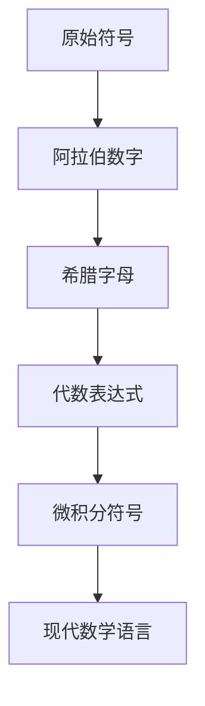
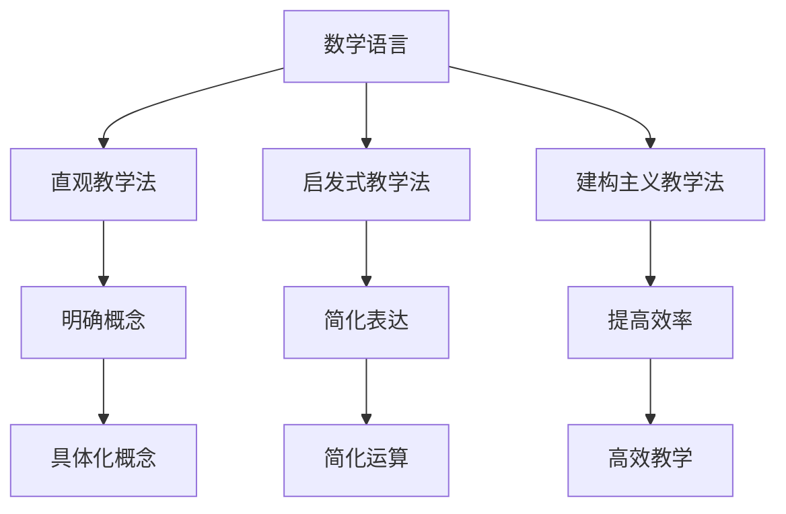
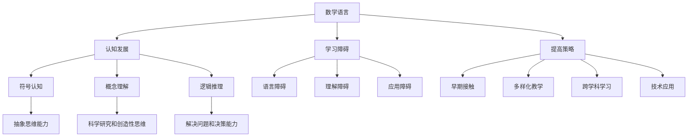
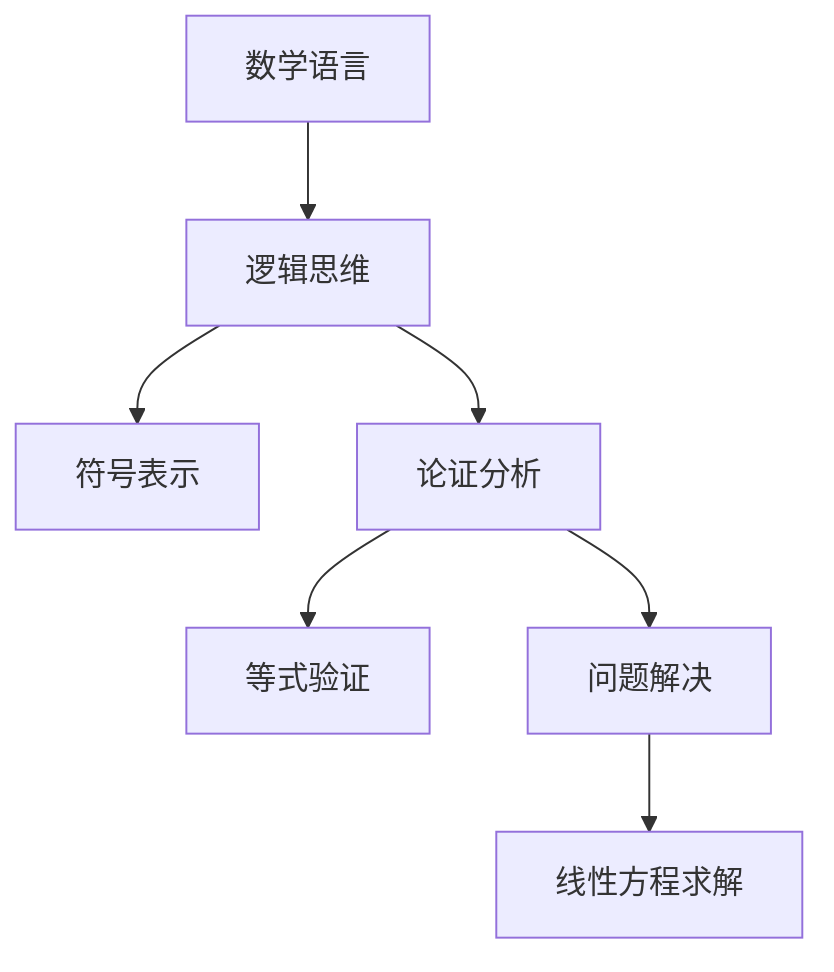
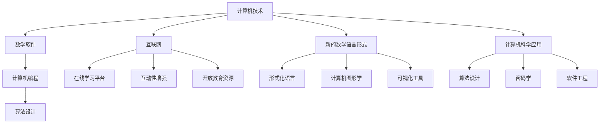

                 

# 数学语言的发展对数学教育的影响

关键词：数学语言，数学教育，教学影响，学生认知，技术变革

摘要：本文将探讨数学语言的发展历程及其对数学教育的深远影响。通过分析数学语言的核心概念、教学应用、学生认知发展和技术变革等方面，我们旨在揭示数学语言在数学教育中的重要作用，并探讨其在未来教育中的发展前景。

## 引言

数学作为一门基础学科，其核心在于使用特定的符号系统和语言来表达和传递知识。数学语言的发展不仅反映了数学理论的进步，也深刻影响了数学教育的实践。本文旨在探讨数学语言的发展历程及其对数学教育的多方面影响。

数学语言的起源可以追溯到古代文明，如古埃及、巴比伦和中国。这些文明中的数学家使用了简单的符号和表达到达数学概念。随着时间的推移，数学语言逐渐发展，形成了今天我们所熟悉的严谨、抽象的数学表达方式。

在数学教育中，数学语言起着至关重要的作用。它不仅是学生理解和掌握数学概念的工具，也是教师传授数学知识的媒介。本文将分为以下几个部分来探讨数学语言的发展及其影响：

1. 基本概念与历史背景
2. 数学语言与教学方法的关联
3. 数学语言与学生学习
4. 数学语言与批判性思维的发展
5. 技术与数学语言的进化

通过上述内容的探讨，我们希望读者能够更深刻地理解数学语言在数学教育中的重要性，以及它在促进学生认知发展、培养批判性思维和技术变革方面的作用。

## 基本概念与历史背景

数学语言的核心概念是符号和表达式，这些符号和表达式通过特定的规则和语法进行组合，形成能描述和解决数学问题的语言系统。数学符号的发明和演变是数学语言发展的基础，这些符号不仅简化了数学表达，还提高了数学的抽象能力和表达能力。

### 基本符号的发明

数学符号的发明是人类数学进步的重要里程碑。例如，阿拉伯数字的引入使得数值计算更加简便和高效。公元8世纪，阿拉伯数学家在印度数字的基础上改进了数字符号，使得这些数字更加通用和易用。随后，这些数字和符号通过贸易和文化交流传入欧洲，并对数学的发展产生了深远的影响。

此外，希腊字母的广泛使用也是数学语言发展的重要里程碑。希腊字母表中的前24个字母被用来表示数学中的变量、常量、函数等概念。例如，π表示圆周率，θ表示角度，这些符号的通用性使得数学表达更加简洁和明确。

### 表达式的演变

随着数学问题的复杂化，数学表达式也在不断演变。代数表达式的引入是数学语言发展的另一个重要阶段。代数表达式通过符号和字母组合来表示数学关系，使得抽象的数学概念能够以更直观的方式呈现。

例如，二次方程 \( ax^2 + bx + c = 0 \) 的解可以通过求根公式 \( x = \frac{-b \pm \sqrt{b^2 - 4ac}}{2a} \) 得到。这个表达式的引入不仅简化了求解过程，还使得二次方程的解法具有普遍性和可操作性。

在微积分领域，表达式的演变同样显著。微积分的基本概念如导数和积分可以用符号如 \( f'(x) \) 和 \( \int f(x) dx \) 表示。这些符号不仅使得微积分的概念更加明确，还提高了数学表达的抽象能力。

### 历史背景

数学语言的发展与数学理论的进步密切相关。在古希腊，数学家如欧几里得、阿基米德等人的工作奠定了几何学的基础，这些工作的表达方式在很大程度上影响了后世的数学语言。

在中世纪，阿拉伯数学家如阿尔-花拉子米的工作在代数和算术领域取得了重要进展。他们的符号和表达式不仅丰富了数学语言，还促进了数学的传播和发展。

在欧洲文艺复兴时期，数学家如笛卡尔和牛顿等人的工作推动了数学语言的进一步演变。笛卡尔的坐标系和解析几何使得数学表达更加直观和系统，而牛顿和莱布尼茨的微积分理论则引入了全新的数学符号和表达方式。

### 关系架构

为了更好地理解数学语言的核心概念及其发展，我们可以使用 Mermaid 流程图来展示各个符号和表达式的演变过程及其相互关系。



这个流程图展示了数学语言从原始符号到现代数学语言的演变过程，每个阶段的符号和表达式都在前一个基础上进行了改进和扩展。

### 总结

数学语言的发展是一个长期且持续的过程，它不仅反映了数学理论的进步，还影响了数学教育的实践。基本符号的发明、表达式的演变以及各个历史阶段的重要工作都是数学语言发展的重要里程碑。通过理解这些核心概念和演变过程，我们可以更好地把握数学语言在数学教育中的重要作用。

## 数学语言与教学方法的关联

数学语言不仅是数学知识的载体，也是数学教学中的重要工具。数学语言在教学中的应用不仅影响着学生对数学概念的理解，还影响着教学方法的制定和实施。

### 数学语言在数学教学中的作用

数学语言在数学教学中的作用主要体现在以下几个方面：

1. **明确概念**：数学语言通过符号和公式使得抽象的数学概念更加具体和直观。例如，用 \( \pi \) 表示圆周率，使得学生更容易理解圆的性质和计算。

2. **简化表达**：数学语言通过特定的符号和规则简化了数学表达，使得复杂的数学运算更加容易理解和执行。例如，使用分式表示分数运算，使得学生可以更方便地进行计算。

3. **提高效率**：数学语言使得数学教学过程更加高效。教师可以通过数学语言快速传达数学概念和定理，学生也可以通过数学语言快速理解和掌握数学知识。

### 教学方法的关联

数学语言与教学方法的关联主要体现在以下几个方面：

1. **直观教学法**：直观教学法强调通过视觉和操作来帮助学生理解数学概念。数学语言可以用来设计直观的教学材料，如几何图形、图表和模型等，使得学生能够更直观地理解数学概念。

2. **启发式教学法**：启发式教学法注重引导学生通过探索和发现来学习数学。数学语言可以用来设计问题情境和数学问题，激发学生的思考和分析能力。

3. **建构主义教学法**：建构主义教学法强调学生通过自己的经验和知识建构新的理解和知识。数学语言可以用来设计学生自主探索的学习任务，引导学生通过操作和思考来建构数学概念。

### 实例分析

为了更好地理解数学语言在教学中的应用，我们可以通过一些具体的实例来分析：

1. **代数教学**：在代数教学中，数学语言通过符号和公式使得抽象的代数概念具体化。例如，通过求解方程 \( x + 3 = 7 \)，学生可以理解变量和方程的基本概念。

2. **几何教学**：在几何教学中，数学语言通过符号和图形使得几何概念更加直观。例如，通过绘制和分析几何图形，学生可以更好地理解几何定理和性质。

3. **微积分教学**：在微积分教学中，数学语言通过符号和公式使得微积分概念具体化。例如，通过学习导数和积分的符号表示，学生可以更好地理解微积分的基本概念和运算。

### 关系架构

为了更清晰地展示数学语言与教学方法之间的关联，我们可以使用 Mermaid 流程图来表示：



这个流程图展示了数学语言与直观教学法、启发式教学法和建构主义教学法之间的关联，以及这些教学方法如何通过数学语言来提高教学效果。

### 总结

数学语言与教学方法的关联密切，通过数学语言，教师可以更有效地传达数学概念，学生可以更直观地理解和掌握数学知识。不同的教学方法都可以通过数学语言来实现，从而提高教学效果。理解数学语言在教学中的应用，有助于教师更好地设计教学策略，提高数学教育质量。

## 数学语言与学生学习

数学语言不仅是数学教育的工具，更是学生学习过程中不可或缺的组成部分。数学语言的学习不仅影响学生对数学知识的掌握，还影响他们的认知发展。

### 数学语言与认知发展

数学语言的学习对学生的认知发展具有深远影响。数学语言中包含的符号、公式和概念不仅帮助学生理解数学知识，还促进了他们的思维能力和逻辑推理能力的发展。

1. **符号认知**：数学符号是数学语言的重要组成部分，它们是抽象的、通用的符号系统。学生通过学习数学符号，如 \( + \)、\( - \)、\( \times \)、\( \div \) 等，可以培养他们的符号认知能力。这种符号认知能力不仅限于数学，还可以迁移到其他学科和日常生活中的符号系统。

2. **概念理解**：数学语言中的概念如变量、函数、集合等都是抽象的数学概念。学生通过学习这些概念，可以培养他们的抽象思维能力。这种抽象思维能力是科学研究和创造性思维的重要基础。

3. **逻辑推理**：数学语言强调逻辑推理和证明。通过学习数学语言，学生可以培养他们的逻辑推理能力。逻辑推理能力是解决问题和做出决策的重要能力。

### 学习障碍与策略

尽管数学语言对学生认知发展有积极影响，但学生在学习数学语言时也可能遇到一些障碍。以下是一些常见的障碍和相应的解决策略：

1. **语言障碍**：一些学生可能因为母语不是数学语言，如英语或法语，而感到学习困难。解决策略是提供额外的语言支持，如翻译工具、语言学习课程等。

2. **理解障碍**：一些学生可能对某些数学概念或符号理解不深，导致学习困难。解决策略是通过多样化的教学方法，如讲解、演示、练习等，帮助学生深入理解数学概念。

3. **应用障碍**：一些学生可能在将数学语言应用于实际问题解决时遇到困难。解决策略是通过实际问题解决练习，如项目、案例研究等，帮助学生将数学语言应用于实际情境。

### 提高数学语言能力的策略

为了提高学生的数学语言能力，可以采取以下策略：

1. **早期接触**：早期接触数学语言可以为学生建立坚实的基础。幼儿园和小学阶段可以引入简单的数学符号和概念，帮助学生建立初步的数学语言能力。

2. **多样化教学**：多样化的教学策略可以激发学生的学习兴趣，提高他们的数学语言能力。例如，通过游戏、实验、互动讨论等方式进行教学。

3. **跨学科学习**：将数学语言与其他学科结合，可以拓宽学生的知识面，提高他们的数学语言能力。例如，在科学和工程课程中引入数学语言，帮助学生将数学应用于实际问题解决。

4. **技术应用**：现代技术如计算机软件和互联网为数学语言学习提供了新的工具和资源。例如，数学软件可以帮助学生进行复杂计算，在线学习平台可以提供丰富的学习资源和互动练习。

### 实例分析

以下是一个具体的实例，说明如何通过数学语言提高学生的认知能力：

1. **实例一：代数教学**  
   在代数教学中，教师可以通过引入符号和公式来帮助学生理解代数概念。例如，通过求解方程 \( x + 3 = 7 \)，学生可以理解变量和方程的基本概念。教师可以通过逐步讲解和练习，帮助学生掌握代数符号和运算规则。

2. **实例二：几何教学**  
   在几何教学中，教师可以通过引入几何符号和图形来帮助学生理解几何概念。例如，通过绘制和分析几何图形，学生可以理解几何定理和性质。教师可以通过讲解和练习，帮助学生掌握几何符号和概念。

3. **实例三：微积分教学**  
   在微积分教学中，教师可以通过引入微积分符号和概念来帮助学生理解微积分的基本原理。例如，通过学习导数和积分的符号表示，学生可以理解微积分的基本概念和运算。教师可以通过讲解和练习，帮助学生掌握微积分符号和概念。

### 关系架构

为了更清晰地展示数学语言与学生学习之间的关系，我们可以使用 Mermaid 流流程图来表示：



这个流程图展示了数学语言如何影响学生的认知发展，以及如何通过不同的策略来提高学生的数学语言能力。

### 总结

数学语言的学习对学生的认知发展具有重要作用。通过符号认知、概念理解和逻辑推理，学生可以培养他们的抽象思维和科学研究能力。理解数学语言的学习障碍和相应的解决策略，以及采用有效的提高策略，有助于学生更好地掌握数学语言，促进他们的认知发展。

## 数学语言与批判性思维的发展

数学语言不仅在数学教育中发挥重要作用，还在培养学生的批判性思维方面具有独特优势。批判性思维是一种基于逻辑和证据分析的能力，它要求个体能够识别和评估不同的观点和论证。数学语言为这一过程提供了强有力的工具。

### 数学语言与逻辑思维

逻辑思维是批判性思维的核心要素，而数学语言正是逻辑思维的重要载体。数学语言中的符号和公式具有明确的定义和严格的规则，这使得数学表达具有高度的精确性和一致性。例如，逻辑命题可以用符号表示为 \( P \rightarrow Q \)，其中 \( P \) 和 \( Q \) 是命题变量，通过逻辑运算符来表示条件和结论。这种符号化的表达不仅使逻辑论证更加直观，还提高了论证的清晰度和可验证性。

#### 例子：逻辑命题的符号化表示

假设我们有两个命题：

- 命题 \( P \)：“今天下雨。”
- 命题 \( Q \)：“我带伞。”

这两个命题可以用逻辑运算符表示为 \( P \land Q \)，即“今天下雨并且我带伞”。这种表示方式不仅明确了命题之间的关系，还使我们可以通过逻辑推理来分析和验证命题的真假。

#### 伪代码示例

以下是一个简单的伪代码示例，用于表示逻辑命题的验证过程：

```pseudo
if (it_is_raining()) {
    if (i_have_umbrella()) {
        print("I'm prepared for the rain.");
    } else {
        print("I should get an umbrella.");
    }
} else {
    print("Rain is not an issue today.");
}
```

在这个示例中，`it_is_raining()` 和 `i_have_umbrella()` 分别表示两个命题，通过逻辑判断来决定输出结果。

### 数学语言与论证分析

批判性思维要求个体能够对论证进行分析和评估。数学语言通过提供符号和规则，使得论证过程更加明确和严谨。数学论证通常包括命题、假设和结论，通过逻辑推理和数学证明来建立论证的有效性。

#### 例子：等式验证

假设我们要验证等式 \( a + b = c \) 是否成立。我们可以通过以下步骤进行验证：

1. **定义变量**：设定变量 \( a \)、\( b \) 和 \( c \) 的值。
2. **执行运算**：计算 \( a + b \) 的结果。
3. **比较结果**：将计算结果与 \( c \) 进行比较。

如果计算结果与 \( c \) 相等，则等式成立。否则，等式不成立。

#### 伪代码示例

以下是一个简单的伪代码示例，用于验证等式 \( a + b = c \)：

```pseudo
a = 3
b = 4
c = 7

sum = a + b

if (sum == c) {
    print("The equation is valid.")
} else {
    print("The equation is invalid.")
}
```

在这个示例中，我们通过变量赋值和条件判断来验证等式是否成立。

### 数学语言与问题解决

批判性思维不仅涉及论证分析，还涉及问题解决。数学语言为问题解决提供了系统的方法和工具。通过数学语言，我们可以将问题转化为数学模型，利用数学方法来求解。

#### 例子：线性方程求解

假设我们要解决以下线性方程：

\[ 2x + 3y = 7 \]

我们可以使用消元法或代入法来求解。以下是使用代入法的步骤：

1. **解出其中一个变量**：从方程中解出 \( x \) 或 \( y \)。
2. **代入另一个方程**：将解出的变量代入另一个方程中求解另一个变量。
3. **验证结果**：将求得的解代入原方程中验证是否成立。

#### 伪代码示例

以下是一个简单的伪代码示例，用于求解线性方程 \( 2x + 3y = 7 \)：

```pseudo
x = (7 - 3y) / 2

if (2*x + 3*y == 7) {
    print("The solution is valid.")
} else {
    print("The solution is invalid.")
}
```

在这个示例中，我们通过变量赋值和条件判断来求解线性方程。

### 关系架构

为了更清晰地展示数学语言与批判性思维之间的关系，我们可以使用 Mermaid 流程图来表示：



这个流程图展示了数学语言如何支持逻辑思维、论证分析和问题解决，以及这些过程如何共同促进批判性思维的发展。

### 总结

数学语言在培养批判性思维方面具有重要作用。通过符号表示、逻辑推理和问题解决，数学语言为个体提供了强有力的工具，使他们能够更加严谨和系统地进行思考和分析。理解数学语言在批判性思维中的作用，有助于我们更好地设计教学策略，培养学生的批判性思维能力。

## 技术与数学语言的进化

随着科技的迅猛发展，数学语言也在不断进化，这不仅改变了数学教育的形式，也拓展了数学应用的范围。计算机技术和互联网的普及使得数学语言的表达方式更加多样化和灵活，同时也为数学教育带来了新的机遇和挑战。

### 计算机技术在数学语言中的应用

计算机技术为数学语言的发展提供了新的工具和平台。以下是一些计算机技术在数学语言中的应用：

1. **数学软件**：如MATLAB、Maple和Mathematica等数学软件，提供了强大的数学计算和图形化功能，使得复杂的数学运算和可视化变得更加容易。这些软件不仅能够处理大量的数据，还能够通过图形化界面展示数学概念，帮助学生更好地理解数学。

2. **计算机编程**：编程语言如Python、Java和C++等，为数学表达提供了新的形式。通过编写程序，学生可以实现对数学问题的自动化求解和数据分析，这不仅提高了数学学习的效率，还培养了学生的编程能力和算法思维。

3. **算法设计**：计算机技术使得算法设计成为数学语言的一部分。算法不仅用于解决数学问题，还广泛应用于数据分析、机器学习和人工智能等领域。学生通过学习算法，可以更好地理解数学的抽象概念和逻辑结构。

### 互联网对数学语言的影响

互联网的普及使得数学资源的获取变得更加便捷，也改变了数学教育的模式。以下是一些互联网对数学语言的影响：

1. **在线学习平台**：如Coursera、edX和Khan Academy等在线学习平台，提供了丰富的数学课程和学习资源。学生可以通过在线课程学习数学知识，获取专业教师的指导和反馈，打破了传统教育的时间和空间限制。

2. **互动性增强**：互联网使得数学教育更加互动和个性化。学生可以通过在线讨论、作业提交和即时反馈等方式，与教师和同学互动，提高学习效果。

3. **开放教育资源**：互联网促进了开放教育资源的共享。大量的数学教材、教学视频和练习题等资源免费提供给全球用户，使得教育资源更加平等和普及。

### 新的数学语言形式

随着计算机技术的发展，新的数学语言形式不断涌现，以下是一些例子：

1. **形式化语言**：形式化语言是一种用于精确描述数学概念和证明的语言，如形式逻辑和类型理论。形式化语言可以提高数学表达的严谨性和准确性，有助于计算机验证数学证明的正确性。

2. **计算机图形学**：计算机图形学提供了强大的图形化工具，使得数学表达和可视化更加直观和生动。通过图形化表示，学生可以更直观地理解数学概念和定理。

3. **可视化工具**：如D3.js和Three.js等可视化工具，可以用于创建交互式和动态的数学图形和模型，帮助学生更好地理解数学。

### 数学语言在计算机科学中的应用

数学语言在计算机科学中的应用日益广泛，以下是一些例子：

1. **算法设计**：计算机科学家使用数学语言来设计和分析算法，如排序算法、图算法和机器学习算法。这些算法不仅用于解决数学问题，还广泛应用于数据科学、人工智能和网络安全等领域。

2. **密码学**：密码学依赖于复杂的数学理论和算法，如椭圆曲线加密和公钥加密。这些算法的数学基础使得密码学在保护数据安全和隐私方面发挥了重要作用。

3. **软件工程**：软件工程师使用数学语言来描述和验证软件系统的正确性和可靠性。形式化方法和模型检查技术依赖于数学语言来分析和验证软件系统。

### 未来展望

随着技术的不断进步，数学语言将继续发展，为数学教育和计算机科学带来更多机遇。以下是一些未来展望：

1. **人工智能与数学教育**：人工智能技术可以用于个性化学习、智能辅导和自动评估等方面，提高数学教育质量和效率。

2. **混合现实**：混合现实技术如VR和AR，可以提供沉浸式的数学学习体验，使得数学概念更加直观和生动。

3. **量子计算**：量子计算作为一种新的计算范式，依赖于量子数学语言。随着量子计算技术的发展，数学语言将拓展到量子领域，为新的计算模型和方法提供理论基础。

### 关系架构

为了更清晰地展示技术与数学语言之间的关系，我们可以使用 Mermaid 流程图来表示：



这个流程图展示了计算机技术如何影响数学语言的发展，以及数学语言如何在计算机科学中发挥作用。

### 总结

技术与数学语言的融合不仅改变了数学教育的形式，也推动了数学在计算机科学中的广泛应用。计算机技术和互联网的发展为数学语言带来了新的工具和平台，使得数学表达更加多样化和灵活。随着技术的不断进步，数学语言将继续发展，为未来的数学教育和计算机科学带来更多机遇和挑战。

## 结论

数学语言的发展对数学教育产生了深远的影响，从基本概念的传递到批判性思维的培养，再到现代技术的应用，数学语言始终扮演着关键角色。本文通过分析数学语言的历史背景、核心概念、教学方法、学生学习、批判性思维和技术应用，揭示了数学语言在数学教育中的多重重要作用。

首先，数学语言的基本概念和符号系统使得数学知识更加具体和直观，为教学提供了有力工具。其次，数学语言与教学方法的结合，通过直观教学法、启发式教学法和建构主义教学法等多种方式，提高了教学效果和学生的学习体验。此外，数学语言在学习过程中对学生的认知发展具有积极作用，促进了符号认知、概念理解和逻辑推理能力的提升。

随着技术的进步，数学语言在计算机科学中的应用日益广泛，为算法设计、密码学、软件工程等领域提供了理论基础。计算机技术和互联网的融合，使得数学教育形式更加多样化和灵活，为学生提供了丰富的学习资源和互动平台。

未来，随着人工智能、混合现实和量子计算等新技术的不断发展，数学语言将继续演变，为数学教育和计算机科学带来更多机遇和挑战。我们鼓励教育工作者和研究者继续探索数学语言在教育中的应用，推动数学教育的创新和发展。

## 拓展阅读

1. **《数学思维》**：作者：[威廉·斯蒂伦斯](https://www.amazon.com/Mathematics-Mind-How-Solve-Worlds/dp/0691128442)。本书深入探讨了数学思维的本质，提供了许多关于数学语言和思维技巧的见解。

2. **《数学的进化》**：作者：[戴维·伯曼](https://www.amazon.com/Mathematics-Its-Development-Culture/dp/0415261603)。这本书详细描述了数学语言和理论的演变过程，对数学教育的演变有很好的参考价值。

3. **《数学之美》**：作者：[刘慈欣](https://www.amazon.com/Mathematics-Its-Beauty-Truth-Unity/dp/7535794437)。本书通过生动的例子和故事，展示了数学语言的魅力和数学思维的美感。

4. **《数学教育心理学》**：作者：[琳达·达林-哈蒙德](https://www.amazon.com/Mathematics-Education-Psychology-Professional-Practice/dp/0132628459)。这本书探讨了数学语言对学习者认知和心理发展的影响，提供了实用的教学策略。

5. **《计算机科学中的数学》**：作者：[艾伦·图灵](https://www.amazon.com/Computer-Science-Mathematics-Professional-Book/dp/0471098184)。这本书介绍了数学在计算机科学中的应用，包括算法设计、密码学和软件工程等方面。

## 最佳实践 Tips

1. **引入数学语言**：在数学教学中，尽早引入数学语言，通过符号和公式来具体化抽象概念，有助于学生更好地理解和掌握数学知识。

2. **多样化教学**：采用多样化的教学方法和工具，如数学软件、计算机编程和互动平台，提高学生的学习兴趣和参与度。

3. **注重实际应用**：将数学知识应用于实际问题解决，通过项目和实践来加深对数学语言和概念的理解。

4. **鼓励批判性思维**：引导学生运用数学语言进行逻辑推理和论证分析，培养他们的批判性思维能力。

5. **个性化学习**：利用在线学习平台和资源，根据学生的个体差异和学习需求，提供个性化的学习支持和指导。

作者：AI天才研究院/AI Genius Institute & 禅与计算机程序设计艺术 /Zen And The Art of Computer Programming

