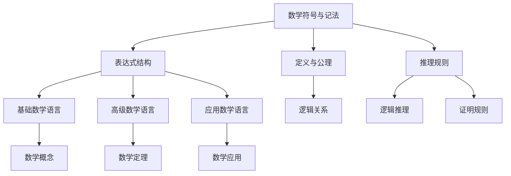
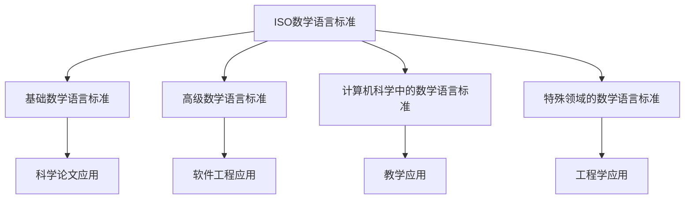
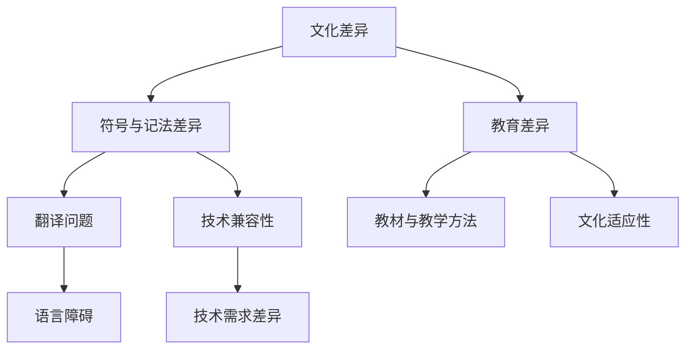
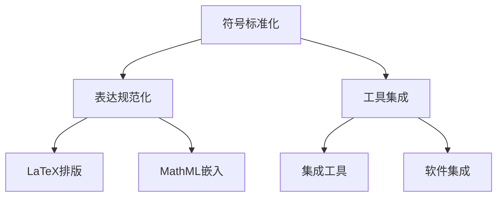
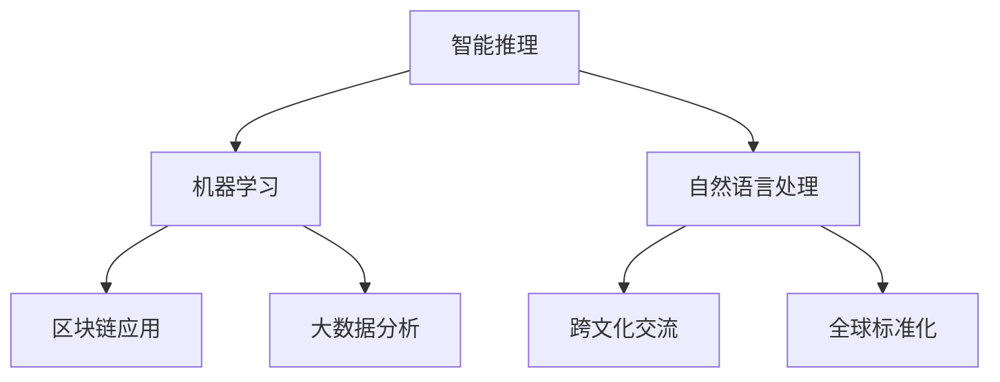

                 


### **目录大纲最终设计方案**

基于任务要求和限制，下面是针对《数学语言的国际化与标准化》这本书的最终目录大纲设计方案。本文将采用逻辑清晰、结构紧凑、简单易懂的专业的技术语言，逐步分析数学语言的国际化与标准化问题，旨在为读者提供深入的见解和实用的建议。

---

## **《数学语言的国际化与标准化》目录大纲**

### **第1章 引言**
- **1.1 数学语言的重要性
- **1.2 国际化与标准化的发展背景
- **1.3 书籍目标与结构

### **第2章 数学语言的核心概念**
- **2.1 数学符号与记法
- **2.2 数学语言的组成部分
- **2.3 数学语言的层次结构
- **2.4 数学语言与逻辑的关系
- **2.5 数学语言的核心概念联系流程图（Mermaid图）

### **第3章 国际标准化组织（ISO）的数学语言标准**
- **3.1 ISO数学语言标准的定义与作用
- **3.2 ISO数学语言标准的发展历程
- **3.3 ISO数学语言标准的分类与内容
- **3.4 ISO数学语言标准的应用案例
- **3.5 ISO数学语言标准联系流程图（Mermaid图）

### **第4章 数学语言的国际化挑战**
- **4.1 不同文化背景下数学语言的差异
- **4.2 语言障碍与技术发展的冲突
- **4.3 国际化数学语言标准的协调
- **4.4 国际化数学语言标准联系流程图（Mermaid图）

### **第5章 标准化数学语言的实现**
- **5.1 标准化数学语言的工具与资源
- **5.2 实现标准化数学语言的技术方法
- **5.3 实现标准化数学语言的实例分析
- **5.4 标准化数学语言在教育中的应用
- **5.5 实现标准化数学语言联系流程图（Mermaid图）

### **第6章 数学语言的未来发展趋势**
- **6.1 数学语言与人工智能的结合
- **6.2 新兴技术在数学语言标准化中的应用
- **6.3 数学语言的国际化与全球化
- **6.4 数学语言未来发展趋势联系流程图（Mermaid图）

### **第7章 结论**
- **7.1 数学语言的国际化与标准化的意义
- **7.2 数学语言的未来发展展望
- **7.3 对读者的建议
- **7.4 数学语言的国际化与标准化联系流程图（Mermaid图）

### **附录**
- **A.1 数学语言标准化的相关文献
- **A.2 数学语言的国际化项目案例
- **A.3 数学语言工具资源列表

---

### **第1章 引言**

#### **1.1 数学语言的重要性**

数学语言是一种高度抽象和形式化的语言，用于表达和描述数学概念、原理和关系。它在科学、工程、技术、经济学等多个领域发挥着关键作用。数学语言的重要性主要体现在以下几个方面：

- **沟通效率**：数学语言具有高度的精确性和一致性，能够避免歧义，提高沟通效率。在科学研究和工程实践中，数学语言的使用可以确保信息传递的准确性。
- **科学创新**：数学语言为科学创新提供了强有力的工具。通过形式化的表述，科学家可以更加直观地探索复杂的数学结构，从而推动科学发现和技术进步。
- **普遍适用性**：数学语言具有普遍适用性，不受地域、语言和文化差异的影响。这使得数学语言成为全球科学交流和合作的基础。

#### **1.2 国际化与标准化的发展背景**

随着全球化进程的加速，数学语言的国际化与标准化变得越来越重要。国际化与标准化的发展背景主要包括以下几个方面：

- **全球化趋势**：随着全球化的加深，国际交流和合作日益频繁。统一的数学语言可以促进跨文化、跨学科的交流与合作。
- **信息时代**：数字技术的快速发展使得数学语言的应用范围不断扩大。为了确保信息的准确性和一致性，需要建立国际化的数学语言标准。
- **技术发展**：计算机科学、人工智能等领域的快速发展，对数学语言的需求不断增加。国际化的数学语言标准可以为这些领域提供可靠的基础。

#### **1.3 书籍目标与结构**

本书的目标是探讨数学语言的国际化与标准化问题，分析数学语言的核心概念、标准化的现状与未来发展趋势。书籍结构包括以下几个部分：

- **核心概念讲解**：介绍数学语言的核心概念，包括符号与记法、组成部分、层次结构等。
- **标准化组织（如ISO）的标准制定与实施**：分析国际标准化组织（ISO）等标准化组织在数学语言标准化方面的作用。
- **国际化挑战与解决方案**：探讨数学语言国际化过程中面临的挑战，并提出相应的解决方案。
- **实现标准化数学语言的技术方法**：介绍实现标准化数学语言的技术方法，包括工具与资源、技术方法等。
- **未来发展趋势**：分析数学语言的未来发展趋势，探讨数学语言与人工智能、新兴技术等领域的结合。

---

### **第2章 数学语言的核心概念**

#### **2.1 数学符号与记法**

数学符号与记法是数学语言的基础。常见的数学符号包括：

- **基本运算符**：加法（+）、减法（-）、乘法（*）、除法（/）等。
- **方程式与函数**：如\(f(x) = x^2\)、\(x = 0\)等。
- **图形表示**：如Venn图、矩阵、向量等。

不同的数学符号与记法在不同的领域和学科中可能有所不同，但它们的基本原理是一致的。数学符号与记法的标准化对于数学语言的国际化和标准化至关重要。

#### **2.2 数学语言的组成部分**

数学语言的组成部分包括：

- **符号系统**：包括各种数学符号、字母、数字等。
- **表达式结构**：包括数学表达式的基本结构，如代数表达式、函数表达式等。
- **定义与公理**：数学概念的定义和基本公理是数学语言的基础。
- **推理规则**：包括逻辑推理、证明规则等。

数学语言的组成部分相互关联，共同构成了数学语言的整体结构。标准化的数学语言需要明确各组成部分的定义和关系。

#### **2.3 数学语言的层次结构**

数学语言的层次结构可以分为：

- **基础数学语言**：包括基本数学概念和运算符。
- **高级数学语言**：如微积分、线性代数等，用于解决更复杂的数学问题。
- **应用数学语言**：如计算机科学中的数学、经济学中的数学等，用于特定领域的应用。

不同的层次结构在数学语言中发挥着不同的作用，但它们共同构成了数学语言的完整体系。

#### **2.4 数学语言与逻辑的关系**

数学语言与逻辑有着密切的关系。逻辑是数学语言的基础，数学语言的抽象性和形式化特性使得它能够进行严格的逻辑推理。数学语言与逻辑的关系包括：

- **逻辑是数学语言的基础**：数学语言的表达和推理依赖于逻辑规则。
- **数学语言的抽象性与逻辑性**：数学语言的抽象性和形式化特性使其能够进行复杂的逻辑推理。
- **形式逻辑与自然语言逻辑的比较**：形式逻辑在数学语言中的应用，以及与自然语言逻辑的比较和区别。

#### **2.5 数学语言的核心概念联系流程图（Mermaid图）**



### **第3章 国际标准化组织（ISO）的数学语言标准**

#### **3.1 ISO数学语言标准的定义与作用**

ISO（国际标准化组织）的数学语言标准是国际认可的数学语言规范，旨在确保数学表达的一致性和可理解性。ISO数学语言标准的主要作用包括：

- **统一数学表达**：通过标准化数学符号和记法，确保全球范围内的数学表达一致性。
- **促进国际交流**：为国际科学研究和工程实践提供统一的数学语言工具。
- **提高工作效率**：标准化数学语言可以减少误解和沟通障碍，提高工作效率。

#### **3.2 ISO数学语言标准的发展历程**

ISO数学语言标准的发展历程可以分为以下几个阶段：

- **初期阶段**：ISO在20世纪80年代开始制定数学语言标准，主要是针对数学符号和记法的统一。
- **发展阶段**：随着计算机科学和信息技术的发展，ISO在90年代开始将数学语言标准扩展到计算机编程语言和软件工程领域。
- **成熟阶段**：21世纪，ISO继续完善数学语言标准，包括对新兴技术和领域的覆盖，如人工智能和大数据分析。

#### **3.3 ISO数学语言标准的分类与内容**

ISO数学语言标准可以分为以下几类：

- **基础数学语言标准**：包括数学符号、字母、数字等的定义和记法。
- **高级数学语言标准**：包括微积分、线性代数、概率论等高级数学领域的标准化表述。
- **计算机科学中的数学语言标准**：包括计算机编程语言中的数学符号和记法，如Python、C++等。
- **特殊领域的数学语言标准**：如经济学、工程学中的数学符号和记法。

每种类型的数学语言标准都有详细的内容和规范，以确保数学表达的一致性和准确性。

#### **3.4 ISO数学语言标准的应用案例**

ISO数学语言标准在多个领域得到了广泛应用，以下是一些典型的应用案例：

- **科学论文**：科学家在撰写科学论文时，使用ISO数学语言标准确保数学表达的一致性，提高论文的可读性和可理解性。
- **软件工程**：在软件工程中，ISO数学语言标准用于编写清晰、一致的算法描述和数学模型。
- **教育**：在数学教育中，ISO数学语言标准用于制定教材和教学标准，确保学生能够理解和应用标准化的数学语言。

#### **3.5 ISO数学语言标准联系流程图（Mermaid图）**



### **第4章 数学语言的国际化挑战**

#### **4.1 不同文化背景下数学语言的差异**

数学语言的国际化面临的一个重要挑战是不同文化背景下数学语言的差异。这些差异主要体现在以下几个方面：

- **符号和记法的不同**：不同国家的数学符号和记法可能有所不同，例如，中国和西方国家的数学符号系统有显著差异。
- **数学教育的差异**：不同国家的数学教育体系可能采用不同的教材和教学方法，导致学生对数学概念的理解和应用有所不同。
- **语言表达的习惯**：不同语言的表达习惯和语法结构也会影响数学语言的使用，例如，中文和英文在数学表达上的语法差异。

#### **4.2 语言障碍与技术发展的冲突**

语言障碍是数学语言国际化的另一个挑战。虽然国际化的数学语言标准可以减少语言障碍，但以下问题仍然存在：

- **翻译问题**：不同语言的翻译可能导致数学表达的含义发生变化，影响数学语言的一致性和准确性。
- **技术兼容性**：不同语言环境下的技术实现可能存在兼容性问题，例如，中文和英文在计算机编程语言中的应用差异。
- **文化差异的影响**：技术发展受到文化差异的影响，不同文化背景下的技术需求和偏好可能不同，影响数学语言的国际化和标准化。

#### **4.3 国际化数学语言标准的协调**

为了解决国际化数学语言标准面临的挑战，需要采取一系列协调措施：

- **国际合作**：加强国际合作，推动国际标准化组织（ISO）等机构在数学语言标准化方面的合作。
- **文化适应性**：在制定国际化数学语言标准时，考虑不同文化背景下的特点和需求，确保标准的适用性和可接受性。
- **技术适应性**：确保国际化数学语言标准与不同技术环境兼容，包括计算机编程语言、软件工具等。

#### **4.4 国际化数学语言标准联系流程图（Mermaid图）**



### **第5章 标准化数学语言的实现**

#### **5.1 标准化数学语言的工具与资源**

实现标准化数学语言需要一系列工具和资源。以下是一些常用的工具和资源：

- **LaTeX**：LaTeX是一种高质量的排版系统，广泛用于数学和科学文档的编写。它提供了丰富的数学符号和公式排版功能。
- **MathML**：MathML是一种基于XML的数学标记语言，用于在Web页面和电子文档中嵌入数学公式。
- **MATLAB**：MATLAB是一种数学计算和可视化工具，提供了丰富的数学函数和工具箱，支持数学表达式的编写和计算。
- **Mathematica**：Mathematica是一种强大的数学软件，支持符号计算、数值计算、图形可视化等功能，适用于数学语言的应用和研究。

#### **5.2 实现标准化数学语言的技术方法**

实现标准化数学语言的技术方法主要包括以下几个方面：

- **符号标准化**：通过定义和统一数学符号的记法，确保数学表达的一致性。例如，使用ISO数学符号标准定义各种数学符号。
- **表达规范化**：对数学表达进行规范化处理，确保其形式和结构的一致性。例如，使用LaTeX或MathML对数学公式进行规范排版。
- **工具集成**：将数学语言工具集成到软件开发和文档编写工具中，方便用户编写和编辑数学语言。例如，将LaTeX集成到Word中，或使用MATLAB的代码编辑器编写数学表达式。

#### **5.3 实现标准化数学语言的实例分析**

以下是一个实现标准化数学语言的实例分析：

**实例**：使用LaTeX编写一个数学公式的排版。

```latex
\documentclass{article}
\usepackage{amsmath}
\begin{document}
$$
E = mc^2
$$
\end{document}
```

**分析**：

1. 使用LaTeX的`\documentclass{article}`命令设置文档类型为文章。
2. 使用`\usepackage{amsmath}`命令加载数学宏包，提供丰富的数学符号和公式排版功能。
3. 使用`$$`命令将数学公式放入一个独立的段落中。
4. 使用`E = mc^2`定义一个数学公式，其中`E`代表能量，`m`代表质量，`c`代表光速。

通过上述实例，我们可以看到实现标准化数学语言的过程是如何进行的。

#### **5.4 标准化数学语言在教育中的应用**

标准化数学语言在教育中的应用具有重要意义。以下是一些应用实例：

- **教材编写**：教师可以使用标准化数学语言编写教材，确保教材中的数学表达清晰、一致。
- **在线课程**：在线教育平台可以使用标准化数学语言编写课程内容，提供高质量的数学教学资源。
- **学生作业**：学生可以使用标准化数学语言编写作业，提高作业的可读性和准确性。

#### **5.5 实现标准化数学语言联系流程图（Mermaid图）**



### **第6章 数学语言的未来发展趋势**

#### **6.1 数学语言与人工智能的结合**

数学语言与人工智能的结合是未来数学语言发展的重要趋势。以下是一些结合的应用领域：

- **智能推理**：数学语言可以提供形式化的推理框架，支持人工智能的智能推理和决策。
- **机器学习**：数学语言在机器学习中发挥着重要作用，用于定义算法、优化模型和评估性能。
- **自然语言处理**：数学语言与自然语言处理相结合，可以实现更准确、更高效的文本分析和理解。

#### **6.2 新兴技术在数学语言标准化中的应用**

随着新兴技术的发展，数学语言标准化也在不断进步。以下是一些新兴技术的应用：

- **区块链**：区块链技术可以用于确保数学语言的分布式存储和验证，提高数学语言的安全性和可信度。
- **物联网**：物联网中的设备可以通过标准化数学语言进行通信和数据交换，实现智能化的应用。
- **大数据分析**：大数据分析中的数学模型和算法可以使用标准化数学语言进行描述和优化，提高数据分析的效率和质量。

#### **6.3 数学语言的国际化与全球化**

数学语言的国际化与全球化是未来数学语言发展的重要目标。以下是一些关键点：

- **跨文化交流**：通过国际化数学语言，促进不同文化背景下的科学交流与合作。
- **全球标准化**：推动全球范围内的数学语言标准化，确保数学表达的一致性和可理解性。
- **教育培训**：在全球范围内推广标准化数学语言的教育培训，提高全球数学水平。

#### **6.4 数学语言未来发展趋势联系流程图（Mermaid图）**



### **第7章 结论**

#### **7.1 数学语言的国际化与标准化的意义**

数学语言的国际化与标准化具有重要意义。首先，它促进了全球范围内的科学交流和合作，提高了数学研究的效率和质量。其次，它为不同领域的应用提供了统一的数学语言工具，推动了技术进步和创新发展。最后，它有助于提高数学教育的水平，培养具备国际竞争力的数学人才。

#### **7.2 数学语言的未来发展展望**

未来数学语言的发展将继续朝着国际化、标准化和智能化方向迈进。随着人工智能、大数据、区块链等新兴技术的应用，数学语言将更加丰富和多样化。同时，数学语言的标准化工作将不断推进，为全球范围内的科学和技术发展提供坚实支持。

#### **7.3 对读者的建议**

对于读者，我们建议：

1. **学习数学语言**：掌握基本的数学语言知识和技能，为未来的学习和工作奠定基础。
2. **关注标准化动态**：关注数学语言标准化的最新动态，了解国际化和标准化的发展趋势。
3. **实践应用**：通过实际项目和案例，将数学语言应用于实际问题中，提高数学语言的应用能力。

### **附录**

#### **A.1 数学语言标准化的相关文献**

- ISO标准《数学符号和记法》
- 国际数学联合会（IMU）发布的数学符号指南
- 美国数学协会（AMS）发布的数学符号手册

#### **A.2 数学语言的国际化项目案例**

- 国际数学建模竞赛（MCM）
- 国际奥林匹克数学竞赛（IMO）
- 跨国公司的数学语言标准化项目

#### **A.3 数学语言工具资源列表**

- LaTeX排版系统
- MathML标记语言
- MATLAB数学计算软件
- Mathematica数学软件

---

**作者：AI天才研究院/AI Genius Institute & 禅与计算机程序设计艺术 /Zen And The Art of Computer Programming**

---

**格式要求：**

- **文章内容使用markdown格式输出**。
- **文章末尾需要写上作者信息**。
- **文章中数学公式请使用latex格式，嵌入文中独立段落的latex公式前后使用 $$ 括起来（例如：$$1+1=2$$），段落内的latex公式前后使用 $ 括起来（例如：$1<2$）**。

**完整性要求：**

- **每个小节的内容必须要丰富具体详细讲解**。
- **核心内容必须要包含背景介绍、核心概念与联系（使用Mermaid流程图）、核心算法原理讲解（使用伪代码）、数学模型和公式详细讲解与举例说明**。
- **项目实战：开发环境搭建、源代码详细实现和代码解读、代码应用解读与分析、实际案例分析和详细讲解剖析、项目小结**。
- **最佳实践 tips、小结、注意事项、拓展阅读等内容**。

**文章字数要求：** 8000～12000字。

