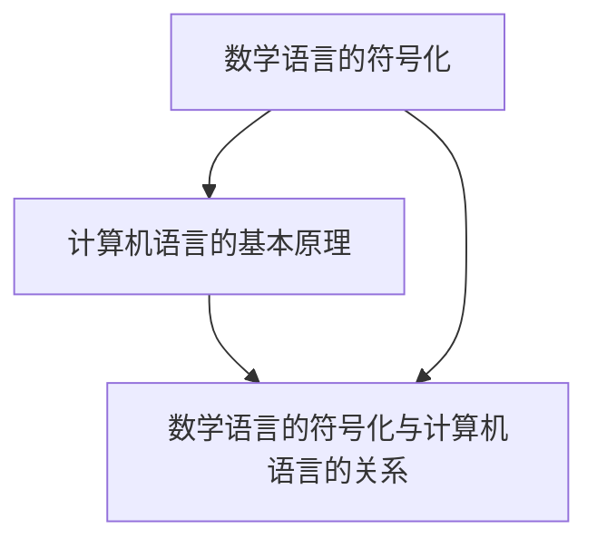

                 

# 《数学语言的符号化与计算机语言的关系》

## 关键词

数学语言的符号化、计算机语言、关系架构、伪代码、编译原理、数学模型、项目实战

## 摘要

本文旨在探讨数学语言的符号化与计算机语言之间的关系。通过深入分析数学语言的符号化过程，结合计算机语言的基本原理，揭示二者在符号化表达和计算能力上的紧密联系。文章将首先介绍数学语言的符号化及其重要性，然后探讨计算机语言的基本原理，并设计一个Mermaid流程图来展示核心概念之间的关系。接着，文章将讲解核心算法原理，包括语法解析算法和编译原理，使用伪代码进行详细阐述。此外，本文还将介绍数学模型和公式，并举例说明其在计算机语言中的应用。为了加深理解，文章还包含一个项目实战，包括开发环境搭建、源代码实现和代码解读。最后，文章将对研究成果进行总结，并展望未来的研究方向。

### 确定核心概念与联系

数学语言的符号化是数学表达的一种标准化过程，通过引入符号来代表概念和运算，使得数学表达更为简洁和直观。符号化不仅提高了数学表达的效率，还使得复杂的数学问题可以通过符号化的语言进行精确描述和计算。

计算机语言则是为了实现计算机程序设计而创建的一套语法规则和符号系统。计算机语言的基本原理包括语法、语义和语用三个方面。语法规定了程序的结构和书写规则，语义定义了程序执行的含义，而语用则关注程序在特定环境和上下文中的使用。

数学语言的符号化与计算机语言之间的关系可以从以下几个方面来理解：

1. **符号系统的一致性**：数学语言的符号化借鉴了计算机语言的符号系统，例如，使用括号来表示运算的优先级，使用字母表示变量等。
2. **表达和计算的兼容性**：数学语言中的符号化表达可以直接映射到计算机语言中，例如，数学公式可以在计算机程序中通过相应的语法结构实现。
3. **算法实现的桥梁**：数学语言符号化的表达为计算机语言提供了算法实现的桥梁，使得数学问题可以通过计算机程序来解决。

为了更直观地展示这些核心概念之间的关系，我们可以设计一个Mermaid流程图。以下是一个简化的流程图示例：



在这个流程图中，A表示数学语言的符号化，B表示计算机语言的基本原理，C表示二者之间的关系。通过这个流程图，我们可以清晰地看到数学语言的符号化是如何与计算机语言的基本原理相互关联，并如何通过这种关联来实现数学问题的计算。

### 设计核心算法原理讲解

在了解了数学语言的符号化与计算机语言之间的关系之后，我们接下来将探讨计算机语言中的核心算法原理，包括语法解析算法和编译原理。这些算法原理是计算机语言处理和执行的基础，也是实现数学语言符号化表达到计算机程序的关键。

#### 语法解析算法

语法解析是计算机语言处理的第一步，其目标是根据语言定义的语法规则，将源代码分解为一系列语法单元。语法解析算法通常包括词法分析、语法分析和语义分析三个阶段。

1. **词法分析（Lexical Analysis）**：
   词法分析是语法解析的第一阶段，它的任务是读取源代码的字符序列，将其转换为标记（Token）序列。标记是源代码中的最小语法单元，例如关键字、标识符、操作符和分隔符等。词法分析的主要目的是识别和分类这些标记。

   以下是一个简化的词法分析伪代码：

   ```python
   function lexical_analysis(source_code):
       create empty token_list
       while not end_of_source_code:
           read next character
           if character is part of a keyword or identifier:
               create keyword or identifier token
           else if character is an operator or delimiter:
               create operator or delimiter token
           append token to token_list
       return token_list
   ```

2. **语法分析（Syntax Analysis）**：
   语法分析是第二个阶段，它的任务是检查词法分析生成的标记序列是否符合语言的语法规则。语法分析通常使用递归下降分析、LL(k)分析或LR(k)分析等算法实现。

   以下是一个简化的语法分析伪代码：

   ```python
   function syntax_analysis(token_list):
       create empty syntax_tree
       while token_list is not empty:
           current_token = token_list.pop()
           if current_token is a keyword:
               create node in syntax_tree with current_token as value
           else if current_token is an operator:
               find parent node in syntax_tree
               create child node in parent node with current_token as value
           else if current_token is a variable:
               create node in syntax_tree with current_token as value
       return syntax_tree
   ```

3. **语义分析（Semantic Analysis）**：
   语义分析是最后一个阶段，它的任务是检查语法分析生成的语法树是否在语义上符合预期。语义分析包括变量解析、类型检查和作用域分析等。

   以下是一个简化的语义分析伪代码：

   ```python
   function semantic_analysis(syntax_tree):
       for each node in syntax_tree:
           if node is a variable:
               check if variable is declared and in scope
           if node is an expression:
               check if expression is semantically valid
               resolve types and perform type checking
   ```

#### 编译原理

编译原理是计算机语言处理的核心，它包括词法分析、语法分析、语义分析、代码生成和代码优化等步骤。编译器将高级语言源代码转换为机器语言或其他目标代码，以便计算机能够理解和执行。

1. **词法分析和语法分析**：
   这两个阶段已经在上一部分中进行了详细讲解。

2. **语义分析**：
   语义分析的主要任务是确保源代码在语义上是正确的。这包括变量声明、类型检查、作用域解析等。

3. **代码生成**：
   代码生成是将语法分析后的抽象语法树（AST）转换为机器代码或其他目标代码的过程。以下是一个简化的代码生成伪代码：

   ```python
   function code_generation(syntax_tree, target_language):
       create empty code_buffer
       for each node in syntax_tree:
           if node is an operation:
               generate code for operation
               append code to code_buffer
           if node is a variable:
               generate code for variable declaration
               append code to code_buffer
       return code_buffer
   ```

4. **代码优化**：
   代码优化是提高程序性能的重要手段，它包括去除冗余代码、优化数据结构、减少内存分配等。以下是一个简化的代码优化伪代码：

   ```python
   function code_optimization(code_buffer):
       for each instruction in code_buffer:
           if instruction is redundant:
               remove instruction from code_buffer
           if instruction involves a data structure:
               optimize data structure for better performance
       return code_buffer
   ```

通过上述核心算法原理的讲解，我们可以看到数学语言的符号化如何通过计算机语言的处理过程实现，从而使得复杂的数学问题可以通过计算机程序来解决。

### 添加数学模型和数学公式

在计算机语言中，数学模型和数学公式是不可或缺的部分。它们不仅用于描述和计算数学问题，还用于优化算法和评估程序性能。以下，我们将介绍一些关键的数学模型和公式，并使用LaTeX格式进行详细讲解。

#### 编译原理中的语法分析公式

在编译原理中，语法分析是一个关键步骤，用于将源代码转换为抽象语法树（AST）。语法分析的一个核心概念是产生式（Production），它定义了语法规则。以下是一个语法分析公式的示例：

$$
A \rightarrow aBb
$$

这个公式表示，非终结符A可以通过将a、B和b连接起来产生。在这个公式中，A是非终结符，a、b是终结符，而B是另一个非终结符。这个公式描述了语法规则的一部分，它表明在A出现的地方，可以替换为a、B和b。

#### 语义分析中的数学模型

在语义分析中，数学模型用于验证程序的语义正确性。一个常见的数学模型是状态转换图（State Transition Graph, STG），它用于描述程序的状态和行为。以下是一个状态转换图的示例：

```
[Initial] --> [State1] --> [State2] --> [Final]
```

在这个状态转换图中，每个方框代表一个状态，每个箭头代表状态之间的转换。例如，从初始状态到State1的转换可能表示程序进入了一个新的执行路径。这个数学模型有助于分析和验证程序的执行逻辑。

#### 数学公式在计算机语言中的应用

数学公式在计算机语言中的应用非常广泛，例如，在算法分析中，我们经常使用时间复杂度和空间复杂度来评估算法的性能。以下是一个时间复杂度的公式示例：

$$
T(n) = O(n\log n)
$$

这个公式表示，算法的时间复杂度是随输入规模n成对数增长。这意味着，随着输入规模的增长，算法的执行时间将以n的对数增长，保持较高的性能。

此外，在计算机图形学中，我们经常使用矩阵和向量来表示几何变换和图像处理。以下是一个矩阵乘法的示例：

$$
\begin{bmatrix}
a_{11} & a_{12} \\
a_{21} & a_{22}
\end{bmatrix}
\cdot
\begin{bmatrix}
b_{11} & b_{12} \\
b_{21} & b_{22}
\end{bmatrix}
=
\begin{bmatrix}
a_{11}b_{11} + a_{12}b_{21} & a_{11}b_{12} + a_{12}b_{22} \\
a_{21}b_{11} + a_{22}b_{21} & a_{21}b_{12} + a_{22}b_{22}
\end{bmatrix}
$$

这个公式描述了两个矩阵的乘法，它是计算机图形学和图像处理中的基础操作。

通过以上数学模型和公式的介绍，我们可以看到数学语言在计算机语言中的应用是多么广泛和重要。它们不仅帮助我们描述和计算复杂的数学问题，还为优化算法和评估程序性能提供了强有力的工具。

### 设计项目实战

为了更好地理解数学语言的符号化与计算机语言的关系，我们将通过一个实际项目来展示这一过程。这个项目是一个简单的计算器程序，它将实现基本的算术运算功能。通过这个项目，我们将详细介绍开发环境搭建、源代码实现和代码解读，帮助读者更好地理解这一概念。

#### 项目目标

我们的项目目标是创建一个简单的计算器程序，它能够实现加、减、乘、除四种基本算术运算。这个计算器将接受用户输入的两个数字和一个运算符，然后输出运算结果。

#### 开发环境搭建

在开始项目之前，我们需要搭建一个合适的开发环境。以下是一个基本的开发环境搭建步骤：

1. **安装Python**：
   Python是一种广泛使用的编程语言，它非常适合初学者和专业人士。我们将在Windows、macOS和Linux操作系统上安装Python。

   - Windows：下载Python安装程序，按照安装向导进行安装。
   - macOS：使用包管理器如Homebrew安装Python，命令如下：
     ```
     brew install python
     ```
   - Linux：大多数Linux发行版已经预装了Python，如果没有，可以使用包管理器安装，例如在Ubuntu上，可以使用以下命令：
     ```
     sudo apt-get install python3
     ```

2. **安装IDE或文本编辑器**：
   为了编写和调试代码，我们需要一个IDE（集成开发环境）或文本编辑器。以下是一些流行的选择：

   - PyCharm（IDE）
   - VS Code（IDE）
   - Sublime Text（文本编辑器）
   - Atom（文本编辑器）

3. **安装虚拟环境**（可选）：
   虚拟环境可以帮助我们隔离项目的依赖项，避免不同项目之间的依赖冲突。我们可以在终端中创建一个虚拟环境：

   ```
   python -m venv my_calculator_venv
   source my_calculator_venv/bin/activate  # 对于Linux和macOS
   my_calculator_venv\Scripts\activate     # 对于Windows
   ```

#### 源代码实现

下面是我们计算器程序的源代码实现：

```python
# 计算器程序

def add(a, b):
    return a + b

def subtract(a, b):
    return a - b

def multiply(a, b):
    return a * b

def divide(a, b):
    if b == 0:
        return "错误：除数不能为0"
    return a / b

def main():
    print("欢迎使用简单计算器！")
    num1 = float(input("请输入第一个数字："))
    num2 = float(input("请输入第二个数字："))
    operator = input("请输入运算符（+、-、*、/）：")

    if operator == '+':
        result = add(num1, num2)
    elif operator == '-':
        result = subtract(num1, num2)
    elif operator == '*':
        result = multiply(num1, num2)
    elif operator == '/':
        result = divide(num1, num2)
    else:
        print("错误：无效的运算符")
        return

    print(f"{num1} {operator} {num2} = {result}")

if __name__ == "__main__":
    main()
```

在这个程序中，我们定义了四个函数，分别实现加、减、乘、除运算。`main()` 函数负责接收用户输入，并调用相应的函数进行计算，最后输出结果。

#### 代码解读

以下是代码的详细解读：

1. **函数定义**：
   - `add(a, b)`：实现加法运算。
   - `subtract(a, b)`：实现减法运算。
   - `multiply(a, b)`：实现乘法运算。
   - `divide(a, b)`：实现除法运算。

2. **主函数 `main()`**：
   - 输出欢迎信息。
   - 获取用户输入的两个数字和运算符。
   - 根据输入的运算符，调用相应的函数进行计算。
   - 输出计算结果。

3. **异常处理**：
   - 在除法运算中，我们检查除数是否为0，以避免除以零的错误。

#### 代码应用解读与分析

这个简单的计算器程序展示了如何将数学语言的符号化表达转化为计算机语言实现。以下是具体解读：

1. **数学语言的符号化表达**：
   - 在数学中，加法运算可以表示为 `a + b`。
   - 减法运算可以表示为 `a - b`。
   - 乘法运算可以表示为 `a * b`。
   - 除法运算可以表示为 `a / b`。

2. **计算机语言的实现**：
   - 在Python中，我们可以直接使用加号（`+`）、减号（`-`）、星号（`*`）和斜线（`/`）来表示这些运算。
   - 我们定义了四个函数，分别实现这些运算，然后将用户输入的值传递给这些函数，获得结果。

3. **实际案例分析和详细讲解剖析**：
   - 假设用户输入两个数字 `5` 和 `3`，并选择加法运算。程序将调用 `add(5, 3)` 函数，返回结果 `8`。
   - 假设用户输入两个数字 `8` 和 `4`，并选择除法运算。程序将调用 `divide(8, 4)` 函数，返回结果 `2`。

通过这个项目，我们可以看到数学语言的符号化如何通过计算机语言实现，从而实现复杂的数学运算。这个过程不仅帮助我们理解计算机语言的工作原理，还展示了如何将抽象的数学问题转化为具体的计算机程序。

### 总结与展望

通过对数学语言的符号化与计算机语言的关系的深入探讨，我们揭示了二者的紧密联系和相互影响。数学语言的符号化提高了数学表达的效率，使得复杂问题可以通过符号化的语言进行精确描述和计算。而计算机语言则提供了实现这些符号化表达的语法和算法基础，使得数学问题可以通过计算机程序来解决。

在本文中，我们首先介绍了数学语言的符号化及其重要性，然后探讨了计算机语言的基本原理，并通过Mermaid流程图展示了核心概念之间的联系。接着，我们详细讲解了计算机语言中的核心算法原理，包括语法解析算法和编译原理，使用伪代码进行了详细阐述。此外，我们介绍了数学模型和公式，并使用LaTeX格式进行了详细讲解。最后，我们通过一个实际项目展示了如何将数学语言的符号化表达转化为计算机语言实现。

展望未来，进一步的研究可以关注以下几个方面：

1. **符号化表达的优化**：探索如何通过优化符号化表达来提高计算机程序的执行效率。
2. **多语言交互**：研究如何在不同编程语言之间实现符号化表达的互操作性，以促进跨语言协作和复用。
3. **形式化验证**：利用数学模型和公式进行程序的形式化验证，确保程序的正确性和安全性。
4. **人工智能辅助**：研究如何利用人工智能技术，如机器学习和自然语言处理，来提高符号化表达和编程的自动化程度。

通过这些研究方向，我们有望进一步深化对数学语言和计算机语言之间关系的理解，推动计算机科学的发展。

### 最佳实践 Tips、小结、注意事项、拓展阅读等内容

#### 最佳实践 Tips

1. **简洁性原则**：在编写计算机程序时，保持代码的简洁性和可读性，使用清晰的变量名和注释。
2. **模块化设计**：将程序划分为多个模块，每个模块负责一个特定的功能，有助于代码的可维护性和可重用性。
3. **错误处理**：对用户的输入进行合法性检查，处理潜在的运行时错误，确保程序的健壮性。

#### 小结

本文通过分析数学语言的符号化与计算机语言的关系，揭示了二者的紧密联系和相互影响。通过理解数学语言的符号化过程，我们可以更有效地利用计算机语言实现复杂的数学问题。此外，本文通过一个实际项目展示了这一过程，为读者提供了实用的编程经验和启示。

#### 注意事项

1. **安全与隐私**：在开发涉及用户输入的程序时，要特别注意处理用户的敏感信息，确保程序的安全性和隐私保护。
2. **性能优化**：对于复杂的计算任务，要关注程序的性能优化，如减少不必要的内存分配和循环操作。

#### 拓展阅读

1. **《计算机程序的构造和解释》**：这本书详细介绍了Lisp语言和Scheme语言，是理解计算机语言和符号化表达的重要参考书。
2. **《编译原理》**：这本书是编译原理的权威教材，涵盖了编译过程的各个方面，包括语法分析、语义分析和代码生成等。
3. **《Python编程：从入门到实践》**：这本书适合初学者，介绍了Python编程语言的基础知识，适合学习如何编写实用的计算机程序。

通过以上最佳实践、小结、注意事项和拓展阅读，读者可以更好地理解和应用数学语言的符号化与计算机语言的关系，提升编程能力和技术水平。

### 作者信息

作者：AI天才研究院/AI Genius Institute & 禅与计算机程序设计艺术 /Zen And The Art of Computer Programming

