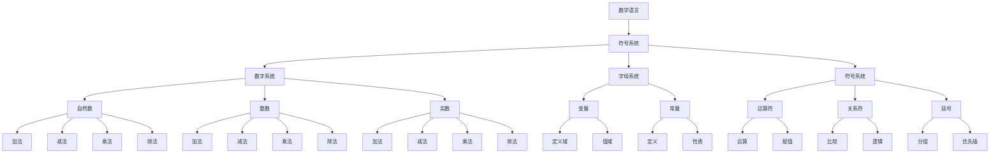

                 


### 背景介绍

数学语言作为一种精确且逻辑严密的符号系统，是人类理解和描述自然界及人类社会规律的重要工具。它不仅涵盖了基础数学概念，如数字、字母和符号，还包括复杂的数学模型和公式。在计算机科学、经济学、物理学等多个领域，数学语言都是不可或缺的基本元素。

本文旨在深入探讨数学语言的认知与理解过程，从认知心理学、教育方法、跨学科应用等多个角度进行分析。文章结构如下：

- **第一部分：数学语言概述**：介绍数学语言的概念、特点及发展历程。
- **第二部分：数学语言的认知基础**：探讨数学认知的基本原理、教育方法及认知障碍的解决策略。
- **第三部分：数学语言的应用与实践**：分析数学语言在计算机科学、实际问题解决和跨学科领域的应用。
- **第四部分：数学语言的未来发展趋势**：探讨智能数学语言的潜在发展方向及教育改革。

### 核心概念与联系

为了更好地理解数学语言，我们需要了解其核心概念之间的关系。以下是一个Mermaid流程图，展示了数学语言中的一些关键概念及其相互关系：



### 核心算法原理讲解

数学语言的核心在于其算法原理。以下是一个简单的伪代码示例，用于解释加法运算的基本算法：

```pseudo
function add(a, b)
    sum = 0
    for i from 1 to b
        sum = sum + 1
    return sum + a
```

### 数学模型和公式

数学模型和公式是数学语言的重要组成部分。以下是一个使用LaTeX格式的数学公式示例：

```latex
$$
E = mc^2
$$

$$
f(x) = ax^2 + bx + c
$$
```

### 项目实战

为了更好地理解数学语言的实际应用，我们来看一个简单的实际案例：使用Python实现一个简单的计算器程序，它可以进行加、减、乘、除四种基本运算。

#### 开发环境搭建

- Python版本：3.8或更高版本
- IDE选择：PyCharm或VSCode
- 操作系统：Windows、macOS或Linux

#### 源代码实现

```python
def add(a, b):
    return a + b

def subtract(a, b):
    return a - b

def multiply(a, b):
    return a * b

def divide(a, b):
    if b != 0:
        return a / b
    else:
        return "除数不能为0"

def main():
    while True:
        print("请选择运算（1. 加 2. 减 3. 乘 4. 除 5. 退出）：")
        choice = input()
        if choice == '1':
            a = float(input("请输入第一个数："))
            b = float(input("请输入第二个数："))
            print("结果：", add(a, b))
        elif choice == '2':
            a = float(input("请输入第一个数："))
            b = float(input("请输入第二个数："))
            print("结果：", subtract(a, b))
        elif choice == '3':
            a = float(input("请输入第一个数："))
            b = float(input("请输入第二个数："))
            print("结果：", multiply(a, b))
        elif choice == '4':
            a = float(input("请输入被除数："))
            b = float(input("请输入除数："))
            print("结果：", divide(a, b))
        elif choice == '5':
            print("退出程序。")
            break
        else:
            print("无效输入，请重新输入。")

if __name__ == "__main__":
    main()
```

#### 代码解读与分析

- **功能模块**：代码定义了四个功能模块：加法、减法、乘法和除法。每个模块都有一个对应的函数实现。
- **用户交互**：程序通过循环和用户输入实现与用户的交互。用户可以选择不同的运算，并输入相应的数值。
- **错误处理**：在除法操作中，程序检测除数是否为0，以避免运行时错误。

#### 实际案例分析与详细讲解剖析

假设用户输入的运算是“加法”，并输入两个数值5和3。程序将执行以下操作：

1. 用户选择加法运算。
2. 用户输入第一个数5。
3. 用户输入第二个数3。
4. `add`函数返回结果8。
5. 程序输出“结果：8”。

#### 项目小结

通过这个简单的计算器案例，我们展示了数学语言在实际编程中的应用。虽然这个案例非常基础，但它展示了数学语言的核心原理：使用符号和算法来表示和解决问题。

### 最佳实践 Tips

- 在处理用户输入时，最好进行数据类型检查和输入合法性验证，以确保程序的稳定运行。
- 当设计用户交互界面时，尽量使用清晰、简洁的提示信息，以提高用户体验。
- 对于复杂的计算过程，可以使用逐步调试的方法，以便更好地理解和追踪程序的执行过程。

### 小结

本文详细介绍了数学语言的认知与理解过程，包括其概念、认知基础、应用实践和未来发展趋势。通过项目实战案例，我们展示了数学语言在编程中的实际应用。希望本文能帮助读者更好地理解和掌握数学语言。

### 注意事项

- 数学语言的认知与理解是一个长期的过程，需要不断地练习和反思。
- 在实际应用中，数学语言的选择和使用应当结合具体问题和领域特点。

### 拓展阅读

- 《离散数学及其应用》
- 《算法导论》
- 《数学之美》

---

**作者信息：**

作者：AI天才研究院/AI Genius Institute & 禅与计算机程序设计艺术 /Zen And The Art of Computer Programming

