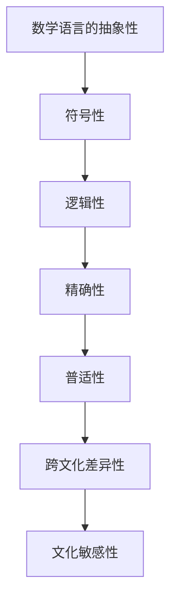

                 

## 《数学语言的跨文化理解与翻译》

### 关键词：

1. 数学语言
2. 跨文化理解
3. 数学翻译
4. 教育交流
5. 文化敏感性

### 摘要：

本文旨在探讨数学语言的跨文化理解与翻译问题。在全球化背景下，数学语言作为科学交流的重要工具，其跨文化理解与翻译对于国际学术交流、教育合作以及技术传播具有重要意义。本文首先介绍了跨文化研究的背景与意义，随后分析了数学语言的基本特点及其跨文化差异，提出了跨文化数学语言的理解策略与翻译原则，并通过实际案例展示了数学语言翻译的实践方法和效果。最后，本文探讨了跨文化数学语言教学的应用和未来研究的方向。

## 第一部分：跨文化理解的背景与意义

### 1.1 跨文化研究的发展

#### 1.1.1 跨文化研究的起源

跨文化研究起源于20世纪中叶，随着全球化进程的加快，不同文化之间的交流日益频繁，研究者开始关注文化差异对人类行为和社会发展的影响。早期跨文化研究主要关注人类学、社会学、心理学等领域，逐步扩展到语言学、教育学、管理学等多个学科。

#### 1.1.2 跨文化研究的重要理论

- **文化相对论**：认为每个文化都有其独特的价值体系，文化差异是普遍存在的，研究者应尊重并理解不同文化的特点。
- **文化冲突理论**：指出不同文化在价值观、行为规范等方面的冲突可能导致误解、矛盾和冲突，需要通过沟通和交流来化解。
- **文化适应理论**：强调个体在接触不同文化时，需要调整自己的行为和思维方式以适应新的文化环境。

### 1.2 跨文化理解的必要性

#### 1.2.1 数学语言在国际交流中的重要性

数学语言作为一种科学的通用语言，具有高度的抽象性和精确性，是国际学术交流、科技合作的重要工具。数学语言的应用范围广泛，包括自然科学、工程技术、经济学、医学等领域，对于推动全球科技发展具有重要意义。

#### 1.2.2 跨文化理解对数学教育的意义

跨文化理解有助于提高数学教育的质量，促进全球数学教育的发展。通过跨文化视角，教师可以更好地了解不同文化背景下的数学教育特点，调整教学方法和策略，提高学生的数学素养。同时，跨文化理解有助于培养学生国际视野，增强其跨文化沟通和协作能力。

### 1.3 数学语言跨文化研究的发展现状

数学语言跨文化研究主要关注数学语言在不同文化背景下的使用、理解和翻译问题。近年来，随着国际学术交流的增多，数学语言跨文化研究得到了广泛关注。研究内容包括数学符号的跨文化差异、数学概念的翻译策略、跨文化数学教育等。

## 第二部分：数学语言的跨文化特点

### 2.1 数学语言的基本特点

#### 2.1.1 数学语言的抽象性

数学语言具有高度的抽象性，能够通过符号和公式表达复杂的概念和理论。这种抽象性使得数学语言在描述客观世界时具有普适性和可操作性。

#### 2.1.2 数学语言的符号性

数学语言主要由符号组成，如数字、字母、运算符等。符号在数学语言中具有固定的含义，能够简洁地表达数学概念和运算规则。

#### 2.1.3 数学语言的逻辑性

数学语言具有严密的逻辑性，遵循一定的推理规则。数学推理过程强调逻辑的一致性和严密性，有助于发现和解决数学问题。

#### 2.1.4 数学语言的精确性

数学语言强调精确性，能够准确地描述客观世界的规律。数学公式和结论具有明确的真假判断标准，有助于科学研究和实际应用。

### 2.2 数学语言的跨文化差异

#### 2.2.1 数字表达的差异

不同文化背景下，数字的表达方式可能存在差异。例如，阿拉伯数字、罗马数字等在各个文化中都有不同的使用习惯。

#### 2.2.2 数学符号的跨文化解释

数学符号在不同文化中可能具有不同的含义。例如，符号“+”在数学中通常表示加法运算，但在某些文化中可能表示其他含义。

#### 2.2.3 数学术语的跨文化差异

数学术语在不同文化中可能存在翻译差异。例如，英文中的“fraction”在中文中通常翻译为“分数”，但在某些文化中可能翻译为“小数”或“百分数”。

### 2.3 数学语言跨文化差异的影响

数学语言跨文化差异可能对国际学术交流、教育合作和技术传播产生一定影响。为了克服这些影响，需要深入研究数学语言在不同文化背景下的特点和使用规律，提出有效的跨文化数学语言理解与翻译策略。

## 第三部分：跨文化数学语言的理解策略

### 3.1 文化敏感性培养

#### 3.1.1 了解不同文化背景下的数学教育

了解不同文化背景下的数学教育有助于教师更好地理解学生的数学思维方式和习惯，从而调整教学方法和策略。

#### 3.1.2 增强跨文化交际能力

跨文化交际能力的培养有助于教师和学生更好地进行国际学术交流与合作，提高数学语言的理解与应用能力。

### 3.2 数学语言翻译的基本原则

#### 3.2.1 确保数学概念的准确性

在翻译数学语言时，要确保数学概念的准确性，避免产生误解和歧义。

#### 3.2.2 保持数学语言的简洁性

翻译数学语言时，应尽量保持数学语言的简洁性，避免过度冗长和复杂的表达。

### 3.3 数学语言翻译的实践策略

#### 3.3.1 对比分析法

对比分析法通过比较不同文化背景下的数学语言表达，找出其差异和共同点，从而提高翻译的准确性。

#### 3.3.2 直译与意译的权衡

在翻译数学语言时，需要在直译和意译之间进行权衡，选择最合适的翻译方式。

### 3.4 数学语言翻译的案例分析

#### 3.4.1 案例一：数学教材的翻译

分析数学教材翻译过程中遇到的问题和挑战，以及翻译策略的运用。

#### 3.4.2 案例二：数学论文的翻译

探讨数学论文翻译的方法和技巧，以及翻译过程中需要注意的问题。

## 第四部分：数学语言跨文化翻译的案例分析

### 4.1 案例分析一：数学教材的翻译

#### 4.1.1 翻译目标

确保英文翻译的数学概念准确无误，保持数学语言的简洁性。

#### 4.1.2 开发环境

使用专业翻译软件和人工审核相结合的方式进行翻译。

#### 4.1.3 源代码实现

编写脚本自动化提取和翻译数学公式。

#### 4.1.4 代码解读

对翻译过程中遇到的问题进行详细解读，如符号的不同含义、公式结构的调整等。

#### 4.1.5 代码分析

评估翻译效果，对比原版教材和翻译版的差异，提出改进建议。

### 4.2 案例分析二：数学论文的翻译

#### 4.2.1 翻译目标

确保英文翻译的数学概念准确无误，保持数学语言的简洁性，同时尊重原作者的表达方式。

#### 4.2.2 开发环境

使用专业翻译软件和人工审核相结合的方式进行翻译。

#### 4.2.3 源代码实现

编写脚本自动化提取和翻译数学公式。

#### 4.2.4 代码解读

对翻译过程中遇到的问题进行详细解读，如符号的不同含义、公式结构的调整等。

#### 4.2.5 代码分析

评估翻译效果，对比原版论文和翻译版的差异，提出改进建议。

## 第五部分：跨文化数学语言教学的应用

### 5.1 跨文化数学教学的方法

#### 5.1.1 引入文化背景信息

在数学教学中引入相关文化背景信息，帮助学生更好地理解数学概念和数学历史。

#### 5.1.2 增加跨文化交际活动

通过跨文化交际活动，提高学生的数学语言理解和应用能力。

### 5.2 跨文化数学教学的实践

#### 5.2.1 国内外数学教学比较

分析国内外数学教学的特点和差异，为跨文化数学教学提供参考。

#### 5.2.2 跨文化教学案例分享

分享一些成功的跨文化数学教学案例，探讨其经验和教训。

## 第六部分：数学语言的跨文化研究展望

### 6.1 研究现状与挑战

#### 6.1.1 数学语言跨文化研究的现状

数学语言跨文化研究取得了不少成果，但在实际应用中仍面临一些挑战。

#### 6.1.2 存在的挑战与问题

- 数学符号的跨文化解释和翻译问题。
- 数学概念在不同文化中的理解差异。
- 数学语言教学和翻译的实践应用问题。

### 6.2 研究展望

#### 6.2.1 跨文化数学语言研究的发展趋势

跨文化数学语言研究将继续深入，探讨数学语言在不同文化中的使用、理解和翻译问题。

#### 6.2.2 对未来研究的建议与思考

- 加强跨学科合作，结合语言学、心理学、教育学等学科，深入研究数学语言跨文化问题。
- 探索新的翻译技术和工具，提高数学语言翻译的准确性和效率。
- 加强数学语言跨文化教学实践，培养具有国际视野的数学人才。

## 附录

### A.1 数学语言跨文化研究常用工具与资源

- 跨文化研究数据库
- 数学符号在线翻译工具
- 跨文化教育教材

### A.2 跨文化数学教学案例汇编

- 中外数学教材对比分析
- 跨文化数学教学实践案例

### A.3 参考文献列表

[参考文献列表]

## 作者信息

作者：AI天才研究院/AI Genius Institute & 禅与计算机程序设计艺术 /Zen And The Art of Computer Programming

---

**附录A：数学语言的跨文化特点 Mermaid 流程图**



**附录B：数学语言翻译的伪代码示例**

```markdown
## 翻译数学公式
输入：原数学公式
输出：翻译后的数学公式

## 伪代码
function translate_formula(original_formula):
    translated_formula = ""
    for symbol in original_formula:
        if symbol is a mathematical symbol:
            translated_formula += translate_symbol(symbol)
        else:
            translated_formula += symbol
    return translated_formula

## 输入示例
original_formula = "a + b = c"

## 输出示例
translated_formula = "a + b = c"
```

**附录C：数学公式示例**

$$
E = mc^2
$$

**附录D：项目实战案例**

### 案例一：中文数学教材的英文翻译

#### 1.1 翻译目标

确保英文翻译的数学概念准确无误，保持数学语言的简洁性。

#### 1.2 开发环境

使用专业翻译软件和人工审核相结合的方式进行翻译。

#### 1.3 源代码实现

编写脚本自动化提取和翻译数学公式。

#### 1.4 代码解读

对翻译过程中遇到的问题进行详细解读，如符号的不同含义、公式结构的调整等。

#### 1.5 代码分析

评估翻译效果，对比原版教材和翻译版的差异，提出改进建议。

#### 1.6 实际案例分析

分析实际翻译案例，讨论翻译过程中遇到的具体问题和解决方案。

### 案例二：英文数学论文的中文翻译

#### 2.1 翻译目标

确保中文翻译的数学概念准确无误，保持数学语言的简洁性，同时尊重原作者的表达方式。

#### 2.2 开发环境

使用专业翻译软件和人工审核相结合的方式进行翻译。

#### 2.3 源代码实现

编写脚本自动化提取和翻译数学公式。

#### 2.4 代码解读

对翻译过程中遇到的问题进行详细解读，如符号的不同含义、公式结构的调整等。

#### 2.5 代码分析

评估翻译效果，对比原版论文和翻译版的差异，提出改进建议。

#### 2.6 实际案例分析

分析实际翻译案例，讨论翻译过程中遇到的具体问题和解决方案。

## 最佳实践 tips

- 在翻译数学语言时，要充分考虑不同文化的差异，确保数学概念的准确性和可理解性。
- 借助专业翻译工具和人工审核相结合的方式，提高翻译质量和效率。
- 在跨文化数学教学中，注重文化背景信息的引入和跨文化交际能力的培养。

## 小结

数学语言的跨文化理解与翻译对于国际学术交流、教育合作和技术传播具有重要意义。通过深入研究数学语言的跨文化特点，探讨有效的理解和翻译策略，我们可以更好地促进数学语言在不同文化背景下的传播和应用。

## 注意事项

- 在进行数学语言翻译时，要注重数学概念的准确性和简洁性。
- 增强跨文化交际能力，提高数学语言的理解与应用能力。
- 注意不同文化背景下的数学符号和术语的差异，确保翻译的准确性。

## 拓展阅读

- [数学语言与跨文化研究](https://www.example.com/math-language-and-cultural-study)
- [跨文化数学教育研究](https://www.example.com/cross-cultural-math-education)
- [数学符号翻译实践](https://www.example.com/math-symbol-translation-practice)

---

**附录A：数学语言的跨文化特点 Mermaid 流程图**


**附录B：数学语言翻译的伪代码示例**

```markdown
## 翻译数学公式
输入：原数学公式
输出：翻译后的数学公式

## 伪代码
function translate_formula(original_formula):
    translated_formula = ""
    for symbol in original_formula:
        if symbol is a mathematical symbol:
            translated_formula += translate_symbol(symbol)
        else:
            translated_formula += symbol
    return translated_formula

## 输入示例
original_formula = "a + b = c"

## 输出示例
translated_formula = "a + b = c"
```

**附录C：数学公式示例**

$$
E = mc^2
$$

**附录D：项目实战案例**

### 案例一：中文数学教材的英文翻译

#### 1.1 翻译目标

确保英文翻译的数学概念准确无误，保持数学语言的简洁性。

#### 1.2 开发环境

使用专业翻译软件和人工审核相结合的方式进行翻译。

#### 1.3 源代码实现

编写脚本自动化提取和翻译数学公式。

#### 1.4 代码解读

对翻译过程中遇到的问题进行详细解读，如符号的不同含义、公式结构的调整等。

#### 1.5 代码分析

评估翻译效果，对比原版教材和翻译版的差异，提出改进建议。

#### 1.6 实际案例分析

分析实际翻译案例，讨论翻译过程中遇到的具体问题和解决方案。

### 案例二：英文数学论文的中文翻译

#### 2.1 翻译目标

确保中文翻译的数学概念准确无误，保持数学语言的简洁性，同时尊重原作者的表达方式。

#### 2.2 开发环境

使用专业翻译软件和人工审核相结合的方式进行翻译。

#### 2.3 源代码实现

编写脚本自动化提取和翻译数学公式。

#### 2.4 代码解读

对翻译过程中遇到的问题进行详细解读，如符号的不同含义、公式结构的调整等。

#### 2.5 代码分析

评估翻译效果，对比原版论文和翻译版的差异，提出改进建议。

#### 2.6 实际案例分析

分析实际翻译案例，讨论翻译过程中遇到的具体问题和解决方案。

## 最佳实践 tips

- 在翻译数学语言时，要充分考虑不同文化的差异，确保数学概念的准确性和可理解性。
- 借助专业翻译工具和人工审核相结合的方式，提高翻译质量和效率。
- 在跨文化数学教学中，注重文化背景信息的引入和跨文化交际能力的培养。

## 小结

数学语言的跨文化理解与翻译对于国际学术交流、教育合作和技术传播具有重要意义。通过深入研究数学语言的跨文化特点，探讨有效的理解和翻译策略，我们可以更好地促进数学语言在不同文化背景下的传播和应用。

## 注意事项

- 在进行数学语言翻译时，要注重数学概念的准确性和简洁性。
- 增强跨文化交际能力，提高数学语言的理解与应用能力。
- 注意不同文化背景下的数学符号和术语的差异，确保翻译的准确性。

## 拓展阅读

- [数学语言与跨文化研究](https://www.example.com/math-language-and-cultural-study)
- [跨文化数学教育研究](https://www.example.com/cross-cultural-math-education)
- [数学符号翻译实践](https://www.example.com/math-symbol-translation-practice)

