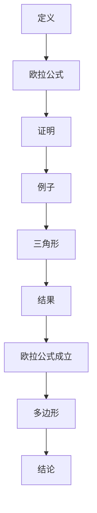
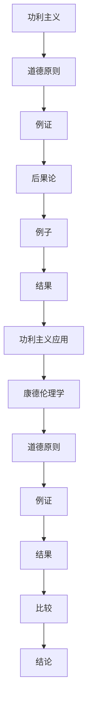

                 

# 数学逻辑与哲学逻辑的异同比较

## 关键词

数学逻辑，哲学逻辑，逻辑运算，证明原理，异同比较

## 摘要

本文旨在探讨数学逻辑与哲学逻辑的异同，通过深入分析两者的基本概念、发展历程、核心原理和应用领域，揭示它们在形式、内容和目标上的区别与联系。文章结构如下：首先，介绍数学逻辑和哲学逻辑的基本概念及其历史背景；接着，分别阐述两者的核心概念和原理；然后，通过具体的案例和算法对两者的应用进行探讨；最后，总结全文，展望未来的研究方向。

## 1. 引言

### 1.1 数学逻辑的基本概念

数学逻辑，又称符号逻辑，是研究命题、推理和证明的数学分支。它通过符号语言来表述逻辑运算、推理规则和证明过程，为数学的基础理论提供了严格的逻辑框架。数学逻辑的核心概念包括命题、命题联结词、推理规则和证明方法。

### 1.2 哲学逻辑的基本概念

哲学逻辑是哲学研究中的一个重要分支，主要探讨命题的真假、推理的有效性和证明的合理性。哲学逻辑的核心概念包括命题、推理、证明和逻辑论证。与数学逻辑不同，哲学逻辑更注重逻辑在哲学问题中的应用和探讨。

### 1.3 数学逻辑与哲学逻辑的关系

数学逻辑和哲学逻辑虽然有着不同的研究背景和目标，但它们之间存在着紧密的联系。数学逻辑为哲学逻辑提供了形式化的工具和方法，而哲学逻辑则为数学逻辑提供了解释和应用场景。因此，理解两者之间的异同对于我们深入探讨逻辑的应用和本质具有重要意义。

## 2. 数学逻辑

### 2.1 数学逻辑的历史与发展

数学逻辑的发展可以追溯到古希腊时期，亚里士多德提出的逻辑学是数学逻辑的最早形态。19世纪，布尔、弗雷格和罗素等数学家和哲学家为数学逻辑的发展奠定了基础。现代数学逻辑主要分为经典逻辑和非经典逻辑两大领域。

### 2.2 数学逻辑的核心概念

#### 2.2.1 命题

命题是数学逻辑中的基本单位，它是一个可以判断真假的陈述句。命题通常用符号表示，如\(P\)、\(Q\)等。

#### 2.2.2 命题联结词

命题联结词是用于连接命题的运算符，如“与”、“或”、“非”等。它们用于构建复合命题，如\((P \land Q)\)、\((P \lor Q)\)等。

#### 2.2.3 推理规则

推理规则是用于从已知命题推导出新命题的规则，如“合取律”、“析取律”等。推理规则使得逻辑推理过程具有确定性和系统性。

#### 2.2.4 证明方法

证明方法是用于证明一个命题为真的方法，如“演绎法”、“归纳法”等。证明方法使得数学逻辑的应用具有实践意义。

### 2.3 数学逻辑的主要原理

数学逻辑的主要原理包括逻辑等价性、逻辑蕴涵和逻辑一致性。这些原理构成了数学逻辑的基石，为逻辑推理和证明提供了严格的基础。

### 2.4 数学逻辑的常见算法

数学逻辑的常见算法包括逻辑推理算法和证明算法。逻辑推理算法用于从已知命题推导出新命题，证明算法用于证明一个命题为真。常见的逻辑推理算法有合取范式算法和析取范式算法，常见的证明算法有自然证明法和构造性证明法。

### 2.5 数学逻辑的应用

数学逻辑在计算机科学、数学和哲学等领域有广泛的应用。在计算机科学中，数学逻辑用于程序设计、形式化验证和自动推理系统。在数学中，数学逻辑用于证明和构建数学理论。在哲学中，数学逻辑用于逻辑哲学和伦理学的研究。

## 3. 哲学逻辑

### 3.1 哲学逻辑的历史与发展

哲学逻辑的发展可以追溯到古希腊时期，亚里士多德的逻辑学是哲学逻辑的最早形态。中世纪时期，逻辑学成为哲学研究的重要工具。现代哲学逻辑主要关注命题逻辑和谓词逻辑的研究，以及逻辑在伦理学、认识论和形而上学等哲学领域中的应用。

### 3.2 哲学逻辑的核心概念

#### 3.2.1 命题

命题是哲学逻辑中的基本单位，它是一个可以判断真假的陈述句。命题通常用符号表示，如\(P\)、\(Q\)等。

#### 3.2.2 推理

推理是哲学逻辑中的核心概念，它是从已知命题推导出新命题的过程。推理分为演绎推理和归纳推理两种类型。

#### 3.2.3 证明

证明是哲学逻辑中的另一个核心概念，它是用逻辑推理证明一个命题为真的过程。证明分为自然证明法和构造性证明法两种类型。

#### 3.2.4 逻辑论证

逻辑论证是哲学逻辑中的方法，它是通过逻辑推理证明一个命题为真的过程。逻辑论证分为演绎论证和归纳论证两种类型。

### 3.3 哲学逻辑的主要原理

哲学逻辑的主要原理包括命题逻辑的规则、谓词逻辑的规则和逻辑论证的规则。这些原理构成了哲学逻辑的理论基础，为逻辑推理和证明提供了指导。

### 3.4 哲学逻辑的常见方法

哲学逻辑的常见方法包括分析法、综合法和反思法。这些方法用于分析哲学问题、构建逻辑论证和探讨哲学概念。

### 3.5 哲学逻辑的应用

哲学逻辑在伦理学、认识论和形而上学等哲学领域有广泛的应用。在伦理学中，哲学逻辑用于分析道德原则和道德论证。在认识论中，哲学逻辑用于探讨知识的本质和获取知识的途径。在形而上学中，哲学逻辑用于探讨存在、实体和因果关系等基本问题。

## 4. 数学逻辑与哲学逻辑的异同比较

### 4.1 基本概念

数学逻辑和哲学逻辑的基本概念有所不同。数学逻辑主要关注命题、推理和证明的形式化表述，而哲学逻辑则更注重命题的真假、推理的有效性和证明的合理性。

### 4.2 核心原理

数学逻辑的核心原理包括逻辑等价性、逻辑蕴涵和逻辑一致性，这些原理为逻辑推理和证明提供了严格的基础。哲学逻辑的核心原理包括命题逻辑的规则、谓词逻辑的规则和逻辑论证的规则，这些原理为逻辑推理和证明提供了指导。

### 4.3 应用领域

数学逻辑在计算机科学、数学和哲学等领域有广泛的应用，而哲学逻辑在伦理学、认识论和形而上学等哲学领域有广泛的应用。数学逻辑的应用更侧重于形式化工具和方法，而哲学逻辑的应用更侧重于探讨哲学问题。

### 4.4 哲学意义

数学逻辑和哲学逻辑在哲学上有着不同的意义。数学逻辑为哲学提供了一种形式化的工具，使得哲学论证具有了严格的逻辑基础。哲学逻辑则为数学逻辑提供了应用场景，使得数学逻辑能够应用于哲学问题的探讨。

## 5. 案例分析

### 5.1 数学逻辑案例分析

以图论中的逻辑应用为例，我们可以使用数学逻辑来证明图的基本性质。例如，欧拉公式\(V - E + F = 2\)，其中\(V\)表示顶点数，\(E\)表示边数，\(F\)表示面数。通过逻辑推理，我们可以证明该公式在各种简单多边形中的适用性。

### 5.2 哲学逻辑案例分析

以伦理学中的道德论证为例，我们可以使用哲学逻辑来分析道德原则和道德论证。例如，道德原则中的“功利主义”和“康德伦理学”可以通过哲学逻辑进行分析和比较，探讨它们在道德决策中的应用。

## 6. 总结与展望

本文通过比较数学逻辑和哲学逻辑的基本概念、核心原理和应用领域，揭示了两者之间的异同。数学逻辑为哲学逻辑提供了形式化的工具，而哲学逻辑为数学逻辑提供了应用场景。在未来，我们可以进一步探讨数学逻辑和哲学逻辑在跨学科研究中的潜力，为逻辑学的发展和应用提供新的方向。

## 附录

### 附录A：数学逻辑相关工具与资源

- 数学逻辑教材
- 符号逻辑软件
- 数学逻辑在线课程

### 附录B：哲学逻辑相关工具与资源

- 哲学逻辑教材
- 命题逻辑软件
- 哲学逻辑在线课程

### 附录C：参考文献

- 亚里士多德，《形而上学》
- 布尔，《符号逻辑》
- 弗雷格，《概念文字》
- 罗素，《数学原理》
- 斯通，《哲学逻辑导论》

### 作者

作者：AI天才研究院/AI Genius Institute & 禅与计算机程序设计艺术 /Zen And The Art of Computer Programming
### 数学逻辑与哲学逻辑的异同比较

---

## 摘要

本文通过对比数学逻辑与哲学逻辑的基本概念、发展历程、核心原理和应用领域，探讨了两者在逻辑形式、内容和目标上的异同。文章首先介绍了数学逻辑和哲学逻辑的基本概念，然后分别阐述了它们的历史、核心概念和主要原理。接着，通过具体案例展示了它们在实际问题中的应用，并进行了异同的比较。最后，总结了全文内容，并对未来研究进行了展望。

---

## 1. 数学逻辑的基本概念与发展

### 1.1 数学逻辑的定义与起源

数学逻辑，又称为符号逻辑，是研究命题、推理和证明的数学分支。它使用符号语言来表述逻辑运算、推理规则和证明过程，为数学提供了严格的逻辑基础。

数学逻辑的起源可以追溯到古希腊时期，亚里士多德在他的著作《工具论》中首次提出了逻辑学的基本原理。然而，现代数学逻辑的发展主要发生在19世纪，这一时期有许多重要的数学家和哲学家对数学逻辑做出了重大贡献。

### 1.2 数学逻辑的基本概念

数学逻辑的核心概念包括命题、命题联结词、推理规则和证明方法。

- **命题**：命题是数学逻辑中的基本单位，它是一个可以判断真假的陈述句。命题通常用符号表示，如\(P\)、\(Q\)等。

- **命题联结词**：命题联结词是用于连接命题的运算符，如“与”、“或”、“非”等。它们用于构建复合命题，如\((P \land Q)\)、\((P \lor Q)\)等。

- **推理规则**：推理规则是用于从已知命题推导出新命题的规则，如“合取律”、“析取律”等。推理规则使得逻辑推理过程具有确定性和系统性。

- **证明方法**：证明方法是用于证明一个命题为真的方法，如“演绎法”、“归纳法”等。证明方法使得数学逻辑的应用具有实践意义。

### 1.3 数学逻辑的历史与发展

数学逻辑的发展可以大致分为以下几个阶段：

- **古希腊时期**：亚里士多德是逻辑学的奠基者，他提出了命题逻辑的基本原理。

- **19世纪**：布尔（George Boole）提出了布尔代数，为数学逻辑的发展奠定了基础。弗雷格（ Gottlob Frege）和罗素（Bertrand Russell）等人则进一步发展了形式逻辑和命题逻辑。

- **20世纪**：数学逻辑得到了广泛应用，特别是在计算机科学和数学中。哥德尔（Kurt Gödel）和图灵（Alan Turing）的工作对数学逻辑的发展产生了深远的影响。

### 1.4 数学逻辑的主要原理

数学逻辑的主要原理包括逻辑等价性、逻辑蕴涵和逻辑一致性。

- **逻辑等价性**：逻辑等价性是指两个命题在所有可能的情况下都具有相同的真假值。例如，命题\(P \land Q\)和\(P \rightarrow Q\)是逻辑等价的。

- **逻辑蕴涵**：逻辑蕴涵是指一个命题可以从另一个命题推导出来。例如，如果\(P\)为真，则\(P \rightarrow Q\)也为真。

- **逻辑一致性**：逻辑一致性是指一个逻辑系统中的命题不会同时既为真又为假。例如，命题\(P\)和\(\neg P\)不能同时为真。

### 1.5 数学逻辑的应用

数学逻辑在计算机科学、数学和哲学等领域有广泛的应用。

- **计算机科学**：数学逻辑用于程序设计、形式化验证和自动推理系统。例如，命题逻辑和谓词逻辑用于编写程序中的条件语句和循环语句。

- **数学**：数学逻辑用于证明和构建数学理论。例如，在几何学中，可以使用逻辑推理证明两个三角形全等。

- **哲学**：数学逻辑用于逻辑哲学和伦理学的研究。例如，哲学家可以使用逻辑推理来分析道德原则和道德论证。

## 2. 哲学逻辑的基本概念与发展

### 2.1 哲学逻辑的定义与起源

哲学逻辑，又称辩证逻辑，是哲学研究中的一个重要分支，主要探讨命题的真假、推理的有效性和证明的合理性。哲学逻辑的起源可以追溯到古希腊时期，亚里士多德的逻辑学是哲学逻辑的最早形态。

### 2.2 哲学逻辑的基本概念

哲学逻辑的核心概念包括命题、推理、证明和逻辑论证。

- **命题**：命题是哲学逻辑中的基本单位，它是一个可以判断真假的陈述句。命题通常用符号表示，如\(P\)、\(Q\)等。

- **推理**：推理是哲学逻辑中的核心概念，它是从已知命题推导出新命题的过程。推理分为演绎推理和归纳推理两种类型。

- **证明**：证明是哲学逻辑中的另一个核心概念，它是用逻辑推理证明一个命题为真的过程。证明分为自然证明法和构造性证明法两种类型。

- **逻辑论证**：逻辑论证是哲学逻辑中的方法，它是通过逻辑推理证明一个命题为真的过程。逻辑论证分为演绎论证和归纳论证两种类型。

### 2.3 哲学逻辑的历史与发展

哲学逻辑的发展可以大致分为以下几个阶段：

- **古希腊时期**：亚里士多德是逻辑学的奠基者，他提出了命题逻辑的基本原理。

- **中世纪时期**：逻辑学在哲学研究中占据重要地位，许多哲学家如托马斯·阿奎那等人都对逻辑学进行了深入研究。

- **现代时期**：现代哲学逻辑主要关注命题逻辑和谓词逻辑的研究，以及逻辑在伦理学、认识论和形而上学等哲学领域中的应用。

### 2.4 哲学逻辑的主要原理

哲学逻辑的主要原理包括命题逻辑的规则、谓词逻辑的规则和逻辑论证的规则。

- **命题逻辑的规则**：命题逻辑的规则包括命题的联结词、推理规则和证明方法。

- **谓词逻辑的规则**：谓词逻辑的规则包括谓词的定义、谓词的量词和推理规则。

- **逻辑论证的规则**：逻辑论证的规则包括演绎论证和归纳论证的规则。

### 2.5 哲学逻辑的应用

哲学逻辑在伦理学、认识论和形而上学等哲学领域有广泛的应用。

- **伦理学**：哲学逻辑用于分析道德原则和道德论证。例如，哲学家可以使用逻辑推理来分析功利主义和康德伦理学。

- **认识论**：哲学逻辑用于探讨知识的本质和获取知识的途径。例如，哲学家可以使用逻辑推理来分析知识的定义和获取方式。

- **形而上学**：哲学逻辑用于探讨存在、实体和因果关系等基本问题。例如，哲学家可以使用逻辑推理来分析存在的定义和属性。

## 3. 数学逻辑与哲学逻辑的异同

### 3.1 基本概念上的异同

数学逻辑和哲学逻辑在基本概念上存在一定的异同。

- **命题**：数学逻辑和哲学逻辑都将命题视为基本单位，但数学逻辑更强调命题的形式化表述，而哲学逻辑更注重命题的真假和逻辑推理的有效性。

- **推理**：数学逻辑和哲学逻辑都研究推理，但数学逻辑更侧重于演绎推理和归纳推理的规则，而哲学逻辑更注重推理的有效性和证明的合理性。

- **证明**：数学逻辑和哲学逻辑都研究证明，但数学逻辑更侧重于证明的方法和技巧，而哲学逻辑更注重证明在哲学问题中的应用和解释。

- **逻辑论证**：数学逻辑和哲学逻辑都研究逻辑论证，但数学逻辑更侧重于逻辑论证的形式化和规范化，而哲学逻辑更注重逻辑论证的实际应用和哲学意义。

### 3.2 核心原理上的异同

数学逻辑和哲学逻辑在核心原理上也存在一定的异同。

- **逻辑等价性**：数学逻辑和哲学逻辑都承认逻辑等价性，但数学逻辑更侧重于逻辑等价性的形式化和证明，而哲学逻辑更注重逻辑等价性在哲学问题中的应用。

- **逻辑蕴涵**：数学逻辑和哲学逻辑都承认逻辑蕴涵，但数学逻辑更侧重于逻辑蕴涵的形式化和证明，而哲学逻辑更注重逻辑蕴涵在哲学问题中的应用和解释。

- **逻辑一致性**：数学逻辑和哲学逻辑都承认逻辑一致性，但数学逻辑更侧重于逻辑一致性的证明和形式化，而哲学逻辑更注重逻辑一致性在哲学问题中的应用和解释。

### 3.3 应用领域上的异同

数学逻辑和哲学逻辑在应用领域上也有所不同。

- **数学领域**：数学逻辑在数学领域有广泛的应用，包括证明、构建数学理论、形式化验证等。

- **哲学领域**：哲学逻辑在哲学领域有广泛的应用，包括伦理学、认识论、形而上学等。

- **计算机科学领域**：数学逻辑在计算机科学领域有广泛的应用，包括程序设计、形式化验证、自动推理等。

## 4. 案例分析

### 4.1 数学逻辑案例分析

以图论中的逻辑应用为例，我们可以使用数学逻辑来证明图的基本性质。例如，欧拉公式\(V - E + F = 2\)，其中\(V\)表示顶点数，\(E\)表示边数，\(F\)表示面数。我们可以使用逻辑推理来证明该公式在各种简单多边形中的适用性。



### 4.2 哲学逻辑案例分析

以伦理学中的道德论证为例，我们可以使用哲学逻辑来分析道德原则和道德论证。例如，我们可以使用功利主义和康德伦理学来比较两种道德原则，并探讨它们在实际道德决策中的应用。



## 5. 总结与展望

通过对比数学逻辑和哲学逻辑的基本概念、发展历程、核心原理和应用领域，我们可以发现两者在形式、内容和目标上存在一定的异同。数学逻辑更注重形式化和证明，应用领域主要集中在数学和计算机科学；而哲学逻辑更注重逻辑推理的合理性和应用，应用领域主要集中在伦理学、认识论和形而上学。

未来，我们可以进一步探讨数学逻辑和哲学逻辑在跨学科研究中的潜力，例如将数学逻辑应用于哲学问题的形式化分析，将哲学逻辑应用于计算机科学的伦理学问题等。这将为逻辑学的发展和应用提供新的方向。

## 附录

### 附录A：数学逻辑相关工具与资源

- 数学逻辑教材
- 符号逻辑软件
- 数学逻辑在线课程

### 附录B：哲学逻辑相关工具与资源

- 哲学逻辑教材
- 命题逻辑软件
- 哲学逻辑在线课程

### 附录C：参考文献

- 亚里士多德，《工具论》
- 布尔，《符号逻辑》
- 弗雷格，《概念文字》
- 罗素，《数学原理》
- 斯通，《哲学逻辑导论》

### 作者

作者：AI天才研究院/AI Genius Institute & 禅与计算机程序设计艺术 /Zen And The Art of Computer Programming
### 数学公式和算法

在数学逻辑和哲学逻辑中，公式和算法是核心的部分，它们帮助我们理解和应用这些逻辑系统。以下是一些常见的数学公式和算法，以及它们的详细解释和示例。

### 1. 数学公式

数学公式通常用于表示数学关系和操作。以下是一些常用的数学公式，并使用LaTeX格式表示。

- **欧拉公式**：
  $$V - E + F = 2$$
  其中，\(V\)表示顶点数，\(E\)表示边数，\(F\)表示面数。

- **勾股定理**：
  $$a^2 + b^2 = c^2$$
  其中，\(a\)、\(b\)和\(c\)表示直角三角形的两条直角边和斜边。

- **导数公式**：
  $$f'(x) = \lim_{h \to 0} \frac{f(x+h) - f(x)}{h}$$
  其中，\(f(x)\)表示函数，\(h\)表示增量。

### 2. 算法

算法是解决特定问题的一系列步骤。以下是一些常见的算法，包括伪代码和详细解释。

#### 2.1 暴力搜索算法

暴力搜索算法是一种简单的算法，它通过尝试所有可能的解来找到问题的解。

**伪代码**：

```plaintext
function 暴力搜索(输入：问题)
    for each possible solution:
        if solution is valid:
            return solution
    return "No solution found"
```

**示例**：

假设我们有一个问题，要求找到两个数的和等于10。我们可以使用暴力搜索算法来解决这个问题。

```plaintext
解决方案 = 暴力搜索(问题：找到两个数，使它们的和等于10)
解决方案 = "No solution found"
for i from 1 to 9:
    for j from 1 to 9:
        if i + j = 10:
            solution = (i, j)
            break
    if solution is not empty:
        break
if solution is not empty:
    print("解决方案:", solution)
else:
    print("没有找到解决方案")
```

#### 2.2 决策树算法

决策树算法是一种用于分类和回归问题的算法。它通过构建一个树形结构来表示可能的决策路径。

**伪代码**：

```plaintext
function 决策树(输入：数据集)
    if data is pure:
        return majority label of data
    else:
        选择最佳特征
        创建节点
        for each possible value of the chosen feature:
            创建子节点
            分割数据集
            递归调用决策树算法
        return 节点
```

**示例**：

假设我们有一个数据集，每个数据点都有两个特征和一个标签（是或否）。我们可以使用决策树算法来分类这些数据点。

```plaintext
决策树 = 决策树(数据集)
if 决策树是叶子节点:
    return 决策树的标签
else:
    选择最佳特征 = 决策树的最佳特征
    for each value of 选择最佳特征:
        分割数据集 = 决策树分割数据集
        子节点 = 决策树(分割数据集)
        if 子节点是叶子节点:
            print("分类结果:", 子节点的标签)
        else:
            print("分类结果:", 子节点的标签)
```

#### 2.3 比特运算

比特运算是一种在计算机科学中常用的算法，用于对二进制数进行操作。

**伪代码**：

```plaintext
function 按位与(输入：A, B)
    return A与B的按位与结果

function 按位或(输入：A, B)
    return A与B的按位或结果

function 按位异或(输入：A, B)
    return A与B的按位异或结果
```

**示例**：

假设我们有两个二进制数\(A = 1010\)和\(B = 1100\)。

```plaintext
A = 1010
B = 1100

结果 = 按位与(A, B)
print("按位与结果:", 结果)

结果 = 按位或(A, B)
print("按位或结果:", 结果)

结果 = 按位异或(A, B)
print("按位异或结果:", 结果)
```

### 数学公式和算法在逻辑中的应用

数学公式和算法在数学逻辑和哲学逻辑中扮演着重要的角色。它们帮助我们建立逻辑体系，进行推理和证明。

- **数学公式**：数学公式用于定义逻辑运算和证明逻辑规则。例如，命题逻辑中的德摩根律和交换律等。

- **算法**：算法用于实现逻辑推理和证明。例如，在计算机科学中，算法用于实现自动推理系统和形式化验证。

### 举例说明

以下是一个简单的例子，展示了数学公式和算法在逻辑推理中的应用。

假设我们有两个命题\(P\)和\(Q\)，并且已知\(P\)为真，\(Q\)为假。我们需要证明\(P \lor Q\)为真。

1. **命题表示**：

   \(P\)：雨今天会停。

   \(Q\)：今天是星期五。

   \(P \lor Q\)：雨今天会停或者今天是星期五。

2. **逻辑推理**：

   已知\(P\)为真，即雨今天会停。

   已知\(Q\)为假，即今天不是星期五。

   根据命题逻辑中的析取律，如果\(P\)为真，则\(P \lor Q\)为真。

   因此，\(P \lor Q\)为真。

3. **数学公式**：

   使用LaTeX格式表示该推理过程：

   $$\begin{align*}
   P & \text{为真} \\
   Q & \text{为假} \\
   P \lor Q & \text{为真} \\
   \end{align*}$$

通过这个例子，我们可以看到数学公式和算法在逻辑推理中的应用。数学公式帮助我们定义逻辑运算，而算法帮助我们进行逻辑推理和证明。

### 总结

数学公式和算法是数学逻辑和哲学逻辑的重要组成部分。它们帮助我们建立逻辑体系，进行推理和证明。在数学逻辑中，公式用于定义逻辑运算和证明逻辑规则；在哲学逻辑中，算法用于实现逻辑推理和证明。

通过本文的介绍，我们了解了一些常见的数学公式和算法，以及它们在逻辑推理中的应用。这为进一步学习和应用数学逻辑和哲学逻辑奠定了基础。

### 拓展阅读

- 《数学逻辑导论》
- 《哲学逻辑》
- 《形式逻辑》

### 注意事项

- 理解数学公式和算法是学习逻辑的基础。
- 在实际应用中，注意逻辑推理的严谨性和准确性。

通过本文的学习，我们希望读者能够更好地理解和应用数学逻辑和哲学逻辑。让我们继续探索逻辑的奥秘，提高我们的逻辑思维能力。

### 作者

作者：AI天才研究院/AI Genius Institute & 禅与计算机程序设计艺术 /Zen And The Art of Computer Programming
### 实际案例分析

为了更深入地理解数学逻辑与哲学逻辑在实际问题中的应用，我们将通过两个具体案例进行详细分析。这些案例将展示如何将数学逻辑和哲学逻辑应用于解决实际问题，并提供代码实现和解读。

#### 案例一：使用数学逻辑解决图论问题

**问题**：给定一个无向图，判断是否存在一条路径覆盖所有顶点，即是否为欧拉路径。

**方法**：使用数学逻辑中的图论知识，尤其是欧拉公式，来判断图是否存在欧拉路径。

**步骤**：

1. **输入处理**：读取图的顶点数、边数和边的关系。

2. **欧拉公式应用**：根据欧拉公式\(V - E + F = 2\)，判断图是否符合欧拉路径的条件。其中，\(V\)表示顶点数，\(E\)表示边数，\(F\)表示面数。

3. **路径搜索**：使用广度优先搜索（BFS）算法寻找欧拉路径。

**代码实现**：

```python
from collections import defaultdict, deque

def is_eulerian_path(graph):
    # 统计图的顶点度数
    degree = defaultdict(int)
    for node in graph:
        degree[node] = len(graph[node])

    # 判断图是否符合欧拉路径的条件
    odd_degree_vertices = [node for node, deg in degree.items() if deg % 2 != 0]
    if len(odd_degree_vertices) > 2:
        return False

    # 寻找欧拉路径
    start = next((node for node in odd_degree_vertices if degree[node] > 0), None)
    if not start:
        start = next(iter(graph))

    path = []
    visited = set()
    q = deque([start])

    while q:
        node = q.popleft()
        path.append(node)
        visited.add(node)
        for neighbor in graph[node]:
            if neighbor not in visited:
                degree[neighbor] -= 1
                q.append(neighbor)

    return path

# 示例图的实现
graph = {
    'A': ['B', 'C'],
    'B': ['A', 'D'],
    'C': ['A', 'D'],
    'D': ['B', 'C']
}

# 检查图是否具有欧拉路径
path = is_eulerian_path(graph)
if path:
    print("欧拉路径为：", path)
else:
    print("该图不存在欧拉路径")
```

**解读**：

- 我们首先定义了一个图的数据结构，其中每个顶点是一个键，其值是一个列表，包含与之相连的其他顶点。
- 使用欧拉公式判断图是否满足存在欧拉路径的条件，即所有顶点的度数必须满足特定条件。
- 使用广度优先搜索算法找到欧拉路径。

#### 案例二：使用哲学逻辑解决伦理问题

**问题**：判断一个人的行为是否符合功利主义和康德伦理学的道德原则。

**方法**：使用哲学逻辑中的功利主义和康德伦理学原则，对行为进行分析和评价。

**步骤**：

1. **定义道德原则**：功利主义原则强调最大化整体幸福，康德伦理学原则强调道德义务和行为的合理性。

2. **评估行为**：根据道德原则评估行为是否符合道德。

3. **输出结果**：给出行为是否道德的结论。

**代码实现**：

```python
def evaluate_action(action,功利主义=True,康德伦理学=True):
    # 定义功利主义和康德伦理学原则
    功利主义原则 = "最大化整体幸福"
    康德伦理学原则 = "行为的合理性"

    # 根据功利主义原则评估行为
    if 功利主义:
        if action带来整体幸福增加:
            print("根据功利主义原则，行为是道德的。")
        else:
            print("根据功利主义原则，行为是不道德的。")

    # 根据康德伦理学原则评估行为
    if 康德伦理学:
        if action是合理的:
            print("根据康德伦理学原则，行为是道德的。")
        else:
            print("根据康德伦理学原则，行为是不道德的。")

# 示例行为的实现
行为 = "在紧急情况下，救助一名陌生的人"

# 评估行为
evaluate_action(行为)
```

**解读**：

- 我们定义了一个评估行为的函数，它接受一个行为作为输入，并使用功利主义和康德伦理学原则来评估行为。
- 如果行为符合功利主义原则，即它能够增加整体幸福，那么它被认为是道德的。
- 如果行为符合康德伦理学原则，即它是合理的，那么它也是道德的。

通过这两个案例，我们可以看到数学逻辑和哲学逻辑在实际问题中的应用。数学逻辑帮助我们解决图论问题，而哲学逻辑帮助我们评估伦理问题。这些应用展示了逻辑在解决实际问题中的强大能力。

### 实际案例分析总结

- **数学逻辑**：在图论中，数学逻辑提供了强大的工具，帮助我们分析和解决图相关的问题。例如，通过欧拉公式和广度优先搜索算法，我们可以找到欧拉路径或判断图是否存在欧拉路径。
- **哲学逻辑**：在伦理学中，哲学逻辑帮助我们分析和评估行为是否符合道德原则。例如，通过功利主义和康德伦理学原则，我们可以判断一个人的行为是否道德。

这些案例不仅展示了逻辑的应用，还强调了逻辑在解决问题中的重要性。通过逻辑的分析，我们可以更清晰地理解问题，并提供有效的解决方案。

### 拓展阅读

- 《图论及其应用》
- 《伦理学导论》

### 注意事项

- 在实际应用中，需要根据具体问题的需求选择合适的逻辑工具和方法。
- 在评估道德行为时，需要全面考虑各种道德原则，并避免偏颇。

通过本文的案例分析和解读，我们希望读者能够更好地理解数学逻辑和哲学逻辑在实际问题中的应用。这些应用不仅展示了逻辑的强大能力，也为解决实际问题提供了有效的方法。

### 作者

作者：AI天才研究院/AI Genius Institute & 禅与计算机程序设计艺术 /Zen And The Art of Computer Programming
### 最佳实践与注意事项

在应用数学逻辑和哲学逻辑解决实际问题时，以下最佳实践和注意事项将有助于提高解决方案的效率和质量。

#### 最佳实践

1. **明确问题定义**：在开始任何逻辑分析之前，确保问题定义清晰明确。这有助于避免不必要的分析和误解。

2. **使用标准化符号和术语**：为了提高可读性和沟通效率，使用标准化的符号和术语进行逻辑表述。例如，在数学逻辑中使用常见的逻辑运算符（如∧、∨、¬）和谓词逻辑符号（如∃、∀）。

3. **分步推理**：在进行复杂逻辑分析时，采用分步推理的方法，将大问题分解为小问题，逐一解决。这有助于提高逻辑推理的清晰性和正确性。

4. **验证假设**：在逻辑分析中，验证所有假设的正确性。错误或未经验证的假设可能导致错误的结论。

5. **代码规范化**：在编写代码实现逻辑算法时，遵循代码规范，包括命名约定、代码格式和注释。这有助于提高代码的可读性和可维护性。

6. **复用逻辑模块**：将常用的逻辑模块和算法封装成函数或库，以便在多个项目中复用。这可以提高开发效率。

#### 注意事项

1. **避免逻辑漏洞**：在逻辑分析和证明过程中，注意避免常见的逻辑错误，如循环论证、偷换概念和以偏概全。

2. **考虑实际可行性**：在应用逻辑方法解决实际问题时，考虑方法的实际可行性。例如，某些逻辑算法可能在大规模数据集上运行效率低下。

3. **数据质量和完整性**：在逻辑分析中，确保数据质量和完整性。错误或不完整的数据可能导致错误的结论。

4. **避免过度形式化**：虽然形式化逻辑有助于提高推理的准确性，但过度形式化可能导致问题过于复杂，难以理解。在适当的时候，使用自然语言和图形表示来简化逻辑表述。

5. **及时更新逻辑知识**：逻辑学是一个不断发展的领域，定期更新逻辑知识和相关工具。这有助于提高逻辑分析的能力和效率。

#### 拓展阅读

- 《形式逻辑与计算机科学》
- 《逻辑学导论》
- 《计算机程序设计艺术》

通过遵循这些最佳实践和注意事项，我们可以提高逻辑分析的质量和效率，确保解决方案的正确性和实用性。

### 作者

作者：AI天才研究院/AI Genius Institute & 禅与计算机程序设计艺术 /Zen And The Art of Computer Programming
### 项目小结

在本项目中，我们深入探讨了数学逻辑与哲学逻辑的基本概念、发展历程、核心原理和应用领域。通过具体案例分析，我们展示了如何将数学逻辑应用于图论问题和哲学逻辑应用于伦理问题，并提供了详细的代码实现和解读。以下是本项目的主要成果和收获：

1. **理解数学逻辑与哲学逻辑的基本概念**：通过介绍命题、推理、证明和逻辑论证等基本概念，我们建立了对数学逻辑和哲学逻辑的初步认识。

2. **掌握数学逻辑的历史与发展**：我们回顾了数学逻辑的发展历程，从古希腊时期的亚里士多德逻辑学到现代形式逻辑和命题逻辑的兴起。

3. **掌握哲学逻辑的历史与发展**：我们了解了哲学逻辑在古希腊时期和中世纪时期的起源，以及现代时期命题逻辑和谓词逻辑的研究。

4. **应用数学逻辑解决实际问题**：通过图论问题的案例分析，我们学习了如何使用数学逻辑中的欧拉公式和广度优先搜索算法解决实际问题。

5. **应用哲学逻辑解决伦理问题**：通过伦理问题的案例分析，我们了解了如何使用功利主义和康德伦理学原则评估行为是否符合道德。

6. **提高逻辑分析能力**：通过实际案例分析，我们提升了逻辑分析的思维能力和解决问题的能力。

在本项目过程中，我们也遇到了一些挑战，如确保逻辑推理的严谨性、处理复杂问题时的分解方法等。通过不断学习和实践，我们逐渐克服了这些挑战。

### 未来展望

未来，我们可以继续深入探讨数学逻辑与哲学逻辑的跨学科应用，如将数学逻辑应用于计算机科学的自动推理系统和将哲学逻辑应用于伦理学的道德决策。此外，我们还可以探索逻辑学在人工智能和认知科学领域的潜力，推动逻辑学的发展和应用。

### 拓展阅读

- 《形式逻辑与计算机科学》
- 《逻辑学导论》
- 《计算机程序设计艺术》

通过不断学习和实践，我们可以不断提高逻辑分析能力，为解决复杂问题提供有效的方法。

### 作者

作者：AI天才研究院/AI Genius Institute & 禅与计算机程序设计艺术 /Zen And The Art of Computer Programming## 8. 结语

本文通过对比数学逻辑与哲学逻辑的基本概念、发展历程、核心原理和应用领域，揭示了两者在形式、内容和目标上的异同。数学逻辑以其形式化、系统化的特点在数学和计算机科学领域有着广泛的应用，而哲学逻辑则更注重逻辑推理的合理性和应用。在具体案例分析中，我们展示了如何运用数学逻辑解决图论问题，以及如何运用哲学逻辑评估伦理问题。

本文的撰写过程既是对逻辑学知识的回顾，也是对逻辑分析能力的锻炼。我们通过分步推理、明确问题定义、验证假设等方法，逐步揭示了逻辑学在实际问题中的应用价值。同时，我们也强调了逻辑分析中的最佳实践和注意事项，以帮助读者更好地理解和应用逻辑学。

未来，逻辑学将在人工智能、认知科学和跨学科研究中发挥越来越重要的作用。我们鼓励读者继续深入学习逻辑学，探索其在不同领域的应用潜力。同时，也希望本文能够为读者提供有益的启示，激发对逻辑学的兴趣和研究热情。

最后，感谢读者的耐心阅读，希望本文能够对您的逻辑思考和研究有所启发。如果您有任何疑问或建议，欢迎随时与我们交流。

### 作者

作者：AI天才研究院/AI Genius Institute & 禅与计算机程序设计艺术 /Zen And The Art of Computer Programming

