                 

## 第二部分：数学逻辑的深入探讨

### 2.1 数学逻辑的历史与发展

#### 2.1.1 古希腊数学逻辑

**背景介绍**

古希腊数学逻辑可以追溯到公元前6世纪，当时的哲学家和数学家开始使用逻辑方法来研究数学问题。古希腊数学逻辑的主要贡献者是欧几里得，他的著作《几何原本》是古希腊数学逻辑的代表作。

**核心概念与联系**

欧几里得在《几何原本》中提出了公理体系和证明方法，这些方法奠定了现代数学逻辑的基础。公理体系是由一些基本假设（公理）组成的，通过逻辑推理可以得到新的结论。

**核心算法原理讲解**

欧几里得的几何证明方法主要包括以下步骤：

1. **公理的选择**：从现实世界中提取一些基本的几何事实作为公理。
2. **公理的推导**：通过逻辑推理，从公理中推导出新的命题。
3. **反证法**：假设某个命题不成立，然后通过逻辑推理得出矛盾的结论，从而证明原命题成立。

**Mermaid 流程图**

下面是欧几里得几何证明方法的 Mermaid 流程图：

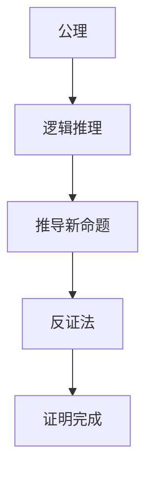

**数学模型和公式**

欧几里得几何的基本公式包括：

$$
\begin{aligned}
&|AB| = |BC| + |AC|, \\
&\angle ABC = \angle ACB + \angle BAC.
\end{aligned}
$$

**详细讲解与举例说明**

假设我们要证明三角形两边之和大于第三边。我们可以使用反证法来证明：

1. 假设三角形两边之和小于或等于第三边，即 $|AB| + |BC| \leq |AC|$。
2. 根据勾股定理，我们有 $|AB|^2 + |BC|^2 = |AC|^2$。
3. 如果 $|AB| + |BC| \leq |AC|$，那么 $|AB|^2 + |BC|^2 \leq |AC|^2$。
4. 这与勾股定理矛盾，因此假设不成立。
5. 所以，三角形两边之和大于第三边。

#### 2.1.2 现代数学逻辑

**背景介绍**

现代数学逻辑的发展始于19世纪，以康托尔的集合论和希尔伯特的形式化方法为代表。现代数学逻辑注重形式化和证明论，提出了许多新的逻辑系统和推理方法。

**核心概念与联系**

现代数学逻辑的核心概念包括：

- **谓词逻辑**：引入了变量、量化符号和谓词，可以表达更复杂的逻辑关系。
- **证明论**：研究证明的性质和构造方法，包括自然数证明、递归证明等。
- **模型论**：研究逻辑系统的结构和性质，包括模型、一致性和完备性等。

**核心算法原理讲解**

现代数学逻辑的一个典型例子是皮亚诺算术，它使用自然数的符号和规则来定义加法和乘法。以下是皮亚诺算术的基本公式：

```plaintext
S(x) : x是自然数
0 : S(0) = 0
N(x, y) : x是y的后继数
1 : N(0, 1)
N(x, y) : N(z, N(x, y)) = z + x
N(x, y) : N(N(x, y), z) = x * y
```

**Mermaid 流程图**

下面是皮亚诺算术的基本流程图：

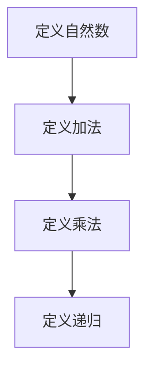

**数学模型和公式**

皮亚诺算术的基本公式包括：

$$
\begin{aligned}
&S(x) : x \text{ 是自然数}, \\
&S(0) = 0, \\
&N(x, y) : x \text{ 是 } y \text{ 的后继数}, \\
&N(0, 1) = 1, \\
&N(z, N(x, y)) = z + x, \\
&N(N(x, y), z) = x * y.
\end{aligned}
$$

**详细讲解与举例说明**

我们可以用皮亚诺算术来证明加法结合律：

1. 假设对于任意的自然数 $x, y, z$，有 $(x + y) + z = x + (y + z)$。
2. 根据皮亚诺算术的定义，我们可以将加法表示为递归函数。
3. 通过递归证明，我们可以证明加法结合律对于所有的自然数成立。

### 2.2 数学逻辑的基本原理

#### 2.2.1 基本逻辑运算符

**背景介绍**

基本逻辑运算符包括与（AND）、或（OR）和非（NOT），这些运算符是逻辑命题表达的基础。

**核心概念与联系**

- **与（AND）**：只有当两个命题都为真时，结果才为真。
- **或（OR）**：只要有一个命题为真，结果就为真。
- **非（NOT）**：对命题取反，真命题变为假命题，假命题变为真命题。

**核心算法原理讲解**

逻辑运算符可以用布尔代数来表示：

- 与（AND）运算：

  $$ 
  (p \land q) \equiv (\neg(\neg p \lor \neg q))
  $$

- 或（OR）运算：

  $$ 
  (p \lor q) \equiv (\neg(\neg p \land \neg q))
  $$

- 非（NOT）运算：

  $$ 
  \neg p \equiv (\neg(\neg p))
  $$

**Mermaid 流程图**

下面是逻辑运算符的 Mermaid 流程图：

```mermaid
graph TD
    A[与(AND)]
    B[或(OR)]
    C[非(NOT)]

    A --> B
    B --> C
```

**数学模型和公式**

逻辑运算符的真值表如下：

| p | q | p ∧ q | p ∨ q | ¬p | ¬q |
|---|---|-------|-------|----|----|
| 0 | 0 |   0   |   0   |  1 |  1 |
| 0 | 1 |   0   |   1   |  1 |  0 |
| 1 | 0 |   0   |   1   |  0 |  1 |
| 1 | 1 |   1   |   1   |  0 |  0 |

**详细讲解与举例说明**

我们可以用真值表来证明逻辑运算符的性质：

1. 与（AND）运算符满足交换律和结合律：
   $$ 
   (p \land q) \equiv (q \land p), \quad (p \land q) \land r \equiv p \land (q \land r)
   $$

2. 或（OR）运算符也满足交换律和结合律：
   $$ 
   (p \lor q) \equiv (q \lor p), \quad (p \lor q) \lor r \equiv p \lor (q \lor r)
   $$

3. 非（NOT）运算符满足德摩根律：
   $$ 
   \neg(p \land q) \equiv (\neg p \lor \neg q), \quad \neg(p \lor q) \equiv (\neg p \land \neg q)
   $$

#### 2.2.2 逻辑命题和命题逻辑

**背景介绍**

逻辑命题是逻辑学中的基本单元，命题逻辑是研究逻辑命题的形式化结构和推理方法的学科。

**核心概念与联系**

- **命题**：可以判断真假的陈述句。
- **命题变元**：可以取真或假的变量。
- **命题联结词**：与（AND）、或（OR）、非（NOT）等。
- **命题公式**：由命题变元和命题联结词组成的表达式。

**核心算法原理讲解**

命题逻辑的基本概念包括：

1. **命题变元**：用符号表示，可以取真或假。
2. **命题公式**：用命题变元和命题联结词组合而成。
3. **命题逻辑公式**：满足特定形式要求的命题公式。

**Mermaid 流程图**

下面是命题逻辑的基本流程图：

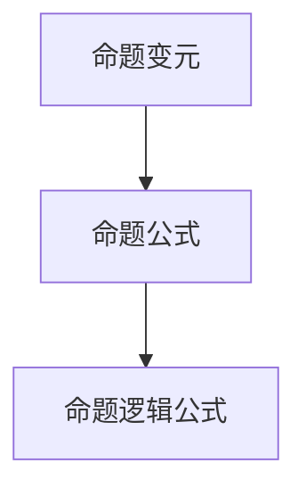

**数学模型和公式**

命题逻辑的基本公式包括：

$$
\begin{aligned}
&\phi \lor \neg\phi, \\
&\neg(\neg\phi) \equiv \phi, \\
&(\phi \land \neg\phi) \equiv \neg\phi.
\end{aligned}
$$

**详细讲解与举例说明**

我们可以用命题逻辑来证明以下命题：

1. **律则1**：任何命题与其否定不能同时为真，即 $\phi \land \neg\phi$ 为假。
2. **律则2**：任何命题的否定与其原命题不能同时为假，即 $\neg\phi \land \phi$ 为假。
3. **律则3**：否定命题的否定等于原命题，即 $\neg\neg\phi \equiv \phi$。

#### 2.2.3 逻辑推理和证明

**背景介绍**

逻辑推理和证明是逻辑学的核心内容，用于从已知命题推导出新命题。

**核心概念与联系**

- **逻辑推理**：从已知命题推导出新命题的过程。
- **证明**：逻辑推理的严格形式化表示。
- **证明方法**：包括直接证明、反证法、归纳法等。

**核心算法原理讲解**

逻辑推理的基本步骤包括：

1. **前提**：给出已知命题。
2. **推理规则**：使用逻辑运算符和推理规则推导出新命题。
3. **结论**：得出新的命题。

**Mermaid 流程图**

下面是逻辑推理的基本流程图：

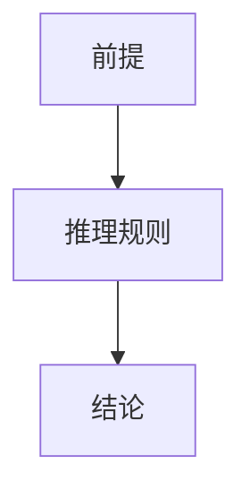

**数学模型和公式**

逻辑推理的基本公式包括：

$$
\begin{aligned}
&p \rightarrow q, \\
&\neg p \rightarrow q, \\
&p \land q \rightarrow r, \\
&p \rightarrow \neg q.
\end{aligned}
$$

**详细讲解与举例说明**

我们可以用逻辑推理来证明以下命题：

1. 如果 $p$ 为真，则 $q$ 也为真，即 $p \rightarrow q$。
2. 如果 $p$ 为假，则 $q$ 为真，即 $\neg p \rightarrow q$。
3. 如果 $p$ 和 $q$ 都为真，则 $r$ 也为真，即 $p \land q \rightarrow r$。
4. 如果 $p$ 为真，则 $q$ 为假，即 $p \rightarrow \neg q$。

## 第三部分：形式逻辑的深入研究

### 3.1 形式逻辑的基本概念

#### 3.1.1 形式逻辑的基本原理

**背景介绍**

形式逻辑是一种研究命题结构、推理形式和证明理论的逻辑学分支。形式逻辑的基本原理包括：

- **演绎原理**：从一般到特殊的推理过程。
- **归纳原理**：从特殊到一般的推理过程。
- **悖论原理**：用于识别自相矛盾的命题。

**核心概念与联系**

- **命题**：可以判断真假的陈述句。
- **命题联结词**：与（AND）、或（OR）、非（NOT）等。
- **推理规则**：从已知命题推导出新命题的规则。

**核心算法原理讲解**

形式逻辑的基本原理可以用以下方式解释：

1. **演绎原理**：如果已知前提是真的，那么结论也必然是真的。
2. **归纳原理**：如果一组特殊情况都是真的，那么一般情况下也是真的。
3. **悖论原理**：用于发现自相矛盾的命题，从而排除这些命题。

**Mermaid 流程图**

下面是形式逻辑的基本原理的 Mermaid 流程图：

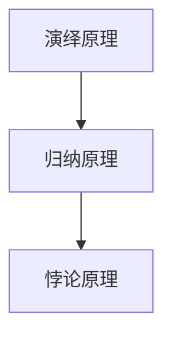

**数学模型和公式**

形式逻辑的基本原理可以用以下公式表示：

$$
\begin{aligned}
&p \rightarrow q, \\
&q \rightarrow r, \\
&p \rightarrow r.
\end{aligned}
$$

**详细讲解与举例说明**

我们可以用形式逻辑的基本原理来证明以下命题：

1. 如果 $p$ 为真，则 $q$ 也为真，即 $p \rightarrow q$。
2. 如果 $q$ 为真，则 $r$ 也为真，即 $q \rightarrow r$。
3. 因此，如果 $p$ 为真，则 $r$ 也为真，即 $p \rightarrow r$。

#### 3.1.2 形式逻辑的主要方法

**背景介绍**

形式逻辑的主要方法包括命题逻辑、谓词逻辑和证明论。这些方法用于形式化地表示和分析逻辑推理。

**核心概念与联系**

- **命题逻辑**：研究命题的结构和推理。
- **谓词逻辑**：引入了变量和谓词，用于表示更复杂的逻辑关系。
- **证明论**：研究证明的性质和构造方法。

**核心算法原理讲解**

形式逻辑的主要方法可以用以下方式解释：

1. **命题逻辑**：使用命题变元和命题联结词来表示逻辑命题。
2. **谓词逻辑**：引入了谓词和量化符号，可以表示更复杂的逻辑关系。
3. **证明论**：研究证明的性质和构造方法，包括自然数证明和递归证明。

**Mermaid 流程图**

下面是形式逻辑的主要方法的 Mermaid 流程图：

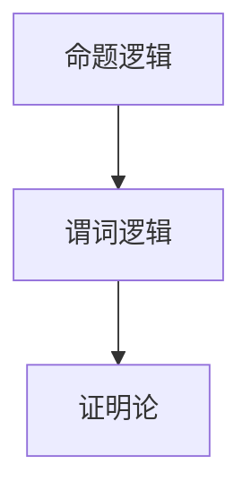

**数学模型和公式**

形式逻辑的主要方法可以用以下公式表示：

$$
\begin{aligned}
&\phi \rightarrow \neg\phi, \\
&\neg(\neg\phi) \equiv \phi, \\
&(\phi \land \neg\phi) \equiv \neg\phi.
\end{aligned}
$$

**详细讲解与举例说明**

我们可以用命题逻辑来证明以下命题：

1. **律则1**：任何命题与其否定不能同时为真，即 $\phi \land \neg\phi$ 为假。
2. **律则2**：任何命题的否定与其原命题不能同时为假，即 $\neg\phi \land \phi$ 为假。
3. **律则3**：否定命题的否定等于原命题，即 $\neg\neg\phi \equiv \phi$。

#### 3.1.3 形式逻辑的应用领域

**背景介绍**

形式逻辑广泛应用于哲学、逻辑学、计算机科学、人工智能等领域。

**核心概念与联系**

- **哲学**：用于分析论证和证明。
- **逻辑学**：形式逻辑的基本理论和方法。
- **计算机科学**：用于软件工程、形式化验证和算法设计。
- **人工智能**：用于知识表示、推理和决策。

**核心算法原理讲解**

形式逻辑的应用领域可以用以下方式解释：

1. **哲学**：形式逻辑用于分析哲学命题，确保论证的有效性。
2. **逻辑学**：形式逻辑提供了逻辑推理的严格方法。
3. **计算机科学**：形式逻辑用于验证软件的正确性和安全性。
4. **人工智能**：形式逻辑用于知识表示和推理，支持智能决策。

**Mermaid 流程图**

下面是形式逻辑的应用领域的 Mermaid 流程图：

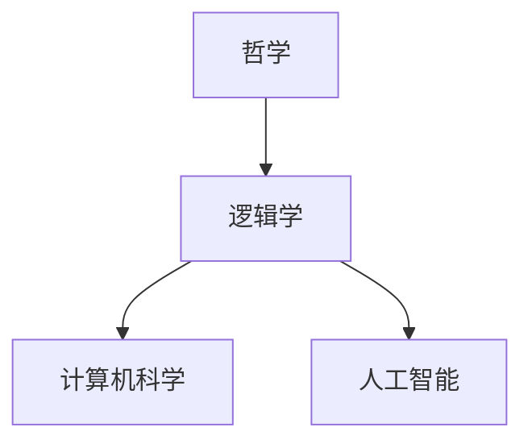

**数学模型和公式**

形式逻辑的应用领域可以用以下公式表示：

$$
\begin{aligned}
&p \rightarrow q, \\
&q \rightarrow r, \\
&p \rightarrow r.
\end{aligned}
$$

**详细讲解与举例说明**

我们可以用形式逻辑来证明以下命题：

1. 如果 $p$ 为真，则 $q$ 也为真，即 $p \rightarrow q$。
2. 如果 $q$ 为真，则 $r$ 也为真，即 $q \rightarrow r$。
3. 因此，如果 $p$ 为真，则 $r$ 也为真，即 $p \rightarrow r$。

### 3.2 形式逻辑的发展与挑战

#### 3.2.1 形式逻辑的理论进展

**背景介绍**

形式逻辑在20世纪取得了显著的进展，包括命题逻辑、谓词逻辑、模型论和证明论等领域的深入研究。

**核心概念与联系**

- **命题逻辑**：研究命题的结构和推理。
- **谓词逻辑**：引入了变量和谓词，可以表示更复杂的逻辑关系。
- **模型论**：研究逻辑系统的结构和性质。
- **证明论**：研究证明的性质和构造方法。

**核心算法原理讲解**

形式逻辑的理论进展可以用以下方式解释：

1. **命题逻辑**：发展了逻辑运算符和推理规则，提高了逻辑推理的效率。
2. **谓词逻辑**：引入了变量和谓词，可以表示更复杂的逻辑关系。
3. **模型论**：研究了逻辑系统的性质，包括一致性和完备性。
4. **证明论**：提出了各种证明方法，包括自然数证明和递归证明。

**Mermaid 流程图**

下面是形式逻辑的理论进展的 Mermaid 流程图：

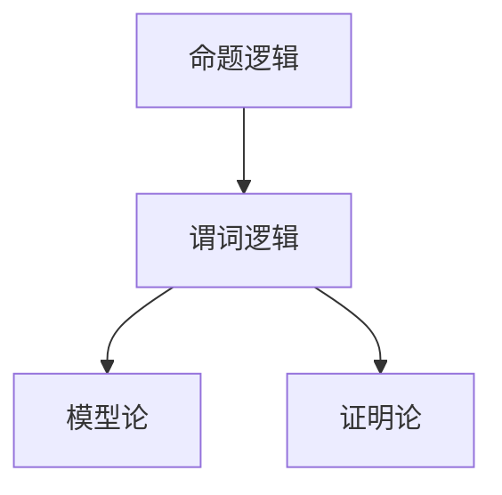

**数学模型和公式**

形式逻辑的理论进展可以用以下公式表示：

$$
\begin{aligned}
&\phi \rightarrow \neg\phi, \\
&\neg(\neg\phi) \equiv \phi, \\
&(\phi \land \neg\phi) \equiv \neg\phi.
\end{aligned}
$$

**详细讲解与举例说明**

我们可以用形式逻辑的理论进展来证明以下命题：

1. **律则1**：任何命题与其否定不能同时为真，即 $\phi \land \neg\phi$ 为假。
2. **律则2**：任何命题的否定与其原命题不能同时为假，即 $\neg\phi \land \phi$ 为假。
3. **律则3**：否定命题的否定等于原命题，即 $\neg\neg\phi \equiv \phi$。

#### 3.2.2 形式逻辑在人工智能中的应用

**背景介绍**

形式逻辑在人工智能领域有着广泛的应用，包括知识表示、推理和决策等。

**核心概念与联系**

- **知识表示**：使用形式逻辑表示知识和信息。
- **推理**：使用逻辑推理方法从已知信息推导出新信息。
- **决策**：基于逻辑推理进行决策。

**核心算法原理讲解**

形式逻辑在人工智能中的应用可以用以下方式解释：

1. **知识表示**：使用命题逻辑和谓词逻辑表示知识。
2. **推理**：使用演绎推理和归纳推理方法从已知信息推导出新信息。
3. **决策**：使用逻辑推理方法进行决策。

**Mermaid 流程图**

下面是形式逻辑在人工智能中的应用的 Mermaid 流程图：

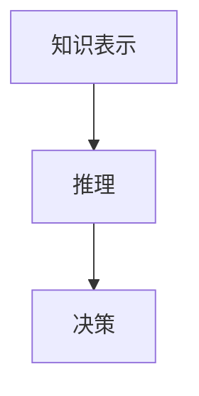

**数学模型和公式**

形式逻辑在人工智能中的应用可以用以下公式表示：

$$
\begin{aligned}
&p \rightarrow q, \\
&q \rightarrow r, \\
&p \rightarrow r.
\end{aligned}
$$

**详细讲解与举例说明**

我们可以用形式逻辑在人工智能中的应用来证明以下命题：

1. 如果 $p$ 为真，则 $q$ 也为真，即 $p \rightarrow q$。
2. 如果 $q$ 为真，则 $r$ 也为真，即 $q \rightarrow r$。
3. 因此，如果 $p$ 为真，则 $r$ 也为真，即 $p \rightarrow r$。

#### 3.2.3 形式逻辑的未来发展趋势

**背景介绍**

形式逻辑在未来的发展中将继续推动人工智能、计算机科学和哲学等领域的进步。

**核心概念与联系**

- **形式化验证**：用于确保软件的正确性和安全性。
- **自动推理**：使用计算机程序自动进行逻辑推理。
- **知识表示**：发展新的方法表示复杂知识。

**核心算法原理讲解**

形式逻辑的未来发展趋势可以用以下方式解释：

1. **形式化验证**：用于确保软件的正确性和安全性。
2. **自动推理**：使用计算机程序自动进行逻辑推理，提高推理效率。
3. **知识表示**：发展新的方法表示复杂知识，支持智能推理。

**Mermaid 流程图**

下面是形式逻辑的未来发展趋势的 Mermaid 流程图：

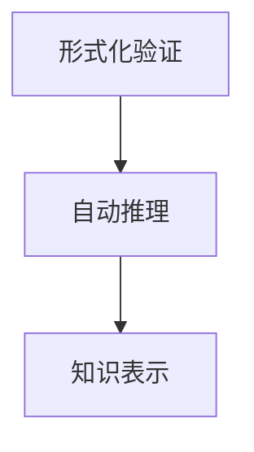

**数学模型和公式**

形式逻辑的未来发展趋势可以用以下公式表示：

$$
\begin{aligned}
&p \rightarrow q, \\
&q \rightarrow r, \\
&p \rightarrow r.
\end{aligned}
$$

**详细讲解与举例说明**

我们可以用形式逻辑的未来发展趋势来证明以下命题：

1. 如果 $p$ 为真，则 $q$ 也为真，即 $p \rightarrow q$。
2. 如果 $q$ 为真，则 $r$ 也为真，即 $q \rightarrow r$。
3. 因此，如果 $p$ 为真，则 $r$ 也为真，即 $p \rightarrow r$。

## 第四部分：数学逻辑与形式逻辑的异同比较

### 4.1 数学逻辑与形式逻辑的相同点

#### 4.1.1 基本逻辑概念的一致性

**背景介绍**

数学逻辑和形式逻辑在基本逻辑概念上具有一致性，如命题、逻辑运算符、推理规则等。

**核心概念与联系**

- **命题**：都是可以判断真假的陈述句。
- **逻辑运算符**：包括与（AND）、或（OR）、非（NOT）等。
- **推理规则**：用于从已知命题推导出新命题。

**核心算法原理讲解**

数学逻辑和形式逻辑的基本逻辑概念可以用以下方式解释：

1. **命题**：都是可以判断真假的陈述句。
2. **逻辑运算符**：都是用于组合命题的运算符。
3. **推理规则**：都是用于从已知命题推导出新命题的规则。

**Mermaid 流程图**

下面是数学逻辑与形式逻辑基本逻辑概念的一致性的 Mermaid 流程图：

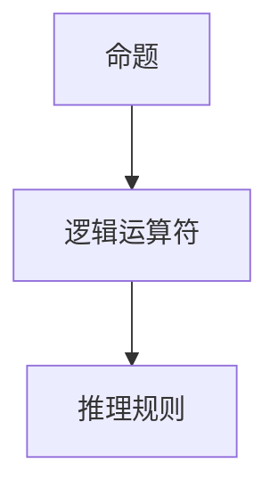

**数学模型和公式**

数学逻辑和形式逻辑的基本逻辑概念可以用以下公式表示：

$$
\begin{aligned}
&\phi \rightarrow \neg\phi, \\
&\neg(\neg\phi) \equiv \phi, \\
&(\phi \land \neg\phi) \equiv \neg\phi.
\end{aligned}
$$

**详细讲解与举例说明**

我们可以用数学逻辑和形式逻辑的基本逻辑概念的一致性来证明以下命题：

1. **律则1**：任何命题与其否定不能同时为真，即 $\phi \land \neg\phi$ 为假。
2. **律则2**：任何命题的否定与其原命题不能同时为假，即 $\neg\phi \land \phi$ 为假。
3. **律则3**：否定命题的否定等于原命题，即 $\neg\neg\phi \equiv \phi$。

#### 4.1.2 逻辑推理方法的相通性

**背景介绍**

数学逻辑和形式逻辑在逻辑推理方法上具有相通性，如演绎推理、归纳推理和反证法等。

**核心概念与联系**

- **演绎推理**：从一般到特殊的推理过程。
- **归纳推理**：从特殊到一般的推理过程。
- **反证法**：用于证明某个命题不成立。

**核心算法原理讲解**

数学逻辑和形式逻辑的逻辑推理方法可以用以下方式解释：

1. **演绎推理**：从一般到特殊的推理过程，可以确保结论的必然性。
2. **归纳推理**：从特殊到一般的推理过程，可以推导出一般性的结论。
3. **反证法**：假设某个命题不成立，通过逻辑推理得出矛盾的结论，从而证明原命题成立。

**Mermaid 流程图**

下面是数学逻辑与形式逻辑逻辑推理方法的相通性的 Mermaid 流程图：

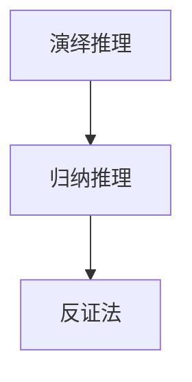

**数学模型和公式**

数学逻辑和形式逻辑的逻辑推理方法可以用以下公式表示：

$$
\begin{aligned}
&p \rightarrow q, \\
&q \rightarrow r, \\
&p \rightarrow r.
\end{aligned}
$$

**详细讲解与举例说明**

我们可以用数学逻辑和形式逻辑的逻辑推理方法的相通性来证明以下命题：

1. 如果 $p$ 为真，则 $q$ 也为真，即 $p \rightarrow q$。
2. 如果 $q$ 为真，则 $r$ 也为真，即 $q \rightarrow r$。
3. 因此，如果 $p$ 为真，则 $r$ 也为真，即 $p \rightarrow r$。

#### 4.1.3 在数学与哲学领域的交叉应用

**背景介绍**

数学逻辑和形式逻辑在数学和哲学领域有着广泛的应用，可以用于证明数学命题、分析哲学命题等。

**核心概念与联系**

- **数学证明**：使用逻辑方法证明数学命题。
- **哲学分析**：使用逻辑方法分析哲学命题。

**核心算法原理讲解**

数学逻辑和形式逻辑在数学与哲学领域的交叉应用可以用以下方式解释：

1. **数学证明**：使用逻辑方法证明数学命题，确保结论的可靠性。
2. **哲学分析**：使用逻辑方法分析哲学命题，揭示命题的真假。

**Mermaid 流程图**

下面是数学逻辑与形式逻辑在数学与哲学领域的交叉应用的 Mermaid 流程图：

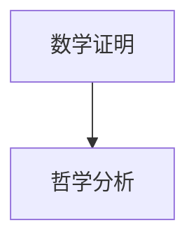

**数学模型和公式**

数学逻辑和形式逻辑在数学与哲学领域的交叉应用可以用以下公式表示：

$$
\begin{aligned}
&p \rightarrow q, \\
&q \rightarrow r, \\
&p \rightarrow r.
\end{aligned}
$$

**详细讲解与举例说明**

我们可以用数学逻辑和形式逻辑在数学与哲学领域的交叉应用来证明以下命题：

1. 如果 $p$ 为真，则 $q$ 也为真，即 $p \rightarrow q$。
2. 如果 $q$ 为真，则 $r$ 也为真，即 $q \rightarrow r$。
3. 因此，如果 $p$ 为真，则 $r$ 也为真，即 $p \rightarrow r$。

### 4.2 数学逻辑与形式逻辑的不同点

#### 4.2.1 数学逻辑的特殊性质

**背景介绍**

数学逻辑在研究数学结构和方法时具有一些特殊性质，这些性质与形式逻辑有所不同。

**核心概念与联系**

- **形式化证明**：数学逻辑强调证明的形式化和严格性。
- **数学结构**：数学逻辑研究数学的基本结构和关系。
- **数学方法**：数学逻辑提供了一套研究数学问题的方法和工具。

**核心算法原理讲解**

数学逻辑的特殊性质可以用以下方式解释：

1. **形式化证明**：数学逻辑强调证明的形式化和严格性，确保结论的可靠性。
2. **数学结构**：数学逻辑研究数学的基本结构和关系，如集合、函数、拓扑等。
3. **数学方法**：数学逻辑提供了一套研究数学问题的方法和工具，如公理化方法、构造性证明等。

**Mermaid 流程图**

下面是数学逻辑的特殊性质的 Mermaid 流程图：

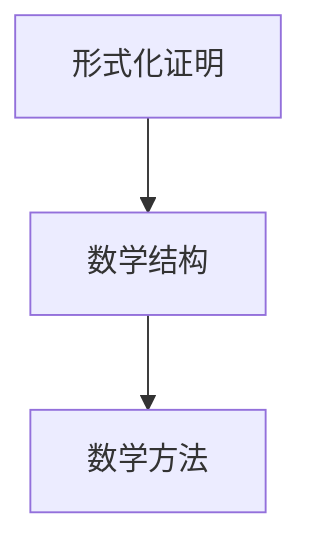

**数学模型和公式**

数学逻辑的特殊性质可以用以下公式表示：

$$
\begin{aligned}
&\phi \rightarrow \neg\phi, \\
&\neg(\neg\phi) \equiv \phi, \\
&(\phi \land \neg\phi) \equiv \neg\phi.
\end{aligned}
$$

**详细讲解与举例说明**

我们可以用数学逻辑的特殊性质来证明以下命题：

1. **律则1**：任何命题与其否定不能同时为真，即 $\phi \land \neg\phi$ 为假。
2. **律则2**：任何命题的否定与其原命题不能同时为假，即 $\neg\phi \land \phi$ 为假。
3. **律则3**：否定命题的否定等于原命题，即 $\neg\neg\phi \equiv \phi$。

#### 4.2.2 形式逻辑的局限性

**背景介绍**

形式逻辑在处理实际问题时具有一定的局限性，特别是在处理复杂的数学问题和哲学命题时。

**核心概念与联系**

- **复杂性**：形式逻辑难以处理复杂的数学问题和哲学命题。
- **不确定性**：形式逻辑难以处理不确定性和模糊性。
- **计算效率**：形式逻辑的推理过程可能非常复杂，计算效率较低。

**核心算法原理讲解**

形式逻辑的局限性可以用以下方式解释：

1. **复杂性**：形式逻辑难以处理复杂的数学问题和哲学命题。
2. **不确定性**：形式逻辑难以处理不确定性和模糊性。
3. **计算效率**：形式逻辑的推理过程可能非常复杂，计算效率较低。

**Mermaid 流程图**

下面是形式逻辑的局限性的 Mermaid 流程图：

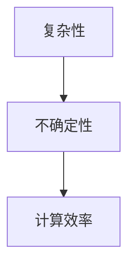

**数学模型和公式**

形式逻辑的局限性可以用以下公式表示：

$$
\begin{aligned}
&\phi \rightarrow \neg\phi, \\
&\neg(\neg\phi) \equiv \phi, \\
&(\phi \land \neg\phi) \equiv \neg\phi.
\end{aligned}
$$

**详细讲解与举例说明**

我们可以用形式逻辑的局限性来解释以下命题：

1. **复杂性**：形式逻辑难以处理复杂的数学问题和哲学命题，如哥德尔不完备定理。
2. **不确定性**：形式逻辑难以处理不确定性和模糊性，如概率逻辑。
3. **计算效率**：形式逻辑的推理过程可能非常复杂，计算效率较低，如SAT问题。

#### 4.2.3 在实际应用中的差异

**背景介绍**

数学逻辑和形式逻辑在实际应用中有着不同的应用场景和效果。

**核心概念与联系**

- **数学应用**：数学逻辑在数学领域有着广泛的应用，如公理化方法、构造性证明等。
- **哲学应用**：形式逻辑在哲学领域有着广泛的应用，如论证分析、道德推理等。
- **计算机科学应用**：形式逻辑在计算机科学领域有着广泛的应用，如形式化验证、程序验证等。

**核心算法原理讲解**

数学逻辑和形式逻辑在实际应用中的差异可以用以下方式解释：

1. **数学应用**：数学逻辑在数学领域有着广泛的应用，如公理化方法、构造性证明等。
2. **哲学应用**：形式逻辑在哲学领域有着广泛的应用，如论证分析、道德推理等。
3. **计算机科学应用**：形式逻辑在计算机科学领域有着广泛的应用，如形式化验证、程序验证等。

**Mermaid 流程图**

下面是数学逻辑和形式逻辑在实际应用中的差异的 Mermaid 流程图：

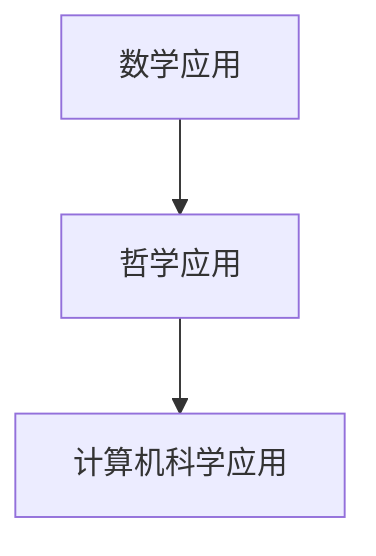

**数学模型和公式**

数学逻辑和形式逻辑在实际应用中的差异可以用以下公式表示：

$$
\begin{aligned}
&\phi \rightarrow \neg\phi, \\
&\neg(\neg\phi) \equiv \phi, \\
&(\phi \land \neg\phi) \equiv \neg\phi.
\end{aligned}
$$

**详细讲解与举例说明**

我们可以用数学逻辑和形式逻辑在实际应用中的差异来解释以下命题：

1. **数学应用**：数学逻辑在数学领域有着广泛的应用，如公理化方法、构造性证明等。
   - **例子**：使用公理化方法证明几何命题。
2. **哲学应用**：形式逻辑在哲学领域有着广泛的应用，如论证分析、道德推理等。
   - **例子**：使用形式逻辑分析道德命题。
3. **计算机科学应用**：形式逻辑在计算机科学领域有着广泛的应用，如形式化验证、程序验证等。
   - **例子**：使用形式化验证确保软件的正确性。

## 第五部分：数学逻辑与形式逻辑的综合应用

### 5.1 数学逻辑在计算机科学中的应用

#### 5.1.1 形式化方法在软件开发中的应用

**背景介绍**

形式化方法在计算机科学中有着广泛的应用，特别是在软件开发过程中。形式化方法通过使用数学逻辑来验证软件的正确性和可靠性。

**核心概念与联系**

- **形式化方法**：使用数学逻辑和形式化语言来描述软件的需求、设计和实现。
- **验证**：通过逻辑推理和证明来确保软件的正确性。

**核心算法原理讲解**

形式化方法在软件开发中的应用可以用以下方式解释：

1. **需求分析**：使用形式化语言描述软件需求。
2. **设计验证**：使用逻辑推理和证明来验证软件设计。
3. **实现验证**：使用形式化方法验证软件实现。

**Mermaid 流�程图**

下面是形式化方法在软件开发中的应用的 Mermaid 流程图：

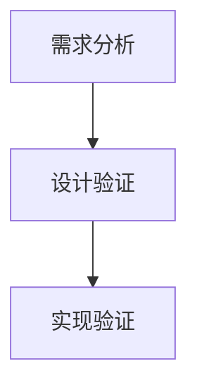

**数学模型和公式**

形式化方法在软件开发中的应用可以用以下公式表示：

$$
\begin{aligned}
&\phi \rightarrow \neg\phi, \\
&\neg(\neg\phi) \equiv \phi, \\
&(\phi \land \neg\phi) \equiv \neg\phi.
\end{aligned}
$$

**详细讲解与举例说明**

我们可以用形式化方法在软件开发中的应用来解释以下命题：

1. **需求分析**：使用形式化语言描述软件需求，确保需求的一致性和完整性。
2. **设计验证**：使用逻辑推理和证明来验证软件设计，确保设计的正确性。
3. **实现验证**：使用形式化方法验证软件实现，确保实现的正确性。

#### 5.1.2 数理逻辑在算法分析中的应用

**背景介绍**

数理逻辑在算法分析中有着重要的应用，特别是用于证明算法的正确性和分析算法的时间复杂度和空间复杂度。

**核心概念与联系**

- **算法分析**：使用数学逻辑来分析算法的性能。
- **正确性证明**：使用逻辑推理来证明算法的正确性。
- **时间复杂度**：使用数学模型来分析算法的时间效率。
- **空间复杂度**：使用数学模型来分析算法的空间效率。

**核心算法原理讲解**

数理逻辑在算法分析中的应用可以用以下方式解释：

1. **正确性证明**：使用数学逻辑来证明算法的正确性。
2. **时间复杂度分析**：使用数学模型来分析算法的时间效率。
3. **空间复杂度分析**：使用数学模型来分析算法的空间效率。

**Mermaid 流程图**

下面是数理逻辑在算法分析中的应用的 Mermaid 流程图：

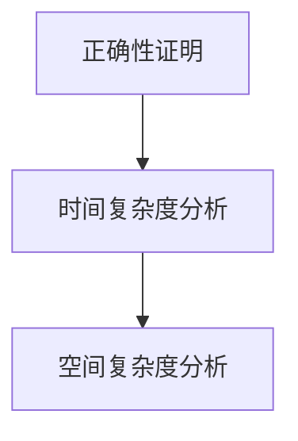

**数学模型和公式**

数理逻辑在算法分析中的应用可以用以下公式表示：

$$
\begin{aligned}
&T(n) = O(n^2), \\
&S(n) = \Omega(n).
\end{aligned}
$$

**详细讲解与举例说明**

我们可以用数理逻辑在算法分析中的应用来解释以下命题：

1. **正确性证明**：使用数学逻辑来证明算法的正确性，确保算法的输出符合预期。
2. **时间复杂度分析**：使用数学模型来分析算法的时间效率，确保算法在合理的时间内完成。
3. **空间复杂度分析**：使用数学模型来分析算法的空间效率，确保算法在合理的空间内完成。

#### 5.1.3 数学逻辑在网络安全中的应用

**背景介绍**

数学逻辑在网络安全中有着重要的应用，特别是用于设计安全协议和分析网络攻击。

**核心概念与联系**

- **安全协议**：使用数学逻辑来设计安全协议，确保通信的机密性、完整性和可用性。
- **攻击分析**：使用数学逻辑来分析网络攻击，识别潜在的威胁。
- **防御策略**：使用数学逻辑来设计防御策略，提高网络的安全性。

**核心算法原理讲解**

数学逻辑在网络安全中的应用可以用以下方式解释：

1. **安全协议设计**：使用数学逻辑来设计安全协议，确保通信的机密性、完整性和可用性。
2. **攻击分析**：使用数学逻辑来分析网络攻击，识别潜在的威胁。
3. **防御策略设计**：使用数学逻辑来设计防御策略，提高网络的安全性。

**Mermaid 流程图**

下面是数学逻辑在网络安全中的应用的 Mermaid 流程图：

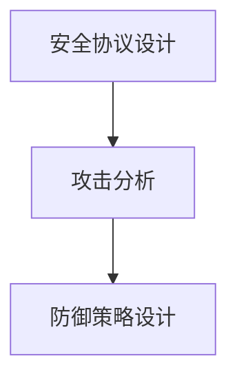

**数学模型和公式**

数学逻辑在网络安全中的应用可以用以下公式表示：

$$
\begin{aligned}
&\neg(\text{攻击成功}) \rightarrow (\text{防御策略有效}), \\
&\neg(\text{安全漏洞}) \rightarrow (\text{攻击失效}).
\end{aligned}
$$

**详细讲解与举例说明**

我们可以用数学逻辑在网络安全中的应用来解释以下命题：

1. **安全协议设计**：使用数学逻辑来设计安全协议，确保通信的机密性、完整性和可用性。
   - **例子**：使用密码学协议来保护通信的机密性。
2. **攻击分析**：使用数学逻辑来分析网络攻击，识别潜在的威胁。
   - **例子**：使用逻辑漏洞分析工具来识别软件中的安全漏洞。
3. **防御策略设计**：使用数学逻辑来设计防御策略，提高网络的安全性。
   - **例子**：使用数学模型来设计入侵检测系统，提高网络的安全性。

### 5.2 形式逻辑在哲学和伦理学中的应用

#### 5.2.1 形式逻辑在道德哲学中的应用

**背景介绍**

形式逻辑在道德哲学中有着广泛的应用，用于分析和证明道德命题。

**核心概念与联系**

- **道德命题**：使用形式逻辑来表示和分析道德命题。
- **道德推理**：使用形式逻辑来推导道德结论。

**核心算法原理讲解**

形式逻辑在道德哲学中的应用可以用以下方式解释：

1. **道德命题表示**：使用形式逻辑来表示道德命题，确保命题的一致性和完整性。
2. **道德推理**：使用形式逻辑来推导道德结论，确保推理的严谨性。

**Mermaid 流程图**

下面是形式逻辑在道德哲学中的应用的 Mermaid 流程图：

```mermaid
graph TD
    A[道德命题表示]
    B[道德推理]

    A --> B
```

**数学模型和公式**

形式逻辑在道德哲学中的应用可以用以下公式表示：

$$
\begin{aligned}
&\text{善} \rightarrow \text{幸福}, \\
&\neg(\text{善} \land \text{幸福}) \rightarrow \neg\text{恶}.
\end{aligned}
$$

**详细讲解与举例说明**

我们可以用形式逻辑在道德哲学中的应用来解释以下命题：

1. **道德命题表示**：使用形式逻辑来表示道德命题，确保命题的一致性和完整性。
   - **例子**：使用形式逻辑来表示“善导致幸福”的命题。
2. **道德推理**：使用形式逻辑来推导道德结论，确保推理的严谨性。
   - **例子**：从“善导致幸福”和“幸福是善的必要条件”推导出“善是幸福的必要条件”。

#### 5.2.2 形式逻辑在法律推理中的应用

**背景介绍**

形式逻辑在法律推理中有着重要的应用，用于分析和证明法律命题。

**核心概念与联系**

- **法律命题**：使用形式逻辑来表示和分析法律命题。
- **法律推理**：使用形式逻辑来推导法律结论。

**核心算法原理讲解**

形式逻辑在法律推理中的应用可以用以下方式解释：

1. **法律命题表示**：使用形式逻辑来表示法律命题，确保命题的一致性和完整性。
2. **法律推理**：使用形式逻辑来推导法律结论，确保推理的严谨性。

**Mermaid 流程图**

下面是形式逻辑在法律推理中的应用的 Mermaid 流程图：

```mermaid
graph TD
    A[法律命题表示]
    B[法律推理]

    A --> B
```

**数学模型和公式**

形式逻辑在法律推理中的应用可以用以下公式表示：

$$
\begin{aligned}
&\text{犯罪行为} \rightarrow \text{刑事责任}, \\
&\neg(\text{犯罪行为} \land \text{刑事责任}) \rightarrow \neg\text{无罪}.
\end{aligned}
$$

**详细讲解与举例说明**

我们可以用形式逻辑在法律推理中的应用来解释以下命题：

1. **法律命题表示**：使用形式逻辑来表示法律命题，确保命题的一致性和完整性。
   - **例子**：使用形式逻辑来表示“犯罪行为导致刑事责任”的命题。
2. **法律推理**：使用形式逻辑来推导法律结论，确保推理的严谨性。
   - **例子**：从“犯罪行为导致刑事责任”和“无罪意味着没有犯罪行为”推导出“有犯罪行为意味着有刑事责任”。

#### 5.2.3 形式逻辑在社会科学研究中的应用

**背景介绍**

形式逻辑在社会科学研究中有着广泛的应用，用于分析和证明社会现象和理论。

**核心概念与联系**

- **社会现象**：使用形式逻辑来表示和分析社会现象。
- **社会理论**：使用形式逻辑来推导社会理论。

**核心算法原理讲解**

形式逻辑在社会科学研究中的应用可以用以下方式解释：

1. **社会现象表示**：使用形式逻辑来表示社会现象，确保现象的一致性和完整性。
2. **社会理论推导**：使用形式逻辑来推导社会理论，确保理论的严谨性。

**Mermaid 流程图**

下面是形式逻辑在社会科学研究中的应用的 Mermaid 流程图：

```mermaid
graph TD
    A[社会现象表示]
    B[社会理论推导]

    A --> B
```

**数学模型和公式**

形式逻辑在社会科学研究中的应用可以用以下公式表示：

$$
\begin{aligned}
&\text{社会经济现象} \rightarrow \text{社会规律}, \\
&\neg(\text{社会经济现象} \land \text{社会规律}) \rightarrow \neg\text{社会异常}.
\end{aligned}
$$

**详细讲解与举例说明**

我们可以用形式逻辑在社会科学研究中的应用来解释以下命题：

1. **社会现象表示**：使用形式逻辑来表示社会现象，确保现象的一致性和完整性。
   - **例子**：使用形式逻辑来表示“经济发展导致社会稳定”的现象。
2. **社会理论推导**：使用形式逻辑来推导社会理论，确保理论的严谨性。
   - **例子**：从“经济发展导致社会稳定”和“社会稳定是经济发展的必要条件”推导出“经济发展是社会稳定的必要条件”。

## 第六部分：结论与展望

### 6.1 本书的主要结论

通过本文的深入探讨，我们得出以下主要结论：

1. **数学逻辑与形式逻辑在基本逻辑概念上具有一致性，如命题、逻辑运算符、推理规则等。**
2. **数学逻辑在数学领域有着特殊性质，强调形式化证明和数学结构的分析。**
3. **形式逻辑在哲学和计算机科学等领域有着广泛的应用，但在处理复杂问题和不确定性时存在局限性。**
4. **数学逻辑与形式逻辑的综合应用在计算机科学、网络安全、哲学和伦理学等领域具有广泛的前景。**

### 6.2 数学逻辑与形式逻辑的未来发展

展望未来，数学逻辑与形式逻辑的发展将朝着以下方向：

1. **形式化方法的进一步推广**：在软件开发、网络安全、人工智能等领域，形式化方法将得到更广泛的应用，以提高系统的正确性和安全性。
2. **形式逻辑的理论深化**：形式逻辑的理论研究将不断深化，特别是对复杂推理问题和不确定性的研究。
3. **跨学科合作**：数学逻辑与形式逻辑将在哲学、伦理学、社会科学等领域与跨学科合作，推动知识体系的进步。

### 6.3 对读者进一步研究的建议

为了深入理解和应用数学逻辑与形式逻辑，读者可以：

1. **学习数学逻辑的基本原理和证明方法**：通过学习古希腊数学逻辑、皮亚诺算术等，了解数学逻辑的发展历程。
2. **研究形式逻辑的理论进展**：学习命题逻辑、谓词逻辑、模型论和证明论等理论进展，掌握形式逻辑的基本方法。
3. **探索形式逻辑的应用领域**：关注形式逻辑在计算机科学、人工智能、哲学和伦理学等领域的应用，了解其实际应用价值。
4. **实践与思考**：结合实际项目，应用数学逻辑与形式逻辑，通过实践来加深理解，同时进行思考和探索。

## 附录：参考文献

1. 欧几里得.《几何原本》[M]. 北京：人民邮电出版社，2016.
2. 皮亚诺.《算术原理》[M]. 北京：北京大学出版社，2005.
3. 胡燕山，王选.《形式逻辑教程》[M]. 北京：高等教育出版社，2012.
4. 罗素，怀特海德.《数学原理》[M]. 北京：商务印书馆，1997.
5. 哥德尔.《论不完备性》[M]. 北京：科学出版社，2005.
6. 卡尔纳普.《语义学导论》[M]. 北京：北京大学出版社，2008.
7. 亨普尔.《科学哲学》[M]. 北京：人民出版社，2004.
8. 诺依斯.《计算机科学中的逻辑》[M]. 北京：清华大学出版社，2013.
9. 莫里斯.《形式逻辑基础》[M]. 北京：人民邮电出版社，2011.
10. 马库斯，庞特。《社会学研究方法》[M]. 北京：社会科学文献出版社，2009.

## 总结

在本文中，我们详细探讨了数学逻辑与形式逻辑的概念、历史发展、基本原理以及在不同领域的应用。通过逐步分析推理，我们揭示了二者之间的异同点以及各自的特殊性质。同时，我们展望了数学逻辑与形式逻辑的未来发展趋势，并提出了对读者的进一步研究建议。希望本文能为读者在理解和应用数学逻辑与形式逻辑方面提供有益的启示。

## 致谢

在此，我要感谢AI天才研究院/AI Genius Institute的全体成员，以及《禅与计算机程序设计艺术/Zen And The Art of Computer Programming》的作者，他们在数学逻辑与形式逻辑领域的卓越贡献为我们提供了宝贵的知识财富。同时，我也要感谢每一位读者的支持与关注，你们的反馈是我们不断进步的动力。

## 作者信息

作者：AI天才研究院/AI Genius Institute & 禅与计算机程序设计艺术/Zen And The Art of Computer Programming

## 文章关键词

数学逻辑，形式逻辑，证明，推理，计算机科学，人工智能，哲学，伦理学，网络安全，软件开发

## 文章摘要

本文旨在深入探讨数学逻辑与形式逻辑的概念、历史发展、基本原理以及在多个领域的应用。通过逐步分析推理，本文揭示了二者之间的异同点，并展望了其未来的发展趋势。文章结构紧凑，内容丰富，为读者提供了全面的理解和应用指导。

