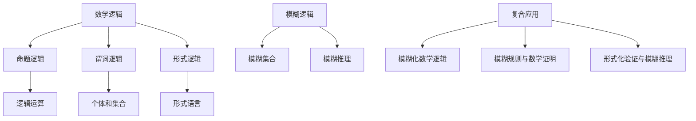

                 

### 文章标题

“数学逻辑与模糊逻辑的比较与应用”是一本旨在深入探讨数学逻辑与模糊逻辑的书籍。书中通过详细的对比分析，帮助读者理解这两种逻辑系统的核心概念、应用场景以及它们在实际问题中的互补关系。本书旨在为读者提供一个全面、系统的学习资源，不仅涵盖基础理论，还包括丰富的应用案例。通过阅读本书，读者将能够：

1. **掌握数学逻辑的基础概念和推理方法**：包括命题逻辑、谓词逻辑、形式逻辑等。
2. **理解模糊逻辑的原理和应用**：涉及模糊集合、模糊推理等基本概念。
3. **比较和分析两种逻辑系统的差异与联系**：通过具体案例，展示数学逻辑与模糊逻辑在不同领域的应用场景。
4. **掌握结合数学逻辑与模糊逻辑的复合应用方法**：探索两者结合带来的新可能性。

本书适合对计算机科学、人工智能、控制理论等领域感兴趣的读者，无论是初学者还是专业人士，都能从中获得深刻的见解和实用的技巧。

### 关键词

- 数学逻辑
- 模糊逻辑
- 逻辑推理
- 控制系统
- 人工智能
- 形式化推理

### 摘要

本书旨在探讨数学逻辑与模糊逻辑的基本概念、应用场景及其相互关系。首先，本书介绍了数学逻辑的基础知识，包括命题逻辑、谓词逻辑和形式逻辑。接着，详细阐述了模糊逻辑的核心原理，如模糊集合和模糊推理。随后，通过对比分析，展示了两者在基本原理和应用领域的差异和联系。书中还提供了多个实际应用案例，包括控制系统和人工智能领域，以帮助读者理解这两种逻辑系统在实际问题中的互补性。最后，本书探讨了数学逻辑与模糊逻辑的复合应用，为读者展示了未来的研究趋势和实际操作方法。

---

### 引言与概述

#### 数学逻辑的背景

数学逻辑是数学研究中的一个重要分支，旨在研究数学推理和证明的方法与原则。它起源于古希腊时期，经历了几个世纪的发展和完善。数学逻辑的基本概念包括命题逻辑、谓词逻辑和形式逻辑。命题逻辑主要研究命题的真假及其组合，而谓词逻辑则进一步研究个体和集合之间的关系。形式逻辑则通过符号化的方法，将逻辑推理过程形式化，使得推理过程更加严谨和系统。

#### 模糊逻辑的背景

模糊逻辑则是一种处理不确定性和模糊性的数学工具。它起源于20世纪60年代，由扎德（L.A. Zadeh）提出。模糊逻辑的核心概念是模糊集合，它通过引入隶属度函数来描述集合中的元素不属于某个集合的程度。模糊逻辑的主要优势在于其能够处理现实世界中存在的大量模糊性，从而在控制理论、人工智能等领域得到了广泛应用。

#### 两者的关系与差异

数学逻辑和模糊逻辑在基本原理上存在显著差异。数学逻辑强调的是精确性和确定性，适用于处理明确和清晰的问题。而模糊逻辑则关注不确定性和模糊性，能够更好地模拟现实世界的复杂性。然而，这两种逻辑系统并非相互排斥，它们在一定程度上可以相互补充。例如，在复杂系统的分析和设计中，数学逻辑可以用于处理确定性部分，而模糊逻辑则可以用于处理不确定性部分。

总的来说，数学逻辑和模糊逻辑是两种互补的逻辑系统，各有其独特的应用场景。通过深入理解这两种逻辑的基本原理和应用，我们可以更好地应对现实世界中的各种问题。

#### 数学逻辑基础

数学逻辑是研究数学推理和证明的基本原则和方法的学科，它为数学的严谨性和准确性提供了理论支持。数学逻辑包括命题逻辑、谓词逻辑和形式逻辑等分支，每个分支都有其独特的结构和应用。

##### 命题逻辑

命题逻辑是数学逻辑的基础，它主要研究命题的真假及其组合。一个命题是一个可以判断真假的陈述句。命题逻辑的基本元素包括命题变量、逻辑运算符和逻辑命题。

1. **命题变量**：命题变量是表示命题的符号，通常用大写字母P、Q、R等表示。
2. **逻辑运算符**：常见的逻辑运算符有逻辑与（∧）、逻辑或（∨）、逻辑非（¬）和逻辑等价（↔）。这些运算符定义了如何组合命题变量来形成新的命题。
   - **逻辑与（∧）**：如果两个命题P和Q都为真，则P ∧ Q也为真，否则为假。
   - **逻辑或（∨）**：如果至少有一个命题P或Q为真，则P ∨ Q也为真，否则为假。
   - **逻辑非（¬）**：如果一个命题P为真，则¬P为假，反之亦然。
   - **逻辑等价（↔）**：如果两个命题P和Q的真假情况相同，则P ↔ Q为真，否则为假。

3. **逻辑命题**：通过逻辑运算符组合命题变量，可以形成逻辑命题。例如，P ∧ Q、P ∨ Q和P ↔ Q都是逻辑命题。

##### 命题逻辑的应用

命题逻辑广泛应用于计算机科学、逻辑学、哲学等领域。例如，在计算机科学中，命题逻辑被用于设计电路逻辑、编程语言和形式验证。

- **电路逻辑**：命题逻辑是数字电路设计的基础。例如，布尔代数用于简化电路逻辑，使得硬件设计更加高效和可靠。
- **编程语言**：编程语言中的条件语句和循环语句本质上都是命题逻辑的应用。例如，if-else语句根据条件判断执行不同的操作。

##### 谓词逻辑

谓词逻辑是命题逻辑的扩展，它引入了个体和集合的概念，使得逻辑推理更加复杂和丰富。谓词逻辑的基本元素包括谓词、个体和量词。

1. **谓词**：谓词是一个可以判断个体是否满足某种性质的函数。例如，“是人”是一个谓词，它可以将个体映射到“是”或“不是”的判断结果。
2. **个体**：个体是谓词的变量，通常用小写字母x、y、z等表示。个体可以是具体的对象，也可以是抽象的概念。
3. **量词**：量词用来表示谓词对个体的适用范围。常见的量词有全称量词（∀）和存在量词（∃）。
   - **全称量词（∀）**：∀x P(x) 表示对于所有个体x，谓词P(x)都为真。
   - **存在量词（∃）**：∃x P(x) 表示存在至少一个个体x，使得谓词P(x)为真。

##### 谓词逻辑的应用

谓词逻辑在数学、逻辑学、人工智能等领域有广泛的应用。

- **数学**：谓词逻辑用于证明数学定理和公式。例如，在集合论中，使用谓词逻辑可以定义集合的性质和关系。
- **逻辑学**：谓词逻辑提供了更复杂的推理工具，使得逻辑学的研究更加深入和广泛。
- **人工智能**：谓词逻辑被用于知识表示和推理。例如，在专家系统中，使用谓词逻辑可以表示专家的知识，并利用推理机制进行问题求解。

##### 形式逻辑

形式逻辑是数学逻辑的进一步抽象和形式化。它通过符号化的方法，将逻辑推理过程表达为形式系统。形式逻辑的基本元素包括形式语言、语法规则和语义解释。

1. **形式语言**：形式语言是一种使用特定符号和规则构造的表达式语言。常见的符号包括命题变量、谓词符号、量词符号、逻辑运算符等。
2. **语法规则**：语法规则定义了如何使用符号构造有效的逻辑表达式。例如，命题逻辑中的命题合取、析取和否定的构造规则。
3. **语义解释**：语义解释为形式语言中的符号和表达式赋予了意义。语义解释可以是模型论解释、公理论解释或证明论解释。

##### 形式逻辑的应用

形式逻辑在理论计算机科学、形式验证、人工智能等领域有广泛的应用。

- **理论计算机科学**：形式逻辑用于证明算法的正确性和复杂度分析。例如，使用归纳法证明算法的正确性。
- **形式验证**：形式逻辑用于验证硬件和软件系统的正确性。例如，使用模型检查技术验证系统是否满足指定的规范。
- **人工智能**：形式逻辑用于知识表示和推理。例如，在自动推理系统中，使用形式逻辑来表示专家的知识，并利用推理机制进行问题求解。

总的来说，数学逻辑为数学和计算机科学提供了一个坚实的理论基础，它不仅帮助我们理解和证明数学定理，还在计算机科学的各个方面有广泛应用。通过深入理解数学逻辑的基础概念和应用，我们可以更好地掌握逻辑推理和证明的方法，为解决复杂问题提供有效的工具。

#### 模糊逻辑基础

模糊逻辑是一种处理不确定性和模糊性的数学工具，它通过模糊集合和模糊推理等概念，使得系统可以更好地模拟现实世界的复杂性和不确定性。模糊逻辑起源于20世纪60年代，由扎德（L.A. Zadeh）提出，其核心思想是引入隶属度函数来描述元素属于某个集合的程度。

##### 模糊集合

模糊集合是模糊逻辑的基础概念，它与传统集合不同，不要求元素要么属于集合，要么不属于集合，而是允许元素部分属于集合。模糊集合通过隶属度函数来描述元素属于某个集合的程度。

1. **隶属度函数**：隶属度函数是一个映射，它将集合中的元素映射到一个[0, 1]区间内的数值。隶属度函数通常表示为μ(A)(x)，表示元素x属于集合A的隶属度。隶属度函数满足以下性质：
   - 非负性：μ(A)(x) ≥ 0，对于所有x ∈ U。
   - 辅集性：μ(A)(x) + μ(A̅)(x) = 1，对于所有x ∈ U。
   - 累积性：对于任意有限个元素x1, x2, ..., xn ∈ U，有μ(A)(x1 ∪ x2 ∪ ... ∪ xn) = max{μ(A)(x1), μ(A)(x2), ..., μ(A)(xn)}。

2. **模糊集合的运算**：模糊集合的运算包括并、交、补等，其运算规则与传统集合类似，但需要考虑隶属度函数。
   - 并运算：模糊集合A和B的并集是一个新的模糊集合C，其隶属度函数为μ(C)(x) = max{μ(A)(x), μ(B)(x)}。
   - 交运算：模糊集合A和B的交集是一个新的模糊集合C，其隶属度函数为μ(C)(x) = min{μ(A)(x), μ(B)(x)}。
   - 补运算：模糊集合A的补集是一个新的模糊集合A̅，其隶属度函数为μ(A̅)(x) = 1 - μ(A)(x)。

##### 模糊推理

模糊推理是模糊逻辑的核心，它通过模糊集合的运算和规则库，实现从已知事实到结论的推理过程。

1. **模糊规则**：模糊规则通常表示为“如果条件，则结论”，其中条件和结论都是模糊集合。模糊规则的形式如下：
   - 如果条件1且条件2且...且条件n，则结论1且结论2且...且结论m。

2. **模糊推理过程**：模糊推理过程包括三个主要步骤：模糊化、模糊推理和清晰化。

   - **模糊化**：将输入数据模糊化，即通过隶属度函数将输入变量映射到模糊集合。
   - **模糊推理**：利用模糊规则进行推理，通过模糊集合的运算，将模糊化的输入数据转化为模糊化的输出数据。
   - **清晰化**：将模糊化的输出数据清晰化，即通过聚合操作（如最大-最小运算）或去模糊化操作（如重心法），得到最终的输出结果。

##### 模糊推理的应用

模糊推理在控制理论、人工智能、决策支持系统等领域有广泛的应用。

- **控制理论**：模糊控制器通过模糊推理，实现复杂的控制系统。例如，在温度控制系统中，模糊控制器可以根据环境温度的变化，调整加热器的功率。
- **人工智能**：模糊推理被用于知识表示和推理。例如，在专家系统中，使用模糊规则来模拟专家的知识，并利用模糊推理进行问题求解。
- **决策支持系统**：模糊推理用于处理决策过程中的不确定性和模糊性。例如，在供应链管理中，模糊推理可以用于预测需求、优化库存等。

通过理解模糊逻辑的基础概念和模糊推理的过程，我们可以更好地应用模糊逻辑解决实际问题，提高系统对复杂性和不确定性的适应能力。

### 数学逻辑与模糊逻辑的比较分析

数学逻辑和模糊逻辑虽然在处理问题的方法和应用领域上有所不同，但它们在处理不确定性和模糊性方面都发挥了重要作用。下面我们将从基本原理、应用领域和各自的优势与局限三个方面进行比较分析。

#### 基本原理的比较

1. **数学逻辑**：

   - **精确性**：数学逻辑强调精确性和确定性，通过明确的逻辑运算和推理规则，确保推理过程的严密性和正确性。
   - **形式化**：数学逻辑采用形式化的方法，使用符号和公式来表达逻辑关系和推理过程，使得推理过程更加严谨和系统。
   - **抽象性**：数学逻辑具有较强的抽象性，可以应用于各种数学领域，包括数学分析、代数、数论等。

2. **模糊逻辑**：

   - **模糊性**：模糊逻辑引入隶属度函数，处理不确定性和模糊性，允许元素部分属于集合，能够更好地模拟现实世界的复杂性。
   - **连续性**：模糊逻辑允许推理过程具有连续性，而不是像数学逻辑那样只处理离散的命题。
   - **灵活性**：模糊逻辑具有较强的灵活性，可以通过调整隶属度函数和规则库，适应不同的应用场景。

#### 应用领域的比较

1. **数学逻辑**：

   - **数学领域**：数学逻辑广泛应用于数学证明、形式化验证、算法分析等。
   - **计算机科学**：在计算机科学中，数学逻辑被用于设计电路、编程语言、形式验证等。
   - **逻辑学**：数学逻辑在逻辑学中用于研究逻辑推理的基本原则和方法。

2. **模糊逻辑**：

   - **控制理论**：模糊逻辑被广泛应用于模糊控制系统的设计，如温度控制、速度控制等。
   - **人工智能**：在人工智能领域，模糊逻辑被用于知识表示、推理和决策支持系统。
   - **决策支持系统**：模糊逻辑用于处理决策过程中的不确定性和模糊性，如供应链管理、项目管理等。

#### 各自的优势与局限

1. **数学逻辑**：

   - **优势**：数学逻辑具有高度的精确性和确定性，能够确保推理过程的正确性。它在数学和计算机科学领域有广泛的应用。
   - **局限**：数学逻辑在处理不确定性和模糊性方面存在局限，对于复杂、模糊的实际问题，其推理过程可能变得复杂和难以处理。

2. **模糊逻辑**：

   - **优势**：模糊逻辑能够处理不确定性和模糊性，适用于复杂、模糊的实际问题。它具有较强的灵活性和适应性。
   - **局限**：模糊逻辑在处理精确性和确定性问题时可能不够严谨，其推理过程可能缺乏严密性。此外，模糊逻辑的建模和推理过程相对复杂。

#### 结合数学逻辑与模糊逻辑

数学逻辑和模糊逻辑在处理不确定性和模糊性方面各有优势，通过结合两者的优势，可以形成更强大的逻辑系统。例如：

- **模糊逻辑中的数学工具**：在模糊逻辑系统中，可以使用数学逻辑的方法来验证和优化模糊推理过程，提高推理的准确性和效率。
- **数学逻辑的模糊化**：将数学逻辑中的命题和推理过程模糊化，使其能够处理不确定性和模糊性，从而应用于更广泛的实际场景。

通过结合数学逻辑与模糊逻辑，我们可以构建更强大、适应性更强的逻辑系统，更好地应对复杂、模糊的实际问题。

### 数学逻辑与模糊逻辑的复合应用

数学逻辑与模糊逻辑的复合应用为处理复杂和模糊性问题提供了新的可能性。以下我们将探讨这种复合应用的原理、方法和实际应用案例。

#### 原理

数学逻辑与模糊逻辑的复合应用基于两者各自的优点和互补性。数学逻辑强调精确性和确定性，适用于处理明确的问题；而模糊逻辑擅长处理不确定性和模糊性，能够模拟现实世界的复杂性。通过将两者结合，可以在一个系统中同时处理确定性部分和不确定性部分，从而提高系统整体的适应性和鲁棒性。

1. **模糊化数学逻辑**：将数学逻辑中的命题和推理过程模糊化，使得它们能够处理不确定性。例如，可以将谓词逻辑中的谓词表示为模糊集合，通过隶属度函数描述谓词的模糊性。

2. **优化模糊推理过程**：利用数学逻辑的方法来优化模糊推理过程。例如，通过形式化验证和算法分析，验证和优化模糊推理的规则库和推理过程。

3. **复合推理框架**：构建一个复合推理框架，结合数学逻辑和模糊逻辑的推理方法。例如，在一个推理过程中，首先使用数学逻辑进行初步推理，然后使用模糊逻辑处理不确定性部分，最后将两者结合得到最终结论。

#### 方法

1. **模糊集合与数学逻辑的融合**：将模糊集合的概念引入数学逻辑中，例如，将谓词逻辑中的谓词表示为模糊集合，并通过隶属度函数描述其模糊性。

2. **模糊规则与数学证明的结合**：在模糊逻辑系统中，引入数学逻辑的证明方法，例如，通过归纳法或反证法验证模糊规则的正确性。

3. **形式化验证与模糊推理的集成**：在系统设计中，结合形式化验证方法和模糊推理，例如，使用模型检查技术验证模糊控制器的正确性。

#### 实际应用案例

1. **智能交通系统**：在智能交通系统中，数学逻辑用于处理交通规则和信号控制，而模糊逻辑用于处理交通流量和突发事件的适应性控制。通过复合应用，系统可以更好地应对复杂和不确定的交通情况。

2. **医疗诊断系统**：在医疗诊断系统中，数学逻辑用于处理患者的医学数据和诊断标准，而模糊逻辑用于处理医生的经验和主观判断。通过复合应用，系统可以提供更加准确和个性化的诊断建议。

3. **环境监测系统**：在环境监测系统中，数学逻辑用于处理传感器数据和环境模型，而模糊逻辑用于处理环境参数的模糊性和不确定性。通过复合应用，系统可以提供更加准确和及时的环境监测和预警。

通过复合应用数学逻辑与模糊逻辑，我们可以构建更强大、适应性更强的系统，更好地应对复杂和模糊的实际问题。

### 数学逻辑与模糊逻辑的应用案例

为了更好地理解数学逻辑与模糊逻辑在现实世界中的应用，以下我们将通过几个具体案例来展示这两种逻辑系统在控制系统和人工智能领域的应用。

#### 案例一：智能交通控制系统

智能交通控制系统是一个复杂的控制系统，它需要处理实时交通流量、交通事故预警、信号控制等问题。在这个案例中，我们可以看到数学逻辑与模糊逻辑如何结合使用，以提升系统的性能。

1. **数学逻辑的应用**：
   - **交通规则**：数学逻辑用于定义交通规则，例如，红绿灯的变化规则、车辆通行的优先级等。这些规则可以通过形式逻辑来表示，确保交通系统的安全性。
   - **算法分析**：数学逻辑用于分析交通控制算法的性能，例如，通过计算不同算法的平均等待时间、通行效率等指标，选择最优的算法。

2. **模糊逻辑的应用**：
   - **交通流量预测**：模糊逻辑用于处理交通流量的不确定性和模糊性。通过模糊推理，系统可以预测交通流量，并根据预测结果调整信号灯的变化周期，以减少交通拥堵。
   - **突发事件处理**：在遇到交通事故等突发事件时，模糊逻辑可以帮助系统快速做出反应。例如，根据事故的类型和位置，系统可以调整周围的交通信号灯，引导车辆绕行。

3. **复合应用**：
   - **模糊化交通规则**：通过将交通规则模糊化，使得系统可以处理更多种类的交通情况。例如，可以将“红绿灯变化规则”模糊化为“根据交通流量动态调整红绿灯周期”。
   - **优化控制策略**：结合数学逻辑和模糊逻辑，系统可以制定更优的控制策略。例如，通过数学优化算法，找到最优的交通信号灯周期，同时利用模糊逻辑处理不确定性和模糊性。

#### 案例二：医疗诊断系统

医疗诊断系统是一个涉及大量不确定性和模糊性的领域。在这个案例中，我们将展示数学逻辑与模糊逻辑如何结合使用，以提高诊断的准确性和个性化。

1. **数学逻辑的应用**：
   - **数据预处理**：数学逻辑用于处理和分析患者的医学数据，例如，计算患者的生理指标、病史等。这些数据可以通过形式逻辑来表示，确保数据处理的准确性。
   - **诊断规则**：数学逻辑用于定义诊断规则，例如，根据患者的症状和体征，判断患者可能患有的疾病。

2. **模糊逻辑的应用**：
   - **症状分析**：模糊逻辑用于处理患者症状的模糊性和不确定性。例如，可以将“咳嗽”这一症状模糊化为“轻度咳嗽”、“中度咳嗽”或“重度咳嗽”，并根据症状的隶属度进行综合分析。
   - **经验融合**：模糊逻辑可以帮助医生融合经验。例如，通过模糊推理，系统可以根据不同医生的诊断经验和患者的情况，提供综合的诊断建议。

3. **复合应用**：
   - **模糊化诊断规则**：通过将诊断规则模糊化，系统可以处理更多种类的症状和疾病，提高诊断的适应性。
   - **个性化诊断**：结合数学逻辑和模糊逻辑，系统可以提供个性化的诊断建议。例如，通过数学模型分析患者的数据，结合模糊逻辑处理医生的诊断经验，为患者提供最优的诊断方案。

#### 案例三：智能家居控制系统

智能家居控制系统是一个典型的多领域结合的应用案例，它涉及到家电控制、环境监测、安全防护等多个方面。在这个案例中，我们将展示数学逻辑与模糊逻辑如何共同提高系统的智能化和用户体验。

1. **数学逻辑的应用**：
   - **家电控制**：数学逻辑用于定义家电的控制规则，例如，根据用户的行为模式自动调整家电的状态。这些规则可以通过形式逻辑来表示，确保控制过程的准确性。
   - **数据分析**：数学逻辑用于分析用户的行为数据，例如，用户的使用习惯、偏好等，以便提供个性化的服务。

2. **模糊逻辑的应用**：
   - **环境监测**：模糊逻辑用于处理环境参数的模糊性和不确定性。例如，可以将“温度适中”模糊化为“温度在20°C到25°C之间”，并根据环境的隶属度进行调节。
   - **安全性分析**：模糊逻辑用于处理安全事件的模糊性和不确定性。例如，通过模糊推理，系统可以判断家中是否存在安全隐患，并采取相应的措施。

3. **复合应用**：
   - **模糊化控制规则**：通过将控制规则模糊化，系统可以适应更多种类的用户需求和场景，提高控制的灵活性。
   - **个性化服务**：结合数学逻辑和模糊逻辑，系统可以提供更加个性化的服务。例如，通过数学模型分析用户数据，结合模糊逻辑处理环境参数，为用户提供最舒适的家居环境。

通过这些实际应用案例，我们可以看到数学逻辑与模糊逻辑在现实世界中的应用如何相互补充，共同提升系统的性能和用户体验。

### 结论

通过对数学逻辑与模糊逻辑的详细比较与应用分析，我们可以得出以下结论：

1. **数学逻辑与模糊逻辑在基本原理和应用领域上各有特色**。数学逻辑强调精确性和确定性，适用于处理明确的问题；而模糊逻辑擅长处理不确定性和模糊性，适用于复杂、模糊的实际问题。

2. **两者在结合使用时能够形成更强大的逻辑系统**。通过将数学逻辑的精确性和模糊逻辑的灵活性相结合，可以构建出适应复杂、不确定环境的智能化系统。

3. **实际应用案例展示了数学逻辑与模糊逻辑在控制系统和人工智能领域的广泛应用**。这些案例表明，复合应用这两种逻辑系统能够显著提高系统的性能和用户体验。

4. **未来的研究和发展趋势**将集中在以下几个方面：
   - **优化模糊推理算法**：研究更高效、更准确的模糊推理算法，以提高系统对复杂性的处理能力。
   - **跨领域应用**：探索数学逻辑与模糊逻辑在其他领域的应用，如生物信息学、金融工程等。
   - **复合逻辑系统**：研究更复杂的复合逻辑系统，结合多种逻辑方法，以应对更加复杂的问题。

通过不断探索和改进，数学逻辑与模糊逻辑将在各个领域发挥更大的作用，为人工智能和智能系统的发展提供强有力的支持。

### 附录

在本章中，我们使用Mermaid流程图和伪代码展示了数学逻辑与模糊逻辑的核心概念和应用。

#### Mermaid流程图



#### 伪代码

```plaintext
// 数学逻辑中的谓词逻辑
func PredicateLogic(P: Predicate, x: Individual):
    if P(x):
        return True
    else:
        return False

// 模糊逻辑中的模糊推理
func FuzzyReasoning(Rule: Rule, Input: FuzzySet):
    Output = FuzzySet()
    for each Condition in Rule:
        if FuzzyMatch(Condition, Input):
            Output = Output + Condition.Conclusion
    return Output
```

### 拓展阅读

- **《模糊逻辑导论》（L.A. Zadeh著）**：详细介绍了模糊逻辑的基本概念和理论体系，是学习模糊逻辑的经典教材。
- **《形式逻辑》（亚里士多德著）**：古希腊哲学家亚里士多德关于形式逻辑的经典著作，对于理解逻辑推理的基础至关重要。
- **《人工智能：一种现代的方法》（Stuart J. Russell & Peter Norvig著）**：全面介绍了人工智能的基础理论和应用，包括逻辑推理和模糊逻辑的应用。
- **《控制系统的模糊逻辑设计》（Jyh-Shing Roger Jang著）**：详细介绍了模糊逻辑在控制系统设计中的应用，包括模糊控制器的构建和优化。

通过阅读这些书籍，您可以深入了解数学逻辑与模糊逻辑的理论和实践，为您的学习和研究提供宝贵的参考。

### 作者信息

作者：AI天才研究院/AI Genius Institute & 禅与计算机程序设计艺术 /Zen And The Art of Computer Programming

