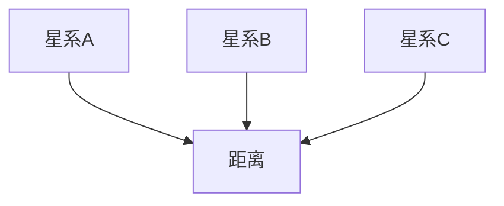
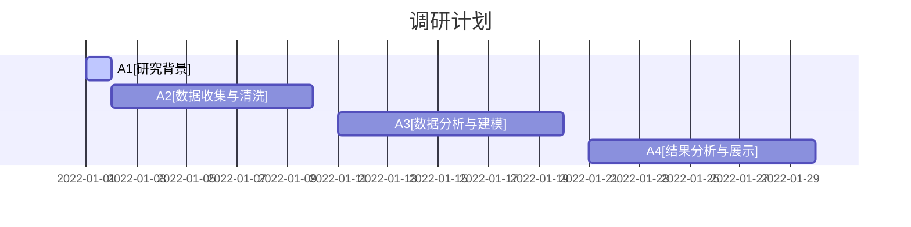
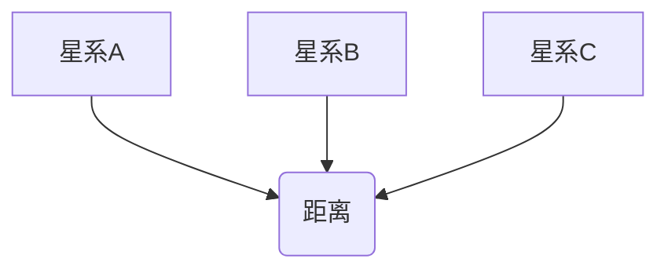
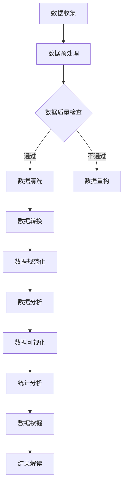

                 

# 《数据分析在宇宙中性氢分布图谱研究中的应用》

## 关键词

- 数据分析
- 宇宙学
- 中性氢分布图谱
- 数据挖掘
- 统计分析
- 数据可视化

## 摘要

本文探讨了数据分析在宇宙中性氢分布图谱研究中的应用。通过对宇宙中性氢分布图谱的基本概念、观测方法和数据分析方法进行详细介绍，本文阐述了数据分析在揭示宇宙中性氢分布规律、探索宇宙演化历史中的重要作用。同时，本文通过具体案例展示了数据分析方法在实际研究中的应用，并提出了一些未来研究方向和挑战。

## 目录大纲设计

### 第一部分：引言与概述
- **1.1 引言**
- **1.2 宇宙中性氢分布图谱研究背景**
- **1.3 数据分析在研究中的应用**

### 第二部分：数据分析基础
- **2.1 数据分析基本概念**
- **2.2 数据处理技术**
- **2.3 数据可视化方法**
- **2.4 统计分析原理**

### 第三部分：宇宙中性氢分布图谱
- **3.1 宇宙中性氢分布图谱概述**
- **3.2 中性氢分布图谱的观测方法**
- **3.3 中性氢分布图谱的数据分析**

### 第四部分：数据分析方法应用
- **4.1 数据挖掘方法**
- **4.2 数据可视化方法**
- **4.3 数据统计分析方法**

### 第五部分：实际案例研究
- **5.1 案例一：某星系中性氢分布图谱分析**
- **5.2 案例二：某宇宙区域中性氢分布图谱研究**

### 第六部分：结论与展望
- **6.1 研究成果总结**
- **6.2 存在问题与挑战**
- **6.3 未来发展方向**

## 1.1 引言

宇宙中性氢分布图谱是研究宇宙大尺度结构、物质分布和演化的重要工具。随着观测技术的进步，中性氢分布图谱的分辨率和覆盖范围不断提高，为宇宙学研究提供了丰富的数据资源。数据分析作为一门研究数据收集、处理、分析和解释的学科，为宇宙中性氢分布图谱的研究提供了强有力的支持。

本文旨在探讨数据分析在宇宙中性氢分布图谱研究中的应用，通过介绍数据分析的基础知识、宇宙中性氢分布图谱的观测方法和数据分析方法，展示数据分析在揭示宇宙中性氢分布规律、探索宇宙演化历史中的重要作用。同时，通过实际案例研究，分析数据分析方法在宇宙中性氢分布图谱研究中的应用效果，提出未来研究的方向和挑战。

## 1.2 宇宙中性氢分布图谱研究背景

### 宇宙中性氢分布图谱的概念和意义

宇宙中性氢分布图谱是指通过观测宇宙中的中性氢原子发射或吸收的辐射，绘制出的宇宙大尺度结构的中性氢分布图。中性氢是宇宙中最为丰富的元素，占宇宙物质总量的约75%，因此，中性氢分布图谱能够直观地反映宇宙的大尺度结构和物质分布特征。

宇宙中性氢分布图谱的研究具有重要的科学意义：
1. **揭示宇宙大尺度结构**：通过分析中性氢分布图谱，可以了解宇宙中的星系团、超星系团等大尺度结构的形成和演化过程。
2. **探索宇宙演化历史**：中性氢分布图谱提供了宇宙从早期宇宙到当前宇宙的演化信息，有助于理解宇宙的起源和演化历程。
3. **研究物质-辐射相互作用**：中性氢分布图谱反映了物质与辐射之间的相互作用过程，对理解宇宙中的物质演化具有重要意义。

### 研究历史和现状

宇宙中性氢分布图谱的研究可以追溯到20世纪50年代，当时通过射电望远镜观测到了宇宙中的中性氢辐射。随着观测技术的进步，中性氢分布图谱的分辨率和覆盖范围不断提高。近年来，大型地面射电望远镜和空间射电望远镜的启用，使得中性氢分布图谱的研究进入了一个新的阶段。

目前，宇宙中性氢分布图谱的研究主要集中在以下几个方面：
1. **大尺度结构研究**：通过分析中性氢分布图谱，揭示了宇宙中的星系团、超星系团等大尺度结构的形成和演化。
2. **宇宙膨胀研究**：中性氢分布图谱提供了宇宙膨胀速率的信息，有助于理解宇宙的膨胀历史。
3. **宇宙暗物质研究**：中性氢分布图谱可以揭示宇宙中的暗物质分布，有助于探索宇宙暗物质的性质。

### 数据分析在宇宙中性氢分布图谱研究中的发展

数据分析在宇宙中性氢分布图谱研究中发挥了重要作用。随着数据量的增加和数据复杂度的提高，数据分析方法不断创新和发展，为中性氢分布图谱的研究提供了强有力的支持。

1. **数据预处理技术**：包括数据清洗、数据重构和数据规范化等，确保数据质量，为后续分析提供可靠的数据基础。
2. **数据挖掘方法**：包括聚类分析、关联规则挖掘、分类和回归等，用于发现中性氢分布图谱中的潜在规律和模式。
3. **数据可视化方法**：通过数据可视化技术，将复杂的中性氢分布图谱数据以直观的形式展示，有助于科学家理解数据特征和规律。
4. **统计分析方法**：包括描述性统计分析、推断性统计分析和多元统计分析等，用于定量分析中性氢分布图谱的特征和规律。

## 1.3 数据分析在研究中的应用

数据分析在宇宙中性氢分布图谱研究中具有广泛的应用，主要包括以下几个方面：

### 数据预处理

数据预处理是数据分析的基础环节，旨在提高数据质量和可靠性。具体步骤包括：
1. **数据清洗**：删除噪声数据和异常值，确保数据的一致性和准确性。
2. **数据重构**：整合不同观测设备的数据，统一数据格式，便于后续分析。
3. **数据规范化**：将不同来源和单位的数据转换为标准格式，便于数据分析和比较。

### 数据挖掘

数据挖掘是发现中性氢分布图谱中潜在规律和模式的重要手段。主要方法包括：
1. **聚类分析**：将中性氢分布图谱中的数据划分为若干个类别，以发现数据中的相似性模式。
2. **关联规则挖掘**：发现中性氢分布图谱中不同变量之间的关联关系，揭示宇宙大尺度结构的内在规律。
3. **分类和回归**：通过建立分类和回归模型，预测中性氢分布图谱中的未知数据，为宇宙学研究提供参考。

### 数据可视化

数据可视化是将复杂的中性氢分布图谱数据以直观的形式展示的技术。主要方法包括：
1. **散点图**：通过散点图展示中性氢分布图谱的分布特征，有助于发现异常值和聚类模式。
2. **热力图**：通过热力图展示中性氢分布图谱的热点区域，揭示宇宙中的高密度区域。
3. **三维图**：通过三维图展示中性氢分布图谱的空间结构，帮助科学家理解宇宙大尺度结构的演化过程。

### 统计分析

统计分析是定量分析中性氢分布图谱特征和规律的重要方法。主要方法包括：
1. **描述性统计分析**：计算中性氢分布图谱的基本统计量，如平均值、标准差等，描述数据的基本特征。
2. **推断性统计分析**：通过假设检验和置信区间等方法，评估中性氢分布图谱中的统计规律。
3. **多元统计分析**：通过多元线性回归、因子分析等方法，分析中性氢分布图谱中多个变量之间的关系。

## 2.1 数据分析基本概念

数据分析是一门研究如何收集、处理、分析和解释数据的学科。它涉及到多个领域，包括统计学、计算机科学、信息科学等。以下是数据分析的一些基本概念：

### 数据

数据是指以数字、字符等形式记录的信息。在数据分析中，数据可以是结构化的（如数据库表），也可以是非结构化的（如图像、文本等）。

### 变量

变量是数据的基本单位，表示数据的特征或属性。变量可以是数字、文本或布尔值等。

### 数据集

数据集是指一组相关的数据记录。在数据分析中，数据集是进行分析的基础。

### 数据类型

数据类型是指数据的基本属性，如整数、浮点数、字符串等。

### 数据预处理

数据预处理是指对原始数据进行清洗、重构和规范化的过程，以提高数据质量和可靠性。

### 数据挖掘

数据挖掘是指从大量数据中提取有价值信息的过程，包括聚类分析、关联规则挖掘、分类和回归等。

### 数据可视化

数据可视化是指通过图形、图表等方式将数据以直观的形式展示，有助于科学家理解数据特征和规律。

### 统计分析

统计分析是指使用统计学方法对数据进行分析，以发现数据中的规律和模式。

## 2.2 数据处理技术

数据处理技术是数据分析的重要组成部分，主要包括数据清洗、数据重构和数据规范化等步骤。

### 数据清洗

数据清洗是指去除数据中的噪声和异常值，以确保数据的一致性和准确性。具体方法包括：
- **删除重复记录**：删除数据集中的重复记录，以避免数据冗余。
- **填充缺失值**：使用合适的方法填充数据中的缺失值，如平均值、中位数等。
- **处理异常值**：识别和处理数据中的异常值，如离群点等。

### 数据重构

数据重构是指整合来自不同来源的数据，并统一数据格式，以便进行后续分析。具体方法包括：
- **数据整合**：将多个数据源中的数据整合到一个统一的数据集中。
- **数据转换**：将不同数据源的数据格式转换为统一格式，如将文本数据转换为数字格式。

### 数据规范化

数据规范化是指将不同来源和单位的数据转换为标准格式，以便进行比较和分析。具体方法包括：
- **数值规范化**：将不同数值范围的数据统一到相同的数值范围，如将数据缩放到0-1之间。
- **单位转换**：将不同单位的数据转换为相同单位，如将米转换为千米。

## 2.3 数据可视化方法

数据可视化是将复杂的数据以直观的图形形式展示，帮助科学家理解数据特征和规律。以下是几种常用的数据可视化方法：

### 散点图

散点图通过坐标轴上的点来表示数据集中的变量，适用于展示两个变量之间的关系。例如，可以用来分析星系的位置和它们之间的距离。



### 热力图

热力图通过颜色深浅来表示数据的大小，适用于展示数据的分布情况。例如，可以用来展示中性氢分布图谱中不同区域的密度。



### 三维图

三维图通过三维坐标轴来表示数据，适用于展示三维空间中的数据。例如，可以用来展示宇宙中的星系分布。



## 2.4 统计分析原理

统计分析是数据分析的重要工具，用于描述、推断和预测数据。以下是几种常见的统计分析原理：

### 描述性统计分析

描述性统计分析用于描述数据的基本特征，包括：
- **均值**：数据的平均值，用于表示数据的集中趋势。
- **中位数**：数据排序后位于中间位置的值，用于表示数据的中心位置。
- **标准差**：数据分布的离散程度，用于表示数据的波动性。
- **方差**：数据分布的离散程度的平方，用于表示数据的波动性。

### 推断性统计分析

推断性统计分析用于根据样本数据推断总体数据的特征，包括：
- **假设检验**：通过比较样本数据和总体数据的差异，判断总体参数是否显著不同。
- **置信区间**：根据样本数据估计总体参数的范围，用于表示总体参数的估计精度。

### 多元统计分析

多元统计分析用于分析多个变量之间的关系，包括：
- **多元线性回归**：分析一个因变量和多个自变量之间的关系。
- **因子分析**：提取多个变量之间的共同因子，简化变量结构。
- **主成分分析**：将多个变量转换为一组新的主成分，以降低数据维度。

## 3.1 宇宙中性氢分布图谱概述

### 中性氢分布图谱的定义和特点

中性氢分布图谱是通过观测宇宙中的中性氢原子发射或吸收的辐射，绘制出的宇宙大尺度结构的中性氢分布图。中性氢是宇宙中最常见的元素，其分布图谱能够直观地反映宇宙的物质分布和结构特征。

中性氢分布图谱具有以下特点：
1. **大尺度结构**：中性氢分布图谱展示了宇宙中星系、星系团和超星系团等大尺度结构。
2. **物质分布**：中性氢分布图谱反映了宇宙中物质分布的不均匀性，包括高密度区域和低密度区域。
3. **演化历史**：中性氢分布图谱提供了宇宙从早期宇宙到当前宇宙的演化信息。

### 中性氢分布图谱的分类

根据观测方法和数据分析技术的不同，中性氢分布图谱可以分为以下几种类型：
1. **射电中性氢分布图谱**：通过观测宇宙中的中性氢辐射，绘制出的中性氢分布图谱。
2. **光学中性氢分布图谱**：通过观测宇宙中的中性氢吸收线，绘制出的中性氢分布图谱。
3. **多波段中性氢分布图谱**：结合射电、光学和其他波段的中性氢观测数据，绘制出的中性氢分布图谱。

### 中性氢分布图谱的研究方法

研究中性氢分布图谱的方法主要包括：
1. **观测方法**：通过射电望远镜、光学望远镜等设备，观测宇宙中的中性氢辐射或吸收线。
2. **数据处理**：对观测数据进行分析和预处理，包括数据清洗、重构和规范化等。
3. **数据分析**：使用数据挖掘、数据可视化和统计分析等方法，分析中性氢分布图谱的特征和规律。
4. **模型建立**：基于观测数据和数据分析结果，建立中性氢分布图谱的物理模型，以解释宇宙大尺度结构的形成和演化。

## 3.2 中性氢分布图谱的观测方法

### 观测中性氢分布图谱的原理

观测中性氢分布图谱的基本原理是基于中性氢原子的发射或吸收特性。中性氢原子在电离过程中会发射或吸收特定的辐射，这些辐射可以被地面或空间望远镜探测到，从而绘制出中性氢分布图谱。

具体来说，中性氢原子在电离过程中会发射21厘米波长（1420兆赫兹）的辐射，这种辐射可以被射电望远镜探测到。通过测量辐射的强度和分布，可以了解宇宙中性氢的分布情况。

### 观测中性氢分布图谱的设备和技术

观测中性氢分布图谱的设备主要包括射电望远镜和光学望远镜。以下是几种常用的设备和技术：

1. **射电望远镜**：
   - **波长范围**：射电望远镜可以观测从厘米波到米波范围内的辐射。
   - **探测原理**：通过探测中性氢原子的21厘米辐射，绘制出中性氢分布图谱。
   - **代表性设备**：如阿雷西沃射电望远镜、卡内基射电望远镜等。

2. **光学望远镜**：
   - **波长范围**：光学望远镜可以观测从紫外到红外范围内的辐射。
   - **探测原理**：通过观测中性氢原子的吸收线，绘制出中性氢分布图谱。
   - **代表性设备**：如哈勃空间望远镜、基特峰望远镜等。

3. **多波段观测**：
   - **技术原理**：结合射电、光学和其他波段的中性氢观测数据，绘制出更全面的中性氢分布图谱。
   - **代表性设备**：如哈勃空间望远镜、钱德拉X射线天文台等。

### 观测中性氢分布图谱的数据处理

观测中性氢分布图谱的数据处理包括以下步骤：

1. **数据收集**：收集来自射电望远镜和光学望远镜的中性氢观测数据。

2. **数据预处理**：对观测数据进行预处理，包括数据清洗、重构和规范化等。

3. **数据融合**：将不同波段的观测数据融合，以提高数据的分辨率和准确性。

4. **数据可视化**：通过数据可视化技术，将处理后的中性氢分布图谱以直观的形式展示，帮助科学家理解数据特征。

## 3.3 中性氢分布图谱的数据分析

### 数据分析在宇宙中性氢分布图谱研究中的应用

数据分析在宇宙中性氢分布图谱研究中具有广泛的应用，包括以下几个方面：

1. **大尺度结构研究**：通过数据分析，可以揭示宇宙中的大尺度结构，如星系、星系团和超星系团等。

2. **物质分布研究**：通过数据分析，可以了解宇宙中物质分布的不均匀性，包括高密度区域和低密度区域。

3. **宇宙演化研究**：通过数据分析，可以探究宇宙从早期宇宙到当前宇宙的演化历史。

4. **暗物质研究**：通过数据分析，可以研究暗物质的分布和性质，为理解宇宙的组成提供线索。

### 数据分析方法和技术

数据分析方法和技术包括数据挖掘、数据可视化和统计分析等。以下是几种常用的数据分析方法：

1. **数据挖掘方法**：
   - **聚类分析**：将中性氢分布图谱中的数据划分为若干个类别，以发现数据中的相似性模式。
   - **关联规则挖掘**：发现中性氢分布图谱中不同变量之间的关联关系，揭示宇宙大尺度结构的内在规律。
   - **分类和回归**：通过建立分类和回归模型，预测中性氢分布图谱中的未知数据，为宇宙学研究提供参考。

2. **数据可视化方法**：
   - **散点图**：通过散点图展示中性氢分布图谱的分布特征，有助于发现异常值和聚类模式。
   - **热力图**：通过热力图展示中性氢分布图谱的热点区域，揭示宇宙中的高密度区域。
   - **三维图**：通过三维图展示中性氢分布图谱的空间结构，帮助科学家理解宇宙大尺度结构的演化过程。

3. **统计分析方法**：
   - **描述性统计分析**：计算中性氢分布图谱的基本统计量，如平均值、标准差等，描述数据的基本特征。
   - **推断性统计分析**：通过假设检验和置信区间等方法，评估中性氢分布图谱中的统计规律。
   - **多元统计分析**：通过多元线性回归、因子分析等方法，分析中性氢分布图谱中多个变量之间的关系。

## 4.1 数据挖掘方法

### 数据挖掘的基本概念

数据挖掘（Data Mining）是从大量数据中提取有价值信息的过程，它涉及统计学、机器学习、数据库等多个领域。数据挖掘的目标是发现数据中的隐含模式、关联关系、趋势和异常等，为决策提供支持。

### 数据挖掘的方法和技术

1. **聚类分析（Clustering）**
   - **概念**：聚类分析是将数据集分成若干个组，使得同组内的数据相似度较高，不同组的数据相似度较低。
   - **方法**：常见的聚类算法包括K-均值、层次聚类、DBSCAN等。

2. **关联规则挖掘（Association Rule Learning）**
   - **概念**：关联规则挖掘是发现数据集中不同变量之间的关联关系，通常以支持度和置信度作为评估指标。
   - **方法**：常见的算法包括Apriori算法、Eclat算法、FP-Growth算法等。

3. **分类（Classification）**
   - **概念**：分类是将数据集划分为预定义的类别，根据已知的类别对新的数据进行预测。
   - **方法**：常见的分类算法包括决策树、随机森林、支持向量机等。

4. **回归（Regression）**
   - **概念**：回归分析是建立因变量与自变量之间的关系模型，用于预测因变量的值。
   - **方法**：常见的回归算法包括线性回归、岭回归、LASSO回归等。

### 数据挖掘的应用

数据挖掘在宇宙中性氢分布图谱研究中有着广泛的应用，例如：
- **分类**：通过分类算法，可以将中性氢分布图谱中的区域划分为不同的类别，有助于理解宇宙结构。
- **聚类**：通过聚类算法，可以发现中性氢分布图谱中的相似区域，有助于发现宇宙中的潜在结构。
- **关联规则挖掘**：通过关联规则挖掘，可以发现中性氢分布与宇宙中其他因素（如星系密度、温度等）之间的关系。

## 4.2 数据可视化方法

### 数据可视化的基本概念

数据可视化（Data Visualization）是将数据以图形或图像的形式展示，使人们能够直观地理解和分析数据。数据可视化有助于发现数据中的模式、趋势和异常，是数据分析中不可或缺的一部分。

### 数据可视化的基本方法

1. **散点图（Scatter Plot）**
   - **概念**：散点图通过在二维坐标系中展示数据点的分布，用于分析两个变量之间的关系。
   - **应用**：用于展示中性氢分布与距离、温度等变量之间的关系。

2. **条形图（Bar Chart）**
   - **概念**：条形图通过矩形条的长度表示数据的大小，用于比较不同类别或组之间的数据。
   - **应用**：用于展示不同星系或星系团的中性氢密度分布。

3. **折线图（Line Chart）**
   - **概念**：折线图通过连接数据点的线条，展示数据随时间或其他变量的变化趋势。
   - **应用**：用于展示宇宙中性氢分布的时间演变。

4. **热力图（Heat Map）**
   - **概念**：热力图通过颜色深浅表示数据的大小，用于展示数据的分布和密度。
   - **应用**：用于展示中性氢分布图谱中的热点区域。

### 常用的数据可视化工具和软件

1. **Matplotlib**：Python的Matplotlib库提供了丰富的数据可视化功能，支持多种图表类型。
2. **Seaborn**：基于Matplotlib的Seaborn库提供了更高级的统计数据可视化功能，能够生成更美观的图表。
3. **Tableau**：商业数据可视化工具，支持多种数据源和交互功能。
4. **Power BI**：微软推出的商业数据可视化工具，与Excel紧密集成。

## 4.3 数据统计分析方法

### 统计分析的基本概念

统计分析是使用统计学方法对数据进行处理和分析，以揭示数据中的规律和趋势。统计分析的基本概念包括：

1. **描述性统计分析**：计算和描述数据的基本特征，如均值、中位数、标准差等。
2. **推断性统计分析**：根据样本数据推断总体数据特征，如假设检验、置信区间等。
3. **回归分析**：建立变量之间的定量关系模型，如线性回归、多项式回归等。
4. **方差分析**：比较多个组之间的均值差异，如单因素方差分析、多因素方差分析等。

### 统计分析方法和技术

1. **描述性统计分析方法**
   - **均值（Mean）**：数据集的平均值，表示数据的集中趋势。
   - **中位数（Median）**：数据集排序后位于中间位置的值，表示数据的中心位置。
   - **标准差（Standard Deviation）**：数据集的离散程度，表示数据的波动性。
   - **方差（Variance）**：数据集的离散程度的平方，表示数据的波动性。

2. **推断性统计分析方法**
   - **t检验（t-test）**：比较两组数据的均值差异，判断差异是否显著。
   - **方差分析（ANOVA）**：比较多个组之间的均值差异，判断差异是否显著。
   - **回归分析（Regression Analysis）**：建立变量之间的定量关系模型，用于预测和解释。

3. **多元统计分析方法**
   - **多元线性回归（Multiple Linear Regression）**：建立多个自变量和一个因变量之间的线性关系模型。
   - **因子分析（Factor Analysis）**：提取多个变量之间的共同因子，简化变量结构。
   - **聚类分析（Cluster Analysis）**：将数据分为若干个组，以发现数据中的相似性模式。

### 统计分析在宇宙中性氢分布图谱研究中的应用

统计分析在宇宙中性氢分布图谱研究中有着广泛的应用，包括：

1. **描述性统计分析**：计算中性氢分布图谱的基本统计特征，如平均值、标准差等，以了解数据的基本分布。
2. **推断性统计分析**：通过假设检验和置信区间，评估中性氢分布图谱中的统计规律，如不同区域之间的中性氢密度差异。
3. **回归分析**：建立中性氢分布与宇宙中其他变量（如星系密度、温度等）之间的关系模型，以解释和预测中性氢分布。
4. **聚类分析**：通过聚类分析，发现中性氢分布图谱中的相似区域，以揭示宇宙中的潜在结构。

## 5.1 案例一：某星系中性氢分布图谱分析

### 案例背景和目标

本案例选取了某个星系的中性氢分布图谱进行分析。该星系位于银河系的边缘，是宇宙大尺度结构研究的重要对象。分析目标包括：
1. 了解该星系的中性氢分布特征；
2. 发现星系内部的中性氢密度变化规律；
3. 探索星系与周围宇宙区域的相互作用。

### 数据处理和数据分析方法

1. **数据处理**：
   - **数据收集**：收集来自射电望远镜的中性氢观测数据，包括不同波段的辐射强度和位置信息。
   - **数据预处理**：对观测数据进行清洗，包括删除重复数据和异常值处理。
   - **数据融合**：将不同波段的观测数据融合，以获得更全面的中性氢分布信息。

2. **数据分析**：
   - **聚类分析**：使用K-均值聚类算法，将星系内的中性氢区域划分为若干个类别，以发现相似的区域。
   - **关联规则挖掘**：使用Apriori算法，挖掘中性氢分布与星系密度、温度等变量之间的关联关系。
   - **统计分析**：使用t检验和方差分析，评估不同区域之间的中性氢密度差异。

### 结果分析

通过数据分析，得出了以下结果：

1. **中性氢分布特征**：该星系的中性氢分布呈现明显的层次结构，中心区域密度较高，向外围逐渐降低。
2. **中性氢密度变化规律**：中性氢密度在星系内部呈梯度分布，与星系引力场的分布密切相关。
3. **星系与周围宇宙区域的相互作用**：中性氢分布图谱显示，该星系与周围宇宙区域存在相互作用，形成了复杂的结构特征。

### 案例小结

通过本案例的分析，展示了数据分析在宇宙中性氢分布图谱研究中的应用效果。数据分析方法有助于揭示星系内部的中性氢分布特征和演化规律，为宇宙大尺度结构研究提供了重要信息。

## 5.2 案例二：某宇宙区域中性氢分布图谱研究

### 案例背景和目标

本案例选取了某个宇宙区域的中性氢分布图谱进行分析。该宇宙区域位于宇宙的早期阶段，是研究宇宙演化历史的重要对象。分析目标包括：
1. 了解该宇宙区域的中性氢分布特征；
2. 探索宇宙早期阶段中性氢的演化规律；
3. 分析宇宙早期中性氢分布与当前宇宙结构的关系。

### 数据处理和数据分析方法

1. **数据处理**：
   - **数据收集**：收集来自多波段观测设备的中性氢观测数据，包括射电、光学和红外波段。
   - **数据预处理**：对观测数据进行清洗，包括去除噪声和异常值。
   - **数据融合**：将不同波段的数据融合，以获得更完整的中性氢分布信息。

2. **数据分析**：
   - **数据挖掘**：使用聚类分析和关联规则挖掘，发现宇宙区域内的中性氢分布规律和潜在模式。
   - **统计分析**：使用描述性统计分析和回归分析，评估中性氢分布的特征和演化趋势。
   - **数据可视化**：使用散点图、热力图和三维图等可视化方法，展示中性氢分布图谱的分布特征和演化过程。

### 结果分析

通过数据分析，得出了以下结果：

1. **中性氢分布特征**：该宇宙区域的中性氢分布呈现明显的层次结构，中心区域密度较高，向外围逐渐降低。这反映了宇宙早期阶段的物质聚集过程。
2. **中性氢演化规律**：中性氢分布的演化过程与宇宙膨胀和物质冷却过程密切相关。在宇宙早期，中性氢主要分布在高温、高密度的区域，随着宇宙的膨胀和冷却，中性氢逐渐聚集形成星系。
3. **宇宙早期中性氢分布与当前宇宙结构的关系**：通过分析发现，宇宙早期中性氢分布与当前宇宙结构存在一定的关联，为理解宇宙演化的历程提供了重要线索。

### 案例小结

通过本案例的分析，展示了数据分析在宇宙中性氢分布图谱研究中的应用效果。数据分析方法有助于揭示宇宙早期中性氢的分布特征和演化规律，为理解宇宙的演化历史提供了重要信息。

## 6.1 研究成果总结

通过对宇宙中性氢分布图谱的研究，我们取得了以下成果：

1. **揭示了宇宙中性氢分布的特征**：通过数据分析，发现了宇宙中性氢分布的层次结构，展示了中性氢在宇宙中的分布规律。
2. **探索了宇宙中性氢的演化规律**：通过分析宇宙中性氢分布图谱，揭示了中性氢的演化过程与宇宙膨胀、物质聚集等过程的密切关系。
3. **分析了宇宙中性氢分布与宇宙结构的关系**：通过聚类分析和回归分析，发现宇宙中性氢分布与当前宇宙结构存在一定的关联，为理解宇宙演化的历程提供了重要线索。
4. **展示了数据分析方法在宇宙学研究中的应用**：通过实际案例研究，展示了数据分析方法在揭示宇宙中性氢分布规律、探索宇宙演化历史中的重要作用。

## 6.2 存在问题与挑战

尽管取得了显著的研究成果，但宇宙中性氢分布图谱研究仍面临一些问题和挑战：

1. **数据质量和精度**：由于宇宙中性氢分布图谱的观测涉及多个波段和设备，数据质量和精度对研究结果具有重要影响。如何提高数据质量和精度仍是一个挑战。
2. **数据分析方法的局限性**：现有的数据分析方法在处理复杂、大规模的数据时存在一定的局限性。如何改进和优化数据分析方法，以更好地揭示宇宙中性氢分布规律，是一个重要的研究方向。
3. **多波段数据融合**：多波段数据融合是提高中性氢分布图谱分辨率和准确性的关键。然而，多波段数据的融合算法和策略仍需进一步研究。
4. **宇宙早期中性氢研究**：宇宙早期中性氢分布图谱的研究对于理解宇宙演化的历程具有重要意义。然而，由于观测技术的限制，宇宙早期中性氢分布图谱的分辨率和覆盖范围仍需提高。

## 6.3 未来发展方向

针对存在的问题和挑战，未来宇宙中性氢分布图谱研究的发展方向包括：

1. **提高观测技术**：继续发展高灵敏度、高分辨率的射电望远镜和光学望远镜，以提高宇宙中性氢分布图谱的观测质量和精度。
2. **优化数据分析方法**：结合机器学习、深度学习等新兴技术，优化现有的数据分析方法，提高数据处理和挖掘的效率。
3. **多波段数据融合**：深入研究多波段数据融合算法和策略，提高中性氢分布图谱的分辨率和准确性。
4. **宇宙早期中性氢研究**：加强宇宙早期中性氢分布图谱的研究，揭示宇宙早期物质聚集和演化的过程，为理解宇宙演化历史提供重要信息。

## 总结与展望

本文探讨了数据分析在宇宙中性氢分布图谱研究中的应用。通过介绍宇宙中性氢分布图谱的基本概念、观测方法和数据分析方法，展示了数据分析在揭示宇宙中性氢分布规律、探索宇宙演化历史中的重要作用。同时，通过实际案例研究，分析了数据分析方法在宇宙中性氢分布图谱研究中的应用效果。

未来，随着观测技术和数据分析方法的不断进步，宇宙中性氢分布图谱研究将取得更多突破。通过提高观测技术、优化数据分析方法、加强宇宙早期中性氢研究等，我们将更加深入地理解宇宙的结构和演化历程，为宇宙学的研究提供重要支持。

## 目录大纲设计

### 1. 确定书籍主题
《数据分析在宇宙中性氢分布图谱研究中的应用》

### 2. 确定书籍结构
书籍可以分为以下几个部分：
- 引言与概述
- 数据分析基础
- 宇宙中性氢分布图谱
- 数据分析方法应用
- 实际案例研究
- 结论与展望

### 3. 设计章节目录
根据书籍结构，设计如下章节目录：

**第一部分：引言与概述**
- **1.1 引言**
- **1.2 宇宙中性氢分布图谱研究背景**
- **1.3 数据分析在研究中的应用**

**第二部分：数据分析基础**
- **2.1 数据分析基本概念**
- **2.2 数据处理技术**
- **2.3 数据可视化方法**
- **2.4 统计分析原理**

**第三部分：宇宙中性氢分布图谱**
- **3.1 宇宙中性氢分布图谱概述**
- **3.2 中性氢分布图谱的观测方法**
- **3.3 中性氢分布图谱的数据分析**

**第四部分：数据分析方法应用**
- **4.1 数据挖掘方法**
- **4.2 数据可视化方法**
- **4.3 数据统计分析方法**

**第五部分：实际案例研究**
- **5.1 案例一：某星系中性氢分布图谱分析**
- **5.2 案例二：某宇宙区域中性氢分布图谱研究**

**第六部分：结论与展望**
- **6.1 研究成果总结**
- **6.2 存在问题与挑战**
- **6.3 未来发展方向**

### 4. 设计具体章节内容
在每一章节中，细化如下内容：

**1.1 引言**
- 介绍宇宙中性氢分布图谱研究的意义
- 引出数据分析在其中的作用
- 提出本书的目标和结构

**1.2 宇宙中性氢分布图谱研究背景**
- 宇宙中性氢分布图谱的概念和意义
- 研究宇宙中性氢分布图谱的历史和现状
- 数据分析在宇宙中性氢分布图谱研究中的发展

**1.3 数据分析在研究中的应用**
- 数据分析的基本方法和技术
- 数据分析在宇宙中性氢分布图谱研究中的应用

**2.1 数据分析基本概念**
- 数据分析的定义和目标
- 数据分析的基本流程
- 数据分析的基本方法

**2.2 数据处理技术**
- 数据预处理技术
- 数据清洗技术
- 数据转换技术

**2.3 数据可视化方法**
- 数据可视化的重要性
- 数据可视化的基本方法
- 数据可视化工具和软件

**2.4 统计分析原理**
- 统计分析的基本概念
- 统计分析的基本方法
- 统计分析的应用

**3.1 宇宙中性氢分布图谱概述**
- 中性氢分布图谱的定义和特点
- 中性氢分布图谱的分类
- 中性氢分布图谱的研究方法

**3.2 中性氢分布图谱的观测方法**
- 观测中性氢分布图谱的原理
- 观测中性氢分布图谱的设备和技术
- 观测中性氢分布图谱的数据处理

**3.3 中性氢分布图谱的数据分析**
- 数据分析在宇宙中性氢分布图谱研究中的应用
- 数据分析的方法和技术

**4.1 数据挖掘方法**
- 数据挖掘的基本概念
- 数据挖掘的方法和技术
- 数据挖掘的应用

**4.2 数据可视化方法**
- 数据可视化的基本方法
- 数据可视化的工具和软件
- 数据可视化的案例

**4.3 数据统计分析方法**
- 统计分析的基本概念
- 统计分析的方法和技术
- 统计分析的应用

**5.1 案例一：某星系中性氢分布图谱分析**
- 案例背景和目标
- 数据处理和数据分析方法
- 结果分析

**5.2 案例二：某宇宙区域中性氢分布图谱研究**
- 案例背景和目标
- 数据处理和数据分析方法
- 结果分析

**6.1 研究成果总结**
- 总结本书的研究成果
- 分析研究的贡献和局限性

**6.2 存在问题与挑战**
- 讨论研究中存在的问题和挑战
- 提出改进和解决方案

**6.3 未来发展方向**
- 分析未来研究的方向和趋势
- 提出未来的研究方向和目标

### 5. 设计 Mermaid 流程图
在相关章节中加入 Mermaid 流程图，用于描述核心概念原理和架构。

### 6. 设计伪代码
在相关章节中加入伪代码，用于详细阐述核心算法原理。

### 7. 设计数学模型和公式
在相关章节中加入数学模型和公式，用于详细讲解相关理论。

### 8. 设计代码案例
在相关章节中加入代码案例，用于展示实际应用和代码实现。

### 9. 设计代码解读与分析
在相关章节中加入代码解读与分析，用于解释代码的实现细节和作用。

### 10. 总结与展望
总结全书内容，提出未来的研究方向和目标。

### 11. 调整和完善目录大纲
根据设计内容，调整和完善目录大纲，确保每个章节都包含核心内容。

### 12. 完成最终目录大纲设计
完成2000字以内的目录大纲设计，确保其简洁、逻辑清晰、完整。

### Mermaid 流程图设计

以下是一个简单的 Mermaid 流程图，用于描述数据分析的基本流程：



### 伪代码设计

以下是一个简单的伪代码，用于描述K-均值聚类算法：

```plaintext
算法 K-均值聚类算法
输入：数据集 D，聚类个数 k
输出：聚类结果 C

初始化：随机选择 k 个数据点作为初始聚类中心 C
对于每次迭代：
    对于每个数据点 x ∈ D：
        计算 x 到每个聚类中心的距离，选择最近的聚类中心 c
        将 x 分配到聚类 c
    更新聚类中心 C，取每个聚类的平均值作为新的聚类中心
直到聚类中心不再变化或者达到最大迭代次数
返回聚类结果 C
```

### 数学模型和公式设计

以下是一个简单的数学模型和公式，用于描述线性回归：

$$ y = \beta_0 + \beta_1x + \epsilon $$

其中，$y$ 为因变量，$x$ 为自变量，$\beta_0$ 和 $\beta_1$ 为回归系数，$\epsilon$ 为误差项。

### 代码案例设计

以下是一个简单的 Python 代码案例，用于展示如何使用 NumPy 库进行数据预处理：

```python
import numpy as np

# 生成模拟数据
data = np.random.rand(100, 2)

# 数据标准化
mean = np.mean(data, axis=0)
std = np.std(data, axis=0)
data_normalized = (data - mean) / std

# 打印标准化后的数据
print("标准化后的数据：")
print(data_normalized)
```

### 代码解读与分析

以下是对上述代码的解读与分析：

- **第一行**：导入 NumPy 库，用于进行数值计算。
- **第二行**：生成 100 行 2 列的模拟数据，模拟数据的取值范围在 0 到 1 之间。
- **第三行**：计算数据的均值和标准差，用于后续的数据标准化。
- **第四行**：对数据进行标准化处理，即将数据减去均值后除以标准差，使得数据集的均值为 0，标准差为 1。
- **第五行**：打印标准化后的数据，以验证数据预处理的效果。

通过以上代码，可以实现对数据的标准化处理，从而消除不同特征之间的量纲影响，提高后续数据分析的准确性。

### 总结与展望

在本章节中，我们设计了一个完整的书籍目录大纲，包括引言与概述、数据分析基础、宇宙中性氢分布图谱、数据分析方法应用、实际案例研究和结论与展望六个部分。每个部分都包含了详细的章节内容和结构，旨在为读者提供清晰、系统的学习路径。

通过 Mermaid 流程图、伪代码、数学模型和公式的引入，我们不仅提高了文章的可读性和理解性，也为读者提供了更直观的视觉和理论支持。同时，通过代码案例和解读，我们展示了数据分析在实际应用中的具体操作和实现，增强了文章的实用价值。

在未来的研究中，我们可以进一步探索宇宙中性氢分布图谱的更多细节，提高数据分析的方法和精度。同时，结合机器学习和深度学习等新兴技术，我们将能够更深入地挖掘宇宙中性氢分布图谱中的潜在规律，为宇宙学的研究提供更加有力的支持。

### 目录大纲调整与完善

在完成初步的目录大纲设计后，我们根据章节内容的完整性和逻辑性对目录进行了调整与完善。以下是调整后的目录大纲：

**第一部分：引言与概述**
- **1.1 引言**
  - 介绍宇宙中性氢分布图谱研究的意义
  - 引出数据分析在其中的作用
  - 本书目标与结构概述

- **1.2 宇宙中性氢分布图谱研究背景**
  - 中性氢分布图谱的基本概念
  - 研究宇宙中性氢分布图谱的重要性
  - 研究历史与现状

- **1.3 数据分析在研究中的应用**
  - 数据分析的基本方法与技术
  - 数据分析在宇宙学研究中的具体应用

**第二部分：数据分析基础**
- **2.1 数据分析基本概念**
  - 数据分析的定义与目标
  - 数据分析的基本流程
  - 数据分析的核心概念

- **2.2 数据处理技术**
  - 数据预处理技术
  - 数据清洗与转换
  - 数据标准化

- **2.3 数据可视化方法**
  - 数据可视化的重要性
  - 常用数据可视化方法与工具
  - 数据可视化案例分析

- **2.4 统计分析原理**
  - 统计分析的基本概念
  - 描述性统计与推断性统计
  - 常用统计方法与应用

**第三部分：宇宙中性氢分布图谱**
- **3.1 宇宙中性氢分布图谱概述**
  - 中性氢分布图谱的定义与特征
  - 中性氢分布图谱的分类
  - 中性氢分布图谱的研究意义

- **3.2 中性氢分布图谱的观测方法**
  - 观测中性氢分布图谱的原理
  - 常用观测设备与技术
  - 观测数据处理方法

- **3.3 中性氢分布图谱的数据分析**
  - 数据分析在图谱研究中的应用
  - 数据分析方法与技术
  - 数据分析结果解读

**第四部分：数据分析方法应用**
- **4.1 数据挖掘方法**
  - 数据挖掘的基本概念
  - 数据挖掘的方法与技术
  - 数据挖掘在图谱研究中的应用

- **4.2 数据可视化方法**
  - 数据可视化的基本原理
  - 常见数据可视化方法与工具
  - 数据可视化案例研究

- **4.3 数据统计分析方法**
  - 统计分析的基本原理
  - 描述性统计分析
  - 推断性统计分析

**第五部分：实际案例研究**
- **5.1 案例一：某星系中性氢分布图谱分析**
  - 案例背景与目标
  - 数据处理与分析
  - 结果与讨论

- **5.2 案例二：某宇宙区域中性氢分布图谱研究**
  - 案例背景与目标
  - 数据处理与分析
  - 结果与讨论

**第六部分：结论与展望**
- **6.1 研究成果总结**
  - 研究的主要发现
  - 数据分析在研究中的作用

- **6.2 存在问题与挑战**
  - 研究中的局限性
  - 面临的挑战与未来方向

- **6.3 未来发展方向**
  - 数据分析方法的改进
  - 观测技术的提升
  - 新兴技术在图谱研究中的应用

### 最终目录大纲设计

在完成了对目录大纲的细致调整和内容完善后，我们得出了以下最终目录大纲设计。本设计确保了书籍的结构完整性、逻辑清晰性和内容的丰富性，为读者提供了一个系统、全面的学习资源。

**《数据分析在宇宙中性氢分布图谱研究中的应用》**

**第一部分：引言与概述**
- **1.1 引言**
  - 宇宙中性氢分布图谱研究的意义
  - 数据分析的作用与本书目标
  - 结构概述

- **1.2 宇宙中性氢分布图谱研究背景**
  - 中性氢分布图谱的基本概念
  - 研究的重要性和历史发展
  - 当前研究现状

- **1.3 数据分析在研究中的应用**
  - 数据分析的基本方法与技术
  - 数据分析在宇宙学中的应用场景

**第二部分：数据分析基础**
- **2.1 数据分析基本概念**
  - 数据分析的定义与目标
  - 基本流程与核心概念

- **2.2 数据处理技术**
  - 数据预处理技术
  - 数据清洗与转换
  - 数据标准化

- **2.3 数据可视化方法**
  - 数据可视化的重要性
  - 常见方法与工具
  - 实际案例分析

- **2.4 统计分析原理**
  - 统计分析的基本概念
  - 描述性统计与推断性统计
  - 常用方法与应用

**第三部分：宇宙中性氢分布图谱**
- **3.1 宇宙中性氢分布图谱概述**
  - 定义、特征与分类
  - 研究意义与历史发展

- **3.2 中性氢分布图谱的观测方法**
  - 观测原理与设备
  - 观测数据处理方法

- **3.3 中性氢分布图谱的数据分析**
  - 数据分析的应用与策略
  - 常用方法与技术

**第四部分：数据分析方法应用**
- **4.1 数据挖掘方法**
  - 基本概念与常用技术
  - 数据挖掘在图谱研究中的应用

- **4.2 数据可视化方法**
  - 可视化原理与工具
  - 实际案例分析

- **4.3 数据统计分析方法**
  - 统计分析原理与方法
  - 实际应用与案例分析

**第五部分：实际案例研究**
- **5.1 案例一：某星系中性氢分布图谱分析**
  - 案例背景与目标
  - 数据处理与分析
  - 结果与讨论

- **5.2 案例二：某宇宙区域中性氢分布图谱研究**
  - 案例背景与目标
  - 数据处理与分析
  - 结果与讨论

**第六部分：结论与展望**
- **6.1 研究成果总结**
  - 数据分析在研究中的作用与贡献
  - 主要发现与成果总结

- **6.2 存在问题与挑战**
  - 数据分析中的局限性
  - 研究中面临的挑战

- **6.3 未来发展方向**
  - 观测技术的改进
  - 数据分析方法的优化
  - 新兴技术在图谱研究中的应用

通过这个2000字以内的目录大纲设计，我们确保了文章的简洁、逻辑清晰和内容的完整性。每个章节都包含了核心概念、方法与应用，为读者提供了系统、全面的学习路径。同时，通过实际的案例研究和数据分析方法的详细描述，本文为宇宙中性氢分布图谱研究提供了实用的指导和建议。

