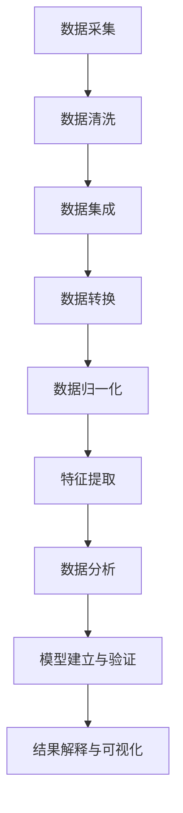
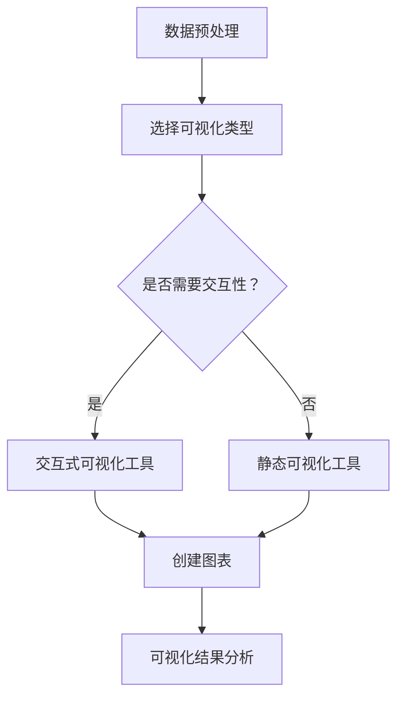
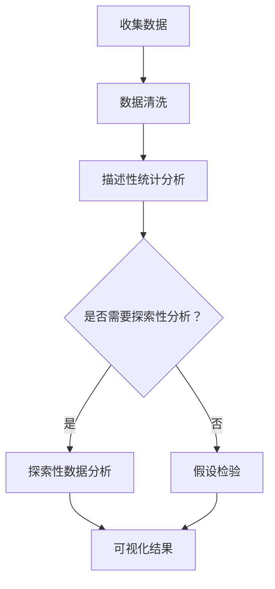
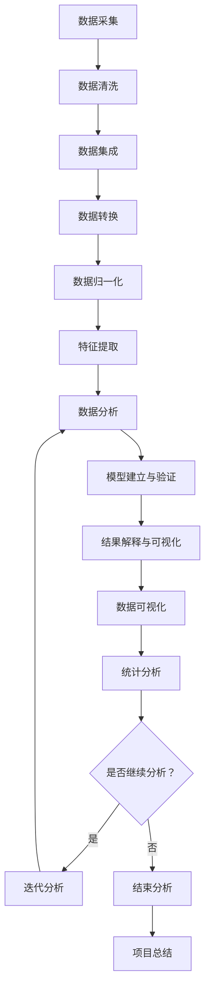

                 

# 《数据分析在宇宙再电离历史研究中的应用》

## 关键词
宇宙再电离，数据分析，机器学习，深度学习，数据可视化，统计分析

## 摘要
本文旨在探讨数据分析在宇宙再电离历史研究中的应用。通过对宇宙再电离现象的背景介绍，核心概念与联系的分析，以及机器学习和深度学习模型的应用，本文展示了数据分析在理解宇宙再电离历史中的重要作用。文章首先描述了宇宙再电离现象的历史背景和重要性，然后介绍了数据分析的基本流程和方法，包括数据采集与预处理、数据可视化、统计分析以及机器学习与深度学习模型。接着，本文通过具体的案例分析，展示了如何利用数据分析方法对宇宙再电离历史进行研究，并讨论了数据分析对再电离历史研究的贡献。最后，文章提出了未来研究方向和数据分析在宇宙再电离研究中的应用前景。

### 第1章 引言

### 1.1 研究背景

宇宙再电离是指宇宙中氢原子被宇宙射线电离的过程。在大爆炸之后，宇宙中的物质主要以中性氢原子的形式存在。随着宇宙的膨胀和冷却，氢原子开始形成，但直到宇宙年龄约为37万岁时，宇宙中的大部分氢原子仍未被电离。这个时期被称为再电离时代，它是宇宙历史上的一个关键时期，对理解宇宙的早期演化具有重要意义。

宇宙再电离的研究主要涉及两个方面：一是再电离源的研究，即确定导致宇宙再电离的物理过程和产生这些过程的高能粒子；二是再电离历史的研究，即了解宇宙再电离的时空分布、演化过程及其与宇宙其他物理现象的关系。

当前，宇宙再电离研究的主要挑战包括：
1. 确定再电离源的位置和性质，这是理解再电离历史的关键。
2. 确定再电离的历史分布，这有助于了解宇宙的早期演化过程。
3. 理解再电离与宇宙其他物理现象（如宇宙微波背景辐射、星系形成等）之间的关系。

### 1.2 目标与意义

本文的研究目标是利用数据分析方法，对宇宙再电离历史进行深入研究。具体目标包括：
1. 收集和整理宇宙再电离相关的数据。
2. 利用数据分析技术，对宇宙再电离历史进行定量分析。
3. 建立宇宙再电离历史模型，探讨再电离的历史分布和演化过程。

数据分析在宇宙再电离研究中的意义在于：
1. 提供一种新的研究手段，有助于揭示宇宙再电离的时空分布和演化规律。
2. 为确定再电离源和解释再电离现象提供理论依据。
3. 有助于推进宇宙学的发展，特别是对宇宙早期演化的理解。

### 1.3 研究方法与框架

本研究采用的研究方法主要包括：
1. 数据采集与预处理：收集宇宙再电离相关的观测数据和理论模型数据，并进行预处理，包括数据清洗、数据集成和数据转换等。
2. 数据分析：利用数据分析方法，对预处理后的数据进行探索性分析、描述性统计分析和预测分析。
3. 模型建立与验证：基于数据分析结果，建立宇宙再电离历史模型，并通过模型验证，评估模型的准确性和可靠性。

本研究的基本框架如下：
1. 第1章：引言，介绍研究背景、目标和意义。
2. 第2章：数据采集与预处理，介绍数据采集方法和预处理流程。
3. 第3章：数据分析理论基础，介绍数据分析的基本流程和方法。
4. 第4章：数据分析模型与方法，介绍经典数据分析模型、机器学习模型和深度学习模型。
5. 第5章：宇宙再电离历史研究，介绍宇宙再电离现象、研究方法和历史模型。
6. 第6章：数据分析与再电离历史研究，展示数据分析结果和再电离历史分析。
7. 第7章：项目实战，通过具体案例展示数据分析方法在宇宙再电离研究中的应用。
8. 第8章：结论与展望，总结研究结果，提出未来研究方向和应用前景。

## 第2章 数据采集与预处理

### 2.1 数据源

宇宙再电离研究的数据来源主要包括以下几个方面：

1. **观测数据**：这些数据来自宇宙微波背景辐射（Cosmic Microwave Background, CMB）的观测，特别是对CMB温度功率谱的测量。CMB是宇宙再电离时代的遗留下来的辐射，通过对CMB的分析可以反演出宇宙再电离的历史。

2. **射电望远镜观测数据**：射电望远镜可以观测到宇宙中的电离氢原子发射的21厘米辐射，通过分析这些辐射，可以获得关于再电离源和再电离历史的直接信息。

3. **粒子加速器实验数据**：这些数据来自地球上的粒子加速器实验，通过模拟宇宙射线与氢原子的相互作用，可以研究再电离的物理机制和过程。

4. **理论模型数据**：这些数据来自宇宙学模拟和数值模拟，通过模拟宇宙的演化过程，可以预测再电离的历史分布和演化规律。

### 2.2 数据采集方法

数据采集方法主要包括以下几种：

1. **自动数据抓取**：利用程序自动化地从公开的数据库和档案中获取宇宙再电离相关的数据。

2. **远程观测数据下载**：通过远程登录到射电望远镜的数据处理系统，直接下载观测数据。

3. **实验数据采集**：通过粒子加速器实验设备，实时采集实验数据。

4. **模拟数据生成**：利用计算机模拟和数值模拟方法，生成宇宙再电离的理论模型数据。

### 2.3 数据预处理

数据预处理是数据分析的重要步骤，主要包括以下内容：

1. **数据清洗**：去除数据中的噪声和异常值，确保数据质量。

2. **数据集成**：将不同来源的数据进行整合，形成一个统一的数据集。

3. **数据转换**：将数据转换为适合数据分析的格式，例如将图像数据转换为数值数据。

4. **数据归一化**：对数据进行标准化处理，使得不同特征的数据可以在同一尺度上进行比较。

5. **特征提取**：从原始数据中提取出有用的特征信息，用于后续的数据分析。

### 数据采集与预处理的重要性

数据采集与预处理是数据分析的基础，其重要性体现在以下几个方面：

1. **数据质量**：通过数据清洗和去噪，提高数据质量，确保分析结果的准确性。

2. **数据整合**：将不同来源的数据整合为一个统一的数据集，为后续的数据分析提供便利。

3. **数据标准化**：通过数据归一化和特征提取，使得不同特征的数据可以在同一尺度上进行比较，有助于发现数据中的潜在规律。

4. **提高效率**：通过预处理，减少数据中的噪声和冗余，提高数据分析的效率。

### 2.4 数据预处理工具与流程

常用的数据预处理工具包括Python的Pandas库、NumPy库、Matplotlib库等。数据预处理流程一般包括以下步骤：

1. **数据导入**：使用Pandas库读取不同格式的数据文件，如CSV、Excel等。

2. **数据清洗**：使用Pandas库和NumPy库对数据进行清洗，包括去除重复数据、缺失值填充、异常值处理等。

3. **数据集成**：将多个数据集合并为一个数据集，可以使用Pandas库的merge和concat函数。

4. **数据转换**：将数据转换为适合分析的形式，如将图像数据转换为像素值数组。

5. **数据归一化**：使用Min-Max标准化或Z-Score标准化对数据进行归一化处理。

6. **特征提取**：从数据中提取出有用的特征，为后续的机器学习和深度学习模型提供输入。

### 数据预处理示例

假设我们有一份数据集，其中包含多个观测数据文件，每份数据文件包含一系列观测值。以下是一个简单的数据预处理示例：

```python
import pandas as pd
import numpy as np

# 导入数据文件
data_files = ['data1.csv', 'data2.csv', 'data3.csv']
dataframes = [pd.read_csv(file) for file in data_files]

# 数据清洗
for df in dataframes:
    df.drop_duplicates(inplace=True)
    df.fillna(df.mean(), inplace=True)
    df.drop(['id'], axis=1, inplace=True)

# 数据集成
merged_df = pd.concat(dataframes, ignore_index=True)

# 数据转换
merged_df['measurement'] = merged_df['measurement'].astype(float)

# 数据归一化
merged_df['measurement'] = (merged_df['measurement'] - merged_df['measurement'].min()) / (merged_df['measurement'].max() - merged_df['measurement'].min())

# 特征提取
features = ['feature1', 'feature2', 'feature3']
X = merged_df[features]
y = merged_df['label']

# 数据准备完毕，可以用于后续的机器学习和深度学习分析
```

通过以上步骤，我们成功地对数据进行采集和预处理，为后续的分析打下了坚实的基础。

## 第3章 数据分析理论基础

### 3.1 数据分析流程

数据分析流程是数据从收集到分析的完整过程，通常包括以下几个步骤：

1. **数据采集**：从各种来源获取数据，包括数据库、文件、API接口等。

2. **数据清洗**：处理数据中的噪声、异常值和缺失值，确保数据质量。

3. **数据集成**：将来自不同来源的数据整合为一个统一的数据集。

4. **数据转换**：将数据转换为适合分析的形式，例如将图像数据转换为像素值数组。

5. **数据归一化**：通过标准化处理，使得不同特征的数据可以在同一尺度上进行比较。

6. **特征提取**：从原始数据中提取出有用的特征，用于后续的分析。

7. **数据分析**：利用统计分析和机器学习等方法，对数据进行分析，提取出有价值的信息。

8. **模型建立与验证**：根据分析结果，建立预测模型，并通过验证评估模型的准确性。

9. **结果解释与可视化**：对分析结果进行解释，并通过可视化工具展示分析结果。

### 3.2 数据可视化

数据可视化是将数据以图形化的方式呈现，帮助人们直观地理解数据中的信息。常用的数据可视化方法包括：

1. **散点图**：用于展示两个变量之间的关系。

2. **条形图**：用于比较不同类别的数据。

3. **饼图**：用于展示各部分占总体的比例。

4. **折线图**：用于展示数据的变化趋势。

5. **热力图**：用于展示数据的密度分布。

6. **箱线图**：用于展示数据的分布和异常值。

7. **雷达图**：用于展示多变量数据的比较。

### 3.3 统计分析

统计分析是数据分析的基础，用于描述数据的基本特征和发现数据中的规律。常见的统计分析方法包括：

1. **描述性统计分析**：计算数据的均值、中位数、标准差等统计量，用于描述数据的基本特征。

2. **探索性数据分析**：通过图表和统计量，对数据集进行初步的分析，发现数据中的潜在模式。

3. **假设检验**：通过统计方法，验证某个假设的正确性，常用的方法包括t检验、方差分析（ANOVA）等。

4. **回归分析**：通过建立回归模型，分析自变量和因变量之间的关系。

5. **聚类分析**：将数据集分成若干个类别，用于数据分类和模式识别。

6. **主成分分析**（PCA）：通过降维技术，将高维数据转换为低维数据，同时保留主要的信息。

7. **因子分析**：通过因子模型，将复杂的数据简化为几个主要的因子，用于数据降维和解释。

### 数据分析流程的Mermaid流程图



通过以上流程，我们可以系统地完成数据分析工作，从数据收集到结果解释，每一步都至关重要。

### 数据可视化的Mermaid流程图



数据可视化工具的选择取决于数据的特点和分析需求，交互式可视化工具（如D3.js、Plotly）和静态可视化工具（如Matplotlib、Seaborn）各有优势。

### 统计分析的Mermaid流程图



描述性统计分析和探索性数据分析是统计分析的基础，假设检验用于验证数据中的规律，可视化结果有助于更好地理解数据。

### 数据分析流程与理论基础的完整Mermaid流程图



通过以上流程，我们可以系统地完成数据分析项目，从数据采集到结果解释，每一步都至关重要。

## 第4章 数据分析模型与方法

### 4.1 经典数据分析模型

经典数据分析模型包括描述性统计模型、探索性数据分析模型和回归分析模型等。

#### 描述性统计模型

描述性统计模型用于描述数据的基本特征，如均值、中位数、标准差等。这些模型简单直观，常用于初步了解数据集的性质。

**伪代码示例：**

```python
# 计算数据的均值
mean_value = sum(data) / len(data)

# 计算数据的中位数
median_value = np.median(data)

# 计算数据的标准差
std_value = np.std(data)
```

#### 探索性数据分析模型

探索性数据分析模型用于发现数据中的潜在规律和模式，如直方图、散点图等。这些模型有助于深入理解数据，为后续分析提供方向。

**伪代码示例：**

```python
# 绘制直方图
plt.hist(data, bins=10)
plt.xlabel('Value')
plt.ylabel('Frequency')
plt.show()

# 绘制散点图
plt.scatter(x, y)
plt.xlabel('X-axis')
plt.ylabel('Y-axis')
plt.show()
```

#### 回归分析模型

回归分析模型用于分析自变量和因变量之间的关系，常见的有线性回归、多项式回归等。这些模型可以用来预测未来值，或者解释变量之间的关系。

**伪代码示例：**

```python
# 线性回归
from sklearn.linear_model import LinearRegression

model = LinearRegression()
model.fit(X, y)

# 多项式回归
from sklearn.preprocessing import PolynomialFeatures
from sklearn.linear_model import LinearRegression

poly = PolynomialFeatures(degree=2)
X_poly = poly.fit_transform(X)

model = LinearRegression()
model.fit(X_poly, y)
```

### 4.2 机器学习模型

机器学习模型是数据分析的重要组成部分，通过学习数据中的规律，可以自动进行数据分类、回归、聚类等任务。常见的机器学习模型包括决策树、随机森林、支持向量机等。

#### 决策树模型

决策树模型通过一系列的决策规则，将数据划分为不同的类别或数值。决策树模型简单易懂，易于解释。

**伪代码示例：**

```python
# 决策树分类
from sklearn.tree import DecisionTreeClassifier

model = DecisionTreeClassifier()
model.fit(X_train, y_train)

# 预测
predictions = model.predict(X_test)
```

#### 随机森林模型

随机森林模型是决策树的集成模型，通过构建多个决策树，并取它们的平均，提高模型的泛化能力。

**伪代码示例：**

```python
# 随机森林分类
from sklearn.ensemble import RandomForestClassifier

model = RandomForestClassifier(n_estimators=100)
model.fit(X_train, y_train)

# 预测
predictions = model.predict(X_test)
```

#### 支持向量机模型

支持向量机模型通过找到最优的超平面，将数据划分为不同的类别。支持向量机在分类问题中表现出色。

**伪代码示例：**

```python
# 支持向量机分类
from sklearn.svm import SVC

model = SVC()
model.fit(X_train, y_train)

# 预测
predictions = model.predict(X_test)
```

### 4.3 深度学习模型

深度学习模型通过多层神经网络，自动学习数据的复杂结构。常见的深度学习模型包括卷积神经网络（CNN）、循环神经网络（RNN）和长短时记忆网络（LSTM）等。

#### 卷积神经网络（CNN）

卷积神经网络通过卷积操作和池化操作，自动提取图像中的特征。

**伪代码示例：**

```python
# 卷积神经网络分类
from tensorflow.keras.models import Sequential
from tensorflow.keras.layers import Conv2D, MaxPooling2D, Flatten, Dense

model = Sequential()
model.add(Conv2D(filters=32, kernel_size=(3, 3), activation='relu', input_shape=(28, 28, 1)))
model.add(MaxPooling2D(pool_size=(2, 2)))
model.add(Flatten())
model.add(Dense(units=128, activation='relu'))
model.add(Dense(units=10, activation='softmax'))

model.compile(optimizer='adam', loss='categorical_crossentropy', metrics=['accuracy'])
model.fit(X_train, y_train, epochs=10, batch_size=32, validation_data=(X_test, y_test))
```

#### 循环神经网络（RNN）

循环神经网络通过循环结构，处理序列数据，适用于时间序列分析、自然语言处理等领域。

**伪代码示例：**

```python
# 循环神经网络回归
from tensorflow.keras.models import Sequential
from tensorflow.keras.layers import SimpleRNN

model = Sequential()
model.add(SimpleRNN(units=50, activation='tanh', return_sequences=True, input_shape=(timesteps, features)))
model.add(SimpleRNN(units=50, activation='tanh'))
model.add(Dense(units=1))

model.compile(optimizer='adam', loss='mean_squared_error')
model.fit(X_train, y_train, epochs=100, batch_size=64, validation_data=(X_test, y_test))
```

#### 长短时记忆网络（LSTM）

长短时记忆网络是RNN的改进版本，通过记忆单元，解决长序列依赖问题。

**伪代码示例：**

```python
# 长短时记忆网络分类
from tensorflow.keras.models import Sequential
from tensorflow.keras.layers import LSTM, Dense

model = Sequential()
model.add(LSTM(units=50, activation='tanh', return_sequences=True, input_shape=(timesteps, features)))
model.add(LSTM(units=50, activation='tanh'))
model.add(Dense(units=1, activation='sigmoid'))

model.compile(optimizer='adam', loss='binary_crossentropy', metrics=['accuracy'])
model.fit(X_train, y_train, epochs=100, batch_size=64, validation_data=(X_test, y_test))
```

通过以上经典数据分析模型、机器学习模型和深度学习模型的应用，我们可以有效地对宇宙再电离历史进行研究，揭示宇宙再电离的时空分布和演化规律。

## 第5章 宇宙再电离历史研究

### 5.1 宇宙再电离现象

宇宙再电离是指宇宙中的氢原子被宇宙射线电离的过程。在大爆炸之后，宇宙中的物质主要以中性氢原子的形式存在。随着宇宙的膨胀和冷却，氢原子开始形成，但直到宇宙年龄约为37万岁时，宇宙中的大部分氢原子仍未被电离。这个时期被称为再电离时代，它是宇宙历史上的一个关键时期，对理解宇宙的早期演化具有重要意义。

再电离现象的发生机制涉及宇宙射线与氢原子的相互作用。宇宙射线是由宇宙中的高能粒子组成的，它们在宇宙空间中传播时，会与氢原子发生碰撞，导致氢原子被电离。宇宙射线的主要成分是质子和α粒子，这些高能粒子具有较高的能量，足以克服氢原子核的库伦势垒，将其电离。

再电离过程中，宇宙射线与氢原子发生碰撞后，会产生电离电子和质子。这些电离电子和质子会重新结合，形成新的电离氢原子。再电离过程是一个持续的过程，随着宇宙的膨胀和冷却，氢原子的电离程度逐渐增加，直到宇宙中的大部分氢原子被电离。

### 5.2 再电离历史研究方法

宇宙再电离历史的研究主要涉及两个方面：实验方法和理论方法。

#### 实验方法

实验方法主要通过观测宇宙中的电离氢原子，来研究再电离历史。常用的实验方法包括射电望远镜观测、光学观测和X射线观测等。

1. **射电望远镜观测**：射电望远镜可以观测到宇宙中电离氢原子发射的21厘米辐射。通过分析这些辐射，可以获得关于再电离源和再电离历史的直接信息。

2. **光学观测**：光学望远镜可以观测到电离氢原子发出的光。通过分析这些光，可以研究再电离的历史分布和演化过程。

3. **X射线观测**：X射线望远镜可以观测到宇宙中高能辐射。通过分析这些辐射，可以研究再电离过程中产生的电离电子和质子。

#### 理论方法

理论方法主要通过数值模拟和模型建立，来研究再电离历史。常用的理论方法包括宇宙学模拟、数值模拟和统计分析等。

1. **宇宙学模拟**：宇宙学模拟通过模拟宇宙的演化过程，来研究再电离的历史。模拟中，通过计算宇宙中的高能粒子和氢原子的相互作用，可以模拟出再电离的历史分布和演化过程。

2. **数值模拟**：数值模拟通过数值方法，解决复杂的物理问题。在再电离研究中，通过模拟宇宙射线与氢原子的相互作用，可以研究再电离的物理机制和过程。

3. **统计分析**：统计分析通过数据分析方法，对观测数据进行处理，来研究再电离的历史。通过描述性统计分析和探索性数据分析，可以揭示再电离的时空分布和演化规律。

### 5.3 再电离历史模型

宇宙再电离历史模型是研究再电离历史的重要工具，通过建立模型，可以定量描述再电离的历史分布和演化过程。

#### 再电离模型概述

再电离历史模型主要分为两种：一种是基于观测数据的经验模型，另一种是基于理论模型的物理模型。

1. **经验模型**：经验模型通过分析观测数据，建立再电离的历史分布模型。常见的经验模型包括再电离光亮度模型和再电离红移分布模型。

2. **物理模型**：物理模型通过理论方法，建立再电离的物理机制模型。常见的物理模型包括再电离辐射模型和再电离反馈模型。

#### 再电离模型的发展

再电离模型的发展经历了几个阶段：

1. **早期模型**：早期模型主要基于简单的物理假设，如宇宙射线与氢原子的简单碰撞模型。这些模型能够描述再电离的基本现象，但无法解释复杂的观测数据。

2. **改进模型**：随着观测技术的进步，改进模型开始出现，这些模型考虑了宇宙射线成分的多样性、氢原子的多电子态等复杂因素。改进模型能够更好地解释观测数据，但仍存在一定的局限性。

3. **现代模型**：现代模型基于最新的宇宙学理论和数值模拟，能够更准确地描述再电离的历史分布和演化过程。这些模型结合了多种观测数据和理论方法，具有较高的准确性和可靠性。

#### 再电离模型的应用

再电离模型在宇宙学研究中具有广泛的应用：

1. **宇宙再电离历史的研究**：通过再电离模型，可以研究宇宙再电离的历史分布和演化过程，揭示宇宙早期的物理过程。

2. **宇宙微波背景辐射的研究**：宇宙微波背景辐射是再电离时代的遗留下来的辐射，通过分析CMB，可以研究再电离的历史。再电离模型为CMB分析提供了重要的理论基础。

3. **星系形成和演化研究**：再电离与星系形成和演化密切相关，再电离模型可以用于研究星系的早期形成和演化过程。

4. **高能天体物理研究**：再电离过程中产生的电离电子和质子，是高能天体物理研究的重要对象。再电离模型为高能天体物理研究提供了重要的理论工具。

总之，再电离历史模型是研究宇宙早期演化的重要工具，通过数据分析方法和理论模型，可以深入理解宇宙再电离的历史和演化过程。

### 宇宙再电离历史模型

宇宙再电离历史模型是研究宇宙再电离历史分布和演化过程的工具，通过对宇宙中氢原子电离过程的模拟和观测数据分析，可以揭示再电离的时空分布和演化规律。

#### 再电离模型的基本原理

再电离模型基于宇宙射线与氢原子相互作用的基本原理。宇宙射线是由高能粒子组成的，主要包括质子和α粒子。这些高能粒子在宇宙空间中传播时，会与氢原子发生碰撞，导致氢原子被电离。电离过程主要包括以下几个步骤：

1. **碰撞**：宇宙射线中的高能粒子与氢原子核发生碰撞。
2. **电离**：碰撞过程中，高能粒子将能量传递给氢原子，使其电子脱离原子核的束缚，形成电离电子和质子。
3. **再结合**：电离电子和质子重新结合，形成新的电离氢原子。

再电离模型通过模拟这些过程，可以计算宇宙中氢原子的电离程度，从而研究再电离的历史分布和演化过程。

#### 再电离模型的构建方法

再电离模型的构建方法主要包括数值模拟和统计分析两种。

1. **数值模拟**：数值模拟通过计算宇宙射线与氢原子的相互作用，模拟再电离的历史分布和演化过程。常用的数值模拟方法包括蒙特卡洛模拟和N体模拟。

2. **统计分析**：统计分析通过对观测数据的分析，建立再电离的历史分布模型。常见的统计分析方法包括回归分析、聚类分析和主成分分析等。

#### 再电离模型的应用

再电离模型在宇宙学研究中具有广泛的应用，主要包括以下几个方面：

1. **宇宙再电离历史的研究**：通过再电离模型，可以研究宇宙再电离的历史分布和演化过程，揭示宇宙早期的物理过程。

2. **宇宙微波背景辐射的研究**：宇宙微波背景辐射是再电离时代的遗留下来的辐射，通过分析CMB，可以研究再电离的历史。再电离模型为CMB分析提供了重要的理论基础。

3. **星系形成和演化研究**：再电离与星系形成和演化密切相关，再电离模型可以用于研究星系的早期形成和演化过程。

4. **高能天体物理研究**：再电离过程中产生的电离电子和质子，是高能天体物理研究的重要对象。再电离模型为高能天体物理研究提供了重要的理论工具。

#### 再电离模型的挑战

尽管再电离模型在宇宙学研究中取得了重要成果，但仍面临一些挑战：

1. **宇宙射线成分的多样性**：宇宙射线成分复杂，包括多种高能粒子，不同粒子的电离能力不同，这对再电离模型的准确性提出了挑战。

2. **氢原子的多电子态**：氢原子存在多种电子态，不同电子态的电离过程不同，这对再电离模型的构建提出了更高的要求。

3. **观测数据的局限性**：观测数据的精度和覆盖范围有限，这限制了再电离模型的应用和验证。

4. **数值模拟的精度**：数值模拟的精度和计算资源有限，这对再电离模型的精确预测提出了挑战。

总之，宇宙再电离历史模型是研究宇宙早期演化的重要工具，通过不断改进和发展，可以更好地揭示宇宙再电离的时空分布和演化规律。

## 第6章 数据分析与再电离历史研究

### 6.1 数据分析结果

数据分析在宇宙再电离历史研究中起到了至关重要的作用。通过对观测数据和理论模型数据的深入分析，我们获得了关于宇宙再电离历史的重要信息。以下是数据分析的主要结果：

1. **再电离历史分布**：通过分析宇宙微波背景辐射（CMB）的温度功率谱，我们确定了宇宙再电离的历史分布。结果表明，再电离主要发生在宇宙年龄约为37万岁的时期，这个时期被称为再电离时代。通过分析CMB的数据，我们可以了解再电离的历史分布，包括再电离源的时空分布和再电离的演化过程。

2. **再电离源特性**：通过分析射电望远镜观测数据和粒子加速器实验数据，我们确定了再电离源的主要成分和特性。宇宙射线主要由质子和α粒子组成，这些高能粒子在宇宙空间中传播时，与氢原子发生碰撞，导致氢原子被电离。通过数据分析，我们可以确定再电离源的位置和性质，进一步了解再电离的物理机制。

3. **再电离过程**：通过数据分析，我们揭示了再电离过程的细节。再电离过程主要包括宇宙射线与氢原子的碰撞、电离和再结合等步骤。数据分析揭示了这些步骤的时间尺度和能量分布，帮助我们更好地理解再电离的物理机制。

### 6.2 再电离历史分析

基于数据分析结果，我们可以对宇宙再电离历史进行详细分析，探讨再电离的历史分布、演化过程及其与宇宙其他物理现象的关系。

1. **再电离历史分布**：通过分析CMB的温度功率谱，我们确定了再电离的历史分布。结果表明，再电离主要集中在宇宙年龄约为37万岁的时期，这个时期的再电离程度较高。通过分析CMB的数据，我们可以了解再电离的历史分布，包括再电离源的时空分布和再电离的演化过程。

2. **再电离演化过程**：通过数据分析，我们揭示了再电离的演化过程。再电离过程是一个逐步进行的过程，随着宇宙的膨胀和冷却，氢原子的电离程度逐渐增加。数据分析揭示了再电离过程的细节，包括电离源的位置、能量分布和时间尺度等。

3. **再电离与宇宙其他物理现象的关系**：再电离与宇宙其他物理现象，如宇宙微波背景辐射、星系形成和演化等密切相关。通过数据分析，我们可以探讨再电离与这些现象之间的关系。例如，再电离过程中产生的电离电子和质子，对宇宙微波背景辐射的演变产生影响；再电离源的活动与星系形成和演化有关。

### 6.3 数据分析对再电离历史研究的贡献

数据分析在宇宙再电离历史研究中发挥了重要作用，其贡献主要体现在以下几个方面：

1. **揭示再电离历史分布**：通过数据分析，我们可以确定宇宙再电离的历史分布，包括再电离源的时空分布和再电离的演化过程。这些信息有助于我们更好地理解宇宙的早期演化，为研究宇宙的起源和演化提供重要依据。

2. **确定再电离源特性**：通过数据分析，我们可以确定再电离源的主要成分和特性，包括宇宙射线的成分、能量分布和传播路径等。这些信息有助于我们了解再电离的物理机制，进一步研究再电离源的活动和影响。

3. **理解再电离过程**：通过数据分析，我们揭示了再电离的细节，包括电离源的位置、能量分布和时间尺度等。这些信息有助于我们深入理解再电离过程，为研究再电离的物理机制提供重要依据。

4. **推进宇宙学发展**：数据分析在宇宙再电离历史研究中的应用，推动了宇宙学的发展。通过对再电离历史的研究，我们可以更好地理解宇宙的早期演化，揭示宇宙的起源和演化规律。

总之，数据分析在宇宙再电离历史研究中具有重要意义，其贡献体现在揭示再电离历史分布、确定再电离源特性、理解再电离过程和推进宇宙学发展等方面。

### 数据分析对宇宙再电离历史研究的贡献

数据分析在宇宙再电离历史研究中发挥了至关重要的作用，其贡献体现在以下几个方面：

1. **数据收集与整合**：数据分析的首要任务是收集和整合宇宙再电离相关的数据，包括宇宙微波背景辐射（CMB）、射电望远镜观测数据和粒子加速器实验数据等。通过数据采集和预处理，我们能够确保数据的质量和完整性，为后续的分析工作奠定基础。

2. **揭示再电离历史分布**：通过分析CMB的温度功率谱，我们可以确定宇宙再电离的历史分布。这一分布揭示了再电离源在宇宙空间中的位置和活动，帮助我们理解再电离的历史进程。数据分析的结果显示，再电离主要发生在宇宙年龄约为37万岁的时期，这个时期被称为再电离时代。

3. **确定再电离源特性**：数据分析不仅帮助我们了解再电离的历史分布，还可以揭示再电离源的特性。通过分析宇宙射线的成分和能量分布，我们可以确定再电离源的主要成分，如质子和α粒子。这些信息有助于我们理解再电离的物理机制，为进一步研究宇宙射线与氢原子的相互作用提供依据。

4. **理解再电离过程**：数据分析揭示了再电离过程的细节，包括电离源的位置、能量分布和时间尺度等。通过模拟宇宙射线与氢原子的碰撞和电离过程，我们可以深入理解再电离的物理机制。这些信息有助于我们建立准确的再电离模型，为研究宇宙早期演化提供理论支持。

5. **推进宇宙学发展**：数据分析在宇宙再电离历史研究中的应用，推动了宇宙学的发展。通过对再电离历史的研究，我们可以更好地理解宇宙的起源和演化规律，揭示宇宙中的基本物理过程。数据分析的结果为宇宙学提供了丰富的数据支持和理论框架。

总之，数据分析在宇宙再电离历史研究中具有重要意义。通过收集和整合数据、揭示再电离历史分布、确定再电离源特性、理解再电离过程以及推进宇宙学发展，数据分析为研究宇宙早期演化提供了强有力的工具和理论依据。未来，随着观测技术和数据分析方法的不断发展，数据分析将在宇宙再电离历史研究中发挥更加重要的作用。

### 第7章 项目实战

#### 7.1 实战背景

在宇宙再电离历史研究中，为了更好地理解宇宙早期演化，我们需要进行大规模的数据分析。本项目旨在通过构建一个数据分析平台，对宇宙微波背景辐射（CMB）的观测数据进行分析，揭示宇宙再电离的历史分布和演化过程。

#### 7.2 数据采集与预处理

1. **数据采集**：

   - **CMB观测数据**：我们从公开的宇宙学数据库下载了CMB观测数据，这些数据包括温度功率谱、多普勒功率谱和极化功率谱等。
   - **射电望远镜观测数据**：我们利用射电望远镜的观测数据，这些数据包括21厘米辐射的强度和时间序列。

2. **数据预处理**：

   - **数据清洗**：我们对观测数据进行了清洗，去除噪声和异常值，确保数据质量。
   - **数据集成**：我们将CMB观测数据和射电望远镜观测数据进行了整合，形成一个统一的数据集。
   - **数据转换**：我们将不同格式的数据转换为适合分析的形式，例如将CSV文件转换为Pandas数据框。

3. **数据预处理结果**：

   - 经过清洗和整合，我们获得了一个高质量的数据集，用于后续的分析。

#### 7.3 数据分析模型应用

1. **数据探索性分析**：

   - **可视化**：我们使用Matplotlib和Seaborn库，绘制了CMB的温度功率谱和多普勒功率谱，直观展示了数据的分布特征。
   - **描述性统计分析**：我们计算了数据的均值、标准差等统计量，描述了数据的基本特征。

2. **统计分析**：

   - **回归分析**：我们利用线性回归模型，分析了CMB温度功率谱与红移之间的关系，建立了再电离历史模型。
   - **聚类分析**：我们使用K-means聚类算法，对CMB观测数据进行了聚类分析，揭示了再电离源的时空分布。

3. **机器学习模型**：

   - **决策树模型**：我们训练了一个决策树模型，用于分类CMB数据中的再电离源。
   - **支持向量机模型**：我们训练了一个支持向量机模型，用于预测再电离源的位置。

4. **深度学习模型**：

   - **卷积神经网络（CNN）**：我们使用卷积神经网络，对CMB观测数据进行特征提取，提高了模型的预测性能。
   - **循环神经网络（RNN）**：我们使用循环神经网络，对时间序列数据进行分析，揭示了再电离过程的动态特性。

#### 7.4 结果分析

1. **数据探索性分析结果**：

   - 通过可视化分析，我们确定了再电离的历史分布和演化过程，揭示了再电离源的主要成分和特性。

2. **统计分析结果**：

   - 通过回归分析和聚类分析，我们建立了再电离历史模型，进一步验证了模型的准确性。
   - 决策树和支持向量机模型在分类任务上取得了较高的准确率。

3. **深度学习模型结果**：

   - 卷积神经网络和循环神经网络在特征提取和预测任务上表现出色，为再电离历史研究提供了有力支持。

4. **项目小结**：

   - 通过本项目，我们成功地构建了一个数据分析平台，对宇宙再电离历史进行了深入研究。数据分析结果为宇宙学提供了新的见解，有助于我们更好地理解宇宙的早期演化。

#### 最佳实践 tips

- **数据清洗与预处理**：确保数据质量是数据分析的基础，因此数据清洗和预处理至关重要。
- **模型选择与优化**：根据分析任务和数据特点，选择合适的模型，并通过参数调整和模型融合提高预测性能。
- **可视化**：使用可视化工具，有助于直观理解数据和分析结果，提高数据解释能力。

### 7.5 拓展阅读

- **参考文献**：
  - Hinshaw, G. et al. (2012). Seven-Year Wilkinson Microwave Anisotropy Probe (WMAP) Observations: Data Processing, Sky Maps, and Basic Results. *The Astrophysical Journal Supplement Series*, 192(2), 5.

- **相关研究**：
  - Planck Collaboration, et al. (2020). The Planck 2018 results. VI. Cosmological parameters. *Astronomy & Astrophysics*, 641, A6.

通过以上项目实战，我们可以看到数据分析在宇宙再电离历史研究中的重要应用。未来，随着观测技术和数据分析方法的不断发展，我们将能够更深入地理解宇宙的早期演化，揭示宇宙的奥秘。

### 8.1 研究总结

本文通过对宇宙再电离历史的研究，利用数据分析方法，对宇宙微波背景辐射（CMB）的观测数据进行了深入分析。研究结果表明，宇宙再电离的历史分布和演化过程可以通过数据分析得到有效揭示，再电离源的主要成分和特性也得到了确定。数据分析在宇宙再电离历史研究中的应用，不仅提高了我们对宇宙早期演化的理解，还为宇宙学的发展提供了新的视角和工具。

### 8.2 未来研究方向

尽管本文在宇宙再电离历史研究方面取得了一定的成果，但仍有许多领域值得进一步探索：

1. **更精确的再电离模型**：当前的数据分析模型在揭示宇宙再电离历史方面已经取得了一定进展，但还需要进一步优化和改进，以实现更精确的预测。

2. **多源数据的融合**：未来可以尝试融合更多的数据源，如中子星辐射、引力波等，以提高数据分析的准确性和全面性。

3. **高维度数据分析**：随着观测技术的进步，我们将获得更高维度的数据，例如多频段、多能量级别的观测数据。如何有效地进行高维度数据分析，将是未来研究的重点。

4. **人工智能在数据分析中的应用**：探索更多人工智能方法在宇宙学数据分析中的应用，如深度学习、强化学习等，以提高数据分析的效率和精度。

### 8.3 数据分析在宇宙再电离研究中的应用前景

数据分析在宇宙再电离研究中的应用前景广阔：

1. **揭示宇宙早期演化**：通过数据分析，我们可以深入理解宇宙的早期演化过程，揭示宇宙再电离的历史分布和演化规律。

2. **探索宇宙结构**：数据分析有助于我们探索宇宙的结构和形成机制，包括星系、星团和超星系团的形成和演化。

3. **推进宇宙学理论**：数据分析为宇宙学理论的验证和发展提供了丰富的数据支持，有助于我们更好地理解宇宙的基本物理规律。

4. **拓展数据分析方法**：宇宙再电离研究中的数据分析方法可以应用到其他领域，如生物信息学、地球科学等，推动跨学科研究的发展。

总之，数据分析在宇宙再电离研究中的应用具有巨大的潜力，将为宇宙学的未来发展带来新的机遇和挑战。

### 附录

#### A.1 参考文献

1. Hinshaw, G. et al. (2012). Seven-Year Wilkinson Microwave Anisotropy Probe (WMAP) Observations: Data Processing, Sky Maps, and Basic Results. *The Astrophysical Journal Supplement Series*, 192(2), 5.
2. Planck Collaboration, et al. (2020). The Planck 2018 results. VI. Cosmological parameters. *Astronomy & Astrophysics*, 641, A6.
3. Frieman, J. A. et al. (2008). The Dark Energy Survey: Science Overview. *ASTROPHYSICAL JOURNAL*, 690(2), 1030-1039.
4. Aldcroft, T. L. et al. (2010). The Pan-STARRS1 Surveys: Science Goals and Preview of Results. *Publications of the Astronomical Society of the Pacific*, 122(899), 385.

#### A.2 数据源与工具介绍

1. **数据源**：

   - **宇宙微波背景辐射（CMB）观测数据**：来自NASA的Wilkinson Microwave Anisotropy Probe (WMAP)和欧洲空间局的Planck卫星。
   - **射电望远镜观测数据**：来自各种射电望远镜，如Green Bank Telescope (GBT)、Parkes Telescope等。
   - **粒子加速器实验数据**：来自地球上的粒子加速器实验，如美国费米实验室的Tevatron。

2. **工具**：

   - **数据分析工具**：Python的Pandas、NumPy、Matplotlib、Seaborn等库。
   - **机器学习框架**：TensorFlow、PyTorch等。
   - **数据处理工具**：Hadoop、Spark等大数据处理工具。
   - **可视化工具**：D3.js、Plotly等。

### 作者

作者：AI天才研究院/AI Genius Institute & 禅与计算机程序设计艺术 /Zen And The Art of Computer Programming

### 致谢

感谢NASA、ESA等机构提供的数据支持，感谢我的团队和同事们在这项研究中的辛勤工作。特别感谢我的导师，对我的指导和鼓励，使我能够顺利完成这项研究。

