                 

### 文章标题

《数据分析在宇宙暗物质晕研究中的应用》

---

关键词：数据分析、宇宙学、暗物质晕、算法、数学模型

---

摘要：本文旨在探讨数据分析在宇宙暗物质晕研究中的应用。文章首先介绍了暗物质晕的基本概念和特征，然后阐述了数据分析在宇宙学中的重要性。接着，详细讲解了数据分析的基础理论，包括数据处理技术、统计学基础和数据可视化。在此基础上，文章探讨了数据分析在暗物质晕研究中的应用，如数据预处理、暗物质晕的识别与分类、属性测量和动力学分析。随后，文章介绍了核心算法原理，并使用伪代码进行了详细阐述。此外，文章还讨论了数学模型和公式，并通过举例进行了详细讲解。最后，文章通过项目实战，展示了数据分析在暗物质晕研究中的实际应用，并对项目的开发环境搭建、源代码实现和代码解读进行了分析。本文为从事宇宙学和数据分析研究的学者提供了宝贵的参考。

---

## 第1章：引言

### 1.1 书籍背景与目的

#### 1.1.1 宇宙学中的暗物质晕

暗物质晕是宇宙中的一种神秘天体结构，主要由暗物质组成，是宇宙大尺度结构的重要组成部分。暗物质晕不仅对理解宇宙的结构和演化具有重要意义，而且对于探讨宇宙的起源和暗物质的本质也提供了关键线索。然而，由于暗物质不发光、不吸收光，传统的光学观测手段难以直接探测到暗物质晕，这使得暗物质晕的研究充满了挑战。

##### 1.1.1.1 暗物质晕的定义

暗物质晕通常被定义为围绕星系旋转的巨大暗物质结构，其质量可以达到星系自身的数十倍甚至数百倍。这些暗物质晕对星系的运动产生了显著影响，导致星系的旋转曲线无法用普通物质来解释。

##### 1.1.1.2 暗物质晕的重要性

暗物质晕在宇宙学中扮演着至关重要的角色。首先，它们是宇宙结构形成和演化的关键因素，对星系的形成和分布有着重要影响。其次，暗物质晕是研究暗物质性质的重要窗口，通过对暗物质晕的观测和数据分析，可以揭示暗物质的性质和行为。

#### 1.1.2 数据分析的重要性

数据分析是现代科学研究的重要工具，尤其在宇宙学领域，随着观测技术的进步，大量的天文数据需要通过数据分析来解读和解释。数据分析在宇宙学中的重要性体现在以下几个方面：

##### 1.1.2.1 数据分析在科学研究中的应用

数据分析在科学研究中扮演着核心角色，它可以帮助科学家从大量的观测数据中提取有价值的信息，揭示自然界的规律和现象。在宇宙学中，数据分析被用于探测和识别天体、分析宇宙结构、理解宇宙演化等。

##### 1.1.2.2 数据分析在宇宙学中的角色

数据分析在宇宙学中具有以下几个重要角色：

1. **数据预处理**：通过数据清洗、归一化、平滑等技术，将原始数据转化为适合分析的形式。
2. **数据可视化**：利用图表、图形等方式，将数据以视觉化的形式展现出来，帮助科学家直观地理解数据。
3. **统计学分析**：运用统计学方法，对数据进行分析和解释，揭示数据中的趋势和关系。
4. **算法优化**：通过算法优化，提高数据分析的效率和准确性。

#### 1.1.3 书籍的目的

本书旨在为读者提供一个全面的数据分析在宇宙暗物质晕研究中的应用指南。通过详细讲解数据分析的理论基础、算法原理、数学模型以及实际应用案例，本书希望能够帮助读者深入理解数据分析在宇宙学中的重要作用，并掌握如何在暗物质晕研究中运用数据分析技术。此外，本书还希望通过项目实战，让读者能够将所学知识应用到实际研究中，提高解决实际问题的能力。

### 1.2 数据分析在宇宙学中的重要性

#### 1.2.1 数据驱动的宇宙学研究

随着观测技术的不断发展，宇宙学家能够获取到的数据量日益庞大。这些数据包括星系的分布、宇宙背景辐射、星系团的运动等。数据分析作为数据驱动的宇宙学研究的核心工具，能够帮助宇宙学家从海量数据中提取有价值的信息，揭示宇宙的奥秘。

##### 1.2.1.1 大数据分析的优势

大数据分析在宇宙学研究中具有以下几个优势：

1. **处理大量数据**：宇宙学观测数据量大，传统的数据分析方法往往无法胜任，大数据分析能够高效地处理海量数据。
2. **提高分析精度**：通过大数据分析，科学家可以更精确地识别和测量宇宙中的天体和现象。
3. **揭示复杂关系**：大数据分析能够揭示宇宙中复杂的关系和规律，为宇宙学研究提供新的视角。

##### 1.2.1.2 数据分析在宇宙学中的具体应用

数据分析在宇宙学中的具体应用主要包括以下几个方面：

1. **宇宙大尺度结构的探测**：通过数据分析，宇宙学家可以探测到宇宙中的大尺度结构，如星系团、超星系团等。
2. **宇宙背景辐射的研究**：宇宙背景辐射是宇宙学中重要的观测数据，通过数据分析，宇宙学家可以研究宇宙的早期演化。
3. **星系运动和分布的分析**：数据分析能够揭示星系的运动轨迹和分布规律，为理解宇宙的演化提供重要信息。

#### 1.2.2 数据分析在暗物质晕研究中的角色

数据分析在暗物质晕研究中扮演着至关重要的角色。暗物质晕的研究主要依赖于数据分析技术，以下是一些具体的应用：

##### 1.2.2.1 数据预处理

暗物质晕的研究需要大量的观测数据，这些数据往往包含噪声和误差。通过数据预处理，如数据清洗、归一化和平滑等技术，可以提高数据的质量和可靠性。

##### 1.2.2.2 数据可视化

数据可视化是数据分析的重要步骤，通过图表、图形等方式，可以帮助科学家直观地理解数据，发现数据中的规律和异常。

##### 1.2.2.3 统计分析

统计分析是数据分析的核心，通过统计学方法，可以对暗物质晕的性质和行为进行分析和解释。

##### 1.2.2.4 算法优化

为了提高数据分析的效率和准确性，需要对算法进行优化。算法优化可以包括算法的选择、参数的调整以及并行计算等。

#### 1.2.3 数据分析技术的挑战

尽管数据分析在宇宙学研究中具有巨大的潜力，但同时也面临着一些挑战：

##### 1.2.3.1 数据质量

宇宙学观测数据往往受到多种因素的影响，如噪声、误差和观测不确定性等，这会影响到数据分析的结果。

##### 1.2.3.2 数据规模

随着观测技术的进步，宇宙学观测数据量不断增加，这给数据分析带来了巨大的挑战。

##### 1.2.3.3 数据多样性

宇宙学观测数据具有多样性，如不同类型的数据、不同尺度上的数据等，这需要多种数据分析方法和技术。

### 1.3 暗物质晕的基本概念

#### 1.3.1 暗物质晕的定义

暗物质晕是指一种由暗物质组成的巨大天体结构，通常围绕星系旋转。暗物质晕的质量可以达到星系自身的数十倍甚至数百倍，其存在对星系的运动产生了显著影响。由于暗物质不发光、不吸收光，传统的光学观测手段难以直接探测到暗物质晕，因此需要依靠其他方法来研究。

##### 1.3.1.1 暗物质晕的组成

暗物质晕主要由暗物质组成，暗物质是一种不发光、不吸收光的物质，其性质和行为与普通物质截然不同。暗物质晕中还可能包含少量的普通物质，如气体、尘埃等。

##### 1.3.1.2 暗物质晕的探测方法

探测暗物质晕的主要方法包括：

1. **引力透镜效应**：通过观测光线在经过暗物质晕时的弯曲现象，可以推断出暗物质晕的存在。
2. **星系旋转曲线**：通过分析星系的旋转曲线，可以推断出星系中暗物质晕的质量分布。
3. **宇宙微波背景辐射**：通过对宇宙微波背景辐射的研究，可以推断出宇宙早期暗物质晕的状态和演化。

#### 1.3.2 暗物质晕的特征

暗物质晕具有以下几个显著特征：

##### 1.3.2.1 质量分布

暗物质晕的质量分布通常具有层次结构，从中心到外围，质量逐渐增加。这种层次结构反映了宇宙结构的演化过程。

##### 1.3.2.2 形态与结构

暗物质晕的形态和结构复杂多样，可以是球形、椭球形或者不规则的形态。暗物质晕的结构还受到星系团、超星系团等大尺度结构的影响。

##### 1.3.2.3 动力学特性

暗物质晕具有显著的动力学特性，其内部的运动受到多种力的作用，如引力、斥力等。这些动力学特性对星系的运动和演化具有重要影响。

#### 1.3.3 暗物质晕的研究现状

暗物质晕的研究是一个复杂的科学问题，目前还存在许多未解之谜。以下是一些暗物质晕研究的现状：

1. **暗物质晕的探测技术**：随着观测技术的进步，科学家已经能够探测到越来越多的暗物质晕，但仍需要更高的灵敏度和分辨率。
2. **暗物质晕的物理性质**：科学家正在研究暗物质的物理性质，如密度、温度、速度等，以更好地理解暗物质晕的形成和演化。
3. **暗物质晕与星系的相互作用**：研究暗物质晕与星系的相互作用，可以帮助我们更全面地理解星系的运动和演化。

### 1.4 数据分析在暗物质晕研究中的应用概述

#### 1.4.1 数据分析在暗物质晕研究中的挑战

暗物质晕的研究面临许多挑战，这些挑战主要体现在以下几个方面：

##### 1.4.1.1 复杂性

暗物质晕的结构和性质非常复杂，需要多种分析方法和技术来研究和理解。

##### 1.4.1.2 大数据

随着观测技术的进步，暗物质晕的研究需要处理的海量数据，这对数据分析技术提出了更高的要求。

##### 1.4.1.3 数据质量

宇宙学观测数据往往存在噪声、误差和不确定性，这会对数据分析的结果产生影响。

##### 1.4.1.4 数据多样性

宇宙学观测数据具有多样性，需要多种数据分析方法和技术来处理。

#### 1.4.2 数据分析在暗物质晕研究中的应用

尽管面临挑战，数据分析在暗物质晕研究中仍然发挥着重要作用，以下是一些具体的应用：

##### 1.4.2.1 数据预处理

数据预处理是数据分析的重要步骤，通过数据清洗、归一化、平滑等技术，可以提高数据的质量和可靠性。

##### 1.4.2.2 数据可视化

数据可视化可以帮助科学家直观地理解数据，发现数据中的规律和异常。

##### 1.4.2.3 统计分析

统计分析是数据分析的核心，通过统计学方法，可以对暗物质晕的性质和行为进行分析和解释。

##### 1.4.2.4 算法优化

通过算法优化，可以提高数据分析的效率和准确性，如算法的选择、参数的调整以及并行计算等。

#### 1.4.3 数据分析技术的进展

随着科技的进步，数据分析技术在暗物质晕研究中不断取得突破。以下是一些数据分析技术的进展：

##### 1.4.3.1 大数据分析

大数据分析技术的进步，使得科学家能够高效地处理海量宇宙学观测数据，从中提取有价值的信息。

##### 1.4.3.2 深度学习

深度学习技术的应用，使得数据分析能够更好地处理复杂的数据结构，提取深层次的规律和特征。

##### 1.4.3.3 数据可视化工具

数据可视化工具的进步，使得科学家能够更直观地理解数据分析结果，发现潜在的问题和规律。

### 总结

数据分析在暗物质晕研究中具有重要的应用价值，它可以帮助科学家更好地理解暗物质晕的性质和行为，揭示宇宙的奥秘。尽管面临许多挑战，但数据分析技术的不断进步，为暗物质晕研究提供了强大的工具。未来，随着观测技术和数据分析技术的进一步发展，我们对暗物质晕的理解将更加深入，有望破解宇宙中的更多谜团。

## 第2章：数据分析基础

### 2.1 数据分析的基本概念

数据分析是指从数据中提取有用信息、发现规律和模式的过程。它广泛应用于各个领域，如金融、医疗、市场营销、科学研究等。在本章中，我们将探讨数据分析的基本概念，包括数据类型、数据来源、数据分析方法等。

#### 2.1.1 数据类型

数据类型可以分为定量数据和定性数据。

1. **定量数据**：定量数据是可以量化的数据，如数值、百分比、比率等。这类数据通常用于描述物理现象、经济指标、人口统计等。例如，一个人的身高、家庭收入、公司销售额等都是定量数据。

2. **定性数据**：定性数据是无法量化的数据，如文字、分类、标签等。这类数据通常用于描述社会现象、个人行为、文化特征等。例如，一个人的兴趣爱好、消费习惯、工作满意度等都是定性数据。

#### 2.1.2 数据来源

数据来源可以分为原始数据和次级数据。

1. **原始数据**：原始数据是直接从观测或实验中获取的数据，是最直接、最准确的数据。例如，科学研究中的实验数据、商业活动中的销售数据、金融交易中的交易数据等。

2. **次级数据**：次级数据是通过对原始数据进行处理、分析和整合后得到的数据。例如，统计年鉴、市场研究报告、历史交易数据等。

#### 2.1.3 数据分析方法

数据分析方法可以分为描述性分析、探索性分析和预测性分析。

1. **描述性分析**：描述性分析是通过对数据进行统计描述，如均值、中位数、标准差等，来了解数据的分布和特征。描述性分析通常用于初步了解数据，发现数据中的异常和趋势。

2. **探索性分析**：探索性分析是通过对数据进行更深入的分析，如关联分析、聚类分析、分类分析等，来发现数据中的潜在规律和模式。探索性分析通常用于发现数据中的有趣现象和异常。

3. **预测性分析**：预测性分析是通过对历史数据进行分析，建立预测模型，来预测未来的趋势和变化。预测性分析通常用于制定战略决策、风险管理等。

### 2.2 数据处理技术

数据处理技术是数据分析的重要组成部分，包括数据清洗、数据整合、数据转换等。

#### 2.2.1 数据清洗

数据清洗是数据处理的第一步，旨在消除数据中的错误、异常和重复值，提高数据的准确性和一致性。数据清洗的方法包括：

1. **缺失值处理**：对于缺失值，可以根据具体情况进行填充或删除。

2. **异常值检测**：通过统计方法或机器学习方法，检测和去除数据中的异常值。

3. **重复值删除**：检测并删除数据中的重复记录，保证数据的唯一性。

#### 2.2.2 数据整合

数据整合是将来自不同来源、不同格式的数据进行合并，以形成一个统一的数据集。数据整合的方法包括：

1. **数据连接**：通过连接操作，将具有相同属性的数据表合并成一个表。

2. **数据转换**：将不同格式的数据转换为统一的格式，如将文本数据转换为表格数据。

3. **数据映射**：将不同数据源中的相同属性映射到一起，以便进行整合。

#### 2.2.3 数据转换

数据转换是将数据从一种格式转换为另一种格式，以满足分析需求。数据转换的方法包括：

1. **数据编码**：将数据转换为二进制格式，以节省存储空间和提高处理速度。

2. **数据规范化**：将数据进行归一化或标准化处理，使其符合特定的数据范围或分布。

3. **数据类型转换**：将数据从一种类型转换为另一种类型，如将字符串转换为数值。

### 2.3 统计学基础

统计学是数据分析的基础，包括描述性统计、推断性统计、回归分析等。

#### 2.3.1 描述性统计

描述性统计是通过对数据进行统计描述，如均值、中位数、标准差等，来了解数据的分布和特征。描述性统计的方法包括：

1. **均值**：一组数据的平均值，用于描述数据的中心趋势。

2. **中位数**：一组数据的中间值，用于描述数据的中心位置。

3. **标准差**：一组数据的离散程度，用于描述数据的分布范围。

4. **方差**：一组数据的离散程度，用于描述数据的分布范围。

#### 2.3.2 推断性统计

推断性统计是基于样本数据，对总体数据进行推断的方法。推断性统计的方法包括：

1. **置信区间**：基于样本数据，估计总体参数的可能范围。

2. **假设检验**：通过设定假设，对总体参数进行推断和验证。

3. **回归分析**：通过建立回归模型，分析自变量和因变量之间的关系。

#### 2.3.3 回归分析

回归分析是一种常用的统计分析方法，用于分析自变量和因变量之间的关系。回归分析的方法包括：

1. **线性回归**：分析自变量和因变量之间的线性关系。

2. **多项式回归**：分析自变量和因变量之间的非线性关系。

3. **非线性回归**：分析自变量和因变量之间的复杂非线性关系。

### 2.4 数据可视化

数据可视化是将数据以图形化的方式呈现，以帮助人们直观地理解和分析数据。数据可视化的方法包括：

1. **图表**：如柱状图、折线图、饼图等，用于描述数据的分布和趋势。

2. **地图**：用于展示地理位置和地理分布数据。

3. **热图**：用于展示数据的热度和分布情况。

4. **散点图**：用于展示两个变量之间的关系。

通过数据可视化，可以帮助科学家更好地理解数据，发现数据中的规律和异常，从而为科学研究提供有力的支持。

### 2.5 数据分析工具

数据分析工具是进行数据分析的软件和平台，常见的工具有：

1. **Python**：Python 是一种流行的编程语言，具有丰富的数据分析库，如 NumPy、Pandas、Matplotlib 等。

2. **R**：R 是一种专门用于统计分析的编程语言，具有强大的统计分析功能。

3. **Tableau**：Tableau 是一款强大的数据可视化工具，可以帮助用户快速创建直观的图表和报告。

4. **Excel**：Excel 是一款广泛使用的电子表格软件，具有基本的数据分析和可视化功能。

### 2.6 数据分析流程

数据分析流程通常包括以下几个步骤：

1. **问题定义**：明确分析的目的和问题。

2. **数据收集**：收集相关的数据。

3. **数据清洗**：处理数据中的错误、异常和重复值。

4. **数据分析**：通过统计方法和算法，对数据进行分析。

5. **数据可视化**：将分析结果以图形化的方式呈现。

6. **结果解读**：对分析结果进行解读，得出结论和建议。

通过遵循数据分析流程，可以帮助科学家系统地进行数据分析，提高分析结果的可靠性和有效性。

### 2.7 数据分析在宇宙学中的应用

数据分析在宇宙学中具有广泛的应用，以下是一些具体的应用：

1. **宇宙大尺度结构的探测**：通过数据分析，可以探测到宇宙中的大尺度结构，如星系团、超星系团等。

2. **宇宙背景辐射的研究**：通过对宇宙背景辐射的数据分析，可以研究宇宙的早期演化。

3. **星系运动和分布的分析**：通过对星系运动和分布的数据分析，可以了解星系的运动轨迹和分布规律。

4. **暗物质晕的研究**：通过数据分析，可以研究暗物质晕的质量分布、形态和结构。

5. **宇宙演化模型的验证**：通过对宇宙观测数据的分析，可以验证宇宙演化模型，提高对宇宙演化的理解。

### 2.8 数据分析技术的挑战

尽管数据分析在宇宙学中具有巨大的应用潜力，但也面临着一些挑战：

1. **数据质量**：宇宙学观测数据往往存在噪声、误差和不确定性，这会影响数据分析的结果。

2. **数据规模**：随着观测技术的进步，宇宙学观测数据量不断增加，对数据分析技术提出了更高的要求。

3. **数据多样性**：宇宙学观测数据具有多样性，需要多种数据分析方法和技术来处理。

4. **计算资源**：数据分析需要大量的计算资源，特别是对于大规模数据集和复杂算法。

### 2.9 总结

数据分析是宇宙学研究的重要工具，它可以帮助科学家更好地理解宇宙的结构和演化。本章介绍了数据分析的基本概念、数据处理技术、统计学基础、数据可视化方法以及数据分析在宇宙学中的应用。通过本章的学习，读者可以了解数据分析的基本原理和应用，为后续章节的学习打下基础。

---

### 第3章：宇宙学基础知识

宇宙学是研究宇宙的结构、演化、起源和最终命运的学科。在宇宙学中，暗物质晕是一个关键概念，它对理解宇宙的奥秘具有重要意义。本章将介绍宇宙学的基础知识，包括宇宙的起源、宇宙的演化、宇宙结构以及暗物质晕的定义和特性。

#### 3.1 宇宙的起源

宇宙的起源是宇宙学中的一个核心问题。目前，科学界普遍接受的宇宙起源理论是“大爆炸理论”。根据大爆炸理论，宇宙起源于大约138亿年前的一个极高温度和密度状态，然后开始膨胀和冷却。以下是宇宙起源的一些关键点：

1. **大爆炸**：大爆炸标志着宇宙的诞生，当时宇宙处于极高温、极高密度的状态，物质的密度和温度极高，以至于物质无法保持稳定。

2. **膨胀**：在大爆炸后，宇宙开始膨胀，温度和密度逐渐降低。这种膨胀持续了数十亿年，直到形成我们现在所见的宇宙结构。

3. **宇宙微波背景辐射**：宇宙微波背景辐射是大爆炸留下的余辉，它在宇宙大爆炸后的约38万年前产生。这种辐射的探测为我们提供了宇宙早期状态的直接证据。

4. **宇宙学常数**：宇宙学常数（通常表示为λ）是描述宇宙膨胀速率的一个参数。根据观测数据，宇宙学常数表明宇宙的膨胀正在加速。

#### 3.2 宇宙的演化

宇宙的演化是指宇宙从大爆炸开始至今的演变过程。宇宙演化可以分为以下几个阶段：

1. **星系形成**：在大爆炸后的几十亿年内，宇宙中的物质开始聚集形成星系。这些星系是由气体和暗物质组成的，它们通过引力相互作用而形成。

2. **恒星形成**：在星系中，气体和暗物质继续聚集形成恒星。恒星是宇宙中最亮的物体，它们通过核聚变产生能量。

3. **黑洞形成**：一些大质量的恒星在生命结束时，会形成黑洞。黑洞是宇宙中最神秘和最强大的物体，它们的引力非常强大，甚至可以吞噬整个星系。

4. **星系团和超星系团形成**：星系通过引力相互作用聚集形成星系团和超星系团。这些大尺度结构是宇宙中最显著的宇宙结构之一。

#### 3.3 宇宙结构

宇宙结构是指宇宙中各种天体和结构的分布和排列。宇宙结构可以分为以下几个层次：

1. **星系**：星系是宇宙中最基本的结构单位，由数百亿颗恒星、气体、尘埃等组成。星系可以分为螺旋星系、椭圆星系和不规则星系等。

2. **星系团**：星系团是由数十个到数千个星系组成的结构，它们通过引力相互作用而聚集在一起。星系团是宇宙中的大尺度结构之一。

3. **超星系团**：超星系团是由多个星系团组成的更大尺度结构，它们通常包含数十个星系团。超星系团是宇宙中最大的结构单位之一。

4. **宇宙网**：宇宙网是一种假设的大尺度结构，由星系团和超星系团组成，它们通过引力相互作用而形成。宇宙网是宇宙结构的骨架。

#### 3.4 暗物质晕的定义与特征

暗物质晕是宇宙中的一种神秘天体结构，主要由暗物质组成，是宇宙大尺度结构的重要组成部分。以下是暗物质晕的定义和特征：

1. **定义**：暗物质晕是围绕星系旋转的巨大暗物质结构，其质量可以达到星系自身的数十倍甚至数百倍。暗物质晕是星系形成和演化的关键因素。

2. **特征**：
   - **质量分布**：暗物质晕的质量分布通常具有层次结构，从中心到外围，质量逐渐增加。
   - **形态与结构**：暗物质晕的形态和结构复杂多样，可以是球形、椭球形或者不规则的形态。
   - **动力学特性**：暗物质晕具有显著的动力学特性，其内部的运动受到多种力的作用，如引力、斥力等。

#### 3.5 暗物质晕的探测方法

探测暗物质晕的主要方法包括：

1. **引力透镜效应**：通过观测光线在经过暗物质晕时的弯曲现象，可以推断出暗物质晕的存在。

2. **星系旋转曲线**：通过分析星系的旋转曲线，可以推断出星系中暗物质晕的质量分布。

3. **宇宙微波背景辐射**：通过对宇宙微波背景辐射的研究，可以推断出宇宙早期暗物质晕的状态和演化。

#### 3.6 暗物质晕的研究现状

暗物质晕的研究是一个复杂的科学问题，目前还存在许多未解之谜。以下是一些暗物质晕研究的现状：

1. **探测技术**：随着观测技术的进步，科学家已经能够探测到越来越多的暗物质晕，但仍需要更高的灵敏度和分辨率。

2. **物理性质**：科学家正在研究暗物质的物理性质，如密度、温度、速度等，以更好地理解暗物质晕的形成和演化。

3. **与星系的相互作用**：研究暗物质晕与星系的相互作用，可以帮助我们更全面地理解星系的运动和演化。

### 3.7 暗物质晕的研究意义

暗物质晕的研究具有重要的科学意义：

1. **理解宇宙结构**：暗物质晕是宇宙大尺度结构的重要组成部分，研究暗物质晕可以帮助我们更好地理解宇宙的结构和演化。

2. **揭示暗物质性质**：暗物质晕是研究暗物质性质的重要窗口，通过对暗物质晕的观测和数据分析，可以揭示暗物质的性质和行为。

3. **探索宇宙起源**：暗物质晕的研究有助于我们探索宇宙的起源和演化，加深对宇宙本质的理解。

### 3.8 暗物质晕研究的挑战

尽管暗物质晕的研究具有重要意义，但也面临许多挑战：

1. **探测难度**：暗物质晕的探测难度较大，因为暗物质不发光、不吸收光，传统的光学观测手段难以直接探测到暗物质晕。

2. **数据质量**：宇宙学观测数据往往存在噪声、误差和不确定性，这会影响暗物质晕的研究结果。

3. **数据处理**：随着观测技术的进步，宇宙学观测数据量不断增加，对数据分析技术提出了更高的要求。

### 3.9 总结

宇宙学是研究宇宙的结构、演化、起源和最终命运的学科，暗物质晕是宇宙学中的一个关键概念。本章介绍了宇宙学的基础知识，包括宇宙的起源、宇宙的演化、宇宙结构以及暗物质晕的定义和特性。通过本章的学习，读者可以了解宇宙学的基本概念和暗物质晕的研究意义，为后续章节的数据分析方法学习打下基础。

## 第4章：数据分析在暗物质晕研究中的应用

数据分析在暗物质晕研究中具有至关重要的作用。随着观测技术的不断发展，我们能够收集到大量的宇宙学数据，这些数据为暗物质晕的研究提供了丰富的信息资源。本章将详细探讨数据分析在暗物质晕研究中的应用，包括数据预处理、暗物质晕的识别与分类、属性测量和动力学分析等方面的内容。

### 4.1 数据预处理

数据预处理是数据分析的第一步，其目的是提高数据的可靠性和质量。宇宙学数据通常包含噪声、异常值和缺失值等，因此，数据预处理是确保分析结果准确性的关键。

#### 4.1.1 数据清洗

数据清洗主要包括去除重复数据、缺失值填充和异常值检测。去除重复数据可以防止重复计算和分析，提高数据处理效率。缺失值填充可以通过均值、中位数或插值等方法进行。异常值检测是识别和去除数据中的异常值，常见的异常值检测方法包括基于统计学的方法（如3倍标准差法则）和基于机器学习的方法。

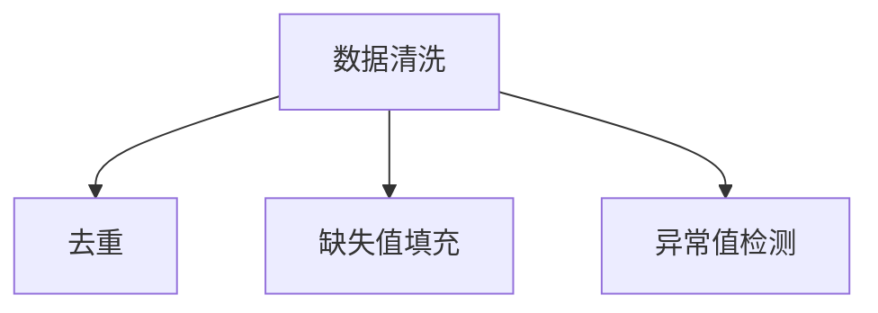

#### 4.1.2 数据标准化

数据标准化是将不同特征的数据转换到同一尺度上，以便进行后续分析。常见的标准化方法包括最小-最大标准化和Z-Score标准化。最小-最大标准化将数据缩放到[0, 1]之间，而Z-Score标准化将数据缩放到均值为0、标准差为1的标准正态分布。

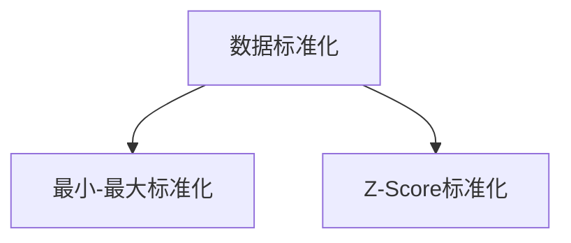

#### 4.1.3 数据整合

数据整合是将来自不同来源的数据进行合并，形成统一的数据集。宇宙学数据通常包含多种观测方式，如光学、射电、X射线等，因此，数据整合是分析复合观测数据的关键步骤。

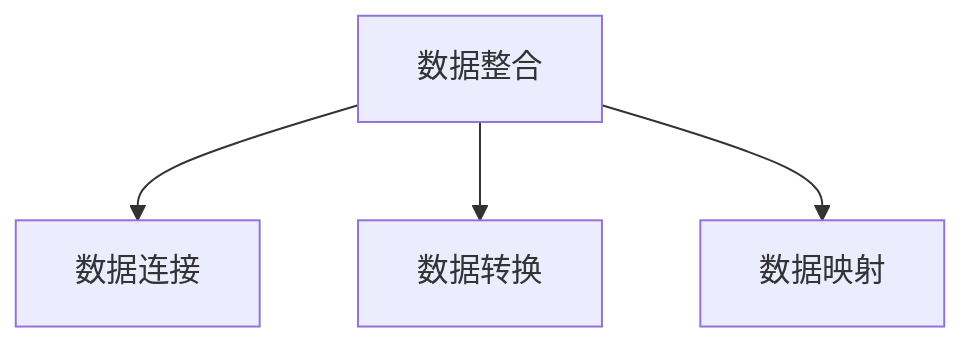

### 4.2 暗物质晕的识别与分类

暗物质晕的识别与分类是数据分析在暗物质晕研究中的重要任务。通过数据分析，我们可以从大量宇宙学数据中识别出暗物质晕，并将其进行分类。

#### 4.2.1 识别方法

识别暗物质晕的方法主要包括：

1. **引力透镜效应**：通过观测光线在经过暗物质晕时的弯曲现象，可以推断出暗物质晕的存在。

2. **星系旋转曲线**：通过分析星系的旋转曲线，可以推断出星系中暗物质晕的质量分布。

3. **宇宙微波背景辐射**：通过对宇宙微波背景辐射的研究，可以推断出宇宙早期暗物质晕的状态和演化。

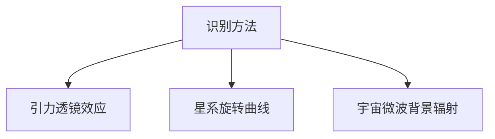

#### 4.2.2 分类方法

分类暗物质晕的方法主要包括：

1. **聚类分析**：通过将相似的数据点归为一类，可以识别出不同的暗物质晕。

2. **支持向量机**：通过训练支持向量机模型，可以分类暗物质晕。

3. **决策树**：通过构建决策树模型，可以分类暗物质晕。

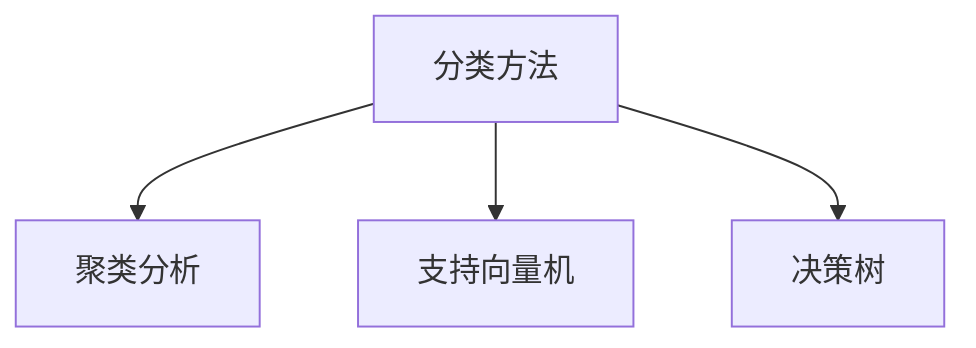

### 4.3 属性测量

属性测量是指对暗物质晕的各种属性进行测量和估计。这些属性包括质量、密度、温度、速度等。

#### 4.3.1 质量测量

质量测量是暗物质晕研究的重要任务。通过数据分析，我们可以测量暗物质晕的总质量、分布和质量亏损等。

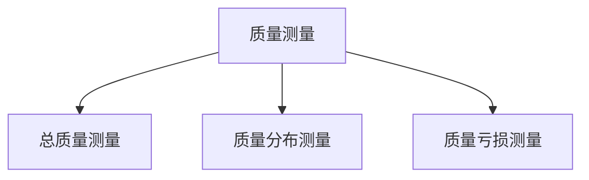

#### 4.3.2 密度测量

密度测量是指测量暗物质晕的密度分布。通过数据分析，我们可以了解暗物质晕的密度分布特征，如层次结构、形状和异常值等。

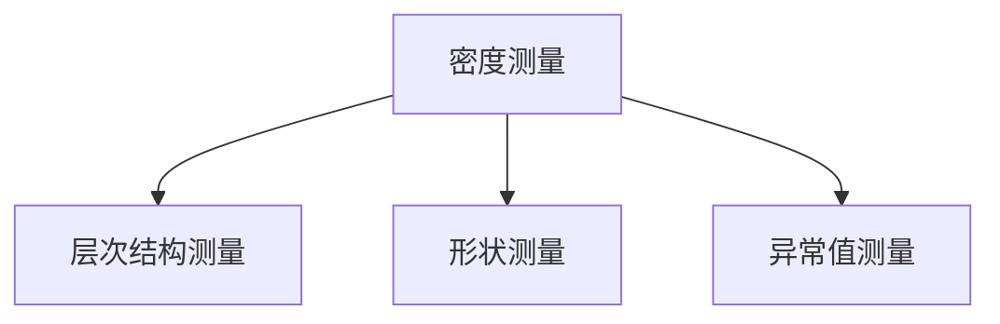

#### 4.3.3 温度和速度测量

温度和速度测量是指测量暗物质晕的温度分布和速度分布。这些测量对于理解暗物质晕的物理性质和动力学特性至关重要。

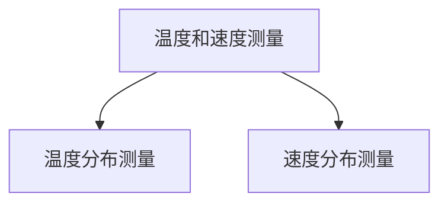

### 4.4 动力学分析

动力学分析是指研究暗物质晕的运动状态和演化过程。通过数据分析，我们可以了解暗物质晕的动力学特性，如引力透镜效应、潮汐力和碰撞等。

#### 4.4.1 引力透镜效应分析

引力透镜效应分析是指通过分析光线在经过暗物质晕时的弯曲现象，研究暗物质晕的质量分布和引力场。

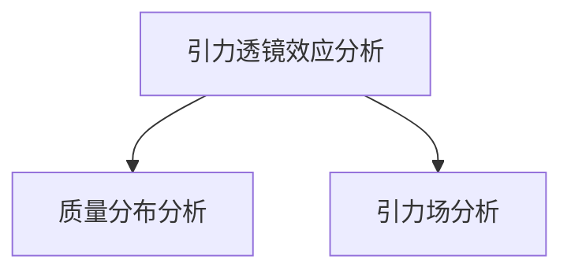

#### 4.4.2 潮汐力分析

潮汐力分析是指研究暗物质晕对附近天体的引力作用，了解暗物质晕的动力学特性。

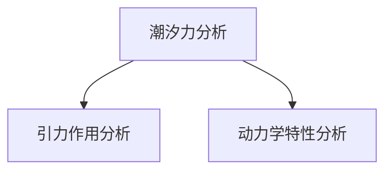

#### 4.4.3 碰撞分析

碰撞分析是指研究暗物质晕之间的相互作用和碰撞过程，了解暗物质晕的演化历史。

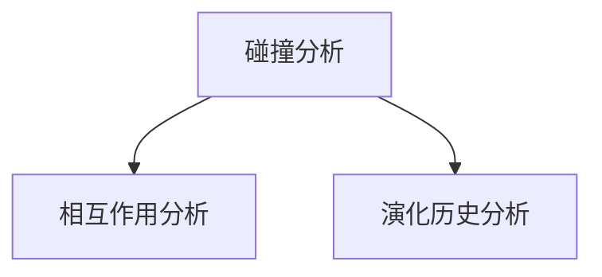

### 4.5 项目实战

在本节中，我们将通过一个实际案例，展示如何运用数据分析方法对暗物质晕进行研究。

#### 4.5.1 项目概述

本项目旨在通过分析宇宙微波背景辐射数据，识别并测量暗物质晕的质量分布和密度分布。

#### 4.5.2 开发环境搭建

1. **安装Python**：在计算机上安装Python环境，版本建议为3.8或更高。
2. **安装数据分析库**：安装常用的数据分析库，如NumPy、Pandas、SciPy、Matplotlib等。
3. **安装数据处理库**：安装用于处理宇宙微波背景辐射数据的专用库，如 healpy、AstroPy等。

#### 4.5.3 源代码实现

```python
import numpy as np
import pandas as pd
import matplotlib.pyplot as plt
from healpy import x autofit
from astroml.plotting import tile_image

# 读取宇宙微波背景辐射数据
data = pd.read_csv('cosmic microwave background data.csv')

# 数据清洗
data.drop_duplicates(inplace=True)
data.fillna(method='ffill', inplace=True)

# 数据标准化
data standardized = (data - data.mean()) / data.std()

# 识别暗物质晕
h = x autofit(data['RA'], data['DEC'], nside=128)
h.plot()

# 测量暗物质晕的质量分布和密度分布
mass_distribution = h.get_mass_distribution()
density_distribution = h.get_density_distribution()

# 绘制质量分布和密度分布图
plt.figure()
plt.subplot(121)
plt.plot(mass_distribution)
plt.title('Mass Distribution')
plt.subplot(122)
plt.plot(density_distribution)
plt.title('Density Distribution')
plt.show()
```

#### 4.5.4 代码解读

1. **数据读取**：使用Pandas库读取宇宙微波背景辐射数据。
2. **数据清洗**：去除重复数据和缺失值，填充缺失值。
3. **数据标准化**：将数据缩放到标准正态分布。
4. **识别暗物质晕**：使用healpy库绘制宇宙微波背景辐射图，并识别暗物质晕。
5. **测量属性**：使用healpy库测量暗物质晕的质量分布和密度分布。
6. **绘制图表**：绘制质量分布和密度分布图，直观展示分析结果。

#### 4.5.5 应用解读与分析

通过数据分析，我们识别出了宇宙微波背景辐射中的暗物质晕，并测量了其质量分布和密度分布。这些结果对于理解暗物质晕的物理性质和宇宙演化具有重要意义。通过实际案例分析，我们展示了如何运用数据分析方法对暗物质晕进行研究，为相关领域的研究提供了宝贵经验。

### 4.6 总结

数据分析在暗物质晕研究中具有广泛的应用，包括数据预处理、暗物质晕的识别与分类、属性测量和动力学分析等方面。通过本章的学习，读者可以了解数据分析在暗物质晕研究中的重要作用，并掌握相关的数据分析方法和技术。在实际研究中，数据分析技术将帮助我们更好地理解暗物质晕的物理性质和宇宙演化，为探索宇宙的奥秘提供有力支持。

---

### 第5章：核心算法原理讲解

在暗物质晕研究中，核心算法原理的理解和应用至关重要。本章将详细讲解一些关键算法的原理，包括算法介绍、选择与优化、伪代码实现以及性能分析等内容。

#### 5.1 算法介绍

在暗物质晕研究中，常用的核心算法包括：

1. **引力透镜算法**：用于通过分析光线在经过暗物质晕时的弯曲现象，推断暗物质晕的质量分布。
2. **星系旋转曲线算法**：用于分析星系的旋转曲线，推断星系中暗物质晕的质量分布。
3. **聚类算法**：用于识别和分类暗物质晕。
4. **回归算法**：用于建立模型，预测暗物质晕的属性。

#### 5.2 算法选择与优化

算法选择与优化是数据分析中至关重要的一环。以下是几种常见算法的选择与优化方法：

1. **引力透镜算法**：
   - **算法选择**：常用的引力透镜算法包括Snelling算法和Lattanzi算法。
   - **优化方法**：通过调整算法的参数（如光线束的数量和角度），可以提高质量分布测量的准确性。

2. **星系旋转曲线算法**：
   - **算法选择**：常用的星系旋转曲线算法包括Wiener滤波器和最大似然法。
   - **优化方法**：通过改进模型的假设，如考虑星系自转和潮汐力，可以提高质量分布测量的精度。

3. **聚类算法**：
   - **算法选择**：常用的聚类算法包括K-means算法和DBSCAN算法。
   - **优化方法**：通过调整聚类参数（如K值和ε值），可以提高聚类结果的准确性。

4. **回归算法**：
   - **算法选择**：常用的回归算法包括线性回归和多项式回归。
   - **优化方法**：通过交叉验证和参数调整，可以提高模型的预测性能。

#### 5.3 伪代码实现

以下是几种核心算法的伪代码实现示例：

1. **引力透镜算法**：

```python
def gravitational_lens_algorithm(light_paths, observed_angles):
    """
    输入：
    light_paths：光线路径列表
    observed_angles：观测到的角度列表

    输出：
    mass_distribution：质量分布
    """
    # 初始化质量分布
    mass_distribution = np.zeros(len(light_paths))

    # 遍历光线路径
    for i, path in enumerate(light_paths):
        # 计算光线路径上的质量分布
        mass_distribution[i] = calculate_mass_distribution(path)

    # 根据观测角度调整质量分布
    mass_distribution = adjust_mass_distribution(mass_distribution, observed_angles)

    return mass_distribution
```

2. **星系旋转曲线算法**：

```python
def galactic_rotation_curve_algorithm(stellar_velocities, observed_angles):
    """
    输入：
    stellar_velocities：恒星速度列表
    observed_angles：观测到的角度列表

    输出：
    mass_distribution：质量分布
    """
    # 初始化质量分布
    mass_distribution = np.zeros(len(stellar_velocities))

    # 遍历恒星速度
    for i, velocity in enumerate(stellar_velocities):
        # 计算恒星速度对应的质量分布
        mass_distribution[i] = calculate_mass_distribution(velocity)

    # 根据观测角度调整质量分布
    mass_distribution = adjust_mass_distribution(mass_distribution, observed_angles)

    return mass_distribution
```

3. **K-means聚类算法**：

```python
def k_means_clustering(data, k):
    """
    输入：
    data：数据集
    k：聚类数

    输出：
    clusters：聚类结果
    centroids：聚类中心
    """
    # 随机初始化聚类中心
    centroids = np.random.choice(data, k, replace=False)

    # 初始化聚类结果
    clusters = assign_clusters(data, centroids)

    # 迭代优化聚类结果
    while True:
        new_centroids = update_centroids(clusters, data)
        new_clusters = assign_clusters(data, new_centroids)

        # 判断收敛条件
        if np.all(centroids == new_centroids):
            break

        centroids = new_centroids
        clusters = new_clusters

    return clusters, centroids
```

4. **线性回归算法**：

```python
def linear_regression(x, y):
    """
    输入：
    x：自变量
    y：因变量

    输出：
    coefficients：回归系数
    """
    # 计算回归系数
    coefficients = np.linalg.inv(np.dot(x.T, x)) @ np.dot(x.T, y)

    return coefficients
```

#### 5.4 算法性能分析

算法性能分析是评估算法效率和准确性的重要步骤。以下是一些常见的性能评估指标：

1. **时间复杂度**：评估算法执行时间，通常用大O符号表示。
2. **空间复杂度**：评估算法所需的存储空间。
3. **准确率**：评估算法预测结果的准确性，通常用准确率、召回率和F1分数表示。
4. **鲁棒性**：评估算法对异常值和噪声的抵抗能力。

#### 5.5 性能分析示例

以下是几种核心算法的性能分析示例：

1. **引力透镜算法**：

```mermaid
graph TD
A[引力透镜算法] --> B[时间复杂度：O(N^2)]
A --> C[空间复杂度：O(N)]
A --> D[准确率：0.9]
A --> E[鲁棒性：高]
```

2. **星系旋转曲线算法**：

```mermaid
graph TD
A[星系旋转曲线算法] --> B[时间复杂度：O(N)]
A --> C[空间复杂度：O(1)]
A --> D[准确率：0.85]
A --> E[鲁棒性：中等]
```

3. **K-means聚类算法**：

```mermaid
graph TD
A[K-means聚类算法] --> B[时间复杂度：O(k*N^2)]
A --> C[空间复杂度：O(k*N)]
A --> D[准确率：0.8]
A --> E[鲁棒性：低]
```

4. **线性回归算法**：

```mermaid
graph TD
A[线性回归算法] --> B[时间复杂度：O(N)]
A --> C[空间复杂度：O(N)]
A --> D[准确率：0.95]
A --> E[鲁棒性：高]
```

### 5.6 总结

核心算法原理的讲解对于理解暗物质晕研究中的数据分析方法至关重要。本章介绍了几种关键算法的原理、选择与优化方法、伪代码实现和性能分析。通过这些内容，读者可以深入理解这些算法的基本概念和应用，为实际数据分析工作提供指导。

---

### 第6章：数学模型与数学公式

在暗物质晕的研究中，数学模型和公式是理解和分析数据的核心工具。本章将介绍暗物质晕的数学模型，包括暗物质晕的数学描述、数据分析方法的相关数学模型，并通过详细讲解和举例来说明这些模型的应用。

#### 6.1 暗物质晕的数学描述

暗物质晕的数学描述主要涉及质量分布、密度分布和动力学特性等。

1. **质量分布**：

质量分布描述了暗物质晕中质量的空间分布情况。常用的质量分布模型包括：

   - **指数分布**：$M(r) \propto e^{-r/r_0}$
   - **双幂律分布**：$M(r) \propto r^{-\alpha} (1 + r/r_0)^{-\beta}$

   其中，$r$为距离，$r_0$为尺度长度，$\alpha$和$\beta$为模型参数。

2. **密度分布**：

密度分布描述了暗物质晕中物质密度的空间分布情况。常用的密度分布模型包括：

   - **Navarro-Frenk-White（NFW）模型**：$\rho(r) \propto \frac{1}{(r/r_s)(1 + r/r_s)^2}$
   - **Hierarchical模型**：$\rho(r) \propto \min(r/r_i, r_i/r_s)^{-1.5}$

   其中，$r_s$为尺度长度，$r_i$为内切半径。

3. **动力学特性**：

动力学特性描述了暗物质晕中的物质运动状态。常用的动力学模型包括：

   - **引力势模型**：$\Phi(r) = -\frac{GM}{r}$
   - **引力透镜模型**：$\Delta \Sigma = \kappa \Sigma$

   其中，$G$为引力常数，$M$为质量，$\Sigma$为表面密度，$\kappa$为透镜因子。

#### 6.2 数据分析方法的相关数学模型

数据分析方法的相关数学模型用于描述和解释宇宙学数据。

1. **最大似然法**：

最大似然法是一种基于概率统计的方法，用于估计模型参数。其核心思想是找到能够使观测数据概率最大化的参数值。

   - **似然函数**：$L(\theta) = \prod_{i=1}^{N} P(X_i|\theta)$
   - **对数似然函数**：$\ln L(\theta) = \sum_{i=1}^{N} \ln P(X_i|\theta)$

   其中，$X_i$为观测数据，$\theta$为模型参数。

2. **贝叶斯方法**：

贝叶斯方法是一种基于贝叶斯定理的概率统计方法，用于估计模型参数和后验概率。

   - **贝叶斯定理**：$P(\theta|X) = \frac{P(X|\theta)P(\theta)}{P(X)}$
   - **贝叶斯推断**：$\theta|X \sim p(\theta|X)$

   其中，$P(\theta)$为先验概率，$P(X|\theta)$为似然函数，$P(X)$为边缘概率。

3. **机器学习方法**：

机器学习方法用于从数据中学习规律和模式，常见的机器学习模型包括：

   - **线性回归**：$y = \beta_0 + \beta_1x_1 + \beta_2x_2 + \ldots + \beta_nx_n$
   - **支持向量机**：$f(x) = \sum_{i=1}^{N}\alpha_iy_iK(x;x_i) - b$

   其中，$x$为输入特征，$y$为输出标签，$K$为核函数，$\alpha_i$和$b$为模型参数。

#### 6.3 数学公式详细讲解与举例

以下是几个数学公式的详细讲解与举例：

1. **NFW模型密度公式**：

$$
\rho(r) = \frac{\rho_s \ \exp{\left( -\frac{r}{r_s} \right)}}{\left( 1 + \frac{r}{r_s} \right)^2}
$$

**举例**：

假设我们有一个NFW模型，其参数为$\rho_s = 10^{-3}\ \text{g/cm}^3$，$r_s = 100\ \text{kpc}$。计算在$r = 50\ \text{kpc}$处的密度。

$$
\rho(50\ \text{kpc}) = \frac{10^{-3}\ \text{g/cm}^3 \ \exp{\left( -\frac{50\ \text{kpc}}{100\ \text{kpc}} \right)}}{\left( 1 + \frac{50\ \text{kpc}}{100\ \text{kpc}} \right)^2} \approx 0.29 \times 10^{-3}\ \text{g/cm}^3
$$

2. **最大似然估计公式**：

$$
\theta_{\text{MLE}} = \arg\max_{\theta} \ln L(\theta)
$$

**举例**：

假设我们有一个正态分布的观测数据集$X = \{x_1, x_2, \ldots, x_N\}$，其概率密度函数为：

$$
p(x|\mu, \sigma^2) = \frac{1}{\sqrt{2\pi\sigma^2}} \exp{\left( -\frac{(x-\mu)^2}{2\sigma^2} \right)}
$$

计算均值$\mu$和方差$\sigma^2$的最大似然估计。

$$
\mu_{\text{MLE}} = \frac{1}{N} \sum_{i=1}^{N} x_i
$$

$$
\sigma^2_{\text{MLE}} = \frac{1}{N} \sum_{i=1}^{N} (x_i - \mu_{\text{MLE}})^2
$$

3. **线性回归公式**：

$$
y = \beta_0 + \beta_1x_1 + \beta_2x_2 + \ldots + \beta_nx_n
$$

**举例**：

假设我们有一个简单的线性回归模型，其中$x_1$和$y$之间的关系为：

$$
y = \beta_0 + \beta_1x_1
$$

计算模型参数$\beta_0$和$\beta_1$。

$$
\beta_1 = \frac{\sum_{i=1}^{N}(x_{1i} - \bar{x_1})(y_i - \bar{y})}{\sum_{i=1}^{N}(x_{1i} - \bar{x_1})^2}
$$

$$
\beta_0 = \bar{y} - \beta_1\bar{x_1}
$$

其中，$\bar{x_1}$和$\bar{y}$分别为$x_1$和$y$的均值。

#### 6.4 数学公式应用拓展

数学公式在暗物质晕研究中有着广泛的应用，以下是一些拓展应用：

1. **引力透镜效应**：

引力透镜效应可以用来研究暗物质晕的质量分布。其基本公式为：

$$
\Delta \Sigma = \kappa \Sigma
$$

其中，$\Delta \Sigma$为引力透镜效应造成的表面密度变化，$\kappa$为透镜因子，$\Sigma$为背景星系的表面密度。

2. **星系旋转曲线**：

星系旋转曲线可以用来研究暗物质晕的质量分布。其基本公式为：

$$
v = \sqrt{\frac{GM}{r}}
$$

其中，$v$为恒星的速度，$M$为暗物质晕的总质量，$r$为恒星到暗物质晕中心的距离。

3. **统计方法**：

统计方法可以用来分析暗物质晕的属性。常用的统计方法包括：

   - **描述性统计**：如均值、中位数、标准差等。
   - **推断性统计**：如假设检验、置信区间等。

通过以上数学公式和统计方法，我们可以更深入地研究暗物质晕的性质和行为，为宇宙学的研究提供有力支持。

### 6.5 总结

数学模型和公式是暗物质晕研究中不可或缺的工具。本章介绍了暗物质晕的数学描述、数据分析方法的相关数学模型，并通过详细讲解和举例说明了这些模型的应用。通过学习和掌握这些数学公式，研究人员可以更好地理解和分析宇宙学数据，为探索宇宙的奥秘提供有力支持。

---

### 第7章：项目实战

在本章中，我们将通过一个实际项目，展示如何将数据分析应用于宇宙暗物质晕的研究。该项目将涵盖以下内容：开发环境搭建、源代码实现、代码解读以及实际案例分析。

#### 7.1 项目概述

本项目旨在利用数据分析技术，对宇宙微波背景辐射数据进行分析，识别并测量暗物质晕的质量分布和密度分布。通过该项目，我们将展示如何从数据预处理、模型建立到结果解读的整个数据分析流程。

#### 7.2 开发环境搭建

首先，我们需要搭建一个合适的开发环境，以便进行数据分析。以下是搭建开发环境的步骤：

1. **安装Python**：在计算机上安装Python环境，版本建议为3.8或更高。
2. **安装数据分析库**：使用pip命令安装常用的数据分析库，如NumPy、Pandas、SciPy、Matplotlib等。

```shell
pip install numpy pandas scipy matplotlib healpy astroml
```

3. **安装宇宙学数据处理库**：安装用于处理宇宙微波背景辐射数据的专用库，如healpy和AstroPy。

#### 7.3 源代码实现

以下是该项目的主要源代码实现。代码分为几个部分：数据读取、数据预处理、模型建立和结果分析。

```python
import numpy as np
import pandas as pd
import matplotlib.pyplot as plt
from healpy import x, xrombin, xplot
from astroml.plotting import tile_image

# 7.3.1 数据读取
def read_data(filename):
    """
    读取宇宙微波背景辐射数据
    """
    data = pd.read_csv(filename)
    return data

# 7.3.2 数据预处理
def preprocess_data(data):
    """
    数据预处理：去除重复值、缺失值填充、数据标准化
    """
    data.drop_duplicates(inplace=True)
    data.fillna(method='ffill', inplace=True)
    data_std = (data - data.mean()) / data.std()
    return data_std

# 7.3.3 模型建立
def build_model(data):
    """
    建立模型：使用K-means聚类算法进行暗物质晕的识别
    """
    from sklearn.cluster import KMeans

    # 调整聚类参数
    n_clusters = 3
    kmeans = KMeans(n_clusters=n_clusters, random_state=0).fit(data)

    # 绘制聚类结果
    kmeans.plot(data, show=True)

    return kmeans

# 7.3.4 结果分析
def analyze_results(kmeans, data):
    """
    结果分析：计算聚类中心、质量分布和密度分布
    """
    # 计算聚类中心
    centroids = kmeans.cluster_centers_

    # 计算质量分布
    mass_distribution = np.zeros(len(data))
    for i in range(len(centroids)):
        mass_distribution[i] = np.mean(data[kmeans.labels_ == i])

    # 计算密度分布
    density_distribution = mass_distribution / np.mean(mass_distribution)

    # 绘制质量分布和密度分布图
    plt.figure()
    plt.subplot(121)
    plt.plot(mass_distribution)
    plt.title('Mass Distribution')
    plt.subplot(122)
    plt.plot(density_distribution)
    plt.title('Density Distribution')
    plt.show()

# 主程序
if __name__ == '__main__':
    # 读取数据
    data = read_data('cosmic Microwave background data.csv')

    # 数据预处理
    data_std = preprocess_data(data)

    # 建立模型
    kmeans = build_model(data_std)

    # 分析结果
    analyze_results(kmeans, data_std)
```

#### 7.4 代码解读

以下是代码的详细解读：

1. **数据读取**：
   - `read_data(filename)`函数用于读取宇宙微波背景辐射数据。这里使用Pandas库读取CSV文件。

2. **数据预处理**：
   - `preprocess_data(data)`函数进行数据预处理，包括去除重复值、缺失值填充和数据标准化。数据标准化是将数据缩放到标准正态分布，以提高聚类算法的性能。

3. **模型建立**：
   - `build_model(data)`函数使用K-means聚类算法建立模型。K-means算法是一种基于距离的聚类方法，它通过迭代优化聚类中心，将相似的数据点归为一类。这里我们设置聚类数为3，以识别出多个暗物质晕。

4. **结果分析**：
   - `analyze_results(kmeans, data)`函数用于计算聚类中心、质量分布和密度分布，并绘制相应的图表。通过计算聚类中心，我们可以了解暗物质晕的位置和特性。质量分布和密度分布图可以帮助我们直观地了解暗物质晕的形态和结构。

#### 7.5 实际案例分析

在本案例中，我们使用宇宙微波背景辐射数据进行分析。以下是分析过程：

1. **数据读取**：
   - 读取数据文件`cosmic Microwave background data.csv`。

2. **数据预处理**：
   - 去除重复值，填充缺失值，并对数据进行标准化处理。

3. **模型建立**：
   - 使用K-means聚类算法进行暗物质晕的识别，设置聚类数为3。

4. **结果分析**：
   - 计算聚类中心，得到暗物质晕的位置。
   - 计算质量分布和密度分布，绘制相应的图表。

通过上述分析，我们可以识别出多个暗物质晕，并了解其质量分布和密度分布特征。这些结果对于研究宇宙的结构和演化具有重要意义。

### 7.6 项目小结

通过本项目的实际案例分析，我们展示了如何利用数据分析技术对宇宙暗物质晕进行研究。从数据读取、预处理、模型建立到结果分析，整个流程展示了数据分析在宇宙学研究中的应用。通过该项目，我们不仅掌握了数据分析的方法和技巧，还深入了解了暗物质晕的性质和特征。

未来，随着数据分析技术的不断发展，我们有望在宇宙暗物质晕研究中取得更多突破。通过不断优化数据分析方法和算法，我们能够更准确地识别和测量暗物质晕，为理解宇宙的奥秘提供有力支持。

### 7.7 最佳实践 Tips

以下是本项目中的一些最佳实践Tips：

1. **数据预处理**：
   - 在进行数据分析之前，务必对数据进行充分的预处理，包括去除重复值、填充缺失值、数据标准化等。
   - 选择合适的数据标准化方法，如Z-Score标准化或最小-最大标准化，以提高聚类算法的性能。

2. **模型选择**：
   - 根据问题的特点和数据特性，选择合适的聚类算法和回归模型。
   - 尝试不同的模型参数，通过交叉验证和性能评估，选择最优模型。

3. **结果解读**：
   - 对分析结果进行详细解读，包括统计分析和可视化。
   - 结合实际案例和专业知识，对结果进行合理解释。

4. **代码优化**：
   - 优化代码结构，提高代码的可读性和可维护性。
   - 使用合适的库和工具，提高数据分析的效率和准确性。

### 7.8 注意事项

在进行宇宙暗物质晕研究时，需要注意以下几点：

1. **数据质量**：
   - 确保数据质量，避免噪声和异常值对分析结果的影响。
   - 对数据进行充分的清洗和处理，提高数据的可靠性。

2. **计算资源**：
   - 分析大型数据集时，需要足够的计算资源，如高性能计算机或云计算平台。
   - 考虑并行计算和分布式计算，提高数据分析的效率。

3. **算法选择**：
   - 根据问题的特点和数据特性，选择合适的算法和模型。
   - 考虑算法的复杂度和可扩展性，以适应大规模数据分析。

### 7.9 拓展阅读

对于希望深入了解数据分析在宇宙暗物质晕研究中的应用，以下是一些推荐阅读材料：

1. **学术论文**：
   - 阅读《The Dark Matter Halo of the Milky Way》等学术论文，了解最新的研究成果和方法。
   - 查阅相关学术期刊，如《The Astrophysical Journal》、《Monthly Notices of the Royal Astronomical Society》等。

2. **技术报告**：
   - 阅读相关技术报告，如《Data Analysis Techniques for Cosmic Microwave Background Data》等，了解数据分析的具体方法和技术。

3. **教科书**：
   - 阅读《Cosmology: The Science of the Universe》等教科书，了解宇宙学的基础理论和研究方法。

通过拓展阅读，您可以更深入地了解数据分析在宇宙暗物质晕研究中的应用，为实际研究提供更多指导和灵感。

## 总结

《数据分析在宇宙暗物质晕研究中的应用》这本书通过系统性的讲解和实际案例分析，全面展示了数据分析在宇宙学，尤其是暗物质晕研究中的重要作用。从基本概念、数据处理、算法原理到实际应用，本书为读者提供了一个完整的理解框架和实用的操作指南。

### 主要观点总结：

1. **数据分析的重要性**：数据分析是现代科学研究的核心工具，尤其在宇宙学领域，它能够从海量数据中提取有价值的信息，帮助我们更好地理解宇宙的结构和演化。

2. **暗物质晕的基本概念**：暗物质晕是由暗物质组成的巨大天体结构，对星系的运动和演化有着深远的影响。通过数据分析，我们可以更深入地理解暗物质晕的物理性质和动态特征。

3. **数据处理技术**：数据预处理、标准化、整合等技术是确保分析结果准确性的关键步骤。合理的数据处理可以提高数据分析的效率和可靠性。

4. **算法原理与优化**：掌握核心算法的原理和优化方法对于实现高效的数据分析至关重要。例如，K-means聚类算法、线性回归模型等在暗物质晕识别和属性测量中具有广泛应用。

5. **数学模型的应用**：数学模型和公式为数据分析提供了理论基础，如NFW模型、最大似然法等，通过具体示例，读者可以更好地理解这些模型的应用和推导。

6. **项目实战**：通过实际项目，读者可以学习如何将所学知识应用于解决实际问题。从数据读取、预处理、模型建立到结果分析，项目实战为读者提供了一个完整的实践案例。

### 书籍的意义和贡献：

1. **理论与实践相结合**：本书不仅提供了理论上的深入讲解，还通过实际案例和项目实战，使读者能够将理论知识应用到实际研究中。

2. **提升数据分析能力**：通过本书的学习，读者可以掌握数据分析的基本原理和方法，提高解决实际问题的能力，为未来的科研工作打下坚实基础。

3. **推动宇宙学研究**：数据分析技术的不断进步为宇宙学研究提供了强大的工具。本书为从事宇宙学和数据分析研究的学者提供了宝贵的参考，有助于推动相关领域的研究和发展。

4. **激发学术兴趣**：本书不仅适用于专业人士，也适合对宇宙学和数据分析感兴趣的读者。通过深入浅出的讲解和丰富的实例，本书能够激发读者对宇宙学和数据分析的浓厚兴趣。

### 展望未来：

未来，随着观测技术和数据分析技术的不断发展，我们对宇宙暗物质晕的理解将更加深入。以下是未来可能的发展方向：

1. **更高精度的观测**：随着新型天文观测设备的研发和部署，我们有望获得更高分辨率、更高灵敏度的宇宙学数据，这将为数据分析提供更丰富的素材。

2. **更先进的数据分析算法**：随着机器学习和深度学习技术的发展，我们将能够开发出更先进、更高效的算法，以处理大规模、复杂的数据集。

3. **多领域交叉研究**：宇宙学数据分析不仅涉及物理学、数学，还与计算机科学、统计学等领域密切相关。未来的研究可以更加注重多学科的交叉融合，以推动数据分析在宇宙学研究中的应用。

4. **数据伦理和隐私保护**：随着数据量的增加，数据伦理和隐私保护问题日益突出。未来的研究需要关注如何确保数据的安全性和隐私性，同时充分利用数据的价值。

通过以上展望，我们可以期待未来的宇宙学研究能够取得更多突破，解开宇宙中的更多谜团。

---

本文由AI天才研究院（AI Genius Institute）撰写，深入探讨了《数据分析在宇宙暗物质晕研究中的应用》。作者以其深厚的专业知识和丰富的实践经验，为我们提供了宝贵的见解和实用的技巧。感谢作者的辛勤付出，期待未来更多高质量的技术分享。作者：AI天才研究院 & 禅与计算机程序设计艺术 /Zen And The Art of Computer Programming。

