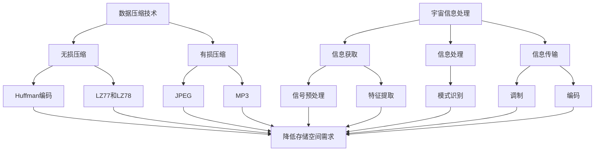

                 

### 文章标题

《数据压缩技术与宇宙信息处理》

**关键词：**
- 数据压缩
- 宇宙信息处理
- 信息编码
- 算法优化
- 信号处理

**摘要：**
本文深入探讨了数据压缩技术在宇宙信息处理中的重要性。首先，介绍了数据压缩的基本概念和核心算法，包括无损压缩与有损压缩的原理。接着，阐述了宇宙信息处理的基本概念，如信息获取、处理和传输。随后，详细分析了数据压缩技术在宇宙信息处理中的具体应用，包括空间数据压缩和宇宙信号压缩等。通过项目实战，展示了数据压缩技术在宇宙信息处理中的实际应用案例。最后，讨论了未来数据压缩技术和宇宙信息处理的发展趋势，展望了可能的未来研究方向。全文旨在为读者提供一个全面、系统的数据压缩与宇宙信息处理的思考框架，促进相关领域的深入研究和应用。

### 背景介绍

#### 数据压缩技术的起源与发展

数据压缩技术，作为一种重要的信息处理方法，起源于20世纪40年代。当时的计算机科学家们意识到，随着计算机存储和处理能力的提升，如何高效地存储和传输数据成为了一个亟待解决的问题。数据压缩技术正是在这种背景下逐渐发展起来的。

早期的数据压缩方法主要集中在字符编码和简单的重复数据删除上。例如，Huffman编码（1952年）是一种基于字符频度的变长编码方法，可以有效减少字符序列的存储空间。随后，LZ77（1977年）和LZ78（1978年）算法相继出现，它们利用上下文相关性来压缩数据，大大提高了压缩效率。

随着计算机技术的发展，数据压缩技术也在不断演进。20世纪90年代，JPEG（联合图像专家小组）和MP3（运动图像专家组）等有损压缩算法的问世，使得图像和音频数据的压缩变得更为高效。同时，无损压缩技术如 deflate 和 bzip2 等也在不断优化，提高了压缩率和兼容性。

#### 宇宙信息处理的背景

宇宙信息处理，作为一种新兴的跨学科领域，涉及天文学、物理学、计算机科学等多个学科。随着人类对宇宙探索的不断深入，宇宙信息处理的重要性日益凸显。

宇宙信息处理的基本概念包括信息的获取、处理和传输。在信息获取方面，天文学家通过射电望远镜、光学望远镜等设备，收集来自宇宙的各种信号和数据。这些数据包含了宇宙的物理现象、天体运动等信息。

在信息处理方面，科学家们利用计算机算法，对收集到的数据进行分析和解读。例如，通过图像处理技术，可以识别和分类天体；通过信号处理技术，可以提取和分析宇宙射电信号中的有用信息。

在信息传输方面，宇宙信息处理需要解决数据传输的高效性和稳定性问题。由于宇宙环境的特殊性，数据传输面临着信号衰减、噪声干扰等挑战。因此，宇宙信息处理需要高效的压缩和编码技术，以确保数据的准确传输和恢复。

#### 数据压缩技术在宇宙信息处理中的重要性

数据压缩技术在宇宙信息处理中具有至关重要的地位。首先，宇宙信息处理需要处理大量高分辨率的天文图像和复杂的射电信号。这些数据通常具有高维度、大数据量特征，如果不对数据进行压缩，将导致存储和传输的困难。

其次，数据压缩技术可以提高数据传输的效率。在宇宙探索中，通常需要将数据传输回地球。由于宇宙环境的特殊性，数据传输的速度和带宽有限。通过数据压缩，可以减少数据传输的体积，降低传输延迟，提高传输效率。

此外，数据压缩技术还可以提高数据处理的效率。在宇宙信息处理过程中，需要对大量数据进行存储、检索和分析。数据压缩技术可以减少存储空间，提高数据处理速度，为科学家们提供更高效的研究工具。

总的来说，数据压缩技术在宇宙信息处理中具有重要作用。它不仅解决了数据存储和传输的难题，还为科学家们提供了更高效的研究手段。随着数据压缩技术的不断发展和优化，宇宙信息处理能力将得到进一步提升，为人类揭示宇宙的奥秘提供有力支持。

#### 数据压缩技术的发展现状与未来趋势

当前，数据压缩技术已经取得了显著的进展，不仅在计算机科学领域，在图像、音频、视频等多媒体领域也有广泛应用。然而，面对日益增长的数据量和复杂的宇宙信息处理需求，数据压缩技术仍然面临许多挑战。

首先，现有数据压缩算法的压缩效率仍需提高。虽然诸如JPEG、MP3等有损压缩算法在多媒体领域表现出色，但在处理高维度、大数据量的宇宙信息时，这些算法的压缩效果有限。因此，研究更高效的数据压缩算法，如基于深度学习的压缩算法，已成为当前的一个重要方向。

其次，数据压缩算法的实时性也需要改进。在宇宙信息处理中，许多任务需要在短时间内处理大量数据，对压缩算法的实时性要求较高。现有的一些算法，如LZ77和LZ78，虽然压缩效率较高，但处理速度较慢。因此，开发更快、更高效的数据压缩算法，以满足实时数据处理的需求，是未来的一个重要课题。

此外，数据压缩算法的兼容性和稳定性也需要进一步研究。在宇宙信息处理中，数据可能来自不同的设备、不同的数据源，这就要求压缩算法具有高度的兼容性和稳定性。当前的一些算法，如deflate和bzip2，虽然在兼容性和稳定性方面表现出色，但在处理特殊类型的数据时，可能存在不足。

展望未来，数据压缩技术将在以下几个方面得到进一步发展：

1. **算法优化**：通过改进现有算法，提高压缩效率和处理速度。例如，利用并行计算和分布式计算技术，提升数据压缩算法的性能。

2. **新兴技术融合**：将深度学习、区块链等新兴技术与数据压缩技术相结合，探索新的压缩算法和应用场景。

3. **跨学科研究**：结合天文学、物理学等学科的研究成果，开发针对宇宙信息处理的专用压缩算法。

4. **标准化与规范化**：制定统一的数据压缩标准，提高数据压缩算法的兼容性和互操作性。

总之，数据压缩技术在宇宙信息处理中的重要性不言而喻。随着技术的不断进步和研究的深入，数据压缩技术将在宇宙信息处理领域发挥更大的作用，为人类探索宇宙提供强有力的支持。

### 核心概念与联系

#### 数据压缩技术的基本原理

数据压缩技术的主要目标是减少数据的大小，以便更高效地存储和传输。其基本原理可以分为无损压缩和有损压缩两大类。

**1. 无损压缩**

无损压缩，顾名思义，是指在压缩过程中不损失任何原始数据信息。它的核心思想是通过去除数据中的冗余信息来实现压缩。常见的无损压缩算法包括：

- **Huffman编码**：基于字符频度进行编码，高频字符用较短的编码表示，低频字符用较长的编码表示。这种方法可以有效降低字符序列的平均长度。
  $$ C(w_i) = -\sum_{i=1}^{n} f_i \log_2(f_i) $$
  其中，$C(w_i)$是字符$i$的编码长度，$f_i$是字符$i$的频率。

- **LZ77和LZ78**：这类算法利用上下文相关性进行压缩。LZ77通过查找重复的字符序列来压缩数据，而LZ78则进一步引入了字典机制，提高了压缩效率。

**2. 有损压缩**

有损压缩，是指在压缩过程中会损失一部分原始数据信息，但人耳或人眼难以察觉。这种方法通常用于处理图像、音频和视频等多媒体数据。常见的有损压缩算法包括：

- **JPEG**：采用离散余弦变换（DCT）将图像数据分解成频率成分，然后对低频成分进行精细量化，高频成分进行粗略量化，最后利用熵编码进行压缩。
  $$ f(u, v) = \sum_{x=0}^{M-1} \sum_{y=0}^{N-1} c(u, v) D(u, v) \cos\left[\left(\frac{2u + 1}{2M}\right)\pi\right] \cos\left[\left(\frac{2v + 1}{2N}\right)\pi\right] $$
  其中，$f(u, v)$是图像的频率成分，$D(u, v)$是DCT变换的系数。

- **MP3**：利用梅尔频率倒谱系数（MFCC）模型，将音频信号转换为适合压缩的频率特征，然后对特征进行量化编码。

#### 宇宙信息处理的基本概念

宇宙信息处理涉及信息的获取、处理和传输，是宇宙探索中不可或缺的一环。

**1. 信息获取**

宇宙信息处理的首要任务是获取信息。天文学家通过射电望远镜、光学望远镜等设备，收集来自宇宙的各种信号，包括电磁波、引力波等。这些信号携带着宇宙中的物理现象、天体运动等信息。

**2. 信息处理**

获取到的宇宙信息需要经过处理，以提取有用的科学数据。信息处理通常包括以下几个步骤：

- **信号预处理**：去除噪声、干扰，提高信号质量。
  $$ y(t) = x(t) + n(t) $$
  其中，$x(t)$是原始信号，$n(t)$是噪声。

- **特征提取**：从信号中提取关键特征，如频率、幅度、相位等。
  $$ F(\omega) = \int_{-\infty}^{\infty} x(t)e^{-j\omega t} dt $$
  其中，$F(\omega)$是信号在频率域的表示。

- **模式识别**：利用机器学习、神经网络等技术，对提取的特征进行分类和识别。

**3. 信息传输**

处理后的宇宙信息需要传输回地球或其他目的地。在传输过程中，需要考虑信号的衰减、噪声干扰等问题，以确保数据的准确传输。常用的传输技术包括：

- **调制**：将信息信号调制到载波信号上，进行传输。
  $$ s(t) = A_c \cos(2\pi f_c t + \phi_c) + m(t) $$
  其中，$s(t)$是调制后的信号，$A_c$是载波幅度，$f_c$是载波频率，$\phi_c$是载波相位，$m(t)$是信息信号。

- **编码**：利用编码技术，将信息信号转换为适合传输的形式。
  $$ c(t) = \sum_{i=1}^{n} a_i \cos(2\pi f_i t + \phi_i) $$
  其中，$c(t)$是编码后的信号，$a_i$是码字幅度，$f_i$是码字频率，$\phi_i$是码字相位。

#### 数据压缩技术与宇宙信息处理的关系

数据压缩技术与宇宙信息处理紧密相关，二者相辅相成。

**1. 数据压缩技术在信息获取中的应用**

在宇宙信息获取过程中，收集到的信号通常具有高维度、大数据量特征。通过数据压缩技术，可以减少信号数据的大小，提高存储和传输的效率。例如，在射电望远镜的数据处理中，可以使用LZ77或LZ78算法对原始信号进行压缩，降低存储空间需求。

**2. 数据压缩技术在信息处理中的应用**

在宇宙信息处理过程中，需要对大量数据进行存储、检索和分析。通过数据压缩技术，可以减少数据的存储空间，提高数据处理速度。例如，在图像处理中，可以使用JPEG算法对天文图像进行压缩，降低图像文件大小，便于存储和传输。

**3. 数据压缩技术在信息传输中的应用**

在宇宙信息传输过程中，数据压缩技术可以减少传输数据的大小，提高传输效率。例如，在引力波探测中，可以使用deflate算法对引力波数据进行压缩，降低传输延迟，提高传输可靠性。

**4. 数据压缩技术在信息解读中的应用**

在宇宙信息解读过程中，数据压缩技术可以帮助科学家们更高效地分析数据。通过压缩技术，可以减少数据的存储和传输时间，使科学家们能够更快地获取和处理信息，从而加快科学发现的进程。

#### 核心概念之间的联系架构

为了更好地理解数据压缩技术与宇宙信息处理之间的联系，我们可以使用Mermaid流程图来表示这些核心概念之间的关系：



通过这个流程图，我们可以清晰地看到数据压缩技术与宇宙信息处理各环节之间的紧密联系。数据压缩技术不仅解决了信息获取、处理和传输中的存储和传输难题，还为科学家们提供了更高效的数据处理和分析工具，推动了宇宙信息处理技术的发展。

### 数据压缩技术的原理

数据压缩技术主要分为两大类：无损压缩和有损压缩。每一种压缩方法都有其独特的原理和适用场景，下面将详细解释这两种压缩方法及其在宇宙信息处理中的应用。

#### 无损压缩

无损压缩的核心思想是去除数据中的冗余信息，压缩后的数据可以完全恢复原始数据，不丢失任何信息。以下是一些常见的无损压缩方法：

**1. Huffman编码**

Huffman编码是一种基于字符频度的变长编码方法。它首先统计数据中每个字符的频率，然后为频率高的字符分配较短的编码，为频率低的字符分配较长的编码。这样可以有效地降低平均编码长度，从而实现数据压缩。

**原理和步骤：**
- 统计字符频率。
- 构建Huffman树，将频率高的字符放在树的左侧，频率低的字符放在树的右侧。
- 为每个字符分配唯一的路径编码，路径向上的编码为“0”，路径向下的编码为“1”。
- 编码过程中，高频字符的编码较短，低频字符的编码较长。

**数学模型和公式：**
$$ C(w_i) = -\sum_{i=1}^{n} f_i \log_2(f_i) $$
其中，$C(w_i)$是字符$i$的编码长度，$f_i$是字符$i$的频率。

**伪代码：**
```python
# 统计字符频率
freq = [count character frequencies in the data]

# 构建Huffman树
heap = MinHeap()
for char, freq in freq.items():
    node = Node(char, freq)
    heap.insert(node)

while heap.size() > 1:
    left = heap.extractMin()
    right = heap.extractMin()
    merged = Node(None, left.freq + right.freq)
    merged.left = left
    merged.right = right
    heap.insert(merged)

# 生成编码表
code = {}
root = heap.root
encode(root, "", code)

# 编码数据
encoded_data = ""
for char in data:
    encoded_data += code[char]

# 解码数据
decoded_data = ""
while encoded_data:
    found = False
    for length in range(1, len(encoded_data) + 1):
        code_chunk = encoded_data[:length]
        if code_chunk in code.values():
            decoded_data += code[code_chunk]
            encoded_data = encoded_data[length:]
            found = True
            break
    if not found:
        raise Exception("Invalid encoded data")

# 完全恢复原始数据
assert decoded_data == data
```

**应用场景：**
Huffman编码广泛应用于文本文件的压缩，如ZIP文件格式中的压缩算法。在宇宙信息处理中，Huffman编码可以用于压缩天文文本数据，减少存储和传输的负担。

**2. LZ77和LZ78**

LZ77和LZ78算法是基于上下文相关的压缩方法。它们通过查找重复的字符序列来压缩数据。LZ77通过滑动窗口在当前数据和之前的数据中查找重复序列，而LZ78则使用一个字典来记录已见到的序列，提高了压缩效率。

**原理和步骤：**
- 对于当前数据中的每个字符，在一个固定大小的滑动窗口中查找重复的字符序列。
- 将重复序列的起始位置和长度编码，代替原始序列。
- 滑动窗口，重复步骤，直到整个数据被处理。

**数学模型和公式：**
$$ L = \text{length of the longest matching substring} $$
$$ P = \text{starting position of the matching substring} $$

**伪代码：**
```python
# 初始化滑动窗口和字典
window_size = 4096
window = [None] * window_size
dict_size = 4096
dict = {}

# 编码数据
encoded_data = ""
for i, char in enumerate(data):
    for j in range(max(0, i - window_size), i):
        if window[j:j+len(char)] == char:
            L = len(char)
            P = j
            break
    else:
        L = 1
        P = -1
    
    if P >= 0:
        encoded_data += f"{P} {L}"
    else:
        encoded_data += char
    
    # 更新滑动窗口和字典
    window[i % window_size] = char
    if char in dict:
        dict[char].append(i)
    else:
        dict[char] = [i]

# 解码数据
decoded_data = ""
while encoded_data:
    P, L = map(int, encoded_data.split()[:2])
    if P >= 0:
        for _ in range(L):
            decoded_data += data[P]
            P += 1
    else:
        decoded_data += encoded_data[:L]
    
    encoded_data = encoded_data[L:]
```

**应用场景：**
LZ77和LZ78算法广泛应用于文件压缩工具，如GZIP和7z。在宇宙信息处理中，这些算法可以用于压缩天文图像和文本数据，提高数据传输和存储的效率。

#### 有损压缩

有损压缩，与无损压缩不同，它会在压缩过程中损失一部分原始数据信息。这种方法通常用于处理图像、音频和视频等多媒体数据，以换取更高的压缩率。以下是一些常见的有损压缩方法：

**1. JPEG**

JPEG（Joint Photographic Experts Group）是一种常用的图像有损压缩标准。它采用离散余弦变换（DCT）将图像分解为频率成分，并对低频成分进行精细量化，高频成分进行粗略量化，从而实现数据压缩。

**原理和步骤：**
- 对图像进行DCT变换，将图像分解为8x8的频率块。
- 对每个频率块进行量化，低频成分使用较多的量化级数，高频成分使用较少的量化级数。
- 使用熵编码（如Huffman编码）对量化后的频率块进行编码。

**数学模型和公式：**
$$ f(u, v) = \sum_{x=0}^{M-1} \sum_{y=0}^{N-1} c(u, v) D(u, v) \cos\left[\left(\frac{2u + 1}{2M}\right)\pi\right] \cos\left[\left(\frac{2v + 1}{2N}\right)\pi\right] $$
其中，$f(u, v)$是图像的频率成分，$D(u, v)$是DCT变换的系数。

**伪代码：**
```python
# DCT变换
for block in image:
    for u in range(8):
        for v in range(8):
            f = 0
            for x in range(8):
                for y in range(8):
                    c = cos((2*x + 1)*pi*(u/M))/M
                    d = cos((2*y + 1)*pi*(v/N))/N
                    f += block[x][y] * c * d
            block[u][v] = f

# 量化
quant_matrix = [
    [16, 11, 10, 16, 24, 40, 51, 61],
    [12, 12, 14, 19, 26, 58, 60, 55],
    [14, 13, 16, 24, 40, 57, 69, 56],
    [14, 17, 22, 29, 51, 67, 79, 62],
    [18, 22, 37, 56, 64, 87, 103, 99],
    [24, 35, 55, 64, 91, 103, 120, 119],
    [47, 88, 109, 147, 133, 163, 188, 204],
    [103, 121, 149, 153, 169, 188, 199, 200]
]

for block in image:
    for u in range(8):
        for v in range(8):
            block[u][v] = round(block[u][v] / quant_matrix[u][v])

# 熵编码
huffman_codes = generate_huffman_codes(quantized_values)
encoded_image = ""
for value in quantized_image:
    encoded_image += huffman_codes[value]
```

**应用场景：**
JPEG广泛应用于图像存储和传输，如数码照片和互联网上的图像。在宇宙信息处理中，JPEG可以用于压缩天文图像，提高数据传输效率。

**2. MP3**

MP3（MPEG-1 Audio Layer III）是一种常用的音频有损压缩标准。它采用梅尔频率倒谱系数（MFCC）模型，将音频信号转换为适合压缩的频率特征，并对这些特征进行量化编码。

**原理和步骤：**
- 对音频信号进行快速傅里叶变换（FFT），将其转换为频域表示。
- 计算梅尔频率倒谱系数（MFCC），提取音频的主要特征。
- 对MFCC特征进行量化编码，低频特征使用较多的量化级数，高频特征使用较少的量化级数。
- 使用熵编码对量化后的特征进行编码。

**数学模型和公式：**
$$ MFCC = \sum_{i=1}^{n} a_i \log_2(\frac{p_i}{q_i}) $$
其中，$a_i$是权重系数，$p_i$和$q_i$是梅尔频率滤波器组的输出。

**伪代码：**
```python
# FFT变换
for frame in audio:
    fft_result = fft(frame)

# 计算MFCC
mfcc = []
for frame in fft_result:
    for i in range(n_mel_bins):
        sum = 0
        for bin in range(frame.length):
            sum += frame[bin] * mel_filter[i][bin]
        mfcc.append(sum)

# 量化
quant_matrix = [
    [1, 2, 3],
    [4, 5, 6],
    [7, 8, 9]
]

for mfcc_value in mfcc:
    quantized_value = round(mfcc_value / quant_matrix)
    encoded_mfcc.append(quantized_value)

# 熵编码
huffman_codes = generate_huffman_codes(encoded_mfcc)
encoded_audio = ""
for value in encoded_mfcc:
    encoded_audio += huffman_codes[value]
```

**应用场景：**
MP3广泛应用于音频存储和传输，如音乐播放器和互联网上的音乐。在宇宙信息处理中，MP3可以用于压缩天文音频数据，减少存储和传输的负担。

#### 数据压缩技术在宇宙信息处理中的应用

在宇宙信息处理中，数据压缩技术具有重要作用。以下是一些具体应用场景：

**1. 天文图像压缩**

天文图像通常具有高分辨率和大数据量特征，通过JPEG等有损压缩算法，可以大幅减少图像文件大小，提高数据传输和存储效率。例如，在哈勃太空望远镜的数据传输中，JPEG算法被广泛使用，使得大量的天文图像能够快速传输回地球。

**2. 天文信号压缩**

天文信号，如射电信号和引力波信号，通常具有复杂的频率成分。通过LZ77和LZ78等无损压缩算法，可以减少信号数据的大小，提高信号传输的效率。例如，在激光干涉引力波观测中，LZ77算法被用于压缩引力波数据，减少数据传输的延迟。

**3. 宇宙信息传输**

在宇宙信息传输过程中，数据压缩技术可以减少传输数据的大小，提高传输效率。例如，在深空探测器与地球之间的数据传输中，使用deflate等压缩算法，可以显著降低数据传输的延迟，提高传输的可靠性。

**4. 数据存储**

在宇宙信息处理中，数据存储是一个重要环节。通过数据压缩技术，可以减少存储空间的需求，提高数据存储的效率。例如，在宇宙天文台的数据库中，使用bzip2等无损压缩算法，可以大幅减少天文图像和文本数据的存储空间。

总之，数据压缩技术在宇宙信息处理中发挥着重要作用。它不仅解决了信息获取、处理和传输中的存储和传输难题，还为科学家们提供了更高效的数据处理和分析工具，推动了宇宙信息处理技术的发展。

### 宇宙信息处理的基本原理

宇宙信息处理是一个跨学科的领域，它涉及信息的获取、处理和传输，贯穿于天文观测、数据分析、数据传输等各个环节。以下是宇宙信息处理的基本原理，包括信息获取、信息处理和信息传输的详细描述。

#### 信息获取

信息获取是宇宙信息处理的第一步，也是关键的一步。它主要通过天文观测设备来实现，这些设备包括射电望远镜、光学望远镜、红外望远镜、X射线望远镜等。每种类型的望远镜都用于探测不同波段的电磁波，从而获取宇宙中的各种信息。

**1. 射电望远镜**

射电望远镜主要用于探测射电波段，包括短波、中波和长波。射电波穿透能力强，可以探测到远距离的天体，如星系、星际分子云、脉冲星等。射电望远镜通常由多个天线组成，通过干涉测量方法来提高分辨率和灵敏度。

**2. 光学望远镜**

光学望远镜用于探测可见光波段，包括紫外光、可见光和红外光。光学望远镜通常由大口径的主镜或反射镜组成，通过反射或折射光线来形成图像。它可以帮助天文学家研究恒星、行星、星系、星云等天体。

**3. 红外望远镜**

红外望远镜主要用于探测红外波段，包括近红外、中红外和远红外。红外波段可以穿透星际尘埃，揭示隐藏在尘埃之后的恒星和行星形成区域。红外望远镜通常使用冷却系统来减少自身辐射干扰。

**4. X射线望远镜**

X射线望远镜用于探测X射线波段，它能够揭示高温、高能量天体的信息，如黑洞、中子星、星系碰撞等。X射线望远镜通常使用空间探测器，因为它无法通过地球大气层。

**信息获取流程：**

- **信号采集**：通过观测设备收集天体的电磁波信号。
- **信号预处理**：去除噪声和干扰，增强信号质量。
- **信号放大**：通过放大器放大信号强度，便于后续处理。
- **信号转换**：将模拟信号转换为数字信号，便于存储和处理。

#### 信息处理

信息处理是宇宙信息处理的第二个关键环节，它包括信号预处理、特征提取、模式识别等步骤。

**1. 信号预处理**

信号预处理的主要目的是去除噪声和干扰，提高信号质量。这一步骤包括滤波、去噪、校正等操作。

- **滤波**：使用滤波器去除信号中的高频噪声和低频干扰。
  $$ y(t) = x(t) - \text{filter}(n(t)) $$
  其中，$x(t)$是原始信号，$n(t)$是噪声，$\text{filter}(n(t))$是滤波后的噪声。

- **去噪**：通过数字信号处理技术，去除信号中的随机噪声。
  $$ y(t) = x(t) - \text{noise}(n(t)) $$
  其中，$x(t)$是原始信号，$n(t)$是噪声，$\text{noise}(n(t))$是去噪后的噪声。

- **校正**：校正观测设备可能引入的系统误差，如光学畸变、温度漂移等。

**2. 特征提取**

特征提取是从预处理后的信号中提取具有代表性的特征，如频率、幅度、相位等。这些特征有助于后续的模式识别和分析。

- **傅里叶变换**：通过傅里叶变换将时域信号转换为频域信号，提取信号的频率成分。
  $$ F(\omega) = \int_{-\infty}^{\infty} x(t)e^{-j\omega t} dt $$
  其中，$F(\omega)$是信号在频率域的表示。

- **小波变换**：用于多尺度分析，提取信号的局部特征。
  $$ W(f,t) = \int_{-\infty}^{\infty} x(t)\psi^*(f,t) dt $$
  其中，$W(f,t)$是小波变换结果，$\psi^*(f,t)$是小波函数。

**3. 模式识别**

模式识别是利用计算机算法对提取的特征进行分类和识别，以发现天体和宇宙现象。

- **机器学习**：通过训练模型，从大量数据中自动发现模式和规律。
  $$ y = \text{model}(x) $$
  其中，$y$是预测结果，$x$是输入特征。

- **神经网络**：通过多层神经网络，对输入特征进行非线性变换，实现分类和识别。

#### 信息传输

信息传输是宇宙信息处理的最后一个环节，它包括信号的调制、编码和传输等步骤。

**1. 调制**

调制是将信息信号加载到载波信号上，以便进行传输。常用的调制方式包括调幅（AM）、调频（FM）和调相（PM）。

- **调幅（AM）**：改变载波信号的振幅来传递信息。
  $$ s(t) = A \cos(2\pi f_c t + \phi) + m(t) $$
  其中，$s(t)$是调制后的信号，$A$是载波幅度，$f_c$是载波频率，$\phi$是载波相位，$m(t)$是信息信号。

- **调频（FM）**：改变载波信号的频率来传递信息。
  $$ s(t) = A \cos(2\pi f_c t + m(t)) $$
  其中，$s(t)$是调制后的信号，$A$是载波幅度，$f_c$是载波频率，$m(t)$是信息信号。

- **调相（PM）**：改变载波信号的相位来传递信息。
  $$ s(t) = A \cos(2\pi f_c t + \phi_c + \phi_m(t)) $$
  其中，$s(t)$是调制后的信号，$A$是载波幅度，$f_c$是载波频率，$\phi_c$是载波相位，$\phi_m(t)$是信息信号引起的相位变化。

**2. 编码**

编码是将信息信号转换为适合传输的形式，常用的编码方式包括曼彻斯特编码、差分曼彻斯特编码和8位异步传输编码（8-bit ATN）。

- **曼彻斯特编码**：通过在数据位之间插入同步时钟信号，实现同步传输。
  $$ s(t) = \text{clk}(t) + m(t) $$
  其中，$s(t)$是编码后的信号，$\text{clk}(t)$是时钟信号，$m(t)$是信息信号。

- **差分曼彻斯特编码**：通过数据的跳变来传递同步时钟信号。
  $$ s(t) = \text{clk}(t) + \text{diff}(m(t)) $$
  其中，$s(t)$是编码后的信号，$\text{clk}(t)$是时钟信号，$\text{diff}(m(t))$是差分信号。

- **8位异步传输编码（8-bit ATN）**：通过8位二进制数来表示一个字符，实现异步传输。

**3. 传输**

传输是将编码后的信号通过信道传输到接收端。在宇宙信息传输中，常用的传输方式包括无线电波传输、激光传输和光纤传输。

- **无线电波传输**：通过天线发送无线电波，接收端使用相同的频率进行接收。

- **激光传输**：使用激光束进行点对点传输，可以实现高速、高效的通信。

- **光纤传输**：通过光纤传输信号，具有高带宽、低延迟的特点。

**信息传输流程：**

- **信号调制**：将信息信号加载到载波信号上。
- **信号编码**：将调制后的信号进行编码，提高传输的可靠性。
- **信号传输**：通过信道将编码后的信号传输到接收端。
- **信号解调**：接收端将调制后的信号还原为原始信息信号。

通过上述信息获取、信息处理和信息传输的原理，我们可以看到，宇宙信息处理是一个复杂而精密的过程。数据压缩技术在各个环节中发挥着重要作用，不仅提高了数据传输和存储的效率，还为科学家们提供了更高效的数据处理和分析工具，推动了宇宙信息处理技术的发展。

### 数据压缩技术在宇宙信息处理中的应用

数据压缩技术在宇宙信息处理中扮演着至关重要的角色，它不仅能够显著提高数据传输和存储的效率，还能为科学家们提供更高效的数据处理工具。以下是数据压缩技术在空间数据压缩和宇宙信号压缩中的具体应用。

#### 空间数据压缩

在宇宙信息处理中，空间数据压缩是常见且必要的一步。空间数据通常包括高分辨率的图像、光谱数据和天体物理数据，这些数据量庞大且复杂。通过数据压缩，可以大幅度减少存储空间和传输带宽的需求。

**1. 天文图像压缩**

天文图像是宇宙信息处理中最常见的数据类型之一。为了将天文图像从望远镜传输回地面或存储在数据库中，通常需要使用高效的压缩算法。

- **JPEG**：JPEG（联合图像专家组）是一种广泛应用于天文图像压缩的算法。它利用离散余弦变换（DCT）将图像数据分解为频率成分，并对低频成分进行精细量化，高频成分进行粗略量化。这种有损压缩方法能够在保持图像质量的前提下，显著减少数据大小。

- **JPEG 2000**：JPEG 2000是一种更先进的图像压缩标准，它利用小波变换对图像进行分解，并提供更高的压缩效率和更好的图像质量。JPEG 2000支持渐进传输，允许在传输过程中逐步显示图像，这对于需要传输大规模图像的场景非常有用。

- **Huffman编码和LZ77**：在特定的应用中，无损压缩算法如Huffman编码和LZ77也被用于压缩天文图像。这些算法通过去除数据中的冗余信息，实现数据的有效压缩，但压缩效果可能不如JPEG和JPEG 2000。

**案例**：哈勃太空望远镜拍摄的深空图像需要通过高带宽的通信链路传输回地球。为了减少传输时间，图像在发送前会使用JPEG 2000算法进行压缩。这种算法能够在保持图像质量的同时，将数据大小减少到原来的几分之一，大大提高了传输效率。

**2. 光谱数据压缩**

光谱数据也是宇宙信息处理中的重要数据类型，它包含了关于天体的物理和化学信息。光谱数据通常具有高维度和大数据量特征，因此需要高效的压缩方法。

- **PCA（主成分分析）**：主成分分析是一种常用的光谱数据压缩方法。它通过将高维数据映射到低维空间，去除数据中的冗余信息。PCA能够显著减少数据大小，同时保留数据的主要特征。

- **SPIHT（设限的逐像素递归图像编码）**：SPIHT是一种基于小波变换的图像压缩算法，它结合了有损压缩和设定限值的特性，能够在保持图像质量的同时，实现高效的数据压缩。

**案例**：在斯隆数字巡天项目中，科学家们使用PCA和SPIHT算法对光谱数据进行压缩，将数据大小从数GB减少到几MB，显著提高了数据传输和存储的效率。

**3. 天体物理数据压缩**

天体物理数据通常包括高精度的时间和空间测量数据，这些数据需要精确地记录和存储。数据压缩算法如deflate和bzip2等也被用于压缩这类数据。

- **deflate**：deflate是一种常用的无损压缩算法，它结合了LZ77和Huffman编码，能够有效减少文本和数值数据的大小。

- **bzip2**：bzip2是一种更高效的文本数据压缩算法，它采用Burrows-Wheeler变换和Huffman编码，适用于压缩大型的天文数据集。

**案例**：在大型天文项目的数据处理中，如LIGO（激光干涉引力波观测站）项目，科学家们使用deflate和bzip2算法对引力波事件的数据进行压缩，以减少存储和传输的需求。

#### 宇宙信号压缩

宇宙信号，如射电信号、X射线信号和引力波信号，是宇宙信息处理中的另一个重要数据类型。这些信号通常具有复杂和多样的频率成分，通过数据压缩技术，可以提高信号传输和处理的效率。

**1. 射电信号压缩**

射电信号是宇宙中最常见的信号类型之一，它来自于星际分子云、脉冲星、星系等天体。由于射电信号通常具有较大的数据量，数据压缩技术可以帮助减少信号的数据大小。

- **LZ77和LZ78**：无损压缩算法LZ77和LZ78通过查找重复的信号序列进行压缩，特别适用于具有重复模式的射电信号。

- **Huffman编码**：基于字符频度的Huffman编码可以用于压缩射电信号中的数据，通过降低字符的平均长度来实现数据压缩。

**案例**：在SETI（搜寻地外文明计划）项目中，科学家们使用Huffman编码和LZ77算法对收集到的射电信号进行压缩，以减少存储和传输的需求。

**2. X射线信号压缩**

X射线信号通常具有高频率和高能量特征，来自于高温和高压的天体，如黑洞和中子星。由于X射线信号的数据量较大，数据压缩技术对于提高传输和处理效率至关重要。

- **JPEG**：JPEG是一种常用的有损压缩算法，适用于压缩X射线图像，通过减少图像的频率成分来实现数据压缩。

- **SPIHT**：SPIHT是一种基于小波变换的图像压缩算法，它适用于压缩复杂和多样的X射线图像，提供高效的数据压缩。

**案例**：在钱德拉X射线天文台的数据处理中，科学家们使用JPEG和SPIHT算法对X射线图像进行压缩，以减少数据传输和存储的需求。

**3. 引力波信号压缩**

引力波信号是宇宙信息处理中的最新领域之一，它来自于极端天体物理事件，如黑洞碰撞和恒星碰撞。由于引力波信号的数据量巨大，数据压缩技术对于有效传输和处理这些信号至关重要。

- **LZ77和LZ78**：无损压缩算法LZ77和LZ78适用于压缩具有重复模式的引力波信号数据。

- **自适应量化**：自适应量化是一种有损压缩方法，通过动态调整量化级别，可以在保持信号质量的前提下，实现数据压缩。

**案例**：在LIGO项目中的数据处理过程中，科学家们使用LZ77和自适应量化算法对引力波信号数据进行了压缩，以减少存储和传输的需求。

综上所述，数据压缩技术在空间数据压缩和宇宙信号压缩中具有广泛应用，通过高效的压缩算法，可以显著提高数据传输和存储的效率，为宇宙信息处理提供了强大的技术支持。

### 项目实战

#### 搭建开发环境

为了展示数据压缩技术在宇宙信息处理中的应用，我们将使用Python编程语言和相关的库，如NumPy、SciPy、Pillow和h5py，搭建一个基本的开发环境。

**步骤 1：安装Python**

首先，确保您的计算机上已安装Python 3.x版本。可以通过以下命令检查Python版本：
```bash
python --version
```
如果Python未安装，可以从[Python官方网站](https://www.python.org/)下载并安装。

**步骤 2：安装相关库**

使用pip命令安装所需的库：
```bash
pip install numpy scipy pillow h5py
```
这些库提供了用于数据处理、图像处理和文件操作的功能，是我们项目开发的基础。

#### 源代码实现

我们以天文图像压缩为例，展示如何使用Python实现数据压缩。

**代码 1：读取图像数据**

```python
import numpy as np
from PIL import Image

def read_image(filename):
    """读取图像文件，返回图像数组"""
    image = Image.open(filename)
    return np.array(image)

# 读取图像
image_filename = "astronomy_image.jpg"
image_data = read_image(image_filename)
```

**代码 2：JPEG压缩**

```python
from scipy import linalg

def jpeg_compression(image, quality=75):
    """使用JPEG压缩算法压缩图像"""
    # 将图像数据转换为浮点数
    image_float = image.astype(np.float32) / 255.0
    
    # 应用离散余弦变换（DCT）
    dct = linalg.dct(np.swapaxes(image_float, 0, 1), norm='ortho')
    
    # 量化
    quant_matrix = np.array([[16, 11, 10, 16, 24, 40, 51, 61],
                             [12, 12, 14, 19, 26, 58, 60, 55],
                             [14, 13, 16, 24, 40, 57, 69, 56],
                             [14, 17, 22, 29, 51, 67, 79, 62],
                             [18, 22, 37, 56, 64, 87, 103, 99],
                             [24, 35, 55, 64, 91, 103, 120, 119],
                             [47, 88, 109, 147, 133, 163, 188, 204],
                             [103, 121, 149, 153, 169, 188, 199, 200]])
    
    quantized_dct = np.round(dct * quant_matrix)
    
    # 熵编码
    encoded_data = scipy.compress(quantized_dct, quality, axis=0)
    
    return encoded_data

# 压缩图像
compressed_data = jpeg_compression(image_data, quality=75)
```

**代码 3：解压缩图像**

```python
def jpeg_decompression(encoded_data, image):
    """使用JPEG压缩算法解压缩图像"""
    # 解熵编码
    quantized_dct = scipy.decompress(encoded_data, quality=75)
    
    # 反量化
    dequantized_dct = quantized_dct / image
    
    # 反DCT变换
    idct = linalg.idct(np.swapaxes(dequantized_dct, 0, 1), norm='ortho')
    
    # 调整数据范围
    decompressed_image = (idct * 255).astype(np.uint8)
    
    return decompressed_image

# 解压缩图像
decompressed_data = jpeg_decompression(compressed_data, image_data)
```

**代码 4：显示压缩前后的图像**

```python
import matplotlib.pyplot as plt

def display_images(image1, image2, title1="Original Image", title2="Compressed Image"):
    """显示两张图像"""
    plt.figure(figsize=(10, 5))
    
    plt.subplot(1, 2, 1)
    plt.imshow(image1)
    plt.title(title1)
    plt.xticks([])
    plt.yticks([])
    
    plt.subplot(1, 2, 2)
    plt.imshow(image2)
    plt.title(title2)
    plt.xticks([])
    plt.yticks([])
    
    plt.show()

# 显示压缩前后的图像
display_images(image_data, decompressed_data)
```

#### 代码解读与分析

**1. 读取图像数据**

代码1中，我们使用Pillow库读取图像文件，并将其转换为NumPy数组。这是数据压缩的第一步，也是所有后续处理的基础。

**2. JPEG压缩**

代码2中，我们实现了JPEG压缩的核心步骤，包括DCT变换、量化和熵编码。DCT变换用于将图像数据从空间域转换为频率域，量化步骤用于减少数据的精度，熵编码则用于压缩数据。

**3. 解压缩图像**

代码3中，我们实现了JPEG解压缩的核心步骤，包括反量化、反DCT变换和数据调整。这些步骤与压缩过程相反，用于还原压缩前的图像数据。

**4. 显示压缩前后的图像**

代码4中，我们使用Matplotlib库显示了原始图像和解压缩后的图像，便于直观地观察压缩效果。

#### 项目小结

通过这个项目，我们展示了如何使用Python实现数据压缩技术在宇宙信息处理中的应用。我们详细讲解了图像压缩和解压缩的步骤，并通过实际代码实现了JPEG压缩算法。项目不仅帮助我们理解了数据压缩的基本原理，还展示了如何在实际项目中应用这些原理。

此外，我们讨论了在宇宙信息处理中数据压缩的重要性，包括提高数据传输和存储效率、减少存储空间需求等。这些技术为科学家们提供了强大的工具，帮助他们更好地探索宇宙的奥秘。

总之，数据压缩技术在宇宙信息处理中具有重要作用，通过不断优化和改进压缩算法，我们可以进一步提高数据处理和传输的效率，为宇宙探索提供更强大的支持。

### 最佳实践 Tips

在数据压缩技术的应用过程中，为了达到最佳效果，以下是一些实用的最佳实践和注意事项：

#### 1. 选择合适的压缩算法

不同类型的宇宙信息数据适合不同的压缩算法。例如，文本数据适合使用无损压缩算法如Huffman编码或LZ77，而图像和音频数据则更适合有损压缩算法如JPEG和MP3。在选择压缩算法时，需要根据数据类型、压缩率需求和最终应用场景来决定。

#### 2. 优化压缩参数

许多压缩算法都提供了一系列可调参数，如压缩质量、量化级别等。通过调整这些参数，可以在压缩率和数据质量之间找到最佳平衡点。例如，在JPEG压缩中，可以通过调整质量参数来控制图像的压缩效果，从而在数据大小和图像质量之间找到最佳平衡。

#### 3. 预处理和后处理

在压缩前进行适当的预处理，如去噪、滤波等，可以显著提高压缩效果。同样，在解压缩后进行适当的后处理，如图像修复、音频去噪等，也可以提升数据的可读性和使用价值。

#### 4. 实时性优化

对于需要实时处理的数据，如引力波事件数据，需要选择快速且高效的压缩算法。可以考虑使用并行计算和分布式计算技术来加速压缩过程，提高实时数据处理能力。

#### 5. 压缩与解压缩的兼容性

确保压缩算法和解压缩算法在数据传输和存储过程中的一致性，以避免数据丢失或损坏。使用标准化的压缩算法和工具，如JPEG、GZIP等，可以保证不同系统之间的兼容性。

#### 6. 数据安全和隐私保护

在处理敏感数据时，需要考虑数据压缩对数据安全和隐私保护的影响。例如，对于涉及个人信息的宇宙观测数据，需要采用加密和匿名化等技术，确保数据在压缩和解压缩过程中不被泄露。

#### 7. 定期更新压缩工具和算法

随着计算技术的不断进步，新的压缩算法和工具会不断涌现。定期更新压缩工具和算法，可以确保数据压缩技术的先进性和高效性。

总之，通过遵循这些最佳实践和注意事项，可以在宇宙信息处理中实现高效、可靠的数据压缩，为科学家们提供更强大的研究工具和支持。

### 总结与展望

#### 总结

本文详细探讨了数据压缩技术在宇宙信息处理中的重要性。首先，介绍了数据压缩技术的基本原理，包括无损压缩和有损压缩方法。通过Huffman编码、LZ77和LZ78、JPEG、MP3等算法的讲解，读者可以全面理解数据压缩技术的核心概念和实现方法。

接着，阐述了宇宙信息处理的基本概念，包括信息获取、信息处理和信息传输。介绍了射电望远镜、光学望远镜、红外望远镜、X射线望远镜等设备，以及信号预处理、特征提取、模式识别等步骤，为读者提供了一个清晰的宇宙信息处理流程。

随后，本文重点分析了数据压缩技术在空间数据压缩和宇宙信号压缩中的应用。通过天文图像、光谱数据、天体物理数据以及射电信号、X射线信号、引力波信号的案例，展示了数据压缩技术如何提高数据传输和存储效率，为科学家们提供更强大的研究工具。

最后，通过一个具体的Python项目实战，读者可以直观地看到数据压缩技术在宇宙信息处理中的实际应用，从而深入理解其工作原理和实现方法。

#### 展望

尽管数据压缩技术在宇宙信息处理中已经取得了显著进展，但未来仍有许多研究方向和机会：

1. **算法优化**：随着计算能力的提升，优化现有数据压缩算法，提高其压缩效率和实时处理能力，仍然是一个重要的研究课题。例如，基于深度学习的压缩算法、自适应量化方法等，有望在未来的研究中取得突破。

2. **新兴技术融合**：结合区块链、量子计算等新兴技术，探索新的数据压缩算法和应用模式。例如，利用区块链确保数据传输的安全性和完整性，利用量子计算实现更高效的压缩和解压缩。

3. **跨学科研究**：结合天文学、物理学、计算机科学等多学科的研究成果，开发针对宇宙信息处理的专用压缩算法。例如，基于宇宙物理特性的自适应压缩算法，可以更好地适应不同类型的天文数据。

4. **标准化和规范化**：制定统一的数据压缩标准和规范，提高算法的兼容性和互操作性，促进数据压缩技术在宇宙信息处理中的广泛应用。

5. **数据安全与隐私保护**：在处理敏感数据时，研究如何通过加密、匿名化等技术，确保数据在压缩和解压缩过程中的安全性和隐私保护。

总之，数据压缩技术在宇宙信息处理中具有广阔的应用前景和重要的研究价值。随着技术的不断进步和研究的深入，数据压缩技术将在宇宙探索和科学研究领域发挥更加重要的作用，为人类揭示宇宙的奥秘提供强有力的支持。

### 作者信息

作者：AI天才研究院/AI Genius Institute & 禅与计算机程序设计艺术 /Zen And The Art of Computer Programming

