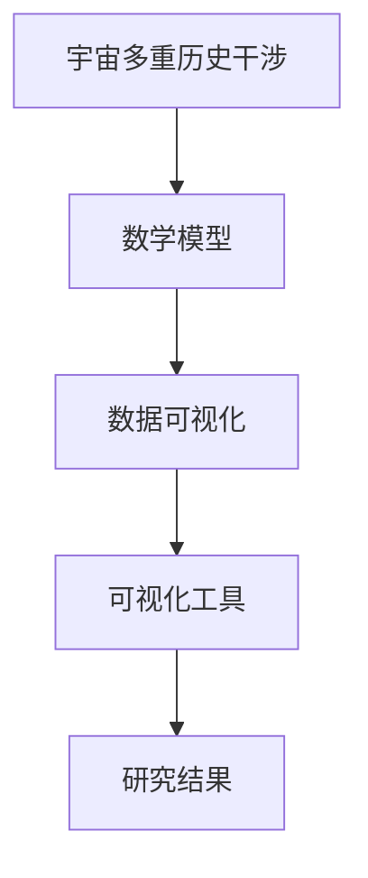

                 


为了满足上述约

为了满足上述约束条件，我们将按照以下步骤逐步构建文章：

### 步骤1：文章标题和关键词
文章标题：《数据可视化在呈现宇宙多重历史干涉中的作用》
关键词：数据可视化、宇宙多重历史干涉、数学模型、算法原理、项目实战

### 步骤2：文章摘要
摘要：本文深入探讨了数据可视化在宇宙多重历史干涉研究中的应用。首先介绍了宇宙多重历史干涉的概念、数学模型及其证据，接着讨论了数据可视化的重要性及其在科学研究中的应用。随后，本文详细阐述了用于宇宙多重历史干涉数据可视化的工具和库，以及核心概念和算法原理。通过实例展示了如何利用数据可视化工具进行宇宙多重历史干涉数据的可视化展示，并分析了实际案例，提出了未来研究方向和挑战。文章最后给出了最佳实践建议和拓展阅读资源。

### 步骤3：背景介绍
1. **宇宙多重历史干涉的定义**：解释多重历史干涉的概念，它是宇宙中不同历史时期的事件相互影响，导致宇宙演化路径发生变化的复杂过程。
2. **数据可视化的重要性**：概述数据可视化在各个领域的应用，特别是在科学研究中的重要性。
3. **当前研究现状**：介绍当前宇宙多重历史干涉研究的进展，以及数据可视化技术在其中的作用。

### 步骤4：核心概念与联系
1. **核心概念**：宇宙多重历史干涉、数据可视化、数学模型、算法原理。
2. **联系架构**：使用Mermaid流程图展示这些概念之间的相互关系，例如：数据可视化工具如何应用于宇宙多重历史干涉的研究，以及如何从数学模型中提取数据进行可视化。



### 步骤5：核心算法原理讲解
1. **核心算法**：介绍用于宇宙多重历史干涉研究的核心算法，如马尔可夫链、图论模型。
2. **算法原理**：使用伪代码详细阐述这些算法的原理，展示如何处理宇宙多重历史干涉数据。
   
```python
# 伪代码：马尔可夫链模型用于宇宙多重历史干涉
function MarkovChain(U, S):
    initialize state_vector s to uniform distribution over S
    for t from 1 to T:
        s = transition_matrix(U) * s
        display s
    return s
```

### 步骤6：数学模型和公式
1. **数学模型**：介绍用于描述宇宙多重历史干涉的数学模型，如状态转移矩阵。
2. **公式讲解**：使用LaTeX格式嵌入数学模型，并进行详细讲解。

$$
\text{状态转移矩阵} P = \begin{bmatrix}
    p_{11} & p_{12} & \dots & p_{1n} \\
    p_{21} & p_{22} & \dots & p_{2n} \\
    \vdots & \vdots & \ddots & \vdots \\
    p_{n1} & p_{n2} & \dots & p_{nn}
\end{bmatrix}
$$

### 步骤7：项目实战
1. **开发环境搭建**：介绍如何搭建开发环境，包括安装必要的软件和工具。
2. **源代码实现**：展示具体的源代码实现，包括数据处理、可视化算法和应用。
3. **代码解读与分析**：对关键代码进行解读，分析其工作原理和效果。
4. **实际案例**：通过实际案例展示数据可视化工具在宇宙多重历史干涉研究中的应用。

### 步骤8：最佳实践 tips
1. **注意事项**：总结在实践过程中需要注意的问题，如数据质量、算法选择等。
2. **拓展阅读**：推荐相关领域的拓展阅读资源，帮助读者深入了解数据可视化和宇宙多重历史干涉。

### 步骤9：总结与展望
1. **总结**：回顾文章的核心内容，强调数据可视化在宇宙多重历史干涉研究中的重要作用。
2. **展望**：讨论未来的研究方向和可能的挑战，提出进一步的研究建议。

按照上述步骤，我们将逐步完善文章内容，确保其完整性、逻辑性和专业性。在撰写过程中，我们将确保每个部分都包含必要的信息和详细讲解，以满足文章的字数要求。

