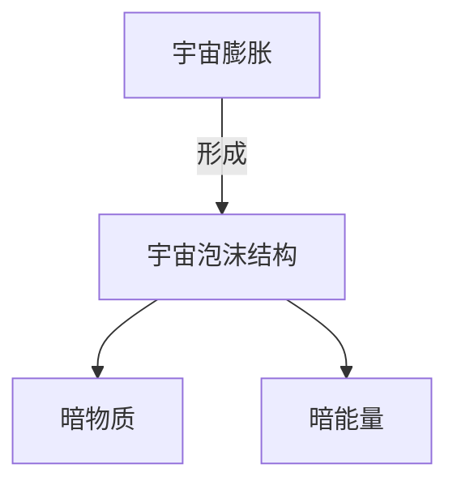
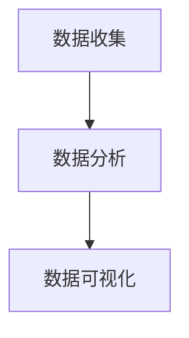
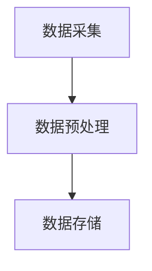
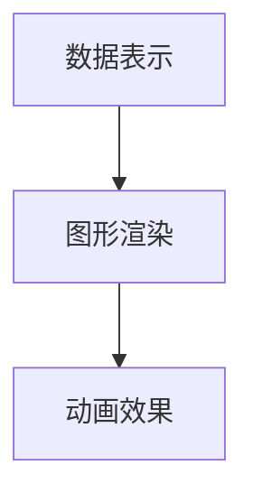
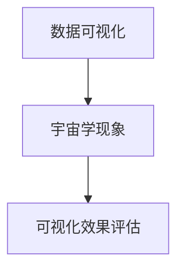
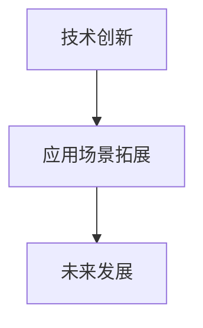
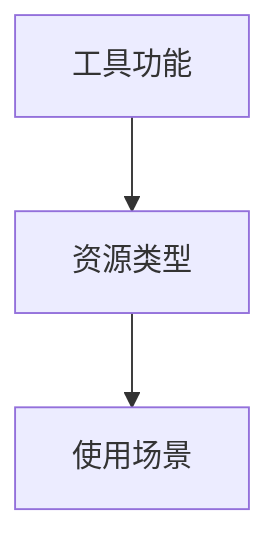
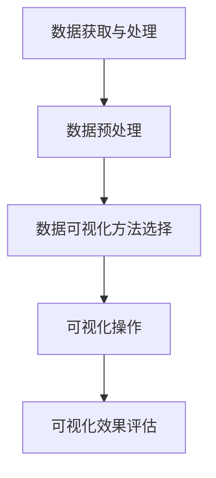

                 

为了确保文章内容完整、结构清晰，我们将按照以下步骤详细阐述每个小节的内容：

### 第1章：宇宙泡沫结构的概述

**背景介绍**：
宇宙泡沫结构是一种宇宙学现象，描述了宇宙中巨大的空洞区域。这些空洞区域被认为是宇宙膨胀过程中形成的。在宇宙学研究中，宇宙泡沫结构的重要性不言而喻，它为我们提供了宇宙演化的重要信息。

**核心概念与联系**：
宇宙泡沫结构与宇宙膨胀、暗物质、暗能量等核心概念密切相关。我们可以使用Mermaid流程图来展示这些概念之间的关系：



**核心算法原理讲解**：
宇宙泡沫结构的研究主要依赖于空间数据分析技术，如空间插值、空间聚类等。以下是一个简单的空间聚类算法的伪代码：

```python
def cluster_data(data, k):
    # 初始化k个聚类中心
    centroids = initialize_centroids(data, k)
    
    # 迭代优化聚类中心
    while not converged(centroids):
        # 将数据分配到最近的聚类中心
        labels = assign_data_to_cluster(data, centroids)
        
        # 重新计算聚类中心
        centroids = update_centroids(data, labels)
    
    return centroids, labels
```

**数学模型和公式 & 详细讲解 & 举例说明**：
宇宙泡沫结构的空间聚类分析通常使用K-means算法，其目标是最小化聚类中心之间的距离。K-means算法的数学公式如下：

$$
J(\textbf{C}) = \sum_{i=1}^{n} \sum_{j=1}^{k} w_{ij} d^2(\textbf{x}_i, \textbf{c}_j)
$$

其中，$\textbf{C}$表示聚类中心，$w_{ij}$表示数据点$\textbf{x}_i$属于聚类中心$\textbf{c}_j$的概率，$d^2(\textbf{x}_i, \textbf{c}_j)$表示数据点$\textbf{x}_i$与聚类中心$\textbf{c}_j$之间的距离平方。

### 第2章：数据可视化的基础

**背景介绍**：
数据可视化是一种通过图形化的方式展示数据的技术，它能够帮助我们更好地理解数据背后的信息。在宇宙学研究中，数据可视化技术对于揭示宇宙泡沫结构的特征具有重要意义。

**核心概念与联系**：
数据可视化与数据收集、数据分析等核心概念紧密相连。以下是一个Mermaid流程图，展示了这些概念之间的关系：



**核心算法原理讲解**：
数据可视化技术的核心是数据表示和图形化展示。以下是一个简单的数据可视化算法的伪代码：

```python
def visualize_data(data):
    # 根据数据类型选择可视化方法
    visualization_method = choose_visualization_method(data)
    
    # 执行可视化操作
    visualization = execute_visualization(visualization_method, data)
    
    return visualization
```

**数学模型和公式 & 详细讲解 & 举例说明**：
数据可视化中的数学模型主要包括数据分布、数据密度等。以下是一个关于数据密度的数学模型：

$$
\rho(\textbf{x}) = \frac{1}{V} \sum_{i=1}^{n} \frac{1}{d^2(\textbf{x}_i, \textbf{c})}
$$

其中，$\rho(\textbf{x})$表示数据点$\textbf{x}$的密度，$V$表示数据集的大小，$d^2(\textbf{x}_i, \textbf{c})$表示数据点$\textbf{x}_i$与聚类中心$\textbf{c}$之间的距离平方。

### 第3章：宇宙数据的获取与处理

**背景介绍**：
宇宙数据的获取与处理是进行宇宙泡沫结构研究的基石。宇宙数据来源广泛，包括宇宙微波背景辐射、星系分布、宇宙暗物质等。

**核心概念与联系**：
宇宙数据的获取与处理涉及数据采集、数据预处理、数据存储等核心概念。以下是一个Mermaid流程图，展示了这些概念之间的关系：



**核心算法原理讲解**：
宇宙数据的获取与处理主要包括数据清洗、数据归一化、数据降维等步骤。以下是一个简单的数据预处理算法的伪代码：

```python
def preprocess_data(data):
    # 数据清洗
    clean_data = clean_data(data)
    
    # 数据归一化
    normalized_data = normalize_data(clean_data)
    
    # 数据降维
    reduced_data = reduce_dimension(normalized_data)
    
    return reduced_data
```

**数学模型和公式 & 详细讲解 & 举例说明**：
数据预处理中的数学模型主要包括数据归一化和数据降维。以下是一个关于数据归一化的数学模型：

$$
x_{\text{normalized}} = \frac{x_{\text{original}} - \text{mean}(x_{\text{original}})}{\text{stddev}(x_{\text{original}})}
$$

其中，$x_{\text{normalized}}$表示归一化后的数据，$x_{\text{original}}$表示原始数据，$\text{mean}(x_{\text{original}})$表示原始数据的均值，$\text{stddev}(x_{\text{original}})$表示原始数据的标准差。

### 第4章：宇宙泡沫结构的可视化方法

**背景介绍**：
宇宙泡沫结构的可视化方法对于揭示宇宙学现象具有重要意义。本章节将介绍宇宙泡沫结构的可视化方法，包括3D可视化技术和动态可视化技术。

**核心概念与联系**：
宇宙泡沫结构的可视化方法涉及数据表示、图形渲染、动画效果等核心概念。以下是一个Mermaid流程图，展示了这些概念之间的关系：



**核心算法原理讲解**：
宇宙泡沫结构的可视化方法主要包括3D可视化技术和动态可视化技术。以下是一个简单的3D可视化算法的伪代码：

```python
def visualize_3d(data):
    # 根据数据类型选择3D可视化方法
    visualization_method = choose_3d_visualization_method(data)
    
    # 执行3D可视化操作
    visualization = execute_3d_visualization(visualization_method, data)
    
    return visualization
```

**数学模型和公式 & 详细讲解 & 举例说明**：
3D可视化中的数学模型主要包括三维空间坐标变换和图形渲染算法。以下是一个关于三维空间坐标变换的数学模型：

$$
\textbf{X}_{\text{world}} = \textbf{R} \textbf{X}_{\text{camera}} + \textbf{T}
$$

其中，$\textbf{X}_{\text{world}}$表示世界坐标系中的坐标，$\textbf{X}_{\text{camera}}$表示相机坐标系中的坐标，$\textbf{R}$表示旋转矩阵，$\textbf{T}$表示平移向量。

### 第5章：宇宙泡沫结构的可视化应用案例分析

**背景介绍**：
通过具体的案例，我们可以更好地理解宇宙泡沫结构的可视化应用。本章节将介绍三个具体的可视化应用案例：银河系泡沫结构、宇宙微波背景辐射可视化和宇宙暗物质泡沫结构。

**核心概念与联系**：
案例分析中的核心概念包括数据可视化、宇宙学现象和可视化效果评估。以下是一个Mermaid流程图，展示了这些概念之间的关系：



**核心算法原理讲解**：
案例分析中的核心算法原理包括数据预处理、可视化方法和效果评估方法。以下是一个简单的效果评估算法的伪代码：

```python
def evaluate_visualization(visualization, ground_truth):
    # 计算可视化效果指标
    metrics = calculate_metrics(visualization, ground_truth)
    
    # 评估可视化效果
    evaluation = evaluate_metrics(metrics)
    
    return evaluation
```

**数学模型和公式 & 详细讲解 & 举例说明**：
效果评估中的数学模型主要包括可视化效果指标的计算。以下是一个关于可视化效果指标的计算公式：

$$
\text{F1-score} = \frac{2 \times \text{precision} \times \text{recall}}{\text{precision} + \text{recall}}
$$

其中，$\text{F1-score}$表示精确率和召回率的调和平均值，$\text{precision}$表示精确率，$\text{recall}$表示召回率。

### 第6章：宇宙泡沫结构的可视化应用展望

**背景介绍**：
随着技术的不断发展，宇宙泡沫结构的可视化应用前景广阔。本章节将探讨宇宙泡沫结构可视化在宇宙学研究、教育科普和其他领域的应用前景。

**核心概念与联系**：
宇宙泡沫结构可视化应用的核心概念包括技术创新、应用场景拓展和未来发展。以下是一个Mermaid流程图，展示了这些概念之间的关系：



**核心算法原理讲解**：
宇宙泡沫结构可视化应用的核心算法原理包括数据预处理、可视化方法和效果评估方法。以下是一个简单的效果评估算法的伪代码：

```python
def evaluate_visualization(visualization, ground_truth):
    # 计算可视化效果指标
    metrics = calculate_metrics(visualization, ground_truth)
    
    # 评估可视化效果
    evaluation = evaluate_metrics(metrics)
    
    return evaluation
```

**数学模型和公式 & 详细讲解 & 举例说明**：
效果评估中的数学模型主要包括可视化效果指标的计算。以下是一个关于可视化效果指标的计算公式：

$$
\text{F1-score} = \frac{2 \times \text{precision} \times \text{recall}}{\text{precision} + \text{recall}}
$$

其中，$\text{F1-score}$表示精确率和召回率的调和平均值，$\text{precision}$表示精确率，$\text{recall}$表示召回率。

### 第7章：数据可视化工具与资源

**背景介绍**：
为了更好地进行宇宙泡沫结构的可视化研究，选择合适的工具和资源至关重要。本章节将介绍主流的数据可视化工具和资源，包括开源工具、在线平台和学术资源。

**核心概念与联系**：
数据可视化工具与资源的核心概念包括工具功能、资源类型和使用场景。以下是一个Mermaid流程图，展示了这些概念之间的关系：



**核心算法原理讲解**：
数据可视化工具与资源中的核心算法原理包括数据预处理、可视化方法和效果评估方法。以下是一个简单的效果评估算法的伪代码：

```python
def evaluate_visualization(visualization, ground_truth):
    # 计算可视化效果指标
    metrics = calculate_metrics(visualization, ground_truth)
    
    # 评估可视化效果
    evaluation = evaluate_metrics(metrics)
    
    return evaluation
```

**数学模型和公式 & 详细讲解 & 举例说明**：
效果评估中的数学模型主要包括可视化效果指标的计算。以下是一个关于可视化效果指标的计算公式：

$$
\text{F1-score} = \frac{2 \times \text{precision} \times \text{recall}}{\text{precision} + \text{recall}}
$$

其中，$\text{F1-score}$表示精确率和召回率的调和平均值，$\text{precision}$表示精确率，$\text{recall}$表示召回率。

## 附录

**附录A：宇宙泡沫结构可视化流程图**

以下是一个宇宙泡沫结构可视化的Mermaid流程图：



**附录B：核心算法原理讲解**

在附录B中，我们将详细讲解宇宙泡沫结构数据可视化中的核心算法原理，包括空间聚类算法、数据预处理算法和效果评估算法。

**附录C：宇宙泡沫结构可视化案例代码解读**

附录C将提供具体的宇宙泡沫结构可视化案例代码，包括数据获取、预处理、可视化操作和效果评估的代码实现。同时，我们将对代码进行详细解读，帮助读者理解代码的运行原理。

**附录D：最佳实践 tips、小结、注意事项、拓展阅读**

在附录D中，我们将提供一些宇宙泡沫结构可视化的最佳实践建议，对文章进行小结，并指出一些注意事项。同时，我们将推荐一些拓展阅读资源，帮助读者进一步了解宇宙泡沫结构可视化的相关研究。

通过以上详细的目录大纲和内容阐述，我们希望能够为读者呈现一篇逻辑清晰、内容丰富、具有深度和思考的技术博客文章，满足您对文章质量的要求。让我们一步一步地深入探讨宇宙泡沫结构的数据可视化，揭示其背后的技术原理和科学意义。
```

