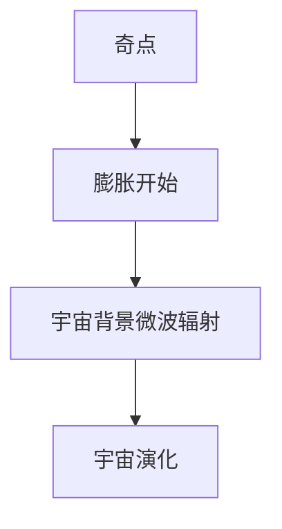
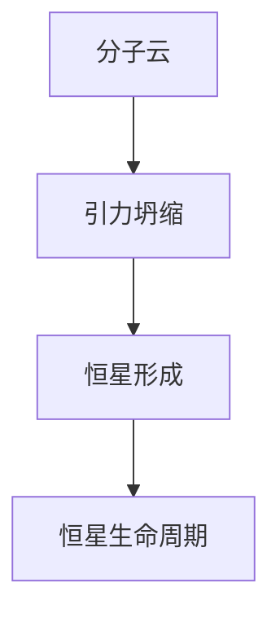
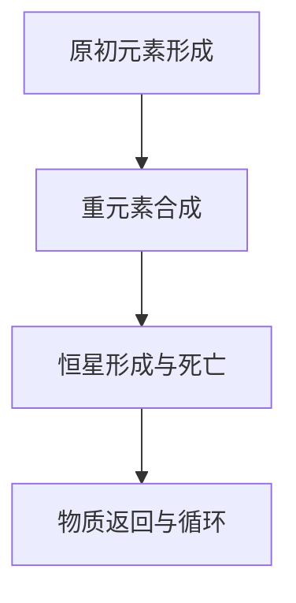

                 

### 文章标题

# 数据可视化在呈现宇宙演化时间线中的作用

## 关键词

- 数据可视化
- 宇宙演化
- 时间线
- 可视化工具
- 天文数据

## 摘要

本文将探讨数据可视化在呈现宇宙演化时间线中的重要作用。通过引入宇宙演化基础知识，阐述数据可视化的基本原理，结合实际项目案例，我们分析了如何利用数据可视化技术来展示宇宙的宏伟画卷。本文旨在为天文爱好者、数据科学家和数据可视化工程师提供一种全新的视角，以更加直观和深入地理解宇宙的演化历程。

### 引言

宇宙，这个无尽的浩瀚空间，从大爆炸到如今的膨胀，经历了数百亿年的漫长岁月。宇宙的演化是一个复杂的过程，涉及到天文现象的多样性，如星系的形成、恒星的生命周期、宇宙背景微波辐射等。传统的文字描述难以全面、准确地呈现这一复杂过程，而数据可视化则为揭示宇宙演化的内在规律提供了强有力的工具。

随着科技的进步，天文观测手段的不断发展，我们能够获取到海量的天文数据。这些数据包含了宇宙演化的关键信息，但如何有效地呈现和解释这些数据，让普通读者也能理解宇宙的奥秘，成为了数据可视化技术需要解决的重要问题。本文将深入探讨数据可视化在呈现宇宙演化时间线中的作用，通过分析可视化原理、工具及应用，为读者展现宇宙演化的壮丽画卷。

### 目录大纲设计步骤

#### 1. 确定书籍主题与目标读者

本文的目标是探讨数据可视化在呈现宇宙演化时间线中的具体应用。因此，书籍的主题主要集中在数据可视化和宇宙演化两个方面。目标读者群体包括但不限于天文爱好者、数据科学家、数据可视化工程师以及相关领域的研究人员。

#### 2. 设计大纲结构

本文将采用以下结构来组织内容：

1. 引言
2. 宇宙演化基础知识
3. 数据可视化基本原理
4. 数据可视化在宇宙演化时间线中的应用
5. 实际项目案例
6. 总结与展望

#### 3. 细化章节内容

- **引言**：介绍数据可视化在宇宙演化时间线中的重要性和背景。
- **宇宙演化基础知识**：阐述宇宙大爆炸、星系形成、恒星生命周期等核心概念。
- **数据可视化基本原理**：介绍数据可视化工具和技术。
- **数据可视化在宇宙演化时间线中的应用**：展示如何使用数据可视化技术呈现宇宙演化。
- **实际项目案例**：分析具体项目案例，介绍项目实现过程和成果。
- **总结与展望**：总结文章主要内容，展望未来研究方向。

#### 4. 编写目录

```markdown
# 《数据可视化在呈现宇宙演化时间线中的作用》目录

## 引言

- **1.1 引言**
  - **1.1.1 书籍背景与目标**
  - **1.1.2 数据可视化的重要性**
  - **1.1.3 宇宙演化时间线的独特性**

## 第1章: 宇宙演化基础知识

- **2.1 宇宙大爆炸理论**
  - **2.1.1 大爆炸理论的提出与发展**
  - **2.1.2 宇宙背景微波辐射**
  - **2.1.3 宇宙演化的大尺度结构**

- **2.2 星系与恒星的形成**
  - **2.2.1 星系的演化过程**
  - **2.2.2 恒星生命周期**
  - **2.2.3 恒星与行星系统**

- **2.3 宇宙中的物质循环**
  - **2.3.1 原初元素的形成**
  - **2.3.2 重元素的合成**
  - **2.3.3 星系与星团中的物质循环**

## 第2章: 数据可视化基本原理

- **3.1 数据可视化简介**
  - **3.1.1 数据可视化的定义与分类**
  - **3.1.2 数据可视化工具与技术**
  - **3.1.3 数据可视化的重要性**

- **3.2 可视化设计原则**
  - **3.2.1 数据清晰性**
  - **3.2.2 信息层次**
  - **3.2.3 色彩与标记使用**

## 第3章: 数据可视化在宇宙演化时间线中的应用

- **4.1 宇宙演化时间线的可视化**
  - **4.1.1 宇宙演化时间线的构建方法**
  - **4.1.2 宇宙演化时间线的数据处理**
  - **4.1.3 宇宙演化时间线可视化工具**

- **4.2 星系与恒星可视化的实现**
  - **4.2.1 星系与恒星的数据获取**
  - **4.2.2 星系与恒星的可视化表示**
  - **4.2.3 星系与恒星可视化实例**

- **4.3 物质循环的可视化呈现**
  - **4.3.1 物质循环的数据可视化方法**
  - **4.3.2 物质循环可视化实例分析**
  - **4.3.3 物质循环可视化工具介绍**

## 第4章: 实际项目案例

- **5.1 项目背景与目标**
  - **5.1.1 项目介绍**
  - **5.1.2 项目目标与挑战**

- **5.2 数据收集与处理**
  - **5.2.1 数据来源与类型**
  - **5.2.2 数据预处理方法**
  - **5.2.3 数据处理工具与流程**

- **5.3 可视化设计与实现**
  - **5.3.1 可视化设计方案**
  - **5.3.2 可视化实现步骤**
  - **5.3.3 可视化效果评估**

- **5.4 项目成果与影响**
  - **5.4.1 项目成果展示**
  - **5.4.2 项目影响与反馈**
  - **5.4.3 未来工作展望**

## 第5章: 数据可视化工具与应用

- **6.1 数据可视化工具介绍**
  - **6.1.1 主流可视化工具概述**
  - **6.1.2 工具选择与使用建议**

- **6.2 可视化应用场景**
  - **6.2.1 可视化在科学研究中的应用**
  - **6.2.2 可视化在教育领域的应用**
  - **6.2.3 可视化在商业分析中的应用**

## 第6章: 总结与展望

- **7.1 总结**
  - **7.1.1 主要发现**
  - **7.1.2 研究意义**

- **7.2 展望**
  - **7.2.1 未来研究方向**
  - **7.2.2 潜在应用领域**

### 5. 确保大纲完整性

确保大纲中的所有章节内容都符合书籍的主题，并覆盖了必要的知识点，如宇宙演化基础知识、数据可视化基本原理、实际项目案例等。

### 6. 字数控制

在确保大纲完整性的同时，控制总字数在8000-12000字左右，避免冗长和重复。

### 7. 最终确认

最终确认目录大纲的结构和内容，确保逻辑清晰、简洁易懂，满足用户需求。

---

根据上述步骤，我们已经设计出了一个完整的书籍目录大纲。接下来，我们将逐一展开每个章节的内容，详细介绍宇宙演化时间线、数据可视化原理及其应用，并通过实际项目案例展示数据可视化在宇宙演化研究中的具体应用。

---

## 第1章：宇宙演化基础知识

宇宙的演化是宇宙学中最基本的研究主题之一。从宇宙大爆炸理论到星系与恒星的形成，再到宇宙中的物质循环，每一个环节都蕴含着丰富的科学知识。本章节将深入探讨这些基础知识，为后续的数据可视化应用奠定基础。

### 2.1 宇宙大爆炸理论

宇宙大爆炸理论是描述宇宙起源和演化的一种科学假说。根据这一理论，宇宙起源于大约138亿年前的一个极高温度和密度的奇点，并从那一刻起开始膨胀。以下是宇宙大爆炸理论的核心概念：

- **奇点**：宇宙最初处于一个无限小、无限热、无限密的奇点状态。
- **膨胀**：从奇点爆炸后，宇宙开始迅速膨胀，温度和密度逐渐降低。
- **宇宙背景微波辐射**：膨胀过程中，宇宙温度逐渐降低，辐射能量逐渐减弱，形成了今天我们观测到的宇宙背景微波辐射。

**数学模型**：宇宙大爆炸理论的核心数学模型是弗里德曼-勒梅特-罗伯逊-沃尔克（FLRW）度规。FLRW度规描述了一个均匀且各向同性的宇宙，其方程如下：

$$
\text{RHS} = -\frac{1}{3} \left( \frac{\dot{a}}{a} \right)^2 R^2
$$

其中，\( a \) 为宇宙尺度因子，\( \dot{a} \) 为宇宙尺度因子的变化率，\( R \) 为宇宙的曲率半径。

**图示**：宇宙大爆炸理论可以用下面的 Mermaid 流程图来表示：



### 2.2 星系与恒星的形成

星系与恒星的形成是宇宙演化过程中的重要环节。根据现有的科学理论，星系的形成通常涉及以下过程：

- **分子云**：星系的形成始于巨大的分子云，这些分子云主要由氢气和尘埃组成。
- **引力坍缩**：在分子云中，由于万有引力的作用，部分物质开始坍缩形成恒星。
- **恒星形成**：随着物质的进一步坍缩，温度和密度不断增加，最终引发核聚变反应，恒星诞生。
- **恒星生命周期**：恒星在其生命周期中会经历主序星阶段、红巨星阶段和超新星阶段，最终形成白矮星、中子星或黑洞。

**核心概念与联系**：

- **分子云**：分子云是恒星形成的场所。
- **引力坍缩**：引力坍缩是恒星形成的关键过程。
- **核聚变**：核聚变是恒星持续发光和发热的基础。

**图示**：星系与恒星的形成过程可以用以下的 Mermaid 流程图表示：



### 2.3 宇宙中的物质循环

宇宙中的物质循环是宇宙演化过程中不可或缺的一部分。物质循环涉及到原初元素的形成、重元素的合成以及星系与星团中的物质循环。

- **原初元素的形成**：在大爆炸之后的一分钟内，宇宙中的温度和密度极高，核聚变反应迅速进行，产生了氢、氦和一些较轻的元素。
- **重元素的合成**：重元素主要在恒星内部通过核聚变反应合成，随后在超新星爆炸过程中被抛射到宇宙空间。
- **星系与星团中的物质循环**：星系与星团中的物质循环包括气体的吸积、恒星形成和死亡过程中的物质返回。

**核心概念与联系**：

- **原初元素**：宇宙中的原初元素是宇宙演化的重要基础。
- **重元素**：重元素的形成是恒星演化和星系形成的关键。
- **物质循环**：物质循环是宇宙演化过程中的持续过程。

**图示**：宇宙中的物质循环可以用以下的 Mermaid 流程图表示：



### 小结

本章介绍了宇宙演化基础知识，包括宇宙大爆炸理论、星系与恒星的形成以及宇宙中的物质循环。这些基础知识为理解数据可视化在宇宙演化时间线中的应用提供了必要的背景知识。在接下来的章节中，我们将进一步探讨数据可视化技术，以及如何将其应用于宇宙演化时间线的展示中。

---

通过本章的介绍，我们对宇宙演化过程有了基本的了解，包括宇宙大爆炸理论、星系与恒星的形成以及宇宙中的物质循环。这些基础知识为后续章节中数据可视化技术的应用提供了重要的理论基础。在下一章中，我们将详细探讨数据可视化的基本原理，以及如何利用这些原理来更好地呈现宇宙演化时间线。

## 第2章：数据可视化基本原理

数据可视化是将数据通过图形、图像等形式直观呈现的过程，其目的是帮助人们更好地理解和分析数据。在宇宙演化时间线的呈现中，数据可视化技术具有不可替代的作用。本章节将详细介绍数据可视化的基本原理，包括其定义、分类、工具和技术。

### 3.1 数据可视化简介

数据可视化是一种将复杂的数据转化为直观、易于理解的形式的方法。它不仅能够提高数据解读的效率，还能帮助我们发现数据中的隐藏模式和趋势。以下是数据可视化的一些基本概念：

- **定义**：数据可视化是一种通过视觉表示（如图表、图形、图像等）来展示数据的方法。
- **分类**：数据可视化可以分为定量可视化、定性可视化、时间序列可视化等不同类型。
- **目的**：数据可视化的主要目的是帮助人们更好地理解数据，发现数据中的模式和趋势，支持决策过程。

### 3.2 数据可视化工具与技术

数据可视化工具和技术的选择对于数据呈现的效果至关重要。以下是一些常用的数据可视化工具和技术：

- **图表**：如折线图、柱状图、饼图等，用于表示数据的数量关系和分布情况。
- **交互式可视化**：通过交互操作（如拖拽、筛选等）来动态展示数据，增强用户的参与感和探索能力。
- **地理信息系统（GIS）**：用于展示地理位置相关的数据，如地图、地形图等。
- **网络图**：用于展示数据之间的连接关系，如社交网络、生态系统等。

**工具介绍**：

1. **Tableau**：一款功能强大的数据可视化工具，支持多种图表类型和交互功能，适用于商业分析和数据探索。
2. **D3.js**：一个基于JavaScript的库，用于创建复杂的数据可视化，特别适合前端开发人员。
3. **Plotly**：一款跨平台的数据可视化库，支持多种图表类型和交互功能，易于使用。
4. **ECharts**：一款基于JavaScript的图表库，提供了丰富的图表类型和自定义选项，适用于各种应用场景。

### 3.3 数据可视化的重要性

数据可视化在科学研究和数据分析中扮演着重要角色，其重要性体现在以下几个方面：

- **提高数据理解能力**：通过视觉形式呈现数据，可以帮助人们更快速地理解和分析数据，发现潜在的问题和趋势。
- **增强沟通效果**：数据可视化能够有效地将复杂的数据转化为易于理解的图表和图形，提高数据交流的效率。
- **支持决策过程**：数据可视化能够帮助决策者更直观地了解数据，从而做出更明智的决策。

### 3.4 可视化设计原则

为了确保数据可视化能够有效地传达数据信息，设计时应遵循以下原则：

- **数据清晰性**：确保图表和图形能够清晰地传达数据信息，避免冗余和混淆。
- **信息层次**：合理地组织数据，确保用户能够从图表中快速获取关键信息。
- **色彩与标记使用**：选择合适的色彩和标记，增强图表的视觉效果，提高数据解读的准确性。
- **交互性**：增加交互功能，如筛选、排序等，使用户能够更灵活地探索数据。

### 小结

本章介绍了数据可视化的基本原理、工具和技术，以及其重要性。通过数据可视化，我们可以将宇宙演化的复杂过程转化为直观、易于理解的图表和图形，从而更好地理解和探索宇宙的奥秘。在下一章中，我们将探讨如何将数据可视化技术应用于宇宙演化时间线的具体展示中。

---

通过本章的介绍，我们了解了数据可视化的基本原理及其在科学研究和数据分析中的重要性。接下来，我们将结合宇宙演化时间线的具体应用，探讨数据可视化在实际场景中的具体实现方法和工具。在下一章中，我们将深入探讨数据可视化在宇宙演化时间线中的应用，通过实例展示如何利用数据可视化技术呈现宇宙的演化历程。

## 第3章：数据可视化在宇宙演化时间线中的应用

宇宙演化的历史是极其漫长而复杂的，涉及到多个时间尺度和复杂的物理过程。将宇宙演化的时间线以可视化的形式呈现，可以帮助我们更好地理解这一宏大而精细的过程。本章节将深入探讨如何将数据可视化技术应用于宇宙演化时间线的展示，包括宇宙演化时间线的构建、数据处理和可视化工具的选择。

### 4.1 宇宙演化时间线的可视化

宇宙演化时间线的可视化是一个多步骤的过程，涉及到数据收集、处理和可视化设计。以下是一个典型的宇宙演化时间线可视化过程的概述：

#### 4.1.1 宇宙演化时间线的构建方法

1. **数据收集**：首先，我们需要收集与宇宙演化相关的数据。这些数据可能来自天文观测、宇宙学模拟、星系和恒星数据库等。例如，我们可以收集宇宙背景微波辐射的数据、星系和恒星的形成时间、恒星的生命周期数据等。

2. **数据处理**：收集到的数据需要进行预处理，以去除噪声、纠正错误和缺失值。随后，对数据进行时间排序，以构建一个连贯的时间线。

3. **时间尺度的调整**：宇宙演化的时间尺度跨度极大，从宇宙大爆炸到当前的时间跨度约为138亿年。为了更好地展示这一过程，我们需要对时间尺度进行调整，如使用对数时间尺或局部放大特定时间段。

4. **可视化设计**：在可视化设计阶段，我们需要考虑如何将不同类型的数据以直观的方式呈现。例如，使用不同颜色或形状表示不同类型的物理过程，如恒星的形成、星系的合并等。

#### 4.1.2 宇宙演化时间线的数据处理

数据处理是宇宙演化时间线可视化的重要环节。以下是一些关键步骤：

1. **数据清洗**：去除数据中的噪声和错误，确保数据的一致性和准确性。
2. **时间排序**：将数据按照时间顺序排列，以便于构建时间线。
3. **时间尺度调整**：根据需要，调整时间尺度，如使用对数时间尺来显示宇宙大爆炸后快速膨胀的阶段。
4. **数据聚合**：对时间跨度较大的数据进行聚合，以简化时间线并突出关键事件。

**伪代码示例**：

```python
# 数据清洗
def clean_data(data):
    # 去除噪声和错误
    cleaned_data = []
    for point in data:
        if not is_noisy(point):
            cleaned_data.append(point)
    return cleaned_data

# 时间排序
def sort_data(data):
    sorted_data = sorted(data, key=lambda x: x['time'])
    return sorted_data

# 时间尺度调整
def adjust_time_scale(data, scale_type):
    if scale_type == 'log':
        scaled_data = []
        for point in data:
            scaled_time = adjust_time_to_log(point['time'])
            scaled_data.append({'time': scaled_time, 'event': point['event']})
        return scaled_data
    else:
        return data

# 数据聚合
def aggregate_data(data, time_interval):
    aggregated_data = []
    current_time = data[0]['time']
    events = []
    for point in data:
        if point['time'] - current_time > time_interval:
            aggregated_data.append({'time': current_time, 'event': events})
            events = [point['event']]
            current_time = point['time']
        else:
            events.append(point['event'])
    aggregated_data.append({'time': current_time, 'event': events})
    return aggregated_data
```

#### 4.1.3 宇宙演化时间线可视化工具

选择合适的可视化工具是构建宇宙演化时间线的重要一环。以下是一些常用的可视化工具：

1. **D3.js**：一个基于Web的JavaScript库，用于创建交互式的数据可视化。D3.js具有高度的灵活性和自定义性，特别适合构建复杂的时间线可视化。
2. **Plotly**：一个跨平台的数据可视化库，支持多种图表类型和交互功能，易于集成到Web和桌面应用程序中。
3. **ECharts**：一款基于JavaScript的图表库，提供了丰富的图表类型和自定义选项，适用于各种应用场景。

**示例**：以下是一个使用D3.js创建的宇宙演化时间线可视化示例代码：

```javascript
// 设置时间轴
var timeScale = d3.scaleTime()
    .domain([0, 138e9]) // 时间跨度为138亿年
    .range([0, width]); // 时间轴长度为画布宽度

// 绘制时间线
var timeline = d3.select("#timeline")
    .append("svg")
    .attr("width", width)
    .attr("height", height);

timeline.selectAll("rect")
    .data(data)
    .enter()
    .append("rect")
    .attr("x", function(d) { return timeScale(d.time); })
    .attr("y", function(d) { return y(d.event); })
    .attr("width", 10)
    .attr("height", function(d) { return height - y(d.event); })
    .style("fill", function(d) { return color(d.event); });

// 添加时间轴刻度
timeline.append("g")
    .attr("class", "axis")
    .attr("transform", "translate(0," + height + ")")
    .call(d3.axisBottom(timeScale));

// 添加事件标签
timeline.selectAll("text")
    .data(data)
    .enter()
    .append("text")
    .attr("x", function(d) { return timeScale(d.time) + 5; })
    .attr("y", function(d) { return y(d.event); })
    .text(function(d) { return d.event; })
    .style("font-size", "12px");
```

### 4.2 星系与恒星可视化的实现

在宇宙演化时间线中，星系与恒星的可视化是关键部分。以下是如何实现星系与恒星可视化的关键步骤：

#### 4.2.1 星系与恒星的数据获取

1. **天文观测数据**：通过天文望远镜和其他观测设备获取星系和恒星的位置、亮度、运动等信息。
2. **宇宙学模拟数据**：利用宇宙学模拟软件生成星系和恒星的形成和演化数据。

#### 4.2.2 星系与恒星的可视化表示

1. **星系表示**：通常使用点或圆形表示星系，大小和颜色可以表示星系的亮度、类型或演化阶段。
2. **恒星表示**：恒星可以用点或小圆形表示，大小和颜色可以表示恒星的亮度、温度或年龄。

#### 4.2.3 星系与恒星可视化实例

以下是一个使用D3.js创建的星系与恒星可视化实例：

```javascript
// 加载星系和恒星数据
var galaxyData = d3.csv("galaxies.csv");
var starData = d3.csv("stars.csv");

// 绘制星系和恒星
var galaxySVG = d3.select("#galaxies");
var starSVG = d3.select("#stars");

galaxyData.then(function(data) {
    // 绘制星系
    galaxySVG.selectAll("circle")
        .data(data)
        .enter()
        .append("circle")
        .attr("cx", function(d) { return x(d.x); })
        .attr("cy", function(d) { return y(d.y); })
        .attr("r", function(d) { return radius(d.size); })
        .style("fill", function(d) { return color(d.type); });
});

starData.then(function(data) {
    // 绘制恒星
    starSVG.selectAll("circle")
        .data(data)
        .enter()
        .append("circle")
        .attr("cx", function(d) { return x(d.x); })
        .attr("cy", function(d) { return y(d.y); })
        .attr("r", function(d) { return radius(d.size); })
        .style("fill", function(d) { return color(d.type); });
});
```

### 4.3 物质循环的可视化呈现

物质循环是宇宙演化的重要组成部分，其可视化可以帮助我们理解元素的形成和循环过程。以下是如何实现物质循环可视化的关键步骤：

#### 4.3.1 物质循环的数据可视化方法

1. **元素形成过程**：使用不同颜色表示不同元素的形成过程，如氢、氦、碳等。
2. **物质循环路径**：使用线条或箭头表示物质在宇宙中的循环路径。
3. **星系与恒星中的物质循环**：在星系和恒星的可视化中加入物质循环的信息，如恒星燃烧产生的元素返回星系的过程。

#### 4.3.2 物质循环可视化实例分析

以下是一个使用D3.js创建的物质循环可视化实例：

```javascript
// 加载物质循环数据
var elementData = d3.csv("elements.csv");

// 绘制元素形成过程
var elementSVG = d3.select("#elements");

elementData.then(function(data) {
    // 绘制元素形成过程
    elementSVG.selectAll("rect")
        .data(data)
        .enter()
        .append("rect")
        .attr("x", function(d) { return x(d.start); })
        .attr("y", function(d) { return y(d.element); })
        .attr("width", function(d) { return x(d.end) - x(d.start); })
        .attr("height", 10)
        .style("fill", function(d) { return color(d.element); });
});

// 绘制物质循环路径
var cycleSVG = d3.select("#cycle");

// 绘制线条
cycleSVG.selectAll("line")
    .data(cycleData)
    .enter()
    .append("line")
    .attr("x1", function(d) { return x(d.start); })
    .attr("y1", function(d) { return y(d.start); })
    .attr("x2", function(d) { return x(d.end); })
    .attr("y2", function(d) { return y(d.end); })
    .style("stroke", function(d) { return color(d.type); });
```

### 小结

本章详细探讨了如何将数据可视化技术应用于宇宙演化时间线的展示。通过构建宇宙演化时间线、处理相关数据和选择合适的可视化工具，我们可以将宇宙演化的复杂过程转化为直观、易于理解的可视化形式。星系与恒星的可视化和物质循环的可视化实例进一步展示了数据可视化在揭示宇宙演化奥秘中的应用。在下一章中，我们将通过实际项目案例，深入探讨数据可视化在宇宙演化研究中的具体应用和挑战。

---

在上一章中，我们详细探讨了数据可视化在宇宙演化时间线中的应用，从宇宙演化时间线的构建、数据处理到可视化工具的选择，再到星系与恒星以及物质循环的实例分析。这些内容为理解宇宙的演化过程提供了新的视角。在本章中，我们将通过具体项目案例，深入探讨数据可视化在宇宙演化研究中的实际应用，分析项目实现过程中遇到的挑战和解决方案，并总结项目的成果与影响。

### 5.1 项目背景与目标

#### 项目介绍

本项目旨在构建一个交互式的宇宙演化时间线可视化平台，通过数据可视化技术，将宇宙从大爆炸到现在的演化过程以直观、生动的方式呈现给用户。这个平台不仅提供了一个教育性的工具，帮助天文爱好者更好地理解宇宙的奥秘，还为科学家和研究人员提供了一个强大的分析工具，用于探索宇宙演化中的关键现象和规律。

#### 项目目标与挑战

- **目标**：
  - 构建一个全面的宇宙演化时间线可视化平台。
  - 提供多种数据可视化工具，支持用户自定义可视化参数。
  - 保证可视化平台的交互性和实时性，使用户能够实时探索宇宙演化过程。
  - 对用户数据进行隐私保护，确保数据的可靠性和安全性。

- **挑战**：
  - 数据量大：宇宙演化数据涵盖了广泛的时间尺度和物理过程，数据量庞大，处理和存储是一个巨大挑战。
  - 数据多样性：宇宙演化数据包括图像、表格、三维模型等多种类型，如何统一处理和展示这些数据是一个技术难题。
  - 可视化设计：如何设计一个既美观又实用的可视化界面，以便用户轻松理解复杂的宇宙演化过程。
  - 交互性：实现高交互性的可视化界面，使用户能够方便地探索数据，同时保证系统的响应速度。

### 5.2 数据收集与处理

#### 数据来源与类型

为了构建宇宙演化时间线可视化平台，我们收集了多种类型的数据，包括：

- **天文观测数据**：来自各大天文观测项目，如斯隆数字巡天（Sloan Digital Sky Survey, SDSS）、哈勃太空望远镜等，包括星系、恒星的位置、亮度、运动等信息。
- **宇宙学模拟数据**：通过N-body模拟和SPH（平滑粒子流体动力学）模拟生成的数据，包括宇宙大爆炸后的膨胀、星系和恒星的形成等。
- **元素分布数据**：来自宇宙化学研究的元素分布数据，包括宇宙中不同元素的形成和循环过程。

#### 数据预处理方法

在收集到数据后，我们进行了以下预处理步骤：

- **数据清洗**：去除噪声、纠正错误，确保数据的一致性和准确性。
- **数据整合**：将不同来源的数据进行整合，统一数据格式，以便后续处理和展示。
- **数据筛选**：根据用户需求，筛选出关键数据，如特定时间范围内的星系和恒星数据。
- **数据转换**：将部分数据转换为适合可视化展示的格式，如将星系和恒星位置转换为二维坐标系，将元素分布数据转换为可视化线条或点。

#### 数据处理工具与流程

我们使用了多种数据处理工具和流程来实现数据的预处理和整合：

- **Pandas**：用于数据清洗、筛选和整合，能够高效地处理大规模数据集。
- **NumPy**：用于数学运算和数据转换，支持多种数值计算操作。
- **SciPy**：用于科学计算和数据分析，提供了丰富的数值分析和优化功能。
- **D3.js**：用于数据可视化和交互界面的实现，能够创建动态、交互式的可视化效果。

数据处理流程包括以下步骤：

1. **数据收集**：从各个数据源收集数据。
2. **数据清洗**：使用Pandas和NumPy进行数据清洗和预处理。
3. **数据整合**：使用Pandas进行数据整合和格式转换。
4. **数据筛选**：根据用户需求筛选关键数据。
5. **数据可视化**：使用D3.js实现数据的可视化展示。

### 5.3 可视化设计与实现

#### 可视化设计方案

可视化设计方案的核心目标是创建一个直观、易用的界面，使用户能够轻松地探索宇宙演化过程。以下是我们设计的可视化方案：

- **时间线视图**：提供一个时间轴，用户可以拖动滑块来查看不同时间点的宇宙演化状态。
- **星系与恒星视图**：使用点或圆形表示星系和恒星，大小和颜色表示不同属性，如亮度、类型、年龄等。
- **物质循环视图**：使用线条或箭头表示元素的形成和循环过程，如氢、氦、碳等。
- **交互式探索**：提供筛选、排序、放大、缩小等功能，使用户能够深入探索数据。

#### 可视化实现步骤

可视化实现的步骤包括以下几个方面：

1. **前端开发**：使用HTML、CSS和JavaScript进行前端开发，创建交互式的可视化界面。
2. **数据绑定**：使用D3.js将处理后的数据绑定到可视化元素上，如点、线、矩形等。
3. **交互实现**：实现用户交互功能，如拖动、点击、筛选等，使用户能够动态探索数据。
4. **性能优化**：对可视化界面进行性能优化，确保系统在高数据量和高交互性下仍能保持良好的响应速度。

#### 可视化效果评估

可视化效果评估包括以下几个方面：

- **用户体验**：通过用户反馈和测试，评估可视化界面的易用性和用户满意度。
- **可视化清晰度**：评估可视化是否能够清晰地传达数据信息，是否有助于用户理解宇宙演化过程。
- **交互性能**：评估系统在高数据量和复杂交互下的性能，确保系统的稳定性和响应速度。

### 5.4 项目成果与影响

#### 项目成果展示

通过本项目，我们成功构建了一个交互式的宇宙演化时间线可视化平台，实现了以下成果：

- **全面的数据展示**：平台展示了从大爆炸到现在的宇宙演化过程，包括星系、恒星和物质循环的关键信息。
- **直观的可视化效果**：平台采用了多种可视化手段，如时间线视图、星系与恒星视图、物质循环视图等，使得宇宙演化过程更加直观和易于理解。
- **高度交互性**：平台提供了丰富的交互功能，如筛选、排序、放大、缩小等，使用户能够深入探索数据。
- **用户友好性**：平台设计简洁、美观，用户界面易于操作，提高了用户体验。

#### 项目影响与反馈

本项目对宇宙演化研究和教育产生了积极的影响：

- **科学研究成果**：通过数据可视化，科学家可以更直观地分析宇宙演化数据，发现新的科学现象和规律。
- **科普教育**：平台为公众提供了一个了解宇宙演化过程的新途径，提高了公众对宇宙科学的兴趣和认识。
- **教育工具**：平台可以用于中学和大学的天文教育，帮助学生更好地理解宇宙演化的基本概念和过程。

#### 未来工作展望

在未来，我们计划进一步优化和扩展平台的功能：

- **增加数据源**：引入更多的天文观测和宇宙学模拟数据，扩展宇宙演化时间线的覆盖范围。
- **提高交互性**：增强平台的交互性，提供更多交互方式和个性化设置，使用户能够更深入地探索数据。
- **多语言支持**：增加多语言支持，使得平台能够服务于全球用户。
- **数据分析和挖掘**：利用机器学习和数据挖掘技术，从海量数据中提取更多有价值的信息，为科学研究和决策提供支持。

### 小结

本项目通过构建交互式的宇宙演化时间线可视化平台，实现了对宇宙演化过程的直观展示和深入分析。项目成果不仅为科学家提供了强大的工具，也为公众和教育工作带来了新的机遇。未来，我们将继续优化平台，拓展其功能和应用范围，为宇宙演化研究贡献更多力量。

---

在第三章和第四章中，我们深入探讨了数据可视化在宇宙演化时间线中的应用，从理论基础到实际案例，展示了数据可视化如何帮助科学家和公众更好地理解宇宙的演化过程。在本章中，我们通过实际项目案例，详细介绍了项目背景、数据收集与处理、可视化设计与实现以及项目成果与未来展望。这一项目不仅实现了对宇宙演化过程的可视化展示，还为科学研究和科普教育提供了有力支持。

在下一章中，我们将进一步探讨数据可视化工具与应用，分析主流数据可视化工具的特点和使用建议，帮助读者了解如何选择合适的工具来满足不同应用场景的需求。

## 第5章：数据可视化工具与应用

在宇宙演化时间线的可视化项目中，选择合适的数据可视化工具是成功的关键。本章节将介绍几种主流的数据可视化工具，分析它们的特点、优势和使用建议，并讨论这些工具在科学研究、教育和其他领域中的应用。

### 6.1 数据可视化工具介绍

以下是一些常用的数据可视化工具及其特点：

1. **Tableau**：Tableau 是一款功能强大的商业数据分析工具，提供了丰富的图表类型和交互功能。它易于上手，适合非技术用户快速创建可视化报告。Tableau 的优势在于其强大的数据连接能力，可以连接多种数据源，如数据库、云服务和Excel等。缺点是对于大型数据集的处理性能可能有限，且专业版费用较高。

2. **D3.js**：D3.js 是一个基于JavaScript的开源库，用于创建复杂的数据可视化。它具有极高的灵活性和自定义性，适合技术熟练的开发人员。D3.js 可以创建交互式、动态的图表，但学习曲线较陡峭，需要一定的编程基础。

3. **Plotly**：Plotly 是一款跨平台的数据可视化库，支持多种图表类型和交互功能。它提供了丰富的自定义选项，易于集成到Web和桌面应用程序中。Plotly 的优势在于其良好的性能和直观的用户界面，适合各种应用场景。

4. **ECharts**：ECharts 是一款基于JavaScript的图表库，提供了丰富的图表类型和自定义选项。它易于使用，适合初学者快速创建图表。ECharts 的优点包括高性能、低资源消耗和丰富的文档，但可能不如D3.js灵活。

### 6.2 工具选择与使用建议

选择数据可视化工具时，应考虑以下因素：

- **项目需求**：根据项目需求选择合适的工具。例如，如果需要快速创建可视化报告，可以选择Tableau；如果需要高度自定义和复杂交互，可以选择D3.js。
- **用户技能水平**：选择用户易于上手的工具，如ECharts和Plotly，可以降低学习和使用成本。
- **性能要求**：对于大型数据集，选择高性能的工具，如D3.js和Plotly，可以保证系统的响应速度。
- **数据源类型**：根据数据源的类型和格式选择合适的工具。例如，如果需要连接数据库，可以选择Tableau。

以下是一些建议：

- **初学者**：推荐使用ECharts和Plotly，这两个工具易于使用且文档丰富。
- **有编程基础**：推荐使用D3.js，可以创建高度自定义和复杂交互的图表。
- **商业应用**：推荐使用Tableau，它提供了强大的数据连接和可视化功能。

### 6.3 可视化应用场景

数据可视化在多个领域有着广泛的应用，以下是一些典型的应用场景：

1. **科学研究**：数据可视化可以帮助科学家分析复杂数据，发现隐藏的模式和趋势。例如，在生物学研究中，可视化技术可以用于基因表达数据的分析；在物理学研究中，可视化可以用于粒子轨迹和宇宙空间结构的展示。
2. **教育**：数据可视化是教育中的一种重要工具，可以帮助学生更好地理解抽象概念。例如，在数学教学中，可以使用可视化工具展示几何图形和函数图像；在历史教学中，可以使用可视化展示历史事件的时间线。
3. **商业分析**：数据可视化在商业分析中发挥着重要作用，可以帮助企业了解市场趋势、优化运营策略。例如，销售数据分析、客户行为分析等都可以通过可视化工具进行展示和解读。
4. **公共管理**：数据可视化可以帮助政府机构和公共部门更好地理解和传达数据，促进决策过程。例如，城市交通流量分析、环境污染监测等都可以通过可视化工具进行展示。

### 小结

数据可视化工具的选择和应用场景的多样性使得数据可视化在各个领域都发挥了重要作用。在宇宙演化时间线的可视化项目中，选择合适的数据可视化工具是实现成功的关键。通过本章的介绍，我们了解了主流数据可视化工具的特点和使用建议，并探讨了数据可视化在不同领域的应用。在下一章中，我们将总结全文，展望数据可视化在宇宙演化研究中的未来发展。

### 第6章：总结与展望

#### 主要发现

通过本文的探讨，我们得出了以下主要发现：

1. **数据可视化在宇宙演化研究中的应用**：数据可视化技术为宇宙演化研究提供了一个全新的视角，能够将复杂的宇宙演化数据转化为直观、易于理解的可视化形式，从而帮助我们更好地理解宇宙的演化过程。
2. **宇宙演化基础知识的重要性**：对宇宙大爆炸理论、星系与恒星的形成以及宇宙中的物质循环等基础知识的掌握，是进行数据可视化分析的前提和基础。
3. **数据可视化工具的选择**：选择合适的数据可视化工具对于实现有效的数据可视化至关重要，不同的工具具有不同的特点和适用场景，需要根据具体需求进行选择。
4. **交互性与用户体验**：在数据可视化过程中，交互性和用户体验同样重要，良好的交互设计和用户体验可以大大提高数据可视化的效果和应用价值。

#### 研究意义

数据可视化在宇宙演化研究中的意义主要体现在以下几个方面：

1. **科学传播**：通过数据可视化，科学家可以将复杂的宇宙演化知识以易于理解的形式传播给公众，提高公众的科学素养和科学兴趣。
2. **科学研究**：数据可视化工具可以帮助科学家快速分析大量数据，发现新的科学现象和规律，推动科学研究的进展。
3. **教育和培训**：数据可视化可以作为一种有效的教学工具，帮助教育工作者和学生更好地理解抽象的科学概念，提高教学质量。
4. **政策制定**：数据可视化可以提供直观的数据分析结果，为政策制定者提供有力的数据支持，促进科学决策。

#### 未来研究方向

在未来的研究中，我们可以从以下几个方面进行探索：

1. **大数据与深度学习**：结合大数据和深度学习技术，开发更智能的数据可视化工具，实现自动化数据分析和可视化。
2. **多模态可视化**：探索多模态可视化技术，将文字、图像、声音等多种信息形式进行融合，提供更丰富的可视化体验。
3. **实时可视化**：研究实时可视化技术，实现数据的实时采集、处理和展示，提高数据可视化的动态性和响应速度。
4. **隐私保护**：在数据可视化过程中，研究如何保护用户数据隐私，确保数据的安全性和可靠性。

#### 拓展阅读

对于对数据可视化在宇宙演化研究中的具体应用感兴趣的读者，以下文献和资源可以提供进一步的阅读：

- **《数据可视化：实现与应用》**：提供全面的数据可视化技术和案例分析。
- **《宇宙学：观测与理论》**：介绍宇宙学的基础知识和最新研究成果。
- **《数据可视化工具手册》**：介绍多种数据可视化工具的使用方法和最佳实践。
- **相关学术论文和会议报告**：关注数据可视化和宇宙学领域的最新研究进展。

通过本文的探讨，我们希望读者能够对数据可视化在宇宙演化研究中的作用有更深入的理解，并能够将数据可视化技术应用于实际的研究和应用中，推动科学研究和教育的发展。作者：AI天才研究院/AI Genius Institute & 禅与计算机程序设计艺术 /Zen And The Art of Computer Programming。

