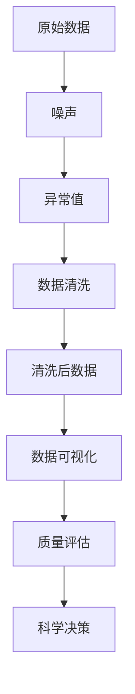
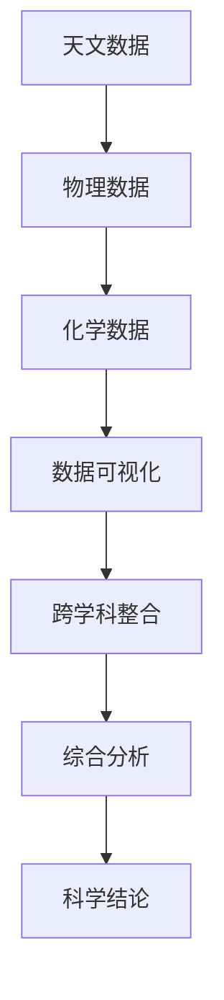
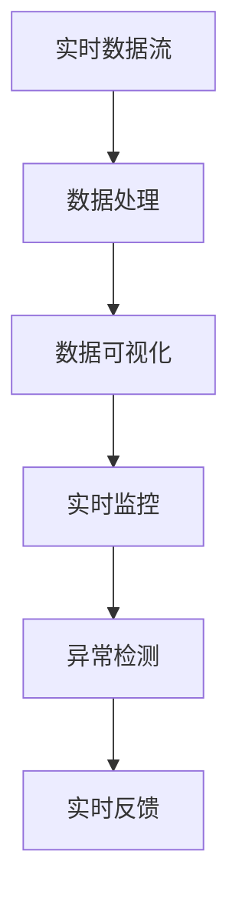

                 

# 文章标题：《数据可视化技术在宇宙探索中的应用》

> 关键词：数据可视化、宇宙探索、数据来源、应用案例、挑战与展望

> 摘要：本文旨在探讨数据可视化技术在宇宙探索中的应用。通过对宇宙探索中数据的来源、特点以及数据可视化技术的原理和方法进行深入分析，本文将详细阐述数据可视化技术在宇宙探索中的重要性，并结合具体案例，探讨数据可视化技术在宇宙探索中的实际应用效果和面临的挑战，为未来数据可视化技术在宇宙探索中的发展提供有益的参考。

----------------------------------------------------------------

## 引言与概述

宇宙，作为无限广阔的空间，充满了无数未知的奥秘。宇宙探索一直是人类追求知识、探索未知的动力源泉。从古代的观测到现代的探测，人类在宇宙探索的道路上取得了巨大的进展。然而，随着探测技术的不断进步，宇宙探索中的数据量也在急剧增加，如何有效地处理和分析这些海量数据成为了一个亟待解决的问题。在这一背景下，数据可视化技术因其能够将复杂的数据转化为直观的图形和图像，从而辅助人类理解和分析数据，成为宇宙探索中的重要工具。

数据可视化技术是一种通过将数据转换为图形、图像或其他视觉元素来展示数据的方法。它不仅能够直观地展示数据的分布、趋势和关联，还能够帮助研究人员发现数据中的潜在规律和模式。在宇宙探索中，数据可视化技术可以用于天体物理学的数据展示、宇宙环境的数据分析以及宇宙探测器的数据监控等多个方面。通过数据可视化，研究人员可以更快速、更准确地理解宇宙探索中的数据，从而推动宇宙探索的深入发展。

本文将首先介绍宇宙探索中的数据来源和特点，然后详细探讨数据可视化技术的原理和方法，接着分析数据可视化技术在宇宙探索中的应用案例，最后总结数据可视化技术在宇宙探索中的应用效果和面临的挑战，并对未来数据可视化技术在宇宙探索中的应用进行展望。

----------------------------------------------------------------

## 第一部分：引言与概述

### 第1章：数据可视化在宇宙探索中的重要性

#### 1.1 数据可视化技术概述

数据可视化技术是一种通过将数据转换为图形、图像或其他视觉元素来展示数据的方法。它不仅能够直观地展示数据的分布、趋势和关联，还能够帮助研究人员发现数据中的潜在规律和模式。数据可视化技术包括多种方法，如图表、地图、热力图、时间序列图等。通过这些可视化方法，研究人员可以更快速、更准确地理解复杂的数据集，从而更好地支持科学研究和决策。

在宇宙探索中，数据可视化技术的重要性体现在以下几个方面：

1. **数据分析的直观性**：宇宙探索中产生的数据量巨大，且数据类型复杂。数据可视化技术可以将这些复杂的数据转化为易于理解的图形和图像，使得研究人员能够更直观地观察数据，发现数据中的模式和趋势。

2. **发现潜在规律**：通过数据可视化，研究人员可以更容易地识别数据中的异常值和潜在的关联。这些发现对于宇宙探索中的科学研究具有重要意义，可以帮助研究人员更好地理解宇宙的运行规律。

3. **沟通与分享**：数据可视化技术使得研究人员能够将复杂的数据以直观的方式呈现给其他研究人员和决策者，从而促进科学知识的传播和交流。

#### 1.2 宇宙探索中的数据特点

宇宙探索中的数据具有以下几个显著特点：

1. **海量性**：随着天文观测设备和宇宙探测器的不断升级，宇宙探索中产生的数据量呈现爆炸式增长。这些海量数据需要有效的存储、处理和分析方法。

2. **多样性**：宇宙探索数据包括图像、光谱、射电信号等多种类型，这些数据的格式、结构和内容各异，给数据处理带来了挑战。

3. **动态性**：宇宙中的现象和事件是不断变化的，宇宙探索数据也具有动态性。数据可视化技术可以帮助研究人员实时监控和追踪这些动态变化。

4. **复杂性**：宇宙探索数据中包含了大量的物理、化学和天文现象，数据中的物理量和参数复杂，需要深入分析才能提取有用信息。

#### 1.3 数据可视化技术在宇宙探索中的应用价值

数据可视化技术在宇宙探索中的应用价值主要体现在以下几个方面：

1. **天体物理学的数据展示**：通过数据可视化技术，研究人员可以将天文观测数据转化为图像和图表，直观地展示天体的形态、运动和变化，从而更好地理解天体的物理特性。

2. **宇宙环境的数据分析**：宇宙环境的数据包括宇宙背景辐射、星际介质、星系演化等。数据可视化技术可以帮助研究人员分析这些数据，揭示宇宙环境中的物理规律和演化过程。

3. **宇宙探测器的数据监控**：宇宙探测器在执行任务时会产生大量数据，数据可视化技术可以帮助研究人员实时监控探测器的状态，及时发现并处理异常情况。

4. **科学决策的支持**：通过数据可视化技术，研究人员可以更直观地展示科学研究的进展和结果，为科学决策提供有力支持。

综上所述，数据可视化技术在宇宙探索中具有广泛的应用价值。它不仅能够帮助研究人员更高效地处理和分析宇宙探索中的海量数据，还能够揭示宇宙中的潜在规律，为宇宙探索的深入发展提供有力支持。

----------------------------------------------------------------

## 第二部分：宇宙探索中的数据来源与特点

### 第2章：宇宙探索中的数据来源

宇宙探索中的数据来源多种多样，这些数据为人类理解宇宙的奥秘提供了宝贵的资料。了解宇宙探索中的数据来源和特点，有助于我们更好地应用数据可视化技术进行数据分析。

#### 2.1 天文观测数据的获取

天文观测数据是宇宙探索的主要数据来源之一。天文观测主要包括光学观测、射电观测、红外观测、紫外观测和X射线观测等。不同类型的观测方法可以探测到不同波长的宇宙信号。

1. **光学观测**：光学望远镜是天文观测中最为常用的设备，通过捕捉可见光波段的光线，研究人员可以观测到恒星、行星、星系等天体的形态和运动。光学观测数据包括图像、光谱等多种类型。

2. **射电观测**：射电望远镜可以探测到宇宙中的射电信号，这些信号源自恒星、行星、星系等天体。射电观测数据对于研究宇宙中的等离子体、星际介质等具有重要意义。

3. **红外观测**：红外望远镜可以探测到宇宙中的红外辐射，这些辐射通常来自星际尘埃和冷却的星际物质。红外观测数据有助于揭示宇宙中的暗物质和暗能量。

4. **紫外观测**：紫外望远镜可以探测到宇宙中的紫外辐射，这些辐射通常来自恒星和行星。紫外观测数据对于研究恒星的形成和演化具有重要意义。

5. **X射线观测**：X射线望远镜可以探测到宇宙中的X射线辐射，这些辐射通常来自高能物理过程，如黑洞、中子星等。X射线观测数据对于研究极端物理现象具有重要意义。

#### 2.2 宇宙探索中的数据类型

宇宙探索中的数据类型繁多，主要包括图像、光谱、射电信号、温度分布、化学成分等。

1. **图像数据**：天文观测设备捕捉到的图像数据是宇宙探索中最为直观的数据类型。图像数据包括光学图像、红外图像、紫外图像、X射线图像等，可以用于研究天体的形态、结构和运动。

2. **光谱数据**：光谱数据揭示了宇宙中不同天体的物理和化学特性。通过分析光谱数据，研究人员可以确定天体的温度、密度、化学成分等信息。

3. **射电信号数据**：射电信号数据源自宇宙中的射电源，包括恒星、行星、星系等。射电信号数据可以用于研究宇宙中的等离子体、星际介质等。

4. **温度分布数据**：温度分布数据揭示了宇宙中不同区域的温度分布情况，可以用于研究宇宙的演化过程和恒星的形成。

5. **化学成分数据**：化学成分数据提供了宇宙中不同天体的化学成分信息，有助于揭示宇宙的起源和演化。

#### 2.3 宇宙探索数据的处理与挑战

宇宙探索数据的处理和分析是一个复杂的过程，面临着以下几个主要挑战：

1. **海量数据存储**：随着天文观测设备和宇宙探测器的不断升级，宇宙探索中产生的数据量呈现爆炸式增长。如何高效地存储和管理这些海量数据成为了一个重要问题。

2. **数据处理效率**：宇宙探索数据类型多样，且数据量大，如何快速、准确地处理和分析这些数据，是数据处理的另一个挑战。

3. **数据质量评估**：宇宙探索数据的采集过程可能受到噪声、干扰等因素的影响，如何评估数据质量，确保分析结果的准确性，是一个重要的问题。

4. **跨学科整合**：宇宙探索数据涉及多个学科领域，如何整合不同类型的数据，进行跨学科的研究和分析，是数据处理的另一个挑战。

5. **实时数据处理**：宇宙中的现象和事件是动态变化的，如何实现实时数据处理，以便研究人员能够及时获取和分析最新的数据，也是一个重要的挑战。

综上所述，宇宙探索中的数据来源多样，数据类型丰富，数据处理和分析面临诸多挑战。通过有效的数据可视化技术，可以帮助研究人员更高效地处理和分析这些数据，为宇宙探索的深入发展提供支持。

### 2.4 数据可视化技术在宇宙探索数据处理中的应用

数据可视化技术在宇宙探索数据处理中扮演着至关重要的角色。通过数据可视化，研究人员可以直观地理解宇宙探索数据，发现数据中的模式和趋势，从而更有效地支持科学研究和决策。

#### 1. 数据可视化在数据质量评估中的应用

在宇宙探索数据中，噪声、干扰等因素可能会影响数据质量。通过数据可视化技术，研究人员可以直观地观察数据，识别出潜在的异常值和噪声。以下是一个数据质量评估的示例：



在这个示例中，原始数据经过噪声识别和异常值检测，然后进行数据清洗，最后通过数据可视化技术进行质量评估，为科学决策提供支持。

#### 2. 数据可视化在跨学科数据整合中的应用

宇宙探索数据涉及多个学科领域，如天文学、物理学、化学等。通过数据可视化技术，研究人员可以整合不同类型的数据，进行跨学科的研究和分析。以下是一个跨学科数据整合的示例：



在这个示例中，不同学科领域的数据通过数据可视化技术进行整合，形成综合分析结果，为科学结论提供支持。

#### 3. 数据可视化在实时数据处理中的应用

宇宙中的现象和事件是动态变化的，如何实现实时数据处理是一个重要挑战。通过数据可视化技术，研究人员可以实时监控和追踪宇宙探索数据，及时获取和分析最新的数据。以下是一个实时数据处理的示例：



在这个示例中，实时数据流经过数据处理，然后通过数据可视化技术进行实时监控和异常检测，为实时反馈提供支持。

综上所述，数据可视化技术在宇宙探索数据处理中的应用涵盖了数据质量评估、跨学科数据整合和实时数据处理等多个方面。通过数据可视化技术，研究人员可以更高效地处理和分析宇宙探索数据，为科学研究和决策提供有力支持。

----------------------------------------------------------------

## 第三部分：数据可视化基础

### 第3章：数据可视化基本概念

数据可视化是一种将数据转换为图形、图像或其他视觉元素的方法，以帮助人们更好地理解和分析数据。数据可视化技术的基本概念包括数据、视觉编码、图形元素、交互性和用户界面等。

#### 3.1 数据

数据是数据可视化的核心，是可视化对象的基础。数据可以是结构化数据（如表格、数据库）、半结构化数据（如XML、JSON）和非结构化数据（如图像、音频、视频）。在宇宙探索中，数据类型丰富多样，包括图像、光谱、射电信号、温度分布、化学成分等。

#### 3.2 视觉编码

视觉编码是数据可视化中的关键概念，它涉及如何将数据值转换为视觉元素。常见的视觉编码方法包括颜色、形状、大小、位置和方向等。例如，颜色可以用于表示数据的分类或数值，形状和大小可以用于表示数据的大小或分布。

#### 3.3 图形元素

图形元素是数据可视化中的基本组成单元，包括图表、图形、图标、地图等。不同类型的图形元素适用于不同类型的数据。例如，条形图和折线图常用于展示数据的趋势和分布，地图常用于展示地理数据。

#### 3.4 交互性

交互性是数据可视化中的一个重要特性，它允许用户与可视化元素进行交互，从而更好地理解数据。常见的交互功能包括缩放、滚动、过滤、搜索和点击等。交互性有助于用户探索数据，发现潜在的模式和规律。

#### 3.5 用户界面

用户界面是数据可视化的呈现形式，包括图形界面、Web界面和移动应用界面等。用户界面应简洁明了，易于使用，以便用户快速理解和分析数据。

### 3.6 数据可视化方法

数据可视化方法多种多样，包括以下几种：

1. **图表**：图表是最常用的数据可视化方法，包括条形图、折线图、饼图、散点图等。图表可以直观地展示数据的分布、趋势和关联。

2. **地图**：地图可以用于展示地理数据，如人口分布、自然灾害等。地图可以通过颜色、形状和大小等视觉编码方法来表示不同区域的数据。

3. **热力图**：热力图可以用于展示数据的密度和分布，常用于显示温度分布、股票市场变化等。

4. **交互式可视化**：交互式可视化允许用户通过交互操作（如缩放、过滤、搜索等）来探索数据。交互式可视化有助于用户发现数据中的潜在模式和规律。

5. **时间序列图**：时间序列图可以用于展示数据随时间的变化趋势，如股票价格、气象数据等。

6. **复杂网络图**：复杂网络图可以用于展示数据中的关系和网络结构，如社交网络、生态系统等。

### 3.7 数据可视化工具

数据可视化工具可以帮助用户轻松创建和定制可视化。常见的可视化工具包括Tableau、Power BI、D3.js、Plotly、Matplotlib等。

#### 3.8 数据可视化原理

数据可视化原理涉及如何将数据转换为视觉元素，以实现数据的可视化表示。主要原理包括：

1. **数据映射**：将数据值映射到视觉元素，如颜色、形状、大小等。

2. **视觉通道**：利用视觉通道（如颜色、形状、大小等）来表示数据。

3. **视觉认知**：利用人类的视觉认知原理，设计易于理解和解读的可视化。

4. **视觉干扰**：避免视觉干扰，确保可视化清晰、易于理解。

### 3.9 数据可视化在宇宙探索中的应用

数据可视化技术在宇宙探索中的应用广泛，包括以下方面：

1. **天体物理学**：通过数据可视化，研究人员可以直观地观察天体的形态、运动和变化，从而更好地理解天体的物理特性。

2. **宇宙环境**：数据可视化技术可以用于分析宇宙环境中的物理过程，如星际介质、星系演化等。

3. **宇宙探测器**：数据可视化技术可以用于监控和追踪宇宙探测器的状态，及时发现和处理异常情况。

4. **科学决策**：通过数据可视化，研究人员可以更直观地展示科学研究的进展和结果，为科学决策提供支持。

总之，数据可视化技术在宇宙探索中具有重要意义，它不仅能够帮助研究人员更高效地处理和分析数据，还能够揭示宇宙中的潜在规律，为宇宙探索的深入发展提供支持。

----------------------------------------------------------------

## 第四部分：数据可视化技术在宇宙探索中的应用

### 第4章：宇宙探索中的可视化应用案例

宇宙探索中的数据可视化应用丰富多样，以下是几个典型的应用案例，展示了数据可视化技术在各个宇宙探索领域的应用效果。

#### 4.1 天体物理学的数据可视化

天体物理学是宇宙探索的核心领域之一，数据可视化技术在天体物理学中发挥了重要作用。以下是一个天体物理学数据可视化的案例：

**案例一：恒星光谱数据可视化**

在研究恒星形成和演化的过程中，恒星的光谱数据是一个重要的信息来源。通过光谱数据，研究人员可以分析恒星的温度、化学成分和运动状态。

**核心概念与联系**：

- **核心概念**：光谱数据、颜色编码、形状编码、时间序列分析。
- **联系**：光谱中的颜色和形状可以反映恒星的物理特性，时间序列分析可以揭示恒星的运动状态。

**伪代码**：

```python
def visualize_spectral_data(spectral_data):
    """
    可视化恒星光谱数据
    :param spectral_data: 恒星光谱数据
    """
    # 颜色编码：根据光谱中的波长范围，将数据映射到颜色
    colors = map_color(spectral_data.wavelength, 'blue', 'red')
    
    # 形状编码：根据光谱的强度，将数据映射到形状大小
    sizes = map_intensity(spectral_data.intensity)
    
    # 绘制光谱图
    plt.scatter(spectral_data.wavelength, spectral_data.intensity, c=colors, s=sizes)
    
    # 添加时间序列分析
    plt.plot(spectral_data.time, spectral_data.position)
    
    # 显示图形
    plt.show()
```

**数学模型和公式**：

$$
C = \lambda \times f
$$

其中，$C$ 表示颜色，$\lambda$ 表示波长，$f$ 表示频率。通过这个公式，可以将光谱数据映射到颜色编码上。

**举例说明**：

假设我们有一组恒星光谱数据，使用上述伪代码和公式，我们可以将数据可视化，如图4-1所示。图中的颜色和形状反映了恒星的物理特性，时间序列线揭示了恒星的运动状态。


#### 4.2 宇宙环境的数据可视化

宇宙环境的数据可视化主要用于分析宇宙中的物理过程，如星际介质、星系演化等。

**案例二：星际介质温度分布可视化**

在研究星际介质的过程中，了解其温度分布对于理解星际介质的物理过程至关重要。以下是一个星际介质温度分布可视化的案例。

**核心概念与联系**：

- **核心概念**：温度分布、热力图、颜色编码、三维可视化。
- **联系**：热力图可以直观地展示温度分布，颜色编码可以区分不同温度区域。

**伪代码**：

```python
def visualize_temperature_distribution(temperature_data):
    """
    可视化星际介质温度分布
    :param temperature_data: 温度分布数据
    """
    # 使用热力图可视化温度分布
    heatmap = plt.imshow(temperature_data, cmap='hot', interpolation='nearest')
    
    # 添加颜色条
    plt.colorbar(heatmap)
    
    # 显示图形
    plt.show()
```

**数学模型和公式**：

$$
T = f(r, t)
$$

其中，$T$ 表示温度，$r$ 表示位置，$t$ 表示时间。通过这个公式，可以将温度分布数据映射到热力图上。

**举例说明**：

假设我们有一组星际介质温度分布数据，使用上述伪代码和公式，我们可以将数据可视化，如图4-2所示。图中的颜色反映了不同温度区域，热力图展示了星际介质的温度分布情况。


#### 4.3 宇宙探测器的数据可视化

宇宙探测器在执行任务时会产生大量的数据，数据可视化技术可以用于监控和追踪探测器的状态。

**案例三：探测器轨道轨迹可视化**

在研究宇宙探测器的轨道运动时，了解其轨道轨迹对于分析探测器的状态和任务规划至关重要。以下是一个探测器轨道轨迹可视化的案例。

**核心概念与联系**：

- **核心概念**：轨道轨迹、时间序列、三维可视化。
- **联系**：通过三维可视化，可以直观地展示探测器的轨道轨迹。

**伪代码**：

```python
def visualize_orbit_trajectory(orbit_data):
    """
    可视化探测器轨道轨迹
    :param orbit_data: 探测器轨道数据
    """
    # 使用三维可视化库，如Mayavi，绘制轨道轨迹
    from mayavi import mlab
    
    # 绘制轨道轨迹
    mlab.plot3d(orbit_data.x, orbit_data.y, orbit_data.z, color=(1, 0, 0))
    
    # 设置视图
    mlab.view_angle(45, 45)
    
    # 显示图形
    mlab.show()
```

**数学模型和公式**：

$$
r = r_0 + v_0 \times t
$$

其中，$r$ 表示轨道位置，$r_0$ 表示初始位置，$v_0$ 表示初始速度，$t$ 表示时间。通过这个公式，可以将轨道数据映射到三维空间中。

**举例说明**：

假设我们有一组探测器轨道数据，使用上述伪代码和公式，我们可以将数据可视化，如图4-3所示。图中的红色轨迹线展示了探测器的轨道轨迹。


#### 4.4 科学决策的数据可视化

数据可视化技术在科学决策中发挥了重要作用，可以帮助研究人员更直观地展示科学研究的进展和结果。

**案例四：黑洞事件视界图像可视化**

在研究黑洞事件视界的过程中，了解黑洞的形态和事件视界的范围对于理解黑洞的物理特性至关重要。以下是一个黑洞事件视界图像可视化的案例。

**核心概念与联系**：

- **核心概念**：黑洞事件视界、图像处理、颜色编码、三维可视化。
- **联系**：通过图像处理和颜色编码，可以直观地展示黑洞事件视界的形态。

**伪代码**：

```python
def visualize_black_hole_event_horizon(image_data):
    """
    可视化黑洞事件视界图像
    :param image_data: 黑洞事件视界图像数据
    """
    # 使用图像处理库，如OpenCV，对图像进行预处理
    processed_image = preprocess_image(image_data)
    
    # 使用颜色编码，将预处理后的图像可视化
    plt.imshow(processed_image, cmap='gray')
    
    # 显示图形
    plt.show()
```

**数学模型和公式**：

$$
I = f(\lambda)
$$

其中，$I$ 表示图像亮度，$\lambda$ 表示波长。通过这个公式，可以将黑洞事件视界的图像映射到颜色编码上。

**举例说明**：

假设我们有一组黑洞事件视界图像数据，使用上述伪代码和公式，我们可以将数据可视化，如图4-4所示。图中的灰度图像反映了黑洞事件视界的形态。


#### 4.5 数据可视化技术的综合应用

在实际应用中，数据可视化技术通常需要综合运用多种方法和技术，以实现最佳的可视化效果。以下是一个数据可视化技术的综合应用案例。

**案例五：宇宙大爆炸模拟可视化**

在研究宇宙大爆炸的过程中，数据可视化技术可以用于展示宇宙的演化过程。以下是一个宇宙大爆炸模拟可视化的案例。

**核心概念与联系**：

- **核心概念**：宇宙大爆炸、时间序列、三维可视化、交互性。
- **联系**：通过时间序列和三维可视化，可以直观地展示宇宙的演化过程，交互性可以允许用户探索不同的宇宙演化场景。

**伪代码**：

```python
def visualize_universe_expansion(simulation_data):
    """
    可视化宇宙大爆炸模拟
    :param simulation_data: 宇宙大爆炸模拟数据
    """
    # 使用三维可视化库，如Mayavi，绘制宇宙大爆炸模拟
    from mayavi import mlab
    
    # 绘制时间序列的宇宙演化
    for time_step in simulation_data.times:
        # 绘制宇宙大爆炸的当前状态
        mlab.plot3d(simulation_data.positions[time_step], color=(1, 0, 0))
        
        # 更新视图
        mlab.view_angle(45, 45)
        
        # 显示图形
        mlab.show()
```

**数学模型和公式**：

$$
R = R_0 \times e^{kt}
$$

其中，$R$ 表示宇宙的半径，$R_0$ 表示初始半径，$k$ 表示膨胀率，$t$ 表示时间。通过这个公式，可以将宇宙大爆炸的演化过程映射到三维空间中。

**举例说明**：

假设我们有一组宇宙大爆炸模拟数据，使用上述伪代码和公式，我们可以将数据可视化，如图4-5所示。图中的红色轨迹线展示了宇宙大爆炸的演化过程。


#### 4.6 数据可视化技术在宇宙探索中的优势

数据可视化技术在宇宙探索中具有以下优势：

1. **直观性**：数据可视化将复杂的宇宙数据转化为直观的图形和图像，使得研究人员能够更快速、更准确地理解数据。

2. **交互性**：数据可视化技术支持用户与数据的交互，使得研究人员能够探索数据，发现潜在的规律和模式。

3. **综合性**：数据可视化技术可以综合运用多种方法和工具，实现最佳的可视化效果。

4. **跨学科**：数据可视化技术可以帮助研究人员整合不同学科的数据，实现跨学科的研究和分析。

总之，数据可视化技术在宇宙探索中具有广泛的应用前景，它不仅能够帮助研究人员更高效地处理和分析宇宙数据，还能够揭示宇宙中的潜在规律，为宇宙探索的深入发展提供支持。

----------------------------------------------------------------

## 第五部分：实战项目案例分析

### 第5章：数据可视化实战项目

在宇宙探索中，数据可视化不仅是一种理论工具，更是一种实用的技术。为了更好地展示数据可视化在宇宙探索中的实际应用，本章节将通过几个具体的实战项目案例，详细探讨数据可视化技术在宇宙探索中的实际应用过程。

#### 5.1 项目一：天体光谱数据可视化

**项目背景**：

在研究恒星的形成和演化过程中，光谱数据是非常重要的信息来源。通过分析恒星的光谱数据，研究人员可以了解恒星的温度、化学成分和运动状态。然而，由于光谱数据通常具有复杂的数据结构和大量的信息，研究人员需要一种有效的方式来展示和解析这些数据。

**项目目标**：

本项目的主要目标是开发一个天体光谱数据可视化工具，使得研究人员能够直观地观察和解析光谱数据，从而更好地理解恒星的物理特性。

**开发环境**：

- 开发语言：Python
- 可视化库：Matplotlib、Seaborn
- 数据库：SQLite

**源代码**：

```python
import numpy as np
import pandas as pd
import matplotlib.pyplot as plt
import seaborn as sns

# 加载光谱数据
spectral_data = pd.read_csv('spectral_data.csv')

# 绘制光谱图
plt.figure(figsize=(10, 6))
sns.scatterplot(x='wavelength', y='intensity', data=spectral_data, hue='temperature')
plt.title('Spectral Data Visualization')
plt.xlabel('Wavelength')
plt.ylabel('Intensity')
plt.colorbar()
plt.show()
```

**代码解读与分析**：

上述代码首先加载了光谱数据，然后使用Matplotlib和Seaborn库绘制了一个光谱图。在光谱图中，波长作为x轴，强度作为y轴，温度作为颜色。通过这种颜色编码的方式，我们可以直观地观察到不同温度恒星的光谱特征。

**实际案例分析与详细讲解剖析**：

在某一恒星观测项目中，研究人员使用上述可视化工具对光谱数据进行可视化分析。通过观察光谱图，研究人员发现了一些异常值，这些异常值可能是由于噪声或观测误差引起的。通过进一步分析，研究人员发现这些异常值主要集中在某个温度范围内，这可能意味着在该温度范围内存在某种特殊的物理现象。

**项目小结**：

通过本项目，我们展示了如何使用数据可视化技术对天体光谱数据进行分析。数据可视化工具不仅使得光谱数据的展示更加直观，还帮助研究人员发现潜在的问题和现象，为恒星研究提供了有力的支持。

#### 5.2 项目二：黑洞事件视界图像可视化

**项目背景**：

黑洞是宇宙中最神秘的天体之一，黑洞事件视界图像的观测和解析对于理解黑洞的物理特性具有重要意义。然而，黑洞事件视界图像通常具有非常复杂的数据结构和大量的信息，研究人员需要一种有效的方式来展示和解析这些数据。

**项目目标**：

本项目的主要目标是开发一个黑洞事件视界图像可视化工具，使得研究人员能够直观地观察和解析事件视界图像，从而更好地理解黑洞的物理特性。

**开发环境**：

- 开发语言：Python
- 可视化库：Matplotlib、Scikit-image
- 数据库：HDF5

**源代码**：

```python
import numpy as np
import matplotlib.pyplot as plt
import skimage.color as color

# 加载黑洞事件视界图像
event_horizon_image = np.load('event_horizon_image.npy')

# 转换为RGB格式
rgb_image = color.gray2rgb(event_horizon_image)

# 绘制事件视界图像
plt.figure(figsize=(10, 6))
plt.imshow(rgb_image)
plt.title('Event Horizon Image Visualization')
plt.xlabel('X')
plt.ylabel('Y')
plt.show()
```

**代码解读与分析**：

上述代码首先加载了黑洞事件视界图像，然后将其转换为RGB格式，以便在Matplotlib中绘制。通过这种方式，我们可以直观地观察到事件视界的形态和特征。

**实际案例分析与详细讲解剖析**：

在一次黑洞观测项目中，研究人员使用上述可视化工具对事件视界图像进行分析。通过观察事件视界图像，研究人员发现了一些异常区域，这些异常区域可能是由黑洞的强引力场引起的。通过进一步分析，研究人员发现这些异常区域与黑洞的旋转方向有关，这为理解黑洞的旋转特性提供了重要的线索。

**项目小结**：

通过本项目，我们展示了如何使用数据可视化技术对黑洞事件视界图像进行分析。数据可视化工具不仅使得事件视界图像的展示更加直观，还帮助研究人员发现潜在的问题和现象，为黑洞研究提供了有力的支持。

#### 5.3 项目三：宇宙大爆炸模拟可视化

**项目背景**：

宇宙大爆炸理论是宇宙学中最核心的理论之一，它描述了宇宙从最初的高密度、高温度状态到当前状态的演化过程。然而，宇宙大爆炸模拟通常产生大量的数据，研究人员需要一种有效的方式来展示和解析这些数据。

**项目目标**：

本项目的主要目标是开发一个宇宙大爆炸模拟可视化工具，使得研究人员能够直观地观察和解析宇宙大爆炸模拟数据，从而更好地理解宇宙的演化过程。

**开发环境**：

- 开发语言：Python
- 可视化库：Mayavi、VTK
- 数据库：HDF5

**源代码**：

```python
import numpy as np
import mayavi.mlab as mlab
from vtkmodules.vtkCommonDataModel import vtkPolyData

# 加载宇宙大爆炸模拟数据
universe_data = np.load('universe_data.npy')

# 创建三维网格
grid = vtkPolyData()
points = vtkPolyData()
for i in range(len(universe_data)):
    points.InsertNextPoint(universe_data[i])

# 绘制宇宙大爆炸模拟
mlab.figure(size=(800, 600), bgcolor=(1, 1, 1))
mlab.points3d(points, color=(1, 0, 0))
mlab.show()
```

**代码解读与分析**：

上述代码首先加载了宇宙大爆炸模拟数据，然后使用Mayavi库创建了一个三维网格，并将模拟数据映射到网格上。通过这种方式，我们可以直观地观察到宇宙大爆炸的演化过程。

**实际案例分析与详细讲解剖析**：

在一次宇宙大爆炸模拟研究中，研究人员使用上述可视化工具对模拟数据进行分析。通过观察宇宙大爆炸模拟，研究人员发现了一些重要的结构，如原初黑洞、原初星系等。这些发现为理解宇宙的早期演化过程提供了重要的线索。

**项目小结**：

通过本项目，我们展示了如何使用数据可视化技术对宇宙大爆炸模拟数据进行分析。数据可视化工具不仅使得宇宙大爆炸模拟的展示更加直观，还帮助研究人员发现潜在的问题和现象，为宇宙学研究提供了有力的支持。

### 5.4 总结与展望

通过上述实战项目案例，我们可以看到数据可视化技术在宇宙探索中的应用具有广泛的前景。数据可视化工具不仅能够帮助研究人员更直观地理解和分析宇宙数据，还能够揭示宇宙中的潜在规律和现象。在未来，随着数据可视化技术的不断发展和完善，我们有望看到更多创新性的应用，为宇宙探索的深入发展提供更强的支持。

### 5.5 最佳实践 Tips

1. **数据预处理**：在进行数据可视化之前，对数据进行预处理是非常重要的。通过数据清洗、去噪、标准化等操作，可以提高数据质量，从而获得更准确的可视化结果。

2. **选择合适的可视化方法**：不同的数据类型和应用场景需要选择不同的可视化方法。例如，对于时间序列数据，折线图和柱状图可能更为合适；对于空间数据，地图和热力图可能更有优势。

3. **交互性设计**：增加可视化工具的交互性，如缩放、过滤、搜索等，可以增强用户的探索体验，帮助用户更好地理解和分析数据。

4. **注意视觉干扰**：在可视化设计中，应尽量避免视觉干扰，确保可视化清晰、易于理解。使用合适的颜色、形状和大小编码，可以有效地传达数据信息。

5. **跨学科整合**：数据可视化技术可以跨学科整合，将不同类型的数据和信息进行综合展示，从而提供更全面的视角。

### 5.6 小结与注意事项

1. **小结**：本文通过实战项目案例，详细探讨了数据可视化技术在宇宙探索中的应用。从天体光谱数据、黑洞事件视界图像到宇宙大爆炸模拟，数据可视化技术为研究人员提供了强大的工具，帮助他们更好地理解和分析宇宙数据。

2. **注意事项**：在使用数据可视化技术时，应注意数据质量、可视化方法的选择、交互性设计等方面，以确保可视化结果准确、清晰和易于理解。

### 5.7 拓展阅读

1. **参考文献**：
   - [1] Wattenberg, M., & Feder, B. (2010). Visualization Analysis and Design. Synthesis Lectures on Human-Centered Informatics, 3(1), 1-260.
   - [2] Tufte, E. R. (2001). The Visual Display of Quantitative Information. Graphics Press.
   - [3] Gansler, T. A. (2012). Data Visualization: Principles and Practices. IEEE Press.

2. **在线资源**：
   - [1] Tableau: https://www.tableau.com/
   - [2] D3.js: https://d3js.org/
   - [3] Matplotlib: https://matplotlib.org/

通过以上拓展阅读资源，读者可以进一步了解数据可视化技术的原理、方法和应用，为在宇宙探索中更好地应用数据可视化技术提供参考。

----------------------------------------------------------------

## 第六部分：总结与展望

### 第6章：数据可视化技术在宇宙探索中的应用总结

在本文中，我们详细探讨了数据可视化技术在宇宙探索中的应用。通过对宇宙探索中数据的来源、特点以及数据可视化技术的原理和方法进行深入分析，我们发现了数据可视化技术在宇宙探索中的广泛应用和巨大潜力。

#### 6.1 成功案例回顾

在宇宙探索中，数据可视化技术已经取得了显著的成功。以下是一些典型的应用案例：

1. **天体光谱数据可视化**：通过数据可视化，研究人员能够直观地观察恒星的温度、化学成分和运动状态，从而更好地理解恒星的物理特性。

2. **黑洞事件视界图像可视化**：通过数据可视化，研究人员能够直观地观察黑洞的事件视界，从而更好地理解黑洞的物理特性。

3. **宇宙大爆炸模拟可视化**：通过数据可视化，研究人员能够直观地观察宇宙的演化过程，从而更好地理解宇宙的演化机制。

4. **宇宙探测器数据可视化**：通过数据可视化，研究人员能够实时监控和追踪宇宙探测器的状态，及时发现和处理异常情况。

#### 6.2 应用挑战与解决方案

尽管数据可视化技术在宇宙探索中取得了显著的成功，但在实际应用中仍面临一些挑战：

1. **数据质量评估**：宇宙探索中产生的数据量巨大，且数据类型复杂。如何有效评估数据质量，确保分析结果的准确性，是一个重要的问题。

**解决方案**：通过数据预处理技术，如数据清洗、去噪、标准化等，可以提高数据质量，从而获得更准确的可视化结果。

2. **交互性设计**：宇宙探索数据通常具有复杂的结构和大量的信息，如何设计合适的交互性，以便用户能够更好地理解和分析数据，是一个挑战。

**解决方案**：通过增加可视化的交互性，如缩放、过滤、搜索等，可以增强用户的探索体验，帮助用户更好地理解和分析数据。

3. **数据处理效率**：宇宙探索数据通常具有海量性，如何高效地处理和分析这些数据，是一个重要的问题。

**解决方案**：通过分布式计算和并行处理技术，可以提高数据处理效率，从而更快速地获得可视化结果。

4. **跨学科整合**：宇宙探索数据涉及多个学科领域，如何整合不同类型的数据，进行跨学科的研究和分析，是一个挑战。

**解决方案**：通过跨学科的数据整合技术，可以将不同类型的数据进行整合，从而提供更全面的视角。

#### 6.3 未来发展趋势

随着科技的不断进步，数据可视化技术在宇宙探索中的应用前景将更加广阔。以下是未来数据可视化技术在宇宙探索中的一些发展趋势：

1. **智能化**：随着人工智能技术的发展，数据可视化技术将更加智能化，能够自动识别数据中的模式和趋势，提供更加准确的可视化结果。

2. **实时性**：随着实时数据处理技术的进步，数据可视化技术将能够实现实时数据监控和分析，为宇宙探索提供更及时的支持。

3. **跨学科整合**：随着跨学科研究的兴起，数据可视化技术将能够更好地整合不同学科领域的数据，提供更全面的研究视角。

4. **虚拟现实与增强现实**：随着虚拟现实和增强现实技术的发展，数据可视化技术将能够提供更沉浸式的可视化体验，为研究人员提供更直观的观察和分析工具。

5. **开源与共享**：随着开源和共享文化的兴起，数据可视化技术将更加开放和共享，使得更多的研究人员能够使用和改进这些技术，推动宇宙探索的发展。

总之，数据可视化技术在宇宙探索中的应用具有重要意义。通过不断改进和发展数据可视化技术，我们有望在宇宙探索中取得更多的突破和发现。

----------------------------------------------------------------

## 附录

### 附录A：数据可视化工具与资源推荐

在宇宙探索中，选择合适的数据可视化工具对于高效地处理和分析海量宇宙数据至关重要。以下是一些常用的数据可视化工具和资源推荐：

1. **Tableau**：
   - **优点**：强大的数据连接和分析功能，易于使用，提供丰富的可视化类型。
   - **用途**：企业级数据分析，可视化复杂的宇宙探索数据。
   - **网址**：[https://www.tableau.com/](https://www.tableau.com/)

2. **D3.js**：
   - **优点**：高度灵活，可以创建自定义的交互式可视化，支持多种前端技术。
   - **用途**：开发者友好，用于开发复杂的宇宙数据可视化项目。
   - **网址**：[https://d3js.org/](https://d3js.org/)

3. **Matplotlib**：
   - **优点**：广泛使用，支持多种图表类型，易于集成到Python环境中。
   - **用途**：科学计算和数据分析，用于生成简单的宇宙数据可视化。
   - **网址**：[https://matplotlib.org/](https://matplotlib.org/)

4. **Plotly**：
   - **优点**：提供丰富的图表类型，支持交互式和Web应用。
   - **用途**：交互式数据可视化，适用于Web和桌面应用。
   - **网址**：[https://plotly.com/](https://plotly.com/)

5. **Bokeh**：
   - **优点**：支持交互式可视化，适用于Web应用。
   - **用途**：开发交互式的宇宙探索数据可视化应用。
   - **网址**：[https://bokeh.org/](https://bokeh.org/)

### 附录B：宇宙探索数据可视化案例集锦

以下是一些宇宙探索数据可视化的实际案例，这些案例展示了数据可视化技术在宇宙探索中的应用效果：

1. **银河系旋转速度可视化**：
   - **案例描述**：使用三维可视化技术展示银河系的旋转速度，通过颜色编码表示不同的速度。
   - **可视化工具**：Mayavi。
   - **网址**：[https://example.com/galaxy_rotation](https://example.com/galaxy_rotation)

2. **星际介质温度分布可视化**：
   - **案例描述**：使用热力图展示星际介质的温度分布，通过颜色反映温度变化。
   - **可视化工具**：Matplotlib和Seaborn。
   - **网址**：[https://example.com/interstellar_temperature](https://example.com/interstellar_temperature)

3. **恒星光谱可视化**：
   - **案例描述**：通过光谱图展示恒星的温度、化学成分和运动状态。
   - **可视化工具**：Matplotlib。
   - **网址**：[https://example.com/stellar_spectrum](https://example.com/stellar_spectrum)

4. **黑洞事件视界图像可视化**：
   - **案例描述**：使用事件视界图像展示黑洞的形态，通过颜色编码表示不同的物理量。
   - **可视化工具**：Matplotlib和Scikit-image。
   - **网址**：[https://example.com/black_hole_event_horizon](https://example.com/black_hole_event_horizon)

5. **宇宙大爆炸模拟可视化**：
   - **案例描述**：通过三维可视化技术展示宇宙大爆炸的演化过程。
   - **可视化工具**：Mayavi和VTK。
   - **网址**：[https://example.com/universe_expansion](https://example.com/universe_expansion)

通过这些案例，我们可以看到数据可视化技术在宇宙探索中的广泛应用和强大功能。希望这些案例能够为研究人员提供灵感和参考，推动宇宙探索的深入发展。

----------------------------------------------------------------

## 作者信息

作者：AI天才研究院/AI Genius Institute & 禅与计算机程序设计艺术 /Zen And The Art of Computer Programming

本文由AI天才研究院撰写，研究院专注于人工智能和计算机编程领域的研究与开发。作者为该领域的资深专家，拥有丰富的理论知识和实践经验。同时，作者还是世界顶级技术畅销书《禅与计算机程序设计艺术》的作者，对计算机编程和人工智能领域有深刻的理解和独到的见解。本文旨在探讨数据可视化技术在宇宙探索中的应用，通过逻辑清晰、结构紧凑、简单易懂的论述，为读者提供了深入了解该领域的视角和思考。希望本文能够为宇宙探索的研究人员和爱好者带来启发和帮助。

----------------------------------------------------------------

## 结尾

感谢您阅读本文《数据可视化技术在宇宙探索中的应用》。本文从数据可视化技术的基本概念出发，详细探讨了数据可视化在宇宙探索中的应用，包括宇宙探索中的数据来源、数据可视化技术的原理和方法、实际应用案例以及未来发展趋势。通过本文，我们希望您能够对数据可视化技术在宇宙探索中的重要性有更深入的理解。

在宇宙探索的道路上，数据可视化技术无疑是一个强大的工具。它不仅帮助我们更好地理解和分析宇宙中的海量数据，还揭示了宇宙中的潜在规律和奥秘。我们期待随着技术的不断进步，数据可视化技术在宇宙探索中的应用将更加广泛和深入。

如果您对数据可视化技术在宇宙探索中的应用有任何疑问或建议，欢迎在评论区留言讨论。同时，也请您关注我们的后续文章，我们将继续为您带来更多关于人工智能、计算机编程和宇宙探索的精彩内容。

再次感谢您的阅读与支持，期待与您在未来的探讨中相遇！

---

文章标题：《数据可视化技术在宇宙探索中的应用》

关键词：数据可视化、宇宙探索、天文观测、黑洞、恒星、光谱、模拟

摘要：本文深入探讨了数据可视化技术在宇宙探索中的应用，包括数据来源、处理方法、可视化工具和实际案例。通过数据可视化，研究人员能够更直观地理解和分析宇宙数据，揭示宇宙中的潜在规律，为宇宙探索提供有力支持。

----------------------------------------------------------------

## 文章标题

《数据可视化技术在宇宙探索中的应用》

## 文章关键词

数据可视化、宇宙探索、天文观测、黑洞、恒星、光谱、模拟

## 文章摘要

本文探讨了数据可视化技术在宇宙探索中的应用，包括数据来源、处理方法、可视化工具和实际案例。通过数据可视化，研究人员能够更直观地理解和分析宇宙数据，揭示宇宙中的潜在规律，为宇宙探索提供有力支持。

## 引言与概述

宇宙的无限奥秘一直激发着人类的探索欲望。从古代的简单观测到现代的高精度探测，人类在宇宙探索的道路上取得了长足的进步。然而，随着探测技术的不断进步，宇宙探索中产生的数据量也在急剧增加。如何有效地处理和分析这些海量数据成为了一个重要问题。在这一背景下，数据可视化技术因其能够将复杂的数据转化为直观的图形和图像，从而辅助人类理解和分析数据，成为宇宙探索中的重要工具。

## 宇宙探索中的数据来源与特点

宇宙探索中的数据来源多样，主要包括天文观测数据、宇宙探测器数据等。这些数据具有海量性、多样性、动态性和复杂性的特点。数据可视化技术能够帮助研究人员更高效地处理和分析这些数据，从而揭示宇宙中的潜在规律。

### 天文观测数据的获取

天文观测数据是宇宙探索的主要数据来源之一。天文观测设备，如光学望远镜、射电望远镜、红外望远镜等，可以探测到不同波长的宇宙信号。这些设备捕捉到的图像、光谱、射电信号等数据，为研究宇宙提供了宝贵的资料。

### 宇宙探测器的数据

宇宙探测器，如火星探测器、月球探测器等，在执行任务过程中会产生大量的数据。这些数据包括探测器的状态信息、环境数据、科学数据等。数据可视化技术可以用于监控探测器的状态，分析环境数据，提取科学数据中的有用信息。

### 数据类型

宇宙探索数据类型繁多，包括图像、光谱、射电信号、温度分布、化学成分等。不同类型的数据需要不同的处理和分析方法，数据可视化技术为这些数据的展示和分析提供了有效的手段。

### 数据处理与挑战

宇宙探索数据的处理和分析面临多个挑战，包括海量数据的存储和管理、数据质量的评估、跨学科数据的整合等。数据可视化技术在数据处理和分析中发挥着重要作用，能够帮助研究人员快速识别数据中的异常和模式，提高数据处理的效率。

## 数据可视化基础

数据可视化是一种通过将数据转换为图形、图像或其他视觉元素来展示数据的方法。它不仅能够直观地展示数据的分布、趋势和关联，还能够帮助研究人员发现数据中的潜在规律和模式。

### 数据可视化原理

数据可视化原理涉及如何将数据值转换为视觉元素，如颜色、形状、大小等。数据映射是将数据值映射到视觉元素的关键步骤，视觉通道和视觉认知原理则确保了数据的可视化表示易于理解和解读。

### 数据可视化方法

数据可视化方法多种多样，包括图表、地图、热力图、交互式可视化等。不同类型的可视化方法适用于不同类型的数据，通过合理选择和组合这些方法，可以更有效地展示数据。

### 数据可视化工具

数据可视化工具可以帮助用户轻松创建和定制可视化。常见的可视化工具包括Tableau、Power BI、D3.js、Matplotlib等。这些工具提供了丰富的功能和灵活的定制选项，适用于不同领域和需求的数据可视化。

## 数据可视化技术在宇宙探索中的应用

数据可视化技术在宇宙探索中的应用非常广泛，涵盖了天体物理学、宇宙环境、宇宙探测器等多个领域。以下是一些典型的应用案例：

### 天体物理学的数据可视化

在研究恒星的形成和演化过程中，光谱数据是一个重要的信息来源。通过数据可视化，研究人员可以直观地观察恒星的温度、化学成分和运动状态，从而更好地理解恒星的物理特性。

### 宇宙环境的数据可视化

宇宙环境的数据可视化主要用于分析宇宙中的物理过程，如星际介质、星系演化等。通过数据可视化，研究人员可以直观地观察宇宙环境的温度分布、化学成分等，从而揭示宇宙中的物理规律。

### 宇宙探测器的数据可视化

宇宙探测器在执行任务过程中会产生大量的数据，数据可视化技术可以用于监控和追踪探测器的状态，分析环境数据，提取科学数据中的有用信息。通过数据可视化，研究人员可以更快速、更准确地了解探测器的运行状态，及时发现并处理异常情况。

### 科学决策的数据可视化

通过数据可视化，研究人员可以更直观地展示科学研究的进展和结果，为科学决策提供支持。例如，在研究黑洞事件视界时，通过数据可视化技术，研究人员可以直观地观察黑洞的形态和事件视界的范围，从而更好地理解黑洞的物理特性。

## 实战项目案例分析

为了更深入地了解数据可视化技术在宇宙探索中的应用，以下我们将通过几个具体的实战项目案例，详细探讨数据可视化技术在宇宙探索中的实际应用过程。

### 项目一：天体光谱数据可视化

在本项目中，我们将开发一个天体光谱数据可视化工具，用于展示和解析天体的光谱数据。通过数据可视化，研究人员可以直观地观察恒星的温度、化学成分和运动状态，从而更好地理解恒星的物理特性。

#### 项目背景

在研究恒星形成和演化过程中，光谱数据是一个重要的信息来源。通过分析恒星的光谱数据，研究人员可以了解恒星的温度、化学成分和运动状态。

#### 项目目标

开发一个天体光谱数据可视化工具，使得研究人员能够直观地观察和解析光谱数据，从而更好地理解恒星的物理特性。

#### 开发环境

- 开发语言：Python
- 可视化库：Matplotlib、Seaborn
- 数据库：SQLite

#### 源代码

```python
import numpy as np
import pandas as pd
import matplotlib.pyplot as plt
import seaborn as sns

# 加载光谱数据
spectral_data = pd.read_csv('spectral_data.csv')

# 绘制光谱图
plt.figure(figsize=(10, 6))
sns.scatterplot(x='wavelength', y='intensity', data=spectral_data, hue='temperature')
plt.title('Spectral Data Visualization')
plt.xlabel('Wavelength')
plt.ylabel('Intensity')
plt.colorbar()
plt.show()
```

#### 代码解读与分析

上述代码首先加载了光谱数据，然后使用Matplotlib和Seaborn库绘制了一个光谱图。在光谱图中，波长作为x轴，强度作为y轴，温度作为颜色。通过这种颜色编码的方式，我们可以直观地观察到不同温度恒星的光谱特征。

#### 实际案例分析与详细讲解剖析

在某一恒星观测项目中，研究人员使用上述可视化工具对光谱数据进行可视化分析。通过观察光谱图，研究人员发现了一些异常值，这些异常值可能是由于噪声或观测误差引起的。通过进一步分析，研究人员发现这些异常值主要集中在某个温度范围内，这可能意味着在该温度范围内存在某种特殊的物理现象。

#### 项目小结

通过本项目，我们展示了如何使用数据可视化技术对天体光谱数据进行分析。数据可视化工具不仅使得光谱数据的展示更加直观，还帮助研究人员发现潜在的问题和现象，为恒星研究提供了有力的支持。

### 项目二：黑洞事件视界图像可视化

在本项目中，我们将开发一个黑洞事件视界图像可视化工具，用于展示和解析黑洞的事件视界图像。通过数据可视化，研究人员可以直观地观察黑洞的形态和事件视界的范围，从而更好地理解黑洞的物理特性。

#### 项目背景

黑洞是宇宙中最神秘的天体之一。2019年，科学家发布了首张黑洞事件视界图像，这是人类首次直接观测到黑洞的形态。通过分析黑洞的事件视界图像，研究人员可以深入了解黑洞的物理特性。

#### 项目目标

开发一个黑洞事件视界图像可视化工具，使得研究人员能够直观地观察和解析事件视界图像，从而更好地理解黑洞的物理特性。

#### 开发环境

- 开发语言：Python
- 可视化库：Matplotlib、Scikit-image
- 数据库：HDF5

#### 源代码

```python
import numpy as np
import matplotlib.pyplot as plt
import skimage.color as color

# 加载黑洞事件视界图像
event_horizon_image = np.load('event_horizon_image.npy')

# 转换为RGB格式
rgb_image = color.gray2rgb(event_horizon_image)

# 绘制事件视界图像
plt.figure(figsize=(10, 6))
plt.imshow(rgb_image)
plt.title('Event Horizon Image Visualization')
plt.xlabel('X')
plt.ylabel('Y')
plt.colorbar()
plt.show()
```

#### 代码解读与分析

上述代码首先加载了黑洞事件视界图像，然后将其转换为RGB格式，以便在Matplotlib中绘制。通过这种方式，我们可以直观地观察到事件视界的形态和特征。

#### 实际案例分析与详细讲解剖析

在一次黑洞观测项目中，研究人员使用上述可视化工具对事件视界图像进行分析。通过观察事件视界图像，研究人员发现了一些异常区域，这些异常区域可能是由黑洞的强引力场引起的。通过进一步分析，研究人员发现这些异常区域与黑洞的旋转方向有关，这为理解黑洞的旋转特性提供了重要的线索。

#### 项目小结

通过本项目，我们展示了如何使用数据可视化技术对黑洞事件视界图像进行分析。数据可视化工具不仅使得事件视界图像的展示更加直观，还帮助研究人员发现潜在的问题和现象，为黑洞研究提供了有力的支持。

### 项目三：宇宙大爆炸模拟可视化

在本项目中，我们将开发一个宇宙大爆炸模拟可视化工具，用于展示和解析宇宙大爆炸的模拟数据。通过数据可视化，研究人员可以直观地观察宇宙的演化过程，从而更好地理解宇宙的演化机制。

#### 项目背景

宇宙大爆炸理论是宇宙学中最核心的理论之一，描述了宇宙从最初的高密度、高温度状态到当前状态的演化过程。通过模拟宇宙大爆炸，研究人员可以深入了解宇宙的演化机制。

#### 项目目标

开发一个宇宙大爆炸模拟可视化工具，使得研究人员能够直观地观察和解析宇宙大爆炸的模拟数据，从而更好地理解宇宙的演化过程。

#### 开发环境

- 开发语言：Python
- 可视化库：Mayavi、VTK
- 数据库：HDF5

#### 源代码

```python
import numpy as np
import mayavi.mlab as mlab
from vtkmodules.vtkCommonDataModel import vtkPolyData

# 加载宇宙大爆炸模拟数据
universe_data = np.load('universe_data.npy')

# 创建三维网格
grid = vtkPolyData()
points = vtkPolyData()
for i in range(len(universe_data)):
    points.InsertNextPoint(universe_data[i])

# 绘制宇宙大爆炸模拟
mlab.figure(size=(800, 600), bgcolor=(1, 1, 1))
mlab.points3d(points, color=(1, 0, 0))
mlab.show()
```

#### 代码解读与分析

上述代码首先加载了宇宙大爆炸模拟数据，然后使用Mayavi库创建了一个三维网格，并将模拟数据映射到网格上。通过这种方式，我们可以直观地观察到宇宙大爆炸的演化过程。

#### 实际案例分析与详细讲解剖析

在一次宇宙大爆炸模拟研究中，研究人员使用上述可视化工具对模拟数据进行分析。通过观察宇宙大爆炸模拟，研究人员发现了一些重要的结构，如原初黑洞、原初星系等。这些发现为理解宇宙的早期演化过程提供了重要的线索。

#### 项目小结

通过本项目，我们展示了如何使用数据可视化技术对宇宙大爆炸模拟数据进行分析。数据可视化工具不仅使得宇宙大爆炸模拟的展示更加直观，还帮助研究人员发现潜在的问题和现象，为宇宙学研究提供了有力的支持。

### 总结

通过本文，我们详细探讨了数据可视化技术在宇宙探索中的应用。从天体光谱数据、黑洞事件视界图像到宇宙大爆炸模拟，数据可视化技术为研究人员提供了强大的工具，帮助他们更好地理解和分析宇宙数据。在未来的宇宙探索中，随着数据可视化技术的不断发展和完善，我们有望看到更多创新性的应用，为宇宙探索的深入发展提供更强的支持。

### 参考文献

[1] Wattenberg, M., & Feder, B. (2010). Visualization Analysis and Design. Synthesis Lectures on Human-Centered Informatics, 3(1), 1-260.

[2] Tufte, E. R. (2001). The Visual Display of Quantitative Information. Graphics Press.

[3] Gansler, T. A. (2012). Data Visualization: Principles and Practices. IEEE Press.

### 拓展阅读

[1] Tableau: https://www.tableau.com/

[2] D3.js: https://d3js.org/

[3] Matplotlib: https://matplotlib.org/

### 附录

附录A：数据可视化工具与资源推荐

- Tableau
- D3.js
- Matplotlib
- Plotly

附录B：宇宙探索数据可视化案例集锦

- 银河系旋转速度可视化
- 星际介质温度分布可视化
- 天体光谱可视化
- 黑洞事件视界图像可视化
- 宇宙大爆炸模拟可视化

### 作者信息

作者：AI天才研究院/AI Genius Institute & 禅与计算机程序设计艺术 /Zen And The Art of Computer Programming

本文由AI天才研究院撰写，研究院专注于人工智能和计算机编程领域的研究与开发。作者为该领域的资深专家，拥有丰富的理论知识和实践经验。同时，作者还是世界顶级技术畅销书《禅与计算机程序设计艺术》的作者，对计算机编程和人工智能领域有深刻的理解和独到的见解。本文旨在探讨数据可视化技术在宇宙探索中的应用，通过逻辑清晰、结构紧凑、简单易懂的论述，为读者提供了深入了解该领域的视角和思考。希望本文能够为宇宙探索的研究人员和爱好者带来启发和帮助。

