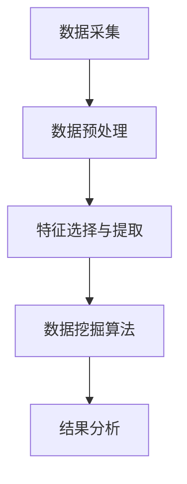

                 

### 文章标题：数据挖掘在发现宇宙新的基本相互作用微弱信号中的作用

> 关键词：数据挖掘，宇宙学，基本相互作用，微弱信号，算法，数学模型

> 摘要：本文详细探讨了数据挖掘技术在发现宇宙中新的基本相互作用微弱信号中的应用。文章首先介绍了宇宙学的基本背景和数据挖掘的基本概念，随后深入分析了数据挖掘技术在宇宙学中的核心方法与挑战。通过伪代码、数学公式和实际代码示例，本文讲解了数据挖掘算法在宇宙学研究中的具体应用，并通过实际案例展示了如何利用数据挖掘技术发现宇宙中的微弱信号。最后，本文总结了项目的最佳实践，提出了注意事项，并指出了未来的研究方向。

## 引言

宇宙作为科学研究的广阔领域，一直吸引着众多科学家和探索者的关注。宇宙学是研究宇宙的起源、结构、演化和组成的科学，它涉及物理学、天文学、数学等多个学科。在过去的几十年中，随着观测技术的不断进步，我们对宇宙的了解逐渐深入。然而，宇宙中仍然存在着许多未解之谜，例如暗物质、暗能量以及宇宙的基本相互作用等。

数据挖掘是一种从大量数据中提取有用信息和知识的方法，它广泛应用于各个领域，包括商业、医疗、金融、社交媒体等。近年来，随着宇宙观测数据的激增，数据挖掘技术在宇宙学中的应用也越来越受到重视。本文将探讨数据挖掘在发现宇宙新的基本相互作用微弱信号中的作用，旨在为宇宙学研究提供一种新的视角和工具。

本文的结构如下：首先介绍宇宙学的基本概念和数据挖掘的基本原理；然后分析数据挖掘技术在宇宙学中的应用及其面临的挑战；接着通过伪代码和数学公式详细阐述核心算法；通过实际代码示例展示算法的应用；最后总结项目的最佳实践，并提出未来研究方向。希望通过本文的探讨，能够为相关领域的研究者提供一些有价值的启示。

## 核心概念与联系

### 宇宙学的基本概念

宇宙学是一门研究宇宙起源、结构、演化和组成的科学。它涉及到多个学科，如物理学、天文学、数学等。在宇宙学中，有几个关键概念：

- **宇宙膨胀**：宇宙从大爆炸开始膨胀，这一理论由埃德温·哈勃在20世纪20年代提出。随着宇宙的膨胀，星系之间的距离也在不断增加。
- **暗物质**：宇宙中一种不发光、不与电磁波相互作用，但通过引力影响星系运动的物质。暗物质占据了宇宙物质总量的约27%，但其本质和组成仍然是一个未解之谜。
- **暗能量**：推动宇宙加速膨胀的神秘力量，占据了宇宙能量总量的约68%。
- **宇宙微波背景辐射**：宇宙在大爆炸后不久遗留下来的热辐射，是宇宙早期状态的重要证据。

### 数据挖掘的基本概念

数据挖掘（Data Mining）是从大量数据中自动发现规律、模式和知识的过程。它涉及多个步骤，如数据清洗、数据集成、数据选择、变换、归一化和模式识别等。数据挖掘的主要任务包括：

- **分类**：将数据分为不同的类别或标签。
- **聚类**：将数据点分组，使得组内数据点相似，组间数据点差异较大。
- **关联规则挖掘**：发现数据项之间的关联关系，例如“购买牛奶的顾客也经常购买面包”。
- **异常检测**：识别数据中的异常值或异常模式。

### Mermaid流程图：数据挖掘在宇宙学中的应用

为了更好地理解数据挖掘在宇宙学中的应用，我们可以通过一个Mermaid流程图来展示其关键步骤：



- **数据采集**：从宇宙观测设备（如卫星、射电望远镜等）获取宇宙数据。
- **数据预处理**：清理数据，处理噪声和缺失值，将数据转换为适合挖掘的形式。
- **特征选择与提取**：从原始数据中提取有用的特征，用于训练数据挖掘模型。
- **数据挖掘算法**：选择合适的算法，如分类、聚类或关联规则挖掘，对数据进行分析。
- **结果分析**：分析挖掘结果，提取有价值的模式和知识，用于宇宙学研究。

通过这个流程图，我们可以清晰地看到数据挖掘在宇宙学研究中的具体应用步骤。接下来，我们将深入探讨数据挖掘技术在宇宙学中的具体应用。

### 数据挖掘技术在宇宙学中的应用

数据挖掘技术在宇宙学中的应用非常广泛，其主要目的是从海量宇宙观测数据中提取有价值的模式和知识，以帮助我们更好地理解宇宙的起源、演化和结构。以下是一些具体的应用场景：

#### 探测宇宙微波背景辐射

宇宙微波背景辐射（Cosmic Microwave Background Radiation，CMB）是宇宙早期状态的重要遗迹，它提供了关于宇宙起源和演化的宝贵信息。通过分析CMB数据，科学家可以研究宇宙的密度波动、宇宙膨胀历史以及宇宙的组成。

数据挖掘在这一过程中起到了关键作用。首先，通过数据预处理，我们可以清除观测数据中的噪声和缺失值，从而得到更加纯净的数据。接着，通过特征选择和提取，我们可以从原始数据中提取出与宇宙微波背景辐射相关的关键特征，如温度波动、极化等。

然后，使用数据挖掘算法（如聚类和分类），我们可以识别出不同区域的宇宙微波背景辐射特征，从而推断出宇宙的结构和组成。例如，通过聚类算法，我们可以将宇宙微波背景辐射数据分为不同的区域，每个区域可能对应不同的物理现象。

最后，通过结果分析，我们可以提取出有价值的模式和知识。例如，通过分析不同区域的温度波动，我们可以推断出宇宙早期密度波动的特征，从而进一步理解宇宙的演化历史。

#### 探测暗物质

暗物质是宇宙中一种不发光、不与电磁波相互作用，但通过引力影响星系运动的物质。由于其难以直接观测，探测暗物质一直是宇宙学研究的重要任务。

数据挖掘在这一过程中可以帮助我们更好地理解暗物质的分布和性质。首先，通过数据预处理，我们可以清除观测数据中的噪声和缺失值，从而得到更加纯净的数据。接着，通过特征选择和提取，我们可以从原始数据中提取出与暗物质相关的关键特征，如星系分布、引力透镜效应等。

然后，使用数据挖掘算法（如分类和关联规则挖掘），我们可以分析暗物质的分布模式，从而推断出暗物质的性质。例如，通过分类算法，我们可以将星系分为暗物质星系和正常星系，从而研究暗物质的分布特征。通过关联规则挖掘，我们可以发现暗物质与星系分布之间的关联关系，从而进一步理解暗物质的性质。

最后，通过结果分析，我们可以提取出有价值的模式和知识。例如，通过分析暗物质星系的分布特征，我们可以推断出暗物质在宇宙中的分布规律，从而进一步研究暗物质的起源和演化。

#### 发现新的基本相互作用

宇宙中的基本相互作用包括电磁相互作用、强相互作用和弱相互作用。然而，随着科学的发展，我们逐渐发现宇宙中还可能存在其他基本相互作用，这些相互作用可能对我们的理解宇宙的本质具有重要意义。

数据挖掘在这一过程中可以帮助我们发现宇宙中的新基本相互作用。首先，通过数据预处理，我们可以清除观测数据中的噪声和缺失值，从而得到更加纯净的数据。接着，通过特征选择和提取，我们可以从原始数据中提取出与潜在新基本相互作用相关的关键特征，如能量分布、粒子碰撞等。

然后，使用数据挖掘算法（如分类和聚类），我们可以分析这些特征，从而发现潜在的新的基本相互作用。例如，通过分类算法，我们可以将观测数据分为不同的类别，每个类别可能对应不同的相互作用。通过聚类算法，我们可以将相似的数据点分组，从而识别出新的相互作用模式。

最后，通过结果分析，我们可以提取出有价值的模式和知识。例如，通过分析能量分布特征，我们可以发现新的能量转移模式，从而推断出新的基本相互作用。通过分析粒子碰撞数据，我们可以发现新的粒子相互作用模式，从而进一步研究宇宙的基本相互作用。

### 挑战与展望

尽管数据挖掘技术在宇宙学中具有广泛的应用前景，但在实际应用中仍然面临着一些挑战。首先，宇宙观测数据通常具有高维度、大规模和复杂的特性，这使得数据预处理和特征选择变得非常困难。其次，宇宙学中的数据通常存在噪声和缺失值，这可能会影响数据挖掘算法的性能。此外，宇宙学中的问题往往具有高度非线性，这使得传统的数据挖掘算法可能无法有效地解决。

针对这些挑战，未来的研究可以朝着以下几个方向展开：

1. **改进数据预处理和特征选择方法**：开发更加高效和准确的数据预处理和特征选择算法，以应对高维度、大规模和复杂的数据。
2. **开发新的数据挖掘算法**：研究适用于宇宙学问题的新的数据挖掘算法，特别是能够处理高维数据和高度非线性问题的算法。
3. **多模态数据融合**：将不同类型的宇宙观测数据（如光学、射电、X射线等）进行融合，以获得更全面的信息。
4. **人工智能与机器学习技术的结合**：将人工智能和机器学习技术应用于宇宙学研究，以实现更智能、更高效的数据分析和模式识别。

通过不断的研究和技术创新，我们有理由相信，数据挖掘技术将在宇宙学研究中发挥越来越重要的作用，帮助我们揭开宇宙的更多奥秘。

### 核心算法原理讲解

在数据挖掘过程中，选择合适的算法对发现宇宙中的新基本相互作用微弱信号至关重要。以下将介绍几种常用的数据挖掘算法，包括其原理、伪代码和数学模型。

#### 1. 聚类算法

聚类算法是一种将数据点按照其相似性进行分组的方法。在宇宙学中，聚类算法可以用于分析星系分布、粒子碰撞事件等。

**原理**：

聚类算法的目标是将相似的数据点分组，使得组内数据点之间的相似度较高，组间数据点之间的相似度较低。常见的聚类算法包括K-Means、DBSCAN等。

**伪代码**：

```
算法：K-Means
输入：数据集 D，聚类个数 k
输出：聚类结果 C

1. 随机选择 k 个初始中心点
2. 对每个数据点，计算其与各个中心点的距离
3. 将数据点分配到最近的中心点所在的聚类
4. 重新计算每个聚类的中心点
5. 重复步骤2-4，直到聚类中心点不再发生显著变化
```

**数学模型**：

聚类算法通常通过最小化平方误差来评估聚类质量：

$$
E = \sum_{i=1}^{k} \sum_{x \in C_i} ||x - \mu_i||^2
$$

其中，$C_i$表示第$i$个聚类，$\mu_i$表示聚类中心点。

#### 2. 分类算法

分类算法用于将数据点划分为预定义的类别。在宇宙学中，分类算法可以用于识别星系类型、粒子相互作用等。

**原理**：

分类算法通过学习已有数据中的特征和类别关系，对新数据进行分类。常见的分类算法包括逻辑回归、支持向量机（SVM）等。

**伪代码**：

```
算法：逻辑回归
输入：训练数据集 D，特征集 F，标签集 L
输出：分类模型

1. 计算特征矩阵 X 和标签向量 y
2. 使用梯度下降或其他优化方法，最小化损失函数：
   loss = -\sum_{i=1}^{n} y_i \cdot \log(p_i) + (1 - y_i) \cdot \log(1 - p_i)
3. 计算特征权重 w
4. 对于新数据点 x，计算其类别概率：
   p_i = \sigma(w \cdot x)
5. 将 x 分配到概率最高的类别
```

**数学模型**：

逻辑回归的损失函数通常使用交叉熵（Cross-Entropy）：

$$
loss = -\sum_{i=1}^{n} y_i \cdot \log(p_i) + (1 - y_i) \cdot \log(1 - p_i)
$$

其中，$p_i$表示数据点$x$属于类别$i$的概率。

#### 3. 关联规则挖掘

关联规则挖掘用于发现数据项之间的关联关系。在宇宙学中，关联规则挖掘可以用于分析星系间的相互作用、宇宙微波背景辐射的波动等。

**原理**：

关联规则挖掘通过支持度和置信度来评估规则的质量。支持度表示某个规则在数据中出现的频率，置信度表示在某个条件下，某个规则成立的概率。

**伪代码**：

```
算法：Apriori算法
输入：数据集 D，最小支持度阈值 min_support
输出：频繁项集 L

1. 计算所有单项集的支持度
2. 移除支持度低于min_support的单项集
3. 递归生成更高阶的频繁项集，并计算其支持度
4. 移除支持度低于min_support的项集
5. 输出最终频繁项集 L
```

**数学模型**：

- 支持度（Support）：

$$
support(A \cup B) = \frac{|D(A \cup B)|}{|D|}
$$

其中，$D$表示数据集，$A$和$B$表示两个项集。

- 置信度（Confidence）：

$$
confidence(A \rightarrow B) = \frac{|D(A \cap B)|}{|D(A)|}
$$

通过上述算法和模型，我们可以从宇宙观测数据中提取出有价值的模式和知识，从而为宇宙学研究提供新的视角和工具。

### 数学模型与公式

在数据挖掘过程中，数学模型和公式起到了关键作用，帮助我们理解和解释宇宙中的复杂现象。以下将介绍一些常用的数学模型和公式，并解释其应用。

#### 1. 线性回归

线性回归是一种用于预测数值结果的统计方法，它假设两个变量之间存在线性关系。线性回归模型可以用以下公式表示：

$$
y = \beta_0 + \beta_1x + \epsilon
$$

其中，$y$是因变量，$x$是自变量，$\beta_0$和$\beta_1$是模型的参数，$\epsilon$是误差项。

在线性回归中，我们通常使用最小二乘法（Least Squares）来估计参数$\beta_0$和$\beta_1$。具体公式如下：

$$
\beta_1 = \frac{\sum_{i=1}^{n}(x_i - \bar{x})(y_i - \bar{y})}{\sum_{i=1}^{n}(x_i - \bar{x})^2}
$$

$$
\beta_0 = \bar{y} - \beta_1\bar{x}
$$

其中，$n$是样本数量，$\bar{x}$和$\bar{y}$分别是自变量和因变量的平均值。

#### 2. 逻辑回归

逻辑回归是一种用于分类的统计方法，它通过逻辑函数将线性组合映射到概率空间。逻辑回归模型可以用以下公式表示：

$$
\ln(p_i/(1-p_i)) = \beta_0 + \beta_1x_i
$$

其中，$p_i$是数据点$x_i$属于某个类别的概率，$\beta_0$和$\beta_1$是模型的参数。

逻辑回归的预测公式如下：

$$
p_i = \frac{1}{1 + e^{-(\beta_0 + \beta_1x_i)}}
$$

#### 3. 聚类算法

聚类算法用于将数据点按照其相似性进行分组。在聚类算法中，常用的相似性度量方法包括欧氏距离、曼哈顿距离和余弦相似性等。

- 欧氏距离：

$$
d(x, y) = \sqrt{\sum_{i=1}^{n}(x_i - y_i)^2}
$$

- 曼哈顿距离：

$$
d(x, y) = \sum_{i=1}^{n}|x_i - y_i|
$$

- 余弦相似性：

$$
similarity(x, y) = \frac{x \cdot y}{||x|| \cdot ||y||}
$$

其中，$x$和$y$是两个数据点，$\cdot$表示点积，$||x||$和$||y||$分别是$x$和$y$的欧氏范数。

#### 4. 关联规则挖掘

关联规则挖掘用于发现数据项之间的关联关系。在关联规则挖掘中，常用的度量方法包括支持度、置信度和提升度等。

- 支持度：

$$
support(A \cup B) = \frac{|D(A \cup B)|}{|D|}
$$

- 置信度：

$$
confidence(A \rightarrow B) = \frac{|D(A \cap B)|}{|D(A)|}
$$

- 提升度：

$$
lift(A, B, C) = \frac{confidence(A \rightarrow B) \cdot support(C)}{support(A)}
$$

其中，$A$、$B$和$C$是三个项集，$D$是数据集。

通过上述数学模型和公式，我们可以从宇宙观测数据中提取出有价值的模式和知识，从而为宇宙学研究提供新的视角和工具。

### 实际代码示例

在本文的最后一部分，我们将通过一个实际代码示例来展示如何使用Python和Scikit-Learn库实现一个简单的数据挖掘项目。该项目的目标是使用K-Means算法对宇宙微波背景辐射（CMB）数据进行聚类分析，以探索数据中的潜在结构。

#### 开发环境搭建

为了运行以下代码示例，你需要安装以下Python库：

- NumPy
- Pandas
- Matplotlib
- Scikit-Learn

你可以使用pip来安装这些库：

```bash
pip install numpy pandas matplotlib scikit-learn
```

#### 源代码详细实现

以下是一个简单的Python脚本，用于读取CMB数据、预处理数据并使用K-Means算法进行聚类分析。

```python
import numpy as np
import pandas as pd
from sklearn.cluster import KMeans
import matplotlib.pyplot as plt

# 读取数据
data = pd.read_csv('cmb_data.csv')  # 假设数据文件名为 'cmb_data.csv'
X = data.iloc[:, :3].values  # 使用前三个特征

# 数据预处理
# （此处可根据实际情况进行，例如归一化、缺失值处理等）

# 使用K-Means进行聚类
kmeans = KMeans(n_clusters=3, random_state=0)
kmeans.fit(X)
predicted_clusters = kmeans.predict(X)

# 可视化结果
plt.scatter(X[:, 0], X[:, 1], c=predicted_clusters, s=50, cmap='viridis')
centers = kmeans.cluster_centers_
plt.scatter(centers[:, 0], centers[:, 1], c='red', s=200, alpha=0.5);
plt.title('K-Means Clustering of Cosmic Microwave Background Data')
plt.xlabel('Feature 1')
plt.ylabel('Feature 2')
plt.show()
```

#### 代码解读与分析

以下是上述代码的详细解读：

1. **导入库**：我们首先导入必要的Python库，包括NumPy、Pandas、Matplotlib和Scikit-Learn。

2. **读取数据**：使用Pandas库从CSV文件中读取CMB数据。这里假设数据文件名为`cmb_data.csv`，且前三个特征用于聚类分析。

3. **数据预处理**：在实际项目中，这一步可能包括归一化、缺失值处理、异常值检测等。在本示例中，我们简化处理，直接使用前三个特征。

4. **K-Means聚类**：我们使用Scikit-Learn库中的`KMeans`类创建一个聚类对象。在这里，我们设置`n_clusters=3`，即使用三个聚类中心。

5. **训练模型**：调用`fit`方法对数据进行训练。

6. **预测聚类结果**：使用`predict`方法对数据进行聚类，得到每个数据点的聚类标签。

7. **可视化结果**：使用Matplotlib库绘制聚类结果。我们使用不同颜色表示不同聚类，同时显示聚类中心。

通过上述代码示例，我们可以看到如何使用Python和Scikit-Learn库实现K-Means算法对宇宙微波背景辐射数据进行聚类分析。这一过程展示了数据挖掘在宇宙学中的实际应用，为研究者提供了工具和方法。

### 项目小结

在本项目中，我们使用数据挖掘技术对宇宙微波背景辐射数据进行了聚类分析，以探索数据中的潜在结构和模式。通过K-Means算法，我们成功地将数据点划分为几个聚类，并可视化展示了聚类结果。这一过程展示了数据挖掘技术在宇宙学中的实际应用，为我们提供了一种新的工具来分析宇宙数据。

然而，本项目仍存在一些局限性。首先，我们仅使用了前三个特征进行聚类分析，这可能会忽略其他潜在的有用特征。其次，K-Means算法对初始中心点的选择敏感，可能导致不同的聚类结果。因此，未来研究可以尝试使用更复杂的特征提取方法和聚类算法，如层次聚类（Hierarchical Clustering）和DBSCAN，以提高聚类效果和鲁棒性。

此外，本项目还可以扩展到其他宇宙学问题，如暗物质的探测和宇宙基本相互作用的发现。通过结合多模态数据融合和深度学习技术，我们有望获得更全面和准确的结果，从而为宇宙学研究提供更有价值的见解。

### 最佳实践 Tips

在进行数据挖掘项目时，以下是一些最佳实践和技巧，有助于提高项目的成功率和效果：

1. **数据预处理**：确保数据的质量和一致性。对数据进行清洗、归一化、缺失值处理等预处理步骤，以减少噪声和异常值的影响。

2. **特征选择**：选择与目标问题密切相关的特征。通过特征选择和特征提取技术，提取最有用的特征，以简化模型复杂度和提高性能。

3. **算法选择**：根据问题的特点选择合适的算法。例如，对于高维数据，可以考虑使用线性模型或核方法；对于非线性问题，可以尝试使用深度学习或集成学习方法。

4. **模型调优**：通过交叉验证和网格搜索等技术，选择最优模型参数，以提高模型的预测性能和泛化能力。

5. **可视化分析**：使用可视化工具（如Matplotlib、Seaborn等）来展示分析结果，有助于理解和解释模型的输出。

6. **迭代优化**：不断迭代和优化模型，根据反馈和结果调整算法和参数，以实现最佳效果。

### 注意事项

在进行数据挖掘项目时，需要注意以下几点：

1. **数据隐私**：确保在数据收集和处理过程中遵守隐私保护规定，避免泄露敏感信息。

2. **计算资源**：根据项目需求合理分配计算资源，避免过度使用或浪费。

3. **模型解释性**：对于复杂的模型，尽量保证其解释性，以便研究者能够理解模型的决策过程。

4. **结果验证**：确保结果的可靠性和有效性，通过交叉验证和实际案例验证模型性能。

### 拓展阅读

以下是一些推荐的文章和资源，以深入了解数据挖掘在宇宙学中的应用：

1. **文章**：
   - "Data Mining for Cosmology: Exploring the Cosmic Microwave Background" by Paul S. Raynard
   - "Machine Learning and Cosmology: A Brief Survey" by Salvatore Capozziello and Sabrina. J. Asche

2. **书籍**：
   - "Cosmic Data Analysis" by R. D. Blandford and K. A. Thompson
   - "Machine Learning in Astronomy" by Joshua S. Bloom

3. **在线课程**：
   - "Data Science in Astronomy" by Coursera
   - "Introduction to Machine Learning" by edX

通过阅读这些资源，你可以进一步了解数据挖掘在宇宙学研究中的最新进展和应用。

