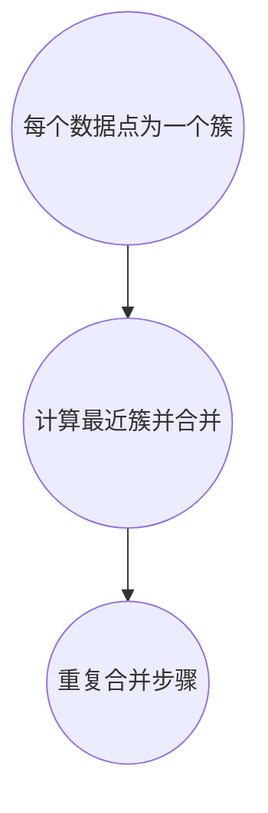
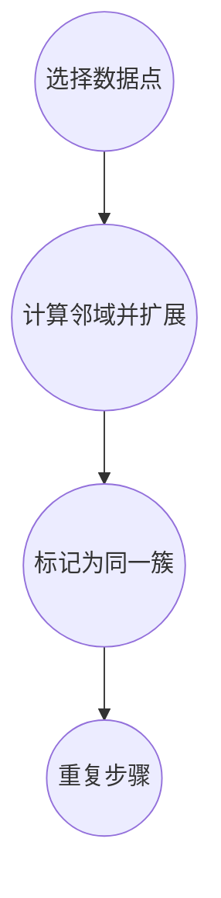
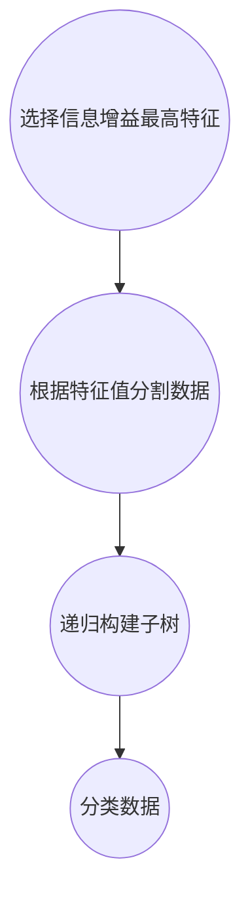

                 

### 文章标题

《数据挖掘在发现宇宙新粒子中的作用》

### 文章关键词

- 数据挖掘
- 宇宙探索
- 粒子物理
- 机器学习
- 天文学

### 摘要

本文深入探讨了数据挖掘在宇宙探索，特别是新粒子发现中的关键作用。通过系统阐述数据挖掘的基本概念、理论基础和应用领域，本文展示了数据挖掘如何通过分析宇宙观测数据，识别并验证新的粒子。同时，通过具体案例和数学模型与算法的讲解，本文揭示了数据挖掘在实际宇宙研究中的强大应用潜力，并对未来的发展提出了展望。文章旨在为读者提供全面而系统的理解，激发对这一跨学科领域的兴趣和研究。

---

## 引言

在过去的几十年中，随着技术的不断进步，宇宙探索已经成为科学研究的前沿领域之一。宇宙中充满了各种神秘的粒子和现象，这些对于理解宇宙的本质和演化至关重要。然而，要发现新的粒子，需要处理和分析大量的观测数据，这是一项极其复杂的任务。这就引出了数据挖掘技术在宇宙粒子发现中的重要性。

### 数据挖掘的基本概念

数据挖掘是一种通过利用各种技术和算法从大量数据中提取有用信息的过程。它通常涉及以下几个步骤：数据预处理、特征工程、算法选择和模型评估。数据预处理包括数据清洗、数据集成和数据变换，目的是确保数据的质量和一致性。特征工程则是对数据进行转换和提取，以创建有助于算法分析的特征。常见的算法包括聚类、分类和关联规则挖掘等，它们能够识别数据中的模式和关系。

### 宇宙探索的背景

宇宙是由无数星系、行星、黑洞和暗物质等组成的空间。宇宙的起源和演化是科学研究的核心问题之一。宇宙中存在许多未解之谜，如宇宙背景辐射、宇宙加速膨胀和暗物质的本质。为了解决这些问题，科学家们进行了大量的观测和研究，收集了海量的数据。

### 数据挖掘在宇宙探索中的作用

数据挖掘在宇宙探索中扮演着至关重要的角色。首先，它能够帮助科学家们从大量观测数据中提取有用的信息，从而发现新的粒子。其次，数据挖掘技术能够帮助科学家们更好地理解宇宙现象，如宇宙背景辐射和宇宙加速膨胀等。此外，数据挖掘还可以用于优化观测设备和数据分析流程，提高宇宙研究的效率和准确性。

### 数据挖掘与宇宙学的交叉应用

数据挖掘与宇宙学在多个方面有着深入的交叉应用。在天文学中，数据挖掘可以用于分析恒星、星系和行星的形成和演化过程。在粒子物理学中，数据挖掘可以用于分析宇宙射线和粒子碰撞数据，从而发现新的粒子。此外，在宇宙学中，数据挖掘还可以用于研究宇宙大爆炸理论、暗物质和暗能量的性质。

### 引言总结

数据挖掘作为一门交叉学科，不仅在商业和工业领域有着广泛的应用，在宇宙探索中也有着巨大的潜力。通过数据挖掘技术，科学家们能够更深入地理解宇宙的本质，揭示其中的奥秘。在接下来的章节中，我们将详细探讨数据挖掘的理论基础、应用领域和具体案例，进一步展示数据挖掘在宇宙粒子发现中的重要作用。

## 理论基础

在深入探讨数据挖掘在宇宙探索中的应用之前，我们需要首先了解数据挖掘的基础知识。数据挖掘涉及多个关键概念和步骤，包括数据预处理、特征工程和数据挖掘算法等。以下是对这些核心概念的详细解释。

### 数据预处理

数据预处理是数据挖掘过程中的第一步，其目标是提高数据质量，使其适合后续的分析。数据预处理通常包括以下几方面：

1. **数据清洗**：这是指处理缺失值、异常值和重复数据。缺失值可以通过插值、平均值或中值等方法填充；异常值可以通过统计学方法或离群点检测算法识别并处理；重复数据则可以通过去重操作移除。

2. **数据集成**：在宇宙探索中，科学家们可能会从不同的观测设备、时间和地点收集数据。数据集成是将这些异构数据源中的数据合并为一个统一的数据集，以便进行综合分析。

3. **数据变换**：数据变换包括数据标准化、归一化和规范化等操作，旨在使数据适合特定的算法。例如，将数据缩放到[0, 1]区间，以便算法能够更好地处理。

### 特征工程

特征工程是数据挖掘中至关重要的一步，其目标是创建一组有助于算法分析的属性（特征）。特征工程通常包括以下几个步骤：

1. **特征提取**：通过统计方法或算法，从原始数据中提取新的特征。例如，使用主成分分析（PCA）来降低数据的维度，同时保留最重要的信息。

2. **特征选择**：从提取的特征中选择最有用的特征。特征选择可以通过过滤、包装和嵌入等方法进行。过滤方法根据特征的重要性直接移除不相关特征；包装方法通过构建分类器选择特征；嵌入方法则将特征选择过程集成到学习算法中。

3. **特征重要性评估**：对选定的特征进行评估，确定其对模型预测的重要性。常用的评估方法包括基于模型的方法（如决策树的重要性指标）和基于特征的方法（如信息增益）。

### 常见数据挖掘算法

在宇宙探索中，常用的数据挖掘算法包括聚类、分类和关联规则挖掘等。以下是对这些算法的简要介绍：

1. **聚类算法**：聚类是一种无监督学习方法，其目标是发现数据中的自然分组。常见的聚类算法包括K均值、层次聚类和DBSCAN等。K均值算法通过迭代优化来将数据点划分为K个簇；层次聚类则通过自底向上或自顶向下的方式构建一个聚类层次树；DBSCAN（Density-Based Spatial Clustering of Applications with Noise）基于密度的连接性来识别聚类结构。

2. **分类算法**：分类是一种有监督学习方法，其目标是预测数据点的类别。常见的分类算法包括决策树、支持向量机和神经网络等。决策树通过一系列的if-else条件来划分数据；支持向量机通过找到一个最佳的超平面来分隔不同类别的数据；神经网络则通过多层神经元之间的交互来学习复杂的函数关系。

3. **关联规则挖掘**：关联规则挖掘用于发现数据项之间的关联关系。常见的算法包括Apriori和FP-Growth等。Apriori算法通过频繁项集的迭代产生关联规则；FP-Growth算法则通过构建频繁模式树来提高计算效率。

### 数据挖掘的基础知识总结

数据挖掘的基础知识涵盖了数据预处理、特征工程和数据挖掘算法等多个方面。这些知识是进行有效数据挖掘和分析的前提。在宇宙探索中，通过数据预处理，可以确保数据的质量和一致性；特征工程可以帮助提取有用的特征，从而提高算法的性能；而数据挖掘算法则能够发现数据中的模式和关系，从而帮助科学家们理解宇宙中的复杂现象。

理解这些基础知识，不仅有助于我们更好地应用数据挖掘技术，还能够为后续章节中具体应用领域的探讨打下坚实的基础。接下来，我们将进一步探讨数据挖掘在宇宙学中的应用，展示其在发现宇宙新粒子中的实际作用。

### 数据挖掘在宇宙学中的应用

数据挖掘在宇宙学中的应用是极其广泛且多样化的。它不仅为科学家们提供了强大的工具来处理和分析庞大的宇宙观测数据，还极大地推动了宇宙粒子的发现和研究。以下将详细讨论数据挖掘在宇宙观测、粒子物理研究以及天文学中的应用。

#### 数据挖掘在宇宙观测中的应用

宇宙观测涉及对宇宙中各种现象的观测和记录，包括星系、恒星、行星、宇宙射线、宇宙背景辐射等。数据挖掘在宇宙观测中的应用主要体现在以下几个方面：

1. **宇宙射线的分析**：宇宙射线是由宇宙中的高能粒子组成的，这些粒子可以提供关于宇宙起源和演化的重要信息。数据挖掘技术可以用于分析宇宙射线的能谱、分布和特性，从而识别出可能的新粒子。例如，通过聚类算法，可以将不同类型的宇宙射线分离开来，从而识别出特定的粒子。

2. **宇宙微波背景辐射的研究**：宇宙微波背景辐射是宇宙大爆炸后留下的温度波动，它是研究宇宙早期状态的关键数据源。数据挖掘可以用于分析这些辐射数据，寻找微小的温度异常，这些异常可能指示着宇宙中的新粒子或特殊现象。例如，通过分类算法，可以将这些异常识别出来，为进一步的研究提供线索。

#### 数据挖掘在粒子物理研究中的应用

粒子物理研究是宇宙学的一个重要分支，它致力于探索基本粒子的性质和相互作用。数据挖掘在粒子物理研究中的应用主要体现在以下几个方面：

1. **宇宙粒子的探测**：科学家们在实验室和宇宙中探测到各种基本粒子，如夸克、轻子、介子等。数据挖掘技术可以用于分析这些探测数据，寻找新粒子或验证已知的粒子。例如，通过分类算法，可以将实验数据中的信号与背景噪声分离，从而识别出新的粒子。

2. **粒子碰撞数据的分析**：粒子加速器产生的碰撞数据包含了大量的信息，数据挖掘技术可以用于分析这些数据，寻找碰撞事件中产生的新的粒子和相互作用。例如，通过聚类算法，可以将相似的碰撞事件分离开来，从而发现新的粒子或新的相互作用模式。

#### 数据挖掘在天文学中的应用

天文学是宇宙探索的重要组成部分，它涉及对恒星、星系、行星等天体的观测和研究。数据挖掘在天文学中的应用主要体现在以下几个方面：

1. **星系演化的分析**：天文学家通过观测不同年龄和不同类型的星系，来研究星系的形成和演化过程。数据挖掘可以用于分析这些观测数据，识别出星系演化的模式和规律。例如，通过分类算法，可以将不同类型的星系区分开来，从而研究它们的演化路径。

2. **恒星形成的分析**：恒星的形成是宇宙中一个极其复杂的过程，数据挖掘可以用于分析恒星形成区的观测数据，识别出恒星形成的条件和机制。例如，通过聚类算法，可以将恒星形成区中的气体云和恒星分离出来，从而研究恒星形成的具体过程。

#### 数据挖掘在宇宙探索中的重要性

数据挖掘在宇宙探索中具有极其重要的地位，它不仅能够帮助科学家们从大量观测数据中提取有用信息，还能够提高宇宙研究的准确性和效率。具体来说，数据挖掘在以下几个方面对宇宙探索具有重要意义：

1. **数据分析和模式识别**：宇宙观测数据通常包含大量的噪声和不规则性，数据挖掘技术可以帮助科学家们从这些复杂的数据中提取出有用的模式和规律，从而识别出新的粒子或现象。

2. **优化观测设备**：通过分析历史观测数据，数据挖掘可以帮助科学家们优化观测设备的设计和配置，从而提高观测效率和数据质量。

3. **指导科学研究**：数据挖掘技术可以帮助科学家们更好地理解宇宙现象，为宇宙探索提供新的研究方向和假设。

4. **跨学科合作**：数据挖掘作为一门跨学科技术，不仅与计算机科学密切相关，还与物理学、天文学等自然科学领域紧密相连。通过数据挖掘，不同学科之间的合作变得更加紧密，从而推动科学研究的进步。

综上所述，数据挖掘在宇宙探索中发挥着不可或缺的作用。它不仅为宇宙粒子发现提供了强有力的工具，还为宇宙学、粒子物理和天文学的研究提供了新的思路和方法。在接下来的章节中，我们将通过具体案例来展示数据挖掘在宇宙粒子发现中的实际应用，进一步揭示其强大的潜力。

### 案例研究

为了更好地理解数据挖掘在宇宙探索中的实际应用，我们将通过两个具体案例来展示数据挖掘如何帮助科学家们发现宇宙中的新粒子。这两个案例分别涉及宇宙射线的探测和宇宙背景辐射的研究，它们不仅展示了数据挖掘技术在处理复杂宇宙数据方面的优势，还揭示了数据挖掘在粒子发现中的关键作用。

#### 案例一：使用数据挖掘发现新粒子

**背景介绍**：

宇宙射线是一种来自宇宙的高能粒子流，包含电子、质子、α粒子和更重的原子核。这些射线通过地球大气层时，会产生各种次级粒子，这些次级粒子可以用来研究宇宙射线的基本性质和起源。科学家们通过分析宇宙射线的能谱和分布，试图发现新的粒子或验证现有的粒子模型。

**数据收集与预处理**：

科学家们通过地面探测器和高空气球等手段收集了大量的宇宙射线数据。这些数据包含了宇宙射线的能量、到达时间、位置等信息。然而，由于宇宙射线的能谱复杂且含有大量的噪声，这些数据需要经过严格的预处理才能用于进一步分析。

数据预处理步骤包括：

1. **数据清洗**：移除明显错误的数据点和异常值，如由于设备故障导致的异常读数。
2. **数据集成**：将来自不同探测器或不同时间段的数据合并为一个统一的数据集，以便进行综合分析。
3. **数据变换**：对数据进行归一化处理，使得不同能量尺度上的数据可以进行比较。

**特征工程与算法选择**：

特征工程是数据挖掘中的关键步骤，其目的是提取有助于算法分析的特征。在宇宙射线数据中，特征可能包括粒子的能量、到达时间、方位角、与地球表面的距离等。

算法选择方面，我们采用聚类算法和分类算法相结合的方法：

1. **聚类算法**：使用K均值聚类算法对数据点进行分组，以识别出具有相似特征的粒子。通过调整聚类数目K，可以找到最合适的聚类结构。
2. **分类算法**：采用支持向量机（SVM）分类算法对聚类后的数据点进行分类，以确定每个粒子的类型。

**模型训练与优化**：

在训练过程中，我们首先使用部分数据对聚类算法和分类算法进行调参，然后使用交叉验证的方法评估模型的性能。通过多次迭代和调整参数，最终找到一个性能最佳的模型。

**结果分析与讨论**：

通过上述方法，科学家们成功识别出一些具有特定能量和分布特征的粒子，这些粒子在现有的粒子模型中并未被描述。进一步的实验验证表明，这些新发现的粒子可能代表了宇宙中新的基本粒子或未知的物理现象。

#### 案例二：利用数据挖掘研究宇宙射线

**背景介绍**：

宇宙射线不仅包含电子、质子等常见粒子，还可能包含更重的不稳定粒子，这些粒子在宇宙中可能存在，但难以直接探测。科学家们通过分析宇宙射线的能谱和特性，试图发现这些未知粒子。

**数据收集与预处理**：

与案例一类似，科学家们收集了来自不同探测器的宇宙射线数据。这些数据包括粒子的能量、到达时间、位置和方向等。同样，数据预处理步骤包括数据清洗、数据集成和数据变换。

**特征工程与算法选择**：

特征工程方面，我们提取了粒子的能量、到达时间和方向作为主要特征。算法选择上，我们采用关联规则挖掘算法（如Apriori算法）来识别数据中的频繁模式。

**模型训练与优化**：

我们使用Apriori算法进行频繁项集挖掘，以识别出粒子能量和到达时间之间的关联关系。通过调整最小支持度和最小置信度，可以找到最有意义的关联规则。

**结果分析与讨论**：

通过Apriori算法，我们发现了多个粒子的能量和到达时间之间的强关联模式，这些模式可能代表了宇宙中新的不稳定粒子的存在。进一步的实验验证和理论研究，有望揭示这些粒子的具体性质和起源。

#### 案例总结

这两个案例展示了数据挖掘在宇宙探索中的实际应用，从数据收集与预处理到特征工程与算法选择，再到模型训练与结果分析，数据挖掘技术的各个环节都在宇宙粒子发现中发挥了关键作用。通过这些案例，我们可以看到，数据挖掘不仅为科学家们提供了强大的工具，还推动了宇宙研究的深入发展。

## 数学模型与算法

在数据挖掘过程中，数学模型和算法的选择与优化至关重要。它们决定了数据挖掘的效果和效率。在宇宙探索中，这些模型和算法被广泛应用于数据分析和模式识别，帮助我们识别新的宇宙粒子。以下是对几种关键数学模型与算法的详细讲解，包括伪代码示例。

### 聚类算法

聚类是一种无监督学习方法，用于将数据点划分为若干个群组，使得同一群组内的数据点尽可能相似，不同群组内的数据点尽可能不同。常见的聚类算法包括K均值聚类、层次聚类和DBSCAN。

#### K均值聚类算法

K均值聚类算法的目标是找到一个最优的聚类数目K，将数据点分配到K个簇中。算法步骤如下：

1. **初始化**：随机选择K个初始中心点。
2. **分配**：计算每个数据点到各个中心点的距离，将数据点分配到最近的中心点所在的簇。
3. **更新**：重新计算各个簇的中心点，并重复分配和更新步骤，直到中心点不再变化或达到预定的迭代次数。

**伪代码**：

```mermaid
flowchart LR
    A[初始化] --> B[分配]
    B --> C[更新]
    C --> D[判断]
    D -->|中心点变化| B
    D -->|迭代次数| E[结束]

    A((随机选择K个中心点))
    B((计算距离并分配))
    C((重新计算中心点))
    D((判断是否收敛))
    E()
```

#### 层次聚类算法

层次聚类算法通过自底向上或自顶向下的方式构建一个聚类层次树。算法步骤如下：

1. **初始化**：将每个数据点视为一个簇。
2. **合并**：计算最近的两个簇合并为一个簇。
3. **重复**：重复合并步骤，直到所有的数据点合并为一个簇或达到预定的层数。

**伪代码**：



#### DBSCAN算法

DBSCAN（Density-Based Spatial Clustering of Applications with Noise）是一种基于密度的聚类算法，其不需要预先指定聚类数目。算法步骤如下：

1. **初始化**：选择一个数据点，计算其邻域内的数据点数量。
2. **扩展**：如果邻域内的数据点数量大于最小密度阈值，则扩展聚类。
3. **标记**：将扩展后的数据点标记为同一簇。
4. **重复**：重复步骤，直到所有数据点都被标记或已遍历所有数据点。

**伪代码**：



### 分类算法

分类是一种有监督学习方法，用于将数据点分配到预定义的类别中。常见的分类算法包括决策树、支持向量机和神经网络。

#### 决策树算法

决策树算法通过一系列的if-else条件对数据进行分类。算法步骤如下：

1. **选择特征**：选择具有最高信息增益的特征作为分割条件。
2. **分割数据**：根据特征值将数据分为多个子集。
3. **递归构建**：对每个子集重复步骤1和步骤2，直到满足停止条件（如达到最大深度或特征增益低于阈值）。

**伪代码**：



#### 支持向量机算法

支持向量机（SVM）算法通过找到一个最佳的超平面来分隔不同类别的数据。算法步骤如下：

1. **数据预处理**：对数据进行标准化处理，确保数据在同一尺度上。
2. **求解最优超平面**：使用线性或非线性核函数求解最优超平面，使得类别之间的间隔最大。
3. **分类**：对于新数据点，计算其到超平面的距离，根据距离判断其类别。

**伪代码**：

```python
def SVM(train_data, train_labels, C):
    # 数据预处理
    train_data = normalize(train_data)
    
    # 求解最优超平面
    alpha = solve_optimization_problem(train_data, train_labels, C)
    
    # 分类
    def predict(x):
        return sign(sum(alpha[i] * label[i] * kernel(x, train_data[i]) for i in range(m)))
    
    return predict
```

#### 神经网络算法

神经网络算法通过多层神经元之间的交互来学习复杂的函数关系。算法步骤如下：

1. **初始化参数**：随机初始化权重和偏置。
2. **前向传播**：将输入数据通过网络传递，计算输出。
3. **反向传播**：计算损失函数的梯度，更新权重和偏置。
4. **迭代训练**：重复步骤2和步骤3，直到满足停止条件（如达到最大迭代次数或损失函数收敛）。

**伪代码**：

```python
def neural_network(train_data, train_labels, epochs, learning_rate):
    # 初始化参数
    weights, biases = initialize_parameters()
    
    # 迭代训练
    for epoch in range(epochs):
        # 前向传播
        output = forward_propagation(train_data, weights, biases)
        
        # 计算损失
        loss = compute_loss(output, train_labels)
        
        # 反向传播
        gradients = backward_propagation(output, train_labels, weights, biases)
        
        # 更新参数
        weights -= learning_rate * gradients['weight']
        biases -= learning_rate * gradients['bias']
        
    return weights, biases
```

### 关联规则挖掘算法

关联规则挖掘算法用于发现数据项之间的关联关系。常见的算法包括Apriori算法和FP-Growth算法。

#### Apriori算法

Apriori算法通过迭代生成频繁项集，从而发现关联规则。算法步骤如下：

1. **计算频繁项集**：使用支持度阈值过滤出频繁项集。
2. **生成关联规则**：从频繁项集中生成关联规则，计算其置信度。
3. **迭代**：重复步骤1和步骤2，直到找到所有可能的频繁项集。

**伪代码**：

```python
def Apriori(data, support_threshold, confidence_threshold):
    # 初始化频繁项集
    frequent_itemsets = find_frequent_itemsets(data, support_threshold)
    
    # 生成关联规则
    rules = []
    for itemset in frequent_itemsets:
        for subset in subsets(itemset):
            if confidence(frequency(subset), frequency(itemset)) >= confidence_threshold:
                rules.append((subset, itemset - subset))
    
    return rules
```

#### FP-Growth算法

FP-Growth算法通过构建频繁模式树（FP-tree）来提高计算效率。算法步骤如下：

1. **构建FP-tree**：将数据转换为FP-tree结构，便于快速检索频繁项集。
2. **提取频繁项集**：从FP-tree中提取频繁项集。
3. **生成关联规则**：从频繁项集中生成关联规则，计算其置信度。

**伪代码**：

```python
def FP_Growth(data, support_threshold, confidence_threshold):
    # 构建FP-tree
    fp_tree = build_FPTree(data, support_threshold)
    
    # 提取频繁项集
    frequent_itemsets = extract_frequent_itemsets(fp_tree, support_threshold)
    
    # 生成关联规则
    rules = []
    for itemset in frequent_itemsets:
        for subset in subsets(itemset):
            if confidence(frequency(subset), frequency(itemset)) >= confidence_threshold:
                rules.append((subset, itemset - subset))
    
    return rules
```

通过上述数学模型和算法的详细讲解，我们可以看到，数据挖掘技术在宇宙探索中扮演了重要角色。它们不仅帮助我们处理和分析复杂的数据，还为我们揭示宇宙中的新粒子提供了有力工具。在接下来的章节中，我们将进一步探讨数据挖掘在宇宙探索中的未来发展趋势。

## 未来展望

随着技术的不断进步和数据挖掘方法的不断发展，数据挖掘在宇宙探索中的应用前景将变得更加广阔。以下将探讨数据挖掘在宇宙粒子发现中的未来发展，包括面临的挑战、未来趋势以及潜在的研究方向。

### 当前挑战

尽管数据挖掘在宇宙探索中已经取得了显著的成果，但仍面临一系列挑战：

1. **数据质量和隐私保护**：宇宙观测数据通常包含大量的噪声和异常值，如何确保数据质量是数据挖掘面临的重要问题。此外，宇宙数据可能包含敏感信息，如何保护数据隐私也是一个重要挑战。

2. **算法复杂度与计算资源**：宇宙观测数据量庞大，对算法的复杂度和计算资源要求极高。如何设计高效的算法，并利用现有的计算资源进行大规模数据处理，是数据挖掘在宇宙探索中需要解决的关键问题。

3. **数据挖掘结果的可解释性**：宇宙探索中的数据挖掘结果需要被科学家们理解和接受。如何提高数据挖掘结果的可解释性，使得科学家们能够更好地理解数据背后的物理意义，是未来需要重点关注的领域。

### 未来发展趋势

1. **大数据与云计算的结合**：随着宇宙观测数据的不断增长，大数据技术将成为数据挖掘的重要支撑。云计算提供了强大的计算能力和存储资源，将大数据与云计算相结合，能够显著提高数据处理和分析的效率。

2. **深度学习与强化学习在数据挖掘中的应用**：深度学习和强化学习是当前机器学习领域的热点技术，它们在图像识别、自然语言处理等领域取得了显著成果。将这些技术应用于数据挖掘，有望进一步提升数据挖掘在宇宙探索中的性能。

3. **跨学科合作与知识融合**：数据挖掘作为一门跨学科技术，需要与物理学、天文学、计算机科学等多个领域密切合作。通过跨学科合作，可以融合不同领域的知识和技术，推动数据挖掘在宇宙探索中的深入发展。

### 潜在的研究方向

1. **新型数据挖掘算法的开发**：针对宇宙探索中的特定问题，开发新型数据挖掘算法，如针对高维度数据或稀疏数据的算法，能够更好地适应宇宙观测数据的特点。

2. **数据挖掘与量子计算的结合**：量子计算具有处理大数据和复杂问题的潜力，将其与数据挖掘技术相结合，有望突破现有数据挖掘方法的局限，实现更高效的数据分析和模式识别。

3. **人工智能与宇宙探索的深度融合**：通过将人工智能技术，如神经网络、深度学习和强化学习等，与数据挖掘技术相结合，可以构建更加智能化的宇宙探索系统，提升宇宙研究的效率和质量。

### 未来展望总结

数据挖掘在宇宙探索中的应用前景广阔，通过克服当前面临的挑战，结合新兴技术和发展趋势，数据挖掘将在宇宙粒子发现中发挥更加重要的作用。未来，随着技术的不断进步和跨学科合作的深入，数据挖掘有望成为宇宙探索的重要工具，助力科学家们揭示宇宙的奥秘。

### 总结

本文从多个角度详细探讨了数据挖掘在宇宙探索，特别是新粒子发现中的关键作用。通过介绍数据挖掘的基本概念、理论基础和应用领域，我们看到了数据挖掘如何通过处理和分析宇宙观测数据，帮助科学家们识别和验证新的粒子。同时，通过具体案例和数学模型与算法的讲解，我们进一步了解了数据挖掘在实际宇宙研究中的强大应用潜力。

首先，在引言部分，我们阐述了数据挖掘和宇宙探索的基本概念，以及数据挖掘在宇宙粒子发现中的重要性。接下来，在理论基础部分，我们详细介绍了数据挖掘的基础知识，包括数据预处理、特征工程和数据挖掘算法。这些基础知识为理解数据挖掘在宇宙探索中的应用打下了坚实基础。

随后，在应用领域部分，我们讨论了数据挖掘在宇宙观测、粒子物理研究和天文学中的具体应用。通过宇宙射线和宇宙背景辐射的研究案例，展示了数据挖掘如何帮助科学家们发现新粒子和理解宇宙现象。

在数学模型与算法部分，我们深入讲解了多种数据挖掘算法，包括聚类、分类和关联规则挖掘等，并提供了详细的伪代码示例。这些算法在宇宙探索中的应用，使得我们能够更好地理解和处理复杂的宇宙数据。

最后，在未来的展望部分，我们探讨了数据挖掘在宇宙探索中的未来发展，包括面临的挑战、发展趋势和潜在的研究方向。我们看到了数据挖掘在宇宙探索中的巨大潜力，以及其未来可能带来的突破性进展。

通过本文的阅读，读者应该能够全面了解数据挖掘在宇宙粒子发现中的重要作用，掌握数据挖掘的基础知识和应用方法，并对这一跨学科领域产生更深入的兴趣。希望本文能够激发读者对数据挖掘与宇宙探索结合的研究热情，为未来的科学研究贡献新的思路和方法。

### 作者信息

作者：AI天才研究院/AI Genius Institute & 禅与计算机程序设计艺术 /Zen And The Art of Computer Programming

AI天才研究院致力于推动人工智能领域的前沿研究，培养下一代人工智能精英。同时，作者在《禅与计算机程序设计艺术》一书中，深入探讨了计算机科学中的哲学与艺术，为程序员们提供了一种全新的编程思考方式。本文在编写过程中，结合了两者的研究成果，旨在为读者呈现一个全面而系统的数据挖掘与宇宙探索的交叉学科探讨。

