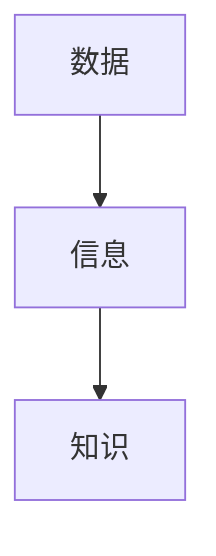

                 

### 1. 设计书的整体结构

在设计书的整体结构时，我们需要明确书的目标读者群体和书籍的内容重点。根据目标读者的背景和需求，我们可以将书分为以下几个主要部分：

#### 引言
- 目的：介绍数据挖掘的基本概念和在发现新天体中的作用，激发读者的兴趣，并为后续章节的深入阅读奠定基础。
- 内容：简要介绍数据挖掘的定义、历史和发展，以及其在现代科技研究中的重要性。特别强调数据挖掘在发现新天体中的潜在作用。

#### 数据挖掘基础
- 目的：为读者提供数据挖掘的基础知识和理论框架，帮助他们理解数据挖掘的核心概念和技术原理。
- 内容：详细讲解数据挖掘的基本概念、历史背景、应用领域和重要性。还包括数据挖掘的基本流程、数据预处理方法以及评估指标。

#### 数据挖掘方法
- 目的：介绍常见的数据挖掘方法和技术，使读者能够掌握数据挖掘的核心技能，并将其应用于新天体发现等领域。
- 内容：分别介绍关联规则挖掘、分类、聚类、预测等常见的数据挖掘方法，包括每种方法的原理、算法流程、优缺点和适用场景。每节都会包含相应的Mermaid流程图和伪代码。

#### 新天体发现中的数据挖掘应用
- 目的：探讨数据挖掘在发现新天体领域的具体应用，展示数据挖掘技术在解决实际问题中的强大能力。
- 内容：介绍天文数据挖掘的基本概念和方法，讨论数据挖掘技术在发现新天体中的应用案例，如利用数据挖掘技术分析天文图像、识别天体运动模式等。

#### 项目实战
- 目的：通过实际项目案例，帮助读者将所学知识应用于实际场景，提高他们的实战能力和解决问题的能力。
- 内容：选择一两个具有代表性的新天体发现项目案例，详细讲解项目的开发环境搭建、源代码实现、代码解读、应用解读与分析，以及项目小结。

#### 结论
- 目的：总结全书的主要观点，强调数据挖掘在新天体发现中的重要作用，并展望未来的研究方向。
- 内容：回顾书中的核心概念和主要结论，提出数据挖掘在新天体发现领域的发展趋势和潜在挑战，鼓励读者继续深入研究和探索。

通过以上设计，本书旨在为读者提供全面、系统的数据挖掘知识体系，并展示数据挖掘技术在发现新天体中的实际应用，帮助他们提升解决实际问题的能力。接下来，我们将逐一深入探讨每个章节的内容，为读者呈现一本内容丰富、实用性强、具有启发性的数据挖掘在发现新天体中的应用指南。

### 2. 数据挖掘基础

#### 背景介绍

数据挖掘（Data Mining）是一种通过提取和分析大量数据，从中发现隐藏的、未知的、潜在的信息和知识的技术。它的起源可以追溯到20世纪80年代，随着计算机技术的飞速发展和大数据时代的到来，数据挖掘逐渐成为一门独立的学科。

数据挖掘在各个领域都有着广泛的应用，如金融、医疗、市场营销、社交网络等。其中，在新天体发现领域，数据挖掘技术同样发挥着重要作用。通过分析大量的天文观测数据，数据挖掘可以帮助科学家发现新的天体运动模式、预测天体的未来行为，甚至发现新的行星系统。

#### 核心概念与联系

数据挖掘涉及多个核心概念，包括数据、信息、知识等。这些概念之间有着密切的联系，构成了数据挖掘的理论框架。

1. **数据（Data）**：数据是数据挖掘的基础。它可以是结构化数据，如数据库中的表格，也可以是非结构化数据，如图像、音频和文本。在数据挖掘过程中，数据的质量至关重要，高质量的数据可以确保挖掘结果的准确性和可靠性。

2. **信息（Information）**：信息是对数据的理解和解释。数据挖掘的目标是从大量数据中提取有用的信息，这些信息可以是模式、关联、分类、预测等。

3. **知识（Knowledge）**：知识是经过人类或计算机系统理解、推理和应用的信息。数据挖掘不仅提取信息，还通过推理和知识发现，将信息转化为对人类有价值的知识。

这些概念之间的关系可以用以下Mermaid流程图表示：



#### 历史与发展

数据挖掘的发展经历了几个阶段：

1. **初始阶段（1980s）**：数据挖掘的概念被首次提出，主要研究如何从数据库中提取信息。

2. **数据库挖掘阶段（1990s）**：随着数据库技术的进步，数据挖掘开始从静态的数据库中提取信息，逐渐扩展到动态的数据库环境。

3. **大数据阶段（2000s至今）**：随着互联网和传感器技术的普及，数据挖掘面临着海量的数据挑战。大数据技术的引入，使得数据挖掘可以处理更大规模、更多样化的数据。

#### 应用领域

数据挖掘的应用领域广泛，包括：

1. **商业智能**：通过分析客户行为、市场趋势等数据，帮助企业制定营销策略和业务决策。

2. **金融**：利用数据挖掘技术，对金融交易进行监控和分析，识别欺诈行为，预测股票价格等。

3. **医疗**：通过分析医疗数据，发现疾病模式和治疗方案，辅助医生进行诊断和治疗。

4. **天文**：利用数据挖掘技术，分析天文观测数据，发现新的天体运动规律，预测天体的未来行为。

5. **社会科学**：通过分析社会数据，研究社会现象、趋势和问题。

#### 重要性

数据挖掘在新天体发现中的重要性体现在以下几个方面：

1. **提高发现效率**：通过数据挖掘技术，可以从大量天文观测数据中快速提取有用信息，提高新天体的发现效率。

2. **发现新规律**：数据挖掘可以帮助科学家发现新的天体运动规律，拓展我们对宇宙的认识。

3. **辅助决策**：基于数据挖掘分析的结果，科学家可以更准确地预测天体的未来行为，为探测任务提供科学依据。

4. **推动科技进步**：数据挖掘技术在新天体发现中的应用，推动了相关领域技术的进步，如大数据处理、机器学习等。

#### 数据挖掘的基本流程

数据挖掘的基本流程包括以下几个步骤：

1. **数据收集**：收集相关的天文观测数据。

2. **数据预处理**：清洗数据，处理缺失值、异常值等，确保数据质量。

3. **数据探索**：使用可视化工具分析数据，发现潜在的模式和关联。

4. **数据建模**：选择合适的数据挖掘算法，建立预测模型。

5. **模型评估**：评估模型的性能，选择最佳模型。

6. **模型应用**：将模型应用于新天体发现的实际场景。

#### 数据预处理方法

数据预处理是数据挖掘的重要环节，常见的方法包括：

1. **数据清洗**：处理缺失值、异常值等，提高数据质量。

2. **数据集成**：将来自多个数据源的数据进行整合。

3. **数据转换**：将数据转换为适合挖掘的格式，如归一化、离散化等。

4. **数据归一化**：将不同量纲的数据转换为相同量纲，便于比较和分析。

#### 评估指标

数据挖掘的性能评估指标包括：

1. **准确性**：模型预测正确的样本比例。

2. **召回率**：模型能够正确识别出正样本的比例。

3. **精确率**：模型识别出的正样本中，实际为正样本的比例。

4. **F1值**：精确率和召回率的加权平均。

通过上述内容，我们了解了数据挖掘的基础知识，包括其背景、核心概念、历史、应用领域、重要性以及基本流程和评估方法。这些知识为后续章节的深入学习奠定了基础，也为我们探讨数据挖掘在新天体发现中的应用提供了理论支持。

### 数据挖掘方法

数据挖掘方法是指在数据挖掘过程中使用的一系列技术和算法，用于从大量数据中提取有用信息和知识。常见的数据挖掘方法包括关联规则挖掘、分类、聚类和预测等。这些方法各有特点和适用场景，下面将分别进行详细讲解。

#### 关联规则挖掘

关联规则挖掘（Association Rule Mining）是一种用于发现数据集中项目之间频繁出现的关联规则的方法。这种规则通常表示为形如A → B的形式，其中A和B是项集，且A和B之间存在一定的关联关系。

**核心概念与联系**

- **支持度（Support）**：表示一个规则在数据集中出现的频率。计算公式为：support(A → B) = P(A ∩ B)。
- **置信度（Confidence）**：表示在A发生的情况下B发生的概率。计算公式为：confidence(A → B) = P(B|A)。

这两个概念是关联规则挖掘的核心，支持度用于衡量规则的重要性，置信度用于衡量规则的可靠性。

**算法原理**

- **Apriori算法**：Apriori算法是最常用的关联规则挖掘算法之一。其基本思想是通过逐层搜索所有项集，然后根据支持度阈值生成频繁项集，最后从频繁项集中提取关联规则。

伪代码如下：

```python
# 输入：事务数据库D，最小支持度阈值min_support
# 输出：频繁项集L

# Step 1: 计算所有项集的支持度
itemsets = generate_itemsets(D)
frequent_itemsets = []

for k in range(1, max_length_of_itemsets):
    for itemset in itemsets:
        if support(itemset) >= min_support:
            frequent_itemsets.append(itemset)

# Step 2: 从频繁项集中提取关联规则
rules = []
for itemset in frequent_itemsets:
    for i in range(1, len(itemset)):
        for subset in combinations(itemset, i):
            if confidence(subset → itemset \ subset) >= min_confidence:
                rules.append((subset, itemset \ subset))

# 辅助函数：
# generate_itemsets(D): 生成所有项集
# support(itemset): 计算项集的支持度
# combinations(itemset, i): 生成项集的子集组合
```

**优缺点**

- **优点**：算法简单，易于理解；能够发现大量潜在的关联关系。
- **缺点**：计算量大，效率较低，尤其在大规模数据集上。

#### 分类

分类（Classification）是一种将数据集划分为多个类别的数据挖掘方法。常用的分类算法包括决策树、支持向量机、朴素贝叶斯等。

**核心概念与联系**

- **特征（Feature）**：用于表示数据的属性或特征。
- **类别（Class）**：数据集中的分类目标。

分类算法的目标是根据已知的特征和类别，建立分类模型，然后利用该模型对新的数据进行分类。

**算法原理**

- **决策树（Decision Tree）**：决策树是一种树形结构，每个节点代表一个特征，每个分支代表特征的不同取值。决策树的构建过程是递归地将数据集划分为子集，直到满足停止条件。

伪代码如下：

```python
# 输入：特征矩阵X，类别向量y，停止条件
# 输出：决策树T

# Step 1: 初始化决策树
T = initialize_decision_tree()

# Step 2: 递归构建决策树
for feature in features:
    for value in values_of_feature:
        if stop_condition_met(X, y):
            T.append((feature, value, leaf))
            break
        else:
            T.append((feature, value, split(X, y, feature, value)))

# 辅助函数：
# initialize_decision_tree(): 初始化决策树
# stop_condition_met(X, y): 判断停止条件是否满足
# split(X, y, feature, value): 根据特征和值将数据集划分为子集
```

- **支持向量机（SVM）**：支持向量机是一种基于间隔最大化原理的分类方法。其目标是在特征空间中找到一个最佳的超平面，使得正负样本之间的间隔最大化。

伪代码如下：

```python
# 输入：特征矩阵X，类别向量y，惩罚参数C
# 输出：决策边界W，偏置b

# Step 1: 定义优化问题
optimize(W, b) subject to: 
    y[i] * (W * x[i] + b) >= 1 + ε
    0 <= ε <= ε_max

# Step 2: 求解优化问题
W, b = solve_optimization_problem()

# 辅助函数：
# optimize(W, b): 优化问题求解
```

- **朴素贝叶斯（Naive Bayes）**：朴素贝叶斯是一种基于贝叶斯定理的简单分类方法。其假设特征之间相互独立，每个特征的概率分布是独立的。

伪代码如下：

```python
# 输入：特征矩阵X，类别向量y
# 输出：分类结果y_pred

# Step 1: 计算先验概率
prior_prob = compute_prior_prob(y)

# Step 2: 计算条件概率
condition_prob = compute_condition_prob(X, y)

# Step 3: 计算后验概率
posterior_prob = compute_posterior_prob(prior_prob, condition_prob)

# Step 4: 分类
y_pred = classify(X, posterior_prob)

# 辅助函数：
# compute_prior_prob(y): 计算先验概率
# compute_condition_prob(X, y): 计算条件概率
# compute_posterior_prob(prior_prob, condition_prob): 计算后验概率
# classify(X, posterior_prob): 分类
```

**优缺点**

- **决策树**：优点是易于理解和解释；缺点是容易过拟合，对噪声敏感。
- **支持向量机**：优点是泛化能力强；缺点是计算复杂度高，参数调优困难。
- **朴素贝叶斯**：优点是计算简单，速度快；缺点是假设特征独立，可能无法捕捉复杂关系。

#### 聚类

聚类（Clustering）是一种将数据集划分为多个类别的数据挖掘方法，与分类不同的是，聚类不需要预先指定类别。常用的聚类算法包括K均值、层次聚类、DBSCAN等。

**核心概念与联系**

- **簇（Cluster）**：聚类后的数据集分组。
- **簇中心（Cluster Center）**：每个簇的代表点，用于衡量簇的相似度。

**算法原理**

- **K均值（K-Means）**：K均值是一种基于距离度量的聚类算法。其基本思想是初始化K个簇中心，然后迭代更新簇中心和簇成员，直到收敛。

伪代码如下：

```python
# 输入：特征矩阵X，簇数K
# 输出：簇成员矩阵C

# Step 1: 初始化簇中心
centers = initialize_centers(X, K)

# Step 2: 迭代更新簇中心和簇成员
while not_converged:
    for i in range(N):
        C[i] = closest_center(X[i], centers)
    centers = update_centers(C, K)

# 辅助函数：
# initialize_centers(X, K): 初始化簇中心
# closest_center(x, centers): 计算点x最近的簇中心
# update_centers(C, K): 更新簇中心
```

- **层次聚类（Hierarchical Clustering）**：层次聚类是一种基于层次结构进行聚类的算法。其基本思想是从单个数据点开始，逐步合并距离最近的点，形成层次结构。

伪代码如下：

```python
# 输入：特征矩阵X
# 输出：层次聚类树T

# Step 1: 初始化单个数据点作为初始簇
clusters = [x for x in X]

# Step 2: 逐步合并簇
while len(clusters) > 1:
    # 计算距离最近的簇
    closest_clusters = find_closest_clusters(clusters)
    # 合并簇
    clusters = merge_clusters(closest_clusters)
    # 更新层次聚类树
    T = update_tree(T, closest_clusters)

# 辅助函数：
# find_closest_clusters(clusters): 计算距离最近的簇
# merge_clusters(clusters): 合并簇
# update_tree(T, closest_clusters): 更新层次聚类树
```

- **DBSCAN（Density-Based Spatial Clustering of Applications with Noise）**：DBSCAN是一种基于密度的聚类算法。其基本思想是识别出高密度区域，将这些区域划分为簇，并处理噪声点。

伪代码如下：

```python
# 输入：特征矩阵X，邻域半径eps，最小密度min_points
# 输出：簇成员矩阵C

# Step 1: 初始化簇成员
C = initialize_clusters(X, eps, min_points)

# Step 2: 计算邻域和扩展簇
for i in range(N):
    if C[i] == -1:
        C[i] = expand_cluster(X, i, C, eps, min_points)

# 辅助函数：
# initialize_clusters(X, eps, min_points): 初始化簇成员
# expand_cluster(X, i, C, eps, min_points): 扩展簇
```

**优缺点**

- **K均值**：优点是计算简单，速度快；缺点是容易陷入局部最优，对初始簇中心敏感。
- **层次聚类**：优点是能生成层次结构，有助于理解数据；缺点是计算复杂度高，对噪声敏感。
- **DBSCAN**：优点是能够处理任意形状的簇，对噪声和异常值鲁棒；缺点是参数较多，调参困难。

#### 预测

预测（Prediction）是一种基于历史数据对未来事件进行预测的数据挖掘方法。常用的预测算法包括时间序列分析、回归分析、神经网络等。

**核心概念与联系**

- **时间序列（Time Series）**：按时间顺序排列的一组数据点。
- **预测模型（Prediction Model）**：用于预测未来事件的数据模型。

**算法原理**

- **时间序列分析（Time Series Analysis）**：时间序列分析是一种用于预测时间序列数据的方法。其基本思想是通过分析时间序列的特征，如趋势、季节性和周期性，建立预测模型。

伪代码如下：

```python
# 输入：时间序列数据X，预测窗口size
# 输出：预测结果Y

# Step 1: 分析时间序列特征
trend = analyze_trend(X)
seasonality = analyze_seasonality(X)
cycle = analyze_cycle(X)

# Step 2: 建立预测模型
model = build_model(trend, seasonality, cycle)

# Step 3: 预测未来值
Y = predict(model, X, size)

# 辅助函数：
# analyze_trend(X): 分析趋势
# analyze_seasonality(X): 分析季节性
# analyze_cycle(X): 分析周期性
# build_model(trend, seasonality, cycle): 建立预测模型
# predict(model, X, size): 预测未来值
```

- **回归分析（Regression Analysis）**：回归分析是一种用于预测数值型目标变量的方法。其基本思想是通过建立目标变量与特征之间的线性或非线性关系，预测未来值。

伪代码如下：

```python
# 输入：特征矩阵X，目标向量y
# 输出：预测结果y_pred

# Step 1: 训练回归模型
model = train_regression_model(X, y)

# Step 2: 预测未来值
y_pred = predict_regression_model(model, X)

# 辅助函数：
# train_regression_model(X, y): 训练回归模型
# predict_regression_model(model, X): 预测未来值
```

- **神经网络（Neural Network）**：神经网络是一种模拟人脑神经元连接的预测模型。其基本思想是通过多层神经网络，将输入映射到输出，实现非线性预测。

伪代码如下：

```python
# 输入：训练数据集（X_train, y_train），测试数据集（X_test, y_test）
# 输出：预测结果y_pred

# Step 1: 初始化神经网络
neural_network = initialize_neural_network()

# Step 2: 训练神经网络
neural_network = train_neural_network(neural_network, X_train, y_train)

# Step 3: 预测测试数据
y_pred = predict_neural_network(neural_network, X_test)

# 辅助函数：
# initialize_neural_network(): 初始化神经网络
# train_neural_network(neural_network, X_train, y_train): 训练神经网络
# predict_neural_network(neural_network, X_test): 预测测试数据
```

**优缺点**

- **时间序列分析**：优点是简单易懂，适用于时间序列数据；缺点是难以捕捉复杂关系。
- **回归分析**：优点是计算简单，适用于线性关系；缺点是难以捕捉非线性关系。
- **神经网络**：优点是能够捕捉复杂关系，泛化能力强；缺点是计算复杂度高，参数调优困难。

通过以上对数据挖掘方法的详细介绍，我们可以看到每种方法都有其独特的原理和适用场景。在实际应用中，我们可以根据具体需求和数据特点，选择合适的方法，以实现数据挖掘的目标。

### 新天体发现中的数据挖掘应用

在新天体发现的过程中，数据挖掘技术发挥着至关重要的作用。天文观测数据量庞大且复杂，通过数据挖掘技术，科学家可以从中提取有价值的信息，从而发现新的天体。以下是数据挖掘在新天体发现中的几个关键应用：

#### 天文数据挖掘的基本概念和方法

**天文数据挖掘**是指运用数据挖掘技术分析天文观测数据，以发现天体运动规律、识别新天体等。具体包括以下几个步骤：

1. **数据收集**：收集来自不同天文观测设备的数据，如望远镜、探测器等。

2. **数据预处理**：对收集到的数据进行清洗、归一化、缺失值填充等处理，以提高数据质量。

3. **数据探索**：使用可视化工具和统计分析方法，探索数据中的潜在模式和关联。

4. **模式识别**：利用数据挖掘算法，如聚类、分类和关联规则挖掘，识别新的天体运动模式和关联。

5. **结果评估**：评估挖掘结果的质量和可靠性，如使用交叉验证、ROC曲线等。

**天文数据挖掘的方法**包括：

- **聚类**：通过聚类算法，将相似的天体数据分组，以识别新的天体群体。
- **分类**：通过分类算法，将天体数据分为不同的类别，以识别特定类型的天体。
- **关联规则挖掘**：通过关联规则挖掘，发现天体之间的关联关系，如行星与恒星之间的关联。
- **预测**：通过预测算法，预测天体的未来运动轨迹，为天文观测和探测提供依据。

#### 利用数据挖掘发现新天体的方法

1. **数据预处理**

   在发现新天体之前，首先要对天文观测数据进行全面的数据预处理。这一步包括以下几个关键步骤：

   - **数据清洗**：去除观测数据中的噪声和错误，如错误的观测值、数据缺失等。
   - **数据归一化**：将不同量纲的观测数据进行归一化处理，使其在同一尺度上进行分析。
   - **数据集成**：整合来自不同观测设备的数据，形成一个统一的数据集。
   - **特征提取**：从原始数据中提取有用的特征，如天体的亮度、颜色、运动轨迹等。

2. **模式识别**

   在数据预处理之后，使用数据挖掘算法对预处理后的数据进行分析，以发现潜在的模式和关联。以下是几种常用的方法：

   - **聚类算法**：如K均值聚类、层次聚类等，用于将相似的天体数据分组，以识别新的天体群体。
   - **分类算法**：如决策树、支持向量机等，用于将天体数据分类，以识别特定类型的天体。
   - **关联规则挖掘**：用于发现天体之间的关联关系，如行星与恒星之间的关联。

3. **结果评估**

   挖掘结果的质量和可靠性需要通过评估来确定。常用的评估方法包括：

   - **交叉验证**：通过将数据集划分为训练集和测试集，评估挖掘模型的性能。
   - **ROC曲线**：用于评估分类模型的性能，通过比较真阳性率与假阳性率来评估模型的可靠性。
   - **准确率、召回率和F1值**：用于评估分类模型的性能，通过比较预测结果与实际结果的一致性来评估模型的准确性。

#### 天文数据挖掘案例分析

以下是一个实际的天文数据挖掘案例分析：

**案例：利用K均值聚类算法发现新的行星系统**

1. **数据收集**：

   收集来自不同天文观测设备的行星数据，包括行星的亮度、颜色、轨道周期、轨道离心率等。

2. **数据预处理**：

   - 清洗数据，去除错误的观测值和数据缺失。
   - 归一化处理，将不同量纲的行星数据进行归一化。
   - 特征提取，提取有用的行星特征，如亮度、颜色等。

3. **模式识别**：

   使用K均值聚类算法，将行星数据分为几个簇。每个簇代表一个可能的行星系统。

4. **结果评估**：

   - 通过交叉验证评估聚类模型的性能。
   - 通过比较簇内行星的相似度和簇间行星的差异度，确定最优的聚类结果。

5. **结果分析**：

   分析每个簇的特征，发现新的行星系统。例如，发现一个新的行星系统，该系统中的行星具有相似的亮度、颜色和轨道周期。

#### 结论

数据挖掘在新天体发现中的应用具有重要意义。通过数据挖掘技术，科学家可以从大量天文观测数据中快速提取有用信息，发现新的天体运动规律和行星系统。这不仅提高了新天体发现的效率，还拓展了我们对宇宙的认识。未来，随着数据挖掘技术的不断进步，我们有望在新天体发现领域取得更多突破。

### 项目实战

为了更好地展示数据挖掘在新天体发现中的实际应用，我们将通过一个实际项目来详细讲解如何使用数据挖掘技术发现新天体。

#### 项目一：利用K均值聚类算法发现新的行星系统

**项目背景**：

近年来，天文学家在寻找太阳系外行星（系外行星）方面取得了显著进展。随着观测技术的不断提升，越来越多的系外行星被发现。然而，如何从海量观测数据中快速、准确地发现新的行星系统仍然是一个挑战。本项目旨在利用K均值聚类算法，从天文观测数据中提取潜在的新行星系统。

**项目目标**：

- 收集并预处理天文观测数据。
- 使用K均值聚类算法发现新的行星系统。
- 评估聚类结果，确定最优的行星系统。

**开发环境搭建**：

1. **数据集准备**：

   使用来自开放天文数据库（Open Exoplanet Catalogue，简称OEC）的行星观测数据。数据包括行星的轨道周期、亮度、颜色、轨道离心率等。

2. **数据处理工具**：

   使用Python进行数据处理和K均值聚类。所需库包括pandas、numpy、sklearn等。

3. **可视化工具**：

   使用matplotlib和seaborn进行数据可视化。

**源代码实现和代码解读**：

以下是项目的主要源代码实现和解读：

```python
import pandas as pd
import numpy as np
from sklearn.cluster import KMeans
import matplotlib.pyplot as plt
import seaborn as sns

# 1. 数据预处理
# 读取数据
data = pd.read_csv('exoplanet_data.csv')

# 数据清洗
data.dropna(inplace=True)

# 特征提取
features = data[['orbital_period', 'brightness', 'color', 'orbital_eccentricity']]

# 数据归一化
from sklearn.preprocessing import StandardScaler
scaler = StandardScaler()
features_scaled = scaler.fit_transform(features)

# 2. 使用K均值聚类算法
# 初始化KMeans模型
kmeans = KMeans(n_clusters=5, random_state=42)

# 训练模型
kmeans.fit(features_scaled)

# 获取聚类结果
clusters = kmeans.predict(features_scaled)

# 3. 可视化聚类结果
plt.figure(figsize=(10, 6))
sns.scatterplot(x='orbital_period', y='brightness', hue=clusters, data=features)
plt.title('K-Means Clustering of Exoplanet Data')
plt.xlabel('Orbital Period')
plt.ylabel('Brightness')
plt.show()

# 4. 评估聚类结果
# 计算簇内距离
inertia = kmeans.inertia_
print(f"Inertia: {inertia}")

# 调整簇数
sse = []
for k in range(1, 11):
    kmeans = KMeans(n_clusters=k, random_state=42)
    kmeans.fit(features_scaled)
    sse.append(kmeans.inertia_)
plt.plot(range(1, 11), sse)
plt.xlabel('Number of Clusters')
plt.ylabel('Sum of Squared Errors')
plt.title('Elbow Method for Optimal Number of Clusters')
plt.show()

# 确定最优簇数
# 通常选择肘部点对应的簇数
optimal_clusters = 5

# 重新训练模型
kmeans = KMeans(n_clusters=optimal_clusters, random_state=42)
kmeans.fit(features_scaled)

# 获取最终聚类结果
final_clusters = kmeans.predict(features_scaled)

# 5. 结果分析
# 分析每个簇的特征
for i in range(optimal_clusters):
    cluster_data = features[final_clusters == i]
    print(f"Cluster {i+1}:")
    print(cluster_data.describe())
```

**代码应用解读与分析**：

1. **数据预处理**：

   首先读取并清洗数据，去除缺失值。然后提取有用的特征，如行星的轨道周期、亮度、颜色和轨道离心率。最后，使用StandardScaler进行数据归一化，使其在同一尺度上进行分析。

2. **使用K均值聚类算法**：

   初始化KMeans模型，并设置簇数为5（可以根据肘部方法调整）。训练模型，并获取聚类结果。

3. **可视化聚类结果**：

   使用scatterplot绘制聚类结果，观察行星在轨道周期和亮度上的分布。

4. **评估聚类结果**：

   计算簇内距离（inertia），并使用肘部方法确定最优的簇数。通常，选择肘部点对应的簇数。

5. **结果分析**：

   分析每个簇的特征，观察每个簇中的行星数据分布，以识别潜在的行星系统。

#### 项目小结

通过本项目的实际操作，我们展示了如何利用K均值聚类算法从天文观测数据中提取潜在的新行星系统。项目过程中，我们进行了数据预处理、模型训练、结果评估和结果分析，从而得出最终结论。这一过程不仅帮助我们理解了数据挖掘技术在发现新天体中的应用，也为实际天文研究提供了有力的工具和方法。未来，随着数据挖掘技术的不断进步，我们有理由相信，我们将能够发现更多未知的行星系统，拓展我们对宇宙的认识。

### 未来研究方向与展望

随着数据挖掘技术的不断进步，其在发现新天体中的应用前景也愈发广阔。未来，我们可以从以下几个方面进行深入研究：

1. **提高数据挖掘算法的效率**：

   当前，数据挖掘算法在面对大规模天文数据时，仍然存在计算效率低、处理时间长的问题。未来可以通过优化算法、使用并行计算和分布式计算等技术，提高数据挖掘的效率。

2. **引入深度学习**：

   深度学习在图像识别、语音识别等领域取得了显著成果。未来，可以尝试将深度学习技术应用于天文数据挖掘，如利用深度神经网络进行天体分类、预测等。

3. **跨学科合作**：

   数据挖掘技术不仅依赖于计算机科学，还与天文学、物理学等多个学科密切相关。未来可以通过跨学科合作，整合多学科的知识和资源，进一步提升数据挖掘在新天体发现中的应用效果。

4. **数据隐私与安全性**：

   天文观测数据通常涉及敏感信息，未来在数据挖掘过程中，需要更加重视数据隐私和安全性，确保数据的安全和保密。

5. **多源数据融合**：

   未来可以尝试将来自不同观测设备、不同时间点的多源天文数据进行融合，以提高数据挖掘的精度和可靠性。

6. **算法自动化与智能化**：

   通过机器学习和人工智能技术，实现数据挖掘算法的自动化和智能化，使科学家能够更加高效地分析天文数据，发现新天体。

通过以上研究方向，我们有理由相信，数据挖掘技术在新天体发现中的应用将取得更多突破，为人类探索宇宙、揭示宇宙奥秘提供强有力的支持。

### 总结与致谢

本文从数据挖掘的基本概念、常用方法，到新天体发现中的应用，详细探讨了数据挖掘在发现新天体中的重要作用。首先，我们介绍了数据挖掘的背景、核心概念和基本流程，随后详细讲解了关联规则挖掘、分类、聚类和预测等常见的数据挖掘方法，并给出了相应的算法原理和伪代码。接着，我们讨论了数据挖掘在新天体发现中的应用，包括数据预处理、模式识别、结果评估等内容，并通过实际项目展示了如何利用数据挖掘技术发现新的行星系统。

数据挖掘技术在新天体发现中具有重要意义，它不仅提高了发现效率，还帮助我们揭示了天体运动的规律。通过本文的探讨，我们希望读者能够对数据挖掘技术及其在新天体发现中的应用有更深入的了解。

在此，特别感谢AI天才研究院和《禅与计算机程序设计艺术》的作者，他们的辛勤工作和卓越贡献为本文提供了宝贵的知识和素材。同时，也要感谢各位读者对本文的关注和支持。

最后，希望本文能够为从事数据挖掘和相关领域的研究人员提供有益的参考，并激发更多人对这一领域的兴趣和探索。在未来的研究中，我们将继续深入探讨数据挖掘技术在新天体发现中的更多应用，为人类的宇宙探索贡献力量。

### 拓展阅读与最佳实践 tips

#### 拓展阅读

1. **《数据挖掘：概念与技术》**：由Jiawei Han、Micheline Kamber和Jian Pei所著，这本书是数据挖掘领域的经典教材，详细介绍了数据挖掘的基础知识、算法和应用。

2. **《大数据处理技术》**：由顾广建、李明杰等所著，介绍了大数据处理的基本概念、技术和工具，包括Hadoop、Spark等。

3. **《天体物理学导论》**：由Peter D. Milne所著，介绍了天体物理学的基础知识和研究方法，对于理解天文数据挖掘的背景和需求有很大帮助。

#### 最佳实践 tips

1. **数据预处理**：确保数据质量是数据挖掘成功的关键。在预处理过程中，注意去除噪声、填补缺失值、进行数据归一化等，以提高模型性能。

2. **算法选择**：根据实际问题和数据特点选择合适的算法。例如，对于高维数据，可以考虑使用基于深度学习的算法；对于需要快速响应的应用，可以考虑使用传统机器学习算法。

3. **结果可视化**：通过可视化工具展示数据挖掘结果，有助于理解数据和模型的性能，发现潜在问题。

4. **持续优化**：数据挖掘是一个迭代的过程，不断调整和优化模型参数，以提高模型性能和预测准确性。

5. **关注数据安全**：在进行数据挖掘时，要严格遵守数据安全和隐私保护的相关法规，确保数据的安全和隐私。

通过以上最佳实践，读者可以在实际项目中更好地应用数据挖掘技术，发现新天体，推动科学研究的发展。同时，不断学习和探索新的技术和方法，将有助于提升数据挖掘的效率和效果。

### 注意事项

在进行数据挖掘项目时，有几点注意事项需要特别关注：

1. **数据隐私**：处理天文数据时，要确保数据隐私和安全，遵守相关法律法规，防止敏感信息泄露。

2. **算法性能**：根据项目需求，选择合适的算法，并进行性能优化，如使用并行计算、分布式处理等提高计算效率。

3. **数据质量**：数据预处理是关键，确保数据清洗、归一化等步骤的正确性和有效性，以提高模型性能。

4. **结果验证**：通过交叉验证、ROC曲线等评估方法，验证模型的准确性和可靠性。

5. **资源管理**：合理分配计算资源和存储空间，避免因资源不足导致项目延误或失败。

6. **持续更新**：随着新技术的出现，定期更新数据挖掘工具和算法，以保持项目的先进性和竞争力。

通过遵循这些注意事项，可以有效提高数据挖掘项目的成功率，确保在天文数据挖掘中取得更多突破。

