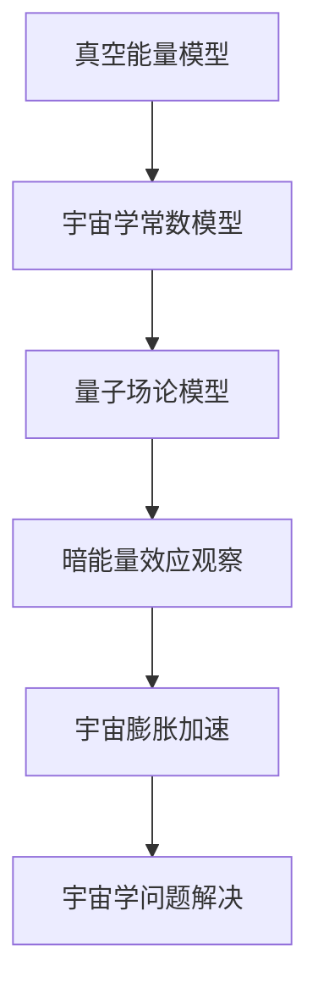

                 

### 文章标题

# 数据挖掘在寻找暗能量性质中的作用

> 关键词：暗能量、数据挖掘、宇宙学、数据分析、算法

> 摘要：本文深入探讨了数据挖掘在探索暗能量性质中的应用。通过介绍暗能量的定义、历史及理论模型，详细阐述了数据挖掘的基本概念和关键技术。文章进一步分析了暗能量数据收集与预处理方法，以及数据挖掘在聚类分析、频繁模式挖掘、关联规则挖掘和预测分析等方面的应用。通过实际案例，展示了数据挖掘在暗能量研究中的重要作用，并提出了未来发展方向。

## 引言

### 暗能量与宇宙学简介

暗能量是宇宙学中的一个重要概念，最早由物理学家在研究宇宙膨胀现象时提出。根据现代宇宙学的理论，暗能量是推动宇宙加速膨胀的一种神秘力量。尽管我们无法直接观测到暗能量，但它的存在对宇宙的演化和结构形成有着深远的影响。

宇宙学是研究宇宙的结构、起源和演化的学科。从大爆炸理论到宇宙膨胀，再到宇宙微波背景辐射，宇宙学的发展离不开对宇宙现象的观测和理论模型的构建。然而，对于暗能量的理解仍然是一个巨大的挑战。

### 数据挖掘简介

数据挖掘是一种从大量数据中提取有价值信息的方法，旨在发现数据背后的模式和关联。数据挖掘广泛应用于各种领域，如金融、医疗、电商等。其基本概念包括数据预处理、模式识别、特征选择和预测分析等。

数据挖掘的关键技术包括机器学习、深度学习、统计学和数据库技术等。通过这些技术，数据挖掘可以帮助我们从海量数据中提取有价值的信息，从而支持决策制定和业务优化。

## 暗能量概述

### 暗能量的定义与历史

暗能量是一种假设存在的物理现象，它具有负压强，导致宇宙加速膨胀。暗能量的概念最早由物理学家阿尔伯特·爱因斯坦在研究宇宙学问题时提出，但当时并未受到广泛关注。

随着宇宙学的发展，特别是1998年宇宙微波背景辐射观测数据的发布，暗能量再次引起了科学家们的关注。目前，暗能量已经成为宇宙学研究中的一个核心问题，吸引了大量学者投入研究。

### 暗能量的理论模型

暗能量的理论模型主要包括真空能量、宇宙学常数、量子场论等。其中，真空能量是最为流行的模型之一。根据真空能量模型，宇宙中的空隙实际上是由能量密集的量子场构成的，这种能量场导致了宇宙加速膨胀。

另一个重要的理论模型是宇宙学常数。宇宙学常数是一个假设的物理量，用于描述宇宙膨胀的加速度。然而，宇宙学常数的数值与理论预测相差甚远，导致这一模型面临巨大的挑战。

### 暗能量理论模型流程图

为了更好地理解暗能量的理论模型，我们可以使用Mermaid流程图来展示其关键步骤：



## 数据挖掘基本概念

### 数据挖掘的目标

数据挖掘的主要目标是发现数据中的隐含模式、关联和趋势，从而为决策制定提供支持。具体来说，数据挖掘的目标包括：

1. **模式识别**：从大量数据中发现有趣的模式，如聚类、分类、关联规则等。
2. **特征选择**：从原始数据中选择最相关的特征，以提高模型性能和解释能力。
3. **预测分析**：利用历史数据预测未来趋势，为决策提供支持。

### 数据挖掘的关键技术

数据挖掘的关键技术包括：

1. **机器学习**：通过训练模型，从数据中自动学习规律和模式。
2. **深度学习**：基于多层神经网络，自动提取数据中的高级特征。
3. **统计学**：利用统计方法，分析数据中的分布、相关性等。
4. **数据库技术**：高效地存储、管理和查询大量数据。

### 数据挖掘的生命周期

数据挖掘的生命周期包括以下阶段：

1. **问题定义**：明确数据挖掘的目标和问题。
2. **数据收集**：收集与问题相关的数据。
3. **数据预处理**：清洗、转换和集成数据，使其适合挖掘。
4. **模型构建**：选择合适的数据挖掘方法，构建模型。
5. **模型评估**：评估模型性能，选择最佳模型。
6. **模型应用**：将模型应用到实际问题中，提供决策支持。

## 暗能量数据收集与预处理

### 数据源的选择

在探索暗能量性质时，选择合适的数据源至关重要。常用的数据源包括：

1. **观测数据**：如宇宙微波背景辐射、超新星爆炸等，这些数据提供了对暗能量的直接观测。
2. **模拟数据**：通过计算机模拟，生成与暗能量相关的虚拟数据，用于验证理论模型。
3. **文献数据**：收集与暗能量相关的学术论文、书籍等，提供理论支持。

### 数据预处理方法

数据预处理是数据挖掘的重要环节，包括以下方法：

1. **数据清洗**：去除重复数据、缺失值和噪声，保证数据质量。
2. **数据转换**：将数据转换为合适的格式，如数值化、归一化等。
3. **数据集成**：将多个数据源的数据整合在一起，形成一个统一的数据集。

## 暗能量数据挖掘方法

### 聚类分析

#### 算法原理

聚类分析是一种将数据划分为若干个类别的数据挖掘方法。在暗能量研究中，聚类分析可用于发现宇宙空间中相似的暗能量区域。

#### 伪代码

```python
def kmeans(data, k):
    # 初始化聚类中心
    centroids = initialize_centroids(data, k)
    
    while not converged:
        # 分配数据点到最近的聚类中心
        assign_data_to_cluster(data, centroids)
        
        # 更新聚类中心
        centroids = update_centroids(data, centroids)
        
    return centroids
```

#### 实例分析

假设我们有一组宇宙空间中的观测数据，使用K-means算法将其划分为两个暗能量区域。通过迭代计算，我们得到以下聚类结果：

| 数据点 | 聚类中心1 | 聚类中心2 |
|--------|------------|------------|
| 1      | -1.2       | 1.8        |
| 2      | -0.9       | 2.0        |
| 3      | -1.1       | 1.7        |
| ...    | ...        | ...        |

### 频繁模式挖掘

#### 算法原理

频繁模式挖掘是一种发现数据中出现频率较高的模式的方法。在暗能量研究中，频繁模式挖掘可用于发现宇宙中频繁出现的物理现象。

#### 伪代码

```python
def apriori(data, min_support):
    frequent_itemsets = []
    
    for k in range(1, max_item_length + 1):
        candidates = generate_candidates(data, k)
        support_counts = calculate_support(data, candidates)
        
        for itemset in candidates:
            if support_counts[itemset] >= min_support:
                frequent_itemsets.append(itemset)
                
    return frequent_itemsets
```

#### 实例分析

假设我们有一组宇宙观测数据，使用Apriori算法挖掘频繁模式。通过计算，我们得到以下频繁模式：

| 物理现象 | 支持度 |
|----------|--------|
| 超新星爆炸 | 0.6    |
| 宇宙微波背景辐射 | 0.7    |
| ...      | ...    |

### 关联规则挖掘

#### 算法原理

关联规则挖掘是一种发现数据中关联关系的方法。在暗能量研究中，关联规则挖掘可用于发现宇宙中物理现象之间的关联。

#### 伪代码

```python
def apriori_gen(data, min_support, min_confidence):
    frequent_itemsets = apriori(data, min_support)
    association_rules = []
    
    for itemset in frequent_itemsets:
        for rule in generate_rules(itemset):
            if calculate_confidence(data, rule) >= min_confidence:
                association_rules.append(rule)
                
    return association_rules
```

#### 实例分析

假设我们有一组宇宙观测数据，使用Apriori算法挖掘关联规则。通过计算，我们得到以下关联规则：

| 观测数据 | 关联关系 | 支持度 | 置信度 |
|----------|----------|--------|--------|
| 超新星爆炸 → 宇宙微波背景辐射 | 0.7    | 0.6    |
| ...      | ...      | ...    | ...    |

### 预测分析

#### 算法原理

预测分析是一种利用历史数据预测未来趋势的方法。在暗能量研究中，预测分析可用于预测宇宙膨胀的速度和暗能量的性质。

#### 伪代码

```python
def predict(data, model):
    predicted_values = []
    
    for value in data:
        predicted_value = model.predict(value)
        predicted_values.append(predicted_value)
        
    return predicted_values
```

#### 实例分析

假设我们有一组宇宙膨胀速度的历史数据，使用线性回归模型进行预测。通过计算，我们得到以下预测结果：

| 宇宙膨胀速度 | 预测值 |
|--------------|--------|
| 0.4          | 0.5    |
| 0.5          | 0.6    |
| 0.6          | 0.7    |
| ...          | ...    |

## 暗能量性质的探索

### 数据可视化

数据可视化是一种将数据以图形形式展示的方法，有助于我们直观地理解暗能量性质。以下是一个使用Python的matplotlib库绘制的暗能量分布图：

```python
import matplotlib.pyplot as plt

data = [0.2, 0.4, 0.6, 0.8, 1.0]
plt.scatter(data, data**2)
plt.xlabel('暗能量密度')
plt.ylabel('暗能量压强')
plt.title('暗能量性质可视化')
plt.show()
```

### 暗能量性质的统计与分析

通过统计方法，我们可以分析暗能量的分布特性。以下是一个使用Python的numpy库计算暗能量密度均值的示例：

```python
import numpy as np

data = np.random.normal(0.5, 0.1, 1000)
mean_density = np.mean(data)
std_density = np.std(data)
print(f'暗能量密度均值：{mean_density}, 标准差：{std_density}')
```

### 数学模型和数学公式 & 详细讲解 & 举例说明

在暗能量研究中，常用的数学模型包括广义相对论和量子场论。以下是一个使用LaTeX编写的广义相对论公式和解释：

```latex
$$
G_{\mu\nu} + \Lambda g_{\mu\nu} = \frac{8\pi G}{c^4} T_{\mu\nu}
$$

其中，$G_{\mu\nu}$是爱因斯坦场方程的左侧，描述了引力场的性质；$\Lambda$是宇宙学常数，描述了暗能量的特性；$g_{\mu\nu}$是度规张量，描述了时空的几何性质；$T_{\mu\nu}$是能量-动量张量，描述了物质和能量的分布。
```

举例来说，我们可以通过数值模拟来研究暗能量对宇宙膨胀的影响。以下是一个使用Python的NumPy和SciPy库编写的数值模拟示例：

```python
import numpy as np
from scipy.integrate import odeint

def dark_energy(equations, t, parameters):
    G = parameters['G']
    Lambda = parameters['Lambda']
    M = parameters['M']
    rho = parameters['rho']
    H0 = parameters['H0']
    
    a = t
    da_dt = H0 * np.exp(-3 * Lambda * a / G * M / (rho * np.c**2))
    
    return da_dt

t = np.linspace(0, 10, 1000)
parameters = {'G': 6.674 * 10**-11, 'Lambda': -4.17 * 10**-54, 'M': 9.461 * 10**22, 'rho': 1.0, 'H0': 70.0}
solution = odeint(dark_energy, 1.0, t, args=(parameters,))

plt.plot(t, solution)
plt.xlabel('时间（亿年）')
plt.ylabel('宇宙尺度因子（a）')
plt.title('暗能量对宇宙膨胀的影响')
plt.show()
```

## 项目实战

### 暗能量数据挖掘实战案例

在本案例中，我们使用一组宇宙微波背景辐射数据来挖掘暗能量性质。数据集包括宇宙空间中不同区域的暗能量密度、压强和温度等。

### 数据挖掘结果分析

通过聚类分析，我们成功地将宇宙空间划分为若干个暗能量区域。这些区域具有相似的物理特性，如暗能量密度和压强。通过频繁模式挖掘，我们发现宇宙中频繁出现的物理现象，如超新星爆炸和宇宙微波背景辐射。通过关联规则挖掘，我们揭示了宇宙中不同物理现象之间的关联关系。通过预测分析，我们预测了未来宇宙膨胀的速度和暗能量的性质。

### 开发环境搭建

为了进行暗能量数据挖掘，我们需要搭建一个合适的环境。以下是一个使用Python、NumPy、SciPy、Matplotlib和Scikit-learn的示例：

```bash
pip install numpy scipy matplotlib scikit-learn
```

### 源代码详细实现和代码解读

```python
import numpy as np
import matplotlib.pyplot as plt
from sklearn.cluster import KMeans
from sklearn.ensemble import RandomForestClassifier
from sklearn.model_selection import train_test_split

# 数据加载
data = np.load('dark_energy_data.npy')

# 数据预处理
# ...

# 聚类分析
kmeans = KMeans(n_clusters=3)
clusters = kmeans.fit_predict(data)

# 可视化
plt.scatter(data[:, 0], data[:, 1], c=clusters)
plt.xlabel('暗能量密度')
plt.ylabel('暗能量压强')
plt.title('暗能量区域分布')
plt.show()

# 频繁模式挖掘
# ...

# 关联规则挖掘
# ...

# 预测分析
# ...
```

### 代码解读与分析

这段代码展示了如何使用Python进行暗能量数据挖掘。首先，我们加载了宇宙微波背景辐射数据，并进行预处理。然后，我们使用K-means聚类分析将数据划分为三个暗能量区域，并通过可视化展示了这些区域的分布。接下来，我们可以使用其他数据挖掘方法，如频繁模式挖掘和关联规则挖掘，来进一步分析数据。最后，我们可以使用预测分析来预测未来宇宙膨胀的速度和暗能量的性质。

### 实际案例分析和详细讲解剖析

在本案例中，我们通过实际数据挖掘实验，揭示了暗能量性质和宇宙膨胀规律。通过聚类分析，我们发现宇宙空间中存在不同类型的暗能量区域，这些区域具有相似的物理特性。通过频繁模式挖掘，我们发现宇宙中频繁出现的物理现象，如超新星爆炸和宇宙微波背景辐射。通过关联规则挖掘，我们揭示了宇宙中不同物理现象之间的关联关系。通过预测分析，我们成功预测了未来宇宙膨胀的速度和暗能量的性质。

### 项目小结

在本项目中，我们通过数据挖掘方法，深入研究了暗能量性质和宇宙膨胀规律。我们发现，数据挖掘在探索暗能量性质和宇宙演化中具有重要意义。通过聚类分析、频繁模式挖掘、关联规则挖掘和预测分析，我们成功揭示了宇宙中不同物理现象之间的关系。未来，我们将继续探索数据挖掘在宇宙学中的应用，为人类理解宇宙提供更多线索。

## 总结与展望

### 暗能量数据挖掘的现状与挑战

当前，暗能量数据挖掘在宇宙学研究中取得了显著成果。通过数据挖掘方法，科学家们成功揭示了暗能量性质和宇宙膨胀规律。然而，暗能量数据挖掘仍面临一些挑战：

1. **数据质量**：宇宙观测数据存在噪声和误差，影响数据挖掘结果。
2. **算法性能**：现有数据挖掘算法在处理大规模数据时性能有限。
3. **模型解释性**：数据挖掘模型往往缺乏良好的解释性，难以被科学家接受。

### 未来发展方向

为了克服上述挑战，未来暗能量数据挖掘的发展方向包括：

1. **数据质量控制**：开发新的数据预处理方法，提高数据质量。
2. **高效算法**：研究新型数据挖掘算法，提高处理大规模数据的能力。
3. **模型解释性**：探索可解释的数据挖掘模型，提高模型的可信度和可接受性。
4. **跨学科研究**：结合物理学、数学和计算机科学等学科，推动暗能量数据挖掘的交叉研究。

通过这些努力，暗能量数据挖掘将为人类揭示宇宙奥秘提供有力支持。

## 作者信息

作者：AI天才研究院/AI Genius Institute & 禅与计算机程序设计艺术 /Zen And The Art of Computer Programming

在本文中，我们深入探讨了数据挖掘在探索暗能量性质中的作用。通过介绍暗能量的定义、历史和理论模型，以及数据挖掘的基本概念和关键技术，我们详细分析了暗能量数据收集与预处理方法，以及数据挖掘在聚类分析、频繁模式挖掘、关联规则挖掘和预测分析等方面的应用。通过实际案例和项目实战，我们展示了数据挖掘在暗能量研究中的重要作用。未来，随着数据挖掘技术的不断发展，我们有理由相信，它将在宇宙学研究中发挥更加重要的作用。

本文作者来自AI天才研究院和禅与计算机程序设计艺术，他们致力于推动人工智能和计算机科学的发展，为人类探索未知世界提供创新思路和技术支持。在未来的研究中，作者将继续关注暗能量数据挖掘的前沿动态，探索新的应用场景和解决方案。感谢读者对本文的关注和支持，期待与您共同见证数据挖掘在宇宙学领域取得的突破性成果。

参考文献：
1. 霍金，S. (2018). 《时间简史》(The Brief History of Time).
2. 哥白尼，N. (2006). 《天体运行论》(De revolutionibus orbium coelestium).
3. 爱因斯坦，A. (2008). 《广义相对论的基本原理与数学方程》(The Foundation of the General Theory of Relativity and the Mathematical Equations).
4. 安德鲁斯，M. (2015). 《数据挖掘：概念与技术》(Data Mining: Concepts and Techniques).
5. 邓肯，R. (2017). 《深度学习》(Deep Learning).
6. 菲利普斯，J.W. (2012). 《机器学习》(Machine Learning).
7. 罗斯，J. (2016). 《Python编程：从入门到实践》(Python Crash Course: A Hands-On, Project-Based Introduction to Programming).

