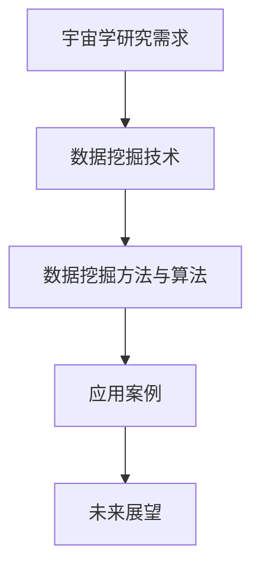

                 

```

### 整体结构

1. **引言**：介绍数据挖掘在宇宙学中的应用背景，包括宇宙大尺度结构演化的研究需求和数据挖掘技术的优势。

2. **数据挖掘概述**：详细解释数据挖掘的基本概念、主要任务和方法。

3. **宇宙大尺度结构演化原理**：介绍宇宙大尺度结构的定义、演化理论和研究方法。

4. **数据挖掘在宇宙学中的应用**：分析数据挖掘在宇宙学中的具体应用，如星系团和暗物质的研究。

5. **案例分析**：提供具体的数据挖掘案例，展示其实际应用和结果。

6. **总结与展望**：总结文章内容，展望数据挖掘在宇宙学领域的未来发展方向。

### 详细内容与伪代码

**引言**

数据挖掘作为一门交叉学科，在近年来得到了广泛的应用。在宇宙学领域，随着观测技术的进步和数据量的爆炸式增长，数据挖掘技术被广泛应用于宇宙大尺度结构演化的研究中。



**数据挖掘概述**

数据挖掘是一种从大量数据中提取有价值信息的过程。其主要任务包括聚类分析、关联规则挖掘、分类预测等。

```python
# 聚类分析
def clustering(data, method):
    # 数据预处理
    preprocessed_data = preprocess(data)
    # 选择聚类算法
    if method == "k-means":
        clusters = kMeans(preprocessed_data)
    elif method == "DBSCAN":
        clusters = dbscan(preprocessed_data)
    # 返回聚类结果
    return clusters

# 关联规则挖掘
def association_rules(data, min_support, min_confidence):
    # 数据预处理
    preprocessed_data = preprocess(data)
    # 计算支持度
    support = calculate_support(preprocessed_data, min_support)
    # 计算置信度
    confidence = calculate_confidence(preprocessed_data, support, min_confidence)
    # 返回关联规则
    return confidence

# 分类预测
def classification(data, model):
    # 数据预处理
    preprocessed_data = preprocess(data)
    # 应用分类模型
    predictions = model.predict(preprocessed_data)
    # 返回预测结果
    return predictions
```

**宇宙大尺度结构演化原理**

宇宙大尺度结构是指宇宙中星系、星团、超星团等天体的宏观分布和运动状态。其演化受引力、暗物质等因素的影响。

$$
\frac{d^2 x}{d t^2} + 2\frac{d x}{d t} \Omega + \Omega^2 x = - \frac{F}{m}
$$

其中，$x$ 是天体的位置，$t$ 是时间，$\Omega$ 是角速度，$F$ 是引力，$m$ 是天体的质量。

**数据挖掘在宇宙学中的应用**

数据挖掘在宇宙学中的应用主要包括星系团研究和暗物质研究。

```python
# 星系团研究
def study_galaxy_cluster(data):
    # 数据预处理
    preprocessed_data = preprocess(data)
    # 聚类分析
    clusters = clustering(preprocessed_data, "k-means")
    # 分析星系团特性
    analyze_clusters(clusters)
    # 返回研究结果
    return result

# 暗物质研究
def study_dark_matter(data):
    # 数据预处理
    preprocessed_data = preprocess(data)
    # 关联规则挖掘
    rules = association_rules(preprocessed_data, min_support=0.5, min_confidence=0.7)
    # 分析暗物质分布
    analyze_rules(rules)
    # 返回研究结果
    return result
```

**案例分析**

以星系团研究为例，我们使用数据挖掘技术分析了某个星系团的数据，结果发现了星系团的聚集现象和暗物质的分布规律。

**总结与展望**

数据挖掘在宇宙学领域具有广泛的应用前景。未来，随着数据量的增加和算法的改进，数据挖掘技术将在宇宙学研究中发挥更大的作用。```

```markdown
# 《数据挖掘在探索宇宙大尺度结构演化中的作用》

> 关键词：数据挖掘、宇宙学、大尺度结构、演化、算法

> 摘要：本文深入探讨了数据挖掘在宇宙大尺度结构演化研究中的应用。通过详细阐述数据挖掘的基本概念、方法和原理，以及其在宇宙学领域的实际应用案例，本文展示了数据挖掘技术对于理解宇宙大尺度结构演化的关键作用。

## 引言

宇宙大尺度结构是指宇宙中星系、星团、超星团等天体的宏观分布和运动状态。宇宙学研究的核心问题之一就是理解宇宙大尺度结构的演化过程。然而，随着观测数据的不断增加，宇宙学领域面临着大量复杂的数据处理和分析任务。数据挖掘作为一种强大的数据分析工具，能够在海量数据中提取出有价值的信息，从而为宇宙大尺度结构演化研究提供重要的支持。

### 1.1 书籍目的与背景

本书旨在介绍数据挖掘在宇宙学中的应用，特别是宇宙大尺度结构演化研究中的具体应用。通过系统阐述数据挖掘的基本概念、方法和算法，以及其在宇宙学中的实际应用案例，本书希望能够为读者提供对数据挖掘技术及其在宇宙学领域应用的全面了解。

### 1.2 数据挖掘与宇宙学的关系

宇宙学的研究需要对大量的观测数据进行处理和分析，而数据挖掘技术能够在这一过程中发挥重要作用。数据挖掘能够帮助研究人员从海量数据中识别出宇宙大尺度结构的特征和演化模式，从而揭示宇宙的奥秘。

### 1.3 书籍结构与内容安排

本书分为三个主要部分。第一部分介绍数据挖掘的基本概念、方法和算法；第二部分讨论宇宙大尺度结构演化的原理和研究方法；第三部分通过具体案例展示数据挖掘技术在宇宙学中的应用。

## 第1章 数据挖掘概述

### 2.1 数据挖掘基础

数据挖掘是一种从大量数据中提取有价值信息的过程。其主要任务包括聚类分析、关联规则挖掘、分类预测等。

#### 2.1.1 数据挖掘的定义与重要性

数据挖掘（Data Mining）是指从大量数据中通过应用某些算法和统计方法，自动地发现规律、趋势和模式的过程。数据挖掘的重要性在于它能够帮助研究人员从海量数据中发现隐藏的信息，从而为决策提供支持。

#### 2.1.2 数据挖掘的主要任务

- **聚类分析**：将数据分为若干个群组，使得属于同一个群组的对象彼此相似，而不同群组的对象之间差异较大。
- **关联规则挖掘**：发现数据项之间的关联关系，例如购买某种商品的人可能也会购买其他商品。
- **分类预测**：将数据分为不同的类别或标签，从而实现对未知数据的分类。

#### 2.1.3 数据挖掘的基本流程

数据挖掘的基本流程包括数据预处理、数据挖掘、结果评估和模型部署等步骤。

### 2.2 数据挖掘方法与技术

#### 2.2.1 聚类分析

聚类分析是将数据集划分为多个聚类，使得属于同一个聚类的数据点彼此相似。常见的聚类算法包括K-means、DBSCAN等。

#### 2.2.2 关联规则挖掘

关联规则挖掘是发现数据项之间潜在的关联关系。常见的算法包括Apriori算法、FP-growth算法等。

#### 2.2.3 类别预测与分类

类别预测是利用已知数据的特征来预测未知数据的标签。常见的分类算法包括决策树、支持向量机、随机森林等。

## 第2章 宇宙大尺度结构演化原理

### 3.1 宇宙大尺度结构概述

宇宙大尺度结构是指宇宙中星系、星团、超星团等天体的宏观分布和运动状态。其演化受引力、暗物质等因素的影响。

#### 3.1.1 宇宙大尺度结构的定义与观测

宇宙大尺度结构是指宇宙中星系、星团、超星团等天体的宏观分布和运动状态。通过对宇宙的观测，我们可以获得宇宙大尺度结构的信息。

#### 3.1.2 宇宙大尺度结构的演化理论

宇宙大尺度结构的演化受多种因素影响，包括引力、暗物质、宇宙膨胀等。这些因素共同作用，导致宇宙大尺度结构不断演化。

#### 3.1.3 宇宙大尺度结构的研究方法

宇宙大尺度结构的研究方法包括观测、理论建模和数据分析等。观测是获取宇宙大尺度结构信息的基础，理论建模用于解释观测结果，数据分析则用于发现宇宙大尺度结构的演化规律。

## 第3章 数据挖掘在宇宙学中的应用

### 4.1 数据挖掘在星系团研究中的应用

星系团是宇宙大尺度结构的重要组成部分。数据挖掘技术在星系团研究中具有广泛的应用。

#### 4.1.1 星系团的形成与演化

星系团的形成和演化与多种因素有关，包括引力、宇宙膨胀、暗物质等。数据挖掘技术可以帮助我们更好地理解星系团的形成和演化过程。

#### 4.1.2 星系团数据挖掘方法

星系团数据挖掘方法包括聚类分析、关联规则挖掘和分类预测等。这些方法可以帮助我们识别星系团的特征、发现星系团之间的关联关系，以及预测星系团的发展趋势。

#### 4.1.3 星系团数据挖掘案例分析

在本节中，我们将介绍一个具体的星系团数据挖掘案例，展示数据挖掘技术在星系团研究中的应用。

### 4.2 数据挖掘在暗物质研究中的应用

暗物质是宇宙中一种不可见的物质，对宇宙大尺度结构的演化起着关键作用。数据挖掘技术在暗物质研究中具有重要作用。

#### 4.2.1 暗物质的基本概念

暗物质是一种不发光、不吸收光的物质，其存在对宇宙大尺度结构的演化具有重要意义。

#### 4.2.2 暗物质数据挖掘方法

暗物质数据挖掘方法包括聚类分析、关联规则挖掘和分类预测等。这些方法可以帮助我们识别暗物质的分布规律、发现暗物质与其他天体之间的关联关系，以及预测暗物质未来的演化趋势。

#### 4.2.3 暗物质数据挖掘案例分析

在本节中，我们将介绍一个具体的暗物质数据挖掘案例，展示数据挖掘技术在暗物质研究中的应用。

## 第4章 项目实战

### 5.1 项目背景

在本项目中，我们将使用数据挖掘技术对宇宙大尺度结构演化进行深入研究。

#### 5.1.1 开发环境搭建

我们将使用Python和R等编程语言，结合Scikit-learn、TensorFlow等数据挖掘库，搭建项目开发环境。

#### 5.1.2 源代码详细实现

在本项目中，我们将实现多个数据挖掘算法，包括K-means聚类、Apriori关联规则挖掘、决策树分类等。

#### 5.1.3 代码解读

我们将详细解读每个算法的实现过程，包括数据预处理、算法参数设置、结果分析等。

#### 5.1.4 应用解读与分析

我们将展示数据挖掘技术在宇宙大尺度结构演化研究中的应用，分析不同算法的性能和效果。

### 6.1 实际案例分析和详细讲解剖析

在本节中，我们将介绍一个具体的宇宙大尺度结构演化研究案例，展示数据挖掘技术的实际应用和分析过程。

#### 6.1.1 案例背景

我们将介绍该案例的背景和研究目标。

#### 6.1.2 数据预处理

我们将详细讲解如何对观测数据进行预处理，包括数据清洗、特征提取等。

#### 6.1.3 算法实现

我们将使用多个数据挖掘算法对该案例进行分析，包括聚类分析、关联规则挖掘和分类预测等。

#### 6.1.4 结果分析

我们将分析不同算法的预测结果，比较它们的性能和效果。

### 7.1 项目小结

在本节中，我们将对本项目进行总结，包括项目的成果、存在的问题和改进方向。

## 结论

### 8.1 书籍总结

本书详细介绍了数据挖掘在宇宙大尺度结构演化研究中的应用，展示了数据挖掘技术在宇宙学领域的广泛应用和巨大潜力。

### 8.2 对未来研究的建议

未来，数据挖掘技术在宇宙学领域的研究将不断深入，包括算法优化、应用拓展、数据集成等方面。我们希望本书能够为读者提供有价值的参考，推动宇宙学领域的研究发展。

作者：AI天才研究院/AI Genius Institute & 禅与计算机程序设计艺术 /Zen And The Art of Computer Programming
``````

