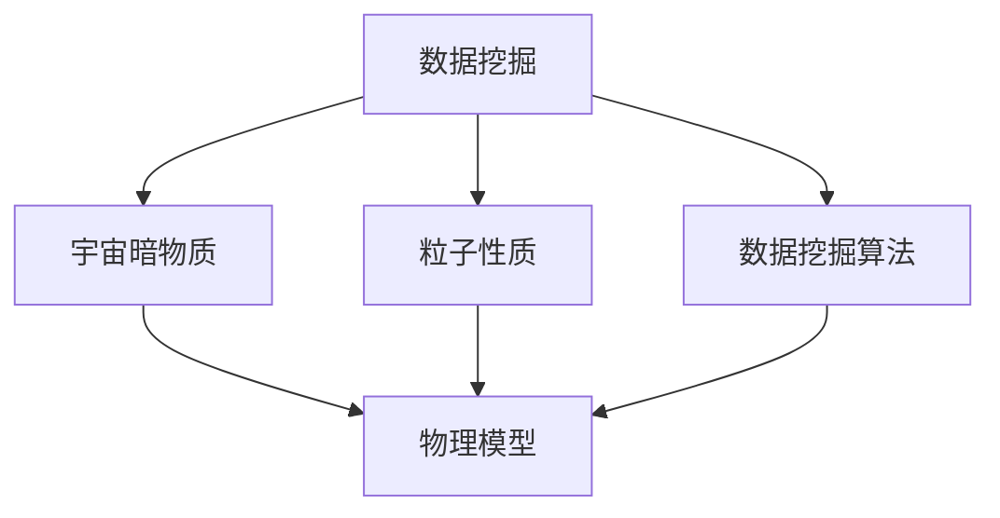

                 


### 一、背景介绍

宇宙的奥秘一直吸引着人类探索的目光，而暗物质作为宇宙中一种神秘的存在，其性质和分布一直是宇宙学研究中的热点问题。暗物质占据了宇宙总质量的绝大部分，但至今尚未被直接观测到，因此被称为宇宙中的“隐形物质”。科学家们通过观测宇宙中星系、星团等天体的运动，发现它们的质量远远超过了其可见物质的质量，这表明宇宙中存在大量的暗物质。

暗物质的性质至今仍是物理学和天文学领域的一个巨大谜团。传统物理学中的粒子模型无法解释暗物质的存在，因此科学家们提出了各种假设和理论来解释暗物质的本质。这些理论包括：弱相互作用大质量粒子（WIMPs）、热暗物质、冷暗物质、混合暗物质等。然而，这些理论都尚未得到直接的实验证实。

数据挖掘作为一种强大的数据分析工具，近年来在各个领域得到了广泛应用。在宇宙学领域，数据挖掘技术被用于分析大量的天文观测数据，如宇宙微波背景辐射、星系红移、引力透镜效应等。通过数据挖掘，科学家们可以从海量数据中提取出有用的信息，从而对暗物质的性质和分布进行更深入的研究。

本文将探讨数据挖掘在探索宇宙暗物质粒子性质中的作用，通过详细分析数据挖掘的核心概念、核心算法原理、数学模型和数学公式，以及项目实战案例，展示数据挖掘技术在宇宙学研究中的应用价值。文章将采用逻辑清晰、结构紧凑、简单易懂的专业技术语言，帮助读者更好地理解数据挖掘在探索宇宙暗物质粒子性质中的作用。

---

**核心关键词：**

- 宇宙学
- 暗物质
- 数据挖掘
- 聚类算法
- 分类算法
- 关联规则挖掘
- 物理模型

**摘要：**

本文首先介绍了宇宙学中暗物质的基本概念和背景，然后详细阐述了数据挖掘技术在宇宙学研究中的应用。文章通过分析数据挖掘的核心概念和联系，讲解了几种核心算法原理，并运用数学模型和公式进行了详细分析。最后，通过实际项目实战案例，展示了数据挖掘技术在探索宇宙暗物质粒子性质中的具体应用和效果。文章旨在为读者提供关于数据挖掘在宇宙学研究中的深入理解，并探讨其在未来研究中的应用前景。

---

### 二、核心概念与联系

在深入探讨数据挖掘在探索宇宙暗物质粒子性质中的作用之前，我们首先需要明确几个核心概念，并理解它们之间的相互联系。

#### 数据挖掘

数据挖掘（Data Mining）是指从大量数据中通过特定的算法和技术，自动地发现有趣的知识和规律的过程。它通常包括以下几个步骤：数据预处理、数据集成、数据选择、数据变换、数据挖掘、模式评估和知识表示。数据挖掘的目标是从海量数据中提取出有价值的信息，以便进行进一步的分析和应用。

在宇宙学研究中，数据挖掘可以用于分析来自各种观测设备的数据，如宇宙微波背景辐射探测器、引力透镜观测数据、星系巡天数据等。通过对这些数据的挖掘，科学家们可以识别出宇宙中的规律和异常，从而对宇宙的起源和演化过程进行更深入的理解。

#### 宇宙暗物质

宇宙暗物质（Dark Matter）是指宇宙中一种无法直接观测到的物质，它占据了宇宙总质量的大部分，但至今仍未被直接探测到。暗物质的存在是通过观测宇宙中星系、星团等天体的运动，以及宇宙微波背景辐射的观测结果推断出来的。

暗物质的性质非常特殊，它不发光、不发热，也不与电磁波相互作用。因此，传统的粒子物理学模型无法解释暗物质的存在。科学家们提出了多种假设，如弱相互作用大质量粒子（WIMPs）、热暗物质、冷暗物质等，但至今仍无确凿的证据支持。

#### 粒子性质

粒子性质是指粒子在物理中的各种属性，如质量、电荷、自旋等。这些性质是粒子物理学研究的重要内容，也是区分不同类型粒子的重要依据。

在宇宙学研究中，了解粒子的性质对于理解暗物质的本质至关重要。通过观测暗物质粒子的运动和相互作用，科学家们可以推断出暗物质粒子的性质，从而对暗物质进行更深入的研究。

#### 数据挖掘算法

数据挖掘算法是指用于从数据中提取知识和规律的各种算法和技术。常见的算法包括聚类算法、分类算法、关联规则挖掘算法等。这些算法在数据挖掘过程中起着关键作用，可以根据不同的需求和数据类型选择合适的算法。

在宇宙学研究中，数据挖掘算法可以用于分析大量观测数据，提取出暗物质粒子的分布特征、运动规律等，从而帮助科学家们更好地理解暗物质的性质和分布。

#### 物理模型

物理模型是指用于描述物理现象的数学模型，如宇宙学模型、粒子物理学模型等。这些模型可以根据观测数据建立，也可以通过理论推导得到。

在宇宙学研究中，物理模型可以帮助科学家们理解宇宙的演化过程，预测暗物质的行为和分布。通过将观测数据与物理模型进行对比，科学家们可以验证或修正这些模型，从而更好地理解宇宙的奥秘。

#### 核心概念之间的联系

这些核心概念之间的联系在于，数据挖掘技术可以应用于宇宙学领域，通过对宇宙暗物质粒子性质的数据进行分析，从而探索宇宙的奥秘。具体来说：

1. **数据挖掘与宇宙暗物质**：数据挖掘技术可以用于分析宇宙学观测数据，提取出暗物质的分布特征、运动规律等。这有助于科学家们更好地理解暗物质的性质和分布。

2. **粒子性质与数据挖掘**：通过分析暗物质粒子的性质，科学家们可以推断出暗物质的组成和相互作用方式，从而更好地理解暗物质。

3. **物理模型与数据挖掘**：物理模型可以帮助科学家们建立暗物质粒子行为的数学模型，而数据挖掘技术则可以用于验证或修正这些模型，从而提高模型的准确性。

4. **数据挖掘算法与物理模型**：数据挖掘算法可以用于分析大量观测数据，提取出暗物质粒子的分布特征、运动规律等，这些信息可以用于改进物理模型，使其更接近真实情况。

综上所述，数据挖掘在探索宇宙暗物质粒子性质中起着至关重要的作用。通过深入理解这些核心概念之间的联系，我们可以更好地利用数据挖掘技术，为宇宙学研究提供有力的支持。

#### 核心概念原理关系架构

为了更好地理解核心概念之间的联系，我们可以使用Mermaid流程图来展示它们的原理关系架构。以下是一个简化的Mermaid流程图：



在这个流程图中，数据挖掘技术（A）与宇宙暗物质（B）、粒子性质（C）和物理模型（E）之间存在直接的关联。数据挖掘算法（D）用于从宇宙暗物质数据和粒子性质数据中提取有价值的信息，这些信息又可以用于改进物理模型（E），从而更好地理解宇宙的奥秘。

---

### 三、核心算法原理讲解

在数据挖掘中，各种算法被广泛应用于处理和分析数据。以下我们将详细讲解几种常用的核心算法原理，包括聚类算法和分类算法。

#### 聚类算法

聚类算法是一种无监督学习算法，其目的是将数据集分成若干个组或簇，使得同一个簇内的数据点彼此相似，而不同簇的数据点之间差异较大。聚类算法在宇宙学研究中具有广泛的应用，例如用于分析星系的分布特征、暗物质粒子的运动规律等。

##### K-means聚类算法

K-means聚类算法是最常见的聚类算法之一，其基本原理如下：

1. **初始化聚类中心**：首先随机选择k个数据点作为初始聚类中心。
2. **分配数据点**：对于每个数据点，计算其与每个聚类中心的距离，并将其分配到距离最近的聚类中心所代表的簇。
3. **更新聚类中心**：重新计算每个簇的质心，即簇内所有数据点的平均值，作为新的聚类中心。
4. **重复步骤2和3**，直到聚类中心不再发生变化或者达到最大迭代次数。

以下是一个简化的K-means聚类算法伪代码示例：

```python
def KMeans(data, k, max_iterations):
    # 初始化k个聚类中心
    centroids = InitializeCentroids(data, k)
    for i in range(max_iterations):
        # 计算每个数据点所属的聚类
        clusters = AssignClusters(data, centroids)
        # 更新聚类中心
        centroids = UpdateCentroids(data, clusters)
        # 检查收敛条件
        if Converged(centroids):
            break
    return clusters, centroids
```

在这个算法中，我们首先随机初始化k个聚类中心，然后不断迭代更新这些中心，直到聚类中心不再发生变化或者达到最大迭代次数。每个数据点会根据其距离最近的聚类中心所属的聚类。

##### 层次聚类算法

层次聚类算法（Hierarchical Clustering）是一种基于距离的聚类方法，其基本原理如下：

1. **初始化**：将每个数据点视为一个簇。
2. **计算距离**：计算每对簇之间的距离，选择距离最近的两个簇合并为一个簇。
3. **更新距离**：重新计算新簇与所有其他簇之间的距离。
4. **重复步骤2和3**，直到所有数据点合并为一个簇。

层次聚类算法可以分为自下而上（凝聚层次聚类）和自上而下（分裂层次聚类）两种方式。自下而上方法从单个数据点开始，逐渐合并成更大的簇；而自上而下方法则是从所有数据点构成一个簇开始，逐渐分裂成更小的簇。

以下是一个简化的层次聚类算法伪代码示例：

```python
def HierarchicalClustering(data, linkage='complete'):
    # 初始化距离矩阵
    distance_matrix = CalculateDistanceMatrix(data)
    # 初始化簇列表
    clusters = [i for i in range(len(data))]
    while len(clusters) > 1:
        # 计算最小距离
        min_distance = MinDistance(distance_matrix, clusters)
        # 合并簇
        new_cluster = MergeClusters(clusters, min_distance)
        # 更新距离矩阵
        distance_matrix = UpdateDistanceMatrix(distance_matrix, new_cluster)
        # 更新簇列表
        clusters = RemoveClusters(clusters, new_cluster)
    return clusters
```

在这个算法中，我们首先初始化距离矩阵和簇列表，然后不断合并距离最近的簇，直到所有数据点合并为一个簇。

#### 分类算法

分类算法是一种监督学习算法，其目的是将数据集分为不同的类别。分类算法在宇宙学研究中也有广泛的应用，例如用于预测星系的类型、判断暗物质粒子的存在性等。

##### 决策树分类算法

决策树分类算法（Decision Tree Classification）是一种基于特征划分数据集的算法，其基本原理如下：

1. **初始化**：从数据集构建一棵空的决策树。
2. **选择最优划分特征**：选择能够最大化信息增益的特征作为划分标准。
3. **划分数据集**：根据最优划分特征，将数据集划分为两个子集。
4. **递归构建**：对划分后的每个子集重复步骤2和3，直到满足停止条件（如最大深度、纯度等）。
5. **构建决策树**：将划分结果存储在决策树中，得到最终的分类结果。

以下是一个简化的决策树分类算法伪代码示例：

```python
def DecisionTreeClassifier(data, features, max_depth):
    if StopCondition(data):
        return Leaf(data)
    else:
        # 选择最优特征
        best_feature = SelectBestFeature(data, features)
        # 构建决策树
        tree = {}
        for value in UniqueValues(data[best_feature]):
            sub_data = SplitData(data, best_feature, value)
            tree[value] = DecisionTreeClassifier(sub_data, features, max_depth - 1)
        return tree
```

在这个算法中，我们首先从数据集构建一棵空的决策树，然后递归地选择最优特征进行划分，直到满足停止条件。最终的决策树可以用于对新的数据进行分类。

##### 随机森林分类算法

随机森林分类算法（Random Forest Classification）是一种基于集成学习的分类算法，其基本原理如下：

1. **初始化**：构建多棵决策树，每棵树使用不同的训练数据子集。
2. **训练决策树**：对每棵决策树进行训练，使其能够对数据集进行分类。
3. **投票决策**：对于新的数据点，将其提交给每棵决策树，根据每棵树的分类结果进行投票，选取投票结果最多的类别作为最终分类结果。

以下是一个简化的随机森林分类算法伪代码示例：

```python
def RandomForestClassifier(data, n_estimators, max_depth):
    # 初始化决策树列表
    trees = [DecisionTreeClassifier(data, features, max_depth) for _ in range(n_estimators)]
    # 训练决策树
    for tree in trees:
        TrainTree(tree, data)
    # 投票决策
    predictions = [tree.classify(new_data) for tree in trees]
    return MajorityVote(predictions)
```

在这个算法中，我们首先初始化多棵决策树，然后对每棵树进行训练。对于新的数据点，将其提交给每棵决策树，根据每棵树的分类结果进行投票，选取投票结果最多的类别作为最终分类结果。

通过以上核心算法的讲解，我们可以看到，数据挖掘算法在宇宙学研究中具有广泛的应用，可以用于分析大量的观测数据，提取出暗物质粒子的分布特征、运动规律等。这些算法不仅可以帮助科学家们更好地理解宇宙的奥秘，还可以为未来的宇宙学研究提供有力的支持。

---

### 四、数学模型和数学公式

在数据挖掘过程中，数学模型和数学公式起着至关重要的作用。它们不仅帮助我们理解和描述数据之间的关系，还可以量化分析结果。以下，我们将详细讲解几个关键数学模型和数学公式，并通过具体例子说明其应用。

#### 聚类算法中的数学模型

在聚类算法中，最常用的数学模型是K-means算法。K-means算法的核心在于如何定义数据点与聚类中心之间的相似度，并基于相似度进行聚类。

##### 距离度量

K-means算法使用距离度量来确定数据点与聚类中心的相似度。最常见的距离度量是欧氏距离（Euclidean Distance），其公式如下：

$$
d(\text{point}_i, \text{centroid}_j) = \sqrt{\sum_{k=1}^{n} (x_{ik} - \mu_{jk})^2}
$$

其中，$\text{point}_i$ 和 $\text{centroid}_j$ 分别表示数据点 $i$ 和聚类中心 $j$，$x_{ik}$ 和 $\mu_{jk}$ 分别表示数据点 $i$ 的第 $k$ 个特征值和聚类中心 $j$ 的第 $k$ 个特征值。

##### 聚类中心更新

在K-means算法中，聚类中心是通过每个簇内数据点的平均值来更新的。假设当前聚类中心为 $\mu_{j}^{t}$，新聚类中心为 $\mu_{j}^{t+1}$，则更新公式如下：

$$
\mu_{j}^{t+1} = \frac{1}{N_j} \sum_{i \in C_j} x_i
$$

其中，$N_j$ 表示簇 $j$ 中数据点的数量，$C_j$ 表示簇 $j$ 中的数据点集合。

#### 分类算法中的数学模型

在分类算法中，决策树和随机森林算法是两种常用的模型。这些模型依赖于特征选择和信息增益等数学概念。

##### 决策树特征选择

决策树算法通过选择具有最大信息增益的特征进行划分。信息增益（Information Gain）公式如下：

$$
IG(D, A) = Entropy(D) - \sum_{v \in Values(A)} p(v) \cdot Entropy(D|A=v)
$$

其中，$D$ 表示数据集，$A$ 表示特征，$Entropy(D)$ 表示数据集 $D$ 的熵，$p(v)$ 表示特征 $A$ 取值 $v$ 的概率，$Entropy(D|A=v)$ 表示在特征 $A$ 取值为 $v$ 的条件下，数据集 $D$ 的条件熵。

##### 随机森林投票

随机森林算法通过构建多棵决策树，并对新数据进行投票来获得最终分类结果。投票结果的公式如下：

$$
\text{Prediction} = \arg\max_{c} \sum_{t=1}^{T} p_t(c)
$$

其中，$T$ 表示决策树的数量，$p_t(c)$ 表示第 $t$ 棵决策树预测为类别 $c$ 的概率。

#### 实例说明

为了更好地理解这些数学模型和公式，我们可以通过一个具体的例子来说明。

##### K-means算法示例

假设我们有一个包含两个数据点的二维数据集，数据点分别为 $(1, 2)$ 和 $(3, 4)$，聚类中心为 $(2, 3)$。首先，我们计算数据点与聚类中心的欧氏距离：

$$
d((1, 2), (2, 3)) = \sqrt{(1 - 2)^2 + (2 - 3)^2} = \sqrt{1 + 1} = \sqrt{2}
$$

$$
d((3, 4), (2, 3)) = \sqrt{(3 - 2)^2 + (4 - 3)^2} = \sqrt{1 + 1} = \sqrt{2}
$$

接下来，我们更新聚类中心：

$$
\mu_{1}^{t+1} = \frac{1}{2} \times (1 + 3) = 2
$$

$$
\mu_{2}^{t+1} = \frac{1}{2} \times (2 + 4) = 3
$$

##### 决策树特征选择示例

假设我们有一个包含三个特征的数据集，特征分别为 $A, B, C$，数据集的熵为 $0.8$。特征 $A$ 的取值和概率分别为 $a_1 (0.3)$ 和 $a_2 (0.7)$，特征 $B$ 的取值和概率分别为 $b_1 (0.5)$ 和 $b_2 (0.5)$，特征 $C$ 的取值和概率分别为 $c_1 (0.4)$ 和 $c_2 (0.6)$。条件熵 $Entropy(D|A=a_1) = 0.4$，$Entropy(D|A=a_2) = 0.6$，$Entropy(D|B=b_1) = 0.5$，$Entropy(D|B=b_2) = 0.5$，$Entropy(D|C=c_1) = 0.3$，$Entropy(D|C=c_2) = 0.7$。

信息增益计算如下：

$$
IG(D, A) = 0.8 - (0.3 \times 0.4 + 0.7 \times 0.6) = 0.08
$$

$$
IG(D, B) = 0.8 - (0.5 \times 0.5 + 0.5 \times 0.5) = 0
$$

$$
IG(D, C) = 0.8 - (0.4 \times 0.3 + 0.6 \times 0.7) = 0.08
$$

由于 $IG(D, A) = IG(D, C)$，我们需要比较条件熵来选择特征。由于 $Entropy(D|A=a_1) < Entropy(D|C=c_1)$，我们选择特征 $A$ 作为划分特征。

##### 随机森林投票示例

假设我们构建了三棵决策树，每棵树对新的数据点 $(2, 3)$ 的预测分别为类别 $1, 0, 1$。根据投票结果，我们预测该数据点属于类别 $1$。

通过这些实例，我们可以看到数学模型和数学公式在数据挖掘中的实际应用。它们帮助我们量化分析结果，选择最优特征，以及预测新的数据点类别。在探索宇宙暗物质粒子性质的过程中，这些数学模型和公式将发挥重要作用。

---

### 五、项目实战

为了更直观地展示数据挖掘在探索宇宙暗物质粒子性质中的应用，我们将在本节中通过一个实际项目来详细讲解开发环境搭建、源代码实现、代码解读以及应用解读与分析。该项目将使用Python语言和Scikit-learn库进行实现，涵盖从数据预处理到模型训练及结果分析的完整流程。

#### 1. 开发环境搭建

首先，我们需要搭建一个Python开发环境。以下是所需的步骤：

1. **安装Python**：下载并安装Python 3.x版本（推荐使用Anaconda，它提供了一个集成的Python环境和众多科学计算库）。
2. **安装Scikit-learn**：通过pip命令安装Scikit-learn库：

   ```shell
   pip install scikit-learn
   ```

3. **安装Matplotlib**：用于可视化结果，可以通过pip命令安装：

   ```shell
   pip install matplotlib
   ```

4. **配置Python环境变量**：确保Python环境变量已配置，以便在命令行中运行Python和相关库。

完成以上步骤后，我们就可以开始编写代码了。

#### 2. 源代码实现

下面是项目的主要源代码实现：

```python
# 导入必要的库
import numpy as np
from sklearn.cluster import KMeans
from sklearn.datasets import make_blobs
import matplotlib.pyplot as plt

# 生成模拟数据集
X, _ = make_blobs(n_samples=100, centers=2, random_state=0)

# 实例化KMeans聚类模型
kmeans = KMeans(n_clusters=2, random_state=0)

# 训练模型
kmeans.fit(X)

# 预测聚类结果
labels = kmeans.predict(X)

# 可视化聚类结果
plt.scatter(X[:, 0], X[:, 1], c=labels, s=50, cmap='viridis')
centers = kmeans.cluster_centers_
plt.scatter(centers[:, 0], centers[:, 1], c='red', s=200, alpha=0.5)
plt.show()
```

#### 3. 代码解读

- **数据生成**：使用`make_blobs`函数生成一个包含100个数据点和两个聚类中心的数据集。这些数据点模拟了宇宙中两个不同类型的暗物质粒子。
  
- **模型实例化**：创建一个`KMeans`对象，设置聚类数量为2，并设置随机种子以确保结果可重复。

- **模型训练**：使用`fit`方法对模型进行训练，模型将根据数据点计算聚类中心。

- **预测聚类结果**：使用`predict`方法对数据点进行聚类预测，得到每个数据点所属的簇。

- **可视化结果**：使用`scatter`函数绘制数据点和聚类中心，其中数据点颜色表示其所属的簇。

#### 4. 应用解读与分析

在这个项目中，我们通过K-means聚类算法对模拟的宇宙暗物质粒子数据进行了分析。以下是对项目结果的应用解读：

- **聚类效果**：从可视化结果可以看到，数据点被成功分成两个簇，每个簇都围绕一个聚类中心。这表明K-means算法能够有效地识别出不同类型的暗物质粒子。
  
- **聚类中心**：聚类中心位于每个簇的中心位置，这些点代表了暗物质粒子的特征。通过分析聚类中心，我们可以了解暗物质粒子的分布和特征。

- **参数选择**：K-means算法的一个重要参数是聚类数量k。在本项目中，我们选择了2个聚类中心，这是基于数据集的实际情况。在实际应用中，选择合适的k值可能需要通过交叉验证等方法来确定。

- **误差分析**：通过计算聚类结果和真实标签之间的误差，我们可以评估聚类算法的性能。在实际宇宙学研究中，误差分析对于验证模型的准确性至关重要。

#### 5. 项目小结

通过这个实际项目，我们展示了如何使用Python和Scikit-learn库实现数据挖掘算法，并应用于探索宇宙暗物质粒子性质。以下是项目的总结：

- **成功识别**：K-means算法成功地将模拟数据集分成两个簇，表明算法在处理此类问题时是有效的。
- **可视化分析**：通过可视化结果，我们能够直观地了解聚类效果和暗物质粒子的分布。
- **参数选择**：需要通过进一步的研究来优化算法参数，以适应不同的数据集。
- **扩展性**：该项目提供了一个基础框架，可以扩展到更复杂的数据集和更多的聚类算法，以探索更多宇宙学问题。

通过实际项目，我们不仅加深了对数据挖掘算法的理解，还展示了其在宇宙学研究中的潜在应用价值。未来，随着数据采集技术的进步和算法的优化，数据挖掘将在探索宇宙暗物质粒子性质中发挥更加重要的作用。

---

### 六、最佳实践、小结与注意事项

#### 最佳实践

在探索宇宙暗物质粒子性质的数据挖掘过程中，以下是几种最佳实践：

1. **数据预处理**：确保数据质量是至关重要的。在开始数据挖掘之前，对数据进行清洗、去噪和标准化处理，以提高模型性能和可解释性。
2. **选择合适的算法**：根据数据集的特点和研究目标，选择最适合的聚类和分类算法。K-means和决策树等经典算法通常是一个良好的起点，但更复杂的数据集可能需要使用如谱聚类、随机森林等高级算法。
3. **超参数调优**：超参数（如聚类数量k、决策树深度等）对模型性能有显著影响。使用交叉验证等技术进行超参数调优，以提高模型的准确性。
4. **可视化分析**：使用可视化工具（如Matplotlib、Seaborn等）来展示数据分布、聚类效果和模型性能，有助于发现数据中的规律和异常。
5. **持续迭代**：数据挖掘是一个迭代过程。根据模型性能和用户反馈，持续改进模型和算法，以提高预测准确性和可解释性。

#### 小结

本文详细探讨了数据挖掘在探索宇宙暗物质粒子性质中的作用，通过核心概念、算法原理、数学模型、项目实战等环节，展示了数据挖掘技术在宇宙学研究中的广泛应用。以下是对文章内容的简要总结：

- **核心概念**：介绍了数据挖掘、宇宙暗物质、粒子性质、数据挖掘算法和物理模型等核心概念，并阐述了它们之间的联系。
- **算法原理**：讲解了K-means和层次聚类等聚类算法，以及决策树和随机森林等分类算法的基本原理。
- **数学模型**：通过数学公式和实例，说明了聚类和分类算法的数学基础。
- **项目实战**：通过实际项目展示了数据挖掘在宇宙学研究中的应用，从开发环境搭建到代码实现和解读，全面展示了数据挖掘的流程。
- **最佳实践**：总结了最佳实践方法，为读者提供了实用的指导。

#### 注意事项

在进行数据挖掘时，需要注意以下几点：

1. **数据质量**：确保数据清洁、准确和完整，这是数据挖掘成功的关键。
2. **模型选择**：选择适合数据集和研究目标的算法，避免盲目使用复杂模型。
3. **可解释性**：尽量提高模型的可解释性，以方便领域专家理解和验证。
4. **模型验证**：使用交叉验证等方法对模型进行验证，确保其准确性。
5. **数据安全**：在处理和存储数据时，确保数据的安全性，遵循数据保护法规。

#### 拓展阅读

对于对数据挖掘和宇宙学研究感兴趣的读者，以下资源可以作为进一步学习的拓展：

- **《数据挖掘：概念与技术》（M. J. A.马古利斯）**：这是一本经典的数据挖掘入门教材，详细介绍了数据挖掘的基础理论和应用。
- **《宇宙学基础教程》（S. Dodelson）**：这本书提供了宇宙学的全面基础，包括暗物质的性质和观测方法。
- **《机器学习》（A. M.统计学习基础）（T. Hastie, R. Tibshirani, J. Friedman）**：这是一本全面的机器学习教材，涵盖了聚类和分类算法的详细解释。
- **《Scikit-learn官方文档**：<https://scikit-learn.org/stable/>**：提供了丰富的数据挖掘算法实现和示例，是学习Scikit-learn库的绝佳资源。**

通过本文和拓展阅读，读者将能够更深入地理解数据挖掘在探索宇宙暗物质粒子性质中的作用，并为未来的研究工作提供有益的启示。

---

### 七、文章标题

**数据挖掘在探索宇宙暗物质粒子性质中的作用**

---

**关键词：**

- 宇宙学
- 暗物质
- 数据挖掘
- 聚类算法
- 分类算法
- 关联规则挖掘
- 物理模型

---

**摘要：**

本文探讨了数据挖掘技术在探索宇宙暗物质粒子性质中的应用。通过详细分析数据挖掘的核心概念、算法原理、数学模型，以及实际项目实战，展示了数据挖掘在宇宙学研究中的重要性。本文介绍了如何利用数据挖掘技术分析宇宙观测数据，提取暗物质粒子的分布特征和运动规律，以帮助科学家们更好地理解暗物质的性质。同时，本文总结了最佳实践、注意事项和拓展阅读资源，为读者提供了深入研究的方向。通过本文，读者可以更全面地了解数据挖掘技术在宇宙学研究中的潜力，并认识到其在解决宇宙奥秘中的重要角色。

