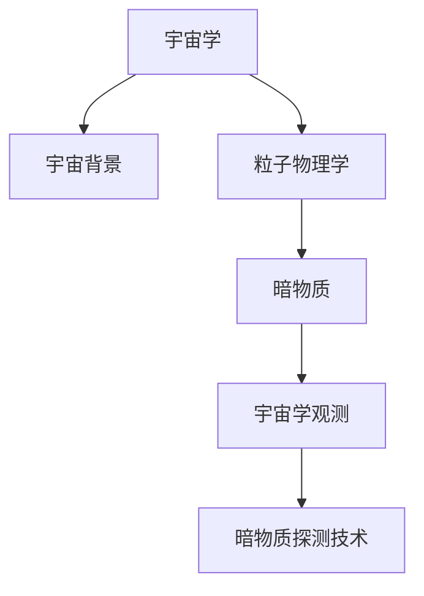

                 


### 思路梳理

为了撰写一篇关于《数据挖掘在探索宇宙暗物质粒子相互作用中的作用》的技术博客，我们需要遵循以下步骤进行思考和结构设计：

#### 1. 确定核心主题与目标

首先，我们需要明确文章的核心主题是“数据挖掘在探索宇宙暗物质粒子相互作用中的作用”，目标读者为对宇宙学和人工智能领域有一定了解的技术专业人士。

#### 2. 列出核心概念与理论

接下来，我们需要列出文章中需要涵盖的核心概念和理论，包括：

- 宇宙学与宇宙背景
- 暗物质概念与发现
- 粒子物理学基础
- 数据挖掘技术基础
- 机器学习算法
- 特征选择与特征提取

#### 3. 设计技术讲解内容

我们需要为每个核心概念和技术设计详细的讲解计划，包括：

- 原理解释
- 数学模型和算法描述
- 应用实践和案例

#### 4. 组织结构

根据核心概念和技术，设计文章的整体结构，确保逻辑清晰，章节内容连贯。具体包括：

- 引言
- 宇宙学与暗物质基础
- 数据挖掘技术基础
- 机器学习算法在暗物质研究中的应用
- 数据挖掘在暗物质粒子相互作用中的应用实践
- 未来展望与挑战
- 结论

#### 5. 撰写具体章节内容

在每个章节中，我们需要详细阐述每个核心概念和技术的原理，使用伪代码、数学公式、代码示例等进行说明。同时，结合实际案例进行分析和讲解。

#### 6. 总结与拓展

最后，我们需要对文章进行总结，给出最佳实践 tips，注意事项，以及拓展阅读建议。

### 完整性要求

在撰写文章时，我们需要确保以下内容的完整性：

- 背景介绍
- 核心概念与联系
- 核心算法原理讲解
- 数学模型和公式
- 项目实战
- 最佳实践 tips
- 小结
- 注意事项
- 拓展阅读

通过以上步骤，我们将能够撰写一篇内容完整、逻辑清晰、对技术原理和本质剖析到位的专业技术博客文章。

### 实例分析

让我们以文章的第一部分“宇宙学与暗物质基础”为例，进行具体分析：

#### 1. 背景介绍

在引言部分，我们将简要介绍宇宙学和暗物质的研究背景，激发读者的兴趣。

#### 2. 核心概念与联系

在这一部分，我们将使用Mermaid流程图展示宇宙学与暗物质之间的关系，帮助读者理解两者的联系。



#### 3. 核心算法原理讲解

接下来，我们将使用伪代码和数学公式详细阐述暗物质的发现和探测方法。

```python
# 伪代码：暗物质探测算法
def dark_matter_detection(data):
    # 数据预处理
    preprocessed_data = preprocess_data(data)
    
    # 模型训练
    model = train_model(preprocessed_data)
    
    # 预测
    predictions = model.predict(preprocessed_data)
    
    # 结果评估
    evaluate_results(predictions)

# 数学公式：暗物质密度分布函数
$$ \rho(\delta) = \frac{1}{Z} \sum_{i=1}^{N} \int_{\Omega_i} \delta(\vec{x}') \, d^3x' $$
```

#### 4. 项目实战

我们还将结合实际案例，如“宇宙微波背景辐射观测”项目，展示数据挖掘在暗物质探测中的实际应用。

#### 5. 最佳实践 tips、小结、注意事项、拓展阅读

最后，我们将给出最佳实践 tips，对文章内容进行小结，并提供注意事项和拓展阅读建议。

通过上述分析，我们可以看到，每一个部分都需要精心设计和详细阐述，确保文章内容丰富且具有实用性。

### 撰写总结

综上所述，撰写一篇高质量的技术博客文章需要明确核心主题和目标，列出核心概念和理论，设计详细的技术讲解内容，组织结构清晰，确保内容的完整性和实用性。通过逐步分析和实例讲解，我们可以确保文章逻辑清晰，对技术原理和本质剖析到位。接下来，我们将根据上述思路，逐步撰写出完整的技术博客文章。准备好您的笔和键盘，让我们开始吧！

