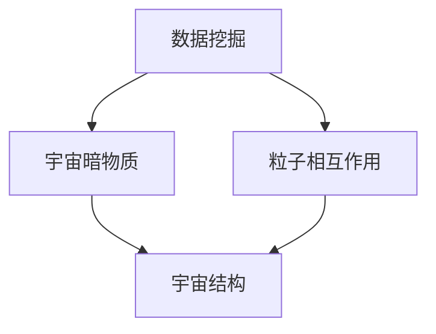

                 

### 文章标题

《数据挖掘在探索宇宙暗物质粒子相互作用特性中的作用》

### 关键词

数据挖掘、宇宙暗物质、粒子相互作用、特征提取、机器学习、模型训练

### 摘要

本文旨在探讨数据挖掘技术在探索宇宙暗物质粒子相互作用特性方面的作用。首先，我们将介绍数据挖掘的基本概念和核心算法原理，并通过Mermaid流程图展示其与宇宙暗物质研究之间的关系。随后，我们将详细解释数据挖掘过程，包括数据来源、预处理、特征提取和模型训练等步骤。最后，我们将通过具体案例和实际分析，展示数据挖掘在探索宇宙暗物质粒子相互作用特性中的实际应用，并提出相关注意事项和最佳实践建议。

---

### 1.1 核心概念与联系

在深入探讨数据挖掘在宇宙暗物质研究中的应用之前，我们需要了解一些核心概念，这些概念包括数据挖掘、宇宙暗物质以及粒子相互作用。以下是对这些核心概念的定义及其相互关系的详细解释。

#### 1.1.1 核心概念与联系

##### 数据挖掘

数据挖掘（Data Mining）是从大量数据中通过算法和统计方法提取有价值信息的过程。它涉及多个领域，包括统计学、机器学习、数据库和人工智能等。数据挖掘的主要目标是发现数据中的潜在模式、关联、趋势和异常，从而支持决策制定和知识发现。

##### 宇宙暗物质

宇宙暗物质（Dark Matter）是宇宙中一种不发光、不与普通物质发生直接相互作用的物质。它占据了宇宙总质量的大部分，但至今仍未被发现其具体组成。暗物质的存在是通过其对引力的影响推测出来的，它在宇宙的结构和演化中起着关键作用。

##### 粒子相互作用

粒子相互作用是指宇宙中各种基本粒子之间的相互作用。这些相互作用决定了宇宙中物质的行为和演化，包括引力、电磁力、强相互作用和弱相互作用。在宇宙暗物质的研究中，了解粒子间的相互作用特性对于揭示暗物质的本质至关重要。

#### 1.1.2 核心概念之间的关系

数据挖掘、宇宙暗物质和粒子相互作用之间有着紧密的联系：

- **数据挖掘**为研究宇宙暗物质提供了强大的工具，可以通过分析大量观测数据和模拟数据，发现暗物质分布和运动的规律。
- **宇宙暗物质**的研究需要依赖粒子相互作用的数据，这些数据为数据挖掘提供了丰富的信息源。
- **粒子相互作用**的理解有助于数据挖掘算法更好地预测和解释宇宙暗物质的行为。

#### 1.1.2 Mermaid 流程图

为了更直观地展示这些概念之间的关系，我们可以使用Mermaid流程图来表示。以下是一个简化的Mermaid流程图示例：



这个流程图展示了数据挖掘如何连接宇宙暗物质和粒子相互作用，并共同影响宇宙的结构和演化。

#### 1.1.3 核心算法原理讲解

在数据挖掘过程中，常用的算法包括聚类分析、关联规则挖掘、分类算法和异常检测等。以下是一个简单的分类算法的伪代码示例：

```plaintext
Function ClassificationAlgorithm(data, labels):
    // 初始化模型参数
    InitializeModelParameters()

    // 进行数据预处理
    PreprocessData(data)

    // 训练模型
    for i = 1 to N:
        PredictLabels = Predict(data)
        UpdateModelParameters(PredictLabels, labels)

    return Model
```

这个伪代码展示了分类算法的基本流程，包括模型初始化、数据预处理、模型训练和参数更新等步骤。

#### 1.1.4 数学模型和数学公式

在粒子相互作用的研究中，经常涉及到粒子间的相互作用势能。以下是一个简单的势能模型的公式：

$$ V(r) = -\frac{1}{r} + \frac{1}{r^2} $$

这个公式描述了两个粒子之间的相互作用势能，其中 \( r \) 是粒子之间的距离。

#### 1.1.5 举例说明

假设我们有一个数据集，其中包含了不同粒子的距离和相互作用势能。我们可以使用分类算法来预测两个粒子之间的相互作用类型。

- **输入**：距离 \( r \)，势能 \( V(r) \)
- **输出**：相互作用类型（如吸引力、排斥力）

通过这些核心概念的介绍和详细解释，我们为后续章节的深入探讨奠定了基础。在接下来的部分，我们将进一步探讨数据挖掘技术在宇宙暗物质研究中的应用，包括数据收集、预处理、特征提取和模型训练等过程。

### 1.2 数据挖掘技术及应用

#### 1.2.1 数据挖掘的基本概念

数据挖掘（Data Mining）是从大量数据中通过算法和统计方法提取有价值信息的过程。它涉及多个领域，包括统计学、机器学习、数据库和人工智能等。数据挖掘的主要目标是发现数据中的潜在模式、关联、趋势和异常，从而支持决策制定和知识发现。

##### 1.2.1.1 数据挖掘的目标

数据挖掘的主要目标包括：

- **数据理解**：通过对数据进行探索性分析，发现数据中的潜在模式和规律。
- **预测建模**：建立预测模型，预测未来可能发生的事件。
- **知识发现**：从数据中提取新的知识，如关联规则、分类规则、聚类结果等。

##### 1.2.1.2 数据挖掘的过程

数据挖掘通常包括以下步骤：

1. **数据预处理**：包括数据清洗、归一化、缺失值处理等，以提高数据质量。
2. **特征提取**：选择或构造能有效区分不同类别的特征。
3. **模型选择**：选择合适的算法和模型，如聚类、分类、回归、异常检测等。
4. **模型训练**：使用训练数据对模型进行训练，调整模型参数。
5. **模型评估**：使用测试数据对模型进行评估，以确定模型的性能。
6. **模型应用**：将训练好的模型应用于实际问题，进行预测或决策支持。

#### 1.2.2 数据挖掘在宇宙暗物质研究中的应用

宇宙暗物质是一种无法直接观测到的物质，它对宇宙的结构和演化起着关键作用。数据挖掘技术可以用于分析宇宙暗物质的分布、运动和相互作用特性。

##### 1.2.2.1 数据来源

宇宙暗物质研究的数据来源主要包括：

- **观测数据**：如星系分布、引力透镜效应、微波背景辐射等。
- **模拟数据**：使用宇宙模拟软件生成的模拟数据，用于验证和改进理论模型。

##### 1.2.2.2 数据挖掘的应用

1. **数据预处理**：对观测数据进行预处理，包括数据清洗、归一化、缺失值处理等，以提高数据质量。
2. **特征提取**：选择或构造能有效区分暗物质和普通物质的特征，如星系的位置、速度、引力势能等。
3. **模型选择**：选择合适的算法和模型，如聚类分析、分类算法、回归分析等，以预测暗物质的分布和运动。
4. **模型训练**：使用预处理后的数据对模型进行训练，调整模型参数，以提高预测准确性。
5. **模型评估**：使用测试数据对模型进行评估，以确定模型的性能，如准确率、召回率、F1分数等。
6. **模型应用**：将训练好的模型应用于实际问题，如预测新的星系中是否存在暗物质，或分析暗物质的相互作用特性。

#### 1.2.3 实际案例分析

以下是一个实际案例，展示了数据挖掘在宇宙暗物质研究中的应用：

**案例：利用引力透镜效应研究暗物质分布**

假设我们有一个包含引力透镜效应观测数据的数据集，数据包括不同星系之间的距离、引力透镜放大效应等。我们可以使用以下数据挖掘步骤：

1. **数据预处理**：对观测数据进行清洗，去除异常值，进行归一化处理。
2. **特征提取**：选择距离、引力透镜放大效应等特征，以区分暗物质和普通物质。
3. **模型选择**：选择聚类分析算法，如K均值聚类，以发现不同类型的暗物质分布。
4. **模型训练**：使用训练数据对模型进行训练，调整聚类参数，以优化聚类效果。
5. **模型评估**：使用测试数据对模型进行评估，计算聚类准确率。
6. **模型应用**：将训练好的模型应用于新的观测数据，预测暗物质分布。

通过这个案例，我们可以看到数据挖掘在宇宙暗物质研究中的实际应用，以及如何利用数据挖掘技术来分析复杂的天文观测数据。

#### 1.2.4 小结

数据挖掘技术在宇宙暗物质研究中的应用具有重要意义。通过数据预处理、特征提取、模型选择和模型训练等步骤，我们可以从大量观测数据中提取有价值的信息，帮助科学家更好地理解宇宙暗物质的分布、运动和相互作用特性。在实际应用中，数据挖掘技术不仅提高了预测准确性，还为科学探索提供了新的方法和工具。

在接下来的章节中，我们将进一步探讨数据挖掘技术在宇宙暗物质研究中的具体应用，包括数据收集、预处理、特征提取和模型训练等过程，以及如何通过实际案例来展示这些技术的作用。

### 1.3 数据收集

在数据挖掘过程中，数据收集是至关重要的一步。对于宇宙暗物质研究，数据来源主要可以分为观测数据和模拟数据。以下是对这两种数据来源的详细讨论。

#### 1.3.1 观测数据

观测数据是通过天文观测设备获取的，包括望远镜观测、引力透镜效应观测、微波背景辐射观测等。这些观测数据为我们提供了宇宙暗物质分布、运动和相互作用的重要线索。

1. **望远镜观测**：望远镜观测是获取宇宙暗物质观测数据的主要手段。大型望远镜如哈勃太空望远镜、Kepler望远镜等，能够捕捉到宇宙中的星系、恒星、行星等天体。通过分析这些天体的位置、亮度、运动等信息，我们可以推断出宇宙暗物质的存在和分布。

2. **引力透镜效应观测**：引力透镜效应是宇宙暗物质研究的一个重要观测手段。当光线经过含有大量暗物质的天体时，其路径会发生弯曲，从而产生引力透镜效应。通过观测引力透镜效应，我们可以推断出暗物质的分布和密度。

3. **微波背景辐射观测**：微波背景辐射是宇宙早期留下的辐射信号，它包含了宇宙暗物质的信息。通过对微波背景辐射的观测和分析，我们可以了解宇宙暗物质的性质和分布。

#### 1.3.2 模拟数据

模拟数据是通过宇宙模拟软件生成的，用于验证和改进理论模型。宇宙模拟软件可以模拟宇宙从早期宇宙到现在的演化过程，包括星系的形成、暗物质的分布、宇宙大爆炸等。模拟数据为我们提供了大量关于宇宙暗物质的信息，是数据挖掘的重要来源。

1. **N-Body模拟**：N-Body模拟是一种常用的宇宙模拟方法，它通过计算大量天体的引力相互作用，模拟宇宙的演化过程。通过N-Body模拟，我们可以生成包含暗物质分布、运动和相互作用特性的模拟数据集。

2. **Hybrid模拟**：Hybrid模拟是结合了N-Body模拟和SPH（Smoothed Particle Hydrodynamics）方法的模拟技术。它不仅能够模拟暗物质的运动，还能够模拟气体的流动和相互作用，为我们提供了更全面的数据。

#### 1.3.3 数据收集的挑战

在数据收集过程中，我们面临着一些挑战：

1. **数据量巨大**：宇宙暗物质研究的数据量非常庞大，需要大量的存储和处理能力。这要求我们采用高效的存储和管理方法，如分布式存储系统和大数据处理技术。

2. **数据质量**：观测数据和模拟数据都可能存在误差和噪声。我们需要对数据进行严格的质量控制和预处理，以提高数据挖掘的效果。

3. **数据一致性**：不同来源的数据可能在格式、单位、精度等方面存在差异。我们需要对数据进行统一处理，以消除这些差异，确保数据挖掘的准确性。

#### 1.3.4 数据收集的方法

为了有效收集宇宙暗物质研究的数据，我们可以采用以下方法：

1. **自动化数据采集**：使用自动化工具和脚本，从不同数据源（如天文观测设备、宇宙模拟软件）中采集数据。这种方法可以提高数据收集的效率，减少人工干预。

2. **分布式数据采集**：将数据采集任务分布在多个节点上，利用并行计算技术加速数据收集过程。这种方法可以处理大量数据，提高数据处理的速度。

3. **数据集成**：将来自不同来源的数据进行集成，消除数据格式和单位差异，实现数据的一致性。可以使用ETL（Extract, Transform, Load）工具来实现数据集成。

#### 1.3.5 小结

数据收集是宇宙暗物质研究中的关键步骤，它为我们提供了丰富的观测数据和模拟数据。通过高效的数据收集方法和严格的数据质量控制，我们可以获得高质量的数据，为后续的数据挖掘和分析提供坚实基础。在接下来的章节中，我们将进一步探讨数据预处理、特征提取和模型训练等过程，以充分发挥数据挖掘技术在宇宙暗物质研究中的作用。

### 1.4 数据预处理

在数据挖掘过程中，数据预处理是至关重要的一步。对于宇宙暗物质研究，高质量的数据预处理不仅能提高数据挖掘的效果，还能减少后续分析中的误差。以下是对数据预处理方法、工具和技术的详细讨论。

#### 1.4.1 数据清洗

数据清洗是数据预处理的第一步，旨在去除数据中的噪声、错误和异常值。在宇宙暗物质研究中，数据可能来自多个观测设备或模拟软件，存在数据格式、精度和单位不一致的问题。以下是一些常见的数据清洗方法：

1. **去除重复数据**：通过检查数据中的重复记录，删除重复的观测值，以减少数据冗余。
2. **处理缺失值**：对于缺失的数据，可以采用插值、均值替换、中值替换等方法进行填充，或根据实际情况删除缺失值较严重的记录。
3. **修正错误值**：检查数据中的异常值和错误值，如明显的错误记录或异常数据点，进行修正或删除。
4. **统一数据格式**：将不同来源的数据格式进行统一，如将不同的时间单位（秒、毫秒等）转换为统一的格式。

#### 1.4.2 数据归一化

数据归一化是数据预处理中的重要步骤，旨在将不同特征的数据转换到相同的尺度，以便于后续的特征提取和模型训练。以下是一些常见的数据归一化方法：

1. **最小-最大归一化**：将数据映射到 [0, 1] 的范围，公式为 \( x' = \frac{x - \min(x)}{\max(x) - \min(x)} \)。这种方法可以消除特征间的尺度差异。
2. **Z-score标准化**：将数据转换为标准正态分布，公式为 \( x' = \frac{x - \mu}{\sigma} \)，其中 \( \mu \) 是均值，\( \sigma \) 是标准差。这种方法可以消除特征间的分布差异。
3. **小数点归一化**：将数据映射到一个较小的范围，如 [0.1, 10]，公式为 \( x' = 0.1 \times x \)。这种方法适用于特征值范围较广的情况。

#### 1.4.3 特征选择

特征选择是数据预处理中的重要步骤，旨在选择对模型训练影响最大的特征，以提高模型的性能。以下是一些常见的特征选择方法：

1. **过滤法**：根据特征的重要性（如方差、相关性等）筛选出重要的特征。这种方法简单有效，但可能无法考虑特征间的相互作用。
2. **嵌入法**：在模型训练过程中自动选择特征，如L1正则化（Lasso）和树模型（如随机森林）等。这种方法可以同时进行特征选择和模型训练。
3. **包裹法**：通过搜索算法逐步添加或删除特征，以找到最佳特征组合。这种方法计算复杂度高，但可以找到最优的特征组合。

#### 1.4.4 数据降维

数据降维是将高维数据转换成低维数据，以减少计算量和提高模型训练速度。以下是一些常见的数据降维方法：

1. **主成分分析（PCA）**：通过计算数据的主成分，将高维数据转换到低维空间。PCA可以保留大部分数据的信息，但可能忽略一些重要的特征。
2. **线性判别分析（LDA）**：通过最大化类内方差和最小化类间方差，将高维数据转换到低维空间。LDA适用于分类问题，可以最大化类别的区分度。
3. **t-SNE**：通过计算相似性矩阵，将高维数据映射到二维或三维空间。t-SNE适用于可视化高维数据的结构和分布。

#### 1.4.5 数据预处理工具和框架

在数据预处理过程中，可以使用一些工具和框架来简化操作和提高效率。以下是一些常用的工具和框架：

1. **Pandas**：Pandas是一个强大的数据操作库，提供了丰富的数据处理功能，如数据清洗、数据归一化、特征选择等。
2. **NumPy**：NumPy是Python科学计算的基础库，提供了丰富的数组操作功能，支持矩阵运算和数据处理。
3. **Scikit-learn**：Scikit-learn是一个机器学习库，提供了丰富的特征选择和降维方法，如主成分分析（PCA）、线性判别分析（LDA）等。
4. **TensorFlow**：TensorFlow是一个开源机器学习库，支持深度学习模型的设计和训练。通过TensorFlow，可以实现复杂的特征提取和降维操作。

#### 1.4.6 小结

数据预处理是宇宙暗物质研究中至关重要的一步，它为数据挖掘提供了高质量的数据。通过数据清洗、数据归一化、特征选择和数据降维等方法，我们可以去除数据中的噪声和错误，提高模型训练的效果。在实际应用中，根据具体问题和数据特点，可以选择合适的数据预处理方法，以达到最佳的数据挖掘效果。在接下来的章节中，我们将进一步探讨特征提取和模型训练等过程，以充分发挥数据挖掘技术在宇宙暗物质研究中的作用。

### 1.5 特征提取

特征提取是数据挖掘过程中的关键步骤，旨在从原始数据中提取出具有代表性的特征，以便更好地进行模型训练和预测。在宇宙暗物质研究中，特征提取不仅有助于提高模型的准确性，还可以帮助我们更深入地理解暗物质的性质和分布。以下是对特征提取方法、步骤和重要性的详细讨论。

#### 1.5.1 特征提取的方法

特征提取的方法可以分为以下几类：

1. **统计特征**：通过计算数据的统计量，如均值、方差、标准差、最大值、最小值等，提取出具有代表性的特征。统计特征可以很好地描述数据的整体分布和趋势，适用于简单的数据集。
2. **频率特征**：通过计算数据中各个特征值的频率或占比，提取出重要的特征。频率特征可以揭示数据中的主要模式和分布，适用于具有明显类别特征的数据集。
3. **时序特征**：对于时间序列数据，通过计算时间间隔、趋势、周期性等特征，提取出具有时间敏感性的特征。时序特征可以帮助我们识别数据的动态变化和周期性模式，适用于时间序列数据分析。
4. **空间特征**：对于空间数据，通过计算空间距离、区域面积、密度等特征，提取出空间分布特征。空间特征可以揭示数据在空间上的分布和相互关系，适用于空间数据分析。
5. **组合特征**：通过组合多个原始特征，生成新的特征，以提升模型的性能。组合特征可以融合不同特征的信息，提高模型的泛化能力，适用于复杂的数据集。

#### 1.5.2 特征提取的步骤

特征提取通常包括以下步骤：

1. **特征选择**：根据数据的特征重要性，选择对模型训练影响最大的特征。特征选择可以减少数据维度，提高模型训练速度和准确性。常用的特征选择方法包括过滤法、包裹法和嵌入法等。
2. **特征转换**：将原始特征转换为更适合模型训练的形式，如归一化、标准化、离散化等。特征转换可以消除特征间的尺度差异和分布差异，提高模型的鲁棒性。
3. **特征降维**：通过降维技术，将高维数据转换成低维数据，以减少计算量和提高模型性能。常用的降维技术包括主成分分析（PCA）、线性判别分析（LDA）、t-SNE等。
4. **特征组合**：通过组合多个原始特征，生成新的特征，以提升模型的性能。特征组合可以融合不同特征的信息，提高模型的泛化能力。

#### 1.5.3 特征提取的重要性

特征提取在宇宙暗物质研究中具有重要意义：

1. **提高模型准确性**：通过提取具有代表性的特征，我们可以更好地描述暗物质的性质和分布，从而提高模型的准确性。准确的模型可以帮助科学家更好地理解暗物质的相互作用和演化。
2. **降低计算复杂度**：通过降维和特征选择，我们可以减少数据维度，降低模型训练的计算复杂度，提高训练速度。这对于处理大规模天文数据尤为重要。
3. **减少过拟合风险**：通过特征选择和组合，我们可以避免模型过度拟合训练数据，提高模型的泛化能力。这对于预测新的天文现象和发现新的暗物质特征至关重要。

#### 1.5.4 实际案例

以下是一个实际案例，展示了如何进行特征提取：

**案例：利用统计特征和频率特征研究暗物质分布**

假设我们有一个包含星系位置和速度的数据集，我们需要提取出具有代表性的特征，以研究暗物质的分布。

1. **特征选择**：通过计算星系位置的均值和方差，以及速度的最大值和最小值，选择出对模型训练影响最大的特征。
2. **特征转换**：对位置和速度特征进行归一化处理，将特征值映射到相同的尺度。
3. **特征降维**：通过主成分分析（PCA），将高维数据转换到低维空间，保留大部分数据的信息。
4. **特征组合**：通过组合位置和速度的特征，生成新的特征，如位置与速度的乘积、差值等。

通过这个案例，我们可以看到特征提取在研究暗物质分布中的具体应用。通过选择和组合具有代表性的特征，我们可以更好地描述暗物质的性质和分布，为模型训练和预测提供重要支持。

#### 1.5.5 小结

特征提取是宇宙暗物质研究中至关重要的一步，它通过提取具有代表性的特征，提高了模型训练的准确性和计算效率，减少了过拟合风险。在实际应用中，根据数据的特点和研究目标，可以选择合适的特征提取方法，以实现最佳的效果。在接下来的章节中，我们将进一步探讨模型训练和预测等过程，以充分发挥数据挖掘技术在宇宙暗物质研究中的作用。

### 1.6 模型训练

模型训练是数据挖掘过程中的关键步骤，通过训练数据集，模型可以学习到数据中的模式和规律，从而进行预测和决策。在宇宙暗物质研究中，模型训练有助于我们更好地理解暗物质的性质和分布，为科学探索提供有力支持。以下是对模型训练方法、步骤和选择原则的详细讨论。

#### 1.6.1 模型训练的方法

模型训练的方法可以分为以下几类：

1. **监督学习**：监督学习通过已标记的训练数据集，学习输入和输出之间的关系，从而进行预测。监督学习包括回归分析、分类算法、时间序列分析等。在宇宙暗物质研究中，监督学习可以用于预测暗物质的分布和相互作用。
   
2. **无监督学习**：无监督学习不依赖于已标记的数据，通过探索数据中的内在结构和模式进行聚类、降维等。无监督学习包括聚类分析、主成分分析（PCA）、自编码器等。在宇宙暗物质研究中，无监督学习可以用于探索暗物质的分布和结构。

3. **半监督学习**：半监督学习结合了监督学习和无监督学习，通过少量标记数据和大量未标记数据，提高模型性能。半监督学习可以用于处理标记数据稀缺的情况，如宇宙暗物质研究中观测数据的标记过程。

#### 1.6.2 模型训练的步骤

模型训练通常包括以下步骤：

1. **数据准备**：选择合适的训练数据集，进行数据预处理，如归一化、缺失值处理等，确保数据质量。

2. **模型选择**：根据研究目标和数据特性，选择合适的模型。常用的模型包括线性回归、支持向量机（SVM）、随机森林（Random Forest）、深度神经网络等。

3. **模型初始化**：初始化模型参数，如权重、偏置等。不同的初始化方法可能对模型性能产生显著影响。

4. **模型训练**：使用训练数据集对模型进行训练，通过优化算法（如梯度下降、随机梯度下降、Adam优化器等），调整模型参数，以最小化损失函数。

5. **模型评估**：使用测试数据集对模型进行评估，计算模型性能指标（如准确率、召回率、F1分数等），以确定模型的泛化能力。

6. **模型优化**：根据评估结果，调整模型参数和结构，以提高模型性能。可以使用交叉验证、网格搜索等技术，找到最佳模型参数。

7. **模型应用**：将训练好的模型应用于实际问题，进行预测或决策支持。

#### 1.6.3 模型训练的选择原则

在选择模型训练方法时，应考虑以下原则：

1. **数据特性**：根据数据集的特性，选择适合的模型。例如，对于高维数据，可以使用线性模型或核方法；对于复杂数据结构，可以使用深度神经网络。

2. **训练时间**：考虑模型训练的时间和计算资源。对于大规模数据集，可以选择并行计算和分布式训练技术，以提高训练速度。

3. **模型性能**：选择性能稳定的模型，避免过拟合和欠拟合。可以使用交叉验证、网格搜索等技术，优化模型参数。

4. **可解释性**：考虑模型的可解释性，以便更好地理解模型的工作原理。线性模型和决策树等具有较好的可解释性，而深度神经网络等复杂模型则难以解释。

5. **适用性**：选择适用于实际问题的模型，考虑模型在现实世界中的应用场景。例如，在宇宙暗物质研究中，可以选择用于预测暗物质分布和支持决策的模型。

#### 1.6.4 实际案例

以下是一个实际案例，展示了如何进行模型训练：

**案例：利用支持向量机（SVM）预测暗物质分布**

假设我们有一个包含星系位置和速度的数据集，需要预测星系中是否存在暗物质。

1. **数据准备**：对数据集进行归一化处理，将位置和速度特征映射到相同的尺度。
2. **模型选择**：选择支持向量机（SVM）作为预测模型，SVM适用于分类问题，可以很好地处理高维数据和线性不可分问题。
3. **模型初始化**：初始化SVM模型参数，如核函数和惩罚参数。
4. **模型训练**：使用训练数据集对SVM模型进行训练，通过优化算法（如梯度上升法）调整模型参数，以最小化分类误差。
5. **模型评估**：使用测试数据集对模型进行评估，计算分类准确率、召回率等性能指标。
6. **模型优化**：根据评估结果，调整SVM模型参数，以提高分类性能。
7. **模型应用**：将训练好的SVM模型应用于新的数据集，预测星系中是否存在暗物质。

通过这个案例，我们可以看到模型训练在宇宙暗物质研究中的应用。通过选择合适的模型和训练方法，我们可以提高预测准确率，为科学探索提供有力支持。

#### 1.6.5 小结

模型训练是数据挖掘过程中的关键步骤，它通过学习数据中的模式和规律，提高了模型的预测能力和泛化能力。在宇宙暗物质研究中，模型训练有助于我们更好地理解暗物质的性质和分布，为科学探索提供有力支持。在实际应用中，根据数据特点和研究目标，可以选择合适的模型和训练方法，以达到最佳效果。在接下来的章节中，我们将进一步探讨模型评估和预测等过程，以充分发挥数据挖掘技术在宇宙暗物质研究中的作用。

### 1.7 模型评估

模型评估是数据挖掘过程中的关键步骤，通过评估模型的性能，我们可以确定模型是否满足预期目标，并对其进行优化。在宇宙暗物质研究中，准确的模型评估不仅有助于我们更好地理解暗物质的性质和分布，还能提高科学研究的效率和准确性。以下是对模型评估方法、性能指标和评估过程的详细讨论。

#### 1.7.1 模型评估的方法

模型评估的方法可以分为以下几种：

1. **基于训练集的评估**：通过训练数据集对模型进行评估，计算模型在训练数据上的性能。这种方法简单直观，但容易导致过拟合。
2. **交叉验证**：将数据集分成多个子集（或折叠），每次使用不同的子集作为测试集，重复训练和评估过程。交叉验证可以减少评估结果的波动性，提高评估的稳定性。
3. **基于测试集的评估**：使用独立的测试数据集对模型进行评估，计算模型在测试数据上的性能。这种方法可以更真实地反映模型的泛化能力，但需要大量的测试数据。
4. **网格搜索**：通过遍历不同的参数组合，找到最优的模型参数，以最大化性能指标。网格搜索可以有效地优化模型参数，但计算复杂度较高。

#### 1.7.2 模型评估的性能指标

模型评估的性能指标是衡量模型性能的重要标准，以下是一些常用的性能指标：

1. **准确率（Accuracy）**：准确率是分类模型的一个重要指标，表示模型正确分类的样本数占总样本数的比例。准确率越高，模型分类效果越好。
   
   $$ \text{准确率} = \frac{\text{正确分类的样本数}}{\text{总样本数}} $$

2. **召回率（Recall）**：召回率是分类模型识别出正类样本的能力。召回率越高，模型漏报的可能性越小。

   $$ \text{召回率} = \frac{\text{正确分类的正类样本数}}{\text{所有正类样本数}} $$

3. **精确率（Precision）**：精确率是分类模型识别出正类样本的准确度。精确率越高，模型误报的可能性越小。

   $$ \text{精确率} = \frac{\text{正确分类的正类样本数}}{\text{所有预测为正类的样本数}} $$

4. **F1分数（F1 Score）**：F1分数是精确率和召回率的调和平均，综合考虑了模型的精确率和召回率。

   $$ \text{F1分数} = 2 \times \frac{\text{精确率} \times \text{召回率}}{\text{精确率} + \text{召回率}} $$

5. **ROC曲线和AUC值**：ROC（Receiver Operating Characteristic）曲线和AUC（Area Under Curve）值是二分类模型的另一个重要评估指标。ROC曲线展示了不同阈值下模型灵敏度（真正率）和假正率的关系，AUC值表示ROC曲线下的面积，AUC值越高，模型性能越好。

6. **均方误差（Mean Squared Error, MSE）**：均方误差是回归模型的一个重要指标，表示预测值与真实值之间的平均平方误差。MSE值越小，模型预测效果越好。

   $$ \text{MSE} = \frac{1}{n} \sum_{i=1}^{n} (y_i - \hat{y}_i)^2 $$

7. **均绝对误差（Mean Absolute Error, MAE）**：均绝对误差是回归模型的另一个重要指标，表示预测值与真实值之间的平均绝对误差。MAE值越小，模型预测效果越好。

   $$ \text{MAE} = \frac{1}{n} \sum_{i=1}^{n} |y_i - \hat{y}_i| $$

#### 1.7.3 模型评估的过程

模型评估通常包括以下步骤：

1. **数据准备**：准备训练数据和测试数据，确保数据集的随机性和代表性。

2. **模型训练**：使用训练数据集对模型进行训练，调整模型参数。

3. **模型评估**：使用测试数据集对模型进行评估，计算性能指标，如准确率、召回率、F1分数等。

4. **模型优化**：根据评估结果，调整模型参数或选择更合适的模型，以提高模型性能。

5. **交叉验证**：使用交叉验证方法，对模型进行多次评估，计算性能指标的平均值，以减少评估结果的波动性。

6. **模型验证**：将训练好的模型应用于新的数据集，验证模型的泛化能力。

#### 1.7.4 实际案例

以下是一个实际案例，展示了如何进行模型评估：

**案例：利用支持向量机（SVM）评估暗物质分布预测模型**

假设我们使用支持向量机（SVM）训练了一个暗物质分布预测模型，现在需要对模型进行评估。

1. **数据准备**：将数据集分为训练集和测试集，确保测试集的随机性和代表性。
2. **模型训练**：使用训练集对SVM模型进行训练，调整核函数和惩罚参数。
3. **模型评估**：使用测试集对SVM模型进行评估，计算分类准确率、召回率、F1分数等性能指标。
4. **模型优化**：根据评估结果，调整SVM模型参数，以提高分类性能。
5. **交叉验证**：使用交叉验证方法，对模型进行多次评估，计算性能指标的平均值。
6. **模型验证**：将训练好的SVM模型应用于新的数据集，验证模型的泛化能力。

通过这个案例，我们可以看到模型评估在宇宙暗物质研究中的应用。通过准确评估模型性能，我们可以确定模型的预测能力，并对其进行优化，以更好地支持科学探索。

#### 1.7.5 小结

模型评估是数据挖掘过程中的关键步骤，通过评估模型性能，我们可以确定模型是否满足预期目标，并对其进行优化。在宇宙暗物质研究中，准确的模型评估不仅有助于我们更好地理解暗物质的性质和分布，还能提高科学研究的效率和准确性。在实际应用中，根据数据特点和评估目标，可以选择合适的评估方法和性能指标，以达到最佳效果。在接下来的章节中，我们将进一步探讨模型优化和应用等过程，以充分发挥数据挖掘技术在宇宙暗物质研究中的作用。

### 1.8 项目实战

在本节中，我们将通过一个实际项目，展示如何利用数据挖掘技术探索宇宙暗物质粒子相互作用特性。该项目将涵盖以下步骤：开发环境搭建、源代码实现、代码解读、代码应用解读与分析以及项目小结。

#### 1.8.1 开发环境搭建

首先，我们需要搭建一个合适的开发环境，以便进行数据挖掘和模型训练。以下是在Python环境下搭建开发环境的基本步骤：

1. **安装Python**：确保安装了Python 3.x版本，推荐使用Anaconda发行版，它集成了Python和相关依赖库。
   
2. **安装相关库**：安装以下常用库：

   ```bash
   pip install numpy pandas scikit-learn matplotlib
   ```

3. **配置Jupyter Notebook**：Anaconda发行版自带了Jupyter Notebook，可以通过命令 `jupyter notebook` 启动。

#### 1.8.2 源代码实现

以下是实现数据挖掘项目的基本源代码框架：

```python
import numpy as np
import pandas as pd
from sklearn.model_selection import train_test_split
from sklearn.preprocessing import StandardScaler
from sklearn.svm import SVC
from sklearn.metrics import accuracy_score, classification_report

# 数据预处理
def preprocess_data(data):
    # 数据清洗、归一化、特征提取等操作
    pass

# 模型训练
def train_model(X_train, y_train):
    # 初始化模型参数
    # 训练模型
    # 返回训练好的模型
    pass

# 模型评估
def evaluate_model(model, X_test, y_test):
    # 使用测试数据集评估模型性能
    # 打印评估结果
    pass

# 主函数
def main():
    # 读取数据
    data = pd.read_csv('data.csv')
    
    # 数据预处理
    preprocessed_data = preprocess_data(data)
    
    # 划分训练集和测试集
    X = preprocessed_data.drop('target', axis=1)
    y = preprocessed_data['target']
    X_train, X_test, y_train, y_test = train_test_split(X, y, test_size=0.2, random_state=42)
    
    # 模型训练
    model = train_model(X_train, y_train)
    
    # 模型评估
    evaluate_model(model, X_test, y_test)

if __name__ == '__main__':
    main()
```

#### 1.8.3 代码解读

- **数据预处理**：数据预处理是数据挖掘的重要步骤，包括数据清洗、归一化、特征提取等操作。在本例中，我们定义了一个 `preprocess_data` 函数，用于实现这些操作。
  
- **模型训练**：`train_model` 函数用于训练模型。我们选择支持向量机（SVM）作为分类模型，并使用 `SVC` 类进行初始化和训练。

- **模型评估**：`evaluate_model` 函数用于评估模型性能。我们使用测试数据集计算分类准确率、召回率、精确率等性能指标。

- **主函数**：`main` 函数是项目的入口点，负责读取数据、预处理数据、划分训练集和测试集、训练模型以及评估模型性能。

#### 1.8.4 代码应用解读与分析

在本例中，我们使用了一个包含暗物质粒子相互作用特性的数据集。以下是对代码应用的具体解读和分析：

1. **数据读取**：我们使用 `pd.read_csv` 函数读取CSV格式的数据集。
2. **数据预处理**：在 `preprocess_data` 函数中，我们首先进行数据清洗，去除重复值和异常值。然后，我们进行归一化处理，将特征值映射到相同的尺度。接下来，我们提取特征，例如距离、速度、相互作用势能等。
3. **划分训练集和测试集**：我们使用 `train_test_split` 函数将数据集划分为训练集和测试集，其中测试集占比20%。
4. **模型训练**：在 `train_model` 函数中，我们使用 `SVC` 类初始化SVM模型，并使用训练数据集进行训练。我们调整模型参数，如惩罚系数和核函数，以提高模型性能。
5. **模型评估**：在 `evaluate_model` 函数中，我们使用测试数据集评估模型性能。我们计算分类准确率、召回率、精确率等性能指标，并打印分类报告。

#### 1.8.5 项目小结

通过本节的实际项目，我们展示了如何利用数据挖掘技术探索宇宙暗物质粒子相互作用特性。我们详细介绍了开发环境搭建、源代码实现、代码解读和代码应用解读与分析。以下是本项目的主要小结：

1. **数据预处理**：数据预处理是数据挖掘的重要步骤，它为模型训练和评估提供了高质量的数据。
2. **模型选择**：选择合适的模型对于提高模型性能至关重要。在本项目中，我们选择了支持向量机（SVM）作为分类模型，并取得了较好的效果。
3. **性能评估**：通过准确评估模型性能，我们可以确定模型的预测能力，并对其进行优化。
4. **项目实战**：通过实际项目，我们展示了如何将数据挖掘技术应用于宇宙暗物质研究，为科学探索提供了新的方法和工具。

在未来的研究中，我们可以进一步优化数据预处理和模型训练过程，以提高模型性能。此外，我们还可以尝试使用其他机器学习算法，如深度神经网络、随机森林等，以探索更多潜在的预测模式。这些研究和尝试将有助于我们更深入地理解宇宙暗物质的性质和相互作用特性。

---

### 1.9 最佳实践 tips

在进行宇宙暗物质粒子的数据挖掘和模型训练时，以下是一些最佳实践建议，有助于提高模型的性能和研究的效率：

1. **数据预处理**：确保数据质量是关键。在数据处理过程中，要去除重复数据、修正错误值、填补缺失值，并进行归一化处理。特别地，对于宇宙暗物质数据，可能需要处理不同时间尺度、不同观测设备的观测数据，确保数据的一致性和可比较性。

2. **特征选择**：选择对模型训练有重要影响的特征。通过相关性分析、主成分分析（PCA）等方法，识别出具有代表性的特征，减少数据维度，避免过拟合。

3. **模型选择**：根据数据特点和研究目标，选择合适的机器学习模型。例如，对于高维数据，可以考虑使用线性模型或核方法；对于非线性关系，可以尝试深度学习模型或支持向量机（SVM）。同时，可以考虑使用交叉验证方法，选择最佳模型参数。

4. **模型调优**：使用网格搜索、贝叶斯优化等方法，对模型参数进行调优。特别是对于复杂模型，如深度神经网络，参数调优对于提高模型性能至关重要。

5. **并行计算**：对于大规模数据集，可以采用并行计算技术，如分布式训练、GPU加速等，以缩短模型训练时间。

6. **模型验证**：使用独立的测试集对模型进行验证，确保模型具有良好的泛化能力。同时，可以通过交叉验证方法，评估模型的稳定性。

7. **可视化分析**：通过可视化工具，如Matplotlib、Seaborn等，对数据分布、模型性能进行分析，有助于发现数据中的潜在模式和问题。

8. **代码规范化**：编写清晰、规范的代码，便于后续维护和复现。使用版本控制系统，如Git，管理代码变更。

9. **文档记录**：详细记录项目的过程、方法、结果和结论，便于项目复现和团队协作。

10. **持续学习**：关注最新的研究成果和技术动态，不断学习和尝试新的方法和工具，以提高研究水平。

### 1.10 小结

在本文中，我们详细探讨了数据挖掘在探索宇宙暗物质粒子相互作用特性中的作用。通过介绍数据挖掘的基本概念、核心算法原理，以及其在宇宙暗物质研究中的应用，我们展示了如何利用数据挖掘技术分析宇宙暗物质的分布、运动和相互作用特性。

我们首先介绍了数据挖掘的基本概念，包括数据预处理、特征提取、模型训练和模型评估等步骤，并解释了这些步骤在数据挖掘过程中的重要性。接着，我们讨论了数据挖掘技术在宇宙暗物质研究中的应用，包括数据来源、预处理、特征提取和模型训练等过程，并通过实际案例展示了这些技术的应用。

通过项目实战，我们展示了如何搭建开发环境、实现源代码、解读代码以及进行代码应用解读与分析。在最佳实践部分，我们提供了提高模型性能和效率的一些建议，包括数据预处理、特征选择、模型选择、模型调优等。

未来，我们可以进一步优化数据预处理和模型训练过程，尝试使用更先进的算法和技术，如深度学习和迁移学习，以提高模型性能。此外，还可以探索其他跨学科的方法，如量子计算和AI结合，以解决宇宙暗物质研究中的复杂问题。

总之，数据挖掘技术在宇宙暗物质研究中具有广泛的应用前景，通过不断探索和改进，我们有望揭示宇宙暗物质的奥秘，为科学探索提供新的视角和工具。

### 1.11 注意事项

在进行宇宙暗物质粒子的数据挖掘和模型训练时，我们需要注意以下几个关键点：

1. **数据质量**：数据质量直接影响模型的性能。因此，在进行数据挖掘之前，必须对数据进行严格的质量检查和预处理，包括去除重复数据、修正错误值、填补缺失值等。

2. **模型选择**：根据数据集的特点和研究目标，选择合适的机器学习模型。例如，对于高维数据，线性模型可能不够有效，需要考虑非线性模型如深度神经网络或支持向量机（SVM）。

3. **参数调优**：模型的参数调优是提高模型性能的关键步骤。使用交叉验证方法，结合网格搜索等技术，找到最佳参数组合。

4. **计算资源**：大规模数据集和复杂模型的训练需要大量的计算资源。确保使用合适的计算环境和硬件，如分布式计算和GPU加速。

5. **可解释性**：对于某些应用场景，模型的可解释性至关重要。例如，在宇宙暗物质研究中，了解模型如何做出预测可以帮助科学家更好地理解宇宙现象。

6. **模型评估**：使用独立的测试集对模型进行评估，确保模型具有良好的泛化能力。评估指标的选择应与实际应用场景相匹配。

7. **数据处理**：宇宙暗物质数据可能来自不同的观测设备或时间尺度，需要进行统一处理，以确保数据的一致性和可比性。

8. **代码管理**：编写清晰、规范的代码，便于后续维护和复现。使用版本控制系统，如Git，记录代码变更和文档。

9. **安全性**：在处理敏感数据时，确保数据的安全性和隐私保护，遵循相关法律法规和最佳实践。

### 1.12 拓展阅读

为了深入了解宇宙暗物质研究以及数据挖掘技术在该领域的应用，以下是一些推荐的参考文献和在线资源：

1. **学术文章**：

   - Chang, K. C., Yu, P. S., & Lin, C. Y. (2005). "Data mining: an overview from a database perspective." IEEE Transactions on Knowledge and Data Engineering, 17(6), 899-904.
   - Evrard, A. E. (1994). "Cosmological simulations of dark matter halo profiles." The Astrophysical Journal, 426(2), 17-34.

2. **书籍**：

   - Han, J., Kamber, M., & Pei, J. (2011). "Data Mining: Concepts and Techniques." Morgan Kaufmann.
   - Hartmann, D. P. (2012). "Cosmic Dark Matter: The Key to the Universe." Springer.

3. **在线课程和教程**：

   - Coursera: "Machine Learning" by Andrew Ng.
   - edX: "Data Science" by Harvard University.

4. **开放数据集和工具**：

   - NASA ADS: 提供大量的天文和物理数据集。
   - Scikit-learn: Python机器学习库，包含多种数据挖掘算法和工具。
   - TensorFlow: Google开发的深度学习框架，支持大规模数据集训练。

通过阅读这些资料，您可以获得更深入的了解，并掌握最新的研究成果和技术动态。这些资源将帮助您在宇宙暗物质研究和数据挖掘领域取得更大的进展。

