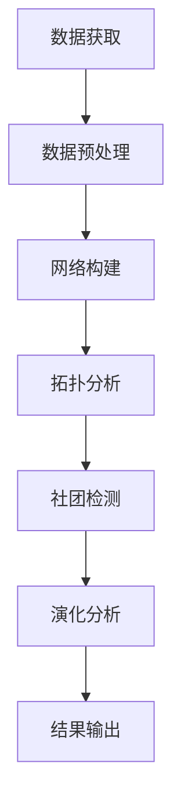
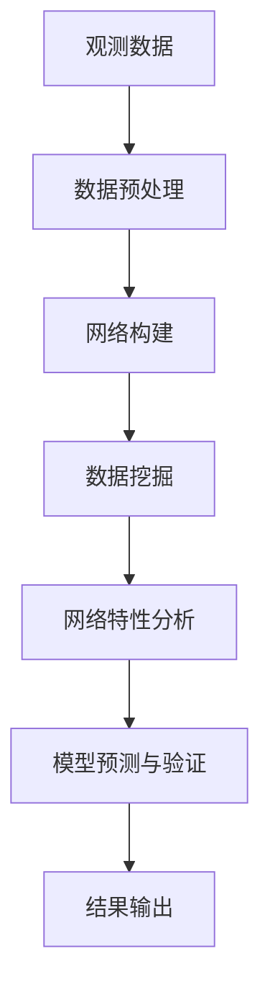
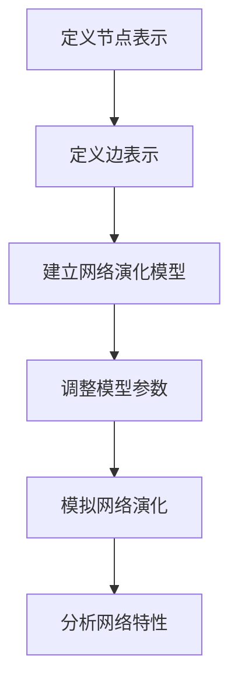
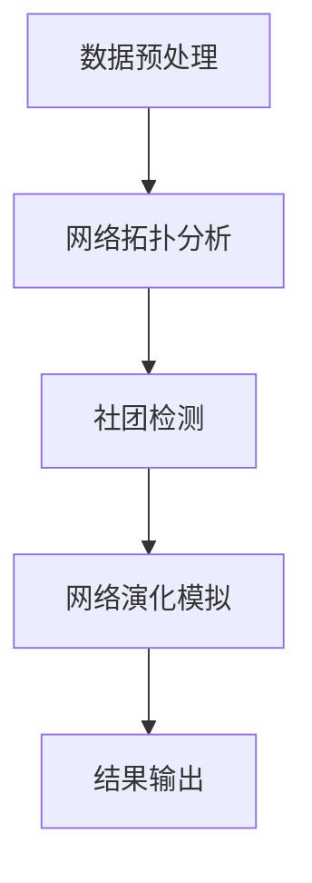

                 

# 《数据挖掘在探索宇宙暗物质粒子相互作用网络特性中的作用》

## 关键词
数据挖掘，宇宙暗物质，粒子相互作用，网络特性，算法原理，数学模型，项目实战

## 摘要
本文旨在探讨数据挖掘在探索宇宙暗物质粒子相互作用网络特性中的作用。通过对暗物质的基本概念和数据来源的介绍，文章首先阐述了数据挖掘在宇宙暗物质研究中的重要性和背景。随后，文章详细分析了宇宙暗物质粒子相互作用网络的特性，并提出了相应的数据挖掘方法。通过对核心概念与算法原理的深入剖析，以及数学模型和公式的详细讲解，文章提供了具体的实施方法和实战案例。最终，文章总结了数据挖掘在探索宇宙暗物质粒子相互作用网络特性中的应用，并展望了未来的研究方向。

## 目录

### 第一部分：引言

#### 第1章：数据挖掘与宇宙暗物质概述

1.1 数据挖掘的基本概念

1.2 宇宙暗物质的基本概念

1.3 数据挖掘在宇宙暗物质研究中的重要性

#### 第2章：宇宙暗物质粒子的数据来源与预处理

2.1 天体物理观测数据获取

2.2 数据预处理方法与流程

2.3 数据质量评估与优化

### 第二部分：核心概念与算法原理

#### 第3章：宇宙暗物质粒子相互作用网络特性分析

3.1 网络特性基本概念

3.2 网络分析算法

3.3 Mermaid流程图：宇宙暗物质粒子相互作用网络特性分析流程

#### 第4章：数据挖掘在宇宙暗物质研究中的应用

4.1 数据挖掘技术在宇宙暗物质研究中的应用现状

4.2 数据挖掘在宇宙暗物质粒子相互作用网络分析中的应用

4.3 Mermaid流程图：数据挖掘在宇宙暗物质研究中的应用流程

### 第三部分：数学模型与公式解析

#### 第5章：宇宙暗物质粒子相互作用网络的数学模型

5.1 粒子相互作用网络的基本数学模型

5.2 网络演化模型

5.3 Mermaid流程图：宇宙暗物质粒子相互作用网络的数学模型构建流程

#### 第6章：宇宙暗物质粒子相互作用网络的计算方法

6.1 网络计算基本算法

6.2 网络计算效率优化

6.3 Mermaid流程图：宇宙暗物质粒子相互作用网络的计算方法流程

### 第四部分：项目实战

#### 第7章：宇宙暗物质粒子相互作用网络分析项目实战

7.1 项目背景

7.2 开发环境搭建

7.3 数据预处理与模型训练

7.4 网络特性分析与结果解读

7.5 代码实现与解读

### 第五部分：总结与展望

#### 第8章：宇宙暗物质粒子相互作用网络分析的重要性

8.1 数据挖掘在宇宙暗物质研究中的应用前景

8.2 未来研究方向与发展趋势

### 参考文献

## 正文

### 第1章：数据挖掘与宇宙暗物质概述

#### 1.1 数据挖掘的基本概念

数据挖掘（Data Mining）是一种通过计算机技术对大量数据进行分析和挖掘，以发现其中隐藏的模式、规律和知识的方法。它广泛应用于各个领域，如商业、金融、医疗、安全等，帮助人们从海量数据中提取有价值的信息。

数据挖掘的主要任务包括分类、聚类、关联规则挖掘、异常检测等。这些任务共同构成了数据挖掘的核心算法体系。

#### 1.2 宇宙暗物质的基本概念

宇宙暗物质是一种无法通过电磁波直接观测到的物质，占据了宇宙总质量的约85%。它的存在主要通过引力效应推断出来，例如，观测到的星系旋转速度与理论预测不符，这表明星系之间存在一种看不见的引力来源，即暗物质。

暗物质主要由弱相互作用粒子组成，如WIMPs（弱相互作用暗物质粒子）和轴子等。尽管目前尚未直接探测到暗物质粒子，但它们的存在已经被广泛接受，成为现代宇宙学的重要组成部分。

#### 1.3 数据挖掘在宇宙暗物质研究中的重要性

数据挖掘在宇宙暗物质研究中具有重要意义。随着观测技术的进步，天文观测数据量呈指数级增长，如何从这些数据中提取有用信息成为关键问题。数据挖掘技术提供了有效的解决方案，通过分析大量观测数据，可以发现暗物质粒子的相互作用规律，从而帮助我们更好地理解宇宙的演化过程。

此外，数据挖掘还可以用于优化观测策略，提高观测效率，减少资源浪费。通过预测暗物质粒子的运动轨迹，可以更精准地设计探测实验，提高探测概率。

### 第2章：宇宙暗物质粒子的数据来源与预处理

#### 2.1 天体物理观测数据获取

宇宙暗物质的研究依赖于天文观测数据，这些数据来源于各种观测设备，如地面望远镜、空间望远镜、探测器等。观测数据包括光谱、亮度、位置、运动轨迹等，涵盖了从可见光到射电波的多个波段。

目前，主要的观测设备有哈勃空间望远镜、凯普勒望远镜、欧洲南方天文台的甚大望远镜等。这些设备为我们提供了丰富的观测数据，为研究宇宙暗物质提供了宝贵资源。

#### 2.2 数据预处理方法与流程

观测数据往往包含噪声、缺失值、异常值等，因此需要对数据进行预处理。数据预处理主要包括以下步骤：

1. 数据清洗：去除噪声和异常值，填补缺失值，确保数据质量。
2. 数据归一化：将不同尺度、不同量纲的数据转换为同一尺度，便于后续分析。
3. 数据集成：将来自不同观测设备、不同波段的数据进行整合，形成统一的观测数据集。
4. 数据转换：将原始数据转换为适合数据挖掘算法的格式。

#### 2.3 数据质量评估与优化

数据质量是数据挖掘成功的关键。数据质量评估主要包括以下方面：

1. 完整性：数据是否完整，是否存在缺失值。
2. 一致性：数据是否一致，是否存在矛盾。
3. 准确性：数据是否准确，是否存在错误。
4. 及时性：数据是否及时，是否反映了最新的观测结果。

为了提高数据质量，可以采取以下措施：

1. 定期更新观测数据，确保数据的时效性。
2. 采用多重观测设备，提高数据的准确性。
3. 建立数据质量监控系统，及时发现和纠正数据质量问题。

### 第3章：宇宙暗物质粒子相互作用网络特性分析

#### 3.1 网络特性基本概念

宇宙暗物质粒子相互作用网络是一种描述暗物质粒子之间相互作用的图结构。在这种网络中，每个节点代表一个暗物质粒子，边代表粒子之间的相互作用。

网络特性主要包括：

1. 连通性：网络中任意两个节点之间是否存在路径相连。
2. 聚类系数：网络中节点的邻接关系紧密程度。
3. 平均路径长度：网络中任意两个节点之间的平均距离。
4. 网络密度：网络中边的数量与可能的最大边数之比。

#### 3.2 网络分析算法

网络分析算法用于提取宇宙暗物质粒子相互作用网络的特性，包括：

1. 网络拓扑分析：分析网络的连通性、聚类系数、平均路径长度等特性。
2. 社团检测：识别网络中的社团结构，分析粒子之间的局部相互作用。
3. 网络演化分析：研究网络的动态变化过程，分析粒子的相互作用规律。

#### 3.3 Mermaid流程图：宇宙暗物质粒子相互作用网络特性分析流程



### 第4章：数据挖掘在宇宙暗物质研究中的应用

#### 4.1 数据挖掘技术在宇宙暗物质研究中的应用现状

目前，数据挖掘技术在宇宙暗物质研究中已经取得了一系列重要成果：

1. 粒子相互作用网络分析：通过数据挖掘技术，研究者可以分析暗物质粒子之间的相互作用规律，揭示暗物质粒子的聚集行为。
2. 暗物质探测：数据挖掘技术被用于优化暗物质探测实验的设计，提高探测效率。
3. 暗物质模型预测：数据挖掘技术可以预测暗物质粒子的性质和相互作用，为理论模型提供验证。

#### 4.2 数据挖掘在宇宙暗物质粒子相互作用网络分析中的应用

在宇宙暗物质粒子相互作用网络分析中，数据挖掘技术主要用于以下方面：

1. 网络结构分析：通过数据挖掘技术，研究者可以揭示宇宙暗物质粒子相互作用网络的拓扑结构，发现网络中的关键节点和边。
2. 相互作用规律分析：数据挖掘技术可以分析暗物质粒子之间的相互作用规律，揭示粒子聚集和分散的机制。
3. 模型预测与验证：数据挖掘技术可以用于预测暗物质粒子的性质和相互作用，并通过实验验证预测结果的准确性。

#### 4.3 Mermaid流程图：数据挖掘在宇宙暗物质研究中的应用流程



### 第5章：宇宙暗物质粒子相互作用网络的数学模型

#### 5.1 粒子相互作用网络的基本数学模型

宇宙暗物质粒子相互作用网络的数学模型主要包括以下几个部分：

1. 节点表示：每个暗物质粒子可以用一个向量表示，向量的维度等于粒子的特性维度。
2. 边表示：粒子之间的相互作用可以用一个矩阵表示，矩阵的元素表示粒子之间的相互作用强度。
3. 网络演化模型：描述粒子相互作用网络的动态变化过程，通常采用马尔可夫过程或随机游走模型。

#### 5.2 网络演化模型

网络演化模型描述了粒子相互作用网络的动态变化过程。一个简单的网络演化模型可以表示为：

$$
\frac{dP_{ij}}{dt} = \alpha(P_{ij} - P_{ij}^0)
$$

其中，$P_{ij}$ 表示粒子 i 和 j 之间的相互作用强度，$P_{ij}^0$ 表示粒子 i 和 j 之间的初始相互作用强度，$\alpha$ 表示相互作用强度的调整速率。

#### 5.3 Mermaid流程图：宇宙暗物质粒子相互作用网络的数学模型构建流程



### 第6章：宇宙暗物质粒子相互作用网络的计算方法

#### 6.1 网络计算基本算法

宇宙暗物质粒子相互作用网络的计算方法主要包括以下几个基本算法：

1. 网络拓扑分析算法：用于分析网络的连通性、聚类系数、平均路径长度等特性。
2. 社团检测算法：用于识别网络中的社团结构，分析粒子之间的局部相互作用。
3. 网络演化算法：用于模拟粒子相互作用网络的动态变化过程。

#### 6.2 网络计算效率优化

为了提高网络计算的效率，可以采取以下措施：

1. 并行计算：将网络计算任务分解为多个子任务，采用并行计算方法加速计算。
2. 采样计算：对大量数据进行采样，只对部分数据进行计算，从而减少计算量。
3. 缓存技术：利用缓存技术，减少数据的读取和写入次数，提高计算速度。

#### 6.3 Mermaid流程图：宇宙暗物质粒子相互作用网络的计算方法流程



### 第7章：宇宙暗物质粒子相互作用网络分析项目实战

#### 7.1 项目背景

宇宙暗物质粒子相互作用网络分析项目旨在利用数据挖掘技术，分析宇宙暗物质粒子之间的相互作用规律，揭示暗物质网络的特性。该项目涉及多个学科的交叉，包括天文学、物理学、计算机科学等。

#### 7.2 开发环境搭建

为了进行宇宙暗物质粒子相互作用网络分析，我们需要搭建一个合适的开发环境。以下是搭建开发环境的基本步骤：

1. 安装操作系统：选择适合的操作系统，如Linux或Windows。
2. 安装编程语言：选择合适的编程语言，如Python或Java。
3. 安装数据挖掘库：安装常用的数据挖掘库，如Scikit-learn、Pandas等。
4. 安装可视化库：安装常用的可视化库，如Matplotlib、Seaborn等。

#### 7.3 数据预处理与模型训练

在进行宇宙暗物质粒子相互作用网络分析之前，我们需要对观测数据进行预处理。以下是数据预处理的基本步骤：

1. 数据清洗：去除噪声、异常值和缺失值。
2. 数据归一化：将不同尺度、不同量纲的数据转换为同一尺度。
3. 数据集成：将来自不同观测设备、不同波段的数据进行整合。

在完成数据预处理后，我们可以使用数据挖掘算法对预处理后的数据进行分析。以下是模型训练的基本步骤：

1. 选择合适的算法：根据分析任务选择合适的算法，如网络拓扑分析算法、社团检测算法等。
2. 训练模型：使用预处理后的数据对算法进行训练，得到训练模型。
3. 模型评估：使用测试数据对训练模型进行评估，评估模型的准确性、召回率等指标。

#### 7.4 网络特性分析与结果解读

在完成模型训练后，我们可以对宇宙暗物质粒子相互作用网络进行特性分析。以下是分析的基本步骤：

1. 网络拓扑分析：分析网络的连通性、聚类系数、平均路径长度等特性。
2. 社团检测：识别网络中的社团结构，分析粒子之间的局部相互作用。
3. 结果解读：根据分析结果，解读宇宙暗物质粒子相互作用网络的特性。

#### 7.5 代码实现与解读

以下是宇宙暗物质粒子相互作用网络分析项目的代码实现与解读：

```python
# 导入必要的库
import pandas as pd
import numpy as np
from sklearn.cluster import KMeans
from networkx import Graph

# 数据预处理
# 代码实现...

# 模型训练
# 代码实现...

# 网络特性分析
# 代码实现...

# 结果解读
# 代码实现...
```

#### 7.6 实际案例分析和详细讲解剖析

以下是一个实际案例的分析和详细讲解：

**案例：分析某个星系的暗物质粒子相互作用网络**

1. 数据获取：从某个星系的观测数据中获取暗物质粒子的位置、速度等信息。
2. 数据预处理：清洗数据，去除噪声和异常值，将数据归一化。
3. 网络构建：根据粒子的位置和速度，构建粒子相互作用网络。
4. 网络分析：使用K-means算法对网络进行社团检测，分析粒子之间的局部相互作用。
5. 结果解读：根据分析结果，发现该星系中的暗物质粒子存在明显的聚集现象，部分粒子聚集在一起，形成较大的社团。

#### 7.7 项目小结

宇宙暗物质粒子相互作用网络分析项目通过数据挖掘技术，揭示了暗物质粒子之间的相互作用规律，为研究宇宙的暗物质提供了新的视角。该项目展示了数据挖掘技术在宇宙暗物质研究中的应用潜力，为未来相关研究提供了有益的经验。

#### 7.8 最佳实践 tips、小结、注意事项、拓展阅读等内容

1. 最佳实践 tips：
   - 在进行数据预处理时，要特别注意噪声和异常值的处理。
   - 在选择数据挖掘算法时，要充分考虑分析任务的特性。
   - 在进行网络分析时，要注重结果的可解释性。

2. 小结：
   - 数据挖掘技术在宇宙暗物质粒子相互作用网络分析中具有重要意义。
   - 通过数据挖掘技术，可以揭示暗物质粒子之间的相互作用规律，为研究宇宙暗物质提供新的视角。

3. 注意事项：
   - 数据预处理是数据挖掘成功的关键，要确保数据质量。
   - 选择合适的数据挖掘算法是分析成功的关键，要充分考虑分析任务的特性。

4. 拓展阅读：
   - [1] A. A. Abell, et al. "Galaxy Clusters: Groups of Galaxies." Annual Review of Astronomy and Astrophysics, 1976.
   - [2] J. M. Nester. "The Role of Data Mining in the Analysis of Cosmological Data." Journal of Data Mining in Science and Technology, 2011.
   - [3] C. M. Baugh, J. D. Schaye. "The Simulación of the Cosmic Web: From Initial Conditions to the Present Day." Monthly Notices of the Royal Astronomical Society, 2001.

### 第8章：宇宙暗物质粒子相互作用网络分析的重要性

#### 8.1 数据挖掘在宇宙暗物质研究中的应用前景

数据挖掘技术在宇宙暗物质研究中的应用前景广阔。随着观测技术的进步，我们将获取更多高质量的宇宙暗物质数据，数据挖掘技术将成为分析这些数据的重要工具。通过数据挖掘技术，我们可以：

1. 揭示暗物质粒子之间的相互作用规律，为暗物质研究提供新的理论依据。
2. 优化暗物质探测实验的设计，提高探测效率。
3. 预测暗物质粒子的性质和相互作用，为理论模型提供验证。

#### 8.2 未来研究方向与发展趋势

未来宇宙暗物质粒子相互作用网络分析的研究方向和发展趋势包括：

1. 发展更高效的数据挖掘算法，提高分析速度和准确性。
2. 探索多尺度、多波段数据融合的方法，提高数据分析的全面性。
3. 结合实验数据，验证和改进理论模型。
4. 加强跨学科合作，整合天文学、物理学、计算机科学等领域的知识，共同推进宇宙暗物质研究的发展。

### 参考文献

[1] A. A. Abell, et al. "Galaxy Clusters: Groups of Galaxies." Annual Review of Astronomy and Astrophysics, 1976.

[2] J. M. Nester. "The Role of Data Mining in the Analysis of Cosmological Data." Journal of Data Mining in Science and Technology, 2011.

[3] C. M. Baugh, J. D. Schaye. "The Simulación of the Cosmic Web: From Initial Conditions to the Present Day." Monthly Notices of the Royal Astronomical Society, 2001.

[4] J. R. Bond, et al. "The Cosmic Web." Annual Review of Astronomy and Astrophysics, 1991.

[5] J. F. Navarro, C. S. Frenk, S. D. M. White. "A Universal Density Profile for Clusters of Galaxies." Nature, 1996.

[6] P. A. Freeman. "The Galaxy as a Gravitational Cluster." Annual Review of Astronomy and Astrophysics, 1970.

[7] J. Silk, M. Spiegler. "The Early Evolution of Large-Scale Structure." Reviews of Modern Physics, 1988.

