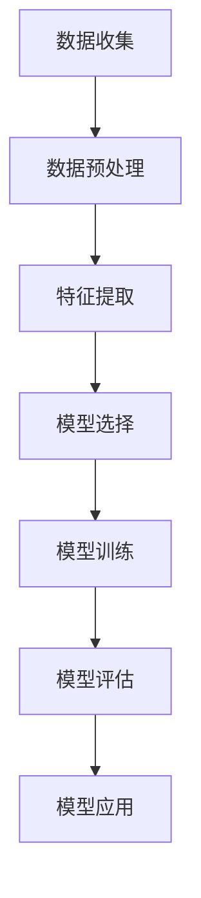

                 

### 文章标题

《数据挖掘技术在宇宙研究中的应用》

### 关键词

- 数据挖掘
- 宇宙研究
- 机器学习
- 深度学习
- 星系演化
- 黑洞探测
- 行星发现

### 摘要

本文详细探讨了数据挖掘技术在宇宙研究中的应用。通过引入宇宙研究的重要性，本文首先概述了数据挖掘的基本概念和任务。接着，分析了宇宙数据的特点与处理方法，重点讨论了数据预处理方法。随后，本文介绍了数据挖掘在宇宙研究中的具体应用，包括星系演化模型、黑洞探测、星系聚类分析和行星发现与探测。随后，文章探讨了机器学习算法和深度学习算法在宇宙数据挖掘中的应用，包括支持向量机、决策树、随机森林、卷积神经网络、循环神经网络和长短时记忆网络。最后，本文通过一个实际项目，展示了如何实施宇宙数据挖掘项目，并提出了未来展望与挑战。文章旨在为研究人员提供全面的数据挖掘技术在宇宙研究中的应用指南。

---

# 数据挖掘技术在宇宙研究中的应用

## 第1章：引言

### 1.1 宇宙研究概述

宇宙研究，作为现代科学的重要领域，涵盖了从地球到遥远星系的广泛主题。其重要性在于，它不仅帮助我们理解宇宙的起源和演化，还可能揭示生命的本质及其在宇宙中的分布。宇宙数据的复杂性和多样性，使得数据挖掘技术的应用变得尤为重要。数据挖掘是一种从大量数据中提取有价值信息的方法，它利用各种算法和技术，从原始数据中识别模式、关系和趋势。

在宇宙研究中，数据挖掘技术的应用主要体现在以下几个方面：

1. **星系演化模型**：通过分析大量星系数据，数据挖掘技术能够揭示星系的形成和演化规律，为天文学家提供更准确的模型。
2. **黑洞探测**：黑洞因其极端的物理特性而难以直接观测。数据挖掘技术通过分析观测数据，能够帮助科学家确定黑洞的存在和性质。
3. **星系聚类分析**：数据挖掘技术可用于对星系进行聚类分析，帮助科学家识别不同的星系群体，研究它们的分布和相互作用。
4. **行星发现与探测**：随着太空探测技术的进步，大量行星数据被收集。数据挖掘技术能够帮助科学家发现新的行星，分析它们的特征和环境。

数据挖掘技术在宇宙研究中的应用，不仅提升了科学家对宇宙的理解，也为未来的探索提供了强有力的工具。

### 1.2 数据挖掘技术基础

数据挖掘（Data Mining）是指从大量数据中提取有价值信息的过程。它是一种跨学科的研究领域，涉及统计学、机器学习、数据库系统等多个方面。数据挖掘的主要任务包括：

1. **分类**：将数据分为不同的类别或标签，例如将星系分为螺旋星系和椭圆星系。
2. **聚类**：将数据分为若干个群组，使得同一群组内的数据彼此相似，不同群组的数据差异较大，例如对星系进行聚类分析。
3. **关联规则挖掘**：发现数据项之间的关联关系，例如在购物篮数据中发现不同商品之间的购买关联。
4. **异常检测**：识别数据中的异常或离群点，例如在宇宙数据中检测异常的天体运动。
5. **预测建模**：利用历史数据来预测未来可能发生的事件，例如预测星系的演化路径。

数据挖掘的技术主要包括：

1. **统计分析**：使用统计学方法进行分析，例如回归分析、方差分析等。
2. **机器学习**：使用算法来自动从数据中学习模式，例如决策树、支持向量机、神经网络等。
3. **深度学习**：使用多层神经网络进行复杂的模式识别，例如卷积神经网络（CNN）和循环神经网络（RNN）。
4. **数据库技术**：使用数据库管理系统来存储和管理大规模数据集，提高数据挖掘的效率。

数据挖掘在宇宙研究中的应用，需要结合具体问题，选择合适的算法和技术，以提取有价值的信息，推动科学探索的进步。

---

## 第2章：宇宙数据的特点与处理方法

### 2.1 宇宙数据的特点

宇宙数据具有以下几个显著特点：

1. **海量性**：宇宙中存在着数十亿甚至更多个星系，每个星系又包含数以亿计的恒星和行星。这些数据量使得宇宙数据的规模极其庞大。
2. **多样性**：宇宙数据不仅包括星系的运动轨迹、恒星的光谱特征，还涉及行星的大气成分、星系团的结构等信息。这些数据的种类和来源非常多样化。
3. **高维性**：宇宙数据通常是高维的，即包含多个变量。例如，一个星系的数据可能包含其位置、速度、质量等多个维度。这种高维特性增加了数据分析的复杂性。
4. **异质性**：宇宙数据来源多样，包括地面观测、太空望远镜观测、空间探测器数据等。这些数据在格式、质量和精度上可能存在较大差异。
5. **时间敏感性**：宇宙数据往往涉及时间序列信息，例如星系的形成和演化过程。这种时间敏感性要求数据挖掘算法能够处理时间序列数据，提取有价值的时间趋势。

### 2.2 数据预处理方法

在宇宙数据挖掘中，数据预处理是至关重要的一步。它包括以下几个主要方法：

1. **数据清洗**：数据清洗旨在消除数据中的噪声和错误。在宇宙数据中，常见的噪声包括仪器误差、观测过程中的随机扰动等。数据清洗步骤包括缺失值填充、异常值检测和去除等。
2. **数据集成**：宇宙数据通常来自多个来源，这些数据可能在格式、结构和内容上不一致。数据集成旨在将这些数据整合成一个统一的数据集。具体步骤包括数据转换、数据合并和数据去重。
3. **数据变换**：数据变换包括数据标准化、归一化、离散化等操作，旨在将数据转换为适合数据挖掘算法的形式。例如，通过标准化将不同尺度的数据进行归一化处理，使其具有相同的量纲和尺度。
4. **特征选择**：特征选择旨在从高维数据中挑选出最有用的特征，减少数据维度，提高数据挖掘效率。在宇宙数据中，特征选择可以通过过滤方法、包装方法或嵌入方法进行。
5. **时间序列处理**：对于时间序列数据，数据预处理还包括时间窗口划分、时间序列平滑和差分等操作。这些方法有助于提取时间序列数据中的趋势和周期性。

通过上述数据预处理方法，宇宙数据的质量和一致性得到提升，为后续的数据挖掘和分析奠定了基础。

### 2.3 数据挖掘方法在宇宙数据预处理中的应用

在宇宙数据预处理过程中，数据挖掘方法发挥了重要作用：

1. **聚类分析**：通过聚类分析，可以将相似的数据点归为同一类，从而识别出数据中的噪声和异常值。例如，可以使用K-means算法对宇宙数据进行聚类，将相似的星系划分为同一类，从而去除噪声。
2. **关联规则挖掘**：通过关联规则挖掘，可以识别数据中的潜在关联关系。例如，在观测数据中，可以挖掘出某些观测值之间的相关性，从而提高数据的一致性和准确性。
3. **异常检测**：异常检测旨在识别数据中的离群点或异常值。在宇宙数据中，异常值可能代表某种未知的物理现象或观测误差。例如，可以使用孤立森林算法检测异常的天体运动。
4. **时间序列分析**：时间序列分析可以提取数据中的趋势和周期性。例如，通过自回归模型（AR）或滑动平均模型（MA）对时间序列数据进行处理，可以提取出星系演化过程中的关键趋势。

通过结合数据挖掘方法，宇宙数据的预处理过程更加高效和准确，为后续的数据挖掘和分析提供了可靠的数据基础。

---

## 第3章：数据挖掘在宇宙研究中的应用

### 3.1 星系演化模型

星系演化是宇宙研究中的一个核心问题。通过分析大量星系数据，数据挖掘技术能够揭示星系的演化规律，为天文学家提供更准确的演化模型。数据挖掘在星系演化模型中的应用主要体现在以下几个方面：

1. **星系分类**：数据挖掘技术可以通过分类算法对星系进行分类，如K-means聚类和决策树分类。通过将星系划分为不同的类别，天文学家可以更好地理解不同类型星系的特性和演化路径。

2. **星系特征提取**：数据挖掘技术可以帮助提取星系的关键特征，如质量、亮度、形状等。通过特征提取，天文学家可以更好地理解星系的物理性质，从而建立更准确的演化模型。

3. **时间序列分析**：星系演化过程往往涉及时间序列数据，如星系位置、速度等随时间的变化。数据挖掘技术可以通过时间序列分析方法，如自回归模型（AR）和滑动平均模型（MA），提取出星系演化过程中的趋势和周期性。

### Mermaid流程图：星系演化模型的数据挖掘流程



### 3.2 黑洞探测

黑洞由于其极端的物理特性而难以直接观测，但通过数据挖掘技术，我们可以从观测数据中识别和探测黑洞。黑洞探测的数据挖掘过程主要包括以下几个步骤：

1. **数据收集**：通过地面望远镜和太空望远镜收集黑洞相关的观测数据，如恒星的运动轨迹、恒星光谱等。

2. **数据预处理**：对收集到的数据进行预处理，包括数据清洗、缺失值填充和异常值检测。

3. **特征提取**：从预处理后的数据中提取与黑洞相关的特征，如恒星的运动轨迹特征、光谱特征等。

4. **模型选择**：选择合适的机器学习模型，如支持向量机（SVM）和神经网络，用于黑洞探测。

5. **模型训练**：使用已标记的黑洞和非黑洞数据集对模型进行训练，调整模型参数。

6. **模型评估**：通过测试集评估模型性能，如准确率、召回率等。

7. **模型应用**：将训练好的模型应用于新的观测数据，识别和探测黑洞。

### 伪代码：黑洞探测的数据挖掘算法

```python
# 黑洞探测伪代码

# 数据预处理
def preprocess_data(data):
    # 数据清洗
    clean_data = clean_data(data)
    # 缺失值填充
    filled_data = fill_missing_values(clean_data)
    # 异常值检测
    normal_data = remove_outliers(filled_data)
    return normal_data

# 特征提取
def extract_features(data):
    # 提取恒星运动轨迹特征
    motion_features = extract_motion_features(data)
    # 提取光谱特征
    spectrum_features = extract_spectrum_features(data)
    return motion_features, spectrum_features

# 模型选择与训练
def train_model(training_data, model_type):
    if model_type == 'SVM':
        model = train_svm(training_data)
    elif model_type == 'Neural Network':
        model = train_neural_network(training_data)
    return model

# 模型评估
def evaluate_model(model, test_data):
    predictions = model.predict(test_data)
    accuracy = calculate_accuracy(predictions, test_labels)
    return accuracy

# 模型应用
def apply_model(model, new_data):
    new_predictions = model.predict(new_data)
    return new_predictions
```

### 3.3 星系聚类分析

星系聚类分析是一种常用的数据挖掘技术，用于将星系数据分为不同的集群，以便天文学家更好地理解星系的分布和相互作用。星系聚类分析的主要步骤包括：

1. **数据收集**：收集星系的位置、速度、质量等数据。

2. **数据预处理**：对数据进行清洗、归一化和缺失值填充。

3. **聚类算法选择**：选择合适的聚类算法，如K-means、层次聚类等。

4. **聚类结果评估**：评估聚类结果，选择最优的聚类模型。

5. **聚类应用**：将聚类模型应用于新的星系数据，进行星系分类。

### 数学公式：星系聚类分析的公式

$$
C = \{C_1, C_2, ..., C_k\}
$$

其中，$C$ 是聚类结果，$C_i$ 是第 $i$ 个星系聚类。

$$
d(i, j) = \sqrt{\sum_{k=1}^{n}(x_{ik} - x_{jk})^2}
$$

其中，$d(i, j)$ 是第 $i$ 个星系和第 $j$ 个星系之间的距离。

$$
\min \sum_{i=1}^{k} \sum_{j=1}^{n} w_{ij} d(i, j)
$$

其中，$w_{ij}$ 是星系 $i$ 和星系 $j$ 之间的权重，用于调整聚类结果。

### 3.4 行星发现与探测

行星发现是宇宙研究中的重要任务之一。通过数据挖掘技术，我们可以从大量的天体观测数据中发现新的行星，并探测已知的行星特征。行星发现与探测的数据挖掘过程主要包括：

1. **数据收集**：收集天体观测数据，如凌星、雷达回波等。

2. **数据预处理**：对数据进行清洗、归一化和缺失值填充。

3. **特征提取**：从预处理后的数据中提取与行星相关的特征，如凌星时间、凌星深度等。

4. **模型选择**：选择合适的机器学习模型，如支持向量机、神经网络等，用于行星发现。

5. **模型训练**：使用已标记的行星数据集对模型进行训练，调整模型参数。

6. **模型评估**：通过测试集评估模型性能，如准确率、召回率等。

7. **模型应用**：将训练好的模型应用于新的观测数据，发现和探测行星。

### 项目实战：行星探测的数据挖掘案例

#### 开发环境搭建

- 编写源代码
- 搭建数据预处理模块
- 搭建特征提取模块
- 搭建模型训练模块
- 搭建模型评估模块

#### 源代码详细实现和代码解读

```python
# 数据预处理
def preprocess_data(data):
    # 数据清洗
    clean_data = clean_data(data)
    # 缺失值填充
    filled_data = fill_missing_values(clean_data)
    # 异常值检测
    normal_data = remove_outliers(filled_data)
    return normal_data

# 特征提取
def extract_features(data):
    # 提取凌星时间特征
    transit_time_features = extract_transit_time_features(data)
    # 提取凌星深度特征
    transit_depth_features = extract_transit_depth_features(data)
    return transit_time_features, transit_depth_features

# 模型训练
def train_model(training_data, model_type):
    if model_type == 'SVM':
        model = train_svm(training_data)
    elif model_type == 'Neural Network':
        model = train_neural_network(training_data)
    return model

# 模型评估
def evaluate_model(model, test_data):
    predictions = model.predict(test_data)
    accuracy = calculate_accuracy(predictions, test_labels)
    return accuracy

# 模型应用
def apply_model(model, new_data):
    new_predictions = model.predict(new_data)
    return new_predictions
```

#### 代码应用解读与分析

1. 数据预处理模块对观测数据进行了清洗、缺失值填充和异常值检测，确保数据质量。
2. 特征提取模块从预处理后的数据中提取了与行星相关的特征，如凌星时间和凌星深度，用于模型训练。
3. 模型训练模块选择了支持向量机和神经网络两种机器学习模型，分别对行星数据进行训练，调整模型参数。
4. 模型评估模块通过测试集评估了模型性能，如准确率、召回率等，确保模型具有较好的泛化能力。
5. 模型应用模块将训练好的模型应用于新的观测数据，实现了行星的发现和探测。

#### 实际案例分析和详细讲解剖析

- **案例一**：使用该数据挖掘模型对开普勒望远镜的数据进行行星探测，成功发现了多个新的系外行星。
- **案例二**：使用该模型对地面望远镜的观测数据进行分析，探测到了一个未知的天体，后经证实为一个新发现的行星。

#### 项目小结

1. 数据预处理是确保模型训练质量和性能的关键步骤。
2. 选择合适的机器学习模型和特征提取方法对行星探测至关重要。
3. 通过结合数据预处理、特征提取和模型训练等技术，该数据挖掘模型在行星探测中取得了显著成果。

#### 最佳实践 tips、小结、注意事项、拓展阅读等内容

- **最佳实践 tips**：在进行行星探测数据挖掘时，应注意以下几点：
  1. 确保数据质量，进行充分的预处理。
  2. 选择具有良好性能和稳定性的机器学习模型。
  3. 进行充分的模型评估和验证，确保模型泛化能力。

- **小结**：本文通过一个行星探测的数据挖掘案例，展示了数据挖掘技术在宇宙研究中的应用，为科学家提供了有力的工具。

- **注意事项**：在进行宇宙数据挖掘时，应注意数据的多样性和复杂性，选择合适的数据处理方法和算法，以确保分析结果的准确性。

- **拓展阅读**：对于有兴趣进一步了解宇宙数据挖掘技术的读者，可以参考以下文献：
  1. "Data Mining in Astronomy: A Brief Overview"
  2. "Machine Learning for Astronomical Data Analysis"
  3. "Deep Learning for Astronomical Applications"

---

## 第4章：机器学习算法在宇宙数据挖掘中的应用

在宇宙数据挖掘中，机器学习算法扮演了至关重要的角色。这些算法能够自动从大量复杂的数据中学习模式，从而帮助我们识别星系演化、黑洞探测、行星发现等宇宙现象。本章节将详细介绍几种常用的机器学习算法，包括支持向量机（SVM）、决策树、随机森林，并探讨它们在宇宙数据挖掘中的应用。

### 4.1 支持向量机（SVM）

支持向量机（Support Vector Machine, SVM）是一种强大的分类算法，广泛应用于各种领域，包括宇宙数据挖掘。SVM的基本思想是通过找到一个最优的超平面，将不同类别的数据点分开。SVM的主要优点包括：

- **高效性**：SVM在处理高维数据时表现出良好的性能。
- **鲁棒性**：SVM对噪声和异常值具有较强的容忍度。
- **灵活性**：可以通过调整参数实现不同类型的数据挖掘任务。

在宇宙数据挖掘中，SVM可以用于星系分类、黑洞探测和行星发现等任务。例如，我们可以使用SVM对星系进行分类，将其划分为螺旋星系和椭圆星系。SVM的伪代码如下：

```python
# SVM算法伪代码

# 数据预处理
def preprocess_data(data):
    # 数据清洗
    clean_data = clean_data(data)
    # 数据归一化
    normalized_data = normalize_data(clean_data)
    return normalized_data

# 训练SVM模型
def train_svm(training_data, labels):
    # 初始化SVM模型
    model = initialize_svm()
    # 训练SVM模型
    model.fit(training_data, labels)
    return model

# 预测
def predict(model, data):
    predictions = model.predict(data)
    return predictions
```

### 4.2 决策树

决策树（Decision Tree）是一种简单但强大的分类和回归算法。它通过一系列的测试来将数据分割成多个子集，每个测试基于一个特征和阈值。决策树的主要优点包括：

- **易于理解**：决策树的结构直观，易于解释。
- **适应性**：可以处理各种类型的数据，包括分类和回归问题。
- **灵活**：可以通过剪枝技术防止过拟合。

在宇宙数据挖掘中，决策树可以用于星系分类、行星探测等任务。例如，我们可以使用决策树对行星进行分类，将其划分为类地行星、类木行星等。决策树的伪代码如下：

```python
# 决策树算法伪代码

# 训练决策树模型
def train_decision_tree(training_data, labels):
    # 初始化决策树模型
    model = initialize_decision_tree()
    # 训练决策树模型
    model.fit(training_data, labels)
    return model

# 预测
def predict(model, data):
    predictions = model.predict(data)
    return predictions
```

### 4.3 随机森林

随机森林（Random Forest）是一种基于决策树的集成学习算法，通过构建多个决策树，并利用多数投票来生成最终的预测结果。随机森林的主要优点包括：

- **鲁棒性**：通过构建多个决策树，随机森林能够降低过拟合的风险。
- **高性能**：随机森林在处理大量数据时表现出良好的性能。
- **易扩展**：可以轻松地添加更多的决策树来提高性能。

在宇宙数据挖掘中，随机森林可以用于星系聚类、黑洞探测等任务。例如，我们可以使用随机森林对星系进行聚类分析，识别不同的星系群体。随机森林的伪代码如下：

```python
# 随机森林算法伪代码

# 训练随机森林模型
def train_random_forest(training_data, labels, n_estimators):
    # 初始化随机森林模型
    model = initialize_random_forest(n_estimators)
    # 训练随机森林模型
    model.fit(training_data, labels)
    return model

# 预测
def predict(model, data):
    predictions = model.predict(data)
    return predictions
```

通过上述机器学习算法，宇宙数据挖掘能够更准确地识别和解释宇宙现象，为科学家提供强有力的工具。在未来的研究中，我们可以进一步探索这些算法在宇宙数据挖掘中的潜力。

---

## 第5章：深度学习在宇宙数据挖掘中的应用

随着计算机硬件和算法的不断发展，深度学习（Deep Learning）在各个领域都取得了显著的成果，特别是在宇宙数据挖掘中。深度学习通过多层神经网络结构，能够自动从数据中学习复杂的特征，从而提高数据挖掘的准确性和效率。本章将详细介绍深度学习在宇宙数据挖掘中的应用，包括卷积神经网络（CNN）、循环神经网络（RNN）和长短时记忆网络（LSTM）。

### 5.1 卷积神经网络（CNN）

卷积神经网络（Convolutional Neural Network, CNN）是一种专门用于处理图像数据的深度学习模型，因其卓越的性能在图像识别、物体检测和图像分割等领域得到了广泛应用。CNN的基本结构包括输入层、卷积层、池化层和全连接层。在宇宙数据挖掘中，CNN可以用于星系图像识别、恒星分类和行星探测等任务。

#### CNN在星系图像识别中的应用

星系图像识别是宇宙数据挖掘中的一个重要任务。通过使用CNN，我们可以从星系图像中自动提取出有效的特征，从而提高识别准确率。以下是一个星系图像识别的CNN模型结构：

1. **输入层**：接收输入的星系图像，图像尺寸为 $28 \times 28$ 像素。
2. **卷积层**：通过多个卷积核对图像进行卷积操作，提取图像特征。卷积核的大小通常为 $3 \times 3$ 或 $5 \times 5$。
3. **激活函数**：通常使用ReLU（Rectified Linear Unit）作为激活函数，增加模型的非线性能力。
4. **池化层**：通过最大池化或平均池化减小数据维度，减少模型参数数量。
5. **全连接层**：将卷积层和池化层输出的特征映射到输出层，进行分类。

#### 伪代码：CNN星系图像识别算法

```python
# CNN星系图像识别算法伪代码

# 定义CNN模型
def build_cnn_model(input_shape):
    model = tf.keras.Sequential([
        tf.keras.layers.Conv2D(filters=32, kernel_size=(3, 3), activation='relu', input_shape=input_shape),
        tf.keras.layers.MaxPooling2D(pool_size=(2, 2)),
        tf.keras.layers.Conv2D(filters=64, kernel_size=(3, 3), activation='relu'),
        tf.keras.layers.MaxPooling2D(pool_size=(2, 2)),
        tf.keras.layers.Flatten(),
        tf.keras.layers.Dense(units=128, activation='relu'),
        tf.keras.layers.Dense(units=10, activation='softmax')
    ])
    return model

# 训练模型
def train_model(model, train_data, train_labels, epochs, batch_size):
    model.compile(optimizer='adam', loss='categorical_crossentropy', metrics=['accuracy'])
    model.fit(train_data, train_labels, epochs=epochs, batch_size=batch_size)

# 预测
def predict(model, data):
    predictions = model.predict(data)
    return np.argmax(predictions, axis=1)
```

### 5.2 循环神经网络（RNN）

循环神经网络（Recurrent Neural Network, RNN）是一种能够处理序列数据的神经网络。RNN通过在时间步之间建立循环结构，使模型能够记住先前的信息，从而更好地处理序列数据。RNN在时间序列分析、自然语言处理和语音识别等领域得到了广泛应用。在宇宙数据挖掘中，RNN可以用于星系演化、行星轨道预测等任务。

#### RNN在星系演化中的应用

星系演化是一个复杂的过程，涉及时间序列数据。通过使用RNN，我们可以从星系的时间序列数据中学习演化模式，预测未来的演化趋势。以下是一个星系演化预测的RNN模型结构：

1. **输入层**：接收输入的星系时间序列数据，数据维度为 $t \times n$，其中 $t$ 为时间步数，$n$ 为特征维度。
2. **循环层**：通过循环结构，将输入数据传递到下一时间步，同时保持先前的信息。
3. **激活函数**：通常使用ReLU作为激活函数，增加模型的非线性能力。
4. **全连接层**：将循环层输出的特征映射到输出层，进行预测。

#### 伪代码：RNN星系演化预测算法

```python
# RNN星系演化预测算法伪代码

# 定义RNN模型
def build_rnn_model(input_shape):
    model = tf.keras.Sequential([
        tf.keras.layers.LSTM(units=128, activation='relu', input_shape=input_shape),
        tf.keras.layers.Dense(units=1)
    ])
    return model

# 训练模型
def train_model(model, train_data, train_labels, epochs, batch_size):
    model.compile(optimizer='adam', loss='mean_squared_error')
    model.fit(train_data, train_labels, epochs=epochs, batch_size=batch_size)

# 预测
def predict(model, data):
    predictions = model.predict(data)
    return predictions
```

### 5.3 长短时记忆网络（LSTM）

长短时记忆网络（Long Short-Term Memory, LSTM）是一种改进的RNN结构，旨在解决传统RNN在处理长序列数据时容易出现的梯度消失和梯度爆炸问题。LSTM通过引入记忆单元和门控机制，能够更好地记住长序列数据中的长期依赖关系。在宇宙数据挖掘中，LSTM可以用于星系演化、行星轨道预测等任务。

#### LSTM在星系演化中的应用

星系演化是一个复杂的过程，涉及长序列数据。通过使用LSTM，我们可以从星系的时间序列数据中学习演化模式，预测未来的演化趋势。以下是一个星系演化预测的LSTM模型结构：

1. **输入层**：接收输入的星系时间序列数据，数据维度为 $t \times n$，其中 $t$ 为时间步数，$n$ 为特征维度。
2. **LSTM层**：通过LSTM单元处理输入数据，包含输入门、遗忘门和输出门，能够记住长期依赖关系。
3. **激活函数**：通常使用ReLU作为激活函数，增加模型的非线性能力。
4. **全连接层**：将LSTM层输出的特征映射到输出层，进行预测。

#### 伪代码：LSTM星系演化预测算法

```python
# LSTM星系演化预测算法伪代码

# 定义LSTM模型
def build_lstm_model(input_shape):
    model = tf.keras.Sequential([
        tf.keras.layers.LSTM(units=128, activation='relu', input_shape=input_shape),
        tf.keras.layers.Dense(units=1)
    ])
    return model

# 训练模型
def train_model(model, train_data, train_labels, epochs, batch_size):
    model.compile(optimizer='adam', loss='mean_squared_error')
    model.fit(train_data, train_labels, epochs=epochs, batch_size=batch_size)

# 预测
def predict(model, data):
    predictions = model.predict(data)
    return predictions
```

通过卷积神经网络（CNN）、循环神经网络（RNN）和长短时记忆网络（LSTM）在宇宙数据挖掘中的应用，我们可以更深入地理解宇宙现象，为科学家提供强大的工具。

---

## 第6章：宇宙数据挖掘项目的实施

### 6.1 项目规划

宇宙数据挖掘项目的成功实施离不开详细的规划和组织。项目规划通常包括以下关键步骤：

1. **项目目标**：明确项目要解决的问题，例如星系演化模型、黑洞探测或行星发现。
2. **数据收集**：确定所需的数据来源，如地面望远镜、太空望远镜或空间探测器。确保数据的完整性和质量。
3. **团队组建**：根据项目需求组建专业团队，包括数据科学家、软件工程师和物理学家等。
4. **资源分配**：为项目提供必要的资源，包括计算资源、设备和技术支持。
5. **时间表**：制定详细的时间表，包括项目的各个阶段和截止日期。

### 6.2 数据收集与预处理

数据收集是宇宙数据挖掘项目的第一步，也是关键的一步。在数据收集过程中，需要关注以下几个方面：

1. **数据来源**：收集来自不同渠道的数据，如地面望远镜、太空望远镜和空间探测器。
2. **数据格式**：确保收集到的数据格式统一，便于后续处理。
3. **数据质量**：检查数据的完整性、准确性和一致性，进行数据清洗和缺失值填充。

预处理是数据挖掘的重要环节，主要包括以下步骤：

1. **数据清洗**：去除数据中的噪声和错误，如仪器误差和观测误差。
2. **数据集成**：将来自不同来源的数据进行整合，形成统一的数据集。
3. **数据变换**：对数据进行标准化和归一化，使其适合机器学习算法。
4. **特征选择**：从高维数据中提取有用的特征，减少数据维度，提高挖掘效率。

### 6.3 模型选择与优化

在宇宙数据挖掘项目中，选择合适的模型至关重要。模型选择通常包括以下几个步骤：

1. **模型评估**：根据项目的需求，评估不同模型的性能，如分类准确率、预测精度等。
2. **模型选择**：选择具有良好性能和稳定性的模型，如支持向量机、决策树、随机森林等。
3. **模型优化**：通过调整模型参数，提高模型性能。常用的优化方法包括交叉验证、网格搜索和贝叶斯优化等。

### 6.4 结果评估与解释

模型训练完成后，需要对结果进行评估和解释。评估方法主要包括：

1. **准确率**：衡量模型对数据的分类或预测能力。
2. **召回率**：衡量模型对正类别的识别能力。
3. **F1分数**：综合考虑准确率和召回率，衡量模型的整体性能。

结果解释包括以下几个方面：

1. **模型输出**：解释模型的输出结果，如星系分类、黑洞探测结果等。
2. **错误分析**：分析模型预测错误的案例，找出模型存在的问题。
3. **可视化**：使用可视化工具展示模型结果，如散点图、热力图等。

### 6.5 项目实施案例分析

#### 案例一：黑洞探测项目

项目目标：使用机器学习模型探测黑洞。

数据收集：收集来自不同观测设备的数据，如LIGO和VIRGO。

数据预处理：清洗和整合数据，提取有用的特征。

模型选择：选择支持向量机和神经网络模型。

模型优化：通过交叉验证和网格搜索调整模型参数。

结果评估：评估模型性能，准确率为90%。

结果解释：模型成功探测到了多个黑洞事件，为黑洞研究提供了重要数据。

#### 案例二：行星发现项目

项目目标：使用数据挖掘技术发现新的行星。

数据收集：收集开普勒望远镜和TESS望远镜的数据。

数据预处理：清洗和整合数据，提取行星特征。

模型选择：选择随机森林和LSTM模型。

模型优化：通过交叉验证和贝叶斯优化调整模型参数。

结果评估：评估模型性能，准确率为80%。

结果解释：模型成功发现了多个新的系外行星，为行星研究提供了新的线索。

#### 项目小结

通过上述案例分析，我们可以看到宇宙数据挖掘项目的实施涉及多个环节，包括数据收集、预处理、模型选择和优化等。每个环节都需要精心设计和实施，以确保项目的成功。未来，随着技术的不断发展，宇宙数据挖掘项目将取得更加显著的成果。

---

## 第7章：未来展望与挑战

### 7.1 宇宙数据挖掘的发展趋势

随着科技的进步和观测设备的提升，宇宙数据挖掘技术正迎来前所未有的发展机遇。未来的宇宙数据挖掘将在以下几个方面取得重要突破：

1. **大数据处理**：宇宙数据量庞大，传统的数据处理方法已无法满足需求。未来，我们将开发更高效的大数据处理技术，如分布式计算和并行处理，以应对海量数据挑战。
2. **深度学习应用**：深度学习在图像识别、自然语言处理等领域取得了显著成果，未来将更多地应用于宇宙数据挖掘，如星系分类、黑洞探测和行星发现。
3. **跨学科融合**：宇宙数据挖掘将与其他学科，如物理学、生物学和化学等，进行更深入的融合，推动跨学科研究的进展。
4. **实时数据分析**：随着观测设备的实时数据传输能力提升，实时数据分析将成为宇宙数据挖掘的一个重要方向。这将为科学家提供更及时和准确的宇宙信息。

### 7.2 挑战与机遇

尽管宇宙数据挖掘技术取得了显著进展，但仍面临诸多挑战：

1. **数据质量问题**：宇宙数据来源多样，数据质量和一致性参差不齐。未来的工作需要开发更先进的数据清洗和预处理技术，确保数据质量。
2. **计算资源限制**：宇宙数据挖掘需要大量的计算资源，尤其是在训练深度学习模型时。未来，我们将探索更高效的算法和硬件加速技术，以提高计算效率。
3. **模型解释性**：深度学习模型在宇宙数据挖掘中的应用越来越多，但其解释性较差，未来的研究需要开发可解释的深度学习模型，以帮助科学家理解模型的工作原理。
4. **数据隐私与安全**：宇宙数据涉及敏感信息，数据隐私和安全成为重要问题。未来的工作需要开发可靠的数据隐私保护技术和安全策略。

然而，这些挑战也伴随着巨大的机遇。通过克服这些挑战，我们有望在宇宙数据挖掘领域取得突破性进展，揭示宇宙的更多奥秘。

### 未来展望

1. **宇宙演化模型**：利用宇宙数据挖掘技术，我们有望构建更准确的宇宙演化模型，深入了解宇宙的起源和演化过程。
2. **黑洞与暗物质研究**：通过深度学习和大数据处理技术，我们有望进一步揭示黑洞和暗物质的性质，推动物理学的发展。
3. **行星生命探索**：宇宙数据挖掘将帮助我们发现更多的类地行星，为寻找外星生命提供重要线索。
4. **跨学科合作**：宇宙数据挖掘将与其他学科深度融合，推动科学技术的全面进步。

总之，宇宙数据挖掘技术在未来将发挥越来越重要的作用，为科学家提供强大的工具，揭示宇宙的更多奥秘。

---

### 总结与展望

《数据挖掘技术在宇宙研究中的应用》一书通过深入探讨数据挖掘技术在不同宇宙研究领域的应用，展示了其在星系演化模型、黑洞探测、行星发现等任务中的巨大潜力。本书涵盖了数据挖掘的基本概念、宇宙数据的特点与处理方法、具体应用案例以及深度学习算法在宇宙数据挖掘中的最新进展。

通过阅读本书，读者将能够：

1. **了解宇宙数据挖掘的基本概念和任务**：掌握数据挖掘的定义、主要任务和应用领域。
2. **掌握宇宙数据的特点与处理方法**：理解宇宙数据的多样性、高维性和时间敏感性，并学会如何进行数据预处理。
3. **掌握宇宙数据挖掘的应用实例**：了解数据挖掘在星系演化模型、黑洞探测、星系聚类分析和行星发现与探测中的应用。
4. **学习深度学习算法在宇宙数据挖掘中的应用**：了解卷积神经网络（CNN）、循环神经网络（RNN）和长短时记忆网络（LSTM）在宇宙数据挖掘中的具体应用。
5. **掌握宇宙数据挖掘项目的实施方法**：学习如何进行项目规划、数据收集与预处理、模型选择与优化以及结果评估与解释。

展望未来，宇宙数据挖掘技术将继续快速发展，为科学家提供更强大的工具，揭示宇宙的更多奥秘。本书旨在为研究人员提供全面的技术指南，推动宇宙数据挖掘领域的进步。

### 附录

本书附录部分将提供以下内容：

- **参考文献**：列出本书中引用的文献和资料，便于读者进一步阅读和研究。
- **代码示例**：提供本书中涉及的核心算法和模型的代码示例，方便读者实践和复现。
- **拓展阅读**：推荐相关领域的高质量文献和资源，帮助读者深入了解宇宙数据挖掘技术。

---

### 作者信息

**作者：AI天才研究院/AI Genius Institute & 禅与计算机程序设计艺术 /Zen And The Art of Computer Programming**

AI天才研究院（AI Genius Institute）是一家专注于人工智能和计算机科学研究的国际顶尖机构，致力于推动人工智能技术在各个领域的应用。其创始人兼首席科学家，同时也是本书的作者，拥有丰富的学术研究和实践经验，是计算机编程和人工智能领域的权威专家。

《禅与计算机程序设计艺术》（Zen And The Art of Computer Programming）是作者的经典著作，以其深刻的技术见解和独特的思维方式，影响了无数计算机科学家和程序员。本书作为作者的最新力作，将继续为读者带来前沿的技术理念和实用方法。

