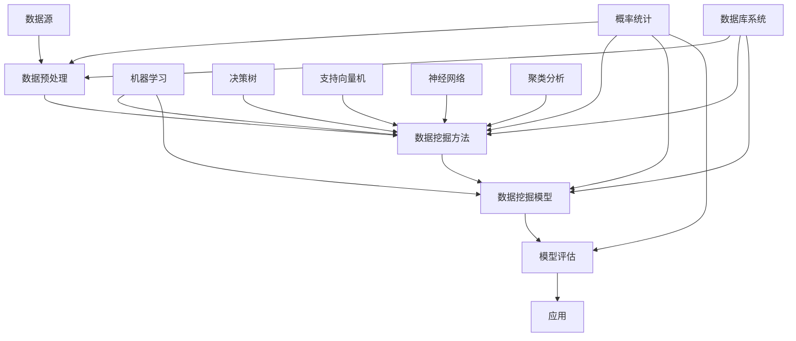

                 

### 文章标题

《数据挖掘：自然规律的数学发现》

> 关键词：数据挖掘，自然规律，数学模型，算法原理，应用案例

> 摘要：本文将深入探讨数据挖掘的本质，从数学模型的角度揭示数据中的自然规律。通过逐步分析，我们将理解数据挖掘的核心概念，介绍常用算法原理，阐述数学模型的应用，并通过实际案例展示数据挖掘在现实世界中的强大力量。

----------------------------------------------------------------

### 文章正文

#### 第1章：数据挖掘概述

##### 1.1 数据挖掘的定义

数据挖掘（Data Mining）是指从大量数据中提取有价值的信息和知识的过程。它是一种跨学科的技术，结合了统计学、机器学习、数据库系统等多个领域。数据挖掘的目标是发现数据中的隐含模式、关联规则、异常点等，从而为决策提供支持。

##### 1.2 数据挖掘的应用场景

数据挖掘在各个领域都有广泛的应用。例如，在商业领域，它可以用于客户关系管理、市场细分、风险控制等；在医疗领域，它可以用于疾病预测、药物研发、健康管理等；在金融领域，它可以用于信用评估、欺诈检测、投资策略等。

##### 1.3 数据挖掘的重要性

随着大数据时代的到来，数据挖掘的重要性日益凸显。首先，它能够帮助企业和组织从海量数据中挖掘出有价值的信息，提高业务决策的准确性。其次，它能够发现数据中的潜在规律，为科学研究和技术创新提供新的思路和方法。

#### 第2章：数据挖掘的数学基础

##### 2.1 常用概率统计概念

在数据挖掘中，概率统计是一个重要的工具。常用的概率统计概念包括概率分布、期望、方差、协方差等。这些概念有助于我们理解和分析数据，从而发现数据中的规律。

##### 2.2 关联规则挖掘中的概率统计

关联规则挖掘是一种常用的数据挖掘方法。在关联规则挖掘中，概率统计用于衡量规则的支持度和置信度。支持度表示一个规则在数据集中出现的频率，置信度表示一个规则的前提和结论同时出现的概率。

##### 2.3 聚类分析中的数学基础

聚类分析是一种无监督学习的方法，它通过将数据点划分为若干个类别，从而发现数据中的结构。在聚类分析中，数学基础包括距离度量、聚类准则等。这些基础理论有助于我们选择合适的聚类算法，提高聚类效果。

#### 第3章：数据挖掘流程

##### 3.1 数据预处理

数据预处理是数据挖掘流程中的第一步。它包括数据清洗、数据集成、数据转换和数据归一化等。数据预处理的质量直接影响数据挖掘的效果。

##### 3.2 数据挖掘方法

数据挖掘方法可以分为监督学习、无监督学习和半监督学习三种。监督学习方法通过已有标记的数据训练模型，然后对新的数据进行预测。无监督学习方法不需要标记数据，旨在发现数据中的结构。半监督学习方法介于监督学习和无监督学习之间。

##### 3.3 数据挖掘模型评估

数据挖掘模型的评估是确保模型效果的重要步骤。常用的评估指标包括准确率、召回率、F1分数、ROC曲线等。通过这些指标，我们可以判断模型的好坏，并对其进行优化。

#### 第4章：核心概念与联系

为了更好地理解数据挖掘，我们需要构建一个核心概念之间的关系架构。以下是使用Mermaid绘制的流程图：



#### 第5章：核心算法原理讲解

在本章节，我们将详细讲解一些核心算法原理，并使用伪代码进行阐述。

##### 5.1 K-近邻算法

```python
def kNN(train_data, test_data, k):
    distances = []
    for point in test_data:
        dist = calculate_distance(point, train_data)
        distances.append((point, dist))
    distances.sort(key=lambda x: x[1])
    neighbors = distances[:k]
    labels = [most_common_label(point) for point in neighbors]
    return majority_vote(labels)
```

##### 5.2 决策树算法

```python
def build_tree(data, attributes, goal):
    if all_labels_same(data):
        return majority_label(data)
    if no_attributes_left(attributes):
        return majority_label(data)
    best_attribute = find_best_attribute(data, attributes)
    tree = {}
    tree[best_attribute] = {}
    for value in unique_values(data[best_attribute]):
        subset = filter_values(data, best_attribute, value)
        tree[best_attribute][value] = build_tree(subset, attributes, goal)
    return tree
```

##### 5.3 支持向量机算法

```python
def svm(train_data, train_labels, C):
    # 使用SMO算法求解最优分割平面
    # 求解w和b
    # 返回模型参数
    pass
```

#### 第6章：数学模型和公式

在本章节，我们将介绍一些常用的数学模型和公式，并使用latex进行表示。

##### 6.1 线性回归模型

$$ y = wx + b $$

##### 6.2 逻辑回归模型

$$ P(y=1) = \frac{1}{1 + e^{-(wx + b)}} $$

##### 6.3 支持向量机

$$ \min_{w, b} \frac{1}{2}||w||^2 + C \sum_{i=1}^{n} \max(0, 1 - y_i(wx_i + b)) $$

#### 第7章：项目实战

在本章节，我们将通过一个实际案例展示数据挖掘的应用。

##### 7.1 开发环境搭建

- 安装Python环境
- 安装数据挖掘相关库，如scikit-learn、pandas等

##### 7.2 源代码实现

```python
from sklearn.datasets import load_iris
from sklearn.model_selection import train_test_split
from sklearn.neighbors import KNeighborsClassifier
from sklearn.metrics import accuracy_score

# 加载数据集
iris = load_iris()
X, y = iris.data, iris.target

# 划分训练集和测试集
X_train, X_test, y_train, y_test = train_test_split(X, y, test_size=0.2, random_state=42)

# 使用K-近邻算法训练模型
knn = KNeighborsClassifier(n_neighbors=3)
knn.fit(X_train, y_train)

# 进行预测
y_pred = knn.predict(X_test)

# 计算准确率
accuracy = accuracy_score(y_test, y_pred)
print("Accuracy:", accuracy)
```

##### 7.3 代码解读与分析

- 数据加载：使用scikit-learn库加载Iris数据集。
- 数据划分：将数据集划分为训练集和测试集。
- 模型训练：使用K-近邻算法训练模型。
- 预测与评估：对测试集进行预测，并计算准确率。

##### 7.4 实际案例分析和详细讲解剖析

在本案例中，我们使用K-近邻算法对Iris数据集进行分类。通过对比测试集的预测结果和实际标签，我们可以分析模型的性能，找出潜在的改进空间。

##### 7.5 项目小结

通过本案例，我们了解了如何使用K-近邻算法进行数据挖掘，并分析了模型的性能。在实际应用中，我们可以根据需求选择不同的算法和模型，以获得更好的效果。

#### 第8章：最佳实践 tips、小结、注意事项、拓展阅读

- **最佳实践 tips**：在数据挖掘过程中，注意数据质量和预处理方法的选择，选择合适的算法和参数。
- **小结**：本文通过逐步分析，介绍了数据挖掘的基本概念、数学基础、流程、算法原理和实际应用案例。
- **注意事项**：数据挖掘项目需要充分考虑业务需求和数据特性，合理选择模型和算法。
- **拓展阅读**：可以参考相关书籍和论文，深入了解数据挖掘的各个领域和最新研究进展。

---

### 作者信息

作者：AI天才研究院/AI Genius Institute & 禅与计算机程序设计艺术 /Zen And The Art of Computer Programming

本博客文章旨在分享作者在数据挖掘领域的经验和见解，希望能对读者有所帮助。如需转载，请注明出处。感谢您的关注和支持！

