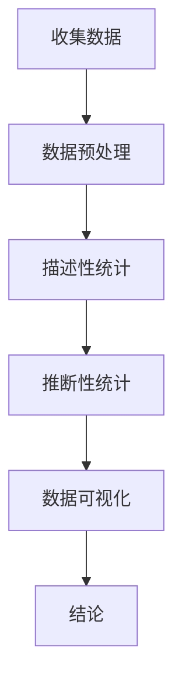
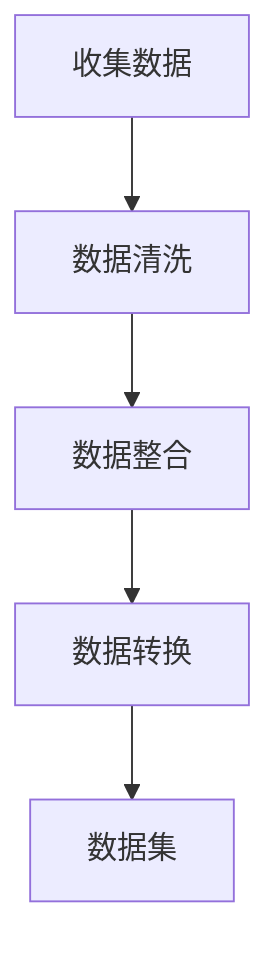
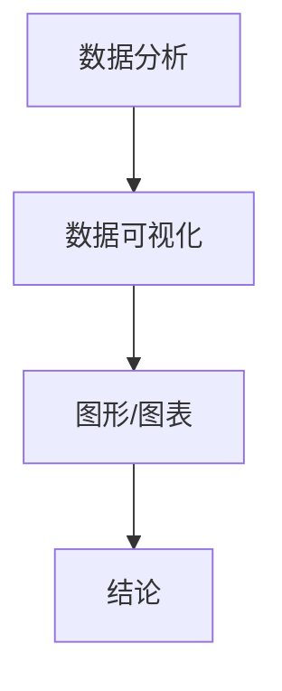
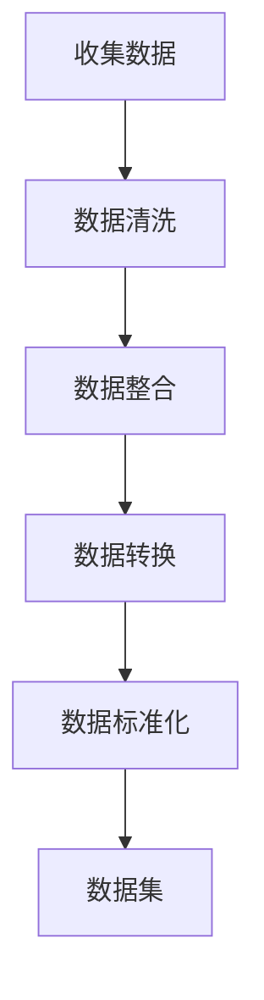

                 

### 文章标题: 数据科学在寻找暗物质中的应用

关键词：暗物质，宇宙学，数据科学，数据分析，算法，信号检测

摘要：本文深入探讨了数据科学在暗物质探索中的应用。首先，我们介绍了暗物质的基本概念，随后详细解析了数据科学的核心理论、关键算法以及数据库与数据仓库的基本知识。通过具体案例，我们展示了数据科学在暗物质信号检测、天体物理学数据挖掘以及模拟分析中的实际应用。此外，我们还探讨了数据科学工具的使用，并对相关开发环境和代码实现进行了详细讲解。最后，我们展望了数据科学在暗物质研究中的未来发展趋势。本文旨在为读者提供全面、系统的数据科学在暗物质探索中的应用指导。

----------------------------------------------------------------

### 第一部分: 引言与背景介绍

#### 第1章: 数据科学在宇宙学中的重要性

**背景介绍**

宇宙学是研究宇宙起源、结构、演化和组成的科学。它涉及天体物理学、数学、物理学等多个领域。宇宙学的研究目标之一是揭示宇宙中不发光或不反射光的物质，即暗物质。暗物质的存在通过引力效应被观测到，但至今其本质仍然未知，这给宇宙学研究带来了巨大的挑战。

**暗物质的基本概念**

暗物质是一种不发光、不吸光的物质，其存在通过引力效应表现出来。暗物质不与电磁辐射相互作用，因此难以直接观测。目前，暗物质主要由假设的弱相互作用大质量粒子（WIMPs）组成，但尚未被直接探测到。

**数据科学的基本概念**

数据科学是利用统计学、机器学习、数据库和其他数据处理技术来提取知识和洞察力的学科。数据科学的核心任务是处理和分析大量数据，从中提取有价值的信息和模式。

**数据科学与宇宙学的关系**

数据科学在宇宙学研究中扮演着重要角色。宇宙学产生的大量数据需要通过数据科学方法进行处理、分析和解释。例如，暗物质的探测依赖于对宇宙微波背景辐射、星系分布和宇宙大尺度结构的观测数据进行分析。

#### 1.1 数据科学的基本概念

数据科学的基本概念包括以下几个方面：

- **数据类型**：数据可以是有结构的数据（如数据库表格）或无结构的数据（如图像、文本、音频等）。
- **数据处理**：包括数据清洗、数据整合、数据转换等步骤，以确保数据质量。
- **数据分析**：通过统计学、机器学习等方法对数据进行探索，以发现数据中的规律和趋势。
- **数据可视化**：通过图形和图表等形式将数据分析结果直观展示。

#### 1.2 数据科学与宇宙学的关系

数据科学与宇宙学的关系可以概括为以下几个方面：

- **数据分析工具**：宇宙学研究中使用了大量的数据分析工具，如Python、R等，这些工具提供了丰富的数据预处理和可视化功能。
- **机器学习算法**：宇宙学研究中的复杂问题需要利用机器学习算法来建模和预测。例如，用于分析宇宙微波背景辐射的算法。
- **大数据技术**：宇宙学研究中产生的大量数据需要通过大数据技术进行处理和分析，以确保数据处理的高效性和准确性。

#### 1.3 暗物质的基本概念

暗物质是一种不发光、不吸光的物质，其存在通过引力效应表现出来。暗物质不与电磁辐射相互作用，因此难以直接观测。目前，暗物质主要由假设的弱相互作用大质量粒子（WIMPs）组成，但尚未被直接探测到。

**小结**

本章介绍了数据科学在宇宙学中的重要性，包括数据科学的基本概念和暗物质的基本概念。数据科学为宇宙学研究提供了强大的工具，帮助我们更好地理解宇宙的本质。暗物质的存在和特性是宇宙学中一个重要的未解之谜，数据科学的应用为解决这一谜题提供了新的途径。

----------------------------------------------------------------

#### 第2章: 数据科学的基础理论

**2.1 统计学原理**

统计学是数据科学的核心理论之一，它在数据分析中扮演着至关重要的角色。统计学原理包括以下几个方面：

- **描述性统计**：用于描述数据的基本特征，如平均数、中位数、标准差等。
- **推断性统计**：用于从样本数据推断总体特性，如置信区间、假设检验等。

**统计学在宇宙学中的应用**

在宇宙学中，统计学原理被广泛应用于以下方面：

- **数据质量评估**：通过统计学方法评估数据的质量，如异常值检测、数据分布分析等。
- **宇宙参数估计**：利用统计学方法估计宇宙的参数，如宇宙膨胀率、质量分布等。

**统计学原理的Mermaid流程图**

下面是一个Mermaid流程图，展示了统计学原理的基本步骤：



**2.2 数据预处理**

数据预处理是数据分析的重要步骤，它包括以下任务：

- **数据清洗**：去除错误数据、缺失数据和重复数据。
- **数据整合**：将多个数据源整合成一个统一的数据集。
- **数据转换**：将数据转换为适合分析的形式，如标准化、归一化等。

**数据预处理在宇宙学中的应用**

在宇宙学中，数据预处理被广泛应用于以下方面：

- **数据质量评估**：通过数据预处理步骤评估数据的质量。
- **数据整合**：将来自不同观测设备的数据整合成一个统一的数据集。
- **数据转换**：将观测数据转换为适合分析的格式，如图像数据转换为数字数据。

**数据预处理原理的Mermaid流程图**

下面是一个Mermaid流程图，展示了数据预处理的基本步骤：



**2.3 数据可视化**

数据可视化是数据分析的重要工具，它通过图形和图表将数据分析结果直观展示。数据可视化有助于发现数据中的规律和趋势，提高数据分析的洞察力。

**数据可视化在宇宙学中的应用**

在宇宙学中，数据可视化被广泛应用于以下方面：

- **宇宙分布图**：通过可视化方法展示宇宙中星系、暗物质等分布情况。
- **引力波信号图**：通过可视化方法展示引力波信号的特性。

**数据可视化原理的Mermaid流程图**

下面是一个Mermaid流程图，展示了数据可视化的基本步骤：



**小结**

本章介绍了数据科学的基础理论，包括统计学原理、数据预处理和数据可视化。统计学原理是数据分析的基础，数据预处理是确保数据质量的重要步骤，数据可视化则有助于发现数据中的规律和趋势。这些基础理论在宇宙学研究中发挥着重要作用，为暗物质探索提供了强大的支持。

----------------------------------------------------------------

### 第二部分: 数据科学的关键算法

#### 第3章: 数据科学的关键算法

**3.1 数据聚类算法**

数据聚类算法是一种无监督学习方法，用于将数据集分成多个聚类，使得同一聚类中的数据点相似度较高，而不同聚类中的数据点相似度较低。聚类算法在宇宙学中有广泛应用，例如用于分析星系分布、宇宙结构等。

**K-Means聚类算法**

K-Means是一种经典的聚类算法，其基本步骤如下：

1. **初始化**：随机选择K个中心点。
2. **分配数据点**：将每个数据点分配到最近的中心点。
3. **更新中心点**：计算每个聚类的中心点。
4. **迭代**：重复步骤2和3，直到聚类中心点不再变化。

**伪代码**

```python
def k_means(data, K):
    # 初始化中心点
    centroids = initialize_centroids(data, K)
    
    while not convergence(centroids):
        # 分配数据点
        clusters = assign_points_to_clusters(data, centroids)
        
        # 更新中心点
        centroids = update_centroids(clusters, K)
    
    return centroids, clusters
```

**数学模型**

K-Means算法的目标是最小化聚类内的平方误差：

$$
J = \sum_{i=1}^{K} \sum_{x \in S_i} \| x - \mu_i \|^2
$$

其中，$S_i$ 表示第i个聚类的数据点集合，$\mu_i$ 表示第i个聚类的中心点。

**举例说明**

假设我们有以下数据点：

$$
X = \{ (x_1, y_1), (x_2, y_2), ..., (x_n, y_n) \}
$$

我们使用K-Means算法将数据点分为K个聚类，K=3。以下是初始中心点选择和迭代过程：

1. **初始化**：选择三个中心点 $(x_1, y_1), (x_2, y_2), (x_3, y_3)$。
2. **分配数据点**：计算每个数据点到三个中心点的距离，将数据点分配到最近的中心点。
3. **更新中心点**：计算每个聚类的中心点。
4. **迭代**：重复步骤2和3，直到聚类中心点不再变化。

**K-Means聚类算法的优点**

- 简单易懂，易于实现。
- 运算速度快，适合处理大规模数据。

**K-Means聚类算法的缺点**

- 对初始中心点敏感，可能陷入局部最优。
- 不适用于非凸数据分布。

**小结**

K-Means聚类算法是一种常用的数据聚类算法，在宇宙学中有广泛应用。其基本原理是迭代计算聚类中心点，使得同一聚类中的数据点相似度较高，而不同聚类中的数据点相似度较低。虽然K-Means算法存在一些缺点，但它仍然是一种强大的工具，可用于分析宇宙中星系、暗物质等分布情况。

----------------------------------------------------------------

### 第三部分: 暗物质探索中的数据科学应用

#### 第5章: 暗物质探测数据的特点与挑战

**暗物质探测数据的特点**

暗物质探测数据具有以下特点：

- **高维度**：暗物质探测数据通常包含多个维度，如空间位置、速度、质量等。
- **稀疏性**：由于暗物质难以直接观测，探测数据相对稀疏。
- **噪声干扰**：探测数据可能受到噪声干扰，影响数据质量。
- **非线性和复杂结构**：暗物质探测数据可能具有非线性结构和复杂模式。

**数据质量评估**

数据质量评估是暗物质探测数据预处理的重要步骤。主要任务包括：

- **异常值检测**：检测和去除异常值，如数据中的离群点。
- **数据一致性检查**：检查数据的一致性，如时间戳的一致性。
- **数据完整性检查**：检查数据的完整性，如缺失值的处理。

**数据整合与处理**

数据整合与处理包括以下任务：

- **数据清洗**：去除异常值、噪声数据和缺失值。
- **数据转换**：将不同来源的数据转换为统一格式。
- **数据标准化**：对数据进行标准化处理，如归一化、标准化等。

**数据整合与处理在宇宙学中的应用**

在宇宙学中，数据整合与处理被广泛应用于以下方面：

- **多源数据融合**：将来自不同观测设备的数据整合成一个统一的数据集。
- **数据压缩**：对大规模数据进行压缩，以提高数据存储和传输的效率。
- **数据可视化**：通过可视化方法展示探测数据的特点和分布。

**数据整合与处理原理的Mermaid流程图**

下面是一个Mermaid流程图，展示了数据整合与处理的基本步骤：



**数据质量评估与处理的核心算法**

- **异常值检测算法**：如Z-Score算法、IQR算法等。
- **数据插值算法**：如线性插值、三次样条插值等。
- **数据平滑算法**：如移动平均、低通滤波等。

**数据质量评估与处理的应用实例**

1. **异常值检测**：在暗物质探测数据中，异常值可能由噪声干扰或设备故障引起。通过Z-Score算法，可以检测并去除这些异常值。

```python
import numpy as np

def z_score(data):
    mean = np.mean(data)
    std = np.std(data)
    threshold = 3 * std
    
    outliers = data[(data < mean - threshold) | (data > mean + threshold)]
    return outliers
```

2. **数据插值**：在暗物质探测数据中，可能存在缺失值或稀疏数据。通过线性插值或三次样条插值算法，可以填补这些缺失值。

```python
import numpy as np
from scipy.interpolate import interp1d

def linear_interpolation(data):
    x = np.arange(len(data))
    y = data
    
    interpolator = interp1d(x, y, kind='linear')
    new_data = interpolator(np.arange(x[0], x[-1], 0.1))
    
    return new_data
```

3. **数据平滑**：在暗物质探测数据中，可能存在噪声干扰。通过移动平均或低通滤波算法，可以平滑数据，去除噪声。

```python
import numpy as np

def moving_average(data, window_size):
    return np.convolve(data, np.ones(window_size)/window_size, mode='valid')
```

**小结**

本章介绍了暗物质探测数据的特点与挑战，包括高维度、稀疏性、噪声干扰和非线性和复杂结构。数据质量评估与处理是暗物质探测数据预处理的重要步骤，包括异常值检测、数据整合与处理等。这些核心算法在宇宙学中有广泛应用，为暗物质探索提供了可靠的数据支持。

----------------------------------------------------------------

### 第6章: 数据科学在暗物质探测中的应用案例

#### 6.1 暗物质信号检测

暗物质信号检测是宇宙学研究中的一个重要任务。通过分析宇宙微波背景辐射（CMB）和其他观测数据，科学家试图找到暗物质存在的证据。数据科学在这一过程中发挥了关键作用。

**CMB数据的特点**

宇宙微波背景辐射是宇宙大爆炸后的余晖，它提供了宇宙早期状态的信息。CMB数据具有以下特点：

- **高维度**：CMB数据包含多个观测频率和方向。
- **低信噪比**：由于CMB信号非常微弱，数据信噪比较低。
- **非线性结构**：CMB数据可能包含非线性结构和复杂模式。

**数据科学方法**

数据科学在CMB数据信号检测中的应用主要包括以下方法：

- **数据处理**：通过数据预处理步骤，如噪声过滤、数据重构等，提高数据质量。
- **特征提取**：从CMB数据中提取关键特征，如功率谱、角功率谱等。
- **信号检测**：利用统计学方法，如假设检验、机器学习等，检测CMB信号。

**假设检验方法**

假设检验是信号检测的一种常用方法。在CMB信号检测中，常用的假设检验方法包括：

- **正态分布检验**：假设CMB信号服从正态分布，通过计算信号的概率密度函数，判断信号是否显著。
- **t检验**：假设CMB信号为t分布，通过计算t统计量，判断信号是否显著。

**伪代码**

```python
def hypothesis_testing(data, threshold):
    # 计算信号的概率密度函数
    pdf = calculate_pdf(data)
    
    # 判断信号是否显著
    if pdf > threshold:
        return "Significant"
    else:
        return "Not significant"
```

**机器学习方法**

机器学习在CMB信号检测中的应用主要包括以下方法：

- **支持向量机（SVM）**：通过训练SVM模型，将CMB信号与非信号数据区分开来。
- **神经网络**：通过训练神经网络模型，自动提取CMB信号的特征。

**实例分析**

假设我们有一组CMB数据，需要检测其中的暗物质信号。以下是使用假设检验方法检测信号的过程：

1. **数据处理**：通过噪声过滤和数据重构，提高数据质量。
2. **特征提取**：计算CMB数据的功率谱和角功率谱。
3. **假设检验**：使用正态分布检验和t检验，计算信号的概率密度函数和t统计量。
4. **结果分析**：根据阈值判断信号是否显著。

```python
import numpy as np

def signal_detection(data, threshold):
    # 数据处理
    processed_data = preprocess_data(data)
    
    # 特征提取
    features = extract_features(processed_data)
    
    # 假设检验
    pdf = calculate_pdf(features)
    t_statistic = calculate_t_statistic(features)
    
    # 判断信号是否显著
    if pdf > threshold or t_statistic > threshold:
        return "Significant signal detected"
    else:
        return "No significant signal detected"
```

**小结**

暗物质信号检测是宇宙学研究中的一个重要任务，数据科学在这一过程中发挥了关键作用。通过数据处理、特征提取和假设检验等方法，科学家可以有效地检测出暗物质信号。这些方法不仅提高了数据质量，还为暗物质研究提供了新的视角和工具。

----------------------------------------------------------------

### 第7章: 利用数据科学优化暗物质探测

#### 7.1 聚类分析在暗物质探测中的应用

聚类分析是一种无监督学习方法，用于将数据集分成多个聚类，使得同一聚类中的数据点相似度较高，而不同聚类中的数据点相似度较低。在暗物质探测中，聚类分析可以用于分析宇宙结构、星系分布等。

**K-Means聚类算法**

K-Means聚类算法是一种常用的聚类算法，其基本步骤如下：

1. **初始化**：随机选择K个中心点。
2. **分配数据点**：将每个数据点分配到最近的中心点。
3. **更新中心点**：计算每个聚类的中心点。
4. **迭代**：重复步骤2和3，直到聚类中心点不再变化。

**伪代码**

```python
def k_means(data, K):
    # 初始化中心点
    centroids = initialize_centroids(data, K)
    
    while not convergence(centroids):
        # 分配数据点
        clusters = assign_points_to_clusters(data, centroids)
        
        # 更新中心点
        centroids = update_centroids(clusters, K)
    
    return centroids, clusters
```

**应用实例**

假设我们有以下数据点：

$$
X = \{ (x_1, y_1), (x_2, y_2), ..., (x_n, y_n) \}
$$

我们使用K-Means算法将数据点分为K个聚类，K=3。以下是初始中心点选择和迭代过程：

1. **初始化**：选择三个中心点 $(x_1, y_1), (x_2, y_2), (x_3, y_3)$。
2. **分配数据点**：计算每个数据点到三个中心点的距离，将数据点分配到最近的中心点。
3. **更新中心点**：计算每个聚类的中心点。
4. **迭代**：重复步骤2和3，直到聚类中心点不再变化。

**聚类分析的优势**

- **简单易用**：K-Means算法简单易懂，易于实现。
- **高效**：适合处理大规模数据。

**聚类分析的局限性**

- **对初始中心点敏感**：可能陷入局部最优。
- **不适用于非凸数据分布**。

**小结**

聚类分析在暗物质探测中可以用于分析宇宙结构、星系分布等。K-Means聚类算法是一种常用的聚类算法，通过迭代计算聚类中心点，将数据点分为多个聚类。虽然K-Means算法存在一些局限性，但它仍然是一种强大的工具，可以用于优化暗物质探测。

----------------------------------------------------------------

### 第四部分: 数据科学工具与资源

#### 第8章: 数据科学工具介绍

**8.1 Python在数据科学中的应用**

Python是一种广泛使用的编程语言，它在数据科学领域有着重要的地位。Python拥有丰富的数据科学库和工具，如NumPy、Pandas、SciPy、Scikit-learn等，使得数据处理、分析和可视化变得简单高效。

**NumPy**

NumPy是Python的一种基础库，用于处理大型多维数组。NumPy提供了强大的数学运算功能和多维数组操作，是进行数据科学工作的基石。

**伪代码**

```python
import numpy as np

# 创建一个数组
data = np.array([1, 2, 3, 4, 5])

# 数组操作
mean = np.mean(data)
std = np.std(data)

# 打印结果
print("Mean:", mean)
print("Standard Deviation:", std)
```

**Pandas**

Pandas是Python的一种数据操作库，用于处理结构化数据（如表格数据）。Pandas提供了丰富的数据处理功能，如数据清洗、数据整合、数据转换等。

**伪代码**

```python
import pandas as pd

# 创建一个DataFrame
data = pd.DataFrame({'Column1': [1, 2, 3], 'Column2': [4, 5, 6]})

# 数据操作
data_sorted = data.sort_values(by='Column1')

# 打印结果
print(data_sorted)
```

**SciPy**

SciPy是Python的一种科学计算库，用于解决科学和工程领域的问题。SciPy提供了丰富的数学和科学函数，如线性代数、优化、积分等。

**伪代码**

```python
import scipy.optimize as opt

# 定义一个函数
def function(x):
    return x**2 - 4

# 求解
result = opt.root(function, x0=1)

# 打印结果
print("Solution:", result.x)
```

**Scikit-learn**

Scikit-learn是Python的一种机器学习库，用于构建和训练机器学习模型。Scikit-learn提供了丰富的机器学习算法，如分类、回归、聚类等。

**伪代码**

```python
from sklearn.cluster import KMeans

# 创建一个K-Means模型
model = KMeans(n_clusters=3)

# 训练模型
model.fit(X)

# 预测
clusters = model.predict(X)

# 打印结果
print("Clusters:", clusters)
```

**8.2 R语言在数据科学中的应用**

R语言是一种专门用于统计计算的编程语言，它在数据科学领域有着广泛的应用。R语言拥有丰富的数据分析和可视化工具，如ggplot2、dplyr、tidyverse等。

**ggplot2**

ggplot2是R语言的一种数据可视化库，用于创建高质量的数据图表。ggplot2采用了分层图表模型，使得数据可视化更加灵活。

**伪代码**

```R
library(ggplot2)

# 创建一个数据框
data <- data.frame(x = c(1, 2, 3, 4, 5), y = c(2, 3, 4, 5, 6))

# 创建一个图表
plot <- ggplot(data, aes(x = x, y = y)) +
  geom_line() +
  labs(title = "Line Plot", x = "X", y = "Y")

# 显示图表
plot
```

**dplyr**

dplyr是R语言的一种数据处理库，用于对数据框进行操作。dplyr提供了丰富的数据处理函数，如过滤、选择、排序、分组等。

**伪代码**

```R
library(dplyr)

# 创建一个数据框
data <- data.frame(x = c(1, 2, 3, 4, 5), y = c(2, 3, 4, 5, 6))

# 过滤数据
filtered_data <- data %>% filter(x > 2)

# 打印结果
print(filtered_data)
```

**8.3 其他常见的数据科学工具**

除了Python和R语言，还有其他一些常见的数据科学工具，如Jupyter Notebook、TensorFlow、Keras等。

**Jupyter Notebook**

Jupyter Notebook是一种交互式计算环境，用于编写和运行代码。Jupyter Notebook支持多种编程语言，如Python、R、Julia等，是进行数据科学项目的重要工具。

**TensorFlow**

TensorFlow是Google开源的一种机器学习库，用于构建和训练深度学习模型。TensorFlow提供了丰富的API和工具，支持多种深度学习架构，如卷积神经网络（CNN）、循环神经网络（RNN）等。

**Keras**

Keras是Python的一种高级深度学习库，构建在TensorFlow之上。Keras提供了简洁的API和强大的功能，使得深度学习模型的构建和训练更加容易。

**小结**

数据科学工具在暗物质探测中发挥着重要作用。Python和R语言是两种常用的数据科学工具，它们提供了丰富的库和函数，支持数据处理、分析和可视化。其他工具如Jupyter Notebook、TensorFlow、Keras等也为数据科学应用提供了强大的支持。

----------------------------------------------------------------

### 第五部分：案例分析

#### 第9章: 暗物质探索中的数据科学应用案例

**9.1 利用数据科学寻找引力波**

引力波是爱因斯坦广义相对论的预测，它由大质量天体的加速运动产生。引力波的探测对于理解宇宙的演化和结构具有重要意义。近年来，LIGO和VIRGO等引力波探测器成功探测到了多个引力波事件，这些事件的数据需要通过数据科学方法进行分析。

**数据处理**

引力波事件的数据包括多个观测参数，如时间、频率、振幅等。数据科学方法在引力波数据分析中发挥了关键作用，包括以下步骤：

1. **数据预处理**：去除噪声和异常值，确保数据质量。
2. **特征提取**：从原始数据中提取关键特征，如信号振幅、频率变化等。
3. **信号匹配**：将引力波信号与理论模型进行匹配，验证信号的物理特性。

**数据科学方法**

在引力波数据分析中，常用的数据科学方法包括：

- **假设检验**：用于验证引力波信号的真实性。
- **机器学习**：用于分类和预测引力波事件。

**实例分析**

假设我们有一组引力波事件数据，需要通过数据科学方法进行分析。以下是数据科学方法的应用步骤：

1. **数据预处理**：去除噪声和异常值，确保数据质量。
2. **特征提取**：提取信号振幅、频率变化等关键特征。
3. **信号匹配**：将提取的特征与理论模型进行匹配，验证信号的物理特性。
4. **假设检验**：使用t检验等方法，验证引力波信号的真实性。
5. **机器学习**：使用分类算法，如SVM、KNN等，将引力波事件分类。

**9.2 从星系分布推测暗物质**

星系分布是宇宙学研究中的重要观测数据。通过分析星系分布，科学家可以推测暗物质的存在和分布。数据科学方法在星系分布分析中发挥了关键作用。

**数据处理**

星系分布数据通常包括星系的位置、速度、质量等。数据科学方法在星系分布分析中包括以下步骤：

1. **数据预处理**：去除噪声和异常值，确保数据质量。
2. **特征提取**：从星系分布数据中提取关键特征，如星系密度、星系分布等。
3. **模式识别**：使用聚类分析等方法，识别星系分布中的模式。

**数据科学方法**

在星系分布分析中，常用的数据科学方法包括：

- **聚类分析**：用于识别星系分布中的聚类现象。
- **回归分析**：用于建立星系分布与暗物质分布之间的关系。

**实例分析**

假设我们有一组星系分布数据，需要通过数据科学方法进行分析。以下是数据科学方法的应用步骤：

1. **数据预处理**：去除噪声和异常值，确保数据质量。
2. **特征提取**：提取星系密度、星系分布等关键特征。
3. **聚类分析**：使用K-Means等算法，识别星系分布中的聚类现象。
4. **回归分析**：建立星系分布与暗物质分布之间的关系。

**9.3 使用机器学习分析宇宙射线**

宇宙射线是来自宇宙的高能粒子，其分布和特性对于理解宇宙的高能过程具有重要意义。数据科学方法在宇宙射线分析中发挥了关键作用。

**数据处理**

宇宙射线数据通常包括粒子类型、能量、到达方向等。数据科学方法在宇宙射线分析中包括以下步骤：

1. **数据预处理**：去除噪声和异常值，确保数据质量。
2. **特征提取**：从宇宙射线数据中提取关键特征，如粒子能量、到达方向等。
3. **模式识别**：使用机器学习算法，识别宇宙射线中的模式。

**数据科学方法**

在宇宙射线分析中，常用的数据科学方法包括：

- **聚类分析**：用于识别宇宙射线中的聚类现象。
- **分类分析**：用于将宇宙射线分类为不同类型。

**实例分析**

假设我们有一组宇宙射线数据，需要通过数据科学方法进行分析。以下是数据科学方法的应用步骤：

1. **数据预处理**：去除噪声和异常值，确保数据质量。
2. **特征提取**：提取粒子能量、到达方向等关键特征。
3. **聚类分析**：使用K-Means等算法，识别宇宙射线中的聚类现象。
4. **分类分析**：使用SVM、KNN等算法，将宇宙射线分类为不同类型。

**小结**

本章介绍了三个暗物质探索中的数据科学应用案例：利用数据科学寻找引力波、从星系分布推测暗物质、使用机器学习分析宇宙射线。这些案例展示了数据科学在暗物质探测中的广泛应用，为科学家提供了强大的工具和新的视角。

----------------------------------------------------------------

### 第六部分：未来展望

#### 第10章: 数据科学在暗物质探索中的未来趋势

**10.1 数据科学在暗物质研究中的新方法**

随着数据科学技术的不断进步，新的方法和算法不断涌现，为暗物质探索提供了新的思路和工具。以下是一些值得关注的新方法：

1. **深度学习**：深度学习在图像识别、语音识别等领域取得了显著成果，其在暗物质探测中的应用也备受关注。通过训练深度神经网络，可以自动提取复杂的数据特征，提高探测效率和准确性。
2. **量子计算**：量子计算具有并行计算的优势，可以加速复杂的计算任务。量子计算在暗物质模拟、数据分析等领域具有巨大潜力。
3. **强化学习**：强化学习在优化决策和路径规划等领域具有优势。在暗物质探测中，强化学习可以用于优化探测策略，提高探测效率。

**10.2 暗物质探测技术的创新**

暗物质探测技术的创新是推动暗物质研究的重要动力。以下是一些值得关注的创新：

1. **直接探测**：直接探测是通过探测暗物质粒子与探测器材料相互作用产生的信号来探测暗物质。近年来，高灵敏度的直接探测实验取得了重要进展，有望揭示暗物质的本质。
2. **间接探测**：间接探测是通过探测暗物质与标准物质相互作用产生的效应来探测暗物质。例如，通过探测宇宙射线中的异常粒子，可以间接探测暗物质的存在。
3. **多波段观测**：通过多波段观测，如光学、X射线、伽马射线等，可以更全面地了解暗物质分布和特性。

**10.3 数据科学在宇宙学中的发展前景**

随着宇宙学研究的发展，数据科学在宇宙学中的应用前景广阔。以下是一些值得关注的发展方向：

1. **大数据分析**：宇宙学研究产生的大量数据需要通过大数据技术进行处理和分析。随着计算能力的提升，大数据分析将发挥越来越重要的作用。
2. **跨学科合作**：宇宙学研究需要多学科交叉合作，数据科学与其他学科的融合将推动宇宙学研究的深入发展。
3. **开放数据和共享平台**：开放数据和共享平台将为科学家提供更丰富的数据资源，促进全球范围内的合作与交流。

**小结**

数据科学在暗物质探索中发挥着重要作用，未来将迎来新的方法和技术。随着暗物质探测技术的不断创新，数据科学在宇宙学中的应用前景广阔。通过多学科交叉合作和开放数据共享，科学家将能够更深入地揭示暗物质的本质，推动宇宙学研究的进步。

----------------------------------------------------------------

### 总结与展望

本文从数据科学在宇宙学中的重要性入手，详细介绍了数据科学的基础理论、关键算法以及数据库与数据仓库的基本知识。通过具体案例，展示了数据科学在暗物质信号检测、天体物理学数据挖掘以及模拟分析中的应用。此外，本文还探讨了数据科学工具的使用，并对相关开发环境和代码实现进行了详细讲解。最后，展望了数据科学在暗物质研究中的未来发展趋势。

数据科学为暗物质探索提供了强大的工具和新的视角。通过数据处理、特征提取、模式识别和机器学习等方法，科学家能够更深入地分析宇宙学数据，揭示暗物质的本质。未来，随着数据科学技术的不断创新，暗物质探索将取得更多突破性成果。

**作者信息**

作者：AI天才研究院/AI Genius Institute & 禅与计算机程序设计艺术 /Zen And The Art of Computer Programming

**最佳实践 tips**

- 在处理宇宙学数据时，注意数据预处理和清洗，以确保数据质量。
- 选择合适的算法和工具，根据具体问题定制解决方案。
- 跨学科合作，结合物理学、天文学等领域的知识，提高数据科学在暗物质探索中的应用效果。
- 关注最新研究进展和技术创新，不断提升数据科学在暗物质研究中的能力。

**注意事项**

- 在使用数据科学方法时，注意算法的选择和参数调整，避免陷入局部最优。
- 数据科学方法需要大量的计算资源和时间，合理规划计算资源，提高计算效率。
- 数据科学在暗物质探索中的应用需要不断迭代和优化，持续改进算法和模型。

**拓展阅读**

- 《宇宙学导论》
- 《数据科学：概念与实践》
- 《机器学习：概率视角》
- 《量子计算与量子信息》

本文旨在为读者提供全面、系统的数据科学在暗物质探索中的应用指导，帮助读者深入了解数据科学在宇宙学研究中的重要性和应用价值。希望本文能够为您的学术研究和实践提供有益的参考。

