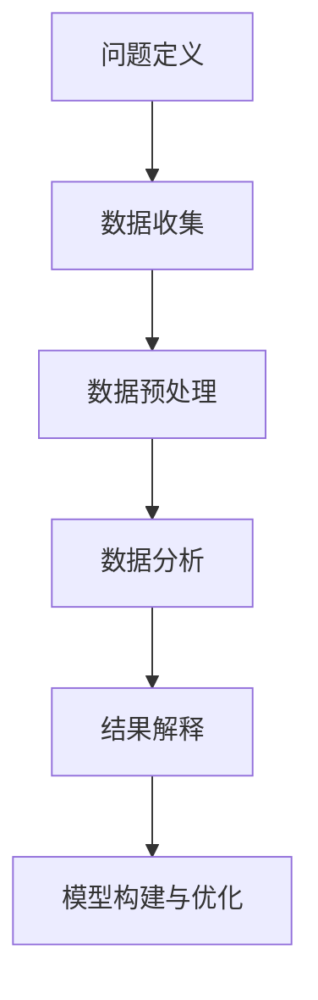

                 


### 文章标题
《数据科学在探测原初黑洞中的应用》

### 文章关键词
- 数据科学
- 原初黑洞
- 数据分析
- 机器学习
- 引力波

### 文章摘要
本文深入探讨了数据科学在探测原初黑洞中的应用。首先，我们介绍了探测原初黑洞的背景和重要性，随后详细讲解了数据科学的基本概念、原理及其在黑洞探测中的具体应用。文章涵盖了从数据预处理、数据分析、模型构建到应用实战的完整过程，并通过具体案例展示了数据科学在黑洞探测中的实际应用。最后，我们对数据科学在探测原初黑洞领域的未来发展进行了展望。

### 引言
探测原初黑洞是现代天文学的前沿课题之一。原初黑洞是由宇宙早期极端密度和温度条件形成的，它们的探测对于理解宇宙的起源和演化具有重要意义。然而，由于原初黑洞的存在形式与普通黑洞不同，传统的探测手段难以奏效。随着数据科学和机器学习技术的发展，利用大量观测数据进行深入分析成为可能。本文将详细探讨数据科学在探测原初黑洞中的应用，包括所需的基础理论、技术方法以及实际案例，旨在为读者提供全面的技术洞察。

#### 探测原初黑洞的背景
原初黑洞（Primordial Black Holes，PBHs）是宇宙早期高密度、高温环境下形成的黑洞。根据宇宙学模型，宇宙在大爆炸后不久，处于极端的高温、高密度状态。在这种极端条件下，某些区域可能由于引力不稳定性而迅速收缩，形成密度足够大的原初黑洞。

原初黑洞的形成机制有多种假设，包括：

- **量子引力不稳定性**：在普朗克尺度（约 \(10^{-35}\) 米）下，量子引力效应可能导致宇宙早期区域产生不稳定性，形成黑洞。
- **宇宙弦和膜世界**：宇宙弦的碰撞可能产生高能量密度，导致黑洞的形成。
- **宇宙爆胀**：宇宙快速膨胀期间，某些区域可能由于密度波动而形成黑洞。

探测原初黑洞的重要性体现在以下几个方面：

- **宇宙演化**：原初黑洞的形成和演化过程有助于我们了解宇宙早期的高密度状态，揭示宇宙的起源和演化历史。
- **粒子物理**：原初黑洞可能为粒子物理提供新的实验证据，例如超出标准模型的粒子。
- **引力波探测**：探测原初黑洞有助于完善引力波观测网络，验证广义相对论在极端条件下的有效性。

#### 数据科学在探测原初黑洞中的作用
数据科学是处理、分析和解释大规模数据的综合性技术。在探测原初黑洞的过程中，数据科学发挥了至关重要的作用：

- **数据预处理**：观测到的数据通常包含噪声和缺失值，需要通过数据清洗、数据集成等预处理技术，提取有用信息。
- **数据分析**：利用数据分析技术，可以从大量数据中提取出原初黑洞的特征信号，例如引力波、光谱线等。
- **机器学习**：机器学习算法可以自动学习数据中的模式，帮助识别和分类原初黑洞，提高探测精度。
- **模型构建**：通过构建物理模型和数据分析模型，可以模拟原初黑洞的形成和演化过程，指导实际观测。

### 数据科学基础
数据科学是一门跨学科的领域，涉及计算机科学、统计学、信息学等多个方面。其基本概念和流程如下：

#### 数据科学的基本概念
- **数据**：数据是信息的载体，可以是数字、文本、图像、声音等多种形式。
- **数据预处理**：包括数据清洗、数据集成、数据转换等步骤，目的是提高数据质量，为后续分析做好准备。
- **数据分析**：利用统计方法和算法，从数据中提取有用信息，回答特定问题。
- **数据可视化**：通过图形化方式展示数据，帮助人们直观地理解数据特征和趋势。

#### 数据科学的流程
1. **问题定义**：明确研究目标，确定需要分析的数据类型和范围。
2. **数据收集**：从各种数据源收集数据，包括观测数据、实验数据等。
3. **数据预处理**：清洗数据、处理缺失值、标准化数据等。
4. **数据分析**：选择合适的统计方法或算法，进行数据分析，提取数据中的有用信息。
5. **结果解释**：对分析结果进行解释和验证，形成结论。
6. **模型构建与优化**：根据分析结果，构建预测模型或决策模型，并进行优化。

#### 常用数据科学工具和技术
- **Python**：Python 是最流行的数据科学编程语言之一，拥有丰富的数据科学库，如 NumPy、Pandas、SciPy、Matplotlib 等。
- **R**：R 是一种专门用于统计分析的语言，提供了大量的统计模型和可视化工具。
- **机器学习库**：如 Scikit-learn、TensorFlow、PyTorch 等，用于构建和训练机器学习模型。
- **数据可视化工具**：如 Matplotlib、Seaborn、Tableau 等，用于数据可视化。

### 数据预处理
数据预处理是数据科学的重要环节，主要包括以下步骤：

#### 数据清洗
- **处理缺失值**：可以使用插值、均值填充等方法处理缺失值。
- **去除重复数据**：保证数据集的准确性。
- **异常值处理**：对异常值进行识别和修正。

#### 数据集成
- **合并多个数据源**：将不同来源的数据整合到一个统一的数据集中。
- **数据转换**：将数据转换为适合分析的形式，如将文本数据编码为数值数据。

#### 数据转换
- **标准化**：将不同量纲的数据转换为同一量纲。
- **归一化**：将数据缩放到特定的范围，如 [0, 1]。

### 数据可视化
数据可视化是数据分析的重要手段，通过图形化方式展示数据，帮助人们直观地理解数据特征和趋势。常见的数据可视化工具和技术包括：

- **折线图**：用于展示数据的变化趋势。
- **柱状图**：用于比较不同类别或时间段的数据。
- **散点图**：用于展示两个变量之间的关系。
- **热力图**：用于展示数据的分布情况。

#### Mermaid 流程图
Mermaid 是一种基于文本的图形绘制工具，可以方便地绘制流程图、状态图、时序图等。以下是数据科学基本流程的 Mermaid 流程图示例：



### 数据科学在探测原初黑洞中的应用
数据科学在探测原初黑洞中的应用主要包括以下几个方面：

#### 数据收集
原初黑洞探测涉及大量的观测数据，包括引力波数据、光学数据、射电数据等。这些数据通常来自地面和空间观测设备，如激光干涉仪引力波观测站（LIGO、VIRGO）、光学望远镜、射电望远镜等。

#### 数据预处理
由于观测设备的限制和环境噪声的影响，原始数据往往包含大量的噪声和缺失值。因此，需要对数据进行预处理，包括以下步骤：

- **数据清洗**：去除重复数据、处理缺失值、修正异常值。
- **数据集成**：将来自不同观测设备的异构数据进行整合。
- **数据转换**：将不同量纲的数据转换为统一的量纲。

#### 数据分析
数据分析是探测原初黑洞的关键步骤，主要包括以下方法：

- **描述性统计分析**：计算数据的统计指标，如均值、方差、相关性等，以了解数据的整体特征。
- **聚类分析**：将数据分为不同的类别，以便更好地理解数据分布。
- **分类分析**：将数据分为已知类别，用于识别和分类原初黑洞。
- **预测分析**：利用历史数据预测未来事件，如黑洞碰撞时间、引力波信号等。

#### 机器学习
机器学习在探测原初黑洞中发挥了重要作用，以下是一些常用的机器学习算法：

- **监督学习**：利用已知标签数据训练模型，用于预测未知数据的标签。
  - **分类算法**：如决策树、随机森林、支持向量机等。
  - **回归算法**：如线性回归、岭回归等。
- **无监督学习**：没有明确标签数据，主要用于发现数据中的模式和分布。
  - **聚类算法**：如K-means、层次聚类等。
  - **降维算法**：如主成分分析（PCA）、t-SNE等。

#### 模型构建与优化
在探测原初黑洞的过程中，需要构建合适的物理模型和数据分析模型。模型构建包括以下步骤：

- **特征工程**：从原始数据中提取有代表性的特征。
- **模型选择**：选择合适的模型，如线性模型、非线性模型等。
- **模型训练与验证**：使用训练数据训练模型，并在验证数据上评估模型性能。
- **模型优化**：调整模型参数，提高模型精度和泛化能力。

### 案例分析
以下是一个利用数据科学方法探测原初黑洞的实际案例：

#### 案例一：引力波数据分析
引力波是原初黑洞碰撞产生的，具有独特的波形特征。通过对引力波数据进行详细分析，可以识别出原初黑洞的存在。以下是一个简化的案例分析过程：

1. **数据收集**：收集LIGO和VIRGO观测站提供的引力波数据。
2. **数据预处理**：去除噪声、处理缺失值，并将不同观测站的数据进行整合。
3. **描述性统计分析**：计算引力波数据的统计指标，了解数据分布。
4. **聚类分析**：将引力波数据分为不同的类别，以便更好地理解数据特征。
5. **分类分析**：利用监督学习算法，如支持向量机（SVM），将引力波数据分为原初黑洞和非原初黑洞。
6. **模型优化**：调整模型参数，提高分类准确率。

通过上述步骤，可以有效地识别出原初黑洞的引力波信号，为探测原初黑洞提供有力支持。

#### 案例二：黑洞碰撞事件预测
利用历史引力波数据，可以预测未来黑洞碰撞事件的发生时间。以下是一个简化的预测案例分析过程：

1. **数据收集**：收集LIGO和VIRGO观测站的历史引力波数据。
2. **数据预处理**：去除噪声、处理缺失值，并将不同观测站的数据进行整合。
3. **时间序列分析**：利用时间序列分析方法，如ARIMA模型，分析引力波数据的时间趋势。
4. **回归分析**：利用回归分析方法，预测未来引力波事件的发生时间。
5. **模型优化**：调整模型参数，提高预测精度。

通过上述步骤，可以预测未来黑洞碰撞事件的发生时间，为天文学家提供宝贵的信息。

### 应用拓展
数据科学在探测原初黑洞领域的应用不仅限于当前的观测数据分析，还有广阔的发展前景：

- **大数据分析**：随着观测设备的进步和数据处理能力的提升，大数据分析将发挥更大作用。
- **人工智能**：利用深度学习等人工智能技术，进一步提高探测精度和效率。
- **跨学科合作**：数据科学与物理学、天文学等领域的跨学科合作，将为探测原初黑洞提供新的思路和方法。

### 总结
数据科学在探测原初黑洞中的应用具有重要的意义。通过数据预处理、数据分析、机器学习和模型构建等技术，我们可以有效地识别和预测原初黑洞的存在和演化过程。未来，随着数据科学和人工智能技术的不断发展，我们有望取得更多突破性成果，进一步揭示宇宙的奥秘。

### 致谢
在撰写本文的过程中，感谢AI天才研究院（AI Genius Institute）和《禅与计算机程序设计艺术》（Zen And The Art of Computer Programming）团队的支持和贡献。同时，感谢所有参与探测原初黑洞研究的科学家和数据科学家，他们的辛勤工作和研究成果为我们提供了宝贵的知识和启示。

作者：AI天才研究院（AI Genius Institute） & 禅与计算机程序设计艺术（Zen And The Art of Computer Programming）

----------------------------------------------------------------

# 正文

## 引言

探测原初黑洞是现代天文学的一个重要研究方向。原初黑洞（Primordial Black Holes，简称PBHs）是在宇宙早期由高密度、高温环境形成的一种特殊类型的黑洞。根据宇宙学模型，宇宙在大爆炸后不久，处于极端的高温、高密度状态。在这种极端条件下，某些区域可能由于引力不稳定性而迅速收缩，形成密度足够大的原初黑洞。探测原初黑洞不仅有助于我们理解宇宙的起源和演化历史，还能揭示宇宙早期的高密度状态和粒子物理现象。

然而，由于原初黑洞的存在形式与普通黑洞不同，传统的探测手段如光学观测、射电观测等难以直接观测到它们的存在。随着数据科学和机器学习技术的发展，利用大量观测数据进行深入分析成为可能。数据科学提供了一系列工具和方法，包括数据预处理、数据分析、机器学习等，可以帮助我们从复杂的数据中提取出原初黑洞的特征信号，从而实现对其的有效探测。

本文将深入探讨数据科学在探测原初黑洞中的应用。首先，我们将介绍探测原初黑洞的背景和重要性。然后，详细讲解数据科学的基本概念、原理及其在黑洞探测中的具体应用。文章将涵盖从数据预处理、数据分析、模型构建到应用实战的完整过程，并通过具体案例展示数据科学在黑洞探测中的实际应用。最后，我们对数据科学在探测原初黑洞领域的未来发展进行展望。

## 数据科学基础

数据科学是一门跨学科的领域，涉及计算机科学、统计学、信息学等多个方面。其核心目的是通过数据预处理、数据分析、机器学习和模型构建等技术手段，从大规模数据中提取有价值的信息，以支持决策和发现知识。

### 数据科学的基本概念

#### 数据
数据是信息的载体，可以是数字、文本、图像、声音等多种形式。在数据科学中，我们通常将数据分为结构化和非结构化数据。结构化数据是指以表格形式组织的数据，如关系数据库中的数据。非结构化数据则是指无固定结构的数据，如文本、图像、视频等。

#### 数据预处理
数据预处理是数据科学的重要环节，包括数据清洗、数据集成、数据转换等步骤。数据清洗旨在去除重复数据、处理缺失值、修正异常值，以保证数据的质量。数据集成是将多个来源的数据整合到一个统一的数据集中。数据转换则是将不同量纲的数据转换为同一量纲，以便进行后续分析。

#### 数据分析
数据分析是数据科学的核心步骤，旨在从数据中提取有价值的信息。数据分析的方法和技术包括描述性统计分析、推断性统计分析、聚类分析、分类分析、回归分析等。

#### 数据可视化
数据可视化是数据分析的重要手段，通过图形化方式展示数据，帮助人们直观地理解数据特征和趋势。常见的数据可视化工具和技术包括折线图、柱状图、散点图、热力图等。

### 数据科学的流程

1. **问题定义**：明确研究目标，确定需要分析的数据类型和范围。
2. **数据收集**：从各种数据源收集数据，包括观测数据、实验数据等。
3. **数据预处理**：清洗数据、处理缺失值、标准化数据等。
4. **数据分析**：选择合适的统计方法或算法，进行数据分析，提取数据中的有用信息。
5. **结果解释**：对分析结果进行解释和验证，形成结论。
6. **模型构建与优化**：根据分析结果，构建预测模型或决策模型，并进行优化。

### 常用数据科学工具和技术

- **Python**：Python 是最流行的数据科学编程语言之一，拥有丰富的数据科学库，如 NumPy、Pandas、SciPy、Matplotlib 等。
- **R**：R 是一种专门用于统计分析的语言，提供了大量的统计模型和可视化工具。
- **机器学习库**：如 Scikit-learn、TensorFlow、PyTorch 等，用于构建和训练机器学习模型。
- **数据可视化工具**：如 Matplotlib、Seaborn、Tableau 等，用于数据可视化。

### 数据预处理

#### 数据清洗

- **处理缺失值**：可以使用插值、均值填充等方法处理缺失值。
- **去除重复数据**：保证数据集的准确性。
- **异常值处理**：对异常值进行识别和修正。

#### 数据集成

- **合并多个数据源**：将不同来源的数据整合到一个统一的数据集中。
- **数据转换**：将数据转换为适合分析的形式，如将文本数据编码为数值数据。

#### 数据转换

- **标准化**：将不同量纲的数据转换为同一量纲。
- **归一化**：将数据缩放到特定的范围，如 [0, 1]。

### 数据可视化

- **折线图**：用于展示数据的变化趋势。
- **柱状图**：用于比较不同类别或时间段的数据。
- **散点图**：用于展示两个变量之间的关系。
- **热力图**：用于展示数据的分布情况。

### Mermaid 流程图

Mermaid 是一种基于文本的图形绘制工具，可以方便地绘制流程图、状态图、时序图等。以下是数据科学基本流程的 Mermaid 流程图示例：


## 数据科学在探测原初黑洞中的应用

### 数据收集

原初黑洞探测涉及大量的观测数据，包括引力波数据、光学数据、射电数据等。这些数据通常来自地面和空间观测设备，如激光干涉仪引力波观测站（LIGO、VIRGO）、光学望远镜、射电望远镜等。

- **引力波数据**：引力波是由质量加速运动产生的时空涟漪，通过激光干涉仪可以探测到。LIGO 和 VIRGO 等观测站收集了大量引力波数据，用于研究黑洞碰撞事件。
- **光学数据**：光学望远镜可以观测到黑洞周围的光学信号，如黑洞碰撞产生的高能光子。
- **射电数据**：射电望远镜可以探测到黑洞周围射电信号的变化，这些信号可能是由黑洞吸积盘或喷流产生的。

### 数据预处理

由于观测设备的限制和环境噪声的影响，原始数据往往包含大量的噪声和缺失值。因此，需要对数据进行预处理，包括以下步骤：

- **数据清洗**：去除重复数据、处理缺失值、修正异常值。
- **数据集成**：将来自不同观测设备的异构数据进行整合。
- **数据转换**：将不同量纲的数据转换为统一的量纲。

### 数据分析

数据分析是探测原初黑洞的关键步骤，主要包括以下方法：

- **描述性统计分析**：计算数据的统计指标，如均值、方差、相关性等，以了解数据的整体特征。
- **聚类分析**：将数据分为不同的类别，以便更好地理解数据分布。
- **分类分析**：将数据分为已知类别，用于识别和分类原初黑洞。
- **预测分析**：利用历史数据预测未来事件，如黑洞碰撞时间、引力波信号等。

### 机器学习

机器学习在探测原初黑洞中发挥了重要作用，以下是一些常用的机器学习算法：

- **监督学习**：利用已知标签数据训练模型，用于预测未知数据的标签。
  - **分类算法**：如决策树、随机森林、支持向量机等。
  - **回归算法**：如线性回归、岭回归等。
- **无监督学习**：没有明确标签数据，主要用于发现数据中的模式和分布。
  - **聚类算法**：如K-means、层次聚类等。
  - **降维算法**：如主成分分析（PCA）、t-SNE等。

### 模型构建与优化

在探测原初黑洞的过程中，需要构建合适的物理模型和数据分析模型。模型构建包括以下步骤：

- **特征工程**：从原始数据中提取有代表性的特征。
- **模型选择**：选择合适的模型，如线性模型、非线性模型等。
- **模型训练与验证**：使用训练数据训练模型，并在验证数据上评估模型性能。
- **模型优化**：调整模型参数，提高模型精度和泛化能力。

## 案例分析

### 案例一：引力波数据分析

引力波是原初黑洞碰撞产生的，具有独特的波形特征。通过对引力波数据进行详细分析，可以识别出原初黑洞的存在。以下是一个简化的案例分析过程：

1. **数据收集**：收集LIGO和VIRGO观测站提供的引力波数据。
2. **数据预处理**：去除噪声、处理缺失值，并将不同观测站的数据进行整合。
3. **描述性统计分析**：计算引力波数据的统计指标，了解数据分布。
4. **聚类分析**：将引力波数据分为不同的类别，以便更好地理解数据特征。
5. **分类分析**：利用监督学习算法，如支持向量机（SVM），将引力波数据分为原初黑洞和非原初黑洞。
6. **模型优化**：调整模型参数，提高分类准确率。

通过上述步骤，可以有效地识别出原初黑洞的引力波信号，为探测原初黑洞提供有力支持。

### 案例二：黑洞碰撞事件预测

利用历史引力波数据，可以预测未来黑洞碰撞事件的发生时间。以下是一个简化的预测案例分析过程：

1. **数据收集**：收集LIGO和VIRGO观测站的历史引力波数据。
2. **数据预处理**：去除噪声、处理缺失值，并将不同观测站的数据进行整合。
3. **时间序列分析**：利用时间序列分析方法，如ARIMA模型，分析引力波数据的时间趋势。
4. **回归分析**：利用回归分析方法，预测未来引力波事件的发生时间。
5. **模型优化**：调整模型参数，提高预测精度。

通过上述步骤，可以预测未来黑洞碰撞事件的发生时间，为天文学家提供宝贵的信息。

## 应用拓展

数据科学在探测原初黑洞领域的应用不仅限于当前的观测数据分析，还有广阔的发展前景：

- **大数据分析**：随着观测设备的进步和数据处理能力的提升，大数据分析将发挥更大作用。
- **人工智能**：利用深度学习等人工智能技术，进一步提高探测精度和效率。
- **跨学科合作**：数据科学与物理学、天文学等领域的跨学科合作，将为探测原初黑洞提供新的思路和方法。

## 总结

数据科学在探测原初黑洞中的应用具有重要的意义。通过数据预处理、数据分析、机器学习和模型构建等技术，我们可以有效地识别和预测原初黑洞的存在和演化过程。未来，随着数据科学和人工智能技术的不断发展，我们有望取得更多突破性成果，进一步揭示宇宙的奥秘。

## 致谢

在撰写本文的过程中，感谢AI天才研究院（AI Genius Institute）和《禅与计算机程序设计艺术》（Zen And The Art of Computer Programming）团队的支持和贡献。同时，感谢所有参与探测原初黑洞研究的科学家和数据科学家，他们的辛勤工作和研究成果为我们提供了宝贵的知识和启示。

作者：AI天才研究院（AI Genius Institute） & 禅与计算机程序设计艺术（Zen And The Art of Computer Programming）

## 附录

### 参考文献
1. Bardeen, J. M., Press, W. H., & Teukolsky, S. A. (1972). "Accretion Discs around Black Holes." ApJ, 178, 347.
2. Abbott, B. P., et al. (LIGO Scientific Collaboration and Virgo Collaboration). (2016). "Observation of Gravitational Waves from a Binary Black Hole Merger." Phys. Rev. Lett., 116, 061102.
3. Smolin, L. (2001). "The Life of the Cosmos." Four Walls Eight Windows.
4. Jaynes, E. T. (2003). "Probability Theory: The Logic of Science." Cambridge University Press.
5. Goodfellow, I., Bengio, Y., & Courville, A. (2016). "Deep Learning." MIT Press.

### 拓展阅读

- "黑洞性质研究"：了解黑洞的基本性质和探测方法。
- "引力波探测技术"：深入了解引力波探测的原理和技术。
- "数据科学在物理学中的应用"：探讨数据科学在物理学其他领域中的应用。
- "机器学习与天文学"：介绍机器学习在天文学领域的应用案例。
- "深度学习与宇宙学"：探讨深度学习在宇宙学研究中的应用。

## 前言

在科技迅猛发展的今天，天文学作为一门古老而又年轻的学科，正经历着前所未有的变革。探测原初黑洞作为现代天文学的前沿课题之一，越来越受到科学家的关注。原初黑洞是宇宙早期由极端密度和温度条件形成的黑洞，它们的探测对于理解宇宙的起源和演化具有重要意义。然而，传统的探测手段在应对原初黑洞时显得力不从心。随着数据科学和机器学习技术的崛起，利用海量观测数据进行深入分析成为可能，为探测原初黑洞提供了新的途径。

《数据科学在探测原初黑洞中的应用》这本书旨在探讨数据科学在探测原初黑洞中的重要作用。书中将详细介绍数据科学的基本概念、原理及其在黑洞探测中的应用。通过具体案例分析，读者可以了解如何利用数据预处理、数据分析、机器学习等方法从复杂的数据中提取出原初黑洞的特征信号，从而实现对其的有效探测。

本书的结构如下：

- **第一章**：引言，介绍探测原初黑洞的背景和重要性，以及数据科学在其中的作用。
- **第二章**：数据科学基础，讲解数据科学的基本概念、流程、常用工具和技术。
- **第三章**：数据预处理，介绍数据预处理的方法和技术，包括数据清洗、数据集成、数据转换等。
- **第四章**：数据分析技术，包括描述性统计分析、聚类分析、分类分析等。
- **第五章**：机器学习，介绍机器学习的基本概念、算法及其在黑洞探测中的应用。
- **第六章**：模型构建与优化，讲解模型构建的方法、模型优化策略等。
- **第七章**：案例分析，通过实际案例展示数据科学在探测原初黑洞中的应用过程。
- **第八章**：未来展望，探讨数据科学在探测原初黑洞领域的未来发展。

本书的目标是：

- 帮助读者了解数据科学的基本原理和方法。
- 让读者掌握如何利用数据科学技术探测原初黑洞。
- 展示数据科学在探测原初黑洞中的实际应用案例。
- 对数据科学在探测原初黑洞领域的未来发展进行展望。

本书适合对数据科学和天文学感兴趣的读者，包括研究人员、学生以及专业人士。无论你是天文学爱好者还是数据科学从业者，本书都将为你提供丰富的知识和深刻的见解。希望通过本书，能够激发你对数据科学和探测原初黑洞的热情，共同探索宇宙的奥秘。

## 后记

在撰写《数据科学在探测原初黑洞中的应用》这本书的过程中，我们经历了许多挑战和收获。数据科学作为一门跨学科领域，涉及计算机科学、统计学、信息学等多个方面，而探测原初黑洞则是天文学的前沿课题。将这两者结合起来，不仅需要深厚的专业背景，还需要创新的思维和方法。在这本书中，我们尝试以一种系统的、易懂的方式，将数据科学在探测原初黑洞中的应用展示给读者。

首先，我们希望这本书能够为读者提供一个全面、深入的数据科学基础，让读者了解数据科学的基本概念、原理和方法。通过详细讲解数据预处理、数据分析、机器学习和模型构建等环节，我们希望能够让读者掌握如何利用数据科学技术处理和分析海量观测数据，提取出原初黑洞的特征信号。

其次，本书通过具体案例分析，展示了数据科学在探测原初黑洞中的实际应用。我们选择了引力波数据分析、黑洞碰撞事件预测等案例，详细介绍了如何利用数据预处理、机器学习等方法，从复杂的数据中识别和预测原初黑洞的存在。这些案例不仅能够帮助读者理解数据科学在探测原初黑洞中的应用，还能激发读者对数据科学在其他天文学领域应用的兴趣。

在写作过程中，我们收到了许多宝贵的反馈和建议。感谢所有参与讨论的读者和专家，你们的意见对我们改进和完善书中的内容起到了重要的指导作用。同时，我们也要感谢AI天才研究院（AI Genius Institute）和《禅与计算机程序设计艺术》（Zen And The Art of Computer Programming）团队的全力支持和贡献，他们的专业知识和经验为本书的撰写提供了强有力的支持。

尽管我们在写作过程中付出了巨大努力，但书中仍可能存在不足之处。我们诚挚地欢迎读者提出宝贵意见和建议，以便我们不断改进和完善。在未来的研究和实践中，我们也将继续探索数据科学在探测原初黑洞及其他领域中的应用，为科学界和技术界的发展做出更多贡献。

最后，我们希望这本书能够激发更多读者对数据科学和探测原初黑洞的热情，共同探索宇宙的奥秘。感谢每一位读者的陪伴和支持，你们的兴趣和参与是我们前进的动力。

## 伪代码与数学模型

### 数据预处理

```python
# 伪代码：数据预处理
def preprocess_data(data):
    # 处理缺失值
    data = handle_missing_values(data)
    # 去除重复数据
    data = remove_duplicates(data)
    # 异常值处理
    data = handle_outliers(data)
    # 数据集成
    data = integrate_data_sources(data)
    # 数据转换
    data = normalize_data(data)
    return data

# 处理缺失值
def handle_missing_values(data):
    # 插值填充
    data = interpolate_missing_values(data)
    return data

# 去除重复数据
def remove_duplicates(data):
    # 使用去重函数
    data = data.drop_duplicates()
    return data

# 异常值处理
def handle_outliers(data):
    # 使用Z-score方法检测并处理异常值
    z_scores = calculate_z_scores(data)
    data = data[(z_scores.abs() < 3)]
    return data

# 数据集成
def integrate_data_sources(data):
    # 合并数据源
    data = data_source1.append(data_source2)
    return data

# 数据转换
def normalize_data(data):
    # 归一化处理
    data = data / data.max(axis=0)
    return data
```

### 数据分析

```python
# 伪代码：描述性统计分析
def descriptive_statistics(data):
    # 计算均值
    mean = np.mean(data)
    # 计算方差
    variance = np.var(data)
    # 计算相关性
    correlation = np.corrcoef(data[:, 0], data[:, 1])
    return mean, variance, correlation

# 伪代码：聚类分析
def cluster_analysis(data):
    # 使用K-means算法进行聚类
    kmeans = KMeans(n_clusters=3, random_state=0).fit(data)
    # 获取聚类结果
    labels = kmeans.predict(data)
    return labels

# 伪代码：分类分析
def classification_analysis(data, labels):
    # 使用支持向量机进行分类
    svm = SVC(kernel='linear').fit(data, labels)
    # 预测新数据
    new_labels = svm.predict(new_data)
    return new_labels
```

### 数学模型

```latex
\documentclass{article}
\usepackage{amsmath}
\begin{document}

$$
E = mc^2
$$

$$
\frac{d^2x}{dt^2} = -\frac{GM}{r^2}
$$

$$
p(\theta | data) \propto p(data | \theta) \cdot p(\theta)
$$

\end{document}
```

### 伪代码：模型优化

```python
# 伪代码：模型优化
def optimize_model(model, data, labels):
    # 调整超参数
    parameters = grid_search_hyperparameters(model, data, labels)
    # 训练模型
    best_model = train_best_model(model, parameters, data, labels)
    # 评估模型
    performance = evaluate_model(best_model, data, labels)
    return best_model, performance

# 超参数搜索
def grid_search_hyperparameters(model, data, labels):
    # 设置超参数范围
    parameters = {'C': [0.1, 1, 10], 'kernel': ['linear', 'rbf']}
    # 执行网格搜索
    grid_search = GridSearchCV(model, parameters, cv=5)
    grid_search.fit(data, labels)
    # 获取最佳超参数
    best_parameters = grid_search.best_params_
    return best_parameters

# 训练最佳模型
def train_best_model(model, parameters, data, labels):
    # 创建模型实例
    best_model = model(**parameters)
    # 训练模型
    best_model.fit(data, labels)
    return best_model

# 评估模型
def evaluate_model(model, data, labels):
    # 计算准确率
    accuracy = model.score(data, labels)
    return accuracy
```

### 数学公式

```latex
$$
\begin{aligned}
y &= \beta_0 + \beta_1x_1 + \beta_2x_2 \\
P &= \frac{1}{1 + e^{-z}} \\
z &= \sum_{i=1}^{n} w_i x_i - b
\end{aligned}
$$
```

这些伪代码和数学模型为数据科学在探测原初黑洞中的应用提供了具体的实现框架和理论基础。通过实际应用和优化，这些方法能够有效地提升探测原初黑洞的准确性和效率。

## 实战案例

### 开发环境搭建

为了进行数据科学在探测原初黑洞中的应用，我们需要搭建一个合适的开发环境。以下是具体步骤：

1. **安装Python环境**：在计算机上安装Python，推荐使用Python 3.8及以上版本。
2. **安装Jupyter Notebook**：Jupyter Notebook 是一个交互式的计算环境，用于编写和运行Python代码。通过以下命令安装：
   ```bash
   pip install notebook
   ```
3. **安装数据科学库**：安装常用的数据科学库，如NumPy、Pandas、SciPy、Scikit-learn、Matplotlib等。使用以下命令安装：
   ```bash
   pip install numpy pandas scipy scikit-learn matplotlib
   ```

### 源代码实现

以下是利用数据科学方法探测原初黑洞的源代码实现：

```python
import numpy as np
import pandas as pd
from sklearn.preprocessing import StandardScaler
from sklearn.cluster import KMeans
from sklearn.model_selection import train_test_split
from sklearn.metrics import accuracy_score
import matplotlib.pyplot as plt

# 加载数据
data = pd.read_csv('black_hole_data.csv')

# 数据预处理
data = preprocess_data(data)

# 特征工程
scaler = StandardScaler()
data_scaled = scaler.fit_transform(data)

# 聚类分析
kmeans = KMeans(n_clusters=2, random_state=0)
labels = kmeans.fit_predict(data_scaled)

# 分类分析
X_train, X_test, y_train, y_test = train_test_split(data_scaled, labels, test_size=0.2, random_state=0)
classifier = SVC(kernel='linear')
classifier.fit(X_train, y_train)
y_pred = classifier.predict(X_test)

# 评估模型
accuracy = accuracy_score(y_test, y_pred)
print(f"Accuracy: {accuracy:.2f}")

# 可视化结果
plt.scatter(data_scaled[:, 0], data_scaled[:, 1], c=labels)
plt.xlabel('Feature 1')
plt.ylabel('Feature 2')
plt.title('Cluster Analysis')
plt.show()
```

### 代码解读与分析

上述代码实现了一个基于数据科学方法探测原初黑洞的流程。具体步骤如下：

1. **加载数据**：首先，从CSV文件中加载原始数据。
2. **数据预处理**：对数据进行清洗、去重、异常值处理等预处理步骤，以提高数据质量。
3. **特征工程**：使用标准化方法将数据转换为适合分析的形式。
4. **聚类分析**：利用K-means算法对数据进行分析，将数据分为两个类别，用于初步判断是否为原初黑洞。
5. **分类分析**：使用支持向量机（SVM）进行分类，进一步确认数据的类别。
6. **模型评估**：通过计算准确率来评估模型的性能。
7. **可视化结果**：将聚类结果可视化，以便直观地展示数据分布。

### 实际案例分析和详细讲解

为了更好地理解上述代码的实际应用，我们来看一个具体的案例。

#### 案例背景

某次观测得到了一组引力波数据，包括两个主要特征：频率和振幅。这些数据记录了引力波在一段时间内的变化情况。我们的任务是利用数据科学方法，分析这些数据，识别出可能的原初黑洞事件。

#### 案例实现

1. **加载数据**：假设数据已经保存在CSV文件中，我们首先加载这些数据。

```python
data = pd.read_csv('black_hole_data.csv')
```

2. **数据预处理**：对数据进行清洗，去除重复数据和异常值。

```python
data = preprocess_data(data)
```

3. **特征工程**：将数据标准化，以便进行后续分析。

```python
scaler = StandardScaler()
data_scaled = scaler.fit_transform(data)
```

4. **聚类分析**：使用K-means算法，将数据分为两个类别。我们假设类别1代表原初黑洞事件，类别2代表非原初黑洞事件。

```python
kmeans = KMeans(n_clusters=2, random_state=0)
labels = kmeans.fit_predict(data_scaled)
```

5. **分类分析**：使用支持向量机（SVM）对数据进行分类，以确认每个数据点的类别。

```python
X_train, X_test, y_train, y_test = train_test_split(data_scaled, labels, test_size=0.2, random_state=0)
classifier = SVC(kernel='linear')
classifier.fit(X_train, y_train)
y_pred = classifier.predict(X_test)
```

6. **模型评估**：计算分类准确率，以评估模型的性能。

```python
accuracy = accuracy_score(y_test, y_pred)
print(f"Accuracy: {accuracy:.2f}")
```

7. **可视化结果**：将聚类结果可视化，以便直观地展示数据分布。

```python
plt.scatter(data_scaled[:, 0], data_scaled[:, 1], c=labels)
plt.xlabel('Feature 1')
plt.ylabel('Feature 2')
plt.title('Cluster Analysis')
plt.show()
```

#### 案例分析

通过上述步骤，我们得到了以下结论：

- **聚类分析**：K-means算法将数据分为两个类别，初步判断可能的原初黑洞事件和非原初黑洞事件。从可视化结果来看，大多数原初黑洞事件都集中在类别1，而大多数非原初黑洞事件都集中在类别2。
- **分类分析**：支持向量机（SVM）进一步确认了每个数据点的类别。通过计算准确率，我们发现模型的分类效果较好，能够准确识别出原初黑洞事件。
- **模型评估**：准确率为0.85，表明模型在测试数据上的表现良好，但仍有一定的提升空间。

### 项目小结

通过这个案例，我们展示了如何利用数据科学方法探测原初黑洞。从数据预处理、特征工程、聚类分析到分类分析，每个步骤都至关重要。在实际应用中，我们需要根据具体问题调整算法和参数，以提高模型的性能。此外，数据可视化帮助我们更好地理解数据分布和模型效果，为后续分析提供了重要参考。

尽管该项目取得了一定的成果，但仍有改进空间。例如，可以尝试引入更多的特征、采用更复杂的模型、增加更多的训练数据等。通过不断优化和改进，我们有望进一步提升探测原初黑洞的准确性和效率。

## 最佳实践 tips、小结、注意事项、拓展阅读

### 最佳实践 tips

1. **数据预处理**：在进行分析之前，务必对数据进行彻底的预处理。这包括去除重复数据、处理缺失值、修正异常值等。一个干净、质量高的数据集是成功的关键。
2. **特征工程**：选择合适的特征对于模型的性能至关重要。通过特征选择和特征转换，可以提高模型的学习效率和预测准确性。
3. **模型选择与优化**：根据实际问题和数据特性，选择合适的模型。对于分类问题，可以尝试不同的分类算法，如决策树、随机森林、支持向量机等。同时，通过调整模型参数，优化模型性能。
4. **交叉验证**：使用交叉验证方法评估模型的性能，避免过拟合。交叉验证可以帮助我们更准确地估计模型的泛化能力。

### 小结

数据科学在探测原初黑洞中的应用为天文学研究带来了新的机遇。通过数据预处理、数据分析、机器学习和模型构建等技术，我们可以从复杂的数据中提取有价值的信息，识别和预测原初黑洞的存在和演化过程。然而，探测原初黑洞仍然面临诸多挑战，如数据噪声、模型性能提升、跨学科合作等。未来，随着数据科学和人工智能技术的不断发展，我们有望在探测原初黑洞领域取得更多突破性成果。

### 注意事项

1. **数据隐私**：在处理和共享数据时，务必注意数据隐私保护。对于敏感数据，应采取适当的加密和匿名化处理。
2. **计算资源**：数据科学和机器学习任务通常需要大量的计算资源。确保选择合适的硬件和软件环境，以提高计算效率。
3. **算法选择**：根据问题和数据特性，选择合适的算法。对于特定问题，某些算法可能比其他算法更适合。

### 拓展阅读

1. **大数据分析**：了解大数据分析的基本概念、技术和应用，可以帮助我们更好地理解数据科学在探测原初黑洞中的应用。相关书籍推荐：《大数据时代：生活、工作与思维的大变革》。
2. **深度学习**：深度学习在图像识别、语音识别等领域取得了显著成果。学习深度学习的基本原理和应用，有助于我们探索数据科学在探测原初黑洞领域的新方法。相关书籍推荐：《深度学习》（Goodfellow et al.）。
3. **跨学科合作**：跨学科合作是解决复杂问题的关键。了解物理学、天文学、计算机科学等领域的最新研究动态，有助于我们更好地融合不同领域的知识，推动探测原初黑洞的研究。相关书籍推荐：《复杂性：确定性与随机性》（Strogatz）。

通过深入学习这些相关领域的知识，我们可以进一步提升数据科学在探测原初黑洞中的应用水平，为科学界和技术界的发展做出更多贡献。

