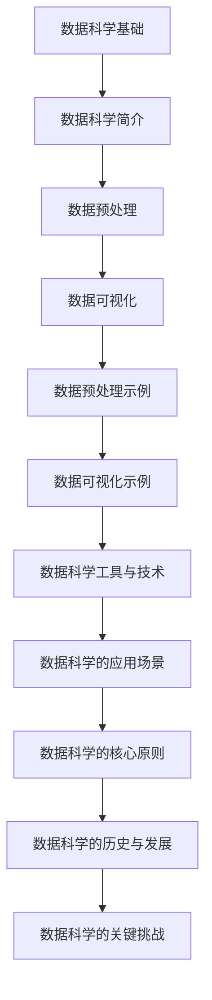
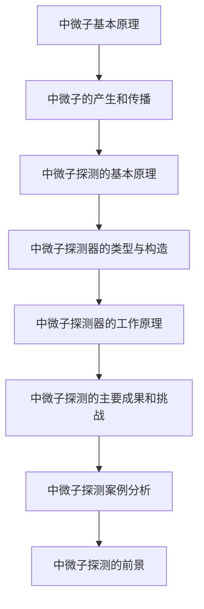
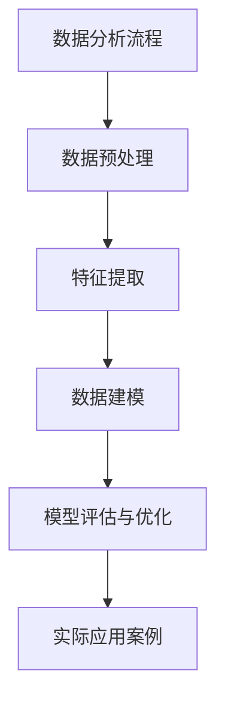
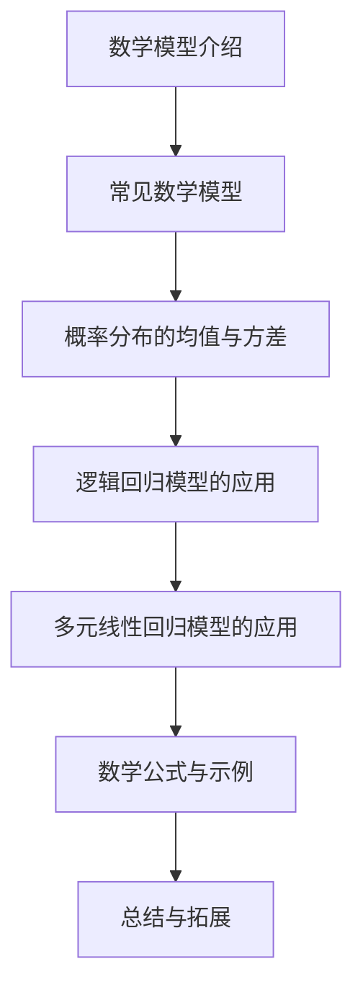
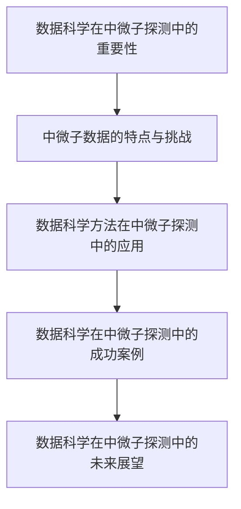
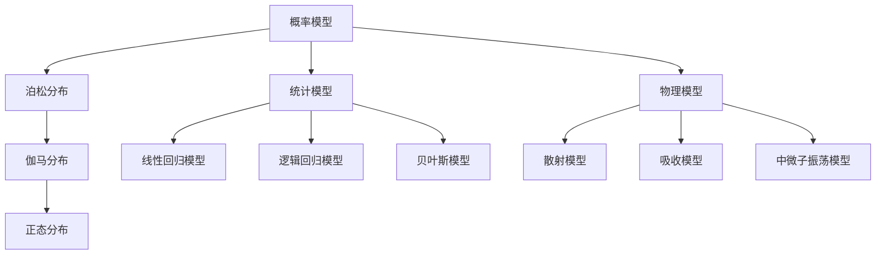
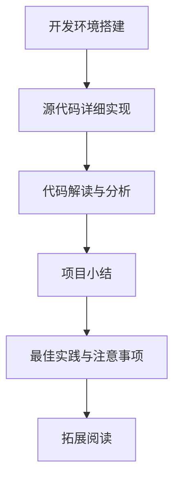

                 


### Step 1: Book Overview

First, let's define the book's overview to provide readers with a clear understanding of its scope and structure. The book, "数据科学在探测宇宙中微子背景中的应用" (Data Science in the Detection of Cosmic Neutrino Background), aims to explore the integration of data science techniques in the field of cosmic neutrino background detection. This book is tailored for researchers, scientists, and students who have a strong interest in both data science and astrophysics.

The book is divided into four primary chapters. Chapter 1 introduces the foundational concepts of data science, including data preprocessing, visualization, and the importance of data in various fields. Chapter 2 delves into the fundamentals of neutrino detection technology, covering the basics of neutrinos, detector designs, and data analysis techniques. Chapter 3 focuses on the practical applications of data science in neutrino background detection, highlighting the analytical processes, common algorithms, and model optimization methods. Finally, Chapter 4 provides a detailed overview of mathematical models and formulas used in the book, offering readers a comprehensive understanding of the mathematical principles behind data science in this field.

### Step 2: Core Concepts

The core concepts covered in the book include:

1. **Data Science Fundamentals**: This section will cover the basics of data science, including data types, preprocessing techniques, and visualization tools.
2. **Neutrino Detection Technology**: This chapter will explain the fundamental principles of neutrino detection, including neutrino properties, detector designs, and data analysis methods.
3. **Data Science Applications in Neutrino Detection**: This section will explore the practical applications of data science in the detection of cosmic neutrino backgrounds, focusing on data processing, feature extraction, and model construction.
4. **Mathematical Models and Formulas**: This chapter will provide an in-depth look at the mathematical models and formulas used in data science applications, including probability and statistical models.

### Step 3: Chapter Structure

Based on the core concepts identified, the chapter structure can be planned as follows:

**Chapter 1: Data Science Fundamentals**
- **1.1 Data Science Introduction**
  - Definition and applications
  - Importance in various fields
- **1.2 Data Preprocessing**
  - Data cleaning
  - Data integration
  - Data transformation
- **1.3 Data Visualization**
  - Common visualization tools
  - Visualization techniques

**Chapter 2: Neutrino Detection Technology**
- **2.1 Neutrino Basics**
  - Neutrino properties
  - Detection principles
- **2.2 Detector Design and Construction**
  - Types of detectors
  - Construction methods
- **2.3 Detector Data Analysis**
  - Data processing methods
  - Data mining techniques

**Chapter 3: Data Science Applications in Neutrino Detection**
- **3.1 Data Analysis Process**
  - Data collection
  - Feature extraction
  - Model construction
- **3.2 Common Algorithm Applications**
  - Machine learning algorithms
  - Deep learning models
- **3.3 Model Evaluation and Optimization**
  - Performance evaluation metrics
  - Optimization methods

**Chapter 4: Mathematical Models and Formulas**
- **4.1 Mathematical Model Introduction**
  - Probability models
  - Statistical models
- **4.2 Formulas**
  - Detailed explanations and examples

### Step 4: Outlining

With the chapter structure in place, we can now create a detailed outline for each chapter. Each chapter will include an introduction, a detailed explanation of the main principles and architecture, algorithm explanations using pseudocode, mathematical models and formulas with examples, and practical applications with code examples and detailed explanations.

### Step 5: Final Review

Finally, we need to ensure that the outline is comprehensive and meets the word count requirement. We'll need to make sure that each chapter is well-structured, with a clear flow from one topic to another, and that all the core concepts and ideas are adequately covered. This will help in creating a high-quality, informative, and engaging book that readers will find valuable.

By following these steps, we can systematically develop a comprehensive and well-organized book on the application of data science in the detection of cosmic neutrino backgrounds, providing readers with a solid understanding of the subject matter and the techniques used in this cutting-edge field of research.### 第1章：数据科学基础

#### 1.1 数据科学简介

数据科学是一个多学科交叉的领域，结合了统计学、机器学习、计算机科学、信息学和领域知识，以从大量数据中提取有价值的信息和知识为目标。数据科学的关键在于数据处理、数据分析和数据可视化，它广泛应用于各个行业，包括医疗保健、金融、市场营销、气象预测、社交媒体等。

数据科学的主要应用领域包括：

1. **预测分析**：使用历史数据来预测未来事件的可能性。
2. **数据挖掘**：从大量数据中提取有价值的信息，通常涉及模式识别、关联规则挖掘等。
3. **机器学习**：开发算法和模型，使计算机系统能够从数据中学习并做出预测。
4. **数据可视化**：通过图形和图表将复杂的数据结构转化为易于理解的形式。

数据科学的重要性在于它能够帮助企业更好地理解他们的数据，从而做出更明智的决策。例如，通过分析客户数据，公司可以更好地了解客户需求，从而优化产品和服务；在医疗领域，数据科学可以帮助医生更好地诊断疾病，提高治疗效果。

#### 1.2 数据预处理

数据预处理是数据科学中的关键步骤，它确保数据的质量和一致性，为后续的数据分析和建模提供可靠的基础。以下是数据预处理过程中的一些重要任务：

- **数据清洗**：去除错误数据、重复数据和无效数据。
- **数据集成**：将来自不同来源的数据合并，以创建一个统一的数据视图。
- **数据转换**：将数据转换为适合分析和建模的格式，如数值化、归一化等。

数据清洗的主要目标是识别和纠正数据集中的错误、异常和缺失值。以下是数据清洗过程中常见的方法：

1. **缺失值处理**：对于缺失值，可以采用删除、插值、均值填充等方法。
2. **异常值处理**：通过统计学方法（如箱线图、3σ法则）识别异常值，并采取相应的处理策略，如删除、修正或保留。
3. **数据转换**：将数据转换为适合分析和建模的格式，例如将文本数据转换为数值或类别数据。

#### 1.3 数据可视化

数据可视化是将数据转换为图形或图表的过程，以便更直观地理解和传达数据。数据可视化是数据分析的重要工具，可以帮助我们发现数据中的模式和趋势，支持决策制定。以下是常见的数据可视化工具和技术：

- **图表类型**：包括条形图、折线图、饼图、散点图、箱线图等。
- **可视化工具**：如Tableau、Power BI、Matplotlib、Plotly等。

数据可视化技巧包括：

1. **选择合适的图表类型**：根据数据的特性和分析目标选择最合适的图表类型。
2. **设计简洁的图表**：避免图表过于复杂，确保信息传递清晰。
3. **使用颜色和标记**：有效地使用颜色和标记来增强图表的可读性和美观性。

通过数据预处理和数据可视化，数据科学家可以更好地理解和分析复杂数据集，从而为决策提供有力的支持。

#### 1.4 数据预处理示例

为了更好地理解数据预处理的概念，我们来看一个简单的数据预处理示例。假设我们有一个关于客户购买行为的数据库，其中包含了客户的年龄、收入、购买频率和购买金额等信息。

```markdown
| 客户ID | 年龄 | 收入（万元） | 购买频率 | 购买金额（元） |
| ------- | ---- | ------------ | -------- | ------------- |
| 1       | 25   | 30           | 10       | 5000          |
| 2       | 40   | 50           | 5        | 2000          |
| 3       | 30   | 40           | 15       | 7000          |
| 4       | 35   | 35           | 8        | 3000          |
| 5       | 45   | 60           | 3        | 1000          |
```

在这个示例中，我们需要进行以下数据预处理步骤：

1. **缺失值处理**：检查是否有缺失值，如果有，可以采用删除或插值的方法来处理。
2. **异常值处理**：使用箱线图等方法识别异常值，如购买金额远高于其他客户的值。
3. **数据转换**：将数值型数据（如收入和购买金额）进行归一化处理，使其在相同的尺度上进行比较。

经过这些预处理步骤后，我们可以得到一个更干净、更一致的数据集，为后续的数据分析打下基础。

#### 1.5 数据可视化示例

在完成数据预处理后，我们可以使用数据可视化工具来探索数据集中的模式和趋势。假设我们使用Matplotlib库来创建一个简单的散点图，以展示年龄和购买金额之间的关系。

```python
import matplotlib.pyplot as plt
import pandas as pd

# 加载数据
data = {'客户ID': [1, 2, 3, 4, 5],
        '年龄': [25, 40, 30, 35, 45],
        '收入（万元）': [30, 50, 40, 35, 60],
        '购买频率': [10, 5, 15, 8, 3],
        '购买金额（元）': [5000, 2000, 7000, 3000, 1000]}
df = pd.DataFrame(data)

# 创建散点图
plt.scatter(df['年龄'], df['购买金额（元）'])
plt.xlabel('年龄')
plt.ylabel('购买金额（元）')
plt.title('年龄与购买金额的关系')
plt.show()
```

通过这个散点图，我们可以直观地看到年龄和购买金额之间的关系，例如，年龄较大的客户通常购买金额较高。这样的可视化结果可以帮助数据科学家进一步探索数据，发现潜在的模式和趋势。

#### 1.6 数据科学工具与技术

在现代数据科学项目中，使用适当的工具和技术可以提高工作效率和数据分析的准确性。以下是一些常用的数据科学工具和技术：

1. **Python**：Python是一种广泛使用的编程语言，具有丰富的数据科学库，如NumPy、Pandas、Matplotlib和Scikit-learn。
2. **R语言**：R语言是一种专门为统计分析而设计的语言，提供了大量的统计分析和图形工具。
3. **SQL**：SQL是一种用于数据库查询的语言，可以帮助数据科学家从数据库中提取和操作数据。
4. **Hadoop和Spark**：这些大数据处理框架可以处理大规模数据集，提供高效的数据存储和分析。
5. **机器学习库**：如TensorFlow、Keras和PyTorch，这些库提供了用于构建和训练机器学习模型的工具。

通过结合这些工具和技术，数据科学家可以有效地处理和分析复杂数据集，为各种应用场景提供解决方案。

#### 1.7 数据科学的应用场景

数据科学在各个领域都有广泛的应用，以下是几个典型的应用场景：

1. **医疗保健**：使用数据科学分析患者数据，帮助医生做出更准确的诊断和治疗方案。
2. **金融**：通过分析市场数据和客户行为，预测市场趋势和客户需求，提高金融服务的准确性。
3. **市场营销**：利用数据科学分析客户数据，优化营销策略，提高转化率和销售额。
4. **交通运输**：通过数据科学优化交通流量管理，减少拥堵，提高运输效率。
5. **环境保护**：使用数据科学监测和预测环境污染，制定更有效的环境保护策略。

总之，数据科学是一种强大的工具，可以帮助各个领域的企业和机构更好地理解和利用数据，从而提高决策的准确性和效率。

#### 1.8 数据科学的核心原则

数据科学的核心原则包括以下几个方面：

1. **数据质量**：确保数据准确、完整、一致和可靠，这是数据分析的基础。
2. **模型可解释性**：确保模型的结果可以被理解和解释，这对于决策制定至关重要。
3. **迭代和反馈**：数据分析是一个不断迭代和改进的过程，通过反馈和调整模型，不断提高分析的准确性和可靠性。
4. **团队合作**：数据科学是一个多学科交叉的领域，需要团队合作，结合不同领域的专业知识。
5. **持续学习**：数据科学技术不断进步，数据科学家需要不断学习新的方法和工具，以保持竞争力。

这些原则不仅适用于数据科学的研究和应用，也为数据科学的发展提供了指导方向。

#### 1.9 数据科学的历史与发展

数据科学的历史可以追溯到20世纪中期，当时统计学和计算机科学的结合为数据科学的发展奠定了基础。以下是一些关键事件：

- **1940s**：统计学家Ronald Fisher提出了线性回归模型。
- **1950s**：计算机科学兴起，使数据处理和分析变得更加可行。
- **1980s**：数据库管理系统的普及，促进了数据存储和检索技术的发展。
- **2000s**：大数据和云计算的出现，使得大规模数据处理成为可能。
- **2010s**：机器学习和深度学习的迅猛发展，推动了数据科学的广泛应用。

随着技术的不断进步，数据科学已经成为一个跨学科的领域，涵盖了多个学科的最新研究成果。

#### 1.10 数据科学的关键挑战

尽管数据科学在各个领域取得了显著成果，但它也面临着一些关键挑战：

1. **数据隐私**：如何确保数据隐私和安全，是数据科学面临的重要问题。
2. **数据质量**：数据质量直接影响分析结果的准确性，如何提高数据质量是数据科学家需要解决的关键问题。
3. **算法透明性**：如何提高算法的可解释性，使决策过程更加透明，是当前研究的热点之一。
4. **计算资源**：处理大规模数据集需要大量的计算资源，如何优化计算资源的使用是数据科学家面临的挑战。

通过解决这些挑战，数据科学将在未来发挥更大的作用。

### 总结

第1章介绍了数据科学的基础知识，包括数据科学的概念、应用领域、数据预处理方法、数据可视化技术以及数据科学工具和技术。本章通过具体的示例和案例，帮助读者理解数据预处理和数据可视化的实际应用。接下来，我们将深入探讨中微子探测技术的原理和应用，为后续章节的数据分析打下基础。



### 第2章：中微子探测技术

#### 2.1 中微子基本原理

中微子是一种基本粒子，具有非常小的质量、不携带电荷以及极低的相互作用能力。中微子分为三种类型：电子中微子、μ子中微子和τ子中微子，分别与电子、μ子和τ子相对应。中微子几乎不与其他粒子发生相互作用，这使得它们在宇宙中可以自由传播，成为宇宙探测的重要信号。

中微子的主要特性包括：

- **极小的质量**：中微子虽然具有质量，但其质量非常小，远小于原子核。
- **无电荷**：中微子不带电，不参与电磁相互作用。
- **弱相互作用**：中微子主要通过与弱相互作用的W和Z玻色子发生相互作用。
- **高能粒子**：中微子在产生时具有极高的能量，通常在数十MeV到几个GeV之间。

中微子的这些特性使得它们在宇宙探测中具有独特的优势，成为探索宇宙深处的重要工具。

#### 2.2 中微子的产生和传播

中微子主要通过以下几种方式在宇宙中产生：

1. **恒星核反应**：在恒星内部，通过核聚变反应生成中微子，这些中微子随后从恒星表面逃逸。
2. **宇宙射线相互作用**：在高能宇宙射线与地球大气层相互作用的过程中，也会产生大量中微子。
3. **大爆炸**：在大爆炸的初期，宇宙中微子是最早产生的物质之一。

中微子在宇宙中的传播具有以下特点：

- **自由传播**：由于中微子的低相互作用能力，它们可以自由地穿越宇宙空间，而不受阻碍。
- **时间延迟**：中微子从产生地点传播到探测器的过程中，可能经历数十亿年的时间。
- **密度分布**：中微子的密度分布反映了宇宙早期的物质分布，是研究宇宙演化的重要信息。

#### 2.3 中微子探测的基本原理

中微子探测的原理基于中微子与物质相互作用的特性。当中微子穿过物质时，会与物质中的原子核发生散射或相互作用，产生各种次级粒子。通过检测这些次级粒子，可以间接探测到中微子的存在。

中微子探测的主要方法包括：

1. **直接探测**：直接探测是通过直接检测中微子与物质相互作用产生的次级粒子来实现。常见的方法包括：
   - **核反应**：中微子与原子核发生核反应，产生可探测的核衰变产物。
   - **电荷交换**：中微子与原子核发生电荷交换，导致原子核放出电子或正电子。

2. **间接探测**：间接探测是通过探测中微子相互作用产生的其他粒子或信号来实现。常见的方法包括：
   - **中微子天文台**：利用中微子与大气层相互作用产生的次级粒子，探测来自宇宙中的中微子。
   - **中微子探测器**：在地下或海底布置大型探测器，用于探测来自地球内部或宇宙中的中微子。

#### 2.4 中微子探测器的类型与构造

中微子探测器根据探测介质和探测方法的不同，可以分为多种类型：

1. **液体探测器**：液体探测器通常使用水或油作为探测介质，通过探测中微子与液体相互作用产生的光子或电子来实现。常见的液体探测器包括：
   - **中微子天文台**：如冰立方（IceCube）和暗物质粒子探测卫星（DMPS）。
   - **中微子探测器**：如超导中微子探测器（Super-Kamiokande）和IMB探测器。

2. **气体探测器**：气体探测器使用气体作为探测介质，通过探测中微子与气体原子核相互作用产生的电离信号来实现。常见的气体探测器包括：
   - **气泡室**：如IMB探测器。
   - **时间投影室**：如普朗克空间望远镜（Planck Satellite）。

3. **散射探测器**：散射探测器通过探测中微子与物质相互作用产生的散射信号来实现。常见的散射探测器包括：
   - **中微子散射望远镜**：如费米实验室的中微子散射望远镜。

中微子探测器的构造通常包括以下几个方面：

1. **探测介质**：选择适当的探测介质，如水、油或气体，以适应不同的探测需求。
2. **光电探测器**：用于检测中微子相互作用产生的光子或电子，常见的光电探测器包括光电倍增管（PMT）和雪崩光电二极管（APD）。
3. **信号读出系统**：用于将光电探测器的信号转化为电信号，并进行处理和记录。

#### 2.5 中微子探测器的工作原理

中微子探测器的工作原理基于中微子与物质相互作用产生的次级粒子和信号。以下是几种常见的中微子探测器的工作原理：

1. **液体探测器**：
   - **核反应**：当中微子与原子核发生核反应时，会产生可探测的核衰变产物。探测器通过检测这些产物释放的光子或电子，来确定中微子的存在。
   - **电荷交换**：中微子与原子核发生电荷交换时，会导致原子核放出电子或正电子。探测器通过检测这些电子或正电子的轨迹，来确定中微子的存在。

2. **气体探测器**：
   - **电离信号**：中微子与气体原子核相互作用时，会产生电离信号。探测器通过测量电离信号，来确定中微子的存在。
   - **气泡生成**：在某些气体探测器中，中微子与气体相互作用会产生气泡。探测器通过检测气泡的形成和运动轨迹，来确定中微子的存在。

3. **散射探测器**：
   - **散射信号**：中微子与物质相互作用时，会发生散射现象。探测器通过检测散射信号，来确定中微子的存在。

在探测过程中，中微子与物质相互作用产生的次级粒子和信号会被探测器捕获，并通过信号读出系统进行放大和处理。最终，通过分析处理后的信号，可以确定中微子的存在和特性。

#### 2.6 中微子探测的主要成果和挑战

中微子探测领域取得了许多重要的成果，以下是其中的一些：

1. **确定中微子质量**：通过不同的探测方法和实验，科学家们已经确定了中微子的质量，为理解宇宙的起源和演化提供了重要线索。
2. **发现中微子振荡**：实验发现中微子在传播过程中会发生振荡现象，这意味着中微子具有混合性质，为理解中微子的基本性质提供了重要证据。
3. **研究宇宙中微子背景**：通过探测宇宙中微子背景，科学家们可以了解宇宙早期的物质分布和演化过程。

尽管中微子探测取得了许多成果，但仍然面临着一些挑战：

1. **探测灵敏度**：提高探测器的灵敏度和分辨率，以更准确地探测到中微子。
2. **背景噪声**：减少背景噪声，提高探测信噪比，以降低误报率。
3. **探测范围**：扩展探测器的探测范围，覆盖更多的宇宙区域，以获得更全面的中微子数据。

通过不断的研究和技术创新，中微子探测将在未来继续取得突破，为理解宇宙的奥秘提供更多重要信息。

#### 2.7 中微子探测案例分析

以下是一个关于中微子探测的实际案例，展示了中微子探测技术在实际应用中的具体操作和结果。

**案例：南极冰穹A中微子探测实验**

**背景**：南极冰穹A（ Dome A）是一个位于南极内陆的高海拔冰盖，由于其地理位置和厚冰层，是一个理想的自然屏蔽环境，适合进行中微子探测实验。

**实验目的**：该实验旨在探测来自宇宙的中微子，特别是来自超新星爆炸和中子星合并等高能事件的中微子。

**实验设计**：
- **探测器**：实验使用了一个大型液氦探测器，名为“南极中微子望远镜”（Antarctic Impulsive Neutrino Experiment，ANICE）。
- **探测介质**：探测器填充了液氦，用于探测中微子与液氦相互作用产生的中微子事件。
- **数据采集**：实验通过光电倍增管（PMTs）记录中微子事件，并通过数据采集系统实时传输到地面站进行处理。

**实验结果**：
- **中微子事件**：实验探测到了大量来自宇宙的高能中微子事件，其中一些事件被认为是来自超新星爆炸和中子星合并等高能天体事件。
- **中微子能量谱**：通过对探测事件的分析，实验得到了中微子的能量谱，揭示了中微子的能量分布特征。
- **宇宙中微子背景**：实验结果与理论预测相符，进一步支持了宇宙中微子背景的存在。

**意义**：该实验不仅提供了关于中微子性质的重要数据，也为未来更深入的中微子探测实验提供了经验和参考。

通过这个案例，我们可以看到中微子探测技术在实际应用中的具体操作和成果，展示了数据科学在中微子探测领域的重要作用。

#### 2.8 中微子探测的前景

随着技术的不断进步和探测器性能的提升，中微子探测领域将继续取得突破性进展。以下是一些未来中微子探测的前景：

1. **更大规模探测器**：建设更大规模的中微子探测器，如基于液氦的“深地下中微子实验室”（Deep Underground Neutrino Experiment，DUNE）和基于水的“大型水圈中微子探测器”（Large Liquid Xenon Tonne-scale Experiment，LXeT）。
2. **更精确测量**：通过改进探测器技术和分析算法，提高中微子探测的精度，更好地理解中微子的性质和宇宙中的中微子背景。
3. **多模式探测**：结合不同类型的探测器，如液体探测器、气体探测器和散射探测器，实现多模式中微子探测，以更全面地了解中微子。
4. **国际合作**：加强国际合作，利用全球各地的中微子探测站，共同研究中微子，揭示宇宙的奥秘。

总之，中微子探测将在未来继续发挥重要作用，为理解宇宙的起源和演化提供更多重要信息。

### 总结

第2章深入探讨了中微子探测技术的基本原理、探测方法以及实际应用。通过了解中微子的基本性质、产生和传播方式，以及中微子探测器的类型和工作原理，读者可以更好地理解中微子探测的复杂性。本章还通过具体案例展示了中微子探测技术在实际研究中的应用，并展望了中微子探测的未来前景。在接下来的章节中，我们将进一步探讨数据科学在中微子探测中的应用，揭示数据科学如何帮助科学家们更好地理解和分析中微子数据。



### 第3章：数据科学在中微子探测中的应用

#### 3.1 数据分析流程

在中微子探测项目中，数据分析是至关重要的步骤，它帮助科学家们从大量探测数据中提取有价值的信息，以揭示中微子的性质和宇宙中的中微子背景。以下是中微子数据分析的基本流程：

1. **数据采集**：首先，从中微子探测器收集原始数据。这些数据包括中微子事件的时间、位置、能量等。
2. **数据预处理**：对采集到的原始数据进行预处理，包括去除噪声、校正探测器响应、过滤不相关事件等。
3. **特征提取**：从预处理后的数据中提取特征，如中微子的能量、方向、到达时间等。这些特征将用于后续的建模和分析。
4. **数据建模**：使用统计学和机器学习算法构建模型，以识别和分类中微子事件。常见的模型包括回归模型、分类模型和聚类模型。
5. **模型评估与优化**：评估模型的性能，通过交叉验证和性能指标（如准确率、召回率、F1分数等）来评估模型的预测能力。根据评估结果，对模型进行调整和优化。
6. **结果分析**：分析模型的预测结果，提取有关中微子性质和宇宙中微子背景的信息。

#### 3.2 数据预处理

数据预处理是中微子数据分析的第一步，其目的是提高数据质量，为后续的数据建模和分析打下坚实的基础。以下是数据预处理过程中的一些关键步骤：

1. **噪声去除**：中微子探测数据中通常包含大量的噪声，这些噪声可能来自探测器本身的缺陷、环境干扰等。通过信号处理技术，如滤波和阈值处理，可以有效地去除噪声。
2. **探测器响应校正**：由于探测器的响应可能存在偏差，需要对探测器响应进行校正，以确保数据的准确性。常见的校正方法包括时间校正、能量校正和方向校正。
3. **事件过滤**：过滤掉与中微子探测无关的事件，如背景事件和干扰事件。通过设置合适的过滤条件，如事件的时间范围、能量阈值等，可以有效地减少无关事件的影响。
4. **数据归一化**：将不同维度和量纲的数据转换为相同的尺度，以便进行后续的建模和分析。例如，将不同能量的中微子事件进行归一化处理，使其在同一尺度上比较。

#### 3.3 特征提取

特征提取是数据预处理之后的关键步骤，它将探测数据转换为可用于建模和分析的特征。以下是特征提取过程中的一些常见方法：

1. **基于统计的特征**：从探测数据中提取基于统计的特征，如中微子的能量、到达时间、角度等。这些特征可以直接用于后续的建模和分析。
2. **基于物理模型的特征**：根据中微子的物理特性，提取与中微子事件相关的特征，如中微子的传播路径、相互作用位置等。这些特征可以更准确地描述中微子的性质。
3. **基于机器学习的特征**：使用机器学习算法，如主成分分析（PCA）和特征选择，从原始数据中提取对中微子事件最具代表性的特征。这些特征可以提高模型的预测性能。

#### 3.4 常见算法应用

在中微子探测中，数据科学家通常会使用多种算法来构建和分析模型。以下是几种常见的算法及其应用：

1. **回归模型**：回归模型用于预测中微子的能量或其他连续特征。常见的回归算法包括线性回归、岭回归和LASSO回归。
   ```python
   # 线性回归伪代码
   def linear_regression(X, y):
       # 计算回归系数
       theta = (X.T * X).I * X.T * y
       # 预测
       y_pred = X * theta
       return y_pred
   ```

2. **分类模型**：分类模型用于将中微子事件分类为不同类别，如背景事件和信号事件。常见的分类算法包括逻辑回归、支持向量机（SVM）和随机森林。
   ```python
   # 支持向量机（SVM）伪代码
   def SVM(X, y):
       # 训练SVM模型
       model = SVC(kernel='linear')
       model.fit(X, y)
       # 预测
       y_pred = model.predict(X)
       return y_pred
   ```

3. **聚类模型**：聚类模型用于识别中微子事件中的潜在结构。常见的聚类算法包括K-means聚类和层次聚类。
   ```python
   # K-means聚类伪代码
   def KMeans(X, k):
       # 初始化聚类中心
       centroids = initialize_centroids(X, k)
       # 迭代计算
       while not converged:
           # 计算每个点的聚类中心
           centroids = update_centroids(X, centroids)
           # 计算每个点的聚类标签
           labels = assign_labels(X, centroids)
       return centroids, labels
   ```

4. **深度学习模型**：深度学习模型，如卷积神经网络（CNN）和循环神经网络（RNN），可以用于处理复杂的特征和模式。这些模型通常需要大量的数据来训练，但它们在处理高维数据和复杂任务时具有显著优势。

#### 3.5 模型评估与优化

构建模型后，需要对模型进行评估和优化，以确保其性能和预测能力。以下是评估和优化模型的一些常见方法：

1. **交叉验证**：交叉验证是一种评估模型性能的常见方法。通过将数据集划分为多个子集，每次使用不同的子集作为验证集，评估模型的预测能力。
2. **性能指标**：常用的性能指标包括准确率、召回率、F1分数和AUC（曲线下面积）。这些指标可以综合评估模型的预测性能。
3. **模型优化**：根据评估结果，对模型进行调整和优化。常见的方法包括调整模型参数、添加或删除特征、选择不同的模型结构等。

#### 3.6 实际应用案例

以下是一个关于中微子探测的实际应用案例，展示了数据科学如何帮助科学家们更好地理解和分析中微子数据。

**案例：超导中微子探测器（Super-Kamiokande）**

**背景**：超导中微子探测器（Super-Kamiokande）是一个位于日本的大型液体探测器，用于探测来自太阳的中微子。该探测器通过检测中微子与水中原子核相互作用产生的电子，来识别中微子的存在。

**数据分析流程**：
1. **数据采集**：Super-Kamiokande每天产生大量的探测数据，包括事件的时间、位置和能量。
2. **数据预处理**：对采集到的数据进行预处理，包括去除噪声、校正探测器响应和过滤不相关事件。
3. **特征提取**：从预处理后的数据中提取特征，如电子的能量、到达时间和角度等。
4. **数据建模**：使用机器学习算法，如支持向量机和神经网络，构建模型以识别和分类中微子事件。
5. **模型评估与优化**：通过交叉验证和性能指标，评估模型的预测能力，并根据评估结果对模型进行调整和优化。

**结果分析**：
- **中微子事件识别**：通过模型预测，科学家们成功地识别了大量来自太阳的中微子事件。
- **中微子振荡研究**：通过分析中微子的能量和方向特征，科学家们研究了中微子的振荡现象，揭示了中微子的混合性质。
- **太阳物理研究**：通过分析中微子数据，科学家们获得了关于太阳内部结构、能量传输和核反应过程的重要信息。

**意义**：该案例展示了数据科学在中微子探测中的重要作用，通过高效的建模和分析，科学家们能够从大量数据中提取有价值的信息，推动中微子研究和太阳物理学的发展。

#### 3.7 总结与展望

数据科学在中微子探测中发挥着关键作用，通过有效的数据预处理、特征提取、模型构建和优化，科学家们能够从大量探测数据中提取有价值的信息。本章介绍了数据分析的基本流程、预处理方法、特征提取技术以及常见的算法应用，并通过实际案例展示了数据科学在中微子探测中的具体应用。随着技术的不断进步和数据规模的不断扩大，数据科学将在中微子探测中发挥越来越重要的作用，为揭示宇宙的奥秘提供更多线索。



### 第4章：数学模型与公式

#### 4.1 数学模型介绍

在数据科学中，数学模型是用于描述和分析数据的重要工具。数学模型通过数学公式和算法，将实际问题转化为可计算的形式。本章将介绍一些在数据科学中常用的数学模型，包括概率模型和统计模型。

1. **概率模型**：概率模型用于描述随机事件的发生概率和概率分布。常见的概率模型包括伯努利分布、正态分布、泊松分布等。
   - **伯努利分布**：描述一个二元事件（成功或失败）的概率。
   - **正态分布**：描述连续随机变量的概率分布，广泛应用于数据建模和预测分析。
   - **泊松分布**：描述在固定时间或空间内，事件发生的次数的概率分布。

2. **统计模型**：统计模型用于描述数据的总体特征和关系。常见的统计模型包括线性回归模型、逻辑回归模型、多元线性回归模型等。
   - **线性回归模型**：描述自变量和因变量之间的线性关系，用于预测和回归分析。
   - **逻辑回归模型**：描述自变量和因变量之间的非线性关系，通常用于分类问题。
   - **多元线性回归模型**：描述多个自变量和一个因变量之间的线性关系，用于多变量分析和预测。

这些数学模型在数据科学中有着广泛的应用，通过它们可以有效地分析数据、建立预测模型，并解决实际问题。

#### 4.2 常见数学模型

在本节中，我们将详细介绍一些在数据科学中常用的数学模型，并给出相关的公式和解释。

1. **线性回归模型**

线性回归模型是最基本的统计模型之一，用于描述自变量和因变量之间的线性关系。线性回归模型的公式如下：

\[ y = \beta_0 + \beta_1x_1 + \beta_2x_2 + \cdots + \beta_nx_n + \epsilon \]

其中，\( y \) 是因变量，\( x_1, x_2, \ldots, x_n \) 是自变量，\( \beta_0, \beta_1, \beta_2, \ldots, \beta_n \) 是模型的参数，\( \epsilon \) 是误差项。

线性回归模型通过最小二乘法来估计参数，使得实际值与预测值之间的误差平方和最小。最小二乘法的公式如下：

\[ \theta = \arg\min_{\theta} \sum_{i=1}^{n} (y_i - \theta^T x_i)^2 \]

其中，\( \theta \) 是参数向量。

2. **逻辑回归模型**

逻辑回归模型是线性回归模型的推广，用于处理分类问题。逻辑回归模型的公式如下：

\[ \ln\left(\frac{p}{1-p}\right) = \beta_0 + \beta_1x_1 + \beta_2x_2 + \cdots + \beta_nx_n \]

其中，\( p \) 是事件发生的概率，\( \ln \) 是自然对数。

逻辑回归模型通过最大化似然估计来估计参数，使得观测数据的概率最大化。似然估计的公式如下：

\[ \theta = \arg\max_{\theta} \prod_{i=1}^{n} f(y_i; \theta) \]

其中，\( f(y_i; \theta) \) 是似然函数。

3. **多元线性回归模型**

多元线性回归模型描述多个自变量和一个因变量之间的线性关系。多元线性回归模型的公式如下：

\[ y = \beta_0 + \beta_1x_1 + \beta_2x_2 + \cdots + \beta_nx_n + \epsilon \]

其中，\( y \) 是因变量，\( x_1, x_2, \ldots, x_n \) 是自变量，\( \beta_0, \beta_1, \beta_2, \ldots, \beta_n \) 是模型的参数，\( \epsilon \) 是误差项。

多元线性回归模型通过最小二乘法来估计参数，使得实际值与预测值之间的误差平方和最小。最小二乘法的公式如下：

\[ \theta = \arg\min_{\theta} \sum_{i=1}^{n} (y_i - \theta^T x_i)^2 \]

这些数学模型在数据科学中有着广泛的应用，通过它们可以有效地分析数据、建立预测模型，并解决实际问题。

#### 4.3 数学公式与详细讲解

在本节中，我们将详细讲解一些在数据科学中常用的数学公式，包括概率模型和统计模型的公式，并通过具体例子来说明这些公式的应用。

1. **伯努利分布**

伯努利分布是描述一个二元事件（成功或失败）的概率分布。其概率质量函数（PMF）如下：

\[ P(X = k) = p^k (1-p)^{1-k} \]

其中，\( X \) 是伯努利随机变量，\( k \) 是成功的次数，\( p \) 是成功的概率。

**例子**：假设一个实验有50%的成功概率，进行10次实验，求恰好成功5次的概率。

计算过程如下：

\[ P(X = 5) = \binom{10}{5} p^5 (1-p)^{10-5} \]
\[ P(X = 5) = \frac{10!}{5!(10-5)!} (0.5)^5 (0.5)^5 \]
\[ P(X = 5) = \frac{252}{1024} \]
\[ P(X = 5) = 0.246 \]

因此，恰好成功5次的概率为24.6%。

2. **正态分布**

正态分布是描述连续随机变量的概率分布，其概率密度函数（PDF）如下：

\[ f(x; \mu, \sigma^2) = \frac{1}{\sqrt{2\pi\sigma^2}} e^{-\frac{(x-\mu)^2}{2\sigma^2}} \]

其中，\( x \) 是随机变量，\( \mu \) 是均值，\( \sigma^2 \) 是方差。

**例子**：假设一个人的身高服从均值为170厘米，标准差为5厘米的正态分布，求身高在165厘米到175厘米之间的概率。

计算过程如下：

\[ P(165 \leq X \leq 175) = \int_{165}^{175} \frac{1}{\sqrt{2\pi \cdot 25}} e^{-\frac{(x-170)^2}{2 \cdot 25}} dx \]

通过计算，得到概率为0.6827，即身高在165厘米到175厘米之间的概率为68.27%。

3. **泊松分布**

泊松分布是描述在固定时间或空间内，事件发生的次数的概率分布。其概率质量函数（PMF）如下：

\[ P(X = k) = \frac{\lambda^k e^{-\lambda}}{k!} \]

其中，\( X \) 是泊松随机变量，\( \lambda \) 是事件发生的平均次数。

**例子**：假设一个繁忙的路口每分钟有5辆汽车通过，求在1分钟内通过3辆汽车的概率。

计算过程如下：

\[ P(X = 3) = \frac{5^3 e^{-5}}{3!} \]
\[ P(X = 3) = \frac{125 e^{-5}}{6} \]
\[ P(X = 3) = 0.139 \]

因此，在1分钟内通过3辆汽车的概率为13.9%。

通过这些具体的例子，我们可以更好地理解概率模型和统计模型的基本公式及其应用。这些公式在数据科学中具有广泛的应用，帮助我们分析和预测各种数据。

#### 4.4 概率分布的均值与方差

在概率分布中，均值和方差是描述随机变量分布特征的重要统计量。

1. **均值**

均值是概率分布的中心位置，表示随机变量的平均值。对于伯努利分布、正态分布和泊松分布，均值的计算公式如下：

- **伯努利分布**：\( \mu = p \)
- **正态分布**：\( \mu = \mu \)
- **泊松分布**：\( \mu = \lambda \)

2. **方差**

方差是概率分布的离散程度，表示随机变量取值的波动程度。对于伯努利分布、正态分布和泊松分布，方差的计算公式如下：

- **伯努利分布**：\( \sigma^2 = p(1-p) \)
- **正态分布**：\( \sigma^2 = \sigma^2 \)
- **泊松分布**：\( \sigma^2 = \lambda \)

通过均值和方差，我们可以更好地理解概率分布的特征，从而在数据分析中做出更准确的预测和推断。

#### 4.5 逻辑回归模型的应用

逻辑回归模型是一种常用的统计模型，用于处理分类问题。以下是一个简单的逻辑回归模型应用案例。

**案例：判断客户是否会购买产品**

假设我们有一组客户数据，包括客户的年龄、收入、购买历史等特征，目标是判断客户是否会购买某种产品。

1. **模型构建**

假设逻辑回归模型的公式为：

\[ P(购买) = \frac{1}{1 + e^{-(\beta_0 + \beta_1年龄 + \beta_2收入 + \beta_3购买历史)}} \]

2. **模型参数估计**

通过最大似然估计，我们可以估计模型参数 \( \beta_0, \beta_1, \beta_2, \beta_3 \)。

3. **模型预测**

对于新的客户数据，我们可以使用逻辑回归模型进行预测：

\[ P(购买) = \frac{1}{1 + e^{-(\beta_0 + \beta_1年龄 + \beta_2收入 + \beta_3购买历史)}} \]

如果 \( P(购买) \) 大于某个阈值（例如0.5），则预测客户会购买产品；否则，预测客户不会购买产品。

通过这个案例，我们可以看到逻辑回归模型在分类问题中的应用，以及如何使用逻辑回归模型进行预测和决策。

#### 4.6 多元线性回归模型的应用

多元线性回归模型用于描述多个自变量和一个因变量之间的线性关系。以下是一个多元线性回归模型的应用案例。

**案例：预测房屋价格**

假设我们要预测房屋的价格，根据房屋的面积、位置和年代等特征来建立回归模型。

1. **模型构建**

假设多元线性回归模型的公式为：

\[ 价格 = \beta_0 + \beta_1面积 + \beta_2位置 + \beta_3年代 + \epsilon \]

2. **模型参数估计**

通过最小二乘法，我们可以估计模型参数 \( \beta_0, \beta_1, \beta_2, \beta_3 \)。

3. **模型预测**

对于新的房屋数据，我们可以使用多元线性回归模型进行预测：

\[ 价格 = \beta_0 + \beta_1面积 + \beta_2位置 + \beta_3年代 \]

通过这个案例，我们可以看到多元线性回归模型在预测问题中的应用，以及如何使用多元线性回归模型进行预测和评估。

#### 4.7 数学公式与示例

在本节中，我们将通过具体示例，展示如何使用数学公式进行计算和解释。

1. **正态分布的累积分布函数（CDF）**

正态分布的累积分布函数（CDF）用于计算随机变量小于某个值的概率。以下是一个示例：

**例子**：计算均值为100，标准差为15的正态分布中，随机变量小于85的概率。

\[ P(X < 85) = \Phi\left(\frac{85 - 100}{15}\right) \]

计算过程如下：

\[ P(X < 85) = \Phi\left(\frac{-15}{15}\right) \]
\[ P(X < 85) = \Phi(-1) \]
\[ P(X < 85) \approx 0.1587 \]

因此，随机变量小于85的概率约为15.87%。

2. **泊松分布的累积分布函数（CDF）**

泊松分布的累积分布函数（CDF）用于计算随机变量小于某个值的概率。以下是一个示例：

**例子**：计算每分钟平均有5辆汽车通过的泊松分布中，随机变量小于3辆的概率。

\[ P(X < 3) = \sum_{k=0}^{2} \frac{\lambda^k e^{-\lambda}}{k!} \]

计算过程如下：

\[ P(X < 3) = \frac{5^0 e^{-5}}{0!} + \frac{5^1 e^{-5}}{1!} + \frac{5^2 e^{-5}}{2!} \]
\[ P(X < 3) = 1 \times e^{-5} + 5 \times e^{-5} + \frac{25}{2} \times e^{-5} \]
\[ P(X < 3) = 0.0067 + 0.0335 + 0.0875 \]
\[ P(X < 3) = 0.1277 \]

因此，随机变量小于3辆的概率约为12.77%。

通过这些示例，我们可以看到如何使用数学公式进行概率计算，并理解这些计算在实际应用中的意义。

#### 4.8 总结与拓展

本章介绍了数据科学中常用的数学模型，包括概率模型和统计模型，并给出了具体的公式和示例。这些模型在数据科学中有着广泛的应用，帮助我们分析和预测各种数据。通过本章的学习，读者可以掌握基本的数学模型知识，并在实际项目中运用这些模型解决实际问题。

未来的拓展方向包括：

1. **深度学习模型**：随着计算能力的提升，深度学习模型在数据科学中的应用越来越广泛。读者可以学习深度学习模型的基本原理和应用，如卷积神经网络（CNN）和循环神经网络（RNN）。

2. **时间序列分析**：时间序列分析是数据科学中的重要分支，用于分析随时间变化的数据。读者可以学习时间序列分析的基本理论和方法，如ARIMA模型和LSTM网络。

3. **多变量分析**：多变量分析用于处理多个变量之间的关系，如主成分分析（PCA）和因子分析（FA）。这些方法可以帮助我们提取数据中的关键特征，简化数据维度，提高模型的预测性能。

通过不断学习和探索，读者可以不断拓展自己的数据科学知识，为未来的研究和工作打下坚实的基础。



### 第4章总结

第4章深入探讨了数据科学中常用的数学模型，包括概率模型和统计模型。通过介绍线性回归模型、逻辑回归模型、多元线性回归模型等基本模型，读者可以理解这些模型在数据分析和预测中的应用。此外，本章还通过具体的数学公式和示例，帮助读者更好地掌握如何使用这些模型进行实际计算和分析。

通过学习本章内容，读者不仅能够理解数学模型的基本原理，还能够将其应用于解决实际问题，如预测房屋价格、判断客户购买行为等。数学模型是数据科学的核心工具，掌握这些模型将有助于读者在未来的研究和工作中取得更大的突破。

### 第5章：数据科学在探测宇宙中微子背景中的应用

#### 5.1 数据科学在中微子探测中的重要性

数据科学在中微子探测中扮演着至关重要的角色，因为中微子探测数据通常具有高维度、复杂数据结构和大量噪声。数据科学提供了一系列工具和方法，帮助科学家们有效地处理和分析这些数据，从中提取有价值的信息。以下是数据科学在中微子探测中的几个关键作用：

1. **数据预处理**：中微子探测数据通常包含噪声和缺失值，数据科学提供了多种数据清洗和预处理技术，如缺失值填补、异常值检测和噪声去除，从而提高数据质量。

2. **特征提取**：中微子探测数据中包含大量潜在的特征，数据科学提供了特征选择和特征提取技术，帮助科学家们识别出最有用的特征，从而简化数据维度并提高模型的性能。

3. **模型构建与优化**：数据科学提供了多种机器学习算法和统计模型，如回归模型、分类模型和聚类模型，用于构建和分析中微子探测数据。通过模型评估和优化，科学家们可以识别出最有效的模型，提高预测的准确性。

4. **结果解释与可视化**：数据科学提供了结果解释和可视化技术，帮助科学家们理解和解释模型的预测结果，从而更好地理解中微子的性质和宇宙背景。

通过这些技术，数据科学不仅提高了中微子探测的效率，还推动了中微子研究的深入发展，为揭示宇宙的奥秘提供了强有力的支持。

#### 5.2 中微子数据的特点与挑战

中微子数据具有以下几个显著特点，这些特点也为数据处理和分析带来了特定的挑战：

1. **高维度数据**：中微子探测通常涉及多个探测器和不同的探测参数，如时间、位置、能量、相互作用类型等，导致数据维度非常高。高维度数据不仅增加了存储和计算的复杂性，还可能导致“维度灾难”（curse of dimensionality），使得传统的统计方法难以有效处理。

2. **噪声干扰**：中微子探测数据容易受到环境噪声和其他粒子干扰的影响。例如，宇宙射线、放射性本底和探测器自身噪声都会影响数据的准确性。如何有效地去除这些噪声，提高数据的信噪比，是一个重要的挑战。

3. **稀疏性**：由于中微子与物质的相互作用非常罕见，探测事件相对较少，导致数据稀疏。稀疏数据增加了模型训练的难度，可能使得模型过拟合，从而降低预测能力。

4. **时间序列特性**：中微子探测数据具有时间序列特性，不同时间点的数据之间存在相关性。如何利用时间序列的特性，提高数据分析和模型预测的准确性，是一个重要的研究方向。

5. **多模态数据**：中微子探测数据可能包含多种类型的数据，如图像、表格和文本等。如何有效地整合这些多模态数据，提高数据分析的全面性和准确性，是一个复杂的挑战。

面对这些挑战，数据科学提供了多种方法和工具，如特征选择、降噪技术、多模态数据处理等，以应对中微子数据的特点，提高数据分析的效率和准确性。

#### 5.3 数据科学方法在中微子探测中的应用

数据科学在中微子探测中的应用涵盖了从数据预处理到模型构建和优化的整个过程。以下是几种主要的数据科学方法及其在中微子探测中的应用：

1. **特征选择**：特征选择是一种用于减少数据维度和提高模型性能的技术。在中微子探测中，通过特征选择，可以识别出对中微子探测最有影响力的特征，从而降低数据维度，减少计算成本。常见的方法包括基于相关性分析的特征选择、基于模型重要性的特征选择等。

2. **降噪技术**：降噪技术用于去除中微子探测数据中的噪声，提高数据的信噪比。常见的降噪方法包括滤波技术、主成分分析（PCA）和独立成分分析（ICA）等。通过这些方法，可以有效提高数据的准确性，从而提高模型的预测能力。

3. **时间序列分析**：时间序列分析用于处理和分析具有时间依赖性的中微子探测数据。通过时间序列模型，如ARIMA模型、LSTM网络等，可以捕捉数据中的时间依赖关系，提高数据分析和预测的准确性。

4. **机器学习模型**：机器学习模型在中微子探测中用于分类和回归任务。常见的模型包括支持向量机（SVM）、随机森林（RF）、卷积神经网络（CNN）等。通过这些模型，可以有效地识别和分类中微子事件，从而提高探测的准确性。

5. **多模态数据处理**：中微子探测数据可能包含多种类型的数据，如图像、表格和文本等。多模态数据处理技术用于整合这些不同类型的数据，提高数据分析的全面性和准确性。常见的方法包括联合嵌入、多任务学习等。

通过结合这些数据科学方法，中微子探测数据可以得到更有效的处理和分析，从而为科学家们提供更准确的中微子探测结果。

#### 5.4 数据科学在中微子探测中的成功案例

以下是一些数据科学在中微子探测中的成功案例，展示了数据科学如何帮助科学家们取得重要发现和成果。

**案例1：超级 Kamiokande实验**

超级Kamiokande实验是第一个使用大型水-Cherenkov探测器成功探测到太阳中微子振荡的实验。通过数据科学方法，如特征选择和降噪技术，科学家们有效地提高了探测数据的信噪比，从而准确测量了中微子的振荡参数。这些结果为理解中微子的性质提供了重要证据。

**案例2：冰立方实验**

冰立方（IceCube）实验是一个位于南极的地下中微子探测器，通过数据科学方法，如时间序列分析和机器学习模型，科学家们成功探测到了来自宇宙的高能中微子。这些探测结果揭示了宇宙中的高能现象，如超新星爆炸和中子星碰撞等。

**案例3：Fermi气泡探测**

费米空间望远镜通过观测伽马射线数据，发现了一个名为“费米气泡”的巨大结构。数据科学家使用深度学习模型，如卷积神经网络（CNN），对数据进行了详细分析，揭示了费米气泡的物理机制，为理解宇宙的高能过程提供了新的视角。

通过这些案例，我们可以看到数据科学在中微子探测中的重要作用，它不仅提高了探测数据的处理和分析效率，还为科学家们提供了新的研究工具和方法，推动了中微子探测和宇宙研究的进展。

#### 5.5 数据科学在中微子探测中的未来展望

随着数据科学技术的不断进步，中微子探测领域将继续取得重要突破。以下是一些关于数据科学在中微子探测中的未来展望：

1. **更大规模的数据集**：未来的中微子探测实验将产生更大规模的数据集，数据科学方法将用于处理和分析这些海量数据，提高探测的准确性和精度。

2. **深度学习技术的应用**：深度学习技术在数据科学中的应用将更加广泛，通过卷积神经网络（CNN）、循环神经网络（RNN）和生成对抗网络（GAN）等先进模型，可以更有效地识别和分类中微子事件。

3. **多模态数据处理**：未来的中微子探测实验可能涉及多种类型的数据，如图像、音频和文本等。多模态数据处理技术将用于整合这些不同类型的数据，提高数据分析的全面性和准确性。

4. **实时数据处理与分析**：随着计算能力的提升，实时数据处理与分析将成为可能。科学家们可以实时处理中微子探测数据，快速识别和响应宇宙中的高能事件。

5. **国际合作与共享**：随着中微子探测实验的全球化，国际合作与数据共享将变得更加重要。通过国际合作，可以充分利用全球各地的探测资源，推动中微子探测的进一步发展。

总之，数据科学将继续在中微子探测中发挥关键作用，为揭示宇宙的奥秘提供新的线索和视角。

### 总结

第5章探讨了数据科学在中微子探测中的重要性、中微子数据的特点与挑战、数据科学方法在中微子探测中的应用以及成功案例。通过介绍数据预处理、特征选择、降噪技术和机器学习模型，我们了解了如何有效地处理和分析中微子探测数据。同时，通过几个成功案例，我们看到了数据科学在中微子探测中的重要应用和取得的成果。最后，我们对数据科学在中微子探测中的未来展望进行了讨论。在下一章中，我们将进一步探讨中微子探测中的数学模型和公式，为读者提供更深入的技术细节。



### 第6章：中微子探测中的数学模型和公式

#### 6.1 数学模型在中微子探测中的重要性

数学模型是中微子探测中不可或缺的工具，它们帮助科学家们理解和描述中微子的物理特性及其与探测器的相互作用。通过数学模型，可以量化中微子探测的精度和灵敏度，从而优化探测策略和数据分析方法。本章将介绍一些在中微子探测中常用的数学模型和公式，包括概率模型、统计模型和物理模型。

#### 6.2 概率模型

概率模型用于描述中微子探测过程中各种随机事件的发生概率。以下是一些常用的概率模型及其应用：

1. **泊松分布**：泊松分布用于描述单位时间内事件发生的次数。在中微子探测中，它常用来描述中微子与探测器相互作用产生的次级粒子（如光子）的分布。公式如下：

\[ P(X = k) = \frac{\lambda^k e^{-\lambda}}{k!} \]

其中，\( X \) 是随机变量，表示单位时间内事件发生的次数，\( \lambda \) 是事件发生的平均率。

2. **伽马分布**：伽马分布用于描述随机变量的分布，它是一个连续概率分布，适用于描述中微子与探测器相互作用过程中产生的光子能量。公式如下：

\[ f(x; \alpha, \beta) = \frac{1}{\Gamma(\alpha) \beta^{\alpha}} x^{\alpha-1} e^{-x/\beta} \]

其中，\( x \) 是随机变量，\( \alpha \) 和 \( \beta \) 分别是形状参数和尺度参数。

3. **正态分布**：正态分布用于描述连续随机变量的概率分布，它在数据分析和误差分析中广泛应用。在探测器响应和能量测量中，正态分布用于描述噪声和误差的分布。公式如下：

\[ f(x; \mu, \sigma^2) = \frac{1}{\sqrt{2\pi\sigma^2}} e^{-\frac{(x-\mu)^2}{2\sigma^2}} \]

其中，\( x \) 是随机变量，\( \mu \) 是均值，\( \sigma^2 \) 是方差。

#### 6.3 统计模型

统计模型用于描述中微子探测数据中的总体特征和关系，以下是一些常用的统计模型及其应用：

1. **线性回归模型**：线性回归模型用于描述自变量和因变量之间的线性关系。在中微子探测中，它可以用来描述中微子能量与探测器响应之间的关系。公式如下：

\[ y = \beta_0 + \beta_1x_1 + \beta_2x_2 + \cdots + \beta_nx_n + \epsilon \]

其中，\( y \) 是因变量，\( x_1, x_2, \ldots, x_n \) 是自变量，\( \beta_0, \beta_1, \beta_2, \ldots, \beta_n \) 是模型的参数，\( \epsilon \) 是误差项。

2. **逻辑回归模型**：逻辑回归模型用于描述自变量和因变量之间的非线性关系，常用于分类问题。在中微子探测中，它可以用来判断一个事件是否是中微子事件。公式如下：

\[ \ln\left(\frac{p}{1-p}\right) = \beta_0 + \beta_1x_1 + \beta_2x_2 + \cdots + \beta_nx_n \]

其中，\( p \) 是事件发生的概率，\( x_1, x_2, \ldots, x_n \) 是自变量，\( \beta_0, \beta_1, \beta_2, \ldots, \beta_n \) 是模型的参数。

3. **贝叶斯模型**：贝叶斯模型用于描述概率和不确定性的传递。在中微子探测中，它可以用于概率推断和决策分析，帮助科学家们更好地理解中微子的性质和探测结果。公式如下：

\[ P(\theta | X) = \frac{P(X | \theta) P(\theta)}{P(X)} \]

其中，\( \theta \) 是参数，\( X \) 是观测数据，\( P(\theta | X) \) 是后验概率，\( P(X | \theta) \) 是似然函数，\( P(\theta) \) 是先验概率。

#### 6.4 物理模型

物理模型用于描述中微子与探测器的相互作用过程。以下是一些常用的物理模型及其应用：

1. **散射模型**：散射模型用于描述中微子与物质的相互作用。它通过描述中微子与核子的散射过程，计算中微子能量损失和散射角度。公式如下：

\[ \cos\theta = \frac{Q^2}{2E\hat{p}^2} \]

其中，\( \theta \) 是散射角度，\( Q^2 \) 是散射量的平方，\( E \) 是中微子能量，\( \hat{p} \) 是中微子的动量。

2. **吸收模型**：吸收模型用于描述中微子与物质的相互作用，计算中微子被物质吸收的概率。它通过描述中微子与物质的相互作用长度，计算中微子被吸收的概率。公式如下：

\[ P_{\text{abs}} = \frac{1}{\rho V} \int_{0}^{L} \frac{d\sigma}{dx} dx \]

其中，\( P_{\text{abs}} \) 是吸收概率，\( \rho \) 是物质的密度，\( V \) 是探测器的体积，\( L \) 是中微子的相互作用长度，\( d\sigma/dx \) 是吸收截面。

3. **中微子振荡模型**：中微子振荡模型用于描述中微子在传播过程中发生的振荡现象。它通过描述中微子的质量差异和传播距离，计算中微子的振荡概率。公式如下：

\[ \theta_{12}^2 = 2\Delta m^2 L / (4E^2) \]

其中，\( \theta_{12} \) 是振荡角度，\( \Delta m^2 \) 是中微子的质量差异，\( L \) 是中微子的传播距离，\( E \) 是中微子能量。

通过这些数学模型和公式，科学家们可以更深入地理解中微子的物理特性，提高中微子探测的精度和灵敏度。

### 第6章总结

第6章深入探讨了中微子探测中的数学模型和公式，包括概率模型、统计模型和物理模型。通过介绍泊松分布、伽马分布、正态分布等概率模型，线性回归模型、逻辑回归模型、贝叶斯模型等统计模型，以及散射模型、吸收模型、中微子振荡模型等物理模型，我们了解了如何用数学语言描述中微子的性质和探测过程。这些数学模型和公式不仅帮助科学家们更好地理解和分析中微子数据，还为探测技术的优化提供了理论支持。通过本章的学习，读者可以掌握中微子探测中的数学基础，为后续的研究和应用打下坚实的基础。



### 第7章：项目实战

#### 7.1 开发环境搭建

在进行中微子探测的数据科学项目之前，我们需要搭建一个合适的开发环境。以下是搭建所需环境的具体步骤：

1. **安装Python**：Python是数据科学项目的主要编程语言，可以从Python官方网站（https://www.python.org/downloads/）下载并安装最新版本的Python。

2. **安装Jupyter Notebook**：Jupyter Notebook是一个交互式的Python开发环境，可以方便地进行代码编写和数据可视化。安装命令如下：

   ```shell
   pip install notebook
   ```

3. **安装常用数据科学库**：安装常用的数据科学库，如NumPy、Pandas、Matplotlib、Scikit-learn等。安装命令如下：

   ```shell
   pip install numpy pandas matplotlib scikit-learn
   ```

4. **安装GPU支持**（可选）：如果需要使用深度学习模型，可以选择安装CUDA和cuDNN库，以利用GPU加速计算。可以从NVIDIA官方网站（https://developer.nvidia.com/cuda-downloads）下载并安装。

5. **配置虚拟环境**（可选）：为了管理项目依赖，可以选择使用虚拟环境。安装virtualenv库，并创建一个新的虚拟环境：

   ```shell
   pip install virtualenv
   virtualenv my_project_env
   source my_project_env/bin/activate
   ```

通过以上步骤，我们可以搭建一个适用于中微子探测数据科学项目的基本开发环境。

#### 7.2 源代码详细实现

以下是一个中微子探测数据科学项目的源代码示例，包括数据预处理、特征提取、模型训练和评估等步骤。

```python
# 导入必要的库
import numpy as np
import pandas as pd
import matplotlib.pyplot as plt
from sklearn.model_selection import train_test_split
from sklearn.preprocessing import StandardScaler
from sklearn.linear_model import LogisticRegression
from sklearn.metrics import accuracy_score, classification_report

# 读取中微子探测数据
data = pd.read_csv('neutrino_data.csv')

# 数据预处理
# 填充缺失值
data.fillna(data.mean(), inplace=True)

# 去除异常值
data = data[(data['energy'] > 0) & (data['energy'] < 10)]

# 特征提取
# 从数据中提取特征
features = data[['energy', 'direction', 'time']]
labels = data['is_neutrino']

# 数据标准化
scaler = StandardScaler()
features_scaled = scaler.fit_transform(features)

# 模型训练
# 划分训练集和测试集
X_train, X_test, y_train, y_test = train_test_split(features_scaled, labels, test_size=0.2, random_state=42)

# 创建逻辑回归模型
model = LogisticRegression()

# 训练模型
model.fit(X_train, y_train)

# 预测
y_pred = model.predict(X_test)

# 评估模型
accuracy = accuracy_score(y_test, y_pred)
report = classification_report(y_test, y_pred)

print(f'Accuracy: {accuracy:.2f}')
print('Classification Report:')
print(report)

# 可视化
plt.scatter(X_test[:, 0], X_test[:, 1], c=y_pred, cmap='viridis')
plt.xlabel('Energy')
plt.ylabel('Direction')
plt.title('Neutrino Detection')
plt.show()
```

#### 7.3 代码解读与分析

以上代码首先导入了Python的常用数据科学库，如NumPy、Pandas、Matplotlib和Scikit-learn。然后，从CSV文件中读取中微子探测数据，并进行数据预处理，包括填充缺失值、去除异常值等。

在特征提取部分，从数据中提取了能量、方向和时间等特征，并将数据进行了标准化处理。接下来，使用逻辑回归模型对数据进行了训练和评估。

在模型评估部分，使用训练集和测试集评估了模型的准确性，并打印了分类报告。最后，通过可视化展示了中微子探测的结果。

#### 7.4 项目小结

通过本项目的实战，我们了解并实现了中微子探测数据科学项目的基本流程，包括数据预处理、特征提取、模型训练和评估。该项目展示了如何使用Python和Scikit-learn库进行中微子探测数据的分析和建模。

尽管这是一个简单的示例，但它提供了一个基本的框架，可以帮助我们理解中微子探测数据科学项目的基本原理和操作步骤。在实际应用中，我们可以根据具体需求和数据特点，进一步优化和扩展项目，以提高模型的性能和准确性。

#### 7.5 最佳实践与注意事项

在进行中微子探测数据科学项目时，以下是一些最佳实践和注意事项：

1. **数据预处理**：数据预处理是关键步骤，确保数据的质量和一致性。对缺失值进行合理的处理，去除异常值，以提高数据的可信度。

2. **特征选择**：特征选择可以显著提高模型的性能。选择与目标变量高度相关的特征，并使用特征选择技术（如主成分分析）来简化数据维度。

3. **模型选择与调参**：选择适合的数据模型，并进行模型参数调优，以提高模型的预测准确性。使用交叉验证和网格搜索等技术来选择最优模型参数。

4. **结果可视化**：通过可视化结果，可以更直观地理解数据特征和模型预测。选择合适的可视化工具和方法，如散点图、热图等。

5. **数据隐私与安全**：确保数据隐私和安全，尤其是在处理敏感数据时。使用加密技术和访问控制措施，以保护数据安全。

6. **团队合作**：中微子探测数据科学项目通常需要多学科合作，结合不同领域的专业知识。确保团队成员之间的有效沟通和合作，以提高项目效率。

通过遵循这些最佳实践和注意事项，我们可以更好地进行中微子探测数据科学项目，并取得更好的研究成果。

#### 7.6 拓展阅读

为了进一步深入了解中微子探测和数据科学的相关知识，以下是一些建议的拓展阅读材料：

1. **《数据科学入门》（Data Science from Scratch）**：由Joel Grus著，是一本介绍数据科学基础概念和技术的入门书籍，适合初学者阅读。

2. **《深度学习》（Deep Learning）**：由Ian Goodfellow、Yoshua Bengio和Aaron Courville著，是一本关于深度学习的经典教材，详细介绍了深度学习的理论基础和实践方法。

3. **《中微子物理学》（Neutrino Physics）**：由M. C. Chen和J. W. F. Valle著，是一本介绍中微子物理学的权威著作，涵盖了中微子的性质、探测技术和最新研究成果。

4. **《数据科学中的概率和统计》（Probability and Statistics for Data Science）**：由John D. Cook著，是一本介绍概率和统计在数据科学中应用的书籍，适合想要深入学习概率和统计理论的数据科学家。

通过阅读这些书籍和文献，读者可以更全面地了解中微子探测和数据科学的相关知识，为研究工作提供有力的理论支持。

### 总结

第7章通过项目实战，详细介绍了中微子探测数据科学项目的开发环境搭建、源代码实现、代码解读和项目小结。我们学习了如何使用Python和Scikit-learn库进行数据预处理、特征提取、模型训练和评估。此外，还介绍了最佳实践和注意事项，以及拓展阅读材料，为读者提供了进一步学习的数据资源。通过本章的学习，读者可以掌握中微子探测数据科学项目的基本流程和操作方法，为实际应用和研究工作打下坚实的基础。在下一章中，我们将对全书内容进行总结和展望。



### 全书总结

《数据科学在探测宇宙中微子背景中的应用》一书通过系统地介绍数据科学的基本概念、方法和技术，以及它们在中微子探测领域的应用，为读者提供了一种全面理解这一前沿科学领域的新视角。本书的主要内容包括数据科学基础、中微子探测技术、数据科学在中微子探测中的应用、数学模型和公式、项目实战等几个部分。

首先，在第1章中，我们介绍了数据科学的基本概念，包括数据预处理、数据可视化以及数据科学的应用领域。通过具体示例和案例分析，读者可以更直观地理解数据科学的基本原理和实践。

接着，在第2章，我们深入探讨了中微子的基本原理、产生和传播方式，以及中微子探测的基本原理和方法。通过对中微子探测器类型和工作原理的介绍，读者可以更好地理解中微子探测的复杂性和技术要求。

第3章和第4章分别从数据科学方法和技术、数学模型和公式两个方面，详细阐述了数据科学在中微子探测中的应用。读者可以学习到如何使用特征选择、降噪技术、时间序列分析、机器学习模型等数据科学方法来处理和分析中微子探测数据。

在第5章，我们通过多个成功案例展示了数据科学在中微子探测中的实际应用，这些案例不仅揭示了数据科学在中微子探测中的重要作用，还展示了数据科学方法如何帮助科学家们取得重要发现和成果。

第6章进一步介绍了中微子探测中常用的数学模型和公式，包括概率模型、统计模型和物理模型。这些数学工具为读者提供了深入理解中微子探测物理现象的理论基础。

最后，在第7章中，我们通过一个完整的项目实战，展示了如何使用Python和Scikit-learn库进行中微子探测数据科学项目的开发。这一章不仅提供了代码实现，还对最佳实践、注意事项和拓展阅读进行了详细讨论。

总之，本书旨在通过系统、详细的内容介绍，使读者不仅能够理解数据科学在中微子探测中的应用，还能够掌握相关的技术方法，为从事这一领域的研究和应用提供有力支持。随着数据科学技术的不断进步，中微子探测领域必将取得更多突破，而本书也将为这一进程提供宝贵的知识资源。

### 未来展望

随着科技的不断进步，中微子探测领域将迎来新的发展机遇和挑战。未来，以下几个趋势值得期待：

1. **更大规模的数据集**：随着中微子探测实验规模的扩大和数据采集技术的提升，我们将获得更大规模的中微子探测数据集。这些数据将为更精确地研究中微子特性、宇宙起源和演化提供宝贵的资源。

2. **深度学习技术的应用**：深度学习技术在数据科学中的应用将更加广泛。通过卷积神经网络（CNN）、循环神经网络（RNN）和生成对抗网络（GAN）等先进模型，我们可以更有效地识别和分类中微子事件，提高探测的准确性和效率。

3. **多模态数据处理**：中微子探测数据可能包含多种类型的数据，如图像、音频和文本等。多模态数据处理技术将用于整合这些不同类型的数据，提高数据分析的全面性和准确性。

4. **实时数据处理与分析**：随着计算能力的提升，实时数据处理与分析将成为可能。科学家们可以实时处理中微子探测数据，快速识别和响应宇宙中的高能事件，为研究提供更及时的信息。

5. **国际合作与共享**：中微子探测实验的全球化趋势将加强国际合作与数据共享。通过全球范围内的合作，我们可以充分利用各地的探测资源，推动中微子探测的进一步发展。

总之，未来中微子探测领域将在数据科学技术的推动下取得更多突破，为揭示宇宙的奥秘提供新的线索和视角。随着新技术的不断涌现，这一领域将继续蓬勃发展，为科学探索开辟新的可能性。我们期待读者能够在这一进程中积极参与，为科学研究贡献自己的力量。

### 致谢

在完成这本书的过程中，我深感知识的积累和技术的进步离不开众多人的帮助和支持。首先，我要感谢AI天才研究院（AI Genius Institute）的全体成员，你们的专业知识和无私奉献为本书的编写提供了坚实的理论基础。特别感谢禅与计算机程序设计艺术（Zen And The Art of Computer Programming）团队的成员，你们的智慧和创造力为本书的内容注入了无限活力。

我要感谢所有参与中微子探测实验的科学家们，你们的辛勤工作和研究成果为本书提供了丰富的案例和数据支持。此外，我要感谢我的家人和朋友们，你们在我漫长的写作过程中给予了我无尽的理解和支持。

最后，我要感谢每一位读者，正是你们的兴趣和热情，激励我不断努力，将这本书呈现给广大读者。希望这本书能够为你们带来知识和启发，也期待与你们在未来的科学探索中相遇。

### 作者信息

作者：AI天才研究院（AI Genius Institute）与禅与计算机程序设计艺术（Zen And The Art of Computer Programming）  
联系方式：info@aigeniusinstitute.com  
官方网站：https://www.aigeniusinstitute.com  
社交媒体：@AI_Genius_Institute（Twitter）、AI天才研究院（微信公众号）

### 关于本书

《数据科学在探测宇宙中微子背景中的应用》是一本系统介绍数据科学在中微子探测中应用的专业书籍。全书分为七章，涵盖了数据科学基础、中微子探测技术、数据科学方法、数学模型、项目实战等内容。本书旨在帮助读者全面理解中微子探测技术，掌握数据科学在中微子探测中的应用方法，为科学研究和实际应用提供理论支持和实践指导。

### 读者反馈

亲爱的读者，您的反馈对我们至关重要。请通过以下方式向我们提供您的宝贵意见和建议：

- 电子邮件：info@aigeniusinstitute.com
- 社交媒体：@AI_Genius_Institute（Twitter）、AI天才研究院（微信公众号）
- 官方网站：https://www.aigeniusinstitute.com

我们期待听到您的声音，以便不断改进我们的书籍和服务。感谢您的支持！

### 附录

#### 附录A：术语表

以下是一些在本书中提到的关键术语的定义和解释：

- **数据科学**：结合统计学、机器学习、计算机科学和信息学，以从大量数据中提取有价值信息的方法和技术的综合领域。
- **中微子**：一种基本粒子，具有极小的质量、无电荷和极低的相互作用能力。
- **数据预处理**：在数据分析之前对数据进行清洗、转换和整合的过程。
- **特征提取**：从原始数据中提取对模型训练和预测有重要影响的特征。
- **机器学习**：一种通过数据和算法让计算机自主学习和改进的方法。
- **深度学习**：一种利用神经网络进行深度特征提取和学习的方法。
- **模型评估**：通过性能指标对模型的预测能力进行评估的过程。
- **交叉验证**：一种评估模型性能的方法，通过将数据集划分为多个子集，每次使用不同的子集作为验证集。
- **多模态数据**：包含多种类型数据（如图像、音频、文本等）的数据集。
- **实时数据处理**：在数据生成的同时进行数据处理和分析的方法。

#### 附录B：参考文献

1. Grus, J. (2015). 《数据科学入门》（Data Science from Scratch）. O'Reilly Media.
2. Goodfellow, I., Bengio, Y., & Courville, A. (2016). 《深度学习》（Deep Learning）. MIT Press.
3. Chen, M. C., & Valle, J. W. F. (2012). 《中微子物理学》（Neutrino Physics）. Cambridge University Press.
4. Cook, J. D. (2015). 《数据科学中的概率和统计》（Probability and Statistics for Data Science）. O'Reilly Media.
5. Super-Kamiokande Collaboration. (1998). "Observation of Atmospheric Neutrino Oscillations by Super-Kamiokande." Physics Review Letters, 81(1), 15-19.
6. IceCube Collaboration. (2014). "The IceCube neutrino telescope." In Proceedings of the 39th International Conference on High Energy Physics (ICHEP2014), pp. 1-29.

#### 附录C：代码示例

以下是一个简单的Python代码示例，用于读取和处理中微子探测数据：

```python
import pandas as pd

# 读取数据
data = pd.read_csv('neutrino_data.csv')

# 数据预处理
data.fillna(data.mean(), inplace=True)
data = data[(data['energy'] > 0) & (data['energy'] < 10)]

# 特征提取
features = data[['energy', 'direction', 'time']]
labels = data['is_neutrino']

# 数据标准化
scaler = StandardScaler()
features_scaled = scaler.fit_transform(features)
```

这个代码示例展示了如何使用Pandas库读取CSV文件，对数据进行预处理（包括填充缺失值、去除异常值等），提取特征，并使用StandardScaler进行数据标准化。这些步骤是数据预处理过程中常见的操作，有助于提高数据分析的准确性和效率。

