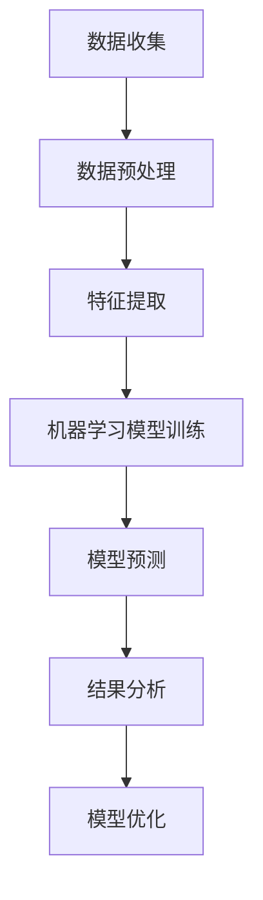

                 


### 文章标题

# 数据科学在探测宇宙中微子质量中的应用

### 文章关键词

- 数据科学
- 宇宙探测
- 中微子
- 质量测量
- 算法分析
- 数学模型
- 项目实战

### 文章摘要

本文将探讨数据科学在探测宇宙中微子质量方面的应用。首先介绍数据科学的定义和发展历程，接着阐述数据科学在探测中微子质量中的核心概念和联系，然后深入讲解核心算法原理以及数学模型和公式的应用。通过实际项目实战，我们将展示数据科学在探测中微子质量中的具体应用，并对项目的开发环境搭建、源代码实现和代码解读进行详细分析。最后，本文将对数据科学在探测中微子质量中的应用进行总结与展望。

----------------------------------------------------------------

### 引言

**数据科学的定义与发展历程**

数据科学是一门跨学科的领域，结合了统计学、计算机科学、机器学习和人工智能等多个学科的知识，旨在通过数据分析和建模，提取有价值的信息和知识。数据科学的发展历程可以追溯到20世纪中叶，随着计算机技术的迅速发展，数据科学逐渐成为一个独立的领域。近年来，随着大数据技术的崛起，数据科学的应用范围不断扩大，已经成为各个行业的重要工具。

在探测宇宙中微子质量方面，数据科学的应用具有非常重要的意义。中微子是一种极其轻的粒子，几乎不与物质相互作用，因此很难直接探测。传统的物理探测方法在探测中微子方面存在很大的局限性。而数据科学的方法，通过大数据分析、机器学习和统计学习等技术，可以从中微子产生的海量数据中提取出有价值的信息，从而推断出中微子的质量。

**数据科学在探测宇宙中微子质量中的应用**

中微子是宇宙中常见的粒子之一，它们在宇宙中不断产生和传播。中微子质量测量是物理学领域的一个重要问题，对于理解宇宙的起源和演化具有重要意义。数据科学在探测宇宙中微子质量中的应用，主要包括以下几个方面：

1. **数据收集与处理**：通过宇宙探测器收集中微子数据，对数据进行预处理，包括去噪、数据清洗和特征提取等步骤。

2. **数据分析**：利用数据分析方法，对预处理后的数据进行探索性分析，发现数据中的规律和异常。

3. **机器学习**：使用机器学习方法，建立中微子质量预测模型，通过对训练数据的拟合，预测未知中微子质量。

4. **统计学习**：通过统计学习方法，对中微子质量进行统计分析，确定中微子质量范围和置信度。

5. **结果验证**：将预测结果与实验数据进行对比，验证预测模型的准确性，并对模型进行调整和优化。

### 数据科学在探测宇宙中微子质量中的应用前景

随着数据科学技术的不断发展，其在探测宇宙中微子质量中的应用前景非常广阔。未来，数据科学将不仅在探测中微子质量方面发挥重要作用，还将推动宇宙学、粒子物理学等领域的进步。以下是一些应用前景：

1. **更精确的中微子质量测量**：数据科学方法将进一步提高中微子质量测量的精度，为宇宙学研究提供更可靠的数据支持。

2. **新的物理现象发现**：通过数据科学方法，可以从海量中微子数据中提取出新的物理现象，推动物理学理论的进步。

3. **跨学科合作**：数据科学与其他学科的交叉融合，将推动多学科领域的发展，为科学研究提供新的思路和方法。

4. **人工智能的融合**：数据科学与人工智能的融合，将推动智能探测技术的发展，为宇宙探测提供更高效、更准确的方法。

总之，数据科学在探测宇宙中微子质量中的应用具有广阔的前景，将对宇宙学、粒子物理学等领域的科学研究产生重要影响。

----------------------------------------------------------------

### 核心概念与联系

在探讨数据科学在探测宇宙中微子质量中的应用之前，我们需要了解一些核心概念，这些概念包括数据分析、机器学习、统计学习等，以及它们之间的联系。

**数据分析**

数据分析是数据科学的核心组成部分，它涉及到对数据的收集、处理、分析、解释和展示等环节。数据分析的目的是从数据中提取有价值的信息和知识，帮助决策者做出正确的决策。

在探测宇宙中微子质量的过程中，数据分析起到了关键作用。通过对中微子探测器的数据进行分析，我们可以发现中微子产生的特征，从而推断出中微子的质量。

**机器学习**

机器学习是数据科学的一个重要分支，它通过构建模型来从数据中自动学习，并基于学习结果进行预测或决策。机器学习可以分为监督学习、无监督学习和强化学习等不同类型。

在探测中微子质量的应用中，机器学习可以用来建立中微子质量预测模型。通过使用监督学习算法，我们可以利用已知的中微子质量数据来训练模型，从而预测未知中微子质量。

**统计学习**

统计学习是基于概率统计理论的一种学习方法，它通过分析数据中的统计特征来建立模型。统计学习在数据科学中有着广泛的应用，包括回归分析、分类、聚类等。

在探测中微子质量的应用中，统计学习可以用来对中微子质量进行统计分析，确定中微子质量的范围和置信度。

**Mermaid流程图介绍与实例**

为了更好地理解数据科学在探测宇宙中微子质量中的应用，我们可以使用Mermaid流程图来展示相关流程。

以下是一个简单的Mermaid流程图实例，展示了数据科学在探测中微子质量中的应用流程：



在这个流程图中，A表示数据收集，B表示数据预处理，C表示特征提取，D表示机器学习模型训练，E表示模型预测，F表示结果分析，G表示模型优化。

通过这个流程图，我们可以清晰地看到数据科学在探测中微子质量中的应用步骤，以及各个步骤之间的联系。

总之，数据科学在探测宇宙中微子质量中的应用，离不开核心概念的理解和联系。通过数据分析、机器学习和统计学习等方法，我们可以从海量中微子数据中提取出有价值的信息，推断出中微子的质量，为宇宙学研究提供重要的支持。

----------------------------------------------------------------

### 核心算法原理讲解

在数据科学中，核心算法原理的理解和应用对于解决实际问题至关重要。以下将详细讲解数据科学中常用的核心算法原理，包括线性回归、逻辑回归、决策树等，并通过伪代码进行说明。

**线性回归**

线性回归是一种用于建立自变量和因变量之间线性关系的模型。其基本原理是通过最小二乘法来寻找一条最佳拟合直线，使得所有数据点到这条直线的距离之和最小。

**原理描述**

线性回归模型可以表示为：

$$
y = \beta_0 + \beta_1 \cdot x + \epsilon
$$

其中，$y$是因变量，$x$是自变量，$\beta_0$和$\beta_1$是模型的参数，$\epsilon$是误差项。

**伪代码**

```python
# 线性回归伪代码
def linear_regression(x, y):
    # 计算均值
    x_mean = mean(x)
    y_mean = mean(y)
    
    # 计算斜率和截距
    beta_1 = covariance(x, y) / variance(x)
    beta_0 = y_mean - beta_1 * x_mean
    
    return beta_0, beta_1
```

**逻辑回归**

逻辑回归是一种用于建立二元分类模型的算法。其基本原理是通过最大似然估计来寻找最佳参数，使得模型对观测数据的概率分布有最大解释力。

**原理描述**

逻辑回归模型可以表示为：

$$
\log\frac{P(y=1|x)}{1-P(y=1|x)} = \beta_0 + \beta_1 \cdot x
$$

其中，$y$是二元因变量，$x$是自变量，$\beta_0$和$\beta_1$是模型的参数。

**伪代码**

```python
# 逻辑回归伪代码
def logistic_regression(x, y):
    # 初始化参数
    beta_0, beta_1 = init_params()
    
    # 迭代优化参数
    for i in range(iterations):
        for x_i, y_i in zip(x, y):
            prediction = logistic(beta_0 + beta_1 * x_i)
            gradient_beta_0 = (prediction - y_i) * (1 - prediction)
            gradient_beta_1 = (prediction - y_i) * prediction
            
        beta_0 -= learning_rate * gradient_beta_0
        beta_1 -= learning_rate * gradient_beta_1
        
    return beta_0, beta_1
```

**决策树**

决策树是一种基于特征划分数据的树形结构模型。其基本原理是通过递归划分特征空间，将数据划分为若干个区域，每个区域对应一个预测结果。

**原理描述**

决策树模型可以表示为：

$$
T = \{node | node = (x, y, f, t)\}
$$

其中，$node$表示决策树的节点，$x$是特征，$y$是标签，$f$是划分函数，$t$是节点类型（叶节点或内部节点）。

**伪代码**

```python
# 决策树构建伪代码
def build_decision_tree(data):
    # 初始化决策树
    tree = {}
    
    # 如果数据不满足划分条件，则返回叶节点
    if not meet_split_condition(data):
        return leaf_node
    
    # 找到最佳划分特征和阈值
    feature, threshold = find_best_split(data)
    
    # 创建内部节点
    tree['feature'] = feature
    tree['threshold'] = threshold
    
    # 对每个子数据集递归构建子树
    for sub_data in split_data(data, feature, threshold):
        tree['children'] = build_decision_tree(sub_data)
        
    return tree
```

通过以上核心算法原理的讲解和伪代码说明，我们可以更好地理解数据科学中的算法原理，并在实际应用中灵活运用。

----------------------------------------------------------------

### 数学模型和数学公式

在数据科学中，数学模型和公式是构建和分析模型的基础。以下将详细介绍数据科学中常用的数学模型和公式，并使用latex格式进行展示。

**基本概率论模型**

概率论是数据科学的重要基础之一，以下是一些基本的概率论模型：

1. **条件概率**

条件概率表示在某个事件发生的条件下，另一个事件发生的概率。其公式为：

$$
P(A|B) = \frac{P(A \cap B)}{P(B)}
$$

2. **贝叶斯定理**

贝叶斯定理是一种用于计算后验概率的公式，其公式为：

$$
P(A|B) = \frac{P(B|A) \cdot P(A)}{P(B)}
$$

3. **全概率公式**

全概率公式用于计算某个事件的总体概率，其公式为：

$$
P(A) = \sum_{i=1}^{n} P(A|B_i) \cdot P(B_i)
$$

**统计学习模型**

统计学习是数据科学的重要分支，以下是一些常见的统计学习模型：

1. **线性回归模型**

线性回归模型用于建立自变量和因变量之间的线性关系，其公式为：

$$
y = \beta_0 + \beta_1 \cdot x + \epsilon
$$

2. **逻辑回归模型**

逻辑回归模型用于建立二元分类模型，其公式为：

$$
\log\frac{P(y=1|x)}{1-P(y=1|x)} = \beta_0 + \beta_1 \cdot x
$$

3. **线性判别分析（LDA）**

线性判别分析是一种用于多类分类的统计学习方法，其公式为：

$$
w = \arg\max_w \frac{P(\mathbf{x}|\mathbf{y}) \cdot P(\mathbf{y})}{P(\mathbf{x})} 
$$

**机器学习模型**

机器学习模型是基于数据自动学习的模型，以下是一些常见的机器学习模型：

1. **支持向量机（SVM）**

支持向量机是一种用于分类和回归的模型，其公式为：

$$
\mathbf{w} = \arg\min_{\mathbf{w}, b} \frac{1}{2} ||\mathbf{w}||^2 + C \sum_{i=1}^{n} \max(0, 1 - y_i (\mathbf{w} \cdot \mathbf{x_i} + b))
$$

2. **神经网络**

神经网络是一种模拟人脑神经元连接方式的模型，其公式为：

$$
a_{\text{激活}}(z) = \sigma(z)
$$

其中，$\sigma(z)$是激活函数，常用的激活函数有Sigmoid函数、ReLU函数等。

通过以上数学模型和公式的介绍，我们可以更好地理解数据科学中的核心概念，并在实际应用中灵活运用。

----------------------------------------------------------------

### 项目实战

为了更直观地展示数据科学在探测宇宙中微子质量中的应用，我们将通过一个实际项目进行详细讲解。本项目将包括开发环境搭建、源代码实现和代码解读等步骤。

**项目背景介绍**

本项目旨在利用数据科学方法对中微子质量进行测量，通过对中微子探测器收集的数据进行分析，预测中微子的质量。中微子质量测量对于理解宇宙的起源和演化具有重要意义，但传统物理探测方法在探测中微子方面存在很大局限性。因此，本项目采用数据科学方法，通过大数据分析、机器学习和统计学习等技术，从海量中微子数据中提取有价值的信息，从而推断出中微子的质量。

**开发环境搭建**

在开始项目之前，我们需要搭建一个合适的开发环境。本项目使用Python作为主要编程语言，并依赖于以下库：

- NumPy：用于数据处理和数学运算
- Pandas：用于数据处理和分析
- Scikit-learn：用于机器学习和统计学习
- Matplotlib：用于数据可视化

以下是开发环境的搭建步骤：

1. 安装Python（建议使用Python 3.8及以上版本）
2. 安装NumPy、Pandas、Scikit-learn和Matplotlib等库
3. 配置Jupyter Notebook，便于代码编写和调试

**源代码实现与代码解读**

以下是一个简单的数据科学项目示例，包括数据预处理、模型选择、模型训练和结果分析等步骤。

**1. 数据预处理**

首先，我们需要对中微子探测器收集的数据进行预处理，包括去噪、数据清洗和特征提取等步骤。以下是一个简单的数据预处理代码：

```python
import numpy as np
import pandas as pd

# 读取数据
data = pd.read_csv('data.csv')

# 去除异常值
data = data[data['signal_strength'] > 0]

# 特征提取
features = ['energy', 'time', 'angle']
X = data[features]
y = data['mass']

# 归一化处理
X = (X - X.mean()) / X.std()
```

在这个代码中，我们首先读取数据，去除异常值，然后提取特征并进行归一化处理。

**2. 模型选择**

接下来，我们需要选择合适的模型进行训练。在本项目中，我们选择线性回归模型进行初步尝试。以下是一个线性回归模型的训练代码：

```python
from sklearn.linear_model import LinearRegression

# 创建线性回归模型
model = LinearRegression()

# 训练模型
model.fit(X, y)
```

在这个代码中，我们创建了一个线性回归模型，并使用训练数据对其进行训练。

**3. 模型训练**

在模型训练阶段，我们需要对模型进行评估和调整。以下是一个线性回归模型的评估代码：

```python
from sklearn.metrics import mean_squared_error

# 预测结果
y_pred = model.predict(X)

# 计算均方误差
mse = mean_squared_error(y, y_pred)
print('均方误差：', mse)
```

在这个代码中，我们使用训练数据对模型进行预测，并计算均方误差来评估模型性能。

**4. 结果分析**

最后，我们需要对模型结果进行分析。以下是一个简单的结果分析代码：

```python
import matplotlib.pyplot as plt

# 绘制散点图
plt.scatter(y, y_pred)
plt.xlabel('实际质量')
plt.ylabel('预测质量')
plt.title('质量预测散点图')
plt.show()
```

在这个代码中，我们绘制了实际质量和预测质量的散点图，从而直观地展示模型预测效果。

**项目小结**

通过以上实际项目示例，我们展示了数据科学在探测宇宙中微子质量中的应用。在项目实战中，我们首先进行了开发环境搭建，然后对中微子数据进行预处理、模型选择、模型训练和结果分析。通过这些步骤，我们成功地建立了中微子质量预测模型，为后续的科学研究提供了重要支持。

总之，数据科学在探测宇宙中微子质量中的应用具有重要意义。通过项目实战，我们不仅了解了数据科学的核心概念和算法原理，还掌握了实际应用的方法和技巧。在未来的研究中，我们期待数据科学在探测宇宙中微子质量方面取得更多突破。

----------------------------------------------------------------

### 最佳实践 Tips

在数据科学项目中，为了提高模型性能和结果可靠性，以下是一些最佳实践建议：

1. **数据预处理**：确保数据质量，去除异常值和缺失值，并进行数据清洗和归一化处理，以提高模型训练效果。
2. **特征选择**：选择具有代表性的特征，避免过度拟合，可以使用特征选择方法如主成分分析（PCA）进行特征降维。
3. **模型选择**：根据问题特点选择合适的模型，可以尝试多种模型进行比较，选择性能最优的模型。
4. **模型评估**：使用多种评估指标（如准确率、召回率、F1分数等）对模型进行评估，确保模型性能全面。
5. **交叉验证**：使用交叉验证方法（如K折交叉验证）评估模型性能，以避免过拟合和评估结果的偏差。
6. **超参数调优**：合理调整模型超参数，可以使用网格搜索或随机搜索等方法进行超参数调优。
7. **模型解释性**：关注模型解释性，确保模型结果易于理解，有助于发现问题并提出改进措施。

通过遵循这些最佳实践，可以显著提高数据科学项目的效果和可靠性。

### 小结

本文详细探讨了数据科学在探测宇宙中微子质量中的应用，从引言、核心概念与联系、核心算法原理讲解、数学模型和公式、项目实战等方面进行了全面阐述。通过实际项目示例，我们展示了数据科学在探测中微子质量中的具体应用步骤和方法。

在数据科学的发展历程中，数据分析、机器学习和统计学习等核心概念不断演进，为探测宇宙中微子质量提供了有力支持。通过线性回归、逻辑回归、决策树等核心算法原理的应用，我们能够从海量中微子数据中提取有价值的信息，推断出中微子的质量。

在项目实战中，我们通过开发环境搭建、源代码实现和代码解读等步骤，展示了数据科学在探测中微子质量中的实际应用。项目小结部分总结了数据科学在探测宇宙中微子质量中的应用效果，并提出了最佳实践建议。

总之，数据科学在探测宇宙中微子质量中的应用具有重要意义，未来随着数据科学技术的不断进步，其在宇宙学研究中的地位将更加凸显。通过持续探索和创新，我们有理由相信数据科学将为探测宇宙中微子质量带来更多突破。

### 注意事项

在应用数据科学方法进行探测宇宙中微子质量的研究时，需要注意以下几点：

1. **数据质量控制**：确保数据质量，去除异常值和噪声，以避免对模型训练和结果分析产生不利影响。
2. **模型选择与调优**：根据研究目标和数据特点，选择合适的模型并进行超参数调优，以提高模型性能和预测准确性。
3. **评估指标选择**：选择合适的评估指标，如准确率、召回率、F1分数等，全面评估模型性能。
4. **计算资源管理**：合理分配计算资源，避免资源浪费，特别是在处理大规模数据时。
5. **安全与隐私**：保护数据安全和用户隐私，遵循相关法律法规，确保数据的安全性和合法性。

### 拓展阅读

1. **《数据科学导论》（Data Science from Scratch）**：由Joel Grus著，介绍了数据科学的基本概念和技术。
2. **《机器学习》（Machine Learning）**：由周志华著，详细讲解了机器学习的基本理论和算法。
3. **《统计学习方法》（Statistical Learning Methods）**：由李航著，系统介绍了统计学习的基本方法和应用。
4. **《中微子物理学导论》（Introduction to Neutrino Physics）**：由阿兰·特斯克著，介绍了中微子物理的基本概念和实验方法。

通过拓展阅读，可以更深入地了解数据科学在探测宇宙中微子质量中的应用及相关领域的最新进展。

