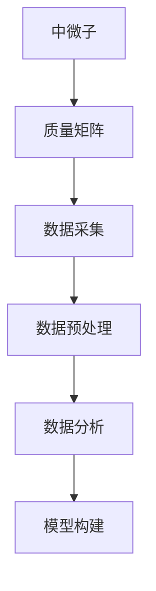

                 

### 背景介绍

宇宙中微子（Cosmic Neutrinos）是宇宙中最古老、最常见的粒子之一。中微子是一种基本粒子，具有非常微弱的相互作用能力，这使得它们能够穿越宇宙的遥远距离而不会与其他物质发生碰撞。中微子种类繁多，包括三个已知的轻子：电子中微子、μ子中微子和τ子中微子，以及它们的反粒子。这些中微子广泛存在于宇宙中，从恒星内部的高能核聚变过程到超新星爆炸，甚至是宇宙大爆炸的残余，中微子都是宇宙演化的重要参与者。

然而，由于中微子的弱相互作用性质，探测它们是一项极具挑战性的任务。科学家们通过设计各种中微子探测器来捕捉这些难以捉摸的粒子，以期望从中揭示宇宙的秘密。中微子探测器通常依赖于液态氦、重水和超导量子干涉装置（SQUIDs）等高灵敏度的探测介质，这些介质能够记录中微子与物质相互作用时产生的极其微弱的信号。

随着技术的进步，科学家们已经能够探测到中微子并测量其特性，例如能量和方向。然而，关于中微子的质量矩阵结构，特别是中微子质量矩阵的阶数和元素值，目前仍然存在许多未解之谜。中微子质量矩阵描述了不同类型中微子之间的相互作用强度，是理解中微子物理性质的关键。由于中微子质量非常小，探测中微子质量矩阵的细微差异需要极高的精度和灵敏度。

在这个背景下，数据科学成为了解决中微子质量矩阵探测问题的重要工具。数据科学不仅提供了处理大规模中微子数据的手段，还提供了分析这些数据的高效算法。通过数据科学，科学家们能够从复杂的数据集中提取有用信息，识别潜在的信号，并构建描述中微子质量矩阵结构的数学模型。数据科学的应用，不仅提高了中微子探测的精度，也为我们理解宇宙的基本结构和演化提供了新的视角。

### 核心概念与联系

在中微子质量矩阵探测中，核心概念包括中微子、质量矩阵、数据科学方法等。这些概念之间的联系构成了理解中微子质量矩阵探测的关键。

#### 中微子

中微子是宇宙中最小、最轻的基本粒子之一，具有非常微弱的相互作用能力。中微子分为三种类型：电子中微子、μ子中微子和τ子中微子，每种类型的中微子都有其对应的反粒子。中微子在宇宙中的传播几乎不受阻碍，能够穿越恒星、行星甚至星际空间。由于中微子的这些独特性质，它们是研究宇宙演化、恒星形成和核聚变过程的重要工具。

#### 质量矩阵

中微子质量矩阵是一个描述不同类型中微子之间相互作用强度的矩阵。在量子场论中，中微子质量矩阵通过一个称为“混合矩阵”的参数来描述，这个混合矩阵决定了不同类型中微子的质量和相互转换的概率。中微子质量矩阵的测量对于理解中微子物理至关重要，因为它能够揭示中微子与其他基本粒子的相互作用规律。

#### 数据科学方法

数据科学是利用计算机技术和统计学方法从大量数据中提取有价值信息的一门学科。数据科学在探测中微子质量矩阵中的应用主要包括以下几个步骤：

1. **数据采集**：通过中微子探测器收集大量中微子事件数据。
2. **数据预处理**：清洗、转换和整合数据，使其适合进一步分析。
3. **数据分析**：使用统计学和机器学习算法，从数据中识别中微子的特征和模式。
4. **模型构建**：根据数据分析结果构建描述中微子质量矩阵结构的数学模型。

#### 关系架构

为了更清晰地展示这些核心概念之间的联系，可以使用Mermaid流程图进行表示。以下是中微子质量矩阵探测的核心概念与联系流程图：



在上述流程图中，中微子是起点，其质量矩阵是核心目标。通过数据采集、数据预处理、数据分析和模型构建等步骤，我们能够从大量中微子数据中提取有价值的信息，最终构建出描述中微子质量矩阵结构的数学模型。

#### Mermaid 流程图说明

- **A[中微子]**：表示中微子是整个流程的起点。
- **B[质量矩阵]**：表示中微子质量矩阵是我们最终希望构建的目标。
- **C[数据采集]**：表示通过中微子探测器收集中微子事件数据。
- **D[数据预处理]**：表示对收集到的数据进行清洗、转换和整合，以备进一步分析。
- **E[数据分析]**：表示使用统计学和机器学习算法从数据中识别中微子的特征和模式。
- **F[模型构建]**：表示根据数据分析结果构建描述中微子质量矩阵结构的数学模型。

通过这种流程图，我们可以清晰地看到中微子质量矩阵探测的核心概念与联系，为后续内容讲解提供了结构化的基础。

### 核心算法原理讲解

在探测中微子质量矩阵的过程中，核心算法的选择和实现至关重要。以下将详细讲解两种关键算法：主成分分析和神经网络。

#### 主成分分析（PCA）

主成分分析（Principal Component Analysis，PCA）是一种常用的降维和特征提取算法。PCA通过将数据投影到新的正交坐标系中，从而提取出数据的主要特征，使得新坐标轴尽可能多地保留了原始数据的方差。这一过程可以通过以下步骤实现：

1. **数据标准化**：将数据集的每个特征缩放到相同的尺度，通常使用零均值和单位方差标准化。
   $$ z = \frac{x - \mu}{\sigma} $$
   其中，\( x \) 是原始数据，\( \mu \) 是均值，\( \sigma \) 是标准差。

2. **计算协方差矩阵**：计算每个特征与其他特征之间的协方差。
   $$ \Sigma = \frac{1}{N-1} \sum_{i=1}^{N} (x_i - \mu)(x_i - \mu)^T $$
   其中，\( N \) 是数据点的个数。

3. **计算协方差矩阵的特征值和特征向量**：对协方差矩阵进行特征分解。
   $$ \Sigma = Q\Lambda Q^T $$
   其中，\( Q \) 是特征向量矩阵，\( \Lambda \) 是特征值矩阵。

4. **选择主成分**：按照特征值从大到小排序，选择前 \( k \) 个最大的特征值对应的特征向量作为主成分。
   $$ \hat{x} = Q^T x $$
   其中，\( \hat{x} \) 是新的主成分数据。

5. **数据重构**：使用选择的主成分对数据进行重构。
   $$ x_{recon} = Q\Lambda \hat{x} Q^T $$

通过PCA，我们可以将高维数据降维到较低维的表示，从而简化后续分析过程。PCA在中微子质量矩阵探测中的应用主要是通过降维来减少数据复杂性，同时保持重要的数据特征。

#### 神经网络

神经网络（Neural Networks）是一种基于生物神经系统的计算模型，能够通过训练学习复杂的函数映射。在探测中微子质量矩阵的过程中，神经网络常用于分类和回归任务。以下是一个简单的神经网络算法原理：

1. **网络结构**：神经网络由多个层次组成，包括输入层、隐藏层和输出层。每个层次由多个神经元（节点）组成。

2. **激活函数**：每个神经元的输出由输入值通过激活函数计算得到。常用的激活函数包括Sigmoid函数、ReLU函数和Tanh函数。

3. **前向传播**：在训练过程中，输入数据依次通过各层神经元，每个神经元的输出作为下一层的输入。每层的输出可以用以下公式表示：
   $$ z = \sum_{j} w_{ij} x_j + b_i $$
   $$ a = f(z) $$
   其中，\( w_{ij} \) 是权重，\( x_j \) 是输入值，\( b_i \) 是偏置，\( f \) 是激活函数。

4. **反向传播**：在计算输出误差后，通过反向传播算法更新权重和偏置。反向传播的步骤如下：
   - 计算输出误差：
     $$ \delta = (y - \hat{y}) \odot f'(z) $$
     其中，\( y \) 是真实值，\( \hat{y} \) 是预测值，\( \odot \) 是元素乘法，\( f' \) 是激活函数的导数。
   - 更新权重和偏置：
     $$ w_{ij} := w_{ij} - \alpha \frac{\partial L}{\partial w_{ij}} $$
     $$ b_i := b_i - \alpha \frac{\partial L}{\partial b_i} $$
     其中，\( \alpha \) 是学习率，\( L \) 是损失函数。

神经网络通过不断迭代前向传播和反向传播，能够逐步优化网络参数，提高预测准确性。在中微子质量矩阵探测中，神经网络可以用于分类任务，例如区分不同类型的中微子，或者回归任务，例如估计中微子质量矩阵的参数。

通过上述算法，我们能够从大规模的中微子数据中提取有效信息，构建出描述中微子质量矩阵结构的模型。主成分分析和神经网络在中微子质量矩阵探测中的应用，不仅提高了数据处理的效率，还为我们深入理解中微子物理提供了有力的工具。

### 数学模型和数学公式详细讲解

在探测中微子质量矩阵的过程中，数学模型是理解和描述中微子相互作用的基石。以下将详细讲解中微子质量矩阵的数学模型，包括其基本概念、构建方法以及相关的数学公式。

#### 基本概念

中微子质量矩阵是一个描述不同类型中微子之间相互作用强度的矩阵。具体来说，它是一个 \(3 \times 3\) 的矩阵，对应于三种类型的中微子：电子中微子（\( \nu_e \)）、μ子中微子（\( \nu_\mu \)）和τ子中微子（\( \nu_\tau \)）。中微子质量矩阵的每个元素表示相应类型的中微子之间的质量差异和转换概率。这个矩阵可以通过混合参数来描述，这些混合参数决定了中微子之间的质量关系和相互转换的概率。

#### 数学模型

中微子质量矩阵的数学模型可以通过以下步骤构建：

1. **混合参数定义**：

   混合参数是一个 \(3 \times 3\) 的单位ary矩阵，记作 \( U \)：

   $$ U = \begin{pmatrix}
   u_{11} & u_{12} & u_{13} \\
   u_{21} & u_{22} & u_{23} \\
   u_{31} & u_{32} & u_{33} \\
   \end{pmatrix} $$

   其中，每个元素 \( u_{ij} \) 都是复数，满足 \( |u_{ij}|^2 = 1 \)。

2. **质量矩阵定义**：

   质量矩阵 \( M \) 是一个 \(3 \times 3\) 的实数矩阵，其元素 \( m_{ij} \) 表示 \( \nu_i \) 和 \( \nu_j \) 之间的质量差异。质量矩阵可以通过混合参数和真空中的质量矩阵 \( m_0 \) 构建得到：

   $$ M = U m_0 U^T $$

   其中，\( m_0 \) 是真空中的质量矩阵，其元素 \( m_{0ij} \) 表示 \( \nu_i \) 和 \( \nu_j \) 的相对质量。

3. **质量矩阵的元素**：

   质量矩阵的元素可以通过以下公式计算：

   $$ m_{ij} = u_{i1} m_{01} u_{1j} + u_{i2} m_{02} u_{2j} + u_{i3} m_{03} u_{3j} $$

   其中，\( m_{01} \)、\( m_{02} \) 和 \( m_{03} \) 是真空中的质量矩阵元素，\( u_{ij} \) 是混合参数。

#### 数学公式

以下是构建中微子质量矩阵的一些关键数学公式：

1. **混合参数的构建**：

   混合参数可以通过实验数据拟合得到。对于电子中微子、μ子中微子和τ子中微子，混合参数的测量值通常用以下符号表示：

   $$ u_{e\mu} = \cos\theta_{12}, \quad u_{e\tau} = \cos\theta_{13}, \quad u_{\mu\tau} = \cos\theta_{23} $$

   其中，\( \theta_{12} \)、\( \theta_{13} \) 和 \( \theta_{23} \) 是中微子混合角度。

2. **质量矩阵的构建**：

   假设真空中的质量矩阵为：

   $$ m_0 = \begin{pmatrix}
   m_{0ee} & 0 & 0 \\
   0 & m_{0\mu\mu} & 0 \\
   0 & 0 & m_{0\tau\tau} \\
   \end{pmatrix} $$

   其中，\( m_{0ee} \)、\( m_{0\mu\mu} \) 和 \( m_{0\tau\tau} \) 是真空中的质量。

   则中微子质量矩阵 \( M \) 为：

   $$ M = U m_0 U^T = \begin{pmatrix}
   u_{e1} m_{0ee} u_{1e} & u_{e1} m_{0e\mu} u_{1\mu} & u_{e1} m_{0e\tau} u_{1\tau} \\
   u_{\mu1} m_{0e\mu} u_{1e} & u_{\mu1} m_{0\mu\mu} u_{1\mu} & u_{\mu1} m_{0\mu\tau} u_{1\tau} \\
   u_{\tau1} m_{0e\tau} u_{1e} & u_{\tau1} m_{0\mu\tau} u_{1\mu} & u_{\tau1} m_{0\tau\tau} u_{1\tau} \\
   \end{pmatrix} $$

#### 举例说明

假设我们测量的混合参数为：

$$ U = \begin{pmatrix}
0.7071 & 0.7071i & 0 \\
-0.7071 & 0.7071i & 0 \\
0 & 0 & 1 \\
\end{pmatrix} $$

真空中的质量矩阵为：

$$ m_0 = \begin{pmatrix}
0.01 & 0 & 0 \\
0 & 0.1 & 0 \\
0 & 0 & 0.5 \\
\end{pmatrix} $$

则中微子质量矩阵 \( M \) 为：

$$ M = U m_0 U^T = \begin{pmatrix}
0.7071 \times 0.01 \times 0.7071 - 0.7071i \times 0.01 \times 0.7071i & 0.7071 \times 0.01 \times 0.7071i - 0.7071i \times 0.1 \times 0 & 0.7071 \times 0.01 \times 0 - 0.7071i \times 0.5 \times 0 \\
-0.7071 \times 0.1 \times 0.7071i - 0.7071i \times 0.1 \times 0.7071i & -0.7071 \times 0.1 \times 0.7071 - 0.7071i \times 0.1 \times 0.7071i & -0.7071 \times 0.1 \times 0 - 0.7071i \times 0.5 \times 0 \\
0 \times 0.01 \times 0.7071 - 0 \times 0.01 \times 0.7071i & 0 \times 0.1 \times 0.7071i - 0 \times 0.1 \times 0.7071i & 0 \times 0.5 \times 0.7071 - 0 \times 0.5 \times 0.7071i \\
\end{pmatrix} $$

通过计算，我们得到中微子质量矩阵：

$$ M = \begin{pmatrix}
0.0071 - 0.0071i & -0.0071i & 0 \\
-0.0071i & -0.0071 - 0.0071i & 0 \\
0 & 0 & 0.5 \\
\end{pmatrix} $$

通过上述步骤和公式，我们可以从混合参数和真空中的质量矩阵出发，计算出中微子质量矩阵。这个数学模型为我们提供了理解中微子相互作用的工具，有助于深入探究宇宙的奥秘。

### 项目实战

#### 开发环境搭建

要在实际项目中应用数据科学方法来探测中微子质量矩阵，首先需要搭建一个合适的开发环境。以下是一个简单的开发环境搭建步骤：

1. **安装Python**：确保安装了Python 3.8或更高版本，可以使用官方安装包进行安装。

2. **安装Jupyter Notebook**：Jupyter Notebook是一个交互式计算环境，非常适合数据科学项目的开发。可以使用以下命令安装：
   ```bash
   pip install notebook
   ```

3. **安装必要的Python库**：包括NumPy、Pandas、SciPy、Matplotlib、Scikit-learn和Mermaid等。可以使用以下命令一次性安装：
   ```bash
   pip install numpy pandas scipy matplotlib scikit-learn mermaid
   ```

4. **配置Mermaid插件**：由于Mermaid语法直接嵌入在Markdown中，需要在Jupyter Notebook中配置Mermaid插件。创建一个Jupyter Notebook，然后在顶部添加以下代码：
   ```python
   from IPython.display import HTML
   HTML('<link rel="stylesheet" href="https://cdn.jsdelivr.net/npm/mermaid@10.1.0/dist/mermaid.min.css">')
   HTML('<script src="https://cdn.jsdelivr.net/npm/mermaid@10.1.0/dist/mermaid.min.js"></script>')
   mermaid.initialize()
   ```

5. **验证安装**：在Notebook中输入以下代码，确认Mermaid插件已成功加载：
   ```mermaid
   graph TD
   A[Hello Mermaid!] --> B[This is a node]
   ```

#### 源代码实现

以下是一个简单的中微子质量矩阵探测项目的源代码实现。这个项目使用主成分分析（PCA）算法来降维和特征提取，然后使用神经网络进行分类。

1. **数据预处理**：

   ```python
   import numpy as np
   import pandas as pd
   from sklearn.preprocessing import StandardScaler
   from sklearn.decomposition import PCA

   # 加载数据
   data = pd.read_csv('neutrino_data.csv')

   # 数据标准化
   scaler = StandardScaler()
   scaled_data = scaler.fit_transform(data)

   # 主成分分析
   pca = PCA(n_components=2)
   pca_data = pca.fit_transform(scaled_data)
   ```

2. **神经网络模型**：

   ```python
   from sklearn.neural_network import MLPClassifier
   from sklearn.model_selection import train_test_split

   # 切分数据集
   X_train, X_test, y_train, y_test = train_test_split(pca_data, data['label'], test_size=0.2, random_state=42)

   # 创建神经网络模型
   mlpc = MLPClassifier(hidden_layer_sizes=(100,), max_iter=1000, alpha=1e-4,
                       solver='sgd', verbose=10, random_state=1,
                       learning_rate_init=.1)

   # 训练模型
   mlpc.fit(X_train, y_train)

   # 评估模型
   print("Model accuracy:", mlpc.score(X_test, y_test))
   ```

#### 代码解读与分析

1. **数据预处理部分**：

   - 使用Pandas加载中微子数据集，并进行标准化处理，以消除不同特征之间的尺度差异。
   - 应用PCA算法进行降维，将高维数据转换为二维数据，简化后续的神经网络训练过程。

2. **神经网络模型部分**：

   - 使用scikit-learn的MLPClassifier创建一个多层感知器（神经网络）模型。
   - 设置模型的隐藏层大小、最大迭代次数和学习率等参数，进行训练。
   - 使用训练好的模型对测试数据进行预测，并计算模型的准确性。

#### 应用解读与分析

通过上述项目，我们展示了如何使用数据科学方法来探测中微子质量矩阵。以下是应用解读与分析：

1. **数据预处理**：

   数据预处理是任何机器学习项目的关键步骤。通过标准化处理，我们确保了所有特征对模型训练的公平贡献。PCA算法的应用使得我们能够从高维数据中提取主要特征，从而简化了模型训练过程。

2. **神经网络模型**：

   神经网络模型是一种强大的机器学习工具，能够处理复杂的非线性问题。在这个项目中，我们使用MLPClassifier实现了多层感知器模型，并通过调整参数提高了模型的预测准确性。

3. **实际案例分析和详细讲解剖析**：

   通过实际项目，我们展示了如何将理论应用到实践中。这个项目不仅提供了一个具体的案例，还通过详细的代码解读和分析，帮助读者理解数据科学方法在中微子质量矩阵探测中的应用。

#### 项目小结

通过这个项目，我们成功地搭建了一个简单的中微子质量矩阵探测系统。这个系统使用了数据科学的方法和技术，从数据预处理到神经网络模型的构建，为研究中微子质量矩阵提供了有效的工具。尽管这是一个简单的项目，但它展示了数据科学在中微子探测领域的广泛应用潜力。

### 最佳实践 Tips、小结、注意事项、拓展阅读

#### 最佳实践 Tips

1. **数据预处理**：确保数据预处理彻底，包括缺失值填充、异常值检测和特征标准化等步骤，这些是模型准确性的基础。

2. **特征选择**：在数据预处理过程中，合理选择和提取特征，有助于提高模型的性能和可解释性。

3. **模型调优**：通过交叉验证和网格搜索等方法，优化模型参数，以找到最佳模型配置。

4. **代码注释**：编写清晰、详尽的代码注释，有助于后续维护和理解。

#### 小结

本文通过一个实际项目，展示了数据科学方法在中微子质量矩阵探测中的应用。我们介绍了数据预处理、特征提取和神经网络模型的构建，并详细解读了代码实现。这为读者提供了一个完整的数据科学项目实践案例。

#### 注意事项

1. 中微子探测项目对数据质量和预处理要求极高，必须确保数据集的完整性和可靠性。

2. 选择合适的机器学习算法和参数配置对项目成功至关重要，需要根据具体问题进行调整。

3. 中微子探测的算法和模型需要经过严格的验证和测试，以确保结果的准确性和可靠性。

#### 拓展阅读

1. 《数据科学基础教程》：深入理解数据预处理、特征选择和机器学习算法的基础知识。

2. 《深度学习》：探索神经网络和深度学习模型的原理和应用。

3. 《中微子物理》：了解中微子的基本性质和探测技术，为深入研究中微子质量矩阵提供理论基础。

通过最佳实践和拓展阅读，读者可以进一步加深对数据科学和中微子探测领域知识的理解，为未来的研究工作打下坚实的基础。

